# Vellum Assistant — Architecture

## System Overview


```mermaid
graph TB
    subgraph "macOS Menu Bar App (Swift)"
        UI["UI Layer<br/>NSStatusItem + Popover<br/>SessionOverlay / ThinkingIndicator<br/>Onboarding / Settings"]
        TI["TaskInputView<br/>Text + Voice + Attachments"]
        CLS["Classifier<br/>Haiku direct call<br/>+ heuristic fallback"]

        subgraph "Computer Use Session"
            PERCEIVE["PERCEIVE<br/>AX Tree + Screenshot<br/>(parallel capture)"]
            VERIFY["VERIFY<br/>ActionVerifier<br/>safety checks"]
            EXECUTE["EXECUTE<br/>ActionExecutor<br/>CGEvent injection"]
            WAIT["WAIT<br/>Adaptive UI settle<br/>AX tree polling"]
        end

        subgraph "Ambient Agent"
            WATCH["Watch Loop<br/>every 30s"]
            AX_CAP["AX Capture<br/>shallow tree depth 4"]
            OCR_CAP["Screenshot + OCR<br/>Vision framework fallback"]
            KNOWLEDGE["KnowledgeStore<br/>JSON file, max 500"]
            INSIGHT_CRON["KnowledgeCron<br/>every 5 observations<br/>Haiku direct call"]
            INSIGHT_STORE["InsightStore<br/>JSON file, max 50"]
        end

        subgraph "Text Q&A Session"
            TEXT_SESS["TextSession<br/>streaming deltas"]
            TEXT_WIN["TextResponseWindow"]
        end

        subgraph "Main Window Chat"
            CHAT_VM["ChatViewModel<br/>session bootstrap + streaming"]
            CHAT_VIEW["ChatView<br/>bubbles + composer + stop"]
        end

        subgraph "Debug Panel"
            TRACE_STORE["TraceStore<br/>in-memory, per-session<br/>dedup + retention cap"]
            DEBUG_PANEL["DebugPanel UI<br/>metrics strip + timeline"]
        end

        subgraph "Dynamic Workspace"
            SURFACE_MGR["SurfaceManager<br/>route by display field"]
            WORKSPACE["WorkspaceView<br/>toolbar + WKWebView + composer"]
            DYN_PAGE["DynamicPageSurfaceView<br/>WKWebView + widget injection"]
        end

        VOICE["VoiceInputManager<br/>Fn hold → SFSpeechRecognizer"]
        ATTACH["Attachment System<br/>images, PDFs, text<br/>drag/drop, paste, picker"]
        PERM["PermissionManager<br/>Accessibility, Screen Recording,<br/>Microphone"]
    end

    subgraph "Daemon (Bun + TypeScript)"
        IPC_SERVER["DaemonServer<br/>Unix socket IPC<br/>~/.vellum/vellum.sock"]
        HANDLERS["Message Handlers<br/>session routing"]
        SESSION_MGR["Session Manager<br/>in-memory pool<br/>stale eviction"]

        subgraph "Inference"
            ANTHROPIC["Anthropic Claude<br/>primary provider"]
            OPENAI["OpenAI<br/>secondary provider"]
            GEMINI["Google Gemini<br/>secondary provider"]
            OLLAMA["Ollama<br/>local models"]
        end

        subgraph "Memory System"
            CONV_STORE["ConversationStore<br/>Drizzle ORM CRUD"]
            INDEXER["Memory Indexer<br/>segment + extract"]
            RECALL["Memory Recall<br/>FTS5 + Qdrant + Entity Graph + RRF<br/>Trust + Freshness + Scope"]
            JOBS_WORKER["MemoryJobsWorker<br/>poll every 1.5s"]
        end

        subgraph "SQLite Database (~/.vellum/data/db/assistant.db)"
            DB_CONV["conversations"]
            DB_MSG["messages"]
            DB_TOOL["tool_invocations"]
            DB_SEG["memory_segments"]
            DB_FTS["memory_segment_fts (FTS5)"]
            DB_ITEMS["memory_items"]
            DB_SRC["memory_item_sources"]
            DB_ENT["memory_entities"]
            DB_REL["memory_entity_relations"]
            DB_ITEM_ENT["memory_item_entities"]
            DB_SUM["memory_summaries"]
            DB_EMB["memory_embeddings"]
            DB_JOBS["memory_jobs"]
            DB_ATTACH["attachments"]
            DB_CHAN["channel_inbound_events"]
            DB_KEYS["conversation_keys"]
        end

        subgraph "Tracing"
            TRACE_EMITTER["TraceEmitter<br/>per-session, monotonic seq"]
            TOOL_TRACE["ToolTraceListener<br/>event bus subscriber"]
            EVENT_BUS["EventBus<br/>domain events"]
        end

        HTTP_SERVER["RuntimeHttpServer<br/>(optional, RUNTIME_HTTP_PORT)"]
    end

    subgraph "Gateway (Bun + TypeScript)"
        GW_WEBHOOK["Telegram Webhook<br/>/webhooks/telegram"]
        GW_VERIFY["Verify Secret<br/>x-telegram-bot-api-secret-token"]
        GW_NORMALIZE["Normalize Message<br/>DM text only (v1)"]
        GW_ROUTE["Route Resolver<br/>chat_id → user_id → default"]
        GW_FORWARD["Runtime Client<br/>POST /channels/inbound"]
        GW_REPLY["Send Reply<br/>Telegram sendMessage"]
        GW_ATTACH["Send Attachments<br/>sendPhoto / sendDocument"]
        GW_PROXY["Runtime Proxy<br/>(optional, bearer auth)"]
        GW_PROBES["/healthz + /readyz<br/>k8s liveness/readiness"]
    end

    subgraph "Web Server (Next.js + React)"
        WEB_UI["Web Dashboard<br/>React 19"]
        WEB_API["API Routes"]

        subgraph "PostgreSQL (Drizzle ORM)"
            PG_ASST["assistants"]
            PG_CHAN["assistant_channel_accounts"]
            PG_CONTACT["assistant_channel_contacts"]
            PG_USER["user / session / account"]
            PG_TOKENS["assistant_auth_tokens"]
            PG_APIKEYS["api_keys"]
        end

        LOCAL_IPC["LocalDaemonClient<br/>Unix socket proxy"]
        RUNTIME_CLIENT["RuntimeClient<br/>HTTP proxy"]
    end

    subgraph "macOS Local Storage"
        KEYCHAIN["Keychain<br/>API key storage"]
        USERDEFAULTS["UserDefaults<br/>preferences / state"]
        APP_SUPPORT["~/Library/App Support/<br/>vellum-assistant/"]
        KNOWLEDGE_JSON["knowledge.json"]
        INSIGHTS_JSON["insights.json"]
        SESSION_LOGS["logs/session-*.json"]
    end

    %% User input flows
    TI -->|"task_submit<br/>(source='text')"| CLS
    VOICE -->|"task_submit<br/>(source='voice')"| TEXT_SESS
    ATTACH -->|"validated files"| TI
    CLS -->|"computerUse"| PERCEIVE
    CLS -->|"textQA"| TEXT_SESS

    %% Text Q&A → CU escalation
    TEXT_SESS -.->|"request_computer_control<br/>(explicit user request)"| PERCEIVE

    %% Computer Use loop
    PERCEIVE -->|"CuObservationMessage"| IPC_SERVER
    IPC_SERVER -->|"CuActionMessage"| VERIFY
    VERIFY -->|"allowed"| EXECUTE
    VERIFY -->|"needsConfirmation"| UI
    UI -->|"approved"| EXECUTE
    VERIFY -->|"blocked"| PERCEIVE
    EXECUTE --> WAIT
    WAIT --> PERCEIVE

    %% Text Q&A flow
    TEXT_SESS -->|"SessionCreate +<br/>UserMessage"| IPC_SERVER
    IPC_SERVER -->|"AssistantTextDelta<br/>stream"| TEXT_WIN

    %% Main Window Chat flow
    CHAT_VM -->|"session_create +<br/>user_message +<br/>cancel"| IPC_SERVER
    IPC_SERVER -->|"session_info +<br/>text deltas +<br/>message_complete +<br/>session_error +<br/>message_queued +<br/>message_dequeued +<br/>generation_handoff"| CHAT_VM
    CHAT_VIEW --> CHAT_VM

    %% Ambient flow
    WATCH --> AX_CAP
    WATCH -.->|"fallback"| OCR_CAP
    AX_CAP -->|"AmbientObservation"| IPC_SERVER
    OCR_CAP -->|"AmbientObservation"| IPC_SERVER
    IPC_SERVER -->|"AmbientResult<br/>observe"| KNOWLEDGE
    IPC_SERVER -->|"AmbientResult<br/>suggest"| UI
    KNOWLEDGE --> INSIGHT_CRON
    INSIGHT_CRON --> INSIGHT_STORE

    %% Dynamic Workspace flow
    IPC_SERVER -->|"ui_surface_show"| SURFACE_MGR
    SURFACE_MGR -->|"display != inline<br/>.openDynamicWorkspace"| WORKSPACE
    WORKSPACE --> DYN_PAGE
    DYN_PAGE -->|"vellumBridge<br/>actions + data RPC"| IPC_SERVER

    %% Daemon internals
    IPC_SERVER --> HANDLERS
    HANDLERS --> SESSION_MGR
    SESSION_MGR --> ANTHROPIC
    SESSION_MGR --> OPENAI
    SESSION_MGR --> GEMINI
    SESSION_MGR --> OLLAMA
    SESSION_MGR --> CONV_STORE
    CONV_STORE --> DB_CONV
    CONV_STORE --> DB_MSG
    CONV_STORE --> DB_TOOL
    CONV_STORE --> DB_ATTACH
    INDEXER --> DB_SEG
    INDEXER --> DB_FTS
    INDEXER --> DB_ITEMS
    INDEXER --> DB_SRC
    INDEXER --> DB_JOBS
    JOBS_WORKER --> DB_JOBS
    JOBS_WORKER --> DB_EMB
    JOBS_WORKER --> DB_ENT
    JOBS_WORKER --> DB_REL
    JOBS_WORKER --> DB_ITEM_ENT
    JOBS_WORKER --> DB_SUM
    RECALL --> DB_FTS
    RECALL --> DB_EMB

    %% Gateway flow — Telegram path
    GW_WEBHOOK --> GW_VERIFY
    GW_VERIFY --> GW_NORMALIZE
    GW_NORMALIZE --> GW_ROUTE
    GW_ROUTE --> GW_FORWARD
    GW_FORWARD -->|"HTTP"| HTTP_SERVER
    GW_REPLY -->|"Telegram API"| GW_WEBHOOK
    GW_ATTACH -->|"download from runtime<br/>+ upload to Telegram"| GW_WEBHOOK

    %% Gateway flow — Runtime proxy path (optional)
    GW_PROXY -->|"HTTP (forwarded)"| HTTP_SERVER

    %% Web server
    WEB_API -->|"local mode"| LOCAL_IPC
    LOCAL_IPC -->|"Unix socket"| IPC_SERVER
    WEB_API -->|"cloud mode"| RUNTIME_CLIENT
    RUNTIME_CLIENT -->|"HTTP"| HTTP_SERVER

    %% Tracing data flow
    SESSION_MGR --> TRACE_EMITTER
    EVENT_BUS --> TOOL_TRACE
    TOOL_TRACE --> TRACE_EMITTER
    TRACE_EMITTER -->|"trace_event"| IPC_SERVER
    IPC_SERVER -->|"trace_event"| TRACE_STORE
    TRACE_STORE --> DEBUG_PANEL

    %% Local storage
    KNOWLEDGE --> KNOWLEDGE_JSON
    INSIGHT_STORE --> INSIGHTS_JSON
    APP_SUPPORT --- KNOWLEDGE_JSON
    APP_SUPPORT --- INSIGHTS_JSON
    APP_SUPPORT --- SESSION_LOGS

    classDef swift fill:#f9a825,stroke:#f57f17,color:#000
    classDef daemon fill:#42a5f5,stroke:#1565c0,color:#000
    classDef db fill:#66bb6a,stroke:#2e7d32,color:#000
    classDef web fill:#ab47bc,stroke:#6a1b9a,color:#fff
    classDef storage fill:#78909c,stroke:#37474f,color:#fff
    classDef provider fill:#ef5350,stroke:#c62828,color:#fff
```

---

## Data Persistence — Where Everything Lives

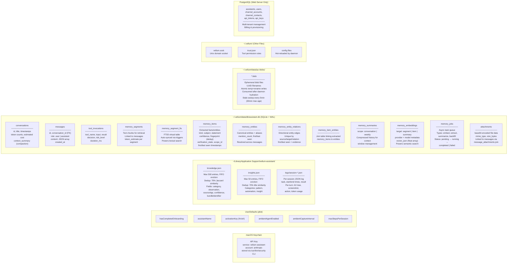
```mermaid
graph LR
    subgraph "macOS Keychain"
        K1["API Key<br/>service: vellum-assistant<br/>account: anthropic<br/>stored via /usr/bin/security CLI"]
    end

    subgraph "UserDefaults (plist)"
        UD1["hasCompletedOnboarding"]
        UD2["assistantName"]
        UD3["activationKey (fn/ctrl)"]
        UD4["ambientAgentEnabled"]
        UD5["ambientCaptureInterval"]
        UD6["maxStepsPerSession"]
    end

    subgraph "~/Library/Application Support/vellum-assistant/"
        direction TB
        KJ["knowledge.json<br/>───────────────<br/>Max 500 entries, FIFO eviction<br/>Dedup: 70% Jaccard similarity<br/>Fields: category, observation,<br/>sourceApp, confidence,<br/>bundleIdentifier"]
        IJ["insights.json<br/>───────────────<br/>Max 50 entries, FIFO eviction<br/>Dedup: 70% title similarity<br/>Categories: pattern,<br/>automation, insight"]
        SL["logs/session-*.json<br/>───────────────<br/>Per-session JSON log<br/>task, start/end times, result<br/>Per-turn: AX tree, screenshot,<br/>action, token usage"]
    end

    subgraph "~/.vellum/data/db/assistant.db (SQLite + WAL)"
        direction TB
        CONV["conversations<br/>───────────────<br/>id, title, timestamps<br/>token counts, estimated cost<br/>context_summary (compaction)"]
        MSG["messages<br/>───────────────<br/>id, conversation_id (FK)<br/>role: user | assistant<br/>content: JSON array<br/>created_at"]
        TOOL["tool_invocations<br/>───────────────<br/>tool_name, input, result<br/>decision, risk_level<br/>duration_ms"]
        SEG["memory_segments<br/>───────────────<br/>Text chunks for retrieval<br/>Linked to messages<br/>token_estimate per segment"]
        FTS["memory_segment_fts<br/>───────────────<br/>FTS5 virtual table<br/>Auto-synced via triggers<br/>Powers lexical search"]
        ITEMS["memory_items<br/>───────────────<br/>Extracted facts/entities<br/>kind, subject, statement<br/>confidence, fingerprint (dedup)<br/>verification_state, scope_id<br/>first/last seen timestamps"]
        ENTITIES["memory_entities<br/>───────────────<br/>Canonical entities + aliases<br/>mention_count, first/last seen<br/>Resolved across messages"]
        RELS["memory_entity_relations<br/>───────────────<br/>Directional entity edges<br/>Unique by source/target/relation<br/>first/last seen + evidence"]
        ITEM_ENTS["memory_item_entities<br/>───────────────<br/>Join table linking extracted<br/>memory_items to entities"]
        SUM["memory_summaries<br/>───────────────<br/>scope: conversation | weekly<br/>Compressed history for context<br/>window management"]
        EMB["memory_embeddings<br/>───────────────<br/>target: segment | item | summary<br/>provider + model metadata<br/>vector_json (float array)<br/>Powers semantic search"]
        JOBS["memory_jobs<br/>───────────────<br/>Async task queue<br/>Types: embed, extract,<br/>summarize, backfill<br/>Status: pending → running →<br/>completed | failed"]
        ATT["attachments<br/>───────────────<br/>base64-encoded file data<br/>mime_type, size_bytes<br/>Linked to messages via<br/>message_attachments join"]
    end

    subgraph "~/.vellum/data/ipc-blobs/"
        BLOBS["*.blob<br/>───────────────<br/>Ephemeral blob files<br/>UUID filenames<br/>Atomic temp+rename writes<br/>Consumed after daemon hydration<br/>Stale sweep every 5min (30min max age)"]
    end

    subgraph "~/.vellum/ (Other Files)"
        SOCK["vellum.sock<br/>Unix domain socket"]
        TRUST["trust.json<br/>Tool permission rules"]
        CONFIG["config files<br/>Hot-reloaded by daemon"]
    end

    subgraph "PostgreSQL (Web Server Only)"
        PG["assistants, users,<br/>channel_accounts,<br/>channel_contacts,<br/>api_tokens, api_keys<br/>───────────────<br/>Multi-tenant management<br/>Billing & provisioning"]
    end
```

---

## Computer Use Session — Detailed Data Flow

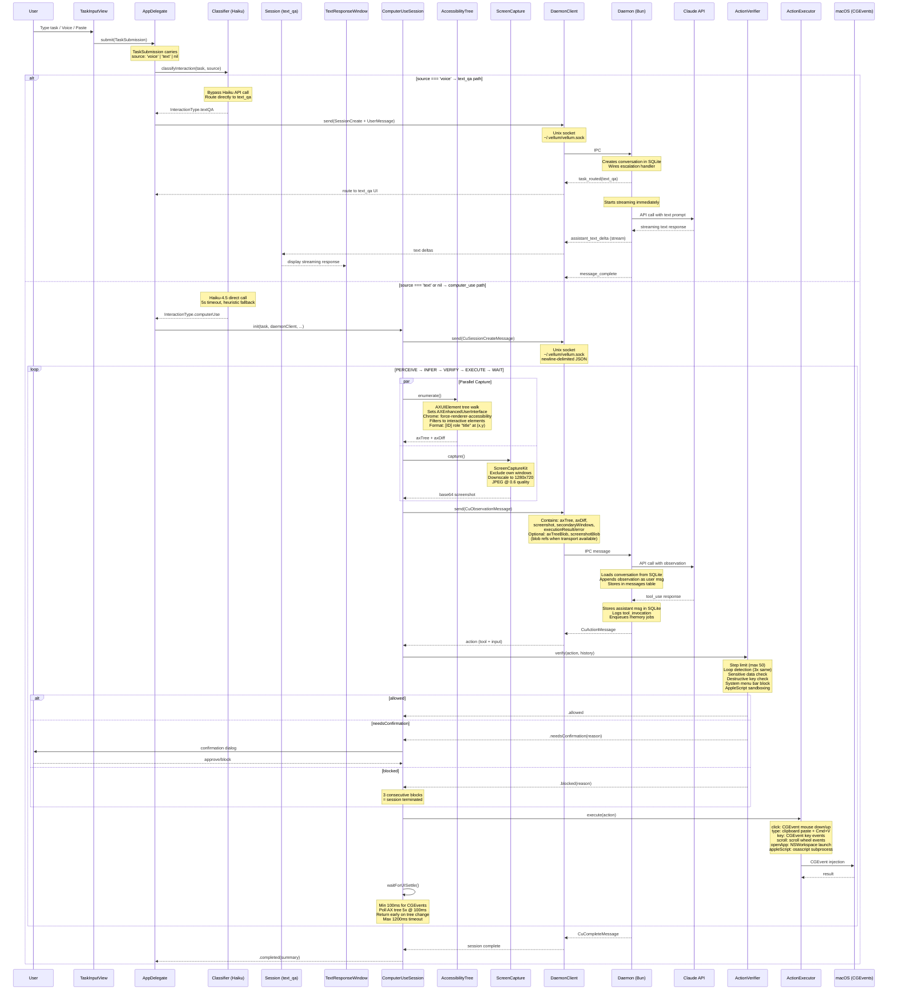
```mermaid
sequenceDiagram
    participant User
    participant UI as TaskInputView
    participant AD as AppDelegate
    participant CLS as Classifier (Haiku)
    participant TextSess as Session (text_qa)
    participant TW as TextResponseWindow
    participant Session as ComputerUseSession
    participant AX as AccessibilityTree
    participant SC as ScreenCapture
    participant DC as DaemonClient
    participant Daemon as Daemon (Bun)
    participant Claude as Claude API
    participant AV as ActionVerifier
    participant AE as ActionExecutor
    participant macOS as macOS (CGEvents)

    User->>UI: Type task / Voice / Paste
    UI->>AD: submit(TaskSubmission)
    Note over AD: TaskSubmission carries<br/>source: 'voice' | 'text' | nil
    AD->>CLS: classifyInteraction(task, source)

    alt source === 'voice' → text_qa path
        Note over CLS: Bypass Haiku API call<br/>Route directly to text_qa
        CLS-->>AD: InteractionType.textQA
        AD->>DC: send(SessionCreate + UserMessage)
        Note over DC: Unix socket<br/>~/.vellum/vellum.sock
        DC->>Daemon: IPC
        Note over Daemon: Creates conversation in SQLite<br/>Wires escalation handler
        Daemon-->>DC: task_routed(text_qa)
        DC-->>AD: route to text_qa UI
        Note over Daemon: Starts streaming immediately
        Daemon->>Claude: API call with text prompt
        Claude-->>Daemon: streaming text response
        Daemon-->>DC: assistant_text_delta (stream)
        DC-->>TextSess: text deltas
        TextSess-->>TW: display streaming response
        Daemon-->>DC: message_complete

    else source === 'text' or nil → computer_use path
        Note over CLS: Haiku-4.5 direct call<br/>5s timeout, heuristic fallback
        CLS-->>AD: InteractionType.computerUse

        AD->>Session: init(task, daemonClient, ...)
        Session->>DC: send(CuSessionCreateMessage)
        Note over DC: Unix socket<br/>~/.vellum/vellum.sock<br/>newline-delimited JSON

        loop PERCEIVE → INFER → VERIFY → EXECUTE → WAIT
            par Parallel Capture
                Session->>AX: enumerate()
                Note over AX: AXUIElement tree walk<br/>Sets AXEnhancedUserInterface<br/>Chrome: force-renderer-accessibility<br/>Filters to interactive elements<br/>Format: [ID] role "title" at (x,y)
                AX-->>Session: axTree + axDiff
            and
                Session->>SC: capture()
                Note over SC: ScreenCaptureKit<br/>Exclude own windows<br/>Downscale to 1280x720<br/>JPEG @ 0.6 quality
                SC-->>Session: base64 screenshot
            end

            Session->>DC: send(CuObservationMessage)
            Note over DC: Contains: axTree, axDiff,<br/>screenshot, secondaryWindows,<br/>executionResult/error<br/>Optional: axTreeBlob, screenshotBlob<br/>(blob refs when transport available)

            DC->>Daemon: IPC message
            Daemon->>Claude: API call with observation
            Note over Daemon: Loads conversation from SQLite<br/>Appends observation as user msg<br/>Stores in messages table
            Claude-->>Daemon: tool_use response
            Note over Daemon: Stores assistant msg in SQLite<br/>Logs tool_invocation<br/>Enqueues memory jobs
            Daemon-->>DC: CuActionMessage

            DC-->>Session: action (tool + input)

            Session->>AV: verify(action, history)
            Note over AV: Step limit (max 50)<br/>Loop detection (3x same)<br/>Sensitive data check<br/>Destructive key check<br/>System menu bar block<br/>AppleScript sandboxing

            alt allowed
                AV-->>Session: .allowed
            else needsConfirmation
                AV-->>Session: .needsConfirmation(reason)
                Session->>User: confirmation dialog
                User-->>Session: approve/block
            else blocked
                AV-->>Session: .blocked(reason)
                Note over Session: 3 consecutive blocks<br/>= session terminated
            end

            Session->>AE: execute(action)
            Note over AE: click: CGEvent mouse down/up<br/>type: clipboard paste + Cmd+V<br/>key: CGEvent key events<br/>scroll: scroll wheel events<br/>openApp: NSWorkspace launch<br/>appleScript: osascript subprocess

            AE->>macOS: CGEvent injection
            macOS-->>AE: result

            Session->>Session: waitForUISettle()
            Note over Session: Min 100ms for CGEvents<br/>Poll AX tree 5x @ 100ms<br/>Return early on tree change<br/>Max 1200ms timeout
        end

        Daemon-->>DC: CuCompleteMessage
        DC-->>Session: session complete
        Session-->>AD: .completed(summary)
    end
```

---

## Ambient Agent — Detailed Data Flow

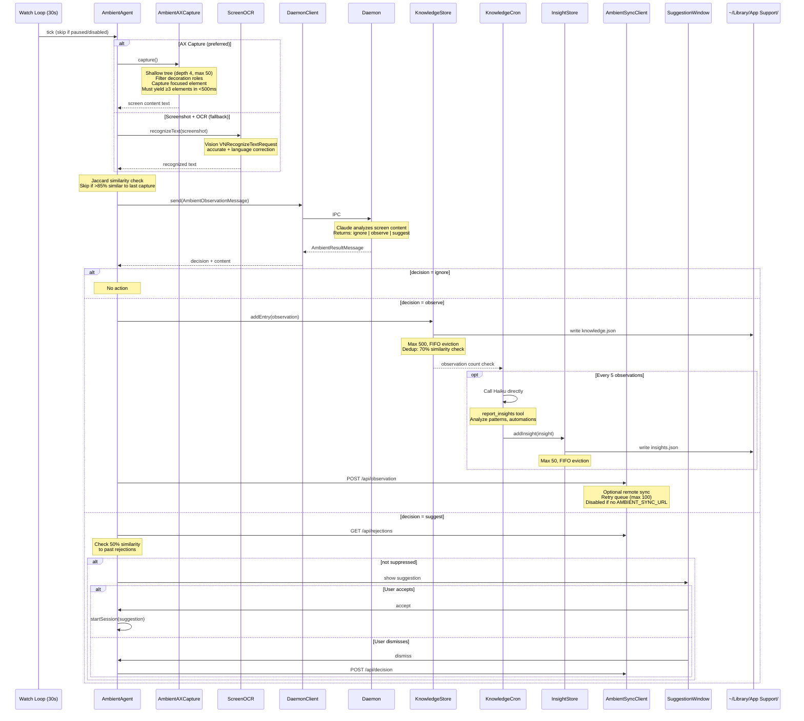
```mermaid
sequenceDiagram
    participant Timer as Watch Loop (30s)
    participant Agent as AmbientAgent
    participant AXC as AmbientAXCapture
    participant OCR as ScreenOCR
    participant DC as DaemonClient
    participant Daemon as Daemon
    participant KS as KnowledgeStore
    participant KC as KnowledgeCron
    participant IS as InsightStore
    participant Sync as AmbientSyncClient
    participant UI as SuggestionWindow
    participant FS as ~/Library/App Support/

    Timer->>Agent: tick (skip if paused/disabled)

    alt AX Capture (preferred)
        Agent->>AXC: capture()
        Note over AXC: Shallow tree (depth 4, max 50)<br/>Filter decoration roles<br/>Capture focused element<br/>Must yield ≥3 elements in <500ms
        AXC-->>Agent: screen content text
    else Screenshot + OCR (fallback)
        Agent->>OCR: recognizeText(screenshot)
        Note over OCR: Vision VNRecognizeTextRequest<br/>accurate + language correction
        OCR-->>Agent: recognized text
    end

    Note over Agent: Jaccard similarity check<br/>Skip if >85% similar to last capture

    Agent->>DC: send(AmbientObservationMessage)
    DC->>Daemon: IPC
    Note over Daemon: Claude analyzes screen content<br/>Returns: ignore | observe | suggest
    Daemon-->>DC: AmbientResultMessage
    DC-->>Agent: decision + content

    alt decision = ignore
        Note over Agent: No action
    else decision = observe
        Agent->>KS: addEntry(observation)
        KS->>FS: write knowledge.json
        Note over KS: Max 500, FIFO eviction<br/>Dedup: 70% similarity check

        KS-->>KC: observation count check
        opt Every 5 observations
            KC->>KC: Call Haiku directly
            Note over KC: report_insights tool<br/>Analyze patterns, automations
            KC->>IS: addInsight(insight)
            IS->>FS: write insights.json
            Note over IS: Max 50, FIFO eviction
        end

        Agent->>Sync: POST /api/observation
        Note over Sync: Optional remote sync<br/>Retry queue (max 100)<br/>Disabled if no AMBIENT_SYNC_URL
    else decision = suggest
        Agent->>Sync: GET /api/rejections
        Note over Agent: Check 50% similarity<br/>to past rejections
        alt not suppressed
            Agent->>UI: show suggestion
            alt User accepts
                UI->>Agent: accept
                Agent->>Agent: startSession(suggestion)
            else User dismisses
                UI->>Agent: dismiss
                Agent->>Sync: POST /api/decision
            end
        end
    end
```

---

## Memory System — Daemon Data Flow


```mermaid
graph TB
    subgraph "Write Path"
        MSG_IN["Incoming Message<br/>(IPC or HTTP)"]
        STORE["ConversationStore.addMessage()<br/>Drizzle ORM → SQLite"]
        INDEX["Memory Indexer"]
        SEGMENT["Split into segments<br/>→ memory_segments"]
        EXTRACT_JOB["Enqueue extract_items job<br/>→ memory_jobs"]
        SUMMARY_JOB["Enqueue build_conversation_summary<br/>→ memory_jobs"]
    end

    subgraph "Background Worker (polls every 1.5s)"
        WORKER["MemoryJobsWorker"]
        EMBED_SEG["embed_segment<br/>→ memory_embeddings"]
        EMBED_ITEM["embed_item<br/>→ memory_embeddings"]
        EMBED_SUM["embed_summary<br/>→ memory_embeddings"]
        EXTRACT["extract_items<br/>→ memory_items +<br/>memory_item_sources"]
        EXTRACT_ENTITIES["extract_entities<br/>→ memory_entities +<br/>memory_item_entities +<br/>memory_entity_relations"]
        BACKFILL_REL["backfill_entity_relations<br/>checkpointed message scan<br/>→ enqueue extract_entities"]
        BUILD_SUM["build_conversation_summary<br/>→ memory_summaries"]
        WEEKLY["refresh_weekly_summary<br/>→ memory_summaries"]
    end

    subgraph "Embedding Providers"
        LOCAL_EMB["Local (ONNX)<br/>bge-small-en-v1.5"]
        OAI_EMB["OpenAI<br/>text-embedding-3-small"]
        GEM_EMB["Gemini<br/>gemini-embedding-001"]
        OLL_EMB["Ollama<br/>nomic-embed-text"]
    end

    subgraph "Read Path (Memory Recall)"
        QUERY["Recall Query Builder<br/>User request + compacted context summary<br/>+ conversation summary + weekly summary"]
        BUDGET["Dynamic Recall Budget<br/>computeRecallBudget()<br/>from prompt headroom"]
        LEX["Lexical Search<br/>FTS5 on memory_segment_fts"]
        SEM["Semantic Search<br/>Qdrant cosine similarity"]
        ENTITY_SEARCH["Entity Search<br/>Seed name/alias matching"]
        REL_EXPAND["Relation Expansion<br/>1-hop via memory_entity_relations<br/>→ neighbor item links"]
        DIRECT["Direct Item Search<br/>LIKE on subject/statement"]
        SCOPE["Scope Filter<br/>scope_id filtering<br/>(strict | global_fallback)"]
        MERGE["RRF Merge<br/>+ Trust Weighting<br/>+ Freshness Decay"]
        CAPS["Source Caps<br/>bound per-source candidate count"]
        RERANK["LLM Re-ranking<br/>(Haiku, optional)"]
        TRIM["Token Trim<br/>maxInjectTokens override<br/>or static fallback"]
        INJECT["Attention-ordered<br/>Injection into prompt"]
        TELEMETRY["Emit memory_recalled<br/>hits + relation counters +<br/>ranking diagnostics"]
    end

    subgraph "Context Window Management"
        CTX["Session Context"]
        COMPACT["Compaction trigger<br/>(approaching token limit)"]
        GUARDS["Cooldown + early-exit guards<br/>with severe-pressure override"]
        SUMMARIZE["Summarize old messages<br/>→ context_summary on conversation"]
        REPLACE["Replace old messages<br/>with summary in context<br/>(originals stay in DB)"]
    end

    MSG_IN --> STORE
    STORE --> INDEX
    INDEX --> SEGMENT
    INDEX --> EXTRACT_JOB
    INDEX --> SUMMARY_JOB

    WORKER --> EMBED_SEG
    WORKER --> EMBED_ITEM
    WORKER --> EMBED_SUM
    WORKER --> EXTRACT
    WORKER --> EXTRACT_ENTITIES
    WORKER --> BACKFILL_REL
    WORKER --> BUILD_SUM
    WORKER --> WEEKLY
    EXTRACT --> EXTRACT_ENTITIES

    EMBED_SEG --> OAI_EMB
    EMBED_SEG --> GEM_EMB
    EMBED_SEG --> OLL_EMB

    QUERY --> LEX
    QUERY --> SEM
    QUERY --> ENTITY_SEARCH
    QUERY --> DIRECT
    LEX --> SCOPE
    SEM --> SCOPE
    ENTITY_SEARCH --> REL_EXPAND
    REL_EXPAND --> SCOPE
    DIRECT --> SCOPE
    SCOPE --> MERGE
    MERGE --> CAPS
    CAPS --> RERANK
    RERANK --> TRIM
    BUDGET --> TRIM
    TRIM --> INJECT
    INJECT --> TELEMETRY

    CTX --> COMPACT
    COMPACT --> GUARDS
    GUARDS --> SUMMARIZE
    SUMMARIZE --> REPLACE
```

### Memory Retrieval Config Knobs (Defaults)

| Config key | Default | Purpose |
|---|---:|---|
| `memory.retrieval.dynamicBudget.enabled` | `false` | Toggle per-turn recall budget calculation from live prompt headroom. |
| `memory.retrieval.dynamicBudget.minInjectTokens` | `1200` | Lower clamp for computed recall injection budget. |
| `memory.retrieval.dynamicBudget.maxInjectTokens` | `10000` | Upper clamp for computed recall injection budget. |
| `memory.retrieval.dynamicBudget.targetHeadroomTokens` | `10000` | Reserved headroom to keep free for response generation/tool traces. |
| `memory.entity.extractRelations.enabled` | `false` | Enable relation edge extraction and persistence in `memory_entity_relations`. |
| `memory.entity.extractRelations.backfillBatchSize` | `200` | Batch size for checkpointed `backfill_entity_relations` jobs. |
| `memory.entity.relationRetrieval.enabled` | `false` | Enable one-hop relation expansion from matched seed entities at recall time. |
| `memory.entity.relationRetrieval.maxSeedEntities` | `8` | Maximum matched seed entities from the query. |
| `memory.entity.relationRetrieval.maxNeighborEntities` | `20` | Maximum unique neighbor entities expanded from relation edges. |
| `memory.entity.relationRetrieval.maxEdges` | `40` | Maximum relation edges traversed during expansion. |
| `memory.entity.relationRetrieval.neighborScoreMultiplier` | `0.7` | Downweight multiplier for relation-expanded candidates vs direct entity hits. |

### Memory Recall Debugging Playbook

1. Run a recall-heavy turn and inspect `memory_recalled` events in the client trace stream.
2. Validate baseline counters:
   - `lexicalHits`, `semanticHits`, `recencyHits`, `entityHits`
   - `relationSeedEntityCount`, `relationTraversedEdgeCount`, `relationNeighborEntityCount`, `relationExpandedItemCount`
   - `mergedCount`, `selectedCount`, `injectedTokens`, `latencyMs`
3. Cross-check context pressure with `context_compacted` events:
   - `previousEstimatedInputTokens` vs `estimatedInputTokens`
   - `summaryCalls`, `compactedMessages`
4. If dynamic budget is enabled, verify `injectedTokens` stays within the configured min/max clamps for `dynamicBudget`.
5. Before tuning ranking or relation settings, run:
   - `cd assistant && bun test src/__tests__/context-memory-e2e.test.ts`
   - `cd assistant && bun test src/__tests__/memory-context-benchmark.test.ts`
   - `cd assistant && bun test src/__tests__/memory-recall-quality.test.ts`
   - `cd assistant && bun test src/__tests__/memory-v2-regressions.test.ts -t "relation"`
6. After tuning, rerun the same suite and compare:
   - relation counters (coverage)
   - selected count / injected tokens (budget safety)
   - latency and ordering regressions via top candidate snapshots

---

## Web Server — Connection Modes

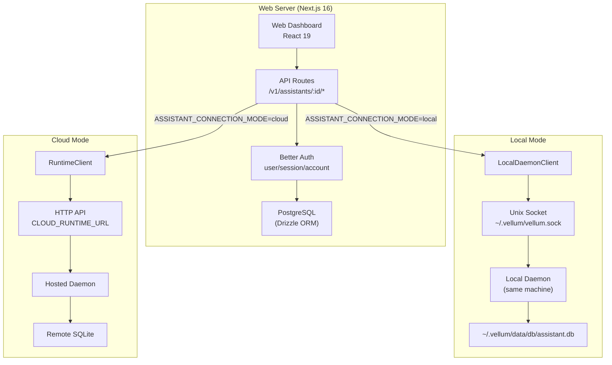
```mermaid
graph TB
    subgraph "Web Server (Next.js 16)"
        DASHBOARD["Web Dashboard<br/>React 19"]
        ROUTES["API Routes<br/>/v1/assistants/:id/*"]
        AUTH["Better Auth<br/>user/session/account"]
        PG["PostgreSQL<br/>(Drizzle ORM)"]
    end

    subgraph "Local Mode"
        LOCAL_CLIENT["LocalDaemonClient"]
        LOCAL_SOCK["Unix Socket<br/>~/.vellum/vellum.sock"]
        LOCAL_DAEMON["Local Daemon<br/>(same machine)"]
        LOCAL_DB["~/.vellum/data/db/assistant.db"]
    end

    subgraph "Cloud Mode"
        RUNTIME_CLIENT["RuntimeClient"]
        CLOUD_HTTP["HTTP API<br/>CLOUD_RUNTIME_URL"]
        CLOUD_DAEMON["Hosted Daemon"]
        CLOUD_DB["Remote SQLite"]
    end

    DASHBOARD --> ROUTES
    ROUTES --> AUTH
    AUTH --> PG

    ROUTES -->|"ASSISTANT_CONNECTION_MODE=local"| LOCAL_CLIENT
    LOCAL_CLIENT --> LOCAL_SOCK
    LOCAL_SOCK --> LOCAL_DAEMON
    LOCAL_DAEMON --> LOCAL_DB

    ROUTES -->|"ASSISTANT_CONNECTION_MODE=cloud"| RUNTIME_CLIENT
    RUNTIME_CLIENT --> CLOUD_HTTP
    CLOUD_HTTP --> CLOUD_DAEMON
    CLOUD_DAEMON --> CLOUD_DB
```

---

## IPC Contract — Source of Truth and Code Generation

The TypeScript file `assistant/src/daemon/ipc-contract.ts` is the **single source of truth** for all IPC message types. Swift client models are auto-generated from it. See [assistant/docs/ipc-contract.md](./assistant/docs/ipc-contract.md) for the full developer guide.

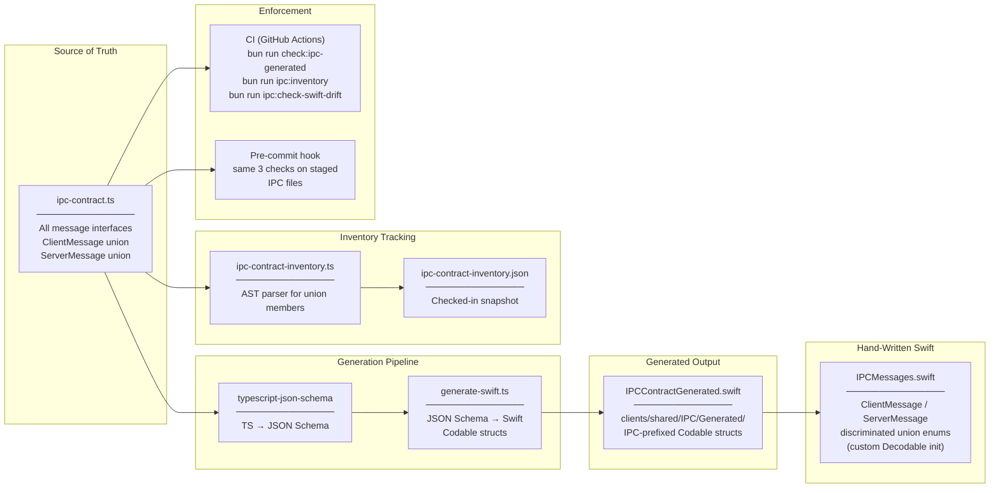
```mermaid
graph LR
    subgraph "Source of Truth"
        CONTRACT["ipc-contract.ts<br/>───────────────<br/>All message interfaces<br/>ClientMessage union<br/>ServerMessage union"]
    end

    subgraph "Generation Pipeline"
        TJS["typescript-json-schema<br/>───────────────<br/>TS → JSON Schema"]
        GEN["generate-swift.ts<br/>───────────────<br/>JSON Schema → Swift<br/>Codable structs"]
    end

    subgraph "Generated Output"
        SWIFT["IPCContractGenerated.swift<br/>───────────────<br/>clients/shared/IPC/Generated/<br/>IPC-prefixed Codable structs"]
    end

    subgraph "Hand-Written Swift"
        ENUMS["IPCMessages.swift<br/>───────────────<br/>ClientMessage / ServerMessage<br/>discriminated union enums<br/>(custom Decodable init)"]
    end

    subgraph "Inventory Tracking"
        INV_SRC["ipc-contract-inventory.ts<br/>───────────────<br/>AST parser for union members"]
        INV_SNAP["ipc-contract-inventory.json<br/>───────────────<br/>Checked-in snapshot"]
    end

    subgraph "Enforcement"
        CI["CI (GitHub Actions)<br/>bun run check:ipc-generated<br/>bun run ipc:inventory<br/>bun run ipc:check-swift-drift"]
        HOOK["Pre-commit hook<br/>same 3 checks on staged<br/>IPC files"]
    end

    CONTRACT --> TJS
    TJS --> GEN
    GEN --> SWIFT
    SWIFT --> ENUMS

    CONTRACT --> INV_SRC
    INV_SRC --> INV_SNAP

    CONTRACT --> CI
    CONTRACT --> HOOK
```

---

## IPC Protocol — Message Types

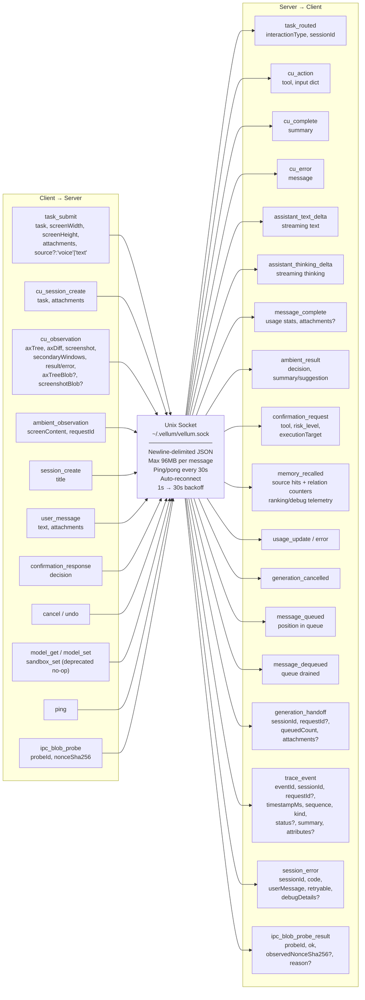
```mermaid
graph LR
    subgraph "Client → Server"
        direction TB
        C0["task_submit<br/>task, screenWidth, screenHeight,<br/>attachments, source?:'voice'|'text'"]
        C1["cu_session_create<br/>task, attachments"]
        C2["cu_observation<br/>axTree, axDiff, screenshot,<br/>secondaryWindows, result/error,<br/>axTreeBlob?, screenshotBlob?"]
        C3["ambient_observation<br/>screenContent, requestId"]
        C4["session_create<br/>title"]
        C5["user_message<br/>text, attachments"]
        C6["confirmation_response<br/>decision"]
        C7["cancel / undo"]
        C8["model_get / model_set<br/>sandbox_set (deprecated no-op)"]
        C9["ping"]
        C10["ipc_blob_probe<br/>probeId, nonceSha256"]
    end

    SOCKET["Unix Socket<br/>~/.vellum/vellum.sock<br/>───────────────<br/>Newline-delimited JSON<br/>Max 96MB per message<br/>Ping/pong every 30s<br/>Auto-reconnect<br/>1s → 30s backoff"]

    subgraph "Server → Client"
        direction TB
        S0["task_routed<br/>interactionType, sessionId"]
        S1["cu_action<br/>tool, input dict"]
        S2["cu_complete<br/>summary"]
        S3["cu_error<br/>message"]
        S4["assistant_text_delta<br/>streaming text"]
        S5["assistant_thinking_delta<br/>streaming thinking"]
        S6["message_complete<br/>usage stats, attachments?"]
        S7["ambient_result<br/>decision, summary/suggestion"]
        S8["confirmation_request<br/>tool, risk_level,<br/>executionTarget"]
        S9["memory_recalled<br/>source hits + relation counters<br/>ranking/debug telemetry"]
        S10["usage_update / error"]
        S11["generation_cancelled"]
        S12["message_queued<br/>position in queue"]
        S13["message_dequeued<br/>queue drained"]
        S14["generation_handoff<br/>sessionId, requestId?,<br/>queuedCount, attachments?"]
        S15["trace_event<br/>eventId, sessionId, requestId?,<br/>timestampMs, sequence, kind,<br/>status?, summary, attributes?"]
        S16["session_error<br/>sessionId, code,<br/>userMessage, retryable,<br/>debugDetails?"]
        S17["ipc_blob_probe_result<br/>probeId, ok,<br/>observedNonceSha256?, reason?"]
    end

    C0 --> SOCKET
    C1 --> SOCKET
    C2 --> SOCKET
    C3 --> SOCKET
    C4 --> SOCKET
    C5 --> SOCKET
    C6 --> SOCKET
    C7 --> SOCKET
    C8 --> SOCKET
    C9 --> SOCKET
    C10 --> SOCKET

    SOCKET --> S0
    SOCKET --> S1
    SOCKET --> S2
    SOCKET --> S3
    SOCKET --> S4
    SOCKET --> S5
    SOCKET --> S6
    SOCKET --> S7
    SOCKET --> S8
    SOCKET --> S9
    SOCKET --> S10
    SOCKET --> S11
    SOCKET --> S12
    SOCKET --> S13
    SOCKET --> S14
    SOCKET --> S15
    SOCKET --> S16
    SOCKET --> S17
```

---

## Blob Transport — Large Payload Side-Channel

CU observations can carry large payloads (screenshots as JPEG, AX trees as UTF-8 text). Instead of embedding these inline as base64/text in newline-delimited JSON IPC messages, the blob transport offloads them to local files and sends only lightweight references over the socket.

### Probe Mechanism

Blob transport is opt-in per connection. On every macOS socket connect, the client writes a random nonce file to the blob directory and sends an `ipc_blob_probe` message with the SHA-256 of the nonce. The daemon reads the file, computes the hash, and responds with `ipc_blob_probe_result`. If hashes match, the client sets `isBlobTransportAvailable = true` for that connection. The flag resets to `false` on disconnect or reconnect.

On iOS (TCP connections), the probe code is compiled out via `#if os(macOS)` — `isBlobTransportAvailable` stays `false` and inline payloads are always used. Over SSH-forwarded Unix sockets on macOS, the probe runs but fails because the client and daemon don't share a filesystem, so blob transport stays disabled and inline payloads are used transparently.

### Blob Directory

All blobs live at `~/.vellum/data/ipc-blobs/`. Filenames are `${uuid}.blob`. The daemon ensures this directory exists on startup. Both client and daemon use atomic writes (temp file + rename) to prevent partial reads.

### Blob Reference

```
IpcBlobRef {
  id: string              // UUID v4
  kind: "ax_tree" | "screenshot_jpeg"
  encoding: "utf8" | "binary"
  byteLength: number
  sha256?: string         // SHA-256 hex digest for integrity check
}
```

### Transport Decision Flow

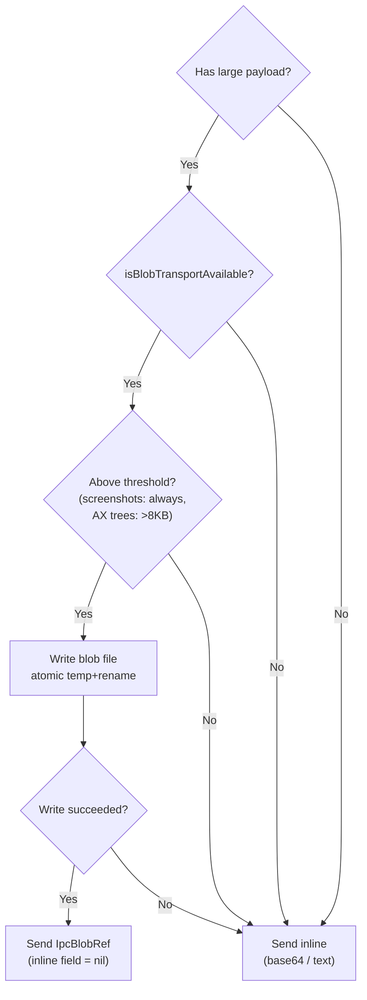
```mermaid
graph TB
    HAS_DATA{"Has large payload?"}
    BLOB_AVAIL{"isBlobTransportAvailable?"}
    THRESHOLD{"Above threshold?<br/>(screenshots: always,<br/>AX trees: >8KB)"}
    WRITE_BLOB["Write blob file<br/>atomic temp+rename"]
    WRITE_OK{"Write succeeded?"}
    SEND_REF["Send IpcBlobRef<br/>(inline field = nil)"]
    SEND_INLINE["Send inline<br/>(base64 / text)"]

    HAS_DATA -->|Yes| BLOB_AVAIL
    HAS_DATA -->|No| SEND_INLINE
    BLOB_AVAIL -->|Yes| THRESHOLD
    BLOB_AVAIL -->|No| SEND_INLINE
    THRESHOLD -->|Yes| WRITE_BLOB
    THRESHOLD -->|No| SEND_INLINE
    WRITE_BLOB --> WRITE_OK
    WRITE_OK -->|Yes| SEND_REF
    WRITE_OK -->|No| SEND_INLINE
```

### Daemon Hydration

When the daemon receives a CU observation with blob refs, it attempts blob-first hydration before the CU session processes the observation:

1. Validate the blob ref's `kind` and `encoding` match the expected field (`axTreeBlob` must be `kind=ax_tree, encoding=utf8`; `screenshotBlob` must be `kind=screenshot_jpeg, encoding=binary`).
2. Verify the blob file is a regular file (not a symlink) and its realpath stays within the blob directory.
3. Read the blob file, verify actual size matches `byteLength`, and check optional `sha256`.
4. For screenshots: base64-encode the bytes into the `screenshot` field.
5. For AX trees: decode UTF-8 bytes into the `axTree` field.
6. Delete the consumed blob file.

**Fallback behavior**: If both a blob ref and an inline field are present and blob hydration succeeds, the blob value takes precedence. If blob hydration fails and an inline fallback exists, the inline value is used. If blob hydration fails and no inline fallback exists, the daemon sends a `cu_error` and does not forward the observation to the session.

### Cleanup

- **Consumed blobs**: Deleted immediately after successful hydration.
- **Stale sweep**: The daemon runs a periodic sweep (every 5 minutes) to delete blob files older than 30 minutes, catching orphans from failed sends or crashes.
- **Size limits**: Screenshot blobs are capped at 10MB, AX tree blobs at 2MB. Oversized blobs are rejected.

---

## Session Errors vs Global Errors

The daemon emits two distinct error message types over IPC:

| Message type | Scope | Purpose | Payload |
|---|---|---|---|
| `session_error` | Session-scoped | Typed, actionable failures during chat/session runtime (e.g., provider network error, rate limit, API failure) | `sessionId`, `code` (typed enum), `userMessage`, `retryable`, `debugDetails?` |
| `error` | Global | Generic, non-session failures (e.g., daemon startup errors, unknown message types) | `message` (string) |

**Design rationale:** `session_error` carries structured metadata (error code, retryable flag, debug details) so the client can present actionable UI — a toast with retry/dismiss buttons — rather than a generic error banner. The older `error` type is retained for backward compatibility with non-session contexts.

### Session Error Codes

| Code | Meaning | Retryable |
|---|---|---|
| `PROVIDER_NETWORK` | Unable to reach the LLM provider (connection refused, timeout, DNS) | Yes |
| `PROVIDER_RATE_LIMIT` | LLM provider rate-limited the request (HTTP 429) | Yes |
| `PROVIDER_API` | Provider returned a server error (5xx) | Yes |
| `QUEUE_FULL` | The message queue is full | Yes |
| `SESSION_ABORTED` | Non-user abort interrupted the request | Yes |
| `SESSION_PROCESSING_FAILED` | Catch-all for unexpected processing failures | No |
| `REGENERATE_FAILED` | Failed to regenerate a previous response | Yes |

### Error Classification

The daemon classifies errors via `classifySessionError()` in `session-error.ts`. Before classification, `isUserCancellation()` checks whether the error is a user-initiated abort (active abort signal or `AbortError`); if so, the daemon emits `generation_cancelled` instead of `session_error` — cancel never surfaces a session-error toast.

Classification uses a two-tier strategy:
1. **Structured provider errors**: If the error is a `ProviderError` with a `statusCode`, the status code determines the category deterministically — `429` maps to `PROVIDER_RATE_LIMIT` (retryable), `5xx` to `PROVIDER_API` (retryable), other `4xx` to `PROVIDER_API` (not retryable).
2. **Regex fallback**: For non-provider errors or `ProviderError` without a status code, regex pattern matching against the error message detects network failures, rate limits, and API errors. Phase-specific overrides handle queue and regeneration contexts.

Debug details are capped at 4,000 characters to prevent oversized IPC payloads.

### Error → Toast → Recovery Flow

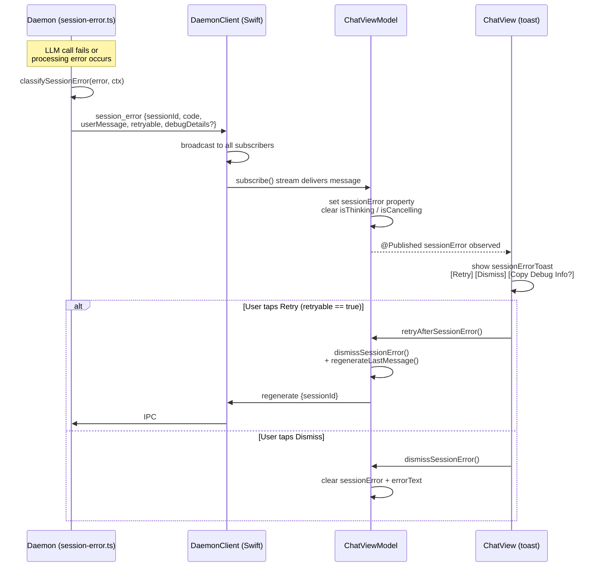
```mermaid
sequenceDiagram
    participant Daemon as Daemon (session-error.ts)
    participant DC as DaemonClient (Swift)
    participant VM as ChatViewModel
    participant UI as ChatView (toast)

    Note over Daemon: LLM call fails or<br/>processing error occurs
    Daemon->>Daemon: classifySessionError(error, ctx)
    Daemon->>DC: session_error {sessionId, code,<br/>userMessage, retryable, debugDetails?}
    DC->>DC: broadcast to all subscribers
    DC->>VM: subscribe() stream delivers message
    VM->>VM: set sessionError property<br/>clear isThinking / isCancelling
    VM-->>UI: @Published sessionError observed

    UI->>UI: show sessionErrorToast<br/>[Retry] [Dismiss] [Copy Debug Info?]

    alt User taps Retry (retryable == true)
        UI->>VM: retryAfterSessionError()
        VM->>VM: dismissSessionError()<br/>+ regenerateLastMessage()
        VM->>DC: regenerate {sessionId}
        DC->>Daemon: IPC
    else User taps Dismiss
        UI->>VM: dismissSessionError()
        VM->>VM: clear sessionError + errorText
    end
```

1. **Daemon** encounters a session-scoped failure, classifies it via `classifySessionError()`, and sends a `session_error` IPC message with the session ID, typed error code, user-facing message, retryable flag, and optional debug details. Session-scoped failures emit *only* `session_error` (never the generic `error` type) to prevent cross-session bleed.
2. **ChatViewModel** receives the error via DaemonClient's `subscribe()` stream (each view model gets an independent stream), sets the `sessionError` property, and transitions out of the streaming/loading state so the UI is interactive. If the error arrives during an active cancel (`wasCancelling == true`), it is suppressed — cancel only shows `generation_cancelled` behavior.
3. **ChatView** observes the published `sessionError` and displays an actionable toast with a category-specific icon and accent color:
   - **Retry** (shown when `retryable` is true): calls `retryAfterSessionError()`, which clears the error and sends a `regenerate` message to the daemon.
   - **Copy Debug Info** (shown when `debugDetails` is non-nil): copies structured debug information to the clipboard for bug reports.
   - **Dismiss (X)**: calls `dismissSessionError()` to clear the error without retrying.
4. If the error is not retryable, the Retry button is hidden and the user can only dismiss.

---

## Task Routing — Voice Source Bypass and Escalation

When a task is submitted via `task_submit`, the daemon classifies it to determine routing. Voice-sourced tasks and slash command candidates bypass the classifier entirely for lower latency and more predictable routing.

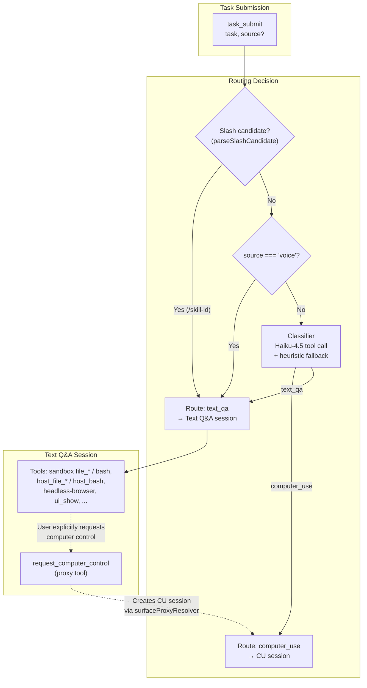
```mermaid
graph TB
    subgraph "Task Submission"
        SUBMIT["task_submit<br/>task, source?"]
    end

    subgraph "Routing Decision"
        SLASH_CHECK{"Slash candidate?<br/>(parseSlashCandidate)"}
        VOICE_CHECK{"source === 'voice'?"}
        CLASSIFIER["Classifier<br/>Haiku-4.5 tool call<br/>+ heuristic fallback"]
        CU_ROUTE["Route: computer_use<br/>→ CU session"]
        QA_ROUTE["Route: text_qa<br/>→ Text Q&A session"]
    end

    subgraph "Text Q&A Session"
        TEXT_TOOLS["Tools: sandbox file_* / bash,<br/>host_file_* / host_bash,<br/>headless-browser, ui_show, ..."]
        ESCALATE["request_computer_control<br/>(proxy tool)"]
    end

    SUBMIT --> SLASH_CHECK
    SLASH_CHECK -->|"Yes (/skill-id)"| QA_ROUTE
    SLASH_CHECK -->|"No"| VOICE_CHECK
    VOICE_CHECK -->|"Yes"| QA_ROUTE
    VOICE_CHECK -->|"No"| CLASSIFIER
    CLASSIFIER -->|"computer_use"| CU_ROUTE
    CLASSIFIER -->|"text_qa"| QA_ROUTE

    QA_ROUTE --> TEXT_TOOLS
    TEXT_TOOLS -.->|"User explicitly requests<br/>computer control"| ESCALATE
    ESCALATE -.->|"Creates CU session<br/>via surfaceProxyResolver"| CU_ROUTE
```

### Action Execution Hierarchy

The text_qa system prompt includes an action execution hierarchy that guides tool selection toward the least invasive method:

| Priority | Method | Tool | When to use |
|----------|--------|------|-------------|
| **BEST** | Sandboxed filesystem/shell | `file_*`, `bash` | Work that can stay isolated in sandbox filesystem |
| **BETTER** | Explicit host filesystem/shell | `host_file_*`, `host_bash` | Host reads/writes/commands that must touch the real machine |
| **GOOD** | Headless browser | `headless-browser` | Web automation, form filling, scraping (background) |
| **LAST RESORT** | Foreground computer use | `request_computer_control` | Only on explicit user request ("go ahead", "take over") |

The `request_computer_control` tool is a proxy tool available only to text_qa sessions. When invoked, the session's `surfaceProxyResolver` creates a CU session and sends a `task_routed` message to the client, effectively escalating from text_qa to foreground computer use.

### Sandbox Filesystem and Host Access

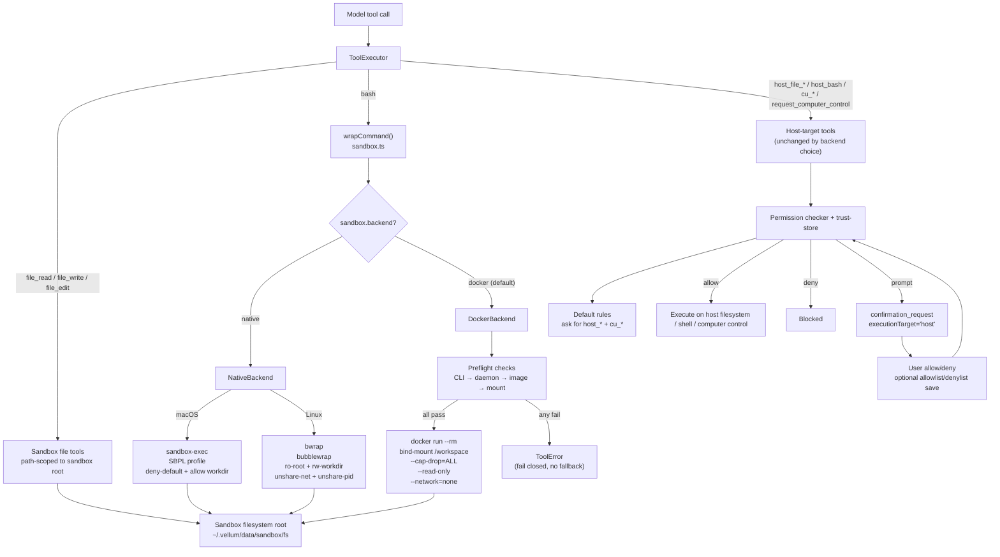
```mermaid
graph TB
    CALL["Model tool call"] --> EXEC["ToolExecutor"]

    EXEC -->|"file_read / file_write / file_edit"| SB_FILE_TOOLS["Sandbox file tools<br/>path-scoped to sandbox root"]
    SB_FILE_TOOLS --> SB_FS

    EXEC -->|"bash"| WRAP["wrapCommand()<br/>sandbox.ts"]

    WRAP --> BACKEND_CHECK{"sandbox.backend?"}
    BACKEND_CHECK -->|"native"| NATIVE["NativeBackend"]
    BACKEND_CHECK -->|"docker (default)"| DOCKER["DockerBackend"]

    NATIVE -->|"macOS"| SBPL["sandbox-exec<br/>SBPL profile<br/>deny-default + allow workdir"]
    NATIVE -->|"Linux"| BWRAP["bwrap<br/>bubblewrap<br/>ro-root + rw-workdir<br/>unshare-net + unshare-pid"]
    SBPL --> SB_FS["Sandbox filesystem root<br/>~/.vellum/data/sandbox/fs"]
    BWRAP --> SB_FS

    DOCKER --> PREFLIGHT["Preflight checks<br/>CLI → daemon → image → mount"]
    PREFLIGHT -->|"all pass"| CONTAINER["docker run --rm<br/>bind-mount /workspace<br/>--cap-drop=ALL<br/>--read-only<br/>--network=none"]
    PREFLIGHT -->|"any fail"| FAIL_CLOSED["ToolError<br/>(fail closed, no fallback)"]
    CONTAINER --> SB_FS

    EXEC -->|"host_file_* / host_bash / cu_* / request_computer_control"| HOST_TOOLS["Host-target tools<br/>(unchanged by backend choice)"]
    HOST_TOOLS --> CHECK["Permission checker + trust-store"]
    CHECK --> DEFAULTS["Default rules<br/>ask for host_* + cu_*"]
    CHECK -->|"allow"| HOST_EXEC["Execute on host filesystem / shell / computer control"]
    CHECK -->|"deny"| BLOCK["Blocked"]
    CHECK -->|"prompt"| PROMPT["confirmation_request<br/>executionTarget='host'"]
    PROMPT --> USER["User allow/deny<br/>optional allowlist/denylist save"]
    USER --> CHECK
```

- **Backend selection**: The `sandbox.backend` config option (`"native"` or `"docker"`) determines how `bash` commands are sandboxed. The default is `"docker"`.
- **Native backend**: Uses OS-level sandboxing — `sandbox-exec` with SBPL profiles on macOS, `bwrap` (bubblewrap) on Linux. Denies network access and restricts filesystem writes to the sandbox root, `/tmp`, `/private/tmp`, and `/var/folders` (macOS) or the sandbox root and `/tmp` (Linux).
- **Docker backend**: Wraps each command in an ephemeral `docker run --rm` container. The canonical sandbox filesystem root (`~/.vellum/data/sandbox/fs`) is always bind-mounted to `/workspace`, regardless of which subdirectory the command runs in. Commands are wrapped with `bash -c`. Containers run with all capabilities dropped, a read-only root filesystem, no network access, and host UID:GID forwarding. The default image is `node:20-slim` (pinned with a `sha256` digest).
- **Fail-closed**: Both backends refuse to execute unsandboxed if their prerequisites are unavailable. The Docker backend runs preflight checks (CLI, daemon, image, writable mount probe via `test -w /workspace`) and throws `ToolError` with actionable messages on failure. Positive preflight results are cached; negative results are rechecked on every call. The `vellum doctor` command validates the same checks against the same sandbox path.
- **Host tools unchanged**: `host_bash`, `host_file_read`, `host_file_write`, and `host_file_edit` always execute directly on the host regardless of which sandbox backend is active.
- Sandbox defaults: `file_*` and `bash` execute within `~/.vellum/data/sandbox/fs`.
- Host access is explicit: `host_file_read`, `host_file_write`, `host_file_edit`, and `host_bash` are separate tools.
- Prompt defaults: host tools, `request_computer_control`, and `cu_*` actions default to `ask` unless a trust rule allowlists/denylists them.
- Confirmation payloads include `executionTarget` (`sandbox` or `host`) so clients can label where the action will run.

---

## Slash Command Resolution

When a user message enters the daemon (via `processMessage` or the queue drain path), it passes through slash command resolution before persistence or agent execution.

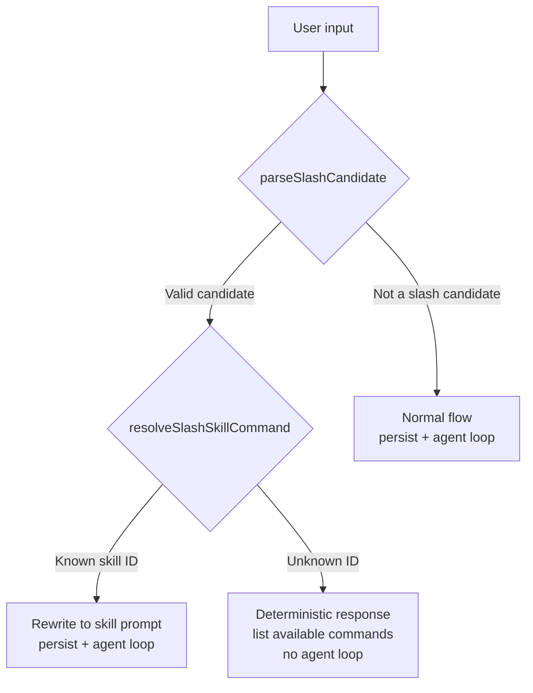
```mermaid
graph TB
    INPUT["User input"]
    PARSE{"parseSlashCandidate"}
    RESOLVE{"resolveSlashSkillCommand"}
    NONE["Normal flow<br/>persist + agent loop"]
    KNOWN["Rewrite to skill prompt<br/>persist + agent loop"]
    UNKNOWN["Deterministic response<br/>list available commands<br/>no agent loop"]

    INPUT --> PARSE
    PARSE -->|"Not a slash candidate"| NONE
    PARSE -->|"Valid candidate"| RESOLVE
    RESOLVE -->|"Known skill ID"| KNOWN
    RESOLVE -->|"Unknown ID"| UNKNOWN
```

Key behaviors:
- **Known**: Content is rewritten via `rewriteKnownSlashCommandPrompt` to instruct the model to invoke the skill. Trailing arguments are preserved.
- **Unknown**: A deterministic `assistant_text_delta` + `message_complete` is emitted listing available slash commands. No message persistence or model call occurs.
- **Queue**: Queued messages receive the same slash resolution. Unknown slash commands in the queue emit their response and continue draining without stalling.

---

## Dynamic Skill Authoring — Tool Flow

The assistant can author, test, and persist new skills at runtime through a three-tool workflow. All operations target `~/.vellum/skills/` (managed skills directory) and require explicit user confirmation.

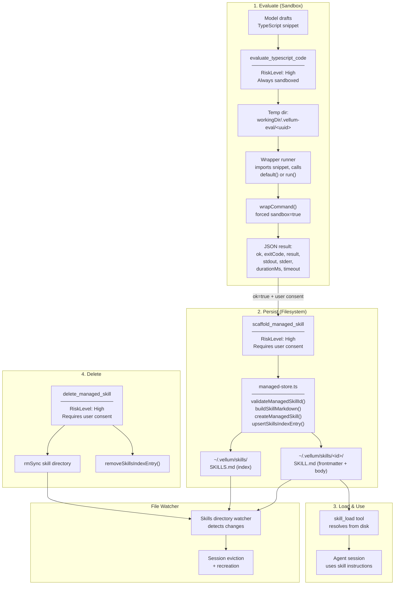
```mermaid
graph TB
    subgraph "1. Evaluate (Sandbox)"
        SNIPPET["Model drafts<br/>TypeScript snippet"]
        EVAL_TOOL["evaluate_typescript_code<br/>───────────────<br/>RiskLevel: High<br/>Always sandboxed"]
        TEMP["Temp dir:<br/>workingDir/.vellum-eval/&lt;uuid&gt;"]
        WRAPPER["Wrapper runner<br/>imports snippet, calls<br/>default() or run()"]
        SANDBOX["wrapCommand()<br/>forced sandbox=true"]
        RESULT["JSON result:<br/>ok, exitCode, result,<br/>stdout, stderr,<br/>durationMs, timeout"]
    end

    subgraph "2. Persist (Filesystem)"
        SCAFFOLD["scaffold_managed_skill<br/>───────────────<br/>RiskLevel: High<br/>Requires user consent"]
        MANAGED_STORE["managed-store.ts<br/>───────────────<br/>validateManagedSkillId()<br/>buildSkillMarkdown()<br/>createManagedSkill()<br/>upsertSkillsIndexEntry()"]
        SKILL_DIR["~/.vellum/skills/&lt;id&gt;/<br/>SKILL.md (frontmatter + body)"]
        INDEX["~/.vellum/skills/<br/>SKILLS.md (index)"]
    end

    subgraph "3. Load & Use"
        SKILL_LOAD["skill_load tool<br/>resolves from disk"]
        SESSION["Agent session<br/>uses skill instructions"]
    end

    subgraph "4. Delete"
        DELETE["delete_managed_skill<br/>───────────────<br/>RiskLevel: High<br/>Requires user consent"]
        RM_DIR["rmSync skill directory"]
        RM_INDEX["removeSkillsIndexEntry()"]
    end

    subgraph "File Watcher"
        WATCHER["Skills directory watcher<br/>detects changes"]
        EVICT["Session eviction<br/>+ recreation"]
    end

    SNIPPET --> EVAL_TOOL
    EVAL_TOOL --> TEMP
    TEMP --> WRAPPER
    WRAPPER --> SANDBOX
    SANDBOX --> RESULT
    RESULT -->|"ok=true + user consent"| SCAFFOLD

    SCAFFOLD --> MANAGED_STORE
    MANAGED_STORE --> SKILL_DIR
    MANAGED_STORE --> INDEX

    SKILL_DIR --> WATCHER
    INDEX --> WATCHER
    WATCHER --> EVICT

    SKILL_DIR --> SKILL_LOAD
    SKILL_LOAD --> SESSION

    DELETE --> RM_DIR
    DELETE --> RM_INDEX
    RM_DIR --> WATCHER
```

**Key design decisions:**
- `evaluate_typescript_code` always forces `sandbox.enabled = true` regardless of global config.
- Snippet contract: must export `default` or `run` with signature `(input: unknown) => unknown | Promise<unknown>`.
- Managed-store writes are atomic (tmp file + rename) to prevent partial `SKILL.md` or `SKILLS.md` files.
- After persist or delete, the file watcher triggers session eviction; the next turn runs in a fresh session. The model's system prompt instructs it to continue normally.
- macOS UI shows Inspect and Delete controls for managed skills only (source = "managed").

---

## Opportunistic Message Queue — Handoff Flow

When the daemon is busy generating a response, the client can continue sending messages. These are queued (FIFO, max 10) and drained automatically at safe checkpoints in the tool loop, not only at full completion.

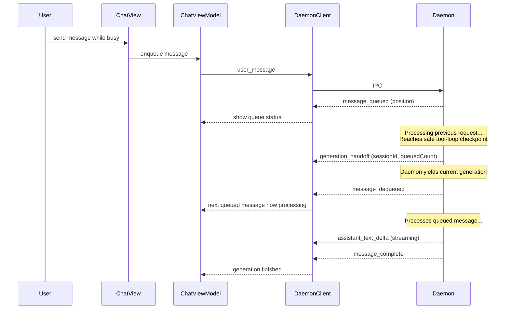
```mermaid
sequenceDiagram
    participant User
    participant Chat as ChatView
    participant VM as ChatViewModel
    participant DC as DaemonClient
    participant Daemon as Daemon

    User->>Chat: send message while busy
    Chat->>VM: enqueue message
    VM->>DC: user_message
    DC->>Daemon: IPC
    Daemon-->>DC: message_queued (position)
    DC-->>VM: show queue status

    Note over Daemon: Processing previous request...<br/>Reaches safe tool-loop checkpoint

    Daemon-->>DC: generation_handoff (sessionId, queuedCount)
    Note over Daemon: Daemon yields current generation

    Daemon-->>DC: message_dequeued
    DC-->>VM: next queued message now processing

    Note over Daemon: Processes queued message...

    Daemon-->>DC: assistant_text_delta (streaming)
    Daemon-->>DC: message_complete
    DC-->>VM: generation finished
```

---

## Trace System — Debug Panel Data Flow

The trace system provides real-time observability of daemon session internals. Each session creates a `TraceEmitter` that emits structured `trace_event` IPC messages as the session processes requests, makes LLM calls, and executes tools.

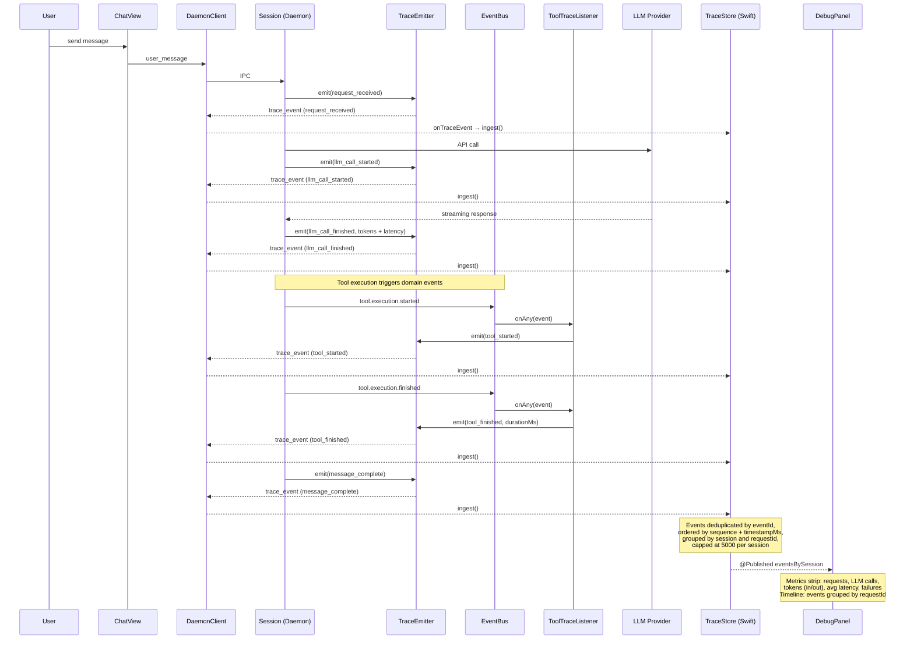
```mermaid
sequenceDiagram
    participant User
    participant Chat as ChatView
    participant DC as DaemonClient
    participant Daemon as Session (Daemon)
    participant TE as TraceEmitter
    participant EB as EventBus
    participant TTL as ToolTraceListener
    participant LLM as LLM Provider
    participant TS as TraceStore (Swift)
    participant DP as DebugPanel

    User->>Chat: send message
    Chat->>DC: user_message
    DC->>Daemon: IPC

    Daemon->>TE: emit(request_received)
    TE-->>DC: trace_event (request_received)
    DC-->>TS: onTraceEvent → ingest()

    Daemon->>LLM: API call
    Daemon->>TE: emit(llm_call_started)
    TE-->>DC: trace_event (llm_call_started)
    DC-->>TS: ingest()

    LLM-->>Daemon: streaming response
    Daemon->>TE: emit(llm_call_finished, tokens + latency)
    TE-->>DC: trace_event (llm_call_finished)
    DC-->>TS: ingest()

    Note over Daemon,EB: Tool execution triggers domain events

    Daemon->>EB: tool.execution.started
    EB->>TTL: onAny(event)
    TTL->>TE: emit(tool_started)
    TE-->>DC: trace_event (tool_started)
    DC-->>TS: ingest()

    Daemon->>EB: tool.execution.finished
    EB->>TTL: onAny(event)
    TTL->>TE: emit(tool_finished, durationMs)
    TE-->>DC: trace_event (tool_finished)
    DC-->>TS: ingest()

    Daemon->>TE: emit(message_complete)
    TE-->>DC: trace_event (message_complete)
    DC-->>TS: ingest()

    Note over TS: Events deduplicated by eventId,<br/>ordered by sequence + timestampMs,<br/>grouped by session and requestId,<br/>capped at 5000 per session

    TS-->>DP: @Published eventsBySession
    Note over DP: Metrics strip: requests, LLM calls,<br/>tokens (in/out), avg latency, failures<br/>Timeline: events grouped by requestId
```

### Trace Event Kinds

Events emitted during a session lifecycle:

| Kind | Emitted by | When |
|------|-----------|------|
| `request_received` | Handlers / Session | User message or surface action arrives |
| `request_queued` | Handlers / Session | Message queued while session is busy |
| `request_dequeued` | Session | Queued message begins processing |
| `llm_call_started` | Session | LLM API call initiated |
| `llm_call_finished` | Session | LLM API call completed (carries `inputTokens`, `outputTokens`, `latencyMs`) |
| `assistant_message` | Session | Assistant response assembled (carries `toolUseCount`) |
| `tool_started` | ToolTraceListener | Tool execution begins |
| `tool_permission_requested` | ToolTraceListener | Permission check needed (carries `riskLevel`) |
| `tool_permission_decided` | ToolTraceListener | Permission granted or denied (carries `decision`) |
| `tool_finished` | ToolTraceListener | Tool execution completed (carries `durationMs`) |
| `tool_failed` | ToolTraceListener | Tool execution failed (carries `durationMs`) |
| `secret_detected` | ToolTraceListener | Secret found in tool output |
| `generation_handoff` | Session | Yielding to next queued message |
| `message_complete` | Session | Full request processing finished |
| `generation_cancelled` | Session | User cancelled the generation |
| `request_error` | Handlers / Session | Unrecoverable error during processing (includes queue-full rejection and persist-failure paths) |

### Architecture

- **TraceEmitter** (daemon, per-session): Constructed with a `sessionId` and a `sendToClient` callback. Maintains a monotonic sequence counter for stable ordering. Truncates summaries to 200 chars and attribute values to 500 chars. Each call to `emit()` sends a `trace_event` IPC message to the connected client.
- **ToolTraceListener** (daemon): Subscribes to the session's `EventBus` via `onAny()` and translates tool domain events (`tool.execution.started`, `tool.execution.finished`, `tool.execution.failed`, `tool.permission.requested`, `tool.permission.decided`, `tool.secret.detected`) into trace events through the `TraceEmitter`.
- **DaemonClient** (Swift, shared): Decodes `trace_event` IPC messages into `TraceEventMessage` structs and invokes the `onTraceEvent` callback.
- **TraceStore** (Swift, macOS): `@MainActor ObservableObject` that ingests `TraceEventMessage` structs. Deduplicates by `eventId`, maintains stable sort order (sequence, then timestampMs, then insertion order), groups events by session and requestId, and enforces a retention cap of 5,000 events per session. Each request group is classified with a terminal status: `completed` (via `message_complete`), `cancelled` (via `generation_cancelled`), `handedOff` (via `generation_handoff`), `error` (via `request_error` or any event with `status == "error"`), or `active` (no terminal event yet).
- **DebugPanel** (Swift, macOS): SwiftUI view that observes `TraceStore`. Displays a metrics strip (request count, LLM calls, total tokens, average latency, tool failures) and a `TraceTimelineView` showing events grouped by requestId with color-coded status indicators. The timeline auto-scrolls to new events while the user is at the bottom; scrolling up pauses auto-scroll and shows a "Jump to bottom" button that resumes it.

---

## Dynamic Workspace — Surface Routing and Layout

The workspace is a full-window mode that replaces the chat UI with an interactive dynamic page (WKWebView) and a pinned composer for follow-up messages. It activates when the daemon sends a `ui_surface_show` message with `display != "inline"`.

### Routing Flow (Chat → Workspace)

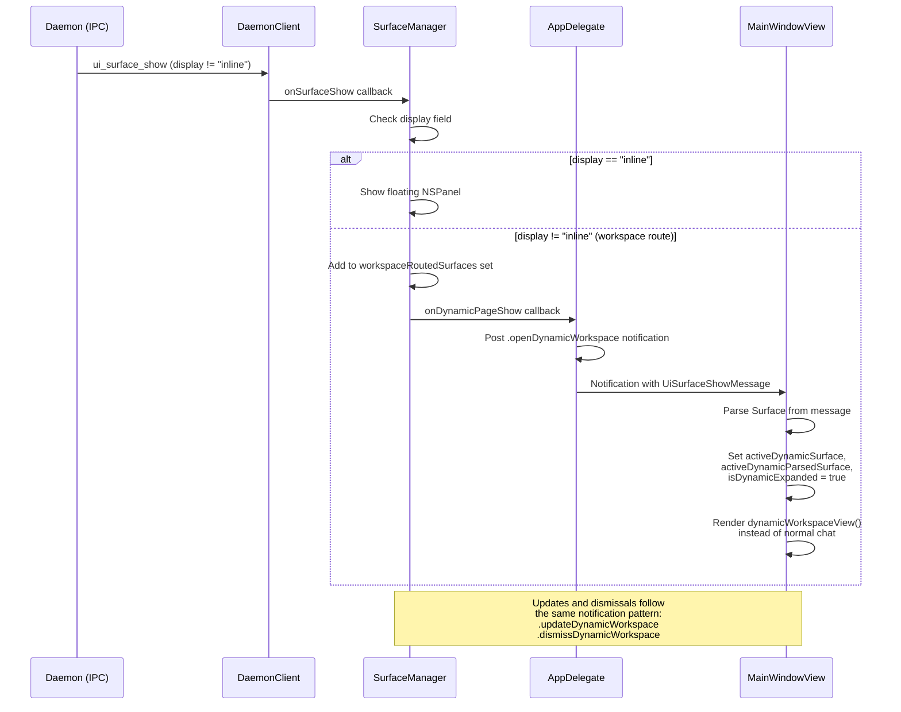
```mermaid
sequenceDiagram
    participant Daemon as Daemon (IPC)
    participant DC as DaemonClient
    participant SM as SurfaceManager
    participant AD as AppDelegate
    participant MW as MainWindowView

    Daemon->>DC: ui_surface_show (display != "inline")
    DC->>SM: onSurfaceShow callback
    SM->>SM: Check display field
    alt display == "inline"
        SM->>SM: Show floating NSPanel
    else display != "inline" (workspace route)
        SM->>SM: Add to workspaceRoutedSurfaces set
        SM->>AD: onDynamicPageShow callback
        AD->>AD: Post .openDynamicWorkspace notification
        AD->>MW: Notification with UiSurfaceShowMessage
        MW->>MW: Parse Surface from message
        MW->>MW: Set activeDynamicSurface,<br/>activeDynamicParsedSurface,<br/>isDynamicExpanded = true
        MW->>MW: Render dynamicWorkspaceView()<br/>instead of normal chat
    end

    Note over SM,MW: Updates and dismissals follow<br/>the same notification pattern:<br/>.updateDynamicWorkspace<br/>.dismissDynamicWorkspace
```

**Key types:** `SurfaceManager` routes surfaces by `display` field. `MainWindowView` listens for three notifications (`.openDynamicWorkspace`, `.updateDynamicWorkspace`, `.dismissDynamicWorkspace`) and manages `@State` properties to toggle between chat and workspace views.

### Full-Window Workspace Layout

```
┌────────────────────────────────────────────────┐
│  ← Back    App Title                     ✕     │  ← Toolbar (HStack)
├────────────────────────────────────────────────┤
│                                                │
│                                                │
│           DynamicPageSurfaceView               │  ← WKWebView (fills space)
│              (interactive HTML)                 │
│                                                │
│                                                │
├────────────────────────────────────────────────┤
│  ComposerView (pinned at bottom)               │  ← Follow-up input
└────────────────────────────────────────────────┘
```

The workspace is a `VStack(spacing: 0)` with `VColor.backgroundSubtle` background. The toolbar has back (returns to gallery) and close (exits workspace + panel) buttons. `DynamicPageSurfaceView` grows to fill remaining vertical space. `ComposerView` is pinned at the bottom, bound to the active `ChatViewModel` so users can send follow-up messages while the page is open.

### Widget Injection Pipeline (CSS + JS into WKWebView)

`DynamicPageSurfaceView` is an `NSViewRepresentable` that wraps a `WKWebView`. On creation, three `WKUserScript`s are injected at document start:

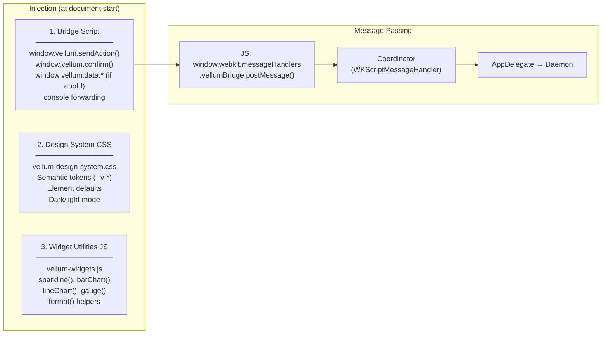
```mermaid
graph LR
    subgraph "Injection (at document start)"
        BRIDGE["1. Bridge Script<br/>───────────────<br/>window.vellum.sendAction()<br/>window.vellum.confirm()<br/>window.vellum.data.* (if appId)<br/>console forwarding"]
        CSS["2. Design System CSS<br/>───────────────<br/>vellum-design-system.css<br/>Semantic tokens (--v-*)<br/>Element defaults<br/>Dark/light mode"]
        WIDGETS["3. Widget Utilities JS<br/>───────────────<br/>vellum-widgets.js<br/>sparkline(), barChart()<br/>lineChart(), gauge()<br/>format() helpers"]
    end

    subgraph "Message Passing"
        JS_CALL["JS: window.webkit.messageHandlers<br/>.vellumBridge.postMessage()"]
        COORD["Coordinator<br/>(WKScriptMessageHandler)"]
        DAEMON["AppDelegate → Daemon"]
    end

    BRIDGE --> JS_CALL
    JS_CALL --> COORD
    COORD --> DAEMON
```

**Per-app isolation:** Each app gets its own origin (`https://{appId}.vellum.local/`). The `VellumAppSchemeHandler` handles `vellumapp://` URLs for serving bundled app files from the sandbox directory. Sandbox mode blocks external network requests.

**Data RPC flow:** App JS calls `window.vellum.data.query()` → Coordinator → AppDelegate → Daemon `app_data_request`. Daemon responds with `app_data_response` → `SurfaceManager.resolveDataResponse()` → Coordinator evaluates `window.vellum.data._resolve()` in the WebView.

---

## Storage Summary

| What | Where | Format | ORM/Driver | Retention |
|------|-------|--------|-----------|-----------|
| API key | macOS Keychain | Encrypted binary | `/usr/bin/security` CLI | Permanent |
| User preferences | UserDefaults | plist | Foundation | Permanent |
| Ambient observations | `~/Library/.../knowledge.json` | JSON array | Swift Codable | Max 500 entries, FIFO |
| Ambient insights | `~/Library/.../insights.json` | JSON array | Swift Codable | Max 50 entries, FIFO |
| Session logs | `~/Library/.../logs/session-*.json` | JSON per session | Swift Codable | Unbounded |
| Conversations & messages | `~/.vellum/data/db/assistant.db` | SQLite + WAL | Drizzle ORM (Bun) | Permanent |
| Memory segments & FTS | `~/.vellum/data/db/assistant.db` | SQLite FTS5 | Drizzle ORM | Permanent |
| Extracted facts | `~/.vellum/data/db/assistant.db` | SQLite | Drizzle ORM | Permanent, deduped |
| Entity graph (entities/relations/item links) | `~/.vellum/data/db/assistant.db` | SQLite | Drizzle ORM | Permanent, deduped by unique relation edge |
| Embeddings | `~/.vellum/data/db/assistant.db` | JSON float arrays | Drizzle ORM | Permanent |
| Async job queue | `~/.vellum/data/db/assistant.db` | SQLite | Drizzle ORM | Completed jobs persist |
| Attachments | `~/.vellum/data/db/assistant.db` | Base64 in SQLite | Drizzle ORM | Permanent |
| Sandbox filesystem | `~/.vellum/data/sandbox/fs` | Real filesystem tree | Node FS APIs | Persistent across sessions |
| Tool permission rules | `~/.vellum/protected/trust.json` | JSON | File I/O | Permanent |
| Web users & assistants | PostgreSQL | Relational | Drizzle ORM (pg) | Permanent |
| Trace events | In-memory (TraceStore) | Structured events | Swift ObservableObject | Max 5,000 per session, ephemeral |
| IPC blob payloads | `~/.vellum/data/ipc-blobs/` | Binary files (UUID names) | File I/O (atomic write) | Ephemeral; consumed on hydration, stale sweep every 5min |
| IPC transport | `~/.vellum/vellum.sock` | Unix domain socket | NWConnection (Swift) / Bun net | Ephemeral |
