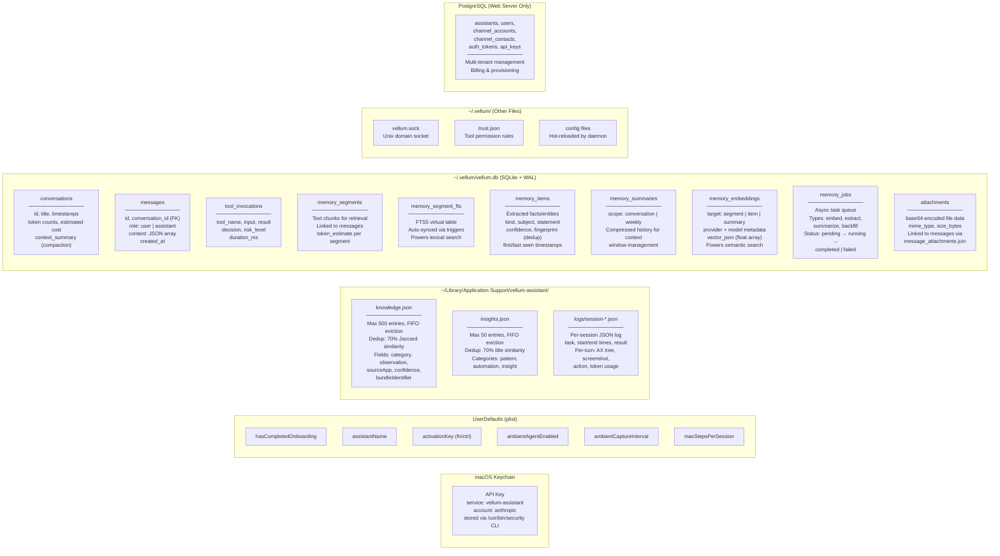
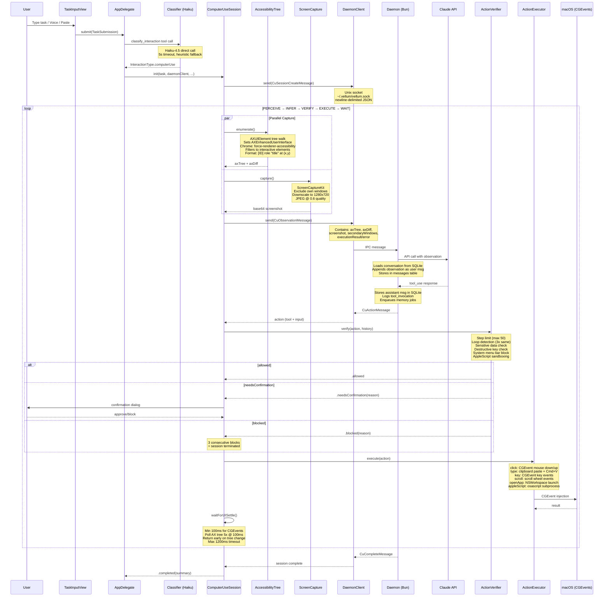
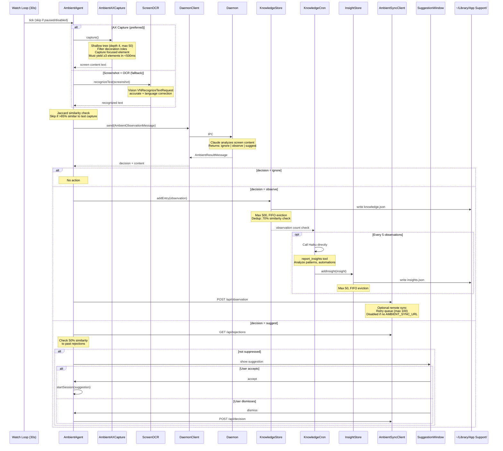
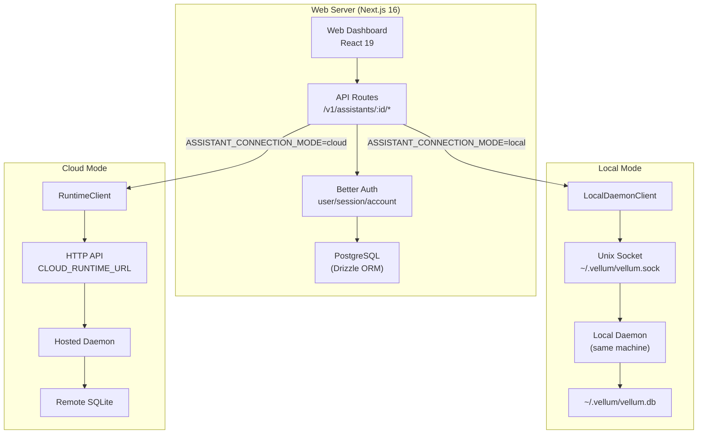
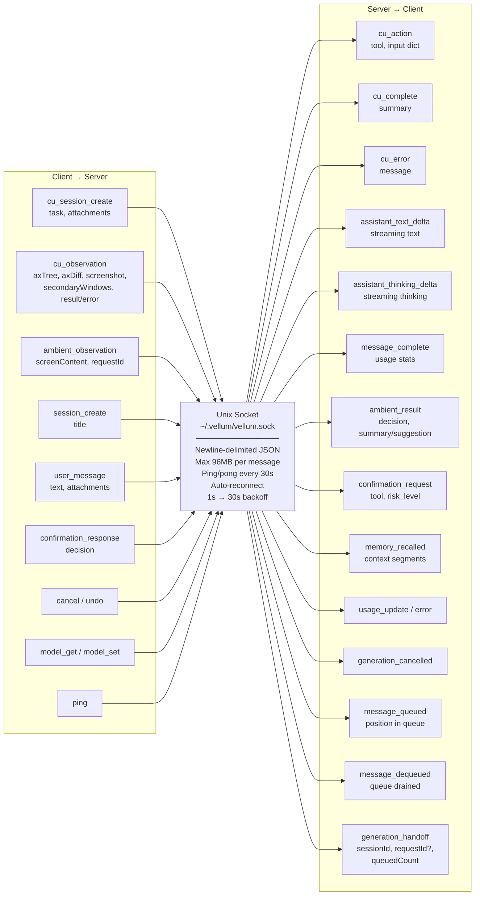
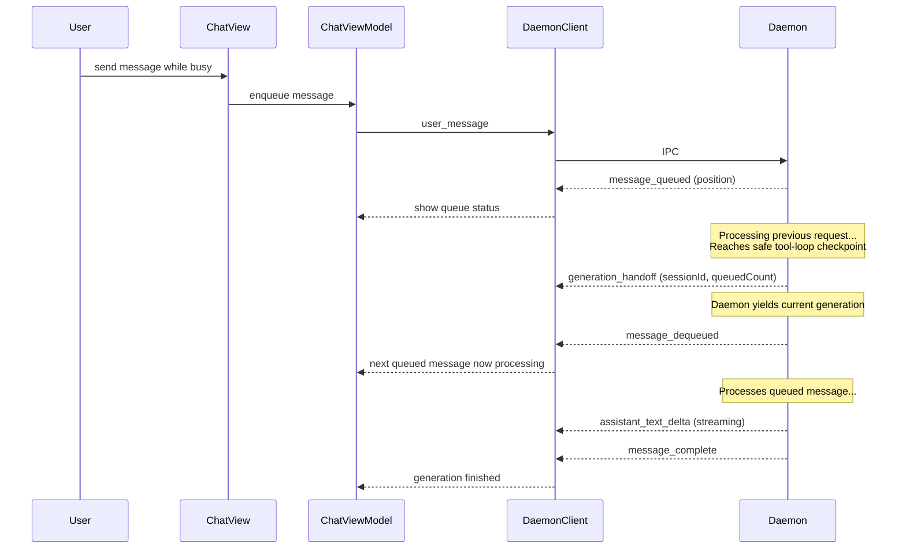

# Vellum Assistant — Architecture

## System Overview

```mermaid
graph TB
    subgraph "macOS Menu Bar App (Swift)"
        UI["UI Layer<br/>NSStatusItem + Popover<br/>SessionOverlay / ThinkingIndicator<br/>Onboarding / Settings"]
        TI["TaskInputView<br/>Text + Voice + Attachments"]
        CLS["Classifier<br/>Haiku direct call<br/>+ heuristic fallback"]

        subgraph "Computer Use Session"
            PERCEIVE["PERCEIVE<br/>AX Tree + Screenshot<br/>(parallel capture)"]
            VERIFY["VERIFY<br/>ActionVerifier<br/>safety checks"]
            EXECUTE["EXECUTE<br/>ActionExecutor<br/>CGEvent injection"]
            WAIT["WAIT<br/>Adaptive UI settle<br/>AX tree polling"]
        end

        subgraph "Ambient Agent"
            WATCH["Watch Loop<br/>every 30s"]
            AX_CAP["AX Capture<br/>shallow tree depth 4"]
            OCR_CAP["Screenshot + OCR<br/>Vision framework fallback"]
            KNOWLEDGE["KnowledgeStore<br/>JSON file, max 500"]
            INSIGHT_CRON["KnowledgeCron<br/>every 5 observations<br/>Haiku direct call"]
            INSIGHT_STORE["InsightStore<br/>JSON file, max 50"]
        end

        subgraph "Text Q&A Session"
            TEXT_SESS["TextSession<br/>streaming deltas"]
            TEXT_WIN["TextResponseWindow"]
        end

        subgraph "Main Window Chat"
            CHAT_VM["ChatViewModel<br/>session bootstrap + streaming"]
            CHAT_VIEW["ChatView<br/>bubbles + composer + stop"]
        end

        VOICE["VoiceInputManager<br/>Fn hold → SFSpeechRecognizer"]
        ATTACH["Attachment System<br/>images, PDFs, text<br/>drag/drop, paste, picker"]
        PERM["PermissionManager<br/>Accessibility, Screen Recording,<br/>Microphone"]
    end

    subgraph "Daemon (Bun + TypeScript)"
        IPC_SERVER["DaemonServer<br/>Unix socket IPC<br/>~/.vellum/vellum.sock"]
        HANDLERS["Message Handlers<br/>session routing"]
        SESSION_MGR["Session Manager<br/>in-memory pool<br/>stale eviction"]

        subgraph "Inference"
            ANTHROPIC["Anthropic Claude<br/>primary provider"]
            OPENAI["OpenAI<br/>secondary provider"]
            GEMINI["Google Gemini<br/>secondary provider"]
            OLLAMA["Ollama<br/>local models"]
        end

        subgraph "Memory System"
            CONV_STORE["ConversationStore<br/>Drizzle ORM CRUD"]
            INDEXER["Memory Indexer<br/>segment + extract"]
            RECALL["Memory Recall<br/>FTS5 + cosine similarity"]
            JOBS_WORKER["MemoryJobsWorker<br/>poll every 1.5s"]
        end

        subgraph "SQLite Database (~/.vellum/vellum.db)"
            DB_CONV["conversations"]
            DB_MSG["messages"]
            DB_TOOL["tool_invocations"]
            DB_SEG["memory_segments"]
            DB_FTS["memory_segment_fts (FTS5)"]
            DB_ITEMS["memory_items"]
            DB_SRC["memory_item_sources"]
            DB_SUM["memory_summaries"]
            DB_EMB["memory_embeddings"]
            DB_JOBS["memory_jobs"]
            DB_ATTACH["attachments"]
            DB_CHAN["channel_inbound_events"]
            DB_KEYS["conversation_keys"]
        end

        HTTP_SERVER["RuntimeHttpServer<br/>(optional, RUNTIME_HTTP_PORT)"]
    end

    subgraph "Web Server (Next.js + React)"
        WEB_UI["Web Dashboard<br/>React 19"]
        WEB_API["API Routes"]

        subgraph "PostgreSQL (Drizzle ORM)"
            PG_ASST["assistants"]
            PG_CHAN["assistant_channel_accounts"]
            PG_CONTACT["assistant_channel_contacts"]
            PG_USER["user / session / account"]
            PG_TOKENS["assistant_auth_tokens"]
            PG_APIKEYS["api_keys"]
        end

        LOCAL_IPC["LocalDaemonClient<br/>Unix socket proxy"]
        RUNTIME_CLIENT["RuntimeClient<br/>HTTP proxy"]
    end

    subgraph "macOS Local Storage"
        KEYCHAIN["Keychain<br/>API key storage"]
        USERDEFAULTS["UserDefaults<br/>preferences / state"]
        APP_SUPPORT["~/Library/App Support/<br/>vellum-assistant/"]
        KNOWLEDGE_JSON["knowledge.json"]
        INSIGHTS_JSON["insights.json"]
        SESSION_LOGS["logs/session-*.json"]
    end

    %% User input flows
    TI -->|"task text"| CLS
    VOICE -->|"transcription"| CLS
    ATTACH -->|"validated files"| TI
    CLS -->|"computerUse"| PERCEIVE
    CLS -->|"textQA"| TEXT_SESS

    %% Computer Use loop
    PERCEIVE -->|"CuObservationMessage"| IPC_SERVER
    IPC_SERVER -->|"CuActionMessage"| VERIFY
    VERIFY -->|"allowed"| EXECUTE
    VERIFY -->|"needsConfirmation"| UI
    UI -->|"approved"| EXECUTE
    VERIFY -->|"blocked"| PERCEIVE
    EXECUTE --> WAIT
    WAIT --> PERCEIVE

    %% Text Q&A flow
    TEXT_SESS -->|"SessionCreate +<br/>UserMessage"| IPC_SERVER
    IPC_SERVER -->|"AssistantTextDelta<br/>stream"| TEXT_WIN

    %% Main Window Chat flow
    CHAT_VM -->|"session_create +<br/>user_message +<br/>cancel"| IPC_SERVER
    IPC_SERVER -->|"session_info +<br/>text deltas +<br/>message_complete +<br/>message_queued +<br/>message_dequeued +<br/>generation_handoff"| CHAT_VM
    CHAT_VIEW --> CHAT_VM

    %% Ambient flow
    WATCH --> AX_CAP
    WATCH -.->|"fallback"| OCR_CAP
    AX_CAP -->|"AmbientObservation"| IPC_SERVER
    OCR_CAP -->|"AmbientObservation"| IPC_SERVER
    IPC_SERVER -->|"AmbientResult<br/>observe"| KNOWLEDGE
    IPC_SERVER -->|"AmbientResult<br/>suggest"| UI
    KNOWLEDGE --> INSIGHT_CRON
    INSIGHT_CRON --> INSIGHT_STORE

    %% Daemon internals
    IPC_SERVER --> HANDLERS
    HANDLERS --> SESSION_MGR
    SESSION_MGR --> ANTHROPIC
    SESSION_MGR --> OPENAI
    SESSION_MGR --> GEMINI
    SESSION_MGR --> OLLAMA
    SESSION_MGR --> CONV_STORE
    CONV_STORE --> DB_CONV
    CONV_STORE --> DB_MSG
    CONV_STORE --> DB_TOOL
    CONV_STORE --> DB_ATTACH
    INDEXER --> DB_SEG
    INDEXER --> DB_FTS
    INDEXER --> DB_ITEMS
    INDEXER --> DB_SRC
    INDEXER --> DB_JOBS
    JOBS_WORKER --> DB_JOBS
    JOBS_WORKER --> DB_EMB
    JOBS_WORKER --> DB_SUM
    RECALL --> DB_FTS
    RECALL --> DB_EMB

    %% Web server
    WEB_API -->|"local mode"| LOCAL_IPC
    LOCAL_IPC -->|"Unix socket"| IPC_SERVER
    WEB_API -->|"cloud mode"| RUNTIME_CLIENT
    RUNTIME_CLIENT -->|"HTTP"| HTTP_SERVER

    %% Local storage
    KNOWLEDGE --> KNOWLEDGE_JSON
    INSIGHT_STORE --> INSIGHTS_JSON
    APP_SUPPORT --- KNOWLEDGE_JSON
    APP_SUPPORT --- INSIGHTS_JSON
    APP_SUPPORT --- SESSION_LOGS

    classDef swift fill:#f9a825,stroke:#f57f17,color:#000
    classDef daemon fill:#42a5f5,stroke:#1565c0,color:#000
    classDef db fill:#66bb6a,stroke:#2e7d32,color:#000
    classDef web fill:#ab47bc,stroke:#6a1b9a,color:#fff
    classDef storage fill:#78909c,stroke:#37474f,color:#fff
    classDef provider fill:#ef5350,stroke:#c62828,color:#fff
```

---

## Data Persistence — Where Everything Lives

---

## Computer Use Session — Detailed Data Flow

---

## Ambient Agent — Detailed Data Flow

---

## Memory System — Daemon Data Flow

```mermaid
graph TB
    subgraph "Write Path"
        MSG_IN["Incoming Message<br/>(IPC or HTTP)"]
        STORE["ConversationStore.addMessage()<br/>Drizzle ORM → SQLite"]
        INDEX["Memory Indexer"]
        SEGMENT["Split into segments<br/>→ memory_segments"]
        EXTRACT_JOB["Enqueue extract_items job<br/>→ memory_jobs"]
        SUMMARY_JOB["Enqueue build_conversation_summary<br/>→ memory_jobs"]
    end

    subgraph "Background Worker (polls every 1.5s)"
        WORKER["MemoryJobsWorker"]
        EMBED_SEG["embed_segment<br/>→ memory_embeddings"]
        EMBED_ITEM["embed_item<br/>→ memory_embeddings"]
        EMBED_SUM["embed_summary<br/>→ memory_embeddings"]
        EXTRACT["extract_items<br/>→ memory_items +<br/>memory_item_sources"]
        BUILD_SUM["build_conversation_summary<br/>→ memory_summaries"]
        WEEKLY["refresh_weekly_summary<br/>→ memory_summaries"]
    end

    subgraph "Embedding Providers"
        OAI_EMB["OpenAI<br/>text-embedding-3-small"]
        GEM_EMB["Gemini<br/>text-embedding-004"]
        OLL_EMB["Ollama<br/>local models"]
    end

    subgraph "Read Path (Memory Recall)"
        QUERY["Recall Query"]
        LEX["Lexical Search<br/>FTS5 on memory_segment_fts"]
        SEM["Semantic Search<br/>Cosine similarity on<br/>memory_embeddings"]
        MERGE["Merge + Rank<br/>recency boost"]
        INJECT["Inject into<br/>system prompt"]
    end

    subgraph "Context Window Management"
        CTX["Session Context"]
        COMPACT["Compaction trigger<br/>(approaching token limit)"]
        SUMMARIZE["Summarize old messages<br/>→ context_summary on conversation"]
        REPLACE["Replace old messages<br/>with summary in context<br/>(originals stay in DB)"]
    end

    MSG_IN --> STORE
    STORE --> INDEX
    INDEX --> SEGMENT
    INDEX --> EXTRACT_JOB
    INDEX --> SUMMARY_JOB

    WORKER --> EMBED_SEG
    WORKER --> EMBED_ITEM
    WORKER --> EMBED_SUM
    WORKER --> EXTRACT
    WORKER --> BUILD_SUM
    WORKER --> WEEKLY

    EMBED_SEG --> OAI_EMB
    EMBED_SEG --> GEM_EMB
    EMBED_SEG --> OLL_EMB

    QUERY --> LEX
    QUERY --> SEM
    LEX --> MERGE
    SEM --> MERGE
    MERGE --> INJECT

    CTX --> COMPACT
    COMPACT --> SUMMARIZE
    SUMMARIZE --> REPLACE
```

---

## Web Server — Connection Modes

---

## IPC Protocol — Message Types

---

## Opportunistic Message Queue — Handoff Flow

When the daemon is busy generating a response, the client can continue sending messages. These are queued (FIFO, max 10) and drained automatically at safe checkpoints in the tool loop, not only at full completion.

---

## Storage Summary

| What | Where | Format | ORM/Driver | Retention |
|------|-------|--------|-----------|-----------|
| API key | macOS Keychain | Encrypted binary | `/usr/bin/security` CLI | Permanent |
| User preferences | UserDefaults | plist | Foundation | Permanent |
| Ambient observations | `~/Library/.../knowledge.json` | JSON array | Swift Codable | Max 500 entries, FIFO |
| Ambient insights | `~/Library/.../insights.json` | JSON array | Swift Codable | Max 50 entries, FIFO |
| Session logs | `~/Library/.../logs/session-*.json` | JSON per session | Swift Codable | Unbounded |
| Conversations & messages | `~/.vellum/vellum.db` | SQLite + WAL | Drizzle ORM (Bun) | Permanent |
| Memory segments & FTS | `~/.vellum/vellum.db` | SQLite FTS5 | Drizzle ORM | Permanent |
| Extracted facts | `~/.vellum/vellum.db` | SQLite | Drizzle ORM | Permanent, deduped |
| Embeddings | `~/.vellum/vellum.db` | JSON float arrays | Drizzle ORM | Permanent |
| Async job queue | `~/.vellum/vellum.db` | SQLite | Drizzle ORM | Completed jobs persist |
| Attachments | `~/.vellum/vellum.db` | Base64 in SQLite | Drizzle ORM | Permanent |
| Tool permission rules | `~/.vellum/trust.json` | JSON | File I/O | Permanent |
| Web users & assistants | PostgreSQL | Relational | Drizzle ORM (pg) | Permanent |
| IPC transport | `~/.vellum/vellum.sock` | Unix domain socket | NWConnection (Swift) / Bun net | Ephemeral |
