# Vellum Assistant — Architecture

## System Overview


```mermaid
graph TB
    subgraph "macOS Menu Bar App (Swift)"
        subgraph "AppServices (singleton container)"
            DC_SWIFT["DaemonClient"]
            AMBIENT["AmbientAgent"]
            SURFACE_MGR["SurfaceManager<br/>route by display field"]
            ZOOM["ZoomManager<br/>(@Observable)"]
            SETTINGS_STORE["SettingsStore<br/>shared settings state"]
        end

        UI["UI Layer<br/>NSStatusItem + Popover<br/>SessionOverlay / ThinkingIndicator<br/>Onboarding / Settings"]
        TI["TaskInputView<br/>Text + Voice + Attachments"]
        CLS["Classifier<br/>Haiku direct call<br/>+ heuristic fallback"]

        subgraph "Computer Use Session"
            PERCEIVE["PERCEIVE<br/>AX Tree + Screenshot<br/>(parallel capture)"]
            VERIFY["VERIFY<br/>ActionVerifier<br/>safety checks"]
            EXECUTE["EXECUTE<br/>ActionExecutor<br/>CGEvent injection"]
            WAIT["WAIT<br/>Adaptive UI settle<br/>AX tree polling"]
        end

        subgraph "Ride Shotgun (Ambient Agent)"
            RS_TRIGGER["RideShotgunTrigger<br/>timer-based auto-invitation<br/>eligibility checks"]
            RS_SESSION["RideShotgunSession<br/>time-boxed observation<br/>daemon IPC + WatchSession"]
            RS_INVITE["RideShotgunInvitationWindow"]
            RS_PROGRESS["RideShotgunProgressWindow"]
            RS_SUMMARY["RideShotgunSummaryWindow"]
            WATCH["WatchSession<br/>timed capture loop"]
            AX_CAP["AmbientAXCapture<br/>shallow tree depth 4"]
            OCR_CAP["ScreenOCR<br/>Vision framework fallback"]
        end

        subgraph "Text Q&A Session"
            TEXT_SESS["TextSession<br/>streaming deltas"]
            TEXT_WIN["TextResponseWindow"]
        end

        subgraph "Main Window"
            MW_STATE["MainWindowState<br/>cross-view UI state"]
            THREAD_MGR["ThreadManager<br/>thread CRUD + delegate"]
            THREAD_RESTORER["ThreadSessionRestorer<br/>daemon session restoration"]
            CHAT_VM["ChatViewModel<br/>session bootstrap + streaming"]
            CHAT_VIEW["ChatView<br/>bubbles + composer + stop"]
        end

        subgraph "Debug Panel"
            TRACE_STORE["TraceStore<br/>in-memory, per-session<br/>dedup + retention cap"]
            DEBUG_PANEL["DebugPanel UI<br/>metrics strip + timeline"]
        end

        subgraph "Dynamic Workspace"
            WORKSPACE["WorkspaceView<br/>toolbar + WKWebView + composer + optional docked chat"]
            DYN_PAGE["DynamicPageSurfaceView<br/>WKWebView + widget injection"]
        end

        VOICE["VoiceInputManager<br/>Fn hold → SFSpeechRecognizer"]
        ATTACH["Attachment System<br/>images, PDFs, text<br/>drag/drop, paste, picker"]
        PERM["PermissionManager<br/>Accessibility, Screen Recording,<br/>Microphone"]
    end

    subgraph "Daemon (Bun + TypeScript)"
        IPC_SERVER["DaemonServer<br/>Unix socket IPC<br/>~/.vellum/vellum.sock"]
        HANDLERS["Message Handlers<br/>session routing"]
        SESSION_MGR["Session Manager<br/>in-memory pool<br/>stale eviction"]

        subgraph "Onboarding Control Plane"
            PLAYBOOK_MGR["OnboardingPlaybookManager<br/>resolve + reconcile channel playbooks"]
            PLAYBOOK_REG["onboarding/playbooks/registry.json<br/>started-channel index"]
            ONBOARD_ORCH["OnboardingOrchestrator<br/>post-hatch sequence + Home Base handoff<br/>runtime onboarding-mode prompt"]
            HOME_BASE_SEED["HomeBaseSeed<br/>prebuilt scaffold seeding<br/>idempotent bootstrap"]
            HOME_BASE_BOOT["HomeBaseBootstrap<br/>durable app-link resolution + repair"]
            HOME_BASE_LINK["HomeBaseAppLinkStore<br/>home_base_app_links table"]
        end

        subgraph "Inference"
            ANTHROPIC["Anthropic Claude<br/>primary provider"]
            OPENAI["OpenAI<br/>secondary provider"]
            GEMINI["Google Gemini<br/>secondary provider"]
            OLLAMA["Ollama<br/>local models"]
        end

        subgraph "Memory System"
            CONV_STORE["ConversationStore<br/>Drizzle ORM CRUD"]
            INDEXER["Memory Indexer<br/>segment + extract"]
            RECALL["Memory Recall<br/>FTS5 + Qdrant + Entity Graph + RRF<br/>Trust + Freshness + Scope"]
            CONFLICT_STORE["ConflictStore<br/>pending/resolved clarification state"]
            CLARIFICATION_RESOLVER["ClarificationResolver<br/>heuristics + timeout-bounded LLM fallback"]
            PROFILE_COMPILER["ProfileCompiler<br/>canonical trusted profile<br/>strict token-cap trimming"]
            JOBS_WORKER["MemoryJobsWorker<br/>poll every 1.5s"]
        end

        subgraph "SQLite Database (~/.vellum/workspace/data/db/assistant.db)"
            DB_CONV["conversations"]
            DB_MSG["messages"]
            DB_TOOL["tool_invocations"]
            DB_SEG["memory_segments"]
            DB_FTS["memory_segment_fts (FTS5)"]
            DB_ITEMS["memory_items"]
            DB_SRC["memory_item_sources"]
            DB_CONFLICTS["memory_item_conflicts"]
            DB_ENT["memory_entities"]
            DB_REL["memory_entity_relations"]
            DB_ITEM_ENT["memory_item_entities"]
            DB_SUM["memory_summaries"]
            DB_EMB["memory_embeddings"]
            DB_JOBS["memory_jobs"]
            DB_ATTACH["attachments"]
            DB_CHAN["channel_inbound_events"]
            DB_KEYS["conversation_keys"]
            DB_REMINDERS["reminders"]
            DB_SCHED_JOBS["cron_jobs (recurrence schedules)"]
            DB_SCHED_RUNS["cron_runs (schedule execution history)"]
            DB_HOME["home_base_app_links"]
            DB_TASKS["tasks"]
            DB_TASK_RUNS["task_runs"]
            DB_WORK_ITEMS["work_items"]
        end

        subgraph "Tracing"
            TRACE_EMITTER["TraceEmitter<br/>per-session, monotonic seq"]
            TOOL_TRACE["ToolTraceListener<br/>event bus subscriber"]
            EVENT_BUS["EventBus<br/>domain events"]
        end

        subgraph "Swarm Orchestration"
            SWARM_TOOL["swarm_delegate tool<br/>recursion guard"]
            ROUTER_PLAN["Router Planner<br/>LLM → DAG plan"]
            DAG_SCHED["DAG Scheduler<br/>topological order<br/>bounded concurrency"]
            WORKER_POOL["Worker Pool<br/>claude_code backend<br/>role-scoped profiles"]
            SYNTH["Synthesizer<br/>LLM + markdown fallback"]
        end

        subgraph "Skill Tool System"
            SKILL_CATALOG["Skill Catalog<br/>bundled + managed + workspace + extra"]
            SKILL_MANIFEST["SKILL.md + TOOLS.json<br/>per-skill directory"]
            SKILL_PROJECTION["projectSkillTools()<br/>session-level projection"]
            SKILL_DERIVE["deriveActiveSkillIds()<br/>scan &lt;loaded_skill&gt; markers"]
            SKILL_FACTORY["SkillToolFactory<br/>manifest → Tool objects"]
            SKILL_HOST_RUNNER["Host Script Runner<br/>in-process import + run()"]
            SKILL_SANDBOX_RUNNER["Sandbox Script Runner<br/>isolated subprocess"]
        end

        subgraph "Integrations"
            INT_REGISTRY["IntegrationRegistry<br/>in-memory definitions"]
            INT_OAUTH["OAuth2 PKCE Flow<br/>Bun.serve loopback"]
            INT_TOKEN["TokenManager<br/>auto-refresh + retry"]
            GMAIL_CLIENT["GmailClient<br/>REST API wrapper"]
            GMAIL_TOOLS["Gmail Tools<br/>(bundled skill: gmail)"]
        end

        subgraph "Script Proxy"
            PROXY_SESSION["SessionManager<br/>per-conversation proxy sessions"]
            PROXY_SERVER["ProxyServer<br/>HTTP forward + CONNECT"]
            PROXY_ROUTER["Router<br/>MITM vs tunnel decision"]
            PROXY_POLICY["PolicyEngine<br/>credential template matching"]
            PROXY_MITM["MITM Handler<br/>TLS termination + rewrite"]
            PROXY_CERTS["Cert Manager<br/>local CA + leaf certs"]
            PROXY_APPROVAL["ApprovalCallback<br/>→ PermissionPrompter"]
        end

        subgraph "Asset Tools"
            ASSET_SEARCH["asset_search<br/>cross-thread metadata query"]
            ASSET_MATERIALIZE["asset_materialize<br/>decode + write to sandbox"]
            VISIBILITY_POLICY["MediaVisibilityPolicy<br/>private thread gate"]
        end

        HTTP_SERVER["RuntimeHttpServer<br/>(optional, RUNTIME_HTTP_PORT)"]
    end

    subgraph "Gateway (Bun + TypeScript)"
        GW_WEBHOOK["Telegram Webhook<br/>/webhooks/telegram"]
        GW_VERIFY["Verify Secret<br/>x-telegram-bot-api-secret-token"]
        GW_NORMALIZE["Normalize Message<br/>DM text only (v1)"]
        GW_ROUTE["Route Resolver<br/>chat_id → user_id → default"]
        GW_FORWARD["Runtime Client<br/>POST /channels/inbound"]
        GW_REPLY["Send Reply<br/>Telegram sendMessage"]
        GW_ATTACH["Send Attachments<br/>sendPhoto / sendDocument"]
        GW_PROXY["Runtime Proxy<br/>(optional, bearer auth)"]
        GW_PROBES["/healthz + /readyz<br/>k8s liveness/readiness"]
    end

    subgraph "Web Server (Next.js + React)"
        WEB_UI["Web Dashboard<br/>React 19"]
        WEB_API["API Routes"]

        subgraph "PostgreSQL (Drizzle ORM)"
            PG_ASST["assistants"]
            PG_CHAN["assistant_channel_accounts"]
            PG_CONTACT["assistant_channel_contacts"]
            PG_USER["user / session / account"]
            PG_TOKENS["assistant tokens (OAuth)"]
            PG_APIKEYS["api_keys"]
        end

        LOCAL_IPC["LocalDaemonClient<br/>Unix socket proxy"]
        RUNTIME_CLIENT["RuntimeClient<br/>HTTP proxy"]
    end

    subgraph "macOS Local Storage"
        KEYCHAIN["Keychain<br/>API key storage"]
        USERDEFAULTS["UserDefaults<br/>preferences / state"]
        APP_SUPPORT["~/Library/App Support/<br/>vellum-assistant/"]
        APPS_DATA["~/.vellum/workspace/data/apps/<br/>app JSON + pages"]
        SESSION_LOGS["logs/session-*.json"]
    end

    %% User input flows
    TI -->|"task_submit<br/>(source='text')"| CLS
    VOICE -->|"task_submit<br/>(source='voice')"| TEXT_SESS
    ATTACH -->|"validated files"| TI
    CLS -->|"computerUse"| PERCEIVE
    CLS -->|"textQA"| TEXT_SESS

    %% Text Q&A → CU escalation
    TEXT_SESS -.->|"computer_use_request_control<br/>(explicit user request)"| PERCEIVE

    %% Computer Use loop
    PERCEIVE -->|"CuObservationMessage"| IPC_SERVER
    IPC_SERVER -->|"CuActionMessage"| VERIFY
    VERIFY -->|"allowed"| EXECUTE
    VERIFY -->|"needsConfirmation"| UI
    UI -->|"approved"| EXECUTE
    VERIFY -->|"blocked"| PERCEIVE
    EXECUTE --> WAIT
    WAIT --> PERCEIVE

    %% Text Q&A flow
    TEXT_SESS -->|"SessionCreate +<br/>UserMessage"| IPC_SERVER
    IPC_SERVER -->|"AssistantTextDelta<br/>stream"| TEXT_WIN

    %% Main Window Chat flow
    CHAT_VM -->|"session_create +<br/>user_message +<br/>cancel"| IPC_SERVER
    IPC_SERVER -->|"session_info +<br/>text deltas +<br/>message_complete +<br/>session_error +<br/>message_queued +<br/>message_dequeued +<br/>generation_handoff"| CHAT_VM
    CHAT_VIEW --> CHAT_VM
    MW_STATE -->|"home_base_get + app_open_request<br/>(dashboard-first bootstrap)"| IPC_SERVER

    %% Ride Shotgun flow
    RS_TRIGGER -->|"shouldShowInvitation"| AMBIENT
    AMBIENT -->|"show"| RS_INVITE
    RS_INVITE -->|"accepted"| RS_SESSION
    RS_SESSION --> WATCH
    WATCH --> AX_CAP
    WATCH -.->|"fallback"| OCR_CAP
    RS_SESSION -->|"observations via<br/>daemon IPC"| IPC_SERVER
    RS_SESSION -->|"progress"| RS_PROGRESS
    RS_SESSION -->|"summary"| RS_SUMMARY

    %% Dynamic Workspace flow
    IPC_SERVER -->|"ui_surface_show"| SURFACE_MGR
    SURFACE_MGR -->|"display != inline<br/>.openDynamicWorkspace"| WORKSPACE
    WORKSPACE --> DYN_PAGE
    DYN_PAGE -->|"vellumBridge<br/>actions + data RPC"| IPC_SERVER

    %% Daemon internals
    IPC_SERVER --> HANDLERS
    HANDLERS --> SESSION_MGR
    SESSION_MGR --> ANTHROPIC
    SESSION_MGR --> OPENAI
    SESSION_MGR --> GEMINI
    SESSION_MGR --> OLLAMA
    SESSION_MGR --> CONV_STORE
    SESSION_MGR --> PROFILE_COMPILER
    HANDLERS -->|"session_create.transport"| PLAYBOOK_MGR
    PLAYBOOK_MGR --> PLAYBOOK_REG
    PLAYBOOK_MGR -->|"inject <channel_onboarding_playbook><br/>runtime context"| SESSION_MGR
    PLAYBOOK_MGR --> ONBOARD_ORCH
    ONBOARD_ORCH -->|"inject <onboarding_mode><br/>runtime context"| SESSION_MGR
    IPC_SERVER -.->|"daemon startup bootstrap + home_base_get"| HOME_BASE_BOOT
    HOME_BASE_BOOT --> HOME_BASE_SEED
    HOME_BASE_BOOT --> HOME_BASE_LINK
    HOME_BASE_LINK --> DB_HOME
    HOME_BASE_SEED --> APPS_DATA
    CONV_STORE --> DB_CONV
    CONV_STORE --> DB_MSG
    CONV_STORE --> DB_TOOL
    CONV_STORE --> DB_ATTACH
    PROFILE_COMPILER --> DB_ITEMS
    INDEXER --> DB_SEG
    INDEXER --> DB_FTS
    INDEXER --> DB_ITEMS
    INDEXER --> DB_SRC
    INDEXER --> DB_JOBS
    JOBS_WORKER --> DB_JOBS
    JOBS_WORKER --> DB_EMB
    JOBS_WORKER --> DB_ENT
    JOBS_WORKER --> DB_REL
    JOBS_WORKER --> DB_ITEM_ENT
    JOBS_WORKER --> DB_SUM
    RECALL --> DB_FTS
    RECALL --> DB_EMB

    %% Gateway flow — Telegram path
    GW_WEBHOOK --> GW_VERIFY
    GW_VERIFY --> GW_NORMALIZE
    GW_NORMALIZE --> GW_ROUTE
    GW_ROUTE --> GW_FORWARD
    GW_FORWARD -->|"HTTP"| HTTP_SERVER
    HTTP_SERVER -->|"channels/inbound transport<br/>channelId + hints + uxBrief"| PLAYBOOK_MGR
    GW_REPLY -->|"Telegram API"| GW_WEBHOOK
    GW_ATTACH -->|"download from runtime<br/>+ upload to Telegram"| GW_WEBHOOK

    %% Gateway flow — Runtime proxy path (optional)
    GW_PROXY -->|"HTTP (forwarded)"| HTTP_SERVER

    %% Web server
    WEB_API -->|"local mode"| LOCAL_IPC
    LOCAL_IPC -->|"Unix socket"| IPC_SERVER
    WEB_API -->|"cloud mode"| RUNTIME_CLIENT
    RUNTIME_CLIENT -->|"HTTP"| HTTP_SERVER

    %% Swarm data flow
    SESSION_MGR -->|"swarm_delegate<br/>tool_use"| SWARM_TOOL
    SWARM_TOOL --> ROUTER_PLAN
    ROUTER_PLAN --> DAG_SCHED
    DAG_SCHED --> WORKER_POOL
    WORKER_POOL --> ANTHROPIC
    DAG_SCHED --> SYNTH
    SYNTH --> ANTHROPIC

    %% Tracing data flow
    SESSION_MGR --> TRACE_EMITTER
    EVENT_BUS --> TOOL_TRACE
    TOOL_TRACE --> TRACE_EMITTER
    TRACE_EMITTER -->|"trace_event"| IPC_SERVER
    IPC_SERVER -->|"trace_event"| TRACE_STORE
    TRACE_STORE --> DEBUG_PANEL

    %% Integration data flow
    HANDLERS -->|"integration_connect"| INT_REGISTRY
    INT_REGISTRY --> INT_OAUTH
    INT_OAUTH -->|"open_url"| IPC_SERVER
    INT_OAUTH -->|"store tokens"| KEYCHAIN
    GMAIL_TOOLS --> INT_TOKEN
    INT_TOKEN -->|"auto-refresh"| KEYCHAIN
    INT_TOKEN --> GMAIL_CLIENT

    %% Skill tool data flow
    SESSION_MGR -->|"per-turn resolveTools"| SKILL_PROJECTION
    SKILL_PROJECTION --> SKILL_DERIVE
    SKILL_DERIVE -->|"&lt;loaded_skill id=...&gt;<br/>markers in history"| SKILL_CATALOG
    SKILL_PROJECTION --> SKILL_CATALOG
    SKILL_CATALOG --> SKILL_MANIFEST
    SKILL_MANIFEST --> SKILL_FACTORY
    SKILL_FACTORY -->|"register/unregister"| HANDLERS
    SKILL_FACTORY -->|"host tools"| SKILL_HOST_RUNNER
    SKILL_FACTORY -->|"sandbox tools"| SKILL_SANDBOX_RUNNER

    %% Script proxy data flow
    SESSION_MGR -->|"proxied bash<br/>network_mode"| PROXY_SESSION
    PROXY_SESSION --> PROXY_SERVER
    PROXY_SERVER --> PROXY_ROUTER
    PROXY_ROUTER -->|"mitm: credential_injection"| PROXY_MITM
    PROXY_MITM --> PROXY_CERTS
    PROXY_SERVER --> PROXY_POLICY
    PROXY_POLICY -->|"ask_*"| PROXY_APPROVAL
    PROXY_APPROVAL --> HANDLERS

    %% Asset tools data flow
    SESSION_MGR -->|"tool_use"| ASSET_SEARCH
    SESSION_MGR -->|"tool_use"| ASSET_MATERIALIZE
    ASSET_SEARCH --> DB_ATTACH
    ASSET_SEARCH --> VISIBILITY_POLICY
    ASSET_MATERIALIZE --> DB_ATTACH
    ASSET_MATERIALIZE --> VISIBILITY_POLICY

    %% Local storage
    APP_SUPPORT --- SESSION_LOGS

    classDef swift fill:#f9a825,stroke:#f57f17,color:#000
    classDef daemon fill:#42a5f5,stroke:#1565c0,color:#000
    classDef db fill:#66bb6a,stroke:#2e7d32,color:#000
    classDef web fill:#ab47bc,stroke:#6a1b9a,color:#fff
    classDef storage fill:#78909c,stroke:#37474f,color:#fff
    classDef provider fill:#ef5350,stroke:#c62828,color:#fff
```

### Channel Onboarding Playbook Bootstrap

- Transport metadata arrives via `session_create.transport` (IPC) or `/channels/inbound` (`channelId`, optional `hints`, optional `uxBrief`).
- Telegram webhook ingress now injects deterministic channel-safe transport metadata (`hints` + `uxBrief`) so non-dashboard channels defer Home Base-only UI tasks cleanly.
- `OnboardingPlaybookManager` resolves `<channel>_onboarding.md`, checks `onboarding/playbooks/registry.json`, and applies first-time fast-path vs cross-channel reconciliation.
- `OnboardingOrchestrator` derives onboarding-mode guidance (post-hatch sequence, USER.md capture, Home Base handoff) from playbook + transport context.
- Session runtime assembly injects both `<channel_onboarding_playbook>` and `<onboarding_mode>` context before provider calls, then strips both from persisted conversation history.
- Daemon startup runs `ensurePrebuiltHomeBaseSeeded()` to provision one idempotent prebuilt Home Base app in `~/.vellum/workspace/data/apps`.
- Home Base onboarding buttons relay prefilled natural-language prompts to the main assistant; permission setup remains user-initiated and hatch + first-conversation flows avoid proactive permission asks.

---

## macOS App — Service and State Ownership

The macOS app uses a centralized service container (`AppServices`) created once in `AppDelegate` and passed down via dependency injection rather than singletons or ambient state.

### AppServices Container

`AppServices` is the single owner of all long-lived services. `AppDelegate` creates it on launch and passes individual services to windows, views, and managers.

| Service | Type | Purpose |
|---------|------|---------|
| `daemonClient` | `DaemonClient` | Unix socket IPC to daemon |
| `ambientAgent` | `AmbientAgent` | Coordinates Ride Shotgun trigger, session, and floating windows |
| `surfaceManager` | `SurfaceManager` | Routes `ui_surface_show` messages |
| `toolConfirmationManager` | `ToolConfirmationManager` | Handles tool permission prompts |
| `secretPromptManager` | `SecretPromptManager` | Handles secret input prompts |
| `zoomManager` | `ZoomManager` | Window zoom level (`@Observable`) |
| `settingsStore` | `SettingsStore` | Shared settings state for both SettingsView and SettingsPanel |

### Main Window State

The main window has three dedicated state objects:

| Object | Pattern | Scope |
|--------|---------|-------|
| `MainWindowState` | `ObservableObject` | Cross-view UI state: active panel, dynamic workspace, API key status |
| `ThreadManager` | `ObservableObject` | Thread CRUD, tab management, conforms to `ThreadRestorerDelegate` |
| `ThreadSessionRestorer` | Plain class with delegate | Daemon session restoration (session list responses, history hydration) |

`ThreadManager` owns thread lifecycle. `ThreadSessionRestorer` handles the async daemon communication for restoring sessions on reconnect, delegating state mutations back through the `ThreadRestorerDelegate` protocol for testability.

### Observation Framework Migration

Low-risk types use Swift's `@Observable` macro (Observation framework) instead of `ObservableObject`/`@Published`:

| Type | Consumer pattern |
|------|-----------------|
| `ZoomManager` | Plain `var` (read-only in views) |
| `ConversationInputState` | `@Bindable` (bindings needed for text input) |
| `BundleConfirmationViewModel` | Plain `var` (read-only in view) |

Types that use Combine `$`-prefixed publishers (e.g., `VoiceTranscriptionViewModel`) remain as `ObservableObject`.

---

## Data Persistence — Where Everything Lives


```mermaid
graph LR
    subgraph "macOS Keychain"
        K1["API Key<br/>service: vellum-assistant<br/>account: anthropic<br/>stored via /usr/bin/security CLI"]
        K2["Credential Secrets<br/>key: credential:{service}:{field}<br/>stored via secure-keys.ts<br/>(encrypted file fallback if Keychain unavailable)"]
    end

    subgraph "UserDefaults (plist)"
        UD1["hasCompletedOnboarding"]
        UD2["assistantName"]
        UD3["activationKey (fn/ctrl)"]
        UD4["ambientAgentEnabled"]
        UD5["ambientCaptureInterval"]
        UD6["maxStepsPerSession"]
    end

    subgraph "~/Library/Application Support/vellum-assistant/"
        direction TB
        SL["logs/session-*.json<br/>───────────────<br/>Per-session JSON log<br/>task, start/end times, result<br/>Per-turn: AX tree, screenshot,<br/>action, token usage"]
    end

    subgraph "~/.vellum/workspace/data/db/assistant.db (SQLite + WAL)"
        direction TB
        CONV["conversations<br/>───────────────<br/>id, title, timestamps<br/>token counts, estimated cost<br/>context_summary (compaction)<br/>thread_type: 'standard' | 'private'<br/>memory_scope_id: 'default' | 'private:&lt;uuid&gt;'"]
        MSG["messages<br/>───────────────<br/>id, conversation_id (FK)<br/>role: user | assistant<br/>content: JSON array<br/>created_at"]
        TOOL["tool_invocations<br/>───────────────<br/>tool_name, input, result<br/>decision, risk_level<br/>duration_ms"]
        SEG["memory_segments<br/>───────────────<br/>Text chunks for retrieval<br/>Linked to messages<br/>token_estimate per segment"]
        FTS["memory_segment_fts<br/>───────────────<br/>FTS5 virtual table<br/>Auto-synced via triggers<br/>Powers lexical search"]
        ITEMS["memory_items<br/>───────────────<br/>Extracted facts/entities<br/>kind, subject, statement<br/>confidence, fingerprint (dedup)<br/>verification_state, scope_id<br/>first/last seen timestamps"]
        CONFLICTS["memory_item_conflicts<br/>───────────────<br/>Pending/resolved contradiction pairs<br/>existing_item_id + candidate_item_id<br/>clarification question + resolution note<br/>partial unique pending pair index"]
        ENTITIES["memory_entities<br/>───────────────<br/>Canonical entities + aliases<br/>mention_count, first/last seen<br/>Resolved across messages"]
        RELS["memory_entity_relations<br/>───────────────<br/>Directional entity edges<br/>Unique by source/target/relation<br/>first/last seen + evidence"]
        ITEM_ENTS["memory_item_entities<br/>───────────────<br/>Join table linking extracted<br/>memory_items to entities"]
        SUM["memory_summaries<br/>───────────────<br/>scope: conversation | weekly<br/>Compressed history for context<br/>window management"]
        EMB["memory_embeddings<br/>───────────────<br/>target: segment | item | summary<br/>provider + model metadata<br/>vector_json (float array)<br/>Powers semantic search"]
        JOBS["memory_jobs<br/>───────────────<br/>Async task queue<br/>Types: embed, extract,<br/>summarize, backfill,<br/>conflict resolution, cleanup<br/>Status: pending → running →<br/>completed | failed"]
        ATT["attachments<br/>───────────────<br/>base64-encoded file data<br/>mime_type, size_bytes<br/>Linked to messages via<br/>message_attachments join"]
        REM["reminders<br/>───────────────<br/>One-time scheduled reminders<br/>label, message, fireAt<br/>mode: notify | execute<br/>status: pending → fired | cancelled"]
        SCHED_JOBS["cron_jobs (recurrence schedules)<br/>───────────────<br/>Recurring schedule definitions<br/>cron_expression: cron or RRULE string<br/>schedule_syntax: 'cron' | 'rrule'<br/>timezone, message, next_run_at<br/>enabled, retry_count<br/>Legacy alias: scheduleJobs"]
        SCHED_RUNS["cron_runs (schedule runs)<br/>───────────────<br/>Execution history per schedule<br/>job_id (FK → cron_jobs)<br/>status: ok | error<br/>duration_ms, output, error<br/>Legacy alias: scheduleRuns"]
        TASKS["tasks<br/>───────────────<br/>Reusable prompt templates<br/>title, Handlebars template<br/>inputSchema, contextFlags<br/>requiredTools, status"]
        TASK_RUNS["task_runs<br/>───────────────<br/>Execution history per task<br/>taskId (FK → tasks)<br/>conversationId, status<br/>startedAt, finishedAt, error"]
        WORK_ITEMS["work_items<br/>───────────────<br/>Task Queue entries<br/>taskId (FK → tasks)<br/>title, notes, status<br/>priority_tier (0-3), sort_index<br/>last_run_id, last_run_status<br/>source_type, source_id"]
    end

    subgraph "~/.vellum/workspace/data/ipc-blobs/"
        BLOBS["*.blob<br/>───────────────<br/>Ephemeral blob files<br/>UUID filenames<br/>Atomic temp+rename writes<br/>Consumed after daemon hydration<br/>Stale sweep every 5min (30min max age)"]
    end

    subgraph "~/.vellum/ (Root Files)"
        SOCK["vellum.sock<br/>Unix domain socket"]
        TRUST["protected/trust.json<br/>Tool permission rules"]
    end

    subgraph "~/.vellum/workspace/ (Workspace Files)"
        CONFIG["config files<br/>Hot-reloaded by daemon"]
        ONBOARD_PLAYBOOKS["onboarding/playbooks/<br/>[channel]_onboarding.md<br/>assistant-updatable checklists"]
        ONBOARD_REGISTRY["onboarding/playbooks/registry.json<br/>channel-start index for fast-path + reconciliation"]
        APPS_STORE["data/apps/<br/><app-id>.json + pages/*.html<br/>prebuilt Home Base seeded here"]
        SKILLS_DIR["skills/<br/>managed skill directories<br/>SKILL.md + TOOLS.json + tools/"]
    end

    subgraph "PostgreSQL (Web Server Only)"
        PG["assistants, users,<br/>channel_accounts,<br/>channel_contacts,<br/>api_tokens, api_keys<br/>───────────────<br/>Multi-tenant management<br/>Billing & provisioning"]
    end
```

---

## Computer Use Session — Detailed Data Flow

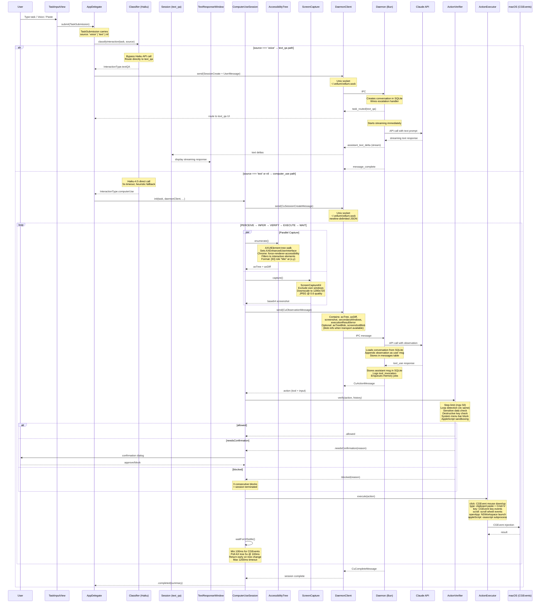
```mermaid
sequenceDiagram
    participant User
    participant UI as TaskInputView
    participant AD as AppDelegate
    participant CLS as Classifier (Haiku)
    participant TextSess as Session (text_qa)
    participant TW as TextResponseWindow
    participant Session as ComputerUseSession
    participant AX as AccessibilityTree
    participant SC as ScreenCapture
    participant DC as DaemonClient
    participant Daemon as Daemon (Bun)
    participant Claude as Claude API
    participant AV as ActionVerifier
    participant AE as ActionExecutor
    participant macOS as macOS (CGEvents)

    User->>UI: Type task / Voice / Paste
    UI->>AD: submit(TaskSubmission)
    Note over AD: TaskSubmission carries<br/>source: 'voice' | 'text' | nil
    AD->>CLS: classifyInteraction(task, source)

    alt source === 'voice' → text_qa path
        Note over CLS: Bypass Haiku API call<br/>Route directly to text_qa
        CLS-->>AD: InteractionType.textQA
        AD->>DC: send(SessionCreate + UserMessage)
        Note over DC: Unix socket<br/>~/.vellum/vellum.sock
        DC->>Daemon: IPC
        Note over Daemon: Creates conversation in SQLite<br/>Wires escalation handler
        Daemon-->>DC: task_routed(text_qa)
        DC-->>AD: route to text_qa UI
        Note over Daemon: Starts streaming immediately
        Daemon->>Claude: API call with text prompt
        Claude-->>Daemon: streaming text response
        Daemon-->>DC: assistant_text_delta (stream)
        DC-->>TextSess: text deltas
        TextSess-->>TW: display streaming response
        Daemon-->>DC: message_complete

    else source === 'text' or nil → computer_use path
        Note over CLS: Haiku-4.5 direct call<br/>5s timeout, heuristic fallback
        CLS-->>AD: InteractionType.computerUse

        AD->>Session: init(task, daemonClient, ...)
        Session->>DC: send(CuSessionCreateMessage)
        Note over DC: Unix socket<br/>~/.vellum/vellum.sock<br/>newline-delimited JSON

        loop PERCEIVE → INFER → VERIFY → EXECUTE → WAIT
            par Parallel Capture
                Session->>AX: enumerate()
                Note over AX: AXUIElement tree walk<br/>Sets AXEnhancedUserInterface<br/>Chrome: force-renderer-accessibility<br/>Filters to interactive elements<br/>Format: [ID] role "title" at (x,y)
                AX-->>Session: axTree + axDiff
            and
                Session->>SC: capture()
                Note over SC: ScreenCaptureKit<br/>Exclude own windows<br/>Downscale to 1280x720<br/>JPEG @ 0.6 quality
                SC-->>Session: base64 screenshot
            end

            Session->>DC: send(CuObservationMessage)
            Note over DC: Contains: axTree, axDiff,<br/>screenshot, secondaryWindows,<br/>executionResult/error<br/>Optional: axTreeBlob, screenshotBlob<br/>(blob refs when transport available)

            DC->>Daemon: IPC message
            Daemon->>Claude: API call with observation
            Note over Daemon: Loads conversation from SQLite<br/>Appends observation as user msg<br/>Stores in messages table
            Claude-->>Daemon: tool_use response
            Note over Daemon: Stores assistant msg in SQLite<br/>Logs tool_invocation<br/>Enqueues memory jobs
            Daemon-->>DC: CuActionMessage

            DC-->>Session: action (tool + input)

            Session->>AV: verify(action, history)
            Note over AV: Step limit (max 50)<br/>Loop detection (3x same)<br/>Sensitive data check<br/>Destructive key check<br/>System menu bar block<br/>AppleScript sandboxing

            alt allowed
                AV-->>Session: .allowed
            else needsConfirmation
                AV-->>Session: .needsConfirmation(reason)
                Session->>User: confirmation dialog
                User-->>Session: approve/block
            else blocked
                AV-->>Session: .blocked(reason)
                Note over Session: 3 consecutive blocks<br/>= session terminated
            end

            Session->>AE: execute(action)
            Note over AE: click: CGEvent mouse down/up<br/>type: clipboard paste + Cmd+V<br/>key: CGEvent key events<br/>scroll: scroll wheel events<br/>openApp: NSWorkspace launch<br/>appleScript: osascript subprocess

            AE->>macOS: CGEvent injection
            macOS-->>AE: result

            Session->>Session: waitForUISettle()
            Note over Session: Min 100ms for CGEvents<br/>Poll AX tree 5x @ 100ms<br/>Return early on tree change<br/>Max 1200ms timeout
        end

        Daemon-->>DC: CuCompleteMessage
        DC-->>Session: session complete
        Session-->>AD: .completed(summary)
    end
```

---

## Ride Shotgun — Detailed Data Flow

The Ride Shotgun system replaces the legacy ambient suggestion pipeline. Instead of continuously observing and generating suggestions, it uses a timer-based invitation model: after eligibility checks pass, the user is invited to a time-boxed observation session. Captures are sent to the daemon for analysis, and a summary is presented at the end.

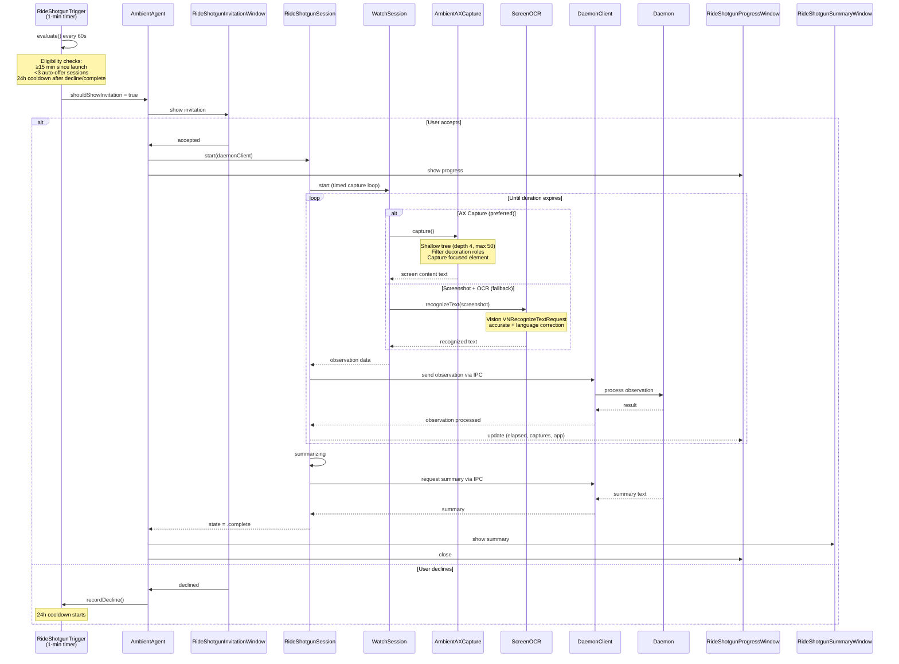
```mermaid
sequenceDiagram
    participant Trigger as RideShotgunTrigger<br/>(1-min timer)
    participant Agent as AmbientAgent
    participant InviteWin as RideShotgunInvitationWindow
    participant Session as RideShotgunSession
    participant WS as WatchSession
    participant AXC as AmbientAXCapture
    participant OCR as ScreenOCR
    participant DC as DaemonClient
    participant Daemon as Daemon
    participant ProgressWin as RideShotgunProgressWindow
    participant SummaryWin as RideShotgunSummaryWindow

    Trigger->>Trigger: evaluate() every 60s
    Note over Trigger: Eligibility checks:<br/>≥15 min since launch<br/><3 auto-offer sessions<br/>24h cooldown after decline/complete

    Trigger->>Agent: shouldShowInvitation = true
    Agent->>InviteWin: show invitation

    alt User accepts
        InviteWin->>Agent: accepted
        Agent->>Session: start(daemonClient)
        Agent->>ProgressWin: show progress

        Session->>WS: start (timed capture loop)

        loop Until duration expires
            alt AX Capture (preferred)
                WS->>AXC: capture()
                Note over AXC: Shallow tree (depth 4, max 50)<br/>Filter decoration roles<br/>Capture focused element
                AXC-->>WS: screen content text
            else Screenshot + OCR (fallback)
                WS->>OCR: recognizeText(screenshot)
                Note over OCR: Vision VNRecognizeTextRequest<br/>accurate + language correction
                OCR-->>WS: recognized text
            end

            WS-->>Session: observation data
            Session->>DC: send observation via IPC
            DC->>Daemon: process observation
            Daemon-->>DC: result
            DC-->>Session: observation processed
            Session-->>ProgressWin: update (elapsed, captures, app)
        end

        Session->>Session: summarizing
        Session->>DC: request summary via IPC
        Daemon-->>DC: summary text
        DC-->>Session: summary
        Session-->>Agent: state = .complete
        Agent->>SummaryWin: show summary
        Agent->>ProgressWin: close
    else User declines
        InviteWin->>Agent: declined
        Agent->>Trigger: recordDecline()
        Note over Trigger: 24h cooldown starts
    end
```

---

## Memory System — Daemon Data Flow


```mermaid
graph TB
    subgraph "Write Path"
        MSG_IN["Incoming Message<br/>(IPC or HTTP)"]
        STORE["ConversationStore.addMessage()<br/>Drizzle ORM → SQLite"]
        INDEX["Memory Indexer"]
        SEGMENT["Split into segments<br/>→ memory_segments"]
        EXTRACT_JOB["Enqueue extract_items job<br/>→ memory_jobs"]
        CONFLICT_RESOLVE_JOB["Enqueue resolve_pending_conflicts_for_message<br/>(dedupe by type+message+scope)<br/>→ memory_jobs"]
        SUMMARY_JOB["Enqueue build_conversation_summary<br/>→ memory_jobs"]
    end

    subgraph "Background Worker (polls every 1.5s)"
        WORKER["MemoryJobsWorker"]
        EMBED_SEG["embed_segment<br/>→ memory_embeddings"]
        EMBED_ITEM["embed_item<br/>→ memory_embeddings"]
        EMBED_SUM["embed_summary<br/>→ memory_embeddings"]
        EXTRACT["extract_items<br/>→ memory_items +<br/>memory_item_sources"]
        CHECK_CONTRA["check_contradictions<br/>→ contradiction/update merge OR<br/>pending_clarification + memory_item_conflicts"]
        RESOLVE_PENDING["resolve_pending_conflicts_for_message<br/>message-scoped clarification resolution<br/>→ resolved conflict + item status updates"]
        CLEAN_CONFLICTS["cleanup_resolved_conflicts<br/>delete resolved conflict rows<br/>older than retention window"]
        CLEAN_SUPERSEDED["cleanup_stale_superseded_items<br/>delete stale superseded items<br/>and item embedding rows"]
        EXTRACT_ENTITIES["extract_entities<br/>→ memory_entities +<br/>memory_item_entities +<br/>memory_entity_relations"]
        BACKFILL_REL["backfill_entity_relations<br/>checkpointed message scan<br/>→ enqueue extract_entities"]
        BUILD_SUM["build_conversation_summary<br/>→ memory_summaries"]
        WEEKLY["refresh_weekly_summary<br/>→ memory_summaries"]
    end

    subgraph "Embedding Providers"
        LOCAL_EMB["Local (ONNX)<br/>bge-small-en-v1.5"]
        OAI_EMB["OpenAI<br/>text-embedding-3-small"]
        GEM_EMB["Gemini<br/>gemini-embedding-001"]
        OLL_EMB["Ollama<br/>nomic-embed-text"]
    end

    subgraph "Read Path (Memory Recall)"
        QUERY["Recall Query Builder<br/>User request + compacted context summary"]
        CONFLICT_GATE["Soft Conflict Gate<br/>resolve pending conflicts from user turn<br/>relevance + cooldown ask-once behavior"]
        PROFILE_BUILD["Dynamic Profile Compiler<br/>active trusted profile memories<br/>user_confirmed > user_reported > assistant_inferred"]
        PROFILE_INJECT["Inject profile context block<br/>into runtime user tail<br/>(strict token cap)"]
        BUDGET["Dynamic Recall Budget<br/>computeRecallBudget()<br/>from prompt headroom"]
        LEX["Lexical Search<br/>FTS5 on memory_segment_fts"]
        SEM["Semantic Search<br/>Qdrant cosine similarity"]
        ENTITY_SEARCH["Entity Search<br/>Seed name/alias matching"]
        REL_EXPAND["Relation Expansion<br/>1-hop via memory_entity_relations<br/>→ neighbor item links"]
        DIRECT["Direct Item Search<br/>LIKE on subject/statement"]
        SCOPE["Scope Filter<br/>scope_id filtering<br/>(strict | global_fallback)<br/>Private threads: own scope + 'default'"]
        MERGE["RRF Merge<br/>+ Trust Weighting<br/>+ Freshness Decay"]
        CAPS["Source Caps<br/>bound per-source candidate count"]
        RERANK["LLM Re-ranking<br/>(Haiku, optional)"]
        TRIM["Token Trim<br/>maxInjectTokens override<br/>or static fallback"]
        INJECT["Attention-ordered<br/>Injection into prompt"]
        TELEMETRY["Emit memory_recalled<br/>hits + relation counters +<br/>ranking diagnostics"]
        STRIP_PROFILE["Strip injected dynamic profile block<br/>before persisting conversation history"]
    end

    subgraph "Context Window Management"
        CTX["Session Context"]
        COMPACT["Compaction trigger<br/>(approaching token limit)"]
        GUARDS["Cooldown + early-exit guards<br/>with severe-pressure override"]
        SUMMARIZE["Summarize old messages<br/>→ context_summary on conversation"]
        REPLACE["Replace old messages<br/>with summary in context<br/>(originals stay in DB)"]
    end

    MSG_IN --> STORE
    STORE --> INDEX
    INDEX --> SEGMENT
    INDEX --> EXTRACT_JOB
    INDEX --> CONFLICT_RESOLVE_JOB
    INDEX --> SUMMARY_JOB

    WORKER --> EMBED_SEG
    WORKER --> EMBED_ITEM
    WORKER --> EMBED_SUM
    WORKER --> EXTRACT
    WORKER --> CHECK_CONTRA
    WORKER --> RESOLVE_PENDING
    WORKER --> CLEAN_CONFLICTS
    WORKER --> CLEAN_SUPERSEDED
    WORKER --> EXTRACT_ENTITIES
    WORKER --> BACKFILL_REL
    WORKER --> BUILD_SUM
    WORKER --> WEEKLY
    EXTRACT --> CHECK_CONTRA
    EXTRACT --> EXTRACT_ENTITIES

    EMBED_SEG --> OAI_EMB
    EMBED_SEG --> GEM_EMB
    EMBED_SEG --> OLL_EMB

    QUERY --> CONFLICT_GATE
    CONFLICT_GATE --> PROFILE_BUILD
    PROFILE_BUILD --> PROFILE_INJECT
    CONFLICT_GATE --> LEX
    CONFLICT_GATE --> SEM
    CONFLICT_GATE --> ENTITY_SEARCH
    CONFLICT_GATE --> DIRECT
    LEX --> SCOPE
    SEM --> SCOPE
    ENTITY_SEARCH --> REL_EXPAND
    REL_EXPAND --> SCOPE
    DIRECT --> SCOPE
    SCOPE --> MERGE
    MERGE --> CAPS
    CAPS --> RERANK
    RERANK --> TRIM
    BUDGET --> TRIM
    TRIM --> INJECT
    PROFILE_INJECT --> INJECT
    INJECT --> TELEMETRY
    INJECT --> STRIP_PROFILE

    CTX --> COMPACT
    COMPACT --> GUARDS
    GUARDS --> SUMMARIZE
    SUMMARIZE --> REPLACE
```

### Memory Retrieval Config Knobs (Defaults)

| Config key | Default | Purpose |
|---|---:|---|
| `memory.retrieval.dynamicBudget.enabled` | `true` | Toggle per-turn recall budget calculation from live prompt headroom. |
| `memory.retrieval.dynamicBudget.minInjectTokens` | `1200` | Lower clamp for computed recall injection budget. |
| `memory.retrieval.dynamicBudget.maxInjectTokens` | `10000` | Upper clamp for computed recall injection budget. |
| `memory.retrieval.dynamicBudget.targetHeadroomTokens` | `10000` | Reserved headroom to keep free for response generation/tool traces. |
| `memory.entity.extractRelations.enabled` | `true` | Enable relation edge extraction and persistence in `memory_entity_relations`. |
| `memory.entity.extractRelations.backfillBatchSize` | `200` | Batch size for checkpointed `backfill_entity_relations` jobs. |
| `memory.entity.relationRetrieval.enabled` | `true` | Enable one-hop relation expansion from matched seed entities at recall time. |
| `memory.entity.relationRetrieval.maxSeedEntities` | `8` | Maximum matched seed entities from the query. |
| `memory.entity.relationRetrieval.maxNeighborEntities` | `20` | Maximum unique neighbor entities expanded from relation edges. |
| `memory.entity.relationRetrieval.maxEdges` | `40` | Maximum relation edges traversed during expansion. |
| `memory.entity.relationRetrieval.neighborScoreMultiplier` | `0.7` | Downweight multiplier for relation-expanded candidates vs direct entity hits. |
| `memory.conflicts.enabled` | `true` | Enable soft conflict gate for unresolved `memory_item_conflicts`. |
| `memory.conflicts.reaskCooldownTurns` | `3` | Minimum turn distance before re-asking the same conflict clarification. |
| `memory.conflicts.resolverLlmTimeoutMs` | `12000` | Timeout bound for clarification resolver LLM fallback. |
| `memory.conflicts.relevanceThreshold` | `0.3` | Similarity threshold for deciding whether a pending conflict is relevant to the current request. |
| `memory.profile.enabled` | `true` | Enable dynamic profile compilation from active trusted profile/preference/constraint/instruction memories. |
| `memory.profile.maxInjectTokens` | `800` | Hard token cap enforced by `ProfileCompiler` when generating the runtime profile block. |

### Memory Recall Debugging Playbook

1. Run a recall-heavy turn and inspect `memory_recalled` events in the client trace stream.
2. Validate baseline counters:
   - `lexicalHits`, `semanticHits`, `recencyHits`, `entityHits`
   - `relationSeedEntityCount`, `relationTraversedEdgeCount`, `relationNeighborEntityCount`, `relationExpandedItemCount`
   - `mergedCount`, `selectedCount`, `injectedTokens`, `latencyMs`
3. Cross-check context pressure with `context_compacted` events:
   - `previousEstimatedInputTokens` vs `estimatedInputTokens`
   - `summaryCalls`, `compactedMessages`
4. If dynamic budget is enabled, verify `injectedTokens` stays within the configured min/max clamps for `dynamicBudget`.
5. Run `bun run src/index.ts memory status` and confirm cleanup pressure signals:
   - `Pending conflicts`, `Resolved conflicts`, `Oldest pending conflict age`
   - job queue counts for `cleanup_resolved_conflicts` / `cleanup_stale_superseded_items`
6. Before tuning ranking or relation settings, run:
   - `cd assistant && bun test src/__tests__/context-memory-e2e.test.ts`
   - `cd assistant && bun test src/__tests__/memory-context-benchmark.benchmark.test.ts`
   - `cd assistant && bun test src/__tests__/memory-recall-quality.test.ts`
   - `cd assistant && bun test src/__tests__/memory-regressions.test.ts -t "relation"`
7. After tuning, rerun the same suite and compare:
   - relation counters (coverage)
   - selected count / injected tokens (budget safety)
   - latency and ordering regressions via top candidate snapshots

### Conflict Lifecycle and Profile Hygiene

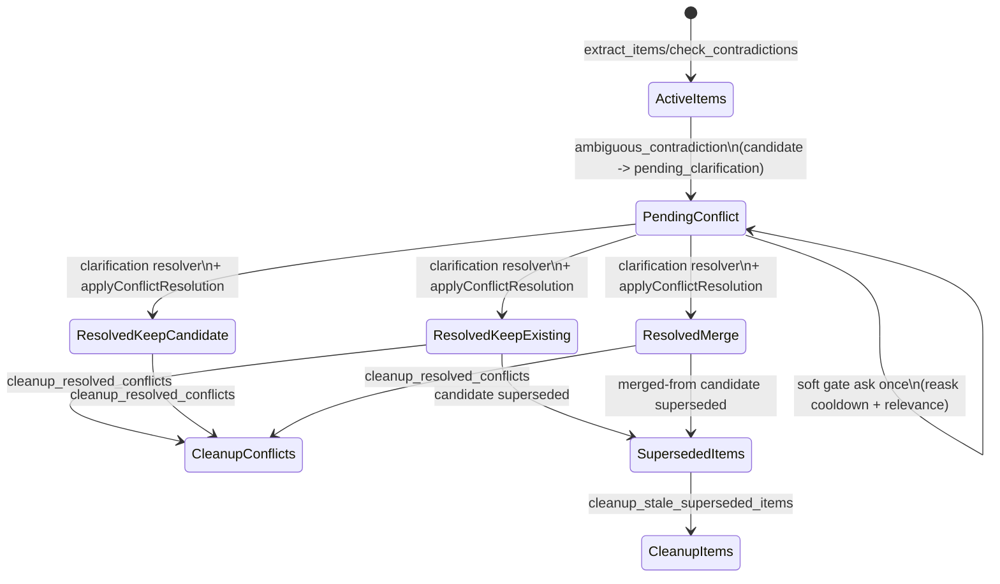
```mermaid
stateDiagram-v2
    [*] --> ActiveItems : extract_items/check_contradictions
    ActiveItems --> PendingConflict : ambiguous_contradiction\n(candidate -> pending_clarification)
    PendingConflict --> PendingConflict : soft gate ask once\n(reask cooldown + relevance)
    PendingConflict --> ResolvedKeepExisting : clarification resolver\n+ applyConflictResolution
    PendingConflict --> ResolvedKeepCandidate : clarification resolver\n+ applyConflictResolution
    PendingConflict --> ResolvedMerge : clarification resolver\n+ applyConflictResolution
    ResolvedKeepExisting --> CleanupConflicts : cleanup_resolved_conflicts
    ResolvedKeepCandidate --> CleanupConflicts : cleanup_resolved_conflicts
    ResolvedMerge --> CleanupConflicts : cleanup_resolved_conflicts
    ResolvedKeepExisting --> SupersededItems : candidate superseded
    ResolvedMerge --> SupersededItems : merged-from candidate superseded
    SupersededItems --> CleanupItems : cleanup_stale_superseded_items
```

Runtime profile flow (per turn):
1. `ProfileCompiler` builds a trusted profile block from active `profile` / `preference` / `constraint` / `instruction` items under strict token cap.
2. Session injects that block only into runtime prompt state.
3. Session strips the injected profile block before persisting conversation history, so dynamic profile context never pollutes durable message rows.

---

## Private Threads — Isolated Memory and Strict Side-Effect Controls

Private threads provide per-conversation memory isolation and stricter tool execution controls. When a conversation is created with `threadType: 'private'`, the daemon assigns it a unique memory scope and enforces additional safeguards to prevent unintended side effects.

### Schema Columns

Two columns on the `conversations` table drive the feature:

| Column | Type | Values | Purpose |
|---|---|---|---|
| `thread_type` | `text NOT NULL DEFAULT 'standard'` | `'standard'` or `'private'` | Determines whether the conversation uses shared or isolated memory and permission policies |
| `memory_scope_id` | `text NOT NULL DEFAULT 'default'` | `'default'` for standard threads; `'private:<uuid>'` for private threads | Scopes all memory writes (items, segments) to this namespace; embeddings are isolated indirectly via their parent item/segment |

### Memory Isolation

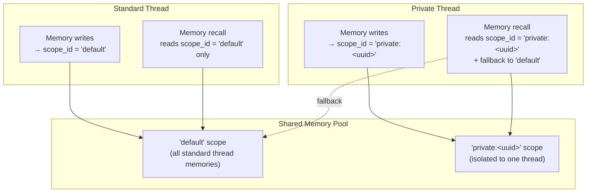
```mermaid
graph TB
    subgraph "Standard Thread"
        STD_WRITE["Memory writes<br/>→ scope_id = 'default'"]
        STD_READ["Memory recall<br/>reads scope_id = 'default' only"]
    end

    subgraph "Private Thread"
        PVT_WRITE["Memory writes<br/>→ scope_id = 'private:&lt;uuid&gt;'"]
        PVT_READ["Memory recall<br/>reads scope_id = 'private:&lt;uuid&gt;'<br/>+ fallback to 'default'"]
    end

    subgraph "Shared Memory Pool"
        DEFAULT_SCOPE["'default' scope<br/>(all standard thread memories)"]
        PRIVATE_SCOPE["'private:&lt;uuid&gt;' scope<br/>(isolated to one thread)"]
    end

    STD_WRITE --> DEFAULT_SCOPE
    STD_READ --> DEFAULT_SCOPE
    PVT_WRITE --> PRIVATE_SCOPE
    PVT_READ --> PRIVATE_SCOPE
    PVT_READ -.->|"fallback"| DEFAULT_SCOPE
```

**Write isolation**: All memory items and segments created during a private thread are tagged with its `memory_scope_id` (e.g. `'private:abc123'`). Embeddings are isolated indirectly — they reference scoped items/segments via `target_type`/`target_id`, so scope filtering at the item/segment level cascades to their embeddings. All scoped data is invisible to standard threads and other private threads.

**Read fallback**: When recalling memories for a private thread, the retriever queries both the thread's own scope and the `'default'` scope. This ensures the assistant still has access to general knowledge (user profile, preferences, facts) learned in standard threads, while private-thread-specific memories take precedence in ranking. The fallback is implemented via `ScopePolicyOverride` with `fallbackToDefault: true`, which overrides the global scope policy on a per-call basis.

**Profile compilation**: The `ProfileCompiler` also respects this dual-scope behavior for private threads — it includes profile/preference/constraint items from both the private scope and the default scope when building the runtime profile block.

### SessionMemoryPolicy

The daemon derives a `SessionMemoryPolicy` from the conversation's `thread_type` and `memory_scope_id` when creating or restoring a session:

```typescript
interface SessionMemoryPolicy {
  scopeId: string;                // 'default' or 'private:<uuid>'
  includeDefaultFallback: boolean; // true for private threads
  strictSideEffects: boolean;      // true for private threads
}
```

Standard threads use `DEFAULT_MEMORY_POLICY` (`{ scopeId: 'default', includeDefaultFallback: false, strictSideEffects: false }`). Private threads set all three fields: the private scope ID, default-fallback enabled, and strict side-effect controls enabled.

### Strict Side-Effect Prompt Gate

When `strictSideEffects` is `true` (all private threads), the `ToolExecutor` promotes any `allow` permission decision to `prompt` for side-effect tools — even when a trust rule would normally auto-allow the invocation. Deny decisions are preserved unchanged; only `allow` -> `prompt` promotion occurs.

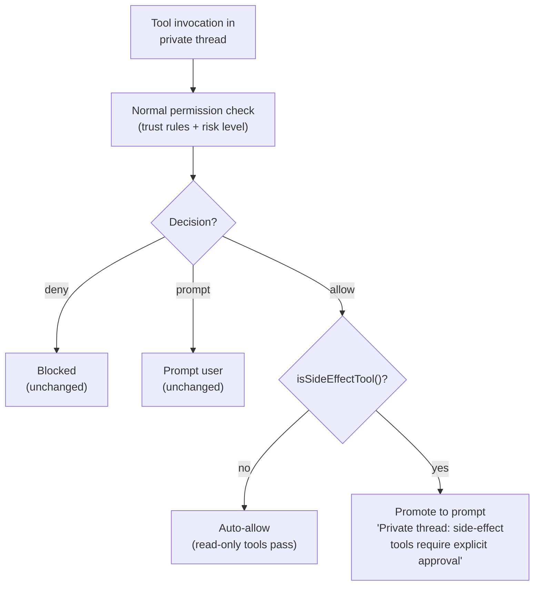
```mermaid
graph TB
    TOOL["Tool invocation in<br/>private thread"] --> PERM["Normal permission check<br/>(trust rules + risk level)"]
    PERM --> DECISION{"Decision?"}
    DECISION -->|"deny"| DENY["Blocked<br/>(unchanged)"]
    DECISION -->|"prompt"| PROMPT["Prompt user<br/>(unchanged)"]
    DECISION -->|"allow"| SIDE_CHECK{"isSideEffectTool()?"}
    SIDE_CHECK -->|"no"| ALLOW["Auto-allow<br/>(read-only tools pass)"]
    SIDE_CHECK -->|"yes"| FORCE_PROMPT["Promote to prompt<br/>'Private thread: side-effect<br/>tools require explicit approval'"]
```

This ensures that file writes, bash commands, host operations, and other mutating tools always require explicit user confirmation in private threads, providing an additional safety layer for sensitive conversations.

### Key Source Files

| File | Role |
|---|---|
| `assistant/src/memory/schema.ts` | `conversations` table: `threadType` and `memoryScopeId` column definitions |
| `assistant/src/daemon/session.ts` | `SessionMemoryPolicy` interface and `DEFAULT_MEMORY_POLICY` constant |
| `assistant/src/daemon/server.ts` | `deriveMemoryPolicy()` — maps thread type to memory policy |
| `assistant/src/daemon/session-tool-setup.ts` | Propagates `memoryPolicy.strictSideEffects` as `forcePromptSideEffects` into `ToolContext` |
| `assistant/src/tools/executor.ts` | `forcePromptSideEffects` gate — promotes allow to prompt for side-effect tools |
| `assistant/src/memory/search/types.ts` | `ScopePolicyOverride` interface for per-call scope control |
| `assistant/src/memory/retriever.ts` | `buildScopeFilter()` — builds scope ID list from override or global config |
| `assistant/src/memory/profile-compiler.ts` | Dual-scope profile compilation with `includeDefaultFallback` |
| `assistant/src/daemon/session-memory.ts` | Wires `scopeId` and `includeDefaultFallback` into recall and profile compilation |

---

## Workspace Context Injection — Runtime-Only Directory Awareness

The session injects a workspace top-level directory listing into every user message at runtime, giving the model awareness of the sandbox filesystem structure without persisting it in conversation history.

### Lifecycle

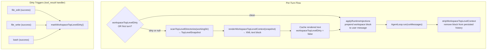
```mermaid
graph TB
    subgraph "Per-Turn Flow"
        CHECK{"workspaceTopLevelDirty<br/>OR first turn?"}
        SCAN["scanTopLevelDirectories(workingDir)<br/>→ TopLevelSnapshot"]
        RENDER["renderWorkspaceTopLevelContext(snapshot)<br/>→ XML text block"]
        CACHE["Cache rendered text<br/>workspaceTopLevelDirty = false"]
        INJECT["applyRuntimeInjections<br/>prepend workspace block<br/>to user message"]
        AGENT["AgentLoop.run(runMessages)"]
        STRIP["stripWorkspaceTopLevelContext<br/>remove block from persisted history"]
    end

    subgraph "Dirty Triggers (tool_result handler)"
        FILE_EDIT["file_edit (success)"]
        FILE_WRITE["file_write (success)"]
        BASH["bash (success)"]
        DIRTY["markWorkspaceTopLevelDirty()"]
    end

    CHECK -->|dirty or null| SCAN
    CHECK -->|clean| INJECT
    SCAN --> RENDER
    RENDER --> CACHE
    CACHE --> INJECT
    INJECT --> AGENT
    AGENT --> STRIP

    FILE_EDIT --> DIRTY
    FILE_WRITE --> DIRTY
    BASH --> DIRTY
```

### Key design decisions

- **Scope**: Sandbox workspace only (`~/.vellum/workspace`). Non-recursive — only top-level directories.
- **Bounded**: Maximum 120 directory entries (`MAX_TOP_LEVEL_ENTRIES`). Excess is truncated with a note.
- **Prepend, not append**: The workspace block is prepended to the user message content so that Anthropic cache breakpoints continue to land on the trailing user text block, preserving prompt cache efficiency.
- **Runtime-only**: The injected `<workspace_top_level>` block is stripped from `this.messages` after the agent loop completes. It never persists in conversation history or the database.
- **Dirty-refresh**: The scanner runs once on the first turn, then only re-runs after a successful mutation tool (`file_edit`, `file_write`, `bash`). Failed tool results do not trigger a refresh.
- **Injection ordering**: Workspace context is injected after other runtime injections (soft conflict instruction, active surface) via `applyRuntimeInjections`, but because it is **prepended** to content blocks, it appears first in the final message.

### Cache compatibility

The Anthropic provider places `cache_control: { type: 'ephemeral' }` on the **last content block** of the last two user turns. Since workspace context is prepended (first block), the cache breakpoint correctly lands on the trailing user text or dynamic profile block. This is validated by dedicated cache-compatibility tests.

### Key files

| File | Role |
|------|------|
| `assistant/src/workspace/top-level-scanner.ts` | Synchronous directory scanner with `MAX_TOP_LEVEL_ENTRIES` cap |
| `assistant/src/workspace/top-level-renderer.ts` | Renders `TopLevelSnapshot` to `<workspace_top_level>` XML block |
| `assistant/src/daemon/session-runtime-assembly.ts` | Runtime injections and strip helpers (`<workspace_top_level>`, `<temporal_context>`, `<channel_onboarding_playbook>`, `<onboarding_mode>`) |
| `assistant/src/onboarding/onboarding-orchestrator.ts` | Builds assistant-owned onboarding runtime guidance from channel playbook + transport metadata |
| `assistant/src/daemon/session-agent-loop.ts` | Agent loop orchestration, runtime injection wiring, strip chain |

---

## Temporal Context Injection — Date Grounding

The session injects a `<temporal_context>` block into every user message at runtime, giving the model awareness of the current date, timezone, upcoming weekend/work week windows, and a 14-day horizon of labelled future dates. This enables reliable reasoning about future dates (e.g. "plan a trip for next weekend") without persisting volatile temporal data in conversation history.

### Per-turn flow

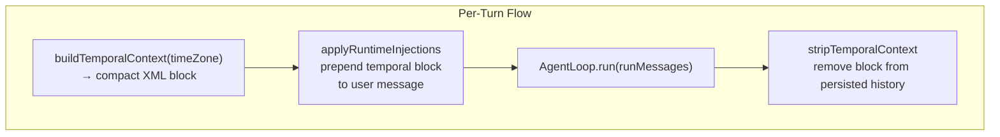
```mermaid
graph TB
    subgraph "Per-Turn Flow"
        BUILD["buildTemporalContext(timeZone)<br/>→ compact XML block"]
        INJECT["applyRuntimeInjections<br/>prepend temporal block<br/>to user message"]
        AGENT["AgentLoop.run(runMessages)"]
        STRIP["stripTemporalContext<br/>remove block from persisted history"]
    end

    BUILD --> INJECT
    INJECT --> AGENT
    AGENT --> STRIP
```

### Key design decisions

- **Fresh each turn**: `buildTemporalContext()` is called at the start of every agent loop invocation, ensuring the model always sees the current date even in long-running conversations.
- **Timezone-aware**: Uses `Intl.DateTimeFormat` APIs for DST-safe date arithmetic. The host timezone (`Intl.DateTimeFormat().resolvedOptions().timeZone`) is used by default.
- **Bounded output**: Hard-capped at 1500 characters and 14 horizon entries to prevent prompt bloat.
- **Runtime-only**: The injected `<temporal_context>` block is stripped from `this.messages` after the agent loop completes via `stripTemporalContext`. It never persists in conversation history.
- **Specific strip prefix**: The strip function matches the exact injected prefix (`<temporal_context>\nToday:`) to avoid accidentally removing user-authored text that starts with `<temporal_context>`.
- **Retry paths**: Temporal context is included in all three `applyRuntimeInjections` call sites (main path, compact retry, media-trim retry).

### Key files

| File | Role |
|------|------|
| `assistant/src/daemon/date-context.ts` | `buildTemporalContext()` — generates the `<temporal_context>` XML block |
| `assistant/src/daemon/session-runtime-assembly.ts` | `injectTemporalContext()` / `stripTemporalContext()` helpers |
| `assistant/src/daemon/session-agent-loop.ts` | Wiring: computes temporal context, passes to `applyRuntimeInjections`, strips after run |

---

## Workspace Git Tracking — Change Management

The workspace sandbox (`~/.vellum/workspace`) is automatically tracked by a per-workspace git repository. Every file change made by the assistant is captured in structured commits, providing a full audit trail and natural undo/history exploration via standard git commands.

### Architecture overview

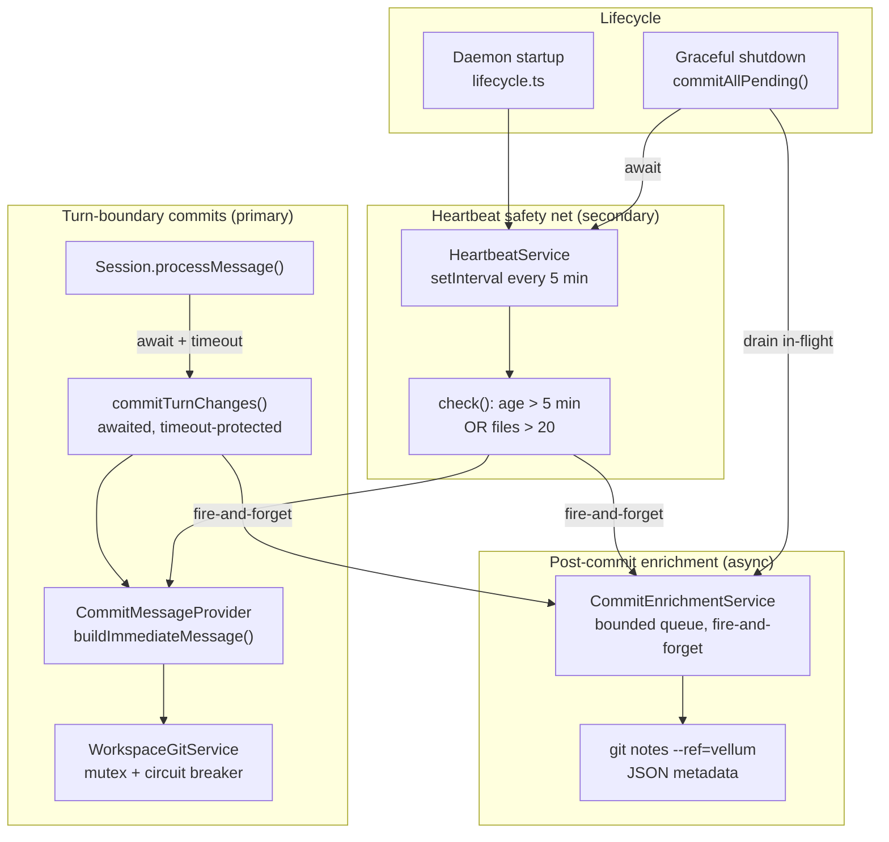
```mermaid
graph TB
    subgraph "Turn-boundary commits (primary)"
        SESSION["Session.processMessage()"]
        TURN_COMMIT["commitTurnChanges()<br/>awaited, timeout-protected"]
        MSG_PROVIDER["CommitMessageProvider<br/>buildImmediateMessage()"]
        GIT_SERVICE["WorkspaceGitService<br/>mutex + circuit breaker"]
    end

    subgraph "Heartbeat safety net (secondary)"
        HEARTBEAT["HeartbeatService<br/>setInterval every 5 min"]
        CHECK["check(): age > 5 min<br/>OR files > 20"]
    end

    subgraph "Post-commit enrichment (async)"
        ENRICHMENT["CommitEnrichmentService<br/>bounded queue, fire-and-forget"]
        GIT_NOTES["git notes --ref=vellum<br/>JSON metadata"]
    end

    subgraph "Lifecycle"
        STARTUP["Daemon startup<br/>lifecycle.ts"]
        SHUTDOWN["Graceful shutdown<br/>commitAllPending()"]
    end

    SESSION -->|"await + timeout"| TURN_COMMIT
    TURN_COMMIT --> MSG_PROVIDER
    MSG_PROVIDER --> GIT_SERVICE
    TURN_COMMIT -->|"fire-and-forget"| ENRICHMENT
    HEARTBEAT --> CHECK
    CHECK --> MSG_PROVIDER
    CHECK -->|"fire-and-forget"| ENRICHMENT
    ENRICHMENT --> GIT_NOTES
    STARTUP --> HEARTBEAT
    SHUTDOWN -->|"await"| HEARTBEAT
    SHUTDOWN -->|"drain in-flight"| ENRICHMENT
```

### How it works

1. **Lazy initialization**: The git repository is created on first use, not at workspace creation. When `ensureInitialized()` is called, it checks for a `.git` directory. If absent, it runs `git init`, creates a `.gitignore` (excluding `data/`, `logs/`, `*.log`, `*.sock`, `*.pid`, `session-token`, `http-token`), sets the git identity to "Vellum Assistant", and creates an initial baseline commit capturing any pre-existing files. The baseline commit is intentional — it makes `git log`, `git diff`, and `git revert` work cleanly from the start. Both new and existing workspaces get the same treatment. For existing repos (e.g. created by older versions or external tools), `.gitignore` rules and git identity are set idempotently on each init, ensuring proper configuration regardless of how the repo was originally created.

2. **Turn-boundary commits**: After each conversation turn (user message + assistant response cycle), `session.ts` commits workspace changes via `commitTurnChanges(workspaceDir, sessionId, turnNumber)`. The commit runs in the `finally` block of `runAgentLoop`, guarded by a `turnStarted` flag that is set once the agent loop begins executing. This guarantees a commit attempt even when post-processing (e.g. `resolveAssistantAttachments`) throws, or when the user cancels mid-turn. The commit is raced against a configurable timeout (`workspaceGit.turnCommitMaxWaitMs`, default 4s) via `Promise.race`. If the commit exceeds the timeout, the turn proceeds immediately while the commit continues in the background. Note: the background commit is NOT awaited before the next turn starts, so brief cross-turn file attribution windows are possible but accepted as a tradeoff for responsiveness. Commit outcomes are logged with structured fields (`sessionId`, `turnNumber`, `filesChanged`, `durationMs`) for observability.

3. **Heartbeat safety net**: A `HeartbeatService` runs on a 5-minute interval, checking all tracked workspaces for uncommitted changes. It auto-commits when changes exceed either an age threshold (5 minutes since first detected) or a file count threshold (20+ files). This catches changes from long-running bash scripts, background processes, or crashed sessions that miss turn-boundary commits.

4. **Shutdown safety net**: During graceful daemon shutdown, `commitAllPending()` is called twice: once before `server.stop()` (pre-stop) and once after (post-stop). The pre-stop sweep captures any pending workspace changes. The post-stop sweep catches writes that occurred during server shutdown (e.g. in-flight tool executions completing during drain). Both calls are wrapped in try/catch to prevent commit failures from deadlocking shutdown.

5. **Corrupted repo recovery**: If a `.git` directory exists but is corrupted (e.g. missing HEAD), the service detects this via `git rev-parse --git-dir`, removes the corrupted directory, and reinitializes cleanly.

6. **Commit message provider abstraction**: All commit message construction is handled by a `CommitMessageProvider` interface (`commit-message-provider.ts`). The `DefaultCommitMessageProvider` produces deterministic messages based on trigger type (turn, heartbeat, shutdown). Both `turn-commit.ts` and `heartbeat-service.ts` accept an optional custom provider, creating a seam for future LLM-powered enrichment without changing the synchronous commit path.

7. **Circuit breaker with exponential backoff**: `WorkspaceGitService` tracks consecutive commit failures and backs off exponentially (2s, 4s, 8s... up to 60s configurable max). When the breaker is open, `commitIfDirty()` short-circuits without attempting git operations. On success, the breaker resets. State transitions are logged at info/warn level with structured fields (`consecutiveFailures`, `backoffMs`).

8. **Turn-commit timeout protection**: The turn-boundary commit in `session.ts` uses `Promise.race` with a configurable timeout (`workspaceGit.turnCommitMaxWaitMs`, default 4s). If the commit exceeds the timeout, the turn proceeds immediately (the commit continues in the background). This prevents slow git operations from blocking the conversation loop.

9. **Non-blocking enrichment queue**: After each successful commit, a `CommitEnrichmentService` runs async enrichment fire-and-forget. The queue has configurable max size (default 50), concurrency (default 1), per-job timeout (default 30s), and retry count (default 2 with exponential backoff). On queue overflow, the oldest job is dropped with a warning log. On graceful shutdown, in-flight jobs drain while pending jobs are discarded. Currently writes placeholder JSON metadata to git notes (`refs/notes/vellum`) as a scaffold for future LLM enrichment.

10. **Provider-aware commit message generation (optional)**: When `workspaceGit.commitMessageLLM.enabled` is `true`, turn-boundary commits attempt to generate a descriptive commit message using the configured LLM provider before falling back to deterministic messages. The LLM call runs BEFORE entering the `commitIfDirty` mutex to ensure it never holds the git lock during a network call. Pre-flight checks gate the attempt: the configured provider must have an API key, the generator's circuit breaker must be closed, and sufficient turn budget must remain (`minRemainingTurnBudgetMs`). On any failure — timeout, provider error, invalid output, or missing credentials — the deterministic message is used immediately with a structured `llmFallbackReason` log field. The feature ships disabled by default and is designed to never degrade turn completion guarantees.

### Design decisions

- **Commit at turn boundaries, not per-tool-call**: A single commit per turn captures all file mutations from that turn atomically. This avoids noisy per-file commits and keeps the history meaningful.
- **Lazy init with baseline commit**: The repo is created on first use, not at daemon startup. Existing workspaces get their files captured in an "Initial commit: migrated existing workspace" on first use, rather than requiring an explicit migration step. The baseline commit ensures `git log`, `git diff`, and `git revert` work cleanly from the start.
- **Mutex serialization**: All git operations go through a per-workspace `Mutex` to prevent concurrent `git add`/`git commit` from corrupting the index. The mutex uses a FIFO wait queue.
- **Finally-block commit guarantee in session-agent-loop.ts**: Turn commits run in the `finally` block of `runAgentLoop`, ensuring they execute even when post-processing throws or the user cancels. The `turnStarted` flag prevents commits for turns that were blocked before the agent loop started. All errors are caught and logged as warnings. The commit is raced against a timeout (`turnCommitMaxWaitMs`, default 4s); if it exceeds the timeout the turn proceeds and the commit continues in the background without synchronization. Brief cross-turn file attribution is accepted as a tradeoff for keeping the conversation loop responsive.
- **Branch enforcement at init time**: `ensureOnMainLocked()` is called during initialization to ensure the workspace is on the `main` branch. If the workspace is on the wrong branch or in a detached HEAD state, it auto-corrects to `main` with a warning log. Per-commit enforcement is unnecessary since nothing in the codebase switches branches.
- **We intentionally don't provide custom history APIs** -- assistants should use git commands naturally via Bash (e.g. `git log`, `git diff`, `git show`). The workspace git repo is a standard git repository that any tool can interact with.

### Key files

| File | Role |
|------|------|
| `assistant/src/workspace/git-service.ts` | `WorkspaceGitService`: lazy init, mutex, circuit breaker, `commitIfDirty()`, `getHeadHash()`, `writeNote()`, singleton registry |
| `assistant/src/workspace/commit-message-provider.ts` | `CommitMessageProvider` interface, `DefaultCommitMessageProvider`, `CommitContext`/`CommitMessageResult` types |
| `assistant/src/workspace/commit-message-enrichment-service.ts` | `CommitEnrichmentService`: bounded async queue, fire-and-forget enrichment, git notes output |
| `assistant/src/workspace/turn-commit.ts` | `commitTurnChanges()`: turn-boundary commit with structured metadata + enrichment enqueue |
| `assistant/src/workspace/provider-commit-message-generator.ts` | `ProviderCommitMessageGenerator`: LLM-based commit message generation with circuit breaker and deterministic fallback |
| `assistant/src/workspace/heartbeat-service.ts` | `HeartbeatService`: periodic safety-net auto-commits, shutdown commits, enrichment enqueue |
| `assistant/src/daemon/session-agent-loop.ts` | Integration: turn-boundary commit with `raceWithTimeout` protection in `runAgentLoop` finally block |
| `assistant/src/daemon/lifecycle.ts` | Integration: `HeartbeatService` start/stop and shutdown commit |
| `assistant/src/config/schema.ts` | `WorkspaceGitConfigSchema`: timeout, backoff, and enrichment queue configuration |

---

## Web Server — Connection Modes

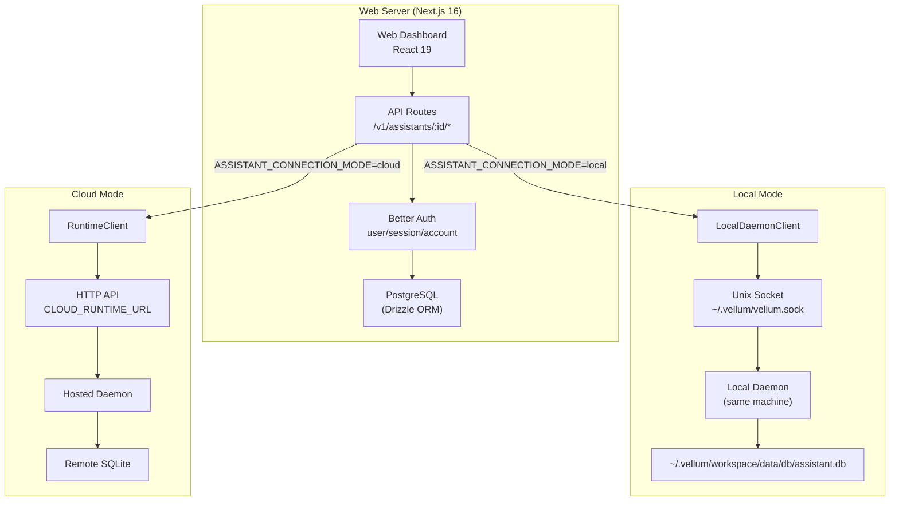
```mermaid
graph TB
    subgraph "Web Server (Next.js 16)"
        DASHBOARD["Web Dashboard<br/>React 19"]
        ROUTES["API Routes<br/>/v1/assistants/:id/*"]
        AUTH["Better Auth<br/>user/session/account"]
        PG["PostgreSQL<br/>(Drizzle ORM)"]
    end

    subgraph "Local Mode"
        LOCAL_CLIENT["LocalDaemonClient"]
        LOCAL_SOCK["Unix Socket<br/>~/.vellum/vellum.sock"]
        LOCAL_DAEMON["Local Daemon<br/>(same machine)"]
        LOCAL_DB["~/.vellum/workspace/data/db/assistant.db"]
    end

    subgraph "Cloud Mode"
        RUNTIME_CLIENT["RuntimeClient"]
        CLOUD_HTTP["HTTP API<br/>CLOUD_RUNTIME_URL"]
        CLOUD_DAEMON["Hosted Daemon"]
        CLOUD_DB["Remote SQLite"]
    end

    DASHBOARD --> ROUTES
    ROUTES --> AUTH
    AUTH --> PG

    ROUTES -->|"ASSISTANT_CONNECTION_MODE=local"| LOCAL_CLIENT
    LOCAL_CLIENT --> LOCAL_SOCK
    LOCAL_SOCK --> LOCAL_DAEMON
    LOCAL_DAEMON --> LOCAL_DB

    ROUTES -->|"ASSISTANT_CONNECTION_MODE=cloud"| RUNTIME_CLIENT
    RUNTIME_CLIENT --> CLOUD_HTTP
    CLOUD_HTTP --> CLOUD_DAEMON
    CLOUD_DAEMON --> CLOUD_DB
```

---

## IPC Contract — Source of Truth and Code Generation

The TypeScript file `assistant/src/daemon/ipc-contract.ts` is the **single source of truth** for all IPC message types. Swift client models are auto-generated from it.

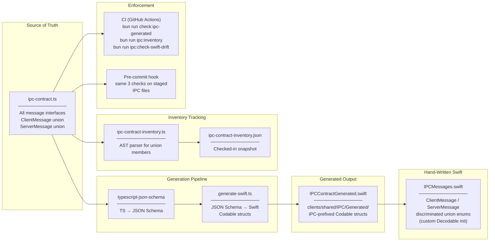
```mermaid
graph LR
    subgraph "Source of Truth"
        CONTRACT["ipc-contract.ts<br/>───────────────<br/>All message interfaces<br/>ClientMessage union<br/>ServerMessage union"]
    end

    subgraph "Generation Pipeline"
        TJS["typescript-json-schema<br/>───────────────<br/>TS → JSON Schema"]
        GEN["generate-swift.ts<br/>───────────────<br/>JSON Schema → Swift<br/>Codable structs"]
    end

    subgraph "Generated Output"
        SWIFT["IPCContractGenerated.swift<br/>───────────────<br/>clients/shared/IPC/Generated/<br/>IPC-prefixed Codable structs"]
    end

    subgraph "Hand-Written Swift"
        ENUMS["IPCMessages.swift<br/>───────────────<br/>ClientMessage / ServerMessage<br/>discriminated union enums<br/>(custom Decodable init)"]
    end

    subgraph "Inventory Tracking"
        INV_SRC["ipc-contract-inventory.ts<br/>───────────────<br/>AST parser for union members"]
        INV_SNAP["ipc-contract-inventory.json<br/>───────────────<br/>Checked-in snapshot"]
    end

    subgraph "Enforcement"
        CI["CI (GitHub Actions)<br/>bun run check:ipc-generated<br/>bun run ipc:inventory<br/>bun run ipc:check-swift-drift"]
        HOOK["Pre-commit hook<br/>same 3 checks on staged<br/>IPC files"]
    end

    CONTRACT --> TJS
    TJS --> GEN
    GEN --> SWIFT
    SWIFT --> ENUMS

    CONTRACT --> INV_SRC
    INV_SRC --> INV_SNAP

    CONTRACT --> CI
    CONTRACT --> HOOK
```

---

## IPC Protocol — Message Types


```mermaid
graph LR
    subgraph "Client → Server"
        direction TB
        C0["task_submit<br/>task, screenWidth, screenHeight,<br/>attachments, source?:'voice'|'text'"]
        C1["cu_session_create<br/>task, attachments"]
        C2["cu_observation<br/>axTree, axDiff, screenshot,<br/>secondaryWindows, result/error,<br/>axTreeBlob?, screenshotBlob?"]
        C3["ambient_observation<br/>screenContent, requestId"]
        C4["session_create<br/>title, threadType?"]
        C5["user_message<br/>text, attachments"]
        C6["confirmation_response<br/>decision"]
        C7["cancel / undo"]
        C8["model_get / model_set<br/>sandbox_set (deprecated no-op)"]
        C9["ping"]
        C10["ipc_blob_probe<br/>probeId, nonceSha256"]
        C11["work_items_list / work_item_get<br/>work_item_create / work_item_update<br/>work_item_complete / work_item_run_task<br/>(planned)"]
    end

    SOCKET["Unix Socket<br/>~/.vellum/vellum.sock<br/>───────────────<br/>Newline-delimited JSON<br/>Max 96MB per message<br/>Ping/pong every 30s<br/>Auto-reconnect<br/>1s → 30s backoff"]

    subgraph "Server → Client"
        direction TB
        S0["task_routed<br/>interactionType, sessionId"]
        S1["cu_action<br/>tool, input dict"]
        S2["cu_complete<br/>summary"]
        S3["cu_error<br/>message"]
        S4["assistant_text_delta<br/>streaming text"]
        S5["assistant_thinking_delta<br/>streaming thinking"]
        S6["message_complete<br/>usage stats, attachments?"]
        S7["ambient_result<br/>decision, summary/suggestion"]
        S8["confirmation_request<br/>tool, risk_level,<br/>executionTarget"]
        S9["memory_recalled<br/>source hits + relation counters<br/>ranking/debug telemetry"]
        S10["usage_update / error"]
        S11["generation_cancelled"]
        S12["message_queued<br/>position in queue"]
        S13["message_dequeued<br/>queue drained"]
        S14["generation_handoff<br/>sessionId, requestId?,<br/>queuedCount, attachments?"]
        S15["trace_event<br/>eventId, sessionId, requestId?,<br/>timestampMs, sequence, kind,<br/>status?, summary, attributes?"]
        S16["session_error<br/>sessionId, code,<br/>userMessage, retryable,<br/>debugDetails?"]
        S17["ipc_blob_probe_result<br/>probeId, ok,<br/>observedNonceSha256?, reason?"]
        S18["session_info<br/>sessionId, title,<br/>correlationId?, threadType?"]
        S19["session_list_response<br/>sessions[]: id, title,<br/>updatedAt, threadType?"]
        S20["work_item_status_changed<br/>workItemId, newStatus<br/>(planned push)"]
    end

    C0 --> SOCKET
    C1 --> SOCKET
    C2 --> SOCKET
    C3 --> SOCKET
    C4 --> SOCKET
    C5 --> SOCKET
    C6 --> SOCKET
    C7 --> SOCKET
    C8 --> SOCKET
    C9 --> SOCKET
    C10 --> SOCKET
    C11 --> SOCKET

    SOCKET --> S0
    SOCKET --> S1
    SOCKET --> S2
    SOCKET --> S3
    SOCKET --> S4
    SOCKET --> S5
    SOCKET --> S6
    SOCKET --> S7
    SOCKET --> S8
    SOCKET --> S9
    SOCKET --> S10
    SOCKET --> S11
    SOCKET --> S12
    SOCKET --> S13
    SOCKET --> S14
    SOCKET --> S15
    SOCKET --> S16
    SOCKET --> S17
    SOCKET --> S18
    SOCKET --> S19
    SOCKET --> S20
```

---

## Blob Transport — Large Payload Side-Channel

CU observations can carry large payloads (screenshots as JPEG, AX trees as UTF-8 text). Instead of embedding these inline as base64/text in newline-delimited JSON IPC messages, the blob transport offloads them to local files and sends only lightweight references over the socket.

### Probe Mechanism

Blob transport is opt-in per connection. On every macOS socket connect, the client writes a random nonce file to the blob directory and sends an `ipc_blob_probe` message with the SHA-256 of the nonce. The daemon reads the file, computes the hash, and responds with `ipc_blob_probe_result`. If hashes match, the client sets `isBlobTransportAvailable = true` for that connection. The flag resets to `false` on disconnect or reconnect.

On iOS (TCP connections), the probe code is compiled out via `#if os(macOS)` — `isBlobTransportAvailable` stays `false` and inline payloads are always used. Over SSH-forwarded Unix sockets on macOS, the probe runs but fails because the client and daemon don't share a filesystem, so blob transport stays disabled and inline payloads are used transparently.

### Blob Directory

All blobs live at `~/.vellum/workspace/data/ipc-blobs/`. Filenames are `${uuid}.blob`. The daemon ensures this directory exists on startup. Both client and daemon use atomic writes (temp file + rename) to prevent partial reads.

### Blob Reference

```
IpcBlobRef {
  id: string              // UUID v4
  kind: "ax_tree" | "screenshot_jpeg"
  encoding: "utf8" | "binary"
  byteLength: number
  sha256?: string         // SHA-256 hex digest for integrity check
}
```

### Transport Decision Flow

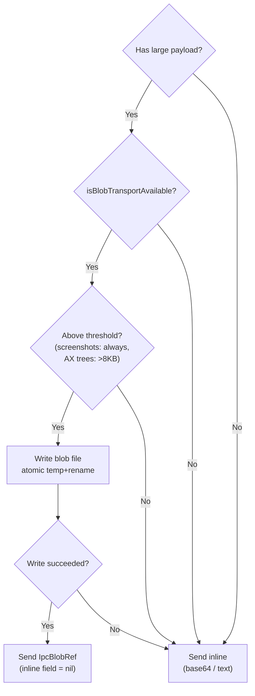
```mermaid
graph TB
    HAS_DATA{"Has large payload?"}
    BLOB_AVAIL{"isBlobTransportAvailable?"}
    THRESHOLD{"Above threshold?<br/>(screenshots: always,<br/>AX trees: >8KB)"}
    WRITE_BLOB["Write blob file<br/>atomic temp+rename"]
    WRITE_OK{"Write succeeded?"}
    SEND_REF["Send IpcBlobRef<br/>(inline field = nil)"]
    SEND_INLINE["Send inline<br/>(base64 / text)"]

    HAS_DATA -->|Yes| BLOB_AVAIL
    HAS_DATA -->|No| SEND_INLINE
    BLOB_AVAIL -->|Yes| THRESHOLD
    BLOB_AVAIL -->|No| SEND_INLINE
    THRESHOLD -->|Yes| WRITE_BLOB
    THRESHOLD -->|No| SEND_INLINE
    WRITE_BLOB --> WRITE_OK
    WRITE_OK -->|Yes| SEND_REF
    WRITE_OK -->|No| SEND_INLINE
```

### Daemon Hydration

When the daemon receives a CU observation with blob refs, it attempts blob-first hydration before the CU session processes the observation:

1. Validate the blob ref's `kind` and `encoding` match the expected field (`axTreeBlob` must be `kind=ax_tree, encoding=utf8`; `screenshotBlob` must be `kind=screenshot_jpeg, encoding=binary`).
2. Verify the blob file is a regular file (not a symlink) and its realpath stays within the blob directory.
3. Read the blob file, verify actual size matches `byteLength`, and check optional `sha256`.
4. For screenshots: base64-encode the bytes into the `screenshot` field.
5. For AX trees: decode UTF-8 bytes into the `axTree` field.
6. Delete the consumed blob file.

**Fallback behavior**: If both a blob ref and an inline field are present and blob hydration succeeds, the blob value takes precedence. If blob hydration fails and an inline fallback exists, the inline value is used. If blob hydration fails and no inline fallback exists, the daemon sends a `cu_error` and does not forward the observation to the session.

### Cleanup

- **Consumed blobs**: Deleted immediately after successful hydration.
- **Stale sweep**: The daemon runs a periodic sweep (every 5 minutes) to delete blob files older than 30 minutes, catching orphans from failed sends or crashes.
- **Size limits**: Screenshot blobs are capped at 10MB, AX tree blobs at 2MB. Oversized blobs are rejected.

---

## Session Errors vs Global Errors

The daemon emits two distinct error message types over IPC:

| Message type | Scope | Purpose | Payload |
|---|---|---|---|
| `session_error` | Session-scoped | Typed, actionable failures during chat/session runtime (e.g., provider network error, rate limit, API failure) | `sessionId`, `code` (typed enum), `userMessage`, `retryable`, `debugDetails?` |
| `error` | Global | Generic, non-session failures (e.g., daemon startup errors, unknown message types) | `message` (string) |

**Design rationale:** `session_error` carries structured metadata (error code, retryable flag, debug details) so the client can present actionable UI — a toast with retry/dismiss buttons — rather than a generic error banner. The older `error` type is retained for backward compatibility with non-session contexts.

### Session Error Codes

| Code | Meaning | Retryable |
|---|---|---|
| `PROVIDER_NETWORK` | Unable to reach the LLM provider (connection refused, timeout, DNS) | Yes |
| `PROVIDER_RATE_LIMIT` | LLM provider rate-limited the request (HTTP 429) | Yes |
| `PROVIDER_API` | Provider returned a server error (5xx) | Yes |
| `QUEUE_FULL` | The message queue is full | Yes |
| `SESSION_ABORTED` | Non-user abort interrupted the request | Yes |
| `SESSION_PROCESSING_FAILED` | Catch-all for unexpected processing failures | No |
| `REGENERATE_FAILED` | Failed to regenerate a previous response | Yes |

### Error Classification

The daemon classifies errors via `classifySessionError()` in `session-error.ts`. Before classification, `isUserCancellation()` checks whether the error is a user-initiated abort (active abort signal or `AbortError`); if so, the daemon emits `generation_cancelled` instead of `session_error` — cancel never surfaces a session-error toast.

Classification uses a two-tier strategy:
1. **Structured provider errors**: If the error is a `ProviderError` with a `statusCode`, the status code determines the category deterministically — `429` maps to `PROVIDER_RATE_LIMIT` (retryable), `5xx` to `PROVIDER_API` (retryable), other `4xx` to `PROVIDER_API` (not retryable).
2. **Regex fallback**: For non-provider errors or `ProviderError` without a status code, regex pattern matching against the error message detects network failures, rate limits, and API errors. Phase-specific overrides handle queue and regeneration contexts.

Debug details are capped at 4,000 characters to prevent oversized IPC payloads.

### Error → Toast → Recovery Flow

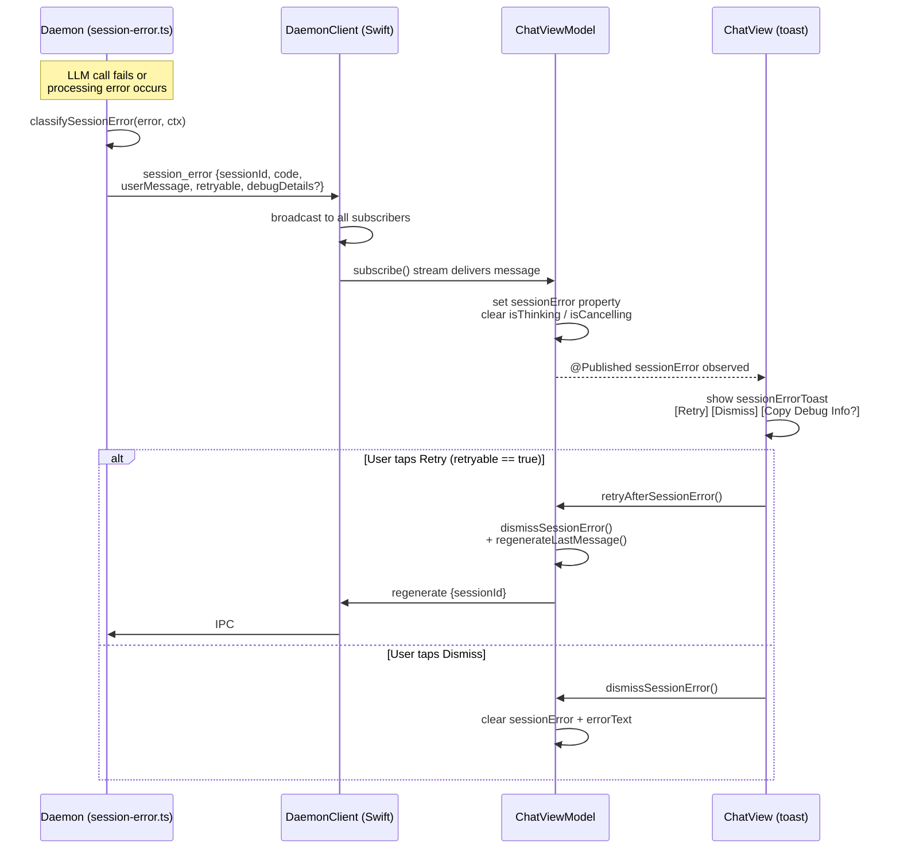
```mermaid
sequenceDiagram
    participant Daemon as Daemon (session-error.ts)
    participant DC as DaemonClient (Swift)
    participant VM as ChatViewModel
    participant UI as ChatView (toast)

    Note over Daemon: LLM call fails or<br/>processing error occurs
    Daemon->>Daemon: classifySessionError(error, ctx)
    Daemon->>DC: session_error {sessionId, code,<br/>userMessage, retryable, debugDetails?}
    DC->>DC: broadcast to all subscribers
    DC->>VM: subscribe() stream delivers message
    VM->>VM: set sessionError property<br/>clear isThinking / isCancelling
    VM-->>UI: @Published sessionError observed

    UI->>UI: show sessionErrorToast<br/>[Retry] [Dismiss] [Copy Debug Info?]

    alt User taps Retry (retryable == true)
        UI->>VM: retryAfterSessionError()
        VM->>VM: dismissSessionError()<br/>+ regenerateLastMessage()
        VM->>DC: regenerate {sessionId}
        DC->>Daemon: IPC
    else User taps Dismiss
        UI->>VM: dismissSessionError()
        VM->>VM: clear sessionError + errorText
    end
```

1. **Daemon** encounters a session-scoped failure, classifies it via `classifySessionError()`, and sends a `session_error` IPC message with the session ID, typed error code, user-facing message, retryable flag, and optional debug details. Session-scoped failures emit *only* `session_error` (never the generic `error` type) to prevent cross-session bleed.
2. **ChatViewModel** receives the error via DaemonClient's `subscribe()` stream (each view model gets an independent stream), sets the `sessionError` property, and transitions out of the streaming/loading state so the UI is interactive. If the error arrives during an active cancel (`wasCancelling == true`), it is suppressed — cancel only shows `generation_cancelled` behavior.
3. **ChatView** observes the published `sessionError` and displays an actionable toast with a category-specific icon and accent color:
   - **Retry** (shown when `retryable` is true): calls `retryAfterSessionError()`, which clears the error and sends a `regenerate` message to the daemon.
   - **Copy Debug Info** (shown when `debugDetails` is non-nil): copies structured debug information to the clipboard for bug reports.
   - **Dismiss (X)**: calls `dismissSessionError()` to clear the error without retrying.
4. If the error is not retryable, the Retry button is hidden and the user can only dismiss.

---

## Task Routing — Voice Source Bypass and Escalation

When a task is submitted via `task_submit`, the daemon classifies it to determine routing. Voice-sourced tasks and slash command candidates bypass the classifier entirely for lower latency and more predictable routing.

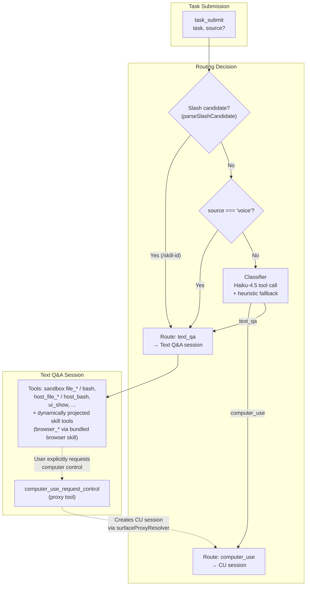
```mermaid
graph TB
    subgraph "Task Submission"
        SUBMIT["task_submit<br/>task, source?"]
    end

    subgraph "Routing Decision"
        SLASH_CHECK{"Slash candidate?<br/>(parseSlashCandidate)"}
        VOICE_CHECK{"source === 'voice'?"}
        CLASSIFIER["Classifier<br/>Haiku-4.5 tool call<br/>+ heuristic fallback"]
        CU_ROUTE["Route: computer_use<br/>→ CU session"]
        QA_ROUTE["Route: text_qa<br/>→ Text Q&A session"]
    end

    subgraph "Text Q&A Session"
        TEXT_TOOLS["Tools: sandbox file_* / bash,<br/>host_file_* / host_bash,<br/>ui_show, ...<br/>+ dynamically projected skill tools<br/>(browser_* via bundled browser skill)"]
        ESCALATE["computer_use_request_control<br/>(proxy tool)"]
    end

    SUBMIT --> SLASH_CHECK
    SLASH_CHECK -->|"Yes (/skill-id)"| QA_ROUTE
    SLASH_CHECK -->|"No"| VOICE_CHECK
    VOICE_CHECK -->|"Yes"| QA_ROUTE
    VOICE_CHECK -->|"No"| CLASSIFIER
    CLASSIFIER -->|"computer_use"| CU_ROUTE
    CLASSIFIER -->|"text_qa"| QA_ROUTE

    QA_ROUTE --> TEXT_TOOLS
    TEXT_TOOLS -.->|"User explicitly requests<br/>computer control"| ESCALATE
    ESCALATE -.->|"Creates CU session<br/>via surfaceProxyResolver"| CU_ROUTE
```

### Action Execution Hierarchy

The text_qa system prompt includes an action execution hierarchy that guides tool selection toward the least invasive method:

| Priority | Method | Tool | When to use |
|----------|--------|------|-------------|
| **BEST** | Sandboxed filesystem/shell | `file_*`, `bash` | Work that can stay isolated in sandbox filesystem |
| **BETTER** | Explicit host filesystem/shell | `host_file_*`, `host_bash` | Host reads/writes/commands that must touch the real machine |
| **GOOD** | Headless browser | `browser_*` (bundled `browser` skill) | Web automation, form filling, scraping (background) |
| **LAST RESORT** | Foreground computer use | `computer_use_request_control` | Only on explicit user request ("go ahead", "take over") |

The `computer_use_request_control` tool is a core proxy tool available only to text_qa sessions. When invoked, the session's `surfaceProxyResolver` creates a CU session and sends a `task_routed` message to the client, effectively escalating from text_qa to foreground computer use. The CU session constructor sets `preactivatedSkillIds: ['computer-use']`, and its `getProjectedCuToolDefinitions()` calls `projectSkillTools()` to load the 12 `computer_use_*` action tools from the bundled `computer-use` skill (via TOOLS.json). These tools are not core-registered at daemon startup; they exist only within CU sessions through skill projection.

### Sandbox Filesystem and Host Access

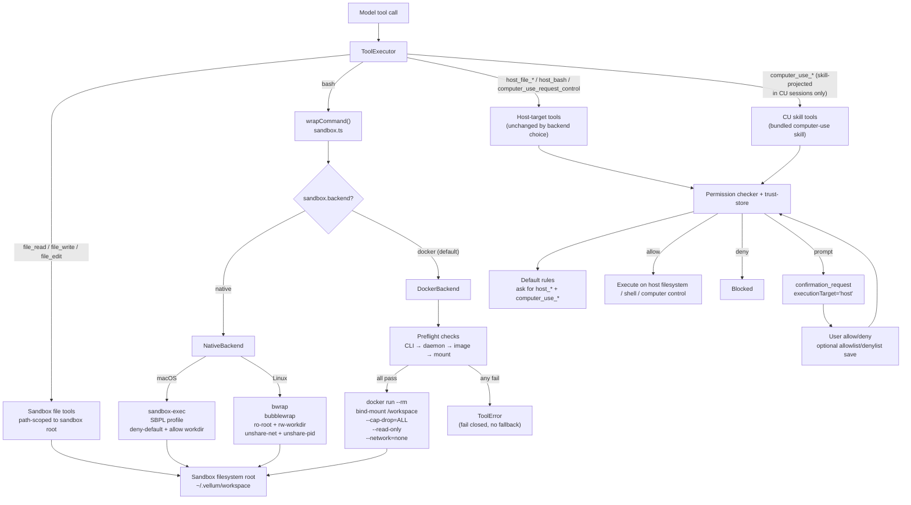
```mermaid
graph TB
    CALL["Model tool call"] --> EXEC["ToolExecutor"]

    EXEC -->|"file_read / file_write / file_edit"| SB_FILE_TOOLS["Sandbox file tools<br/>path-scoped to sandbox root"]
    SB_FILE_TOOLS --> SB_FS

    EXEC -->|"bash"| WRAP["wrapCommand()<br/>sandbox.ts"]

    WRAP --> BACKEND_CHECK{"sandbox.backend?"}
    BACKEND_CHECK -->|"native"| NATIVE["NativeBackend"]
    BACKEND_CHECK -->|"docker (default)"| DOCKER["DockerBackend"]

    NATIVE -->|"macOS"| SBPL["sandbox-exec<br/>SBPL profile<br/>deny-default + allow workdir"]
    NATIVE -->|"Linux"| BWRAP["bwrap<br/>bubblewrap<br/>ro-root + rw-workdir<br/>unshare-net + unshare-pid"]
    SBPL --> SB_FS["Sandbox filesystem root<br/>~/.vellum/workspace"]
    BWRAP --> SB_FS

    DOCKER --> PREFLIGHT["Preflight checks<br/>CLI → daemon → image → mount"]
    PREFLIGHT -->|"all pass"| CONTAINER["docker run --rm<br/>bind-mount /workspace<br/>--cap-drop=ALL<br/>--read-only<br/>--network=none"]
    PREFLIGHT -->|"any fail"| FAIL_CLOSED["ToolError<br/>(fail closed, no fallback)"]
    CONTAINER --> SB_FS

    EXEC -->|"host_file_* / host_bash / computer_use_request_control"| HOST_TOOLS["Host-target tools<br/>(unchanged by backend choice)"]
    EXEC -->|"computer_use_* (skill-projected<br/>in CU sessions only)"| SKILL_CU_TOOLS["CU skill tools<br/>(bundled computer-use skill)"]
    HOST_TOOLS --> CHECK["Permission checker + trust-store"]
    SKILL_CU_TOOLS --> CHECK
    CHECK --> DEFAULTS["Default rules<br/>ask for host_* + computer_use_*"]
    CHECK -->|"allow"| HOST_EXEC["Execute on host filesystem / shell / computer control"]
    CHECK -->|"deny"| BLOCK["Blocked"]
    CHECK -->|"prompt"| PROMPT["confirmation_request<br/>executionTarget='host'"]
    PROMPT --> USER["User allow/deny<br/>optional allowlist/denylist save"]
    USER --> CHECK
```

- **Backend selection**: The `sandbox.backend` config option (`"native"` or `"docker"`) determines how `bash` commands are sandboxed. The default is `"docker"`.
- **Native backend**: Uses OS-level sandboxing — `sandbox-exec` with SBPL profiles on macOS, `bwrap` (bubblewrap) on Linux. Denies network access and restricts filesystem writes to the sandbox root, `/tmp`, `/private/tmp`, and `/var/folders` (macOS) or the sandbox root and `/tmp` (Linux).
- **Docker backend**: Wraps each command in an ephemeral `docker run --rm` container. The canonical sandbox filesystem root (`~/.vellum/workspace`) is always bind-mounted to `/workspace`, regardless of which subdirectory the command runs in. Commands are wrapped with `bash -c`. Containers run with all capabilities dropped, a read-only root filesystem, no network access, and host UID:GID forwarding. The default image is `vellum-sandbox:latest`, built from `assistant/Dockerfile.sandbox` (extends `node:20-slim` with `curl`, `ca-certificates`, and `bash`). The image is auto-built on first use if not found locally.
- **Fail-closed**: Both backends refuse to execute unsandboxed if their prerequisites are unavailable. The Docker backend runs preflight checks (CLI, daemon, image, writable mount probe via `test -w /workspace`) and throws `ToolError` with actionable messages on failure. Positive preflight results are cached; negative results are rechecked on every call. The `vellum doctor` command validates the same checks against the same sandbox path.
- **Host tools unchanged**: `host_bash`, `host_file_read`, `host_file_write`, and `host_file_edit` always execute directly on the host regardless of which sandbox backend is active.
- Sandbox defaults: `file_*` and `bash` execute within `~/.vellum/workspace`.
- Host access is explicit: `host_file_read`, `host_file_write`, `host_file_edit`, and `host_bash` are separate tools.
- Prompt defaults: host tools, `computer_use_request_control`, and `computer_use_*` skill-projected actions default to `ask` unless a trust rule allowlists/denylists them.
- Browser tool defaults: all `browser_*` tools are auto-allowed by default via seeded allow rules at priority 100, preserving the frictionless UX from when browser was a core tool.
- Confirmation payloads include `executionTarget` (`sandbox` or `host`) so clients can label where the action will run.

---

## Slash Command Resolution

When a user message enters the daemon (via `processMessage` or the queue drain path), it passes through slash command resolution before persistence or agent execution.

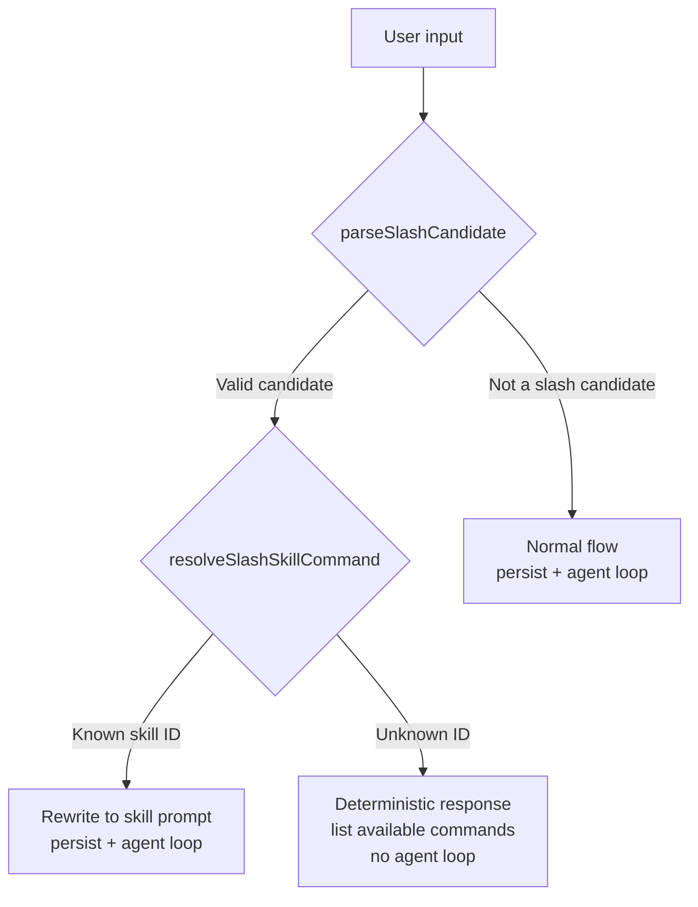
```mermaid
graph TB
    INPUT["User input"]
    PARSE{"parseSlashCandidate"}
    RESOLVE{"resolveSlashSkillCommand"}
    NONE["Normal flow<br/>persist + agent loop"]
    KNOWN["Rewrite to skill prompt<br/>persist + agent loop"]
    UNKNOWN["Deterministic response<br/>list available commands<br/>no agent loop"]

    INPUT --> PARSE
    PARSE -->|"Not a slash candidate"| NONE
    PARSE -->|"Valid candidate"| RESOLVE
    RESOLVE -->|"Known skill ID"| KNOWN
    RESOLVE -->|"Unknown ID"| UNKNOWN
```

Key behaviors:
- **Known**: Content is rewritten via `rewriteKnownSlashCommandPrompt` to instruct the model to invoke the skill. Trailing arguments are preserved.
- **Unknown**: A deterministic `assistant_text_delta` + `message_complete` is emitted listing available slash commands. No message persistence or model call occurs.
- **Queue**: Queued messages receive the same slash resolution. Unknown slash commands in the queue emit their response and continue draining without stalling.

---

## Dynamic Skill Authoring — Tool Flow

The assistant can author, test, and persist new skills at runtime through a three-tool workflow. All operations target `~/.vellum/workspace/skills/` (managed skills directory) and require explicit user confirmation.

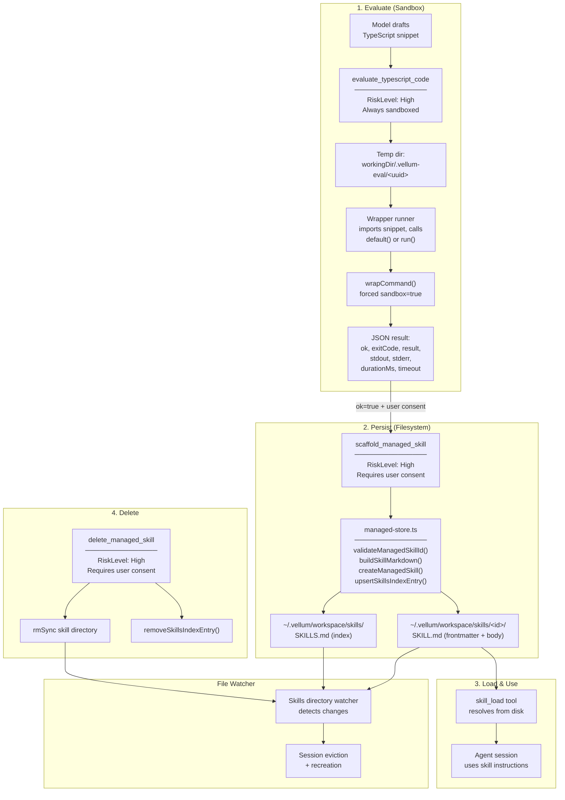
```mermaid
graph TB
    subgraph "1. Evaluate (Sandbox)"
        SNIPPET["Model drafts<br/>TypeScript snippet"]
        EVAL_TOOL["evaluate_typescript_code<br/>───────────────<br/>RiskLevel: High<br/>Always sandboxed"]
        TEMP["Temp dir:<br/>workingDir/.vellum-eval/&lt;uuid&gt;"]
        WRAPPER["Wrapper runner<br/>imports snippet, calls<br/>default() or run()"]
        SANDBOX["wrapCommand()<br/>forced sandbox=true"]
        RESULT["JSON result:<br/>ok, exitCode, result,<br/>stdout, stderr,<br/>durationMs, timeout"]
    end

    subgraph "2. Persist (Filesystem)"
        SCAFFOLD["scaffold_managed_skill<br/>───────────────<br/>RiskLevel: High<br/>Requires user consent"]
        MANAGED_STORE["managed-store.ts<br/>───────────────<br/>validateManagedSkillId()<br/>buildSkillMarkdown()<br/>createManagedSkill()<br/>upsertSkillsIndexEntry()"]
        SKILL_DIR["~/.vellum/workspace/skills/&lt;id&gt;/<br/>SKILL.md (frontmatter + body)"]
        INDEX["~/.vellum/workspace/skills/<br/>SKILLS.md (index)"]
    end

    subgraph "3. Load & Use"
        SKILL_LOAD["skill_load tool<br/>resolves from disk"]
        SESSION["Agent session<br/>uses skill instructions"]
    end

    subgraph "4. Delete"
        DELETE["delete_managed_skill<br/>───────────────<br/>RiskLevel: High<br/>Requires user consent"]
        RM_DIR["rmSync skill directory"]
        RM_INDEX["removeSkillsIndexEntry()"]
    end

    subgraph "File Watcher"
        WATCHER["Skills directory watcher<br/>detects changes"]
        EVICT["Session eviction<br/>+ recreation"]
    end

    SNIPPET --> EVAL_TOOL
    EVAL_TOOL --> TEMP
    TEMP --> WRAPPER
    WRAPPER --> SANDBOX
    SANDBOX --> RESULT
    RESULT -->|"ok=true + user consent"| SCAFFOLD

    SCAFFOLD --> MANAGED_STORE
    MANAGED_STORE --> SKILL_DIR
    MANAGED_STORE --> INDEX

    SKILL_DIR --> WATCHER
    INDEX --> WATCHER
    WATCHER --> EVICT

    SKILL_DIR --> SKILL_LOAD
    SKILL_LOAD --> SESSION

    DELETE --> RM_DIR
    DELETE --> RM_INDEX
    RM_DIR --> WATCHER
```

**Key design decisions:**
- `evaluate_typescript_code` always forces `sandbox.enabled = true` regardless of global config.
- Snippet contract: must export `default` or `run` with signature `(input: unknown) => unknown | Promise<unknown>`.
- Managed-store writes are atomic (tmp file + rename) to prevent partial `SKILL.md` or `SKILLS.md` files.
- After persist or delete, the file watcher triggers session eviction; the next turn runs in a fresh session. The model's system prompt instructs it to continue normally.
- macOS UI shows Inspect and Delete controls for managed skills only (source = "managed").
- `skill_load` validates the recursive include graph (via `include-graph.ts`) before emitting output. Missing children and cycles produce `isError: true` with no `<loaded_skill>` marker. Valid includes produce an "Included Skills (immediate)" metadata section showing child ID, name, description, and path.

### Include Graph Validation

Skills can declare child relationships via the `includes` frontmatter field (a JSON array of skill IDs). When `skill_load` loads a parent skill, it validates the full recursive include graph before emitting output.

```mermaid
graph LR
    LOAD["skill_load(parent)"] --> CATALOG["loadSkillCatalog()"]
    CATALOG --> INDEX["indexCatalogById()"]
    INDEX --> VALIDATE["validateIncludes(rootId, index)"]
    VALIDATE -->|"ok"| OUTPUT["Emit output +<br/>Included Skills (immediate)<br/>+ loaded_skill marker"]
    VALIDATE -->|"missing child"| ERR_MISSING["isError: true<br/>no loaded_skill marker"]
    VALIDATE -->|"cycle detected"| ERR_CYCLE["isError: true<br/>no loaded_skill marker"]
```

**Validation rules:**
- **Missing children**: If any skill in the recursive graph references an `includes` ID not found in the catalog, validation fails with the full path from root to the missing reference.
- **Cycles**: Three-state DFS (unseen → visiting → done) detects direct and indirect cycles. The error includes the cycle path.
- **Fail-closed**: On any validation error, `skill_load` returns `isError: true` with no `<loaded_skill>` marker, preventing the agent from using a skill with broken dependencies.

**Key constraint**: Include metadata is metadata-only. Child skills are **not** auto-activated — the agent must explicitly call `skill_load` for each child. The `projectSkillTools()` function only projects tools for skills with explicit `<loaded_skill>` markers in conversation history.

| Source File | Purpose |
|---|---|
| `assistant/src/skills/include-graph.ts` | `indexCatalogById()`, `getImmediateChildren()`, `validateIncludes()`, `traverseIncludes()` |
| `assistant/src/tools/skills/load.ts` | Include validation integration in `skill_load` execute path |
| `assistant/src/config/skills.ts` | `includes` field parsing from SKILL.md frontmatter |
| `assistant/src/skills/managed-store.ts` | `includes` emission in `buildSkillMarkdown()` |

---

## Dynamic Skill Tool System — Runtime Tool Projection

Skills can expose custom tools via a `TOOLS.json` manifest alongside their `SKILL.md`. When a skill is activated during a session, its tools are dynamically loaded, registered, and made available to the agent loop. Browser, Gmail, Claude Code, Weather, and other capabilities are delivered as **bundled skills** rather than hardcoded tools. Browser tools (previously the core `headless-browser` tool) are now provided by the bundled `browser` skill with system default allow rules that preserve frictionless auto-approval.

### Skill Directory Structure

Each skill directory (bundled, managed, workspace, or extra) may contain:

```
skills/<skill-id>/
  SKILL.md          # Skill instructions (frontmatter + markdown body; optional includes: [...] for child skills)
  TOOLS.json        # Tool manifest (optional — skills without tools are instruction-only)
  tools/            # Executor scripts referenced by TOOLS.json
    my-tool.ts      # Exports run(input, context) → ToolExecutionResult
```

### Bundled Skills

The following capabilities ship as bundled skills in `assistant/src/config/bundled-skills/`:

| Skill ID | Tools | Purpose |
|----------|-------|---------|
| `browser` | `browser_navigate`, `browser_snapshot`, `browser_screenshot`, `browser_close`, `browser_click`, `browser_type`, `browser_press_key`, `browser_wait_for`, `browser_extract`, `browser_fill_credential` | Headless browser automation — web scraping, form filling, interaction (previously core-registered as `headless-browser`; now skill-provided with default allow rules) |
| `gmail` | Gmail search, archive, send, etc. | Email management via OAuth2 integration |
| `claude-code` | Claude Code tool | Delegate coding tasks to Claude Code subprocess |
| `computer-use` | `computer_use_click`, `computer_use_double_click`, `computer_use_right_click`, `computer_use_type_text`, `computer_use_key`, `computer_use_scroll`, `computer_use_drag`, `computer_use_open_app`, `computer_use_run_applescript`, `computer_use_wait`, `computer_use_done`, `computer_use_respond` | Computer-use action tools — internally preactivated by `ComputerUseSession` via `preactivatedSkillIds`; not user-invocable or model-discoverable in text sessions. Each wrapper script forwards to `forwardComputerUseProxyTool()` which uses the session's proxy resolver to send actions to the macOS client. |
| `weather` | `get-weather` | Fetch current weather data |
| `app-builder` | `app_create`, `app_list`, `app_query`, `app_update`, `app_delete`, `app_file_list`, `app_file_read`, `app_file_edit`, `app_file_write` | Dynamic app authoring — CRUD and file-level editing for persistent apps (activated via `skill_load app-builder`; `app_open` remains a core proxy tool) |
| `self-upgrade` | (instruction-only) | Self-improvement workflow |
| `start-the-day` | (instruction-only) | Morning briefing routine |

### Activation and Projection Flow

```mermaid
graph TB
    subgraph "Activation Sources"
        SLASH["Slash command<br/>/skill-id → preactivate"]
        MARKER["&lt;loaded_skill id=&quot;...&quot; /&gt;<br/>marker in conversation history"]
        CONFIG["Config / session<br/>preactivatedSkillIds"]
    end

    subgraph "Per-Turn Projection (session-skill-tools.ts)"
        DERIVE["deriveActiveSkillIds(history)<br/>scan all messages for markers"]
        UNION["Union: context-derived ∪ preactivated"]
        DIFF["Diff vs previous turn"]
        UNREGISTER["unregisterSkillTools(removedId)<br/>tear down stale tools"]
        CATALOG["loadSkillCatalog()<br/>bundled + managed + workspace + extra"]
        LOAD_MANIFEST["loadManifestForSkill()<br/>read TOOLS.json from skill dir"]
        FACTORY["createSkillToolsFromManifest()<br/>→ Tool[] with origin='skill'"]
        REGISTER["registerSkillTools(tools)<br/>add to global tool registry"]
        PROJECTION["SkillToolProjection<br/>{toolDefinitions, allowedToolNames}"]
    end

    subgraph "Agent Loop (loop.ts)"
        RESOLVE["resolveTools(history) callback<br/>merges base tools + projected skill tools"]
        PROVIDER["LLM Provider<br/>receives full tool list"]
    end

    SLASH --> CONFIG
    MARKER --> DERIVE
    CONFIG --> UNION
    DERIVE --> UNION
    UNION --> DIFF
    DIFF -->|"removed IDs"| UNREGISTER
    UNION --> CATALOG
    CATALOG --> LOAD_MANIFEST
    LOAD_MANIFEST --> FACTORY
    FACTORY --> REGISTER
    REGISTER --> PROJECTION
    PROJECTION --> RESOLVE
    RESOLVE --> PROVIDER
```

**Internal preactivation**: Some bundled skills are preactivated programmatically rather than by user slash commands or model discovery. For example, `ComputerUseSession` sets `preactivatedSkillIds: ['computer-use']` in its constructor, causing `projectSkillTools()` to load the 12 `computer_use_*` tool definitions from the bundled skill's `TOOLS.json` on the first turn. These tools are never exposed in text sessions — they only appear in the CU session's agent loop.

### Skill Tool Execution

Skill tool executors are TypeScript scripts that export a `run(input, context)` function. Execution is routed based on the `execution_target` field in `TOOLS.json`:

```mermaid
graph TB
    CALL["Model tool_use call"] --> EXEC["ToolExecutor<br/>look up in registry"]
    EXEC --> CHECK{"tool.origin === 'skill'?"}
    CHECK -->|"No"| CORE["Core tool execution"]
    CHECK -->|"Yes"| RUNNER["runSkillToolScript()"]
    RUNNER --> TARGET{"execution_target?"}
    TARGET -->|"host"| HOST["Host Script Runner<br/>dynamic import + run()<br/>in-process execution"]
    TARGET -->|"sandbox"| SANDBOX["Sandbox Script Runner<br/>isolated subprocess<br/>wrapCommand() sandboxing"]
```

### Permission Flow for Skill Tools

Skill-origin tools follow a stricter default permission model than core tools. Even if a skill tool declares `risk: "low"` in its manifest, the permission checker defaults to prompting the user unless a trust rule explicitly allows it. Additionally, high-risk tool invocations always prompt the user even when a matching allow rule exists.

```mermaid
graph TB
    TOOL_CALL["Skill tool invocation"] --> PERM["PermissionChecker"]
    PERM --> TRUST{"Matching trust rule<br/>in trust.json?"}
    TRUST -->|"Allow rule matches"| HRISK{"Risk level?"}
    HRISK -->|"Low / Medium"| ALLOW["Auto-allow"]
    HRISK -->|"High"| HPROMPT["Prompt user<br/>(high-risk always prompts)"]
    TRUST -->|"No rule matches"| ORIGIN{"tool.origin?"}
    ORIGIN -->|"core"| RISK["Normal risk-level logic<br/>Low=auto, Medium=check, High=prompt"]
    ORIGIN -->|"skill"| PROMPT["Always prompt user<br/>(default ask for skill tools)"]
    TRUST -->|"Deny rule matches"| DENY["Blocked"]
```

### Key Source Files

| File | Role |
|------|------|
| `assistant/src/config/skills.ts` | Skill catalog loading: bundled, managed, workspace, extra directories |
| `assistant/src/config/bundled-skills/` | Bundled skill directories (browser, gmail, claude-code, computer-use, weather, etc.) |
| `assistant/src/skills/tool-manifest.ts` | `TOOLS.json` parser and validator |
| `assistant/src/skills/active-skill-tools.ts` | `deriveActiveSkillIds()` — scans history for `<loaded_skill>` markers |
| `assistant/src/skills/include-graph.ts` | Include graph builder: `indexCatalogById()`, `validateIncludes()`, cycle/missing detection |
| `assistant/src/daemon/session-skill-tools.ts` | `projectSkillTools()` — per-turn projection, register/unregister lifecycle |
| `assistant/src/tools/skills/skill-tool-factory.ts` | `createSkillToolsFromManifest()` — manifest entries to Tool objects |
| `assistant/src/tools/skills/skill-script-runner.ts` | Host runner: dynamic import + `run()` call |
| `assistant/src/tools/skills/sandbox-runner.ts` | Sandbox runner: isolated subprocess execution |
| `assistant/src/tools/registry.ts` | `registerSkillTools()` / `unregisterSkillTools()` — global tool registry |
| `assistant/src/permissions/checker.ts` | Skill-origin default-ask permission policy |

---

## Permission and Trust Security Model

The permission system controls which tool actions the agent can execute without explicit user approval. It supports two operating modes, principal-aware trust rules, and risk-based escalation to provide defense-in-depth against unintended or malicious tool execution.

### Permission Evaluation Flow

```mermaid
graph TB
    TOOL_CALL["Tool invocation<br/>(toolName, input, policyContext)"] --> CLASSIFY["classifyRisk()<br/>→ Low / Medium / High"]
    CLASSIFY --> CANDIDATES["buildCommandCandidates()<br/>tool:target strings +<br/>canonical path variants"]
    CANDIDATES --> FIND_RULE["findHighestPriorityRule()<br/>iterate sorted rules:<br/>tool, scope, pattern (minimatch),<br/>principal, executionTarget"]

    FIND_RULE -->|"Deny rule"| DENY["decision: deny<br/>Blocked by rule"]
    FIND_RULE -->|"Ask rule"| PROMPT_ASK["decision: prompt<br/>Always ask user"]
    FIND_RULE -->|"Allow rule"| RISK_CHECK{"Risk level?"}
    FIND_RULE -->|"No match"| NO_MATCH{"Fallback logic"}

    RISK_CHECK -->|"Low / Medium"| AUTO_ALLOW["decision: allow<br/>Auto-allowed by rule"]
    RISK_CHECK -->|"High"| HIGH_CHECK{"allowHighRisk<br/>on rule?"}
    HIGH_CHECK -->|"true"| AUTO_ALLOW
    HIGH_CHECK -->|"false / absent"| PROMPT_HIGH["decision: prompt<br/>High risk override"]

    NO_MATCH -->|"tool.origin === 'skill'"| PROMPT_SKILL["decision: prompt<br/>Skill tools always ask"]
    NO_MATCH -->|"strict mode"| PROMPT_STRICT["decision: prompt<br/>No implicit auto-allow"]
    NO_MATCH -->|"legacy mode (non-default)"| RISK_FALLBACK{"Risk level?"}
    RISK_FALLBACK -->|"Low"| AUTO_LOW["decision: allow<br/>Low risk auto-allow"]
    RISK_FALLBACK -->|"Medium"| PROMPT_MED["decision: prompt"]
    RISK_FALLBACK -->|"High"| PROMPT_HIGH2["decision: prompt"]
```

### Strict Mode vs Legacy Mode

The `permissions.mode` config option (`legacy` or `strict`) controls the default behavior when no trust rule matches a tool invocation.

| Behavior | Legacy mode | Strict mode (default) |
|---|---|---|
| Low-risk tools with no matching rule | Auto-allowed | Prompted |
| Medium-risk tools with no matching rule | Prompted | Prompted |
| High-risk tools with no matching rule | Prompted | Prompted |
| `skill_load` with no matching rule | Auto-allowed (low risk) | Prompted (explicit rule required) |
| `skill_load` with system default rule | Auto-allowed (`skill_load:*` at priority 100) | Auto-allowed (`skill_load:*` at priority 100) |
| `browser_*` skill tools with system default rules | Auto-allowed (priority 100 allow rules) | Auto-allowed (priority 100 allow rules) |
| Skill-origin tools with no matching rule | Prompted | Prompted |
| Allow rules for non-high-risk tools | Auto-allowed | Auto-allowed |
| Allow rules with `allowHighRisk: true` | Auto-allowed (even high risk) | Auto-allowed (even high risk) |
| Deny rules | Blocked | Blocked |

Strict mode is designed for security-conscious deployments where every tool action must have an explicit matching rule in the trust store. It eliminates implicit auto-allow for any risk level, ensuring the user has consciously approved each class of tool usage.

### Trust Rules (v3 Schema)

Rules are stored in `~/.vellum/protected/trust.json` with version `3`. Each rule can include the following fields:

| Field | Type | Purpose |
|---|---|---|
| `id` | `string` | Unique identifier (UUID for user rules, `default:*` for system defaults) |
| `tool` | `string` | Tool name to match (e.g., `bash`, `file_write`, `skill_load`) |
| `pattern` | `string` | Minimatch glob pattern for the command/target string |
| `scope` | `string` | Path prefix or `everywhere` — restricts where the rule applies |
| `decision` | `allow \| deny \| ask` | What to do when the rule matches |
| `priority` | `number` | Higher priority wins; deny wins ties at equal priority |
| `principalKind` | `string?` | `core` or `skill` — filters by tool origin |
| `principalId` | `string?` | Skill ID — only matches invocations from this skill |
| `principalVersion` | `string?` | Version hash — only matches this exact skill version |
| `executionTarget` | `string?` | `sandbox` or `host` — restricts by execution context |
| `allowHighRisk` | `boolean?` | When true, auto-allows even high-risk invocations |

Missing optional fields act as wildcards. A rule with no `principalKind`, `principalId`, or `principalVersion` matches any principal. A rule with no `executionTarget` matches any target.

### Principal and Version Matching

When a tool invocation carries a `PolicyContext` with a `ToolPrincipal`, the trust store filters rules by principal constraints:

```mermaid
graph TB
    RULE["Trust rule with<br/>principalKind, principalId,<br/>principalVersion"] --> KIND_CHECK{"principalKind<br/>on rule?"}
    KIND_CHECK -->|"absent"| ID_CHECK
    KIND_CHECK -->|"present"| KIND_MATCH{"ctx.principal.kind<br/>matches?"}
    KIND_MATCH -->|"no"| SKIP["Rule does not match"]
    KIND_MATCH -->|"yes"| ID_CHECK{"principalId<br/>on rule?"}

    ID_CHECK -->|"absent"| VER_CHECK
    ID_CHECK -->|"present"| ID_MATCH{"ctx.principal.id<br/>matches?"}
    ID_MATCH -->|"no"| SKIP
    ID_MATCH -->|"yes"| VER_CHECK{"principalVersion<br/>on rule?"}

    VER_CHECK -->|"absent"| MATCH["Rule matches<br/>(any version)"]
    VER_CHECK -->|"present"| VER_MATCH{"ctx.principal.version<br/>matches?"}
    VER_MATCH -->|"no"| SKIP
    VER_MATCH -->|"yes"| MATCH
```

Version-bound rules are central to the security model for skills: when a user approves a specific skill version, the trust rule records the version hash. If the skill's source files change (producing a different hash from `computeSkillVersionHash()`), the old rule no longer matches and the user is re-prompted.

### Risk Classification and Escalation

The `classifyRisk()` function determines the risk level for each tool invocation:

| Tool | Risk level | Notes |
|---|---|---|
| `file_read`, `web_search`, `skill_load` | Low | Read-only or informational |
| `file_write`, `file_edit` | Medium (default) | Filesystem mutations |
| `file_write`, `file_edit` targeting skill source paths | **High** | `isSkillSourcePath()` detects managed/bundled/workspace/extra skill roots |
| `host_file_write`, `host_file_edit` targeting skill source paths | **High** | Same path classification, host variant |
| `bash`, `host_bash` | Varies | Parsed via tree-sitter: low-risk programs = Low, high-risk programs = High, unknown = Medium |
| `scaffold_managed_skill`, `delete_managed_skill` | High | Skill lifecycle mutations always high-risk |
| `evaluate_typescript_code` | High | Arbitrary code execution |
| Skill-origin tools with no matching rule | Prompted regardless of risk | Even Low-risk skill tools default to `ask` |

The escalation of skill source file mutations to High risk is a privilege-escalation defense: modifying skill source code could grant the agent new capabilities, so such operations always require explicit approval.

### Skill Load Approval

The `skill_load` tool generates version-aware command candidates for rule matching:

1. `skill_load:<skill-id>@<version-hash>` — matches version-pinned rules
2. `skill_load:<skill-id>` — matches any-version rules
3. `skill_load:<raw-selector>` — matches the raw user-provided selector

In strict mode, `skill_load` without a matching rule is always prompted. In legacy mode, it is auto-allowed as a Low-risk tool. The allowlist options presented to the user include both version-specific and any-version patterns. Note: the system default allow rule `skill_load:*` (priority 100) now globally allows all skill loads in both modes (see "System Default Allow Rules" below).

### Starter Approval Bundle

The starter bundle is an opt-in set of low-risk allow rules that reduces prompt noise, particularly in strict mode. It covers read-only tools that never mutate the filesystem or execute arbitrary code:

| Rule | Tool | Pattern |
|---|---|---|
| `file_read` | `file_read` | `file_read:**` |
| `glob` | `glob` | `glob:**` |
| `grep` | `grep` | `grep:**` |
| `list_directory` | `list_directory` | `list_directory:**` |
| `web_search` | `web_search` | `web_search:**` |
| `web_fetch` | `web_fetch` | `web_fetch:**` |

Acceptance is idempotent and persisted as `starterBundleAccepted: true` in `trust.json`. Rules are seeded at priority 90 (below user rules at 100, above system defaults at 50).

### System Default Allow Rules

In addition to the opt-in starter bundle, the permission system seeds unconditional default allow rules at priority 100 for two categories:

| Rule ID | Tool | Pattern | Rationale |
|---|---|---|---|
| `default:allow-skill_load-global` | `skill_load` | `skill_load:*` | Loading any skill is globally allowed — no prompt for activating bundled, managed, or workspace skills |
| `default:allow-browser_navigate-global` | `browser_navigate` | `browser_navigate:*` | Browser tools migrated from core to the bundled `browser` skill; default allow preserves frictionless UX |
| `default:allow-browser_snapshot-global` | `browser_snapshot` | `browser_snapshot:*` | (same) |
| `default:allow-browser_screenshot-global` | `browser_screenshot` | `browser_screenshot:*` | (same) |
| `default:allow-browser_close-global` | `browser_close` | `browser_close:*` | (same) |
| `default:allow-browser_click-global` | `browser_click` | `browser_click:*` | (same) |
| `default:allow-browser_type-global` | `browser_type` | `browser_type:*` | (same) |
| `default:allow-browser_press_key-global` | `browser_press_key` | `browser_press_key:*` | (same) |
| `default:allow-browser_wait_for-global` | `browser_wait_for` | `browser_wait_for:*` | (same) |
| `default:allow-browser_extract-global` | `browser_extract` | `browser_extract:*` | (same) |
| `default:allow-browser_fill_credential-global` | `browser_fill_credential` | `browser_fill_credential:*` | (same) |

These rules are emitted by `getDefaultRuleTemplates()` in `assistant/src/permissions/defaults.ts`. Because they use priority 100 (equal to user rules), they take effect in both strict and legacy modes. The `skill_load` rule means skill activation never prompts; the `browser_*` rules mean the browser skill's tools behave identically to the old core `headless-browser` tool from a permission standpoint.

### Prompt UX

When a permission prompt is sent to the client (via `confirmation_request` IPC message), it includes:

| Field | Content |
|---|---|
| `toolName` | The tool being invoked |
| `input` | Redacted tool input (sensitive fields removed) |
| `riskLevel` | `low`, `medium`, or `high` |
| `executionTarget` | `sandbox` or `host` — where the action will execute |
| `principalKind` | `core` or `skill` — who owns the tool |
| `principalId` | Skill ID (if skill-origin) |
| `principalVersion` | Version hash (if available) |
| `allowlistOptions` | Suggested patterns for "always allow" rules |
| `scopeOptions` | Suggested scopes for rule persistence |

The user can respond with: `allow` (one-time), `always_allow` (create allow rule), `always_allow_high_risk` (create allow rule with `allowHighRisk: true`), `deny` (one-time), or `always_deny` (create deny rule).

### Canonical Paths

File tool candidates include canonical (symlink-resolved) absolute paths via `normalizeFilePath()` to prevent policy bypass through symlinked or relative path variations. The path classifier (`isSkillSourcePath()`) also resolves symlinks before checking against skill root directories.

### Key Source Files

| File | Role |
|---|---|
| `assistant/src/permissions/types.ts` | `TrustRule`, `PolicyContext`, `ToolPrincipal`, `RiskLevel`, `UserDecision` types |
| `assistant/src/permissions/checker.ts` | `classifyRisk()`, `check()`, `buildCommandCandidates()`, allowlist/scope generation |
| `assistant/src/permissions/trust-store.ts` | Rule persistence, `findHighestPriorityRule()`, principal/version matching, starter bundle |
| `assistant/src/permissions/prompter.ts` | IPC prompt flow: `confirmation_request` → `confirmation_response` |
| `assistant/src/permissions/defaults.ts` | Default rule templates (system ask rules for host tools, CU, etc.) |
| `assistant/src/skills/version-hash.ts` | `computeSkillVersionHash()` — deterministic SHA-256 of skill source files |
| `assistant/src/skills/path-classifier.ts` | `isSkillSourcePath()`, `normalizeFilePath()`, skill root detection |
| `assistant/src/config/schema.ts` | `PermissionsConfigSchema` — `permissions.mode` (`legacy` / `strict`) |
| `assistant/src/tools/executor.ts` | `ToolExecutor` — orchestrates risk classification, permission check, and execution |

---

## Swarm Orchestration — Parallel Task Execution

When the model invokes `swarm_delegate`, the daemon decomposes a complex task into parallel specialist subtasks and executes them concurrently.

```mermaid
sequenceDiagram
    participant Session as Session (Daemon)
    participant Tool as swarm_delegate tool
    participant Planner as Router Planner
    participant LLM as LLM Provider
    participant Scheduler as DAG Scheduler
    participant W1 as Worker 1 (claude_code)
    participant W2 as Worker 2 (claude_code)
    participant Synth as Synthesizer

    Session->>Tool: execute(objective)
    Note over Tool: Recursion guard + abort check

    Tool->>Planner: generatePlan(objective)
    Planner->>LLM: Plan request (plannerModel)
    LLM-->>Planner: JSON plan
    Planner->>Planner: validateAndNormalizePlan()

    Tool->>Scheduler: executeSwarm(plan, limits)

    par Parallel workers (bounded by maxWorkers)
        Scheduler->>W1: runTask(t1, profile=coder)
        Note over W1: Agent SDK subprocess
        W1-->>Scheduler: result
    and
        Scheduler->>W2: runTask(t2, profile=researcher)
        Note over W2: Agent SDK subprocess
        W2-->>Scheduler: result
    end

    Note over Scheduler: Retry failed tasks (maxRetriesPerTask)<br/>Block dependents on failure

    Scheduler->>Synth: synthesizeResults(results)
    Synth->>LLM: Synthesis request (synthesizerModel)
    LLM-->>Synth: Final answer
    Synth-->>Tool: SwarmExecutionSummary
    Tool-->>Session: tool_result + stats
```

### Key design decisions

- **Recursion guard**: A module-level `Set<sessionId>` prevents concurrent swarms within the same session while allowing independent sessions to run their own swarms in parallel.
- **Abort signal**: The tool checks `context.signal?.aborted` before planning and before execution. The signal is also forwarded into `executeSwarm` and the worker backend, enabling cooperative cancellation of in-flight workers.
- **DAG scheduling**: Tasks with dependencies are topologically ordered. Independent tasks run in parallel up to `maxWorkers`.
- **Per-task retries**: Failed tasks retry up to `maxRetriesPerTask` before being marked failed. Dependents are transitively blocked.
- **Role-scoped profiles**: Workers run with restricted tool access based on their role (coder, researcher, reviewer, general).
- **Synthesis fallback**: If the LLM synthesis call fails, a deterministic markdown summary is generated from task results.
- **Progress streaming**: Status events (`task_started`, `task_completed`, `task_failed`, `task_blocked`, `done`) are streamed via `context.onOutput`.

### Config knobs

| Config key | Default | Purpose |
|---|---:|---|
| `swarm.enabled` | `true` | Master switch for swarm orchestration |
| `swarm.maxWorkers` | `3` | Max concurrent worker processes (hard ceiling: 6) |
| `swarm.maxTasks` | `8` | Max tasks per plan (hard ceiling: 20) |
| `swarm.maxRetriesPerTask` | `1` | Per-task retry limit (hard ceiling: 3) |
| `swarm.workerTimeoutSec` | `900` | Worker timeout in seconds |
| `swarm.plannerModel` | (varies) | Model used for plan generation |
| `swarm.synthesizerModel` | (varies) | Model used for result synthesis |

---

## Opportunistic Message Queue — Handoff Flow

When the daemon is busy generating a response, the client can continue sending messages. These are queued (FIFO, max 10) and drained automatically at safe checkpoints in the tool loop, not only at full completion.

```mermaid
sequenceDiagram
    participant User
    participant Chat as ChatView
    participant VM as ChatViewModel
    participant DC as DaemonClient
    participant Daemon as Daemon

    User->>Chat: send message while busy
    Chat->>VM: enqueue message
    VM->>DC: user_message
    DC->>Daemon: IPC
    Daemon-->>DC: message_queued (position)
    DC-->>VM: show queue status

    Note over Daemon: Processing previous request...<br/>Reaches safe tool-loop checkpoint

    Daemon-->>DC: generation_handoff (sessionId, queuedCount)
    Note over Daemon: Daemon yields current generation

    Daemon-->>DC: message_dequeued
    DC-->>VM: next queued message now processing

    Note over Daemon: Processes queued message...

    Daemon-->>DC: assistant_text_delta (streaming)
    Daemon-->>DC: message_complete
    DC-->>VM: generation finished
```

---

## Trace System — Debug Panel Data Flow

The trace system provides real-time observability of daemon session internals. Each session creates a `TraceEmitter` that emits structured `trace_event` IPC messages as the session processes requests, makes LLM calls, and executes tools.

```mermaid
sequenceDiagram
    participant User
    participant Chat as ChatView
    participant DC as DaemonClient
    participant Daemon as Session (Daemon)
    participant TE as TraceEmitter
    participant EB as EventBus
    participant TTL as ToolTraceListener
    participant LLM as LLM Provider
    participant TS as TraceStore (Swift)
    participant DP as DebugPanel

    User->>Chat: send message
    Chat->>DC: user_message
    DC->>Daemon: IPC

    Daemon->>TE: emit(request_received)
    TE-->>DC: trace_event (request_received)
    DC-->>TS: onTraceEvent → ingest()

    Daemon->>LLM: API call
    Daemon->>TE: emit(llm_call_started)
    TE-->>DC: trace_event (llm_call_started)
    DC-->>TS: ingest()

    LLM-->>Daemon: streaming response
    Daemon->>TE: emit(llm_call_finished, tokens + latency)
    TE-->>DC: trace_event (llm_call_finished)
    DC-->>TS: ingest()

    Note over Daemon,EB: Tool execution triggers domain events

    Daemon->>EB: tool.execution.started
    EB->>TTL: onAny(event)
    TTL->>TE: emit(tool_started)
    TE-->>DC: trace_event (tool_started)
    DC-->>TS: ingest()

    Daemon->>EB: tool.execution.finished
    EB->>TTL: onAny(event)
    TTL->>TE: emit(tool_finished, durationMs)
    TE-->>DC: trace_event (tool_finished)
    DC-->>TS: ingest()

    Daemon->>TE: emit(message_complete)
    TE-->>DC: trace_event (message_complete)
    DC-->>TS: ingest()

    Note over TS: Events deduplicated by eventId,<br/>ordered by sequence + timestampMs,<br/>grouped by session and requestId,<br/>capped at 5000 per session

    TS-->>DP: @Published eventsBySession
    Note over DP: Metrics strip: requests, LLM calls,<br/>tokens (in/out), avg latency, failures<br/>Timeline: events grouped by requestId
```

### Trace Event Kinds

Events emitted during a session lifecycle:

| Kind | Emitted by | When |
|------|-----------|------|
| `request_received` | Handlers / Session | User message or surface action arrives |
| `request_queued` | Handlers / Session | Message queued while session is busy |
| `request_dequeued` | Session | Queued message begins processing |
| `llm_call_started` | Session | LLM API call initiated |
| `llm_call_finished` | Session | LLM API call completed (carries `inputTokens`, `outputTokens`, `latencyMs`) |
| `assistant_message` | Session | Assistant response assembled (carries `toolUseCount`) |
| `tool_started` | ToolTraceListener | Tool execution begins |
| `tool_permission_requested` | ToolTraceListener | Permission check needed (carries `riskLevel`) |
| `tool_permission_decided` | ToolTraceListener | Permission granted or denied (carries `decision`) |
| `tool_finished` | ToolTraceListener | Tool execution completed (carries `durationMs`) |
| `tool_failed` | ToolTraceListener | Tool execution failed (carries `durationMs`) |
| `secret_detected` | ToolTraceListener | Secret found in tool output |
| `generation_handoff` | Session | Yielding to next queued message |
| `message_complete` | Session | Full request processing finished |
| `generation_cancelled` | Session | User cancelled the generation |
| `request_error` | Handlers / Session | Unrecoverable error during processing (includes queue-full rejection and persist-failure paths) |

### Architecture

- **TraceEmitter** (daemon, per-session): Constructed with a `sessionId` and a `sendToClient` callback. Maintains a monotonic sequence counter for stable ordering. Truncates summaries to 200 chars and attribute values to 500 chars. Each call to `emit()` sends a `trace_event` IPC message to the connected client.
- **ToolTraceListener** (daemon): Subscribes to the session's `EventBus` via `onAny()` and translates tool domain events (`tool.execution.started`, `tool.execution.finished`, `tool.execution.failed`, `tool.permission.requested`, `tool.permission.decided`, `tool.secret.detected`) into trace events through the `TraceEmitter`.
- **DaemonClient** (Swift, shared): Decodes `trace_event` IPC messages into `TraceEventMessage` structs and invokes the `onTraceEvent` callback.
- **TraceStore** (Swift, macOS): `@MainActor ObservableObject` that ingests `TraceEventMessage` structs. Deduplicates by `eventId`, maintains stable sort order (sequence, then timestampMs, then insertion order), groups events by session and requestId, and enforces a retention cap of 5,000 events per session. Each request group is classified with a terminal status: `completed` (via `message_complete`), `cancelled` (via `generation_cancelled`), `handedOff` (via `generation_handoff`), `error` (via `request_error` or any event with `status == "error"`), or `active` (no terminal event yet).
- **DebugPanel** (Swift, macOS): SwiftUI view that observes `TraceStore`. Displays a metrics strip (request count, LLM calls, total tokens, average latency, tool failures) and a `TraceTimelineView` showing events grouped by requestId with color-coded status indicators. The timeline auto-scrolls to new events while the user is at the bottom; scrolling up pauses auto-scroll and shows a "Jump to bottom" button that resumes it.

---

## Dynamic Workspace — Surface Routing and Layout

The workspace is a full-window mode that replaces the chat UI with an interactive dynamic page (WKWebView) and a pinned composer for follow-up messages. It activates when the daemon sends a `ui_surface_show` message with `display != "inline"`.

### Routing Flow (Chat → Workspace)

```mermaid
sequenceDiagram
    participant Daemon as Daemon (IPC)
    participant DC as DaemonClient
    participant SM as SurfaceManager
    participant AD as AppDelegate
    participant MW as MainWindowView

    Daemon->>DC: ui_surface_show (display != "inline")
    DC->>SM: onSurfaceShow callback
    SM->>SM: Check display field
    alt display == "inline"
        SM->>SM: Show floating NSPanel
    else display != "inline" (workspace route)
        SM->>SM: Add to workspaceRoutedSurfaces set
        SM->>AD: onDynamicPageShow callback
        AD->>AD: Post .openDynamicWorkspace notification
        AD->>MW: Notification with UiSurfaceShowMessage
        MW->>MW: Parse Surface from message
        MW->>MW: Set activeDynamicSurface,<br/>activeDynamicParsedSurface,<br/>isDynamicExpanded = true
        MW->>MW: Render dynamicWorkspaceView()<br/>instead of normal chat
    end

    Note over SM,MW: Updates and dismissals follow<br/>the same notification pattern:<br/>.updateDynamicWorkspace<br/>.dismissDynamicWorkspace
```

**Key types:** `SurfaceManager` routes surfaces by `display` field. `MainWindowView` listens for three notifications (`.openDynamicWorkspace`, `.updateDynamicWorkspace`, `.dismissDynamicWorkspace`) and manages `@State` properties to toggle between chat and workspace views.

### Full-Window Workspace Layout

```
┌────────────────────────────────────────────────┐
│  ← Back    App Title                     ✕     │  ← Toolbar (HStack)
├────────────────────────────────────────────────┤
│                                                │
│                                                │
│           DynamicPageSurfaceView               │  ← WKWebView (fills space)
│              (interactive HTML)                 │
│                                                │
│                                                │
├────────────────────────────────────────────────┤
│  ComposerView (pinned at bottom)               │  ← Follow-up input
└────────────────────────────────────────────────┘
```

The workspace is a `VStack(spacing: 0)` with `VColor.backgroundSubtle` background. The toolbar has back (returns to gallery) and close (exits workspace + panel) buttons. `DynamicPageSurfaceView` grows to fill remaining vertical space. `ComposerView` is pinned at the bottom, bound to the active `ChatViewModel` so users can send follow-up messages while the page is open.

### Widget Injection Pipeline (CSS + JS into WKWebView)

`DynamicPageSurfaceView` is an `NSViewRepresentable` that wraps a `WKWebView`. On creation, three `WKUserScript`s are injected at document start:

```mermaid
graph LR
    subgraph "Injection (at document start)"
        BRIDGE["1. Bridge Script<br/>───────────────<br/>window.vellum.sendAction()<br/>window.vellum.confirm()<br/>window.vellum.data.* (if appId)<br/>console forwarding"]
        CSS["2. Design System CSS<br/>───────────────<br/>vellum-design-system.css<br/>Semantic tokens (--v-*)<br/>Element defaults<br/>Dark/light mode"]
        WIDGETS["3. Widget Utilities JS<br/>───────────────<br/>vellum-widgets.js<br/>sparkline(), barChart()<br/>lineChart(), gauge()<br/>format() helpers"]
    end

    subgraph "Message Passing"
        JS_CALL["JS: window.webkit.messageHandlers<br/>.vellumBridge.postMessage()"]
        COORD["Coordinator<br/>(WKScriptMessageHandler)"]
        DAEMON["AppDelegate → Daemon"]
    end

    BRIDGE --> JS_CALL
    JS_CALL --> COORD
    COORD --> DAEMON
```

**Per-app isolation:** Each app gets its own origin (`https://{appId}.vellum.local/`). The `VellumAppSchemeHandler` handles `vellumapp://` URLs for serving bundled app files from the sandbox directory. Sandbox mode blocks external network requests.

**Data RPC flow:** App JS calls `window.vellum.data.query()` → Coordinator → AppDelegate → Daemon `app_data_request`. Daemon responds with `app_data_response` → `SurfaceManager.resolveDataResponse()` → Coordinator evaluates `window.vellum.data._resolve()` in the WebView.

---

## Integrations — OAuth2 + Unified Messaging + Twitter

The integration framework lets Vellum connect to third-party services via OAuth2. The architecture follows these principles:

- **Secrets never reach the LLM** — OAuth tokens are stored in the credential vault and accessed exclusively through the `TokenManager`, which provides tokens to tool executors via `withValidToken()`. The LLM never sees raw tokens.
- **PKCE or client_secret flows** — Desktop apps use PKCE by default (S256). Providers that require a client secret (e.g. Slack) pass it during the OAuth2 flow and store it in credential metadata for autonomous refresh. Twitter uses PKCE with an optional client secret in `local_byo` mode.
- **Unified messaging layer** — All messaging platforms implement the `MessagingProvider` interface. Generic tools delegate to the provider, so adding a new platform is just implementing one adapter + an OAuth setup skill.
- **Standalone integrations** — Not all integrations fit the messaging model. Twitter has its own OAuth2 flow and IPC handlers (`twitter_auth_start`, `twitter_auth_status`) separate from the unified messaging layer.
- **Provider registry** — Messaging providers register at daemon startup. The registry tracks which providers have stored credentials, enabling auto-selection when only one is connected.

### Unified Messaging Architecture

```mermaid
graph TB
    subgraph "Messaging Skill (bundled-skills/messaging/)"
        SKILL_MD["SKILL.md<br/>agent instructions"]
        TOOLS_JSON["TOOLS.json<br/>tool manifest"]
        subgraph "Generic Tools"
            AUTH_TEST["messaging_auth_test"]
            LIST["messaging_list_conversations"]
            READ["messaging_read"]
            SEARCH["messaging_search"]
            SEND["messaging_send"]
            REPLY["messaging_reply"]
            MARK_READ["messaging_mark_read"]
            ACTIVITY["messaging_analyze_activity"]
            STYLE["messaging_analyze_style"]
            DRAFT["messaging_draft"]
        end
        subgraph "Slack-specific Tools"
            REACT["slack_add_reaction"]
            LEAVE["slack_leave_channel"]
        end
        subgraph "Gmail-specific Tools"
            ARCHIVE["gmail_archive"]
            LABEL["gmail_label"]
            TRASH["gmail_trash"]
            UNSUB["gmail_unsubscribe"]
            GMAIL_DRAFT["gmail_draft"]
        end
        SHARED["shared.ts<br/>resolveProvider + withProviderToken"]
    end

    subgraph "Messaging Layer (messaging/)"
        PROVIDER_IF["MessagingProvider interface"]
        REGISTRY["Provider Registry"]
        TYPES["Platform-agnostic types<br/>Conversation, Message, SearchResult"]
        ACTIVITY_ANALYZER["Activity Analyzer"]
        STYLE_ANALYZER["Style Analyzer"]
        DRAFT_STORE["Draft Store"]
    end

    subgraph "Provider Adapters"
        SLACK_ADAPTER["Slack Adapter<br/>messaging/providers/slack/"]
        GMAIL_ADAPTER["Gmail Adapter<br/>messaging/providers/gmail/"]
    end

    subgraph "External APIs"
        SLACK_API["Slack Web API"]
        GMAIL_API["Gmail REST API"]
    end

    SHARED --> REGISTRY
    REGISTRY --> PROVIDER_IF
    SLACK_ADAPTER -.->|implements| PROVIDER_IF
    GMAIL_ADAPTER -.->|implements| PROVIDER_IF
    SLACK_ADAPTER --> SLACK_API
    GMAIL_ADAPTER --> GMAIL_API
    AUTH_TEST --> SHARED
    LIST --> SHARED
    SEARCH --> SHARED
    SEND --> SHARED
    REACT --> SLACK_ADAPTER
    ARCHIVE --> GMAIL_ADAPTER
    ACTIVITY --> ACTIVITY_ANALYZER
    STYLE --> STYLE_ANALYZER
```

### Data Flow

```mermaid
sequenceDiagram
    participant UI as Settings UI (Swift)
    participant IPC as IPC Socket
    participant Handler as Daemon Handlers
    participant Registry as IntegrationRegistry
    participant OAuth as OAuth2 PKCE Flow
    participant Browser as System Browser
    participant Google as Google OAuth Server
    participant Vault as Credential Vault
    participant TokenMgr as TokenManager
    participant Tool as Gmail Tool Executor
    participant API as Gmail REST API

    Note over UI,API: Connection Flow
    UI->>IPC: integration_connect {integrationId: "gmail"}
    IPC->>Handler: dispatch
    Handler->>Registry: getIntegration("gmail")
    Registry-->>Handler: IntegrationDefinition
    Handler->>OAuth: startOAuth2Flow(config)
    OAuth->>OAuth: generate code_verifier + code_challenge (S256)
    OAuth->>OAuth: start Bun.serve on random port
    OAuth->>IPC: open_url (Google consent URL)
    IPC->>Browser: open URL
    Browser->>Google: user authorizes
    Google->>OAuth: callback with auth code
    OAuth->>Google: exchange code + code_verifier for tokens
    Google-->>OAuth: access + refresh tokens
    OAuth->>Vault: setSecureKey (access + refresh)
    OAuth->>Vault: upsertCredentialMetadata (allowedTools, expiresAt)
    OAuth-->>Handler: success + account email
    Handler->>IPC: integration_connect_result {success, accountInfo}
    IPC->>UI: show connected state

    Note over UI,API: Tool Execution Flow
    Tool->>TokenMgr: withValidToken("gmail", callback)
    TokenMgr->>Vault: getSecureKey("integration:gmail:access_token")
    TokenMgr->>Vault: getMetadata (check expiresAt)
    alt Token expired
        TokenMgr->>Google: refresh with refresh_token
        Google-->>TokenMgr: new access token
        TokenMgr->>Vault: update access token + expiresAt
    end
    TokenMgr->>Tool: callback(validToken)
    Tool->>API: Gmail REST API call with Bearer token
    API-->>Tool: response
    alt 401 Unauthorized
        Tool->>TokenMgr: retry (auto-refresh + re-execute)
    end
```

### Twitter Integration Architecture

Twitter uses a standalone OAuth2 flow separate from the unified messaging layer. It supports two posting mechanisms: an OAuth2 PKCE flow for API-based access, and a browser-session (CDP) approach for posting via Chrome.

#### Twitter OAuth2 Flow

```mermaid
sequenceDiagram
    participant UI as Settings UI (Swift)
    participant IPC as IPC Socket
    participant Handler as twitter-auth handler
    participant OAuth as OAuth2 PKCE Flow
    participant Browser as System Browser
    participant Twitter as Twitter OAuth Server
    participant Vault as Credential Vault
    participant API as X API (v2)

    Note over UI,API: Connection Flow (local_byo mode)
    UI->>IPC: twitter_auth_start
    IPC->>Handler: dispatch
    Handler->>Handler: load config (twitterIntegrationMode)
    Handler->>Vault: getSecureKey (oauth_client_id)
    Handler->>OAuth: startOAuth2Flow(config)
    OAuth->>OAuth: generate code_verifier + code_challenge (S256)
    OAuth->>OAuth: start Bun.serve on random port
    OAuth->>IPC: open_url (twitter.com/i/oauth2/authorize)
    IPC->>Browser: open URL
    Browser->>Twitter: user authorizes
    Twitter->>OAuth: callback with auth code
    OAuth->>Twitter: exchange code + code_verifier at api.x.com/2/oauth2/token
    Twitter-->>OAuth: access + refresh tokens
    OAuth-->>Handler: tokens + grantedScopes
    Handler->>API: GET /2/users/me (verify identity)
    API-->>Handler: username
    Handler->>Vault: setSecureKey (access + refresh tokens)
    Handler->>Vault: upsertCredentialMetadata
    Handler->>IPC: twitter_auth_result {success, accountInfo: "@username"}
    IPC->>UI: show connected state
```

#### Twitter OAuth2 Specifics

| Aspect | Detail |
|--------|--------|
| Auth URL | `https://twitter.com/i/oauth2/authorize` |
| Token URL | `https://api.x.com/2/oauth2/token` |
| Flow | PKCE (S256), optional client secret |
| Requested scopes | `tweet.read`, `users.read`, `offline.access` |
| Identity verification | `GET https://api.x.com/2/users/me` with Bearer token, before persisting tokens |
| Integration mode | `local_byo` — user provides their own Twitter app Client ID |
| IPC messages | `twitter_auth_start`, `twitter_auth_status` / `twitter_auth_result`, `twitter_auth_status_response` |

#### Twitter Credential Metadata Structure

When the OAuth2 flow completes, the handler stores credential metadata at `integration:twitter` / `access_token`:

```
{
  accountInfo: "@username",
  allowedTools: ["twitter_post"],
  allowedDomains: [],
  oauth2TokenUrl: "https://api.x.com/2/oauth2/token",
  oauth2ClientId: "<user's client ID>",
  oauth2ClientSecret: "<optional>",
  grantedScopes: ["tweet.read", "users.read", "offline.access"],
  expiresAt: <epoch ms>
}
```

#### Twitter CDP Posting Path

The `vellum x post` CLI command uses an alternative mechanism that does not require OAuth2 credentials. It connects to Chrome via CDP (`localhost:9222`), finds an authenticated x.com tab, and executes a `CreateTweet` GraphQL mutation through the browser's session cookies. Session management is handled by Ride Shotgun recordings (`vellum x refresh`).

#### Available Twitter Tools

| Tool | Mechanism | Description |
|------|-----------|-------------|
| `twitter_post` | OAuth2 or CDP | Post a tweet. Available via the `X` bundled skill (`vellum x post`). |

Note: The `tweet.read` and `users.read` OAuth2 scopes are used for identity verification during the auth flow, but read functionality is not exposed as a tool.

### Key Design Decisions

| Decision | Rationale |
|----------|-----------|
| PKCE by default, optional client_secret | Desktop apps prefer PKCE; some providers (Slack) require a secret, which is stored in credential metadata for autonomous refresh |
| `127.0.0.1` not `localhost` | Google OAuth requires IP literal for loopback redirect URIs |
| Unified `MessagingProvider` interface | All platforms implement the same contract; generic tools work immediately for new providers |
| Twitter outside unified messaging | Twitter is a broadcast platform (post-only), not a conversation platform — it doesn't fit the `MessagingProvider` contract |
| Provider auto-selection | If only one provider is connected, tools skip the `platform` parameter — seamless single-platform UX |
| Token expiry in credential metadata | Reuses existing `CredentialMetadata` store; `expiresAt` field enables proactive refresh with 5min buffer |
| Confidence scores on medium-risk tools | LLM self-reports confidence (0-1); enables future trust calibration without blocking execution |
| Platform-specific extension tools | Operations unique to one platform (e.g. Gmail labels, Slack reactions) are separate tools, not forced into the generic interface |
| Twitter identity verification before token storage | OAuth2 tokens are only persisted after a successful `GET /2/users/me` call, preventing storage of invalid or mismatched credentials |

### Source Files

| File | Role |
|------|------|
| `assistant/src/security/oauth2.ts` | OAuth2 flow: PKCE or client_secret, Bun.serve callback, token exchange |
| `assistant/src/security/token-manager.ts` | `withValidToken()` — auto-refresh, 401 retry, expiry buffer |
| `assistant/src/messaging/provider.ts` | `MessagingProvider` interface |
| `assistant/src/messaging/provider-types.ts` | Platform-agnostic types (Conversation, Message, SearchResult) |
| `assistant/src/messaging/registry.ts` | Provider registry: register, lookup, list connected |
| `assistant/src/messaging/activity-analyzer.ts` | Activity classification for conversations |
| `assistant/src/messaging/style-analyzer.ts` | Writing style extraction from message corpus |
| `assistant/src/messaging/draft-store.ts` | Local draft storage (platform/id JSON files) |
| `assistant/src/messaging/providers/slack/` | Slack adapter, client, types |
| `assistant/src/messaging/providers/gmail/` | Gmail adapter, client, types |
| `assistant/src/config/bundled-skills/messaging/` | Unified messaging skill (SKILL.md, TOOLS.json, tools/) |
| `assistant/src/watcher/providers/slack.ts` | Slack watcher for DMs, mentions, thread replies |
| `assistant/src/watcher/providers/gmail.ts` | Gmail watcher using History API |
| `assistant/src/daemon/handlers/twitter-auth.ts` | Twitter OAuth2 flow handlers (`twitter_auth_start`, `twitter_auth_status`) |
| `assistant/src/twitter/client.ts` | Twitter CDP client: GraphQL mutations via Chrome DevTools Protocol |
| `assistant/src/twitter/session.ts` | Twitter browser session persistence (cookie import/export) |
| `assistant/src/cli/twitter.ts` | `vellum x` CLI command group (post, refresh, status, login, logout) |
| `assistant/src/config/bundled-skills/twitter/SKILL.md` | X (Twitter) bundled skill instructions |

---

## Credential Storage and Secret Security

The credential system enforces four security invariants:

1. **Secrets never enter LLM context** — secret values are never included in model messages, tool outputs, or lifecycle events.
2. **No generic plaintext read API** — there is no tool-layer function to read a stored secret as plaintext. Secrets are consumed only by the CredentialBroker for scoped use.
3. **Secrets never logged in plaintext** — all log statements use metadata-only fields (service, field, requestId); recursive redaction strips sensitive keys from lifecycle event payloads.
4. **Credentials only used for allowed purpose** — each credential has tool and domain policy; the broker denies requests outside those bounds.

### Secure Prompt Flow

```mermaid
sequenceDiagram
    participant Model as LLM
    participant Vault as credential_store tool
    participant Prompter as SecretPrompter
    participant IPC as IPC Socket
    participant UI as SecretPromptManager (Swift)
    participant Keychain as macOS Keychain

    Model->>Vault: action: "prompt", service, field, label
    Vault->>Prompter: requestSecret(service, field, label, ...)
    Prompter->>IPC: secret_request {requestId, service, field, label, allowOneTimeSend}
    IPC->>UI: Show SecretPromptView (floating panel)
    UI->>UI: User enters value in SecureField
    alt Store (default)
        UI->>IPC: secret_response {requestId, value, delivery: "store"}
        IPC->>Prompter: resolve(value, "store")
        Prompter->>Vault: {value, delivery: "store"}
        Vault->>Keychain: setSecureKey("credential:svc:field", value)
        Vault->>Model: "Credential stored securely" (no value in output)
    else One-Time Send (if enabled)
        UI->>IPC: secret_response {requestId, value, delivery: "transient_send"}
        IPC->>Prompter: resolve(value, "transient_send")
        Prompter->>Vault: {value, delivery: "transient_send"}
        Note over Vault: Hands value to CredentialBroker<br/>for single-use consumption
        Vault->>Model: "One-time credential provided" (no value in output)
    else Cancel
        UI->>IPC: secret_response {requestId, value: null}
        IPC->>Prompter: resolve(null)
        Prompter->>Vault: null
        Vault->>Model: "User cancelled"
    end
```

### Secret Ingress Blocking

```mermaid
graph TB
    MSG["Inbound user_message / task_submit"] --> CHECK{"secretDetection.enabled<br/>+ blockIngress == true?"}
    CHECK -->|no| PASS["Pass through to session"]
    CHECK -->|yes| SCAN["scanText(content)<br/>regex + entropy detection"]
    SCAN --> MATCH{"Matches found?"}
    MATCH -->|no| PASS
    MATCH -->|yes| BLOCK["Block message"]
    BLOCK --> NOTIFY["Send error to client:<br/>'Message contains sensitive info'"]
    BLOCK --> LOG["Log warning with<br/>detectedTypes + matchCount<br/>(never the secret itself)"]
```

### Brokered Credential Use

```mermaid
graph TB
    TOOL["Tool (e.g. browser_fill_credential)"] --> BROKER["CredentialBroker.use(service, field, tool, domain)"]
    BROKER --> POLICY{"Check policy:<br/>allowedTools + allowedDomains"}
    POLICY -->|denied| REJECT["PolicyDenied error"]
    POLICY -->|allowed| FETCH["getSecureKey(credential:svc:field)"]
    FETCH --> INJECT["Inject value into tool execution<br/>(never returned to model)"]
```

### One-Time Send Override

The `allowOneTimeSend` config gate (default: `false`) enables a secondary "Send Once" button in the secret prompt UI. When used:

- The secret value is handed to the `CredentialBroker`, which holds it in memory for the next `consume` or `browserFill` call
- The value is **not** persisted to the keychain
- The broker discards the value after a single use
- The vault tool output confirms delivery without including the secret value — the value is never returned to the model
- The config gate must be explicitly enabled by the operator

### Storage Layout

| Component | Location | What it stores |
|-----------|----------|----------------|
| Secret values | macOS Keychain (primary) or encrypted file fallback | Encrypted credential values keyed as `credential:{service}:{field}`. Falls back to encrypted file backend on Linux/headless or when Keychain is unavailable. |
| Credential metadata | `~/.vellum/workspace/data/credentials/metadata.json` | Service, field, label, policy (allowedTools, allowedDomains), timestamps |
| Config | `~/.vellum/workspace/config.*` | `secretDetection` settings: enabled, action, entropyThreshold, allowOneTimeSend |

### Key Files

| File | Role |
|------|------|
| `assistant/src/tools/credentials/vault.ts` | `credential_store` tool — store, list, delete, prompt actions |
| `assistant/src/security/secure-keys.ts` | Keychain read/write via `/usr/bin/security` CLI |
| `assistant/src/tools/credentials/metadata-store.ts` | JSON file metadata CRUD for credential records |
| `assistant/src/tools/credentials/broker.ts` | Brokered credential access with policy enforcement and transient send |
| `assistant/src/tools/credentials/policy-validate.ts` | Policy input validation (allowedTools, allowedDomains) |
| `assistant/src/permissions/secret-prompter.ts` | IPC secret_request/secret_response flow |
| `assistant/src/security/secret-scanner.ts` | Regex + entropy-based secret detection |
| `assistant/src/security/secret-ingress.ts` | Inbound message secret blocking |
| `clients/macos/.../SecretPromptManager.swift` | Floating panel UI for secure credential entry |

---

## Script Proxy — Proxied Bash Execution and Credential Injection

Scripts executed via the `bash` tool can optionally run through a per-session HTTP proxy. The proxy subsystem extends the existing credential storage and permission systems rather than introducing parallel mechanisms. The session manager uses `createProxyServer()` with a fully configured MITM handler, policy callback, and rewrite callback — so credential injection, policy enforcement, and approval prompting are all active at runtime. `host_bash` is explicitly unaffected: only the `bash` tool participates in proxied-mode checks.

### Proxied Bash Execution Path

When a bash command requires network access with credential injection, the sandbox backend switches from `network=none` to `network=bridge` and injects proxy environment variables so all HTTP/HTTPS traffic routes through the session proxy.

```mermaid
graph TB
    subgraph "Tool Invocation"
        BASH_CALL["bash tool call<br/>network_mode: 'proxied'"]
    end

    subgraph "Permission Check"
        EXECUTOR["ToolExecutor"]
        PERM["PermissionChecker<br/>classifyRisk → Medium<br/>(proxied bash)"]
        PROMPT["Prompt user<br/>persistentDecisionsAllowed: false<br/>(no trust rule saving for proxied bash)"]
    end

    subgraph "Sandbox"
        DOCKER["DockerBackend.wrap()<br/>networkMode: 'proxied'<br/>→ --network=bridge<br/>--add-host=host.docker.internal:host-gateway"]
        ENV_INJECT["Inject env vars:<br/>HTTP_PROXY, HTTPS_PROXY,<br/>NO_PROXY, NODE_EXTRA_CA_CERTS<br/>(proxy URL uses host.docker.internal)"]
        CONTAINER["Container<br/>all traffic → proxy<br/>via host.docker.internal"]
    end

    subgraph "Proxy Server (on host)"
        SERVER["ProxyServer<br/>127.0.0.1:ephemeral"]
        HTTP_FWD["HTTP Forwarder<br/>(plain HTTP proxy)"]
        CONNECT["CONNECT Handler"]
        ROUTER["Hybrid Router<br/>shouldIntercept()"]
    end

    BASH_CALL --> EXECUTOR
    EXECUTOR --> PERM
    PERM --> PROMPT
    PROMPT -->|"allowed"| DOCKER
    DOCKER --> ENV_INJECT
    ENV_INJECT --> CONTAINER
    CONTAINER -->|"HTTP"| HTTP_FWD
    CONTAINER -->|"HTTPS CONNECT"| CONNECT
    CONNECT --> ROUTER
```

### Hybrid MITM + Tunnel Routing

The proxy uses a two-mode routing strategy for HTTPS CONNECT requests. Only connections to hosts that match a credential injection template are MITM-intercepted; all other HTTPS traffic passes through a plain TCP tunnel with no TLS termination.

```mermaid
graph TB
    CONNECT["CONNECT host:port"] --> ROUTE["routeConnection()"]
    ROUTE --> CRED_CHECK{"Session has<br/>credential IDs?"}

    CRED_CHECK -->|"none"| TUNNEL_NC["TUNNEL<br/>reason: no_credentials"]

    CRED_CHECK -->|"yes"| HOST_MATCH{"Any template<br/>hostPattern matches?"}
    HOST_MATCH -->|"yes"| MITM["MITM<br/>reason: credential_injection"]
    HOST_MATCH -->|"no"| TUNNEL_NR["TUNNEL<br/>reason: no_rewrite"]

    subgraph "MITM Path"
        ISSUE_CERT["issueLeafCert(hostname)<br/>cached per-hostname"]
        TLS_TERM["Loopback TLS server<br/>on ephemeral port"]
        DECRYPT["Decrypt request"]
        REWRITE["RewriteCallback<br/>inject credential headers"]
        UPSTREAM["New TLS connection<br/>to real host"]
    end

    subgraph "Tunnel Path"
        TCP["Raw TCP tunnel<br/>bidirectional pipe<br/>no TLS termination"]
    end

    MITM --> ISSUE_CERT
    ISSUE_CERT --> TLS_TERM
    TLS_TERM --> DECRYPT
    DECRYPT --> REWRITE
    REWRITE --> UPSTREAM

    TUNNEL_NC --> TCP
    TUNNEL_NR --> TCP
```

**MITM path**: The proxy issues a leaf certificate signed by a local CA (`proxy-ca/ca.pem`), terminates TLS on a loopback ephemeral port, reads the decrypted HTTP request, calls the `RewriteCallback` to inject credential headers, and forwards the rewritten request over a fresh TLS connection to the real upstream. The local CA cert is injected into the container via `NODE_EXTRA_CA_CERTS`.

**Tunnel path**: For hosts that do not require credential injection, the proxy establishes a raw TCP tunnel (bidirectional pipe) and never sees the plaintext traffic. This avoids the overhead and security exposure of unnecessary TLS termination.

### Proxy Policy Engine and Approval Loop

The policy engine evaluates each outbound request against credential injection templates and determines whether credentials should be injected, whether the user should be prompted, or whether the request should pass through unauthenticated.

```mermaid
sequenceDiagram
    participant Script as Script (in container)
    participant Proxy as Proxy Server
    participant Policy as Policy Engine
    participant Approval as ProxyApprovalCallback
    participant Prompter as PermissionPrompter
    participant Trust as Trust Store
    participant User as User

    Script->>Proxy: outbound request to api.example.com
    Proxy->>Policy: evaluateRequestWithApproval(hostname, port, path, ...)

    alt Credential template matches host
        Policy-->>Proxy: matched (credentialId, template)
        Proxy->>Proxy: inject credential headers
        Proxy->>Script: proxied response
    else Known host pattern but no bound credential
        Policy-->>Proxy: ask_missing_credential
        Proxy->>Approval: request approval
        Approval->>Trust: check existing rule (proxy:hostname)
        alt Rule exists
            Trust-->>Approval: allow / deny
        else No rule
            Approval->>Prompter: prompt user
            Prompter->>User: confirmation dialog
            User-->>Prompter: decision
            Prompter-->>Approval: allow / deny / always_allow / always_deny
            Note over Approval: Save trust rule if always_*
        end
        Approval-->>Proxy: approved (true) / denied (false)
    else Unknown host, no credentials
        Policy-->>Proxy: ask_unauthenticated
        Proxy->>Approval: request approval
        Note over Approval: Same trust store + prompt flow
        Approval-->>Proxy: approved / denied
    end
```

**Policy decisions** are deterministic and structured:

| Decision | Meaning |
|---|---|
| `matched` | Exactly one credential template matches the host — inject it |
| `ambiguous` | Multiple credential templates match — caller must disambiguate |
| `missing` | Credentials exist but none match this host — no rewrite |
| `unauthenticated` | No credentials configured for the session |
| `ask_missing_credential` | A known template pattern matches but no credential is bound to the session |
| `ask_unauthenticated` | Completely unknown host — prompt for unauthenticated access |

**Trust rule persistence**: The `createProxyApprovalCallback` in `session-tool-setup.ts` is wired into the session startup path and routes policy "ask" decisions through the existing `PermissionPrompter` UI. Trust rules use the `network_request` tool name (not `proxy:*`) with URL-based scope patterns (e.g., `https://api.example.com/*`), aligning with the `buildCommandCandidates()` allowlist generation in `checker.ts`.

**Proxied bash permission restriction**: The `ToolExecutor` sets `persistentDecisionsAllowed = false` when the bash tool is invoked with `network_mode: 'proxied'`. This prevents users from saving permanent trust rules for proxied bash commands, since the proxy session's credential scope can change between invocations.

### Session Lifecycle

```mermaid
stateDiagram-v2
    [*] --> Starting : createSession(conversationId, credentialIds)
    Starting --> Active : startSession() → ephemeral port assigned
    Active --> Active : resetIdleTimer() on getSessionEnv()
    Active --> Stopping : stopSession() or idle timeout (5min)
    Stopping --> Stopped : server closed, timer cleared
```

Each proxy session is bound to a conversation and tracks authorized credential IDs. The `SessionManager` enforces a per-conversation limit (default 3 concurrent sessions). Sessions auto-stop after 5 minutes of inactivity. `stopAllSessions()` is called on daemon shutdown.

### Local CA and Certificate Management

The proxy generates and manages a local Certificate Authority for MITM interception:

| Component | Location | Purpose |
|---|---|---|
| CA cert | `{dataDir}/proxy-ca/ca.pem` | Self-signed root cert (valid 10 years, permissions 0644) |
| CA key | `{dataDir}/proxy-ca/ca-key.pem` | CA private key (permissions 0600) |
| Leaf certs | `{dataDir}/proxy-ca/issued/{hostname}.pem` | Per-hostname certs (cached, verified against current CA) |

`ensureLocalCA()` is idempotent — it only generates the CA if the files do not already exist. Leaf certificates are cached and revalidated via `X509Certificate.checkIssued()` to detect stale certs from a previous CA.

### Log Sanitization

All proxy logging passes through sanitization helpers (`logging.ts`) that redact credential values before they reach logs or lifecycle events:

- `sanitizeHeaders()` — replaces values of sensitive header keys (e.g. `Authorization`) with `[REDACTED]`
- `sanitizeUrl()` — redacts query parameter values for sensitive param names (e.g. `api_key`)
- `createSafeLogEntry()` — combines both into a log-safe request snapshot

### Security Invariants

1. **Credential values never reach the LLM** — The proxy injects credentials at the network layer; the model only sees tool results, never the injected headers or query parameters.
2. **Minimal MITM surface** — Only hosts matching a credential injection template are MITM-intercepted. All other HTTPS traffic passes through an opaque TCP tunnel.
3. **CA key isolation** — The CA private key has 0600 permissions and never leaves the host filesystem. Container processes only receive the CA cert via `NODE_EXTRA_CA_CERTS`.
4. **No persistent trust rules for proxied bash** — `persistentDecisionsAllowed: false` prevents saving trust rules that could auto-allow proxied commands across sessions with different credential scopes.
5. **Auditable routing** — Every CONNECT routing decision carries a deterministic `RouteReason` code (`mitm:credential_injection`, `tunnel:no_rewrite`, `tunnel:no_credentials`) for audit and testing.

### Credential Proxy Injection

The proxy subsystem intercepts outbound HTTPS requests and injects stored credentials via header injection. Key behaviors:

- **Wildcard host patterns** (`*.example.com`) match both subdomains and the bare apex domain (`example.com`)
- **Specificity selection**: When one credential has both exact and wildcard templates for the same host, the most specific match wins (exact > wildcard)
- **Cross-credential ambiguity**: When multiple credentials match the same host, injection is blocked (fail-closed)
- **Credential references**: The shell tool accepts both UUIDs and `service/field` format (e.g., `fal/api_key`); unknown references fail fast before command execution
- **Diagnostic logging**: Policy and rewrite decisions are logged with structured traces that never include secret values

### Key Source Files

| File | Role |
|---|---|
| `assistant/src/tools/network/script-proxy/server.ts` | Proxy server factory — HTTP forwarding, CONNECT handling, MITM dispatch |
| `assistant/src/tools/network/script-proxy/router.ts` | Hybrid router — decides MITM vs tunnel per CONNECT target |
| `assistant/src/tools/network/script-proxy/policy.ts` | Policy engine — evaluates requests against credential templates |
| `assistant/src/tools/network/script-proxy/mitm-handler.ts` | MITM TLS interception — loopback TLS server, request rewrite, upstream forwarding |
| `assistant/src/tools/network/script-proxy/connect-tunnel.ts` | Plain CONNECT tunnel — raw TCP bidirectional pipe |
| `assistant/src/tools/network/script-proxy/http-forwarder.ts` | HTTP proxy forwarder — absolute-URL form forwarding with policy callback |
| `assistant/src/tools/network/script-proxy/session-manager.ts` | Session lifecycle — create, start, stop, idle timeout, env var generation |
| `assistant/src/tools/network/script-proxy/certs.ts` | Local CA management — ensureLocalCA, issueLeafCert, getCAPath |
| `assistant/src/tools/network/script-proxy/logging.ts` | Log sanitization (header/URL redaction) and safe decision trace builders for policy and credential resolution |
| `assistant/src/tools/network/script-proxy/types.ts` | Type definitions — session, policy decisions, approval callback |
| `assistant/src/tools/terminal/backends/docker.ts` | Per-invocation network override — `networkMode: 'proxied'` switches to `--network=bridge` |
| `assistant/src/tools/executor.ts` | `persistentDecisionsAllowed` gate — disables trust rule saving for proxied bash |
| `assistant/src/daemon/session-tool-setup.ts` | `createProxyApprovalCallback` — wired into session startup, uses `network_request` tool name with URL-based trust rules |
| `assistant/src/permissions/checker.ts` | `network_request` trust rule matching and risk classification (Medium) |

### Runtime Wiring Summary

The proxy subsystem is fully wired, including credential injection. The session manager's `startSession()` calls `createProxyServer()` with:

- **MITM handler config**: `mitmHandler` is configured with the local CA path and a `rewriteCallback` that performs per-credential specificity-based template selection — for each credential it picks the most specific matching header template (exact > wildcard), blocks on same-credential equal-specificity ties or cross-credential ambiguity, and for the winning `header`-type template resolves the secret from secure storage and sets the outbound header. Wildcard patterns (`*.fal.run`) match the bare apex domain (`fal.run`) via apex-inclusive matching.
- **Policy callback**: `evaluateRequestWithApproval()` is called via the `policyCallback`; for `'matched'` decisions it injects credential headers (reading the secret value at injection time), while `'ambiguous'` decisions are blocked and `'ask_*'` decisions route through the approval callback
- **Approval callback**: `createProxyApprovalCallback()` from `session-tool-setup.ts` routes approval prompts through the `PermissionPrompter`, using the `network_request` tool name with URL-based trust rules
- **Docker network override**: `network_mode: 'proxied'` switches the sandbox to `--network=bridge` with `--add-host=host.docker.internal:host-gateway`; proxy env vars use `host.docker.internal` so containers can reach the host-side proxy
- **networkMode plumbing**: `shell.ts` passes `{ networkMode }` to `wrapCommand()`, which forwards it to the Docker backend
- **Session lifecycle**: `createSession` / `startSession` / `stopSession` with idle timeout and per-conversation limits

---

## Asset Search and Materialize — Cross-Thread Media Reuse

The `asset_search` and `asset_materialize` tools enable the assistant to discover and use previously uploaded media assets (images, documents, audio) across conversations. Assets are stored as base64-encoded blobs in the `attachments` table and linked to messages via the `message_attachments` join table.

### Asset Discovery and Materialization Flow

```mermaid
sequenceDiagram
    participant Model as LLM
    participant Search as asset_search tool
    participant DB as SQLite (attachments)
    participant Visibility as media-visibility-policy
    participant Materialize as asset_materialize tool
    participant Sandbox as Sandbox filesystem

    Model->>Search: search(mime_type: "image/*", recency: "last_7_days")
    Search->>DB: query attachments (filters)
    DB-->>Search: matching rows (metadata only, no base64)
    Search->>Visibility: filterVisibleAttachments(results, currentContext)
    Note over Visibility: Private-thread attachments filtered out<br/>unless viewer is in the same thread
    Visibility-->>Search: visible results
    Search-->>Model: metadata list (IDs, filenames, types, sizes)

    Model->>Materialize: materialize(attachment_id, destination_path)
    Materialize->>Materialize: sandboxPolicy(destination_path)
    Materialize->>DB: load attachment (including base64 data)
    Materialize->>Visibility: isAttachmentVisible(attachmentCtx, currentCtx)
    Note over Visibility: Second visibility check at materialize time<br/>prevents TOCTOU between search and materialize
    Materialize->>Materialize: size check (max 50 MB)
    Materialize->>Sandbox: write decoded bytes to destination
    Materialize-->>Model: "Materialized 'photo.jpg' to /workspace/media/photo.jpg"
```

### Private Thread Visibility Gate

Attachments from private threads are only visible to the same private thread. Standard-thread attachments are visible everywhere. The policy is enforced at both the search and materialize stages to prevent cross-thread data leakage.

```mermaid
graph TB
    subgraph "Visibility Rules"
        ATT_STD["Attachment from<br/>standard thread"]
        ATT_PVT["Attachment from<br/>private thread"]

        VIEWER_ANY["Any thread<br/>(standard or private)"]
        VIEWER_SAME["Same private thread<br/>(matching conversationId)"]
        VIEWER_OTHER["Different private thread<br/>or standard thread"]
    end

    ATT_STD -->|"always visible"| VIEWER_ANY
    ATT_PVT -->|"visible"| VIEWER_SAME
    ATT_PVT -->|"hidden"| VIEWER_OTHER
```

**Source conversation lookup**: The `getAttachmentSourceConversations()` function traces an attachment's lineage through `message_attachments` -> `messages` -> `conversations` to determine which threads it belongs to and whether any of them are private.

**Mixed-source attachments**: If an attachment is linked to messages in both standard and private conversations (e.g., the user shared the same file in two threads), the attachment is treated as globally visible because at least one source is non-private.

**Orphan attachments**: Attachments with no message linkage (orphans) are treated as universally visible rather than hidden, since they have no private-thread provenance.

### Search Capabilities

| Parameter | Type | Description |
|---|---|---|
| `mime_type` | string | MIME type filter with wildcard support (`image/*`, `application/pdf`) |
| `filename` | string | Case-insensitive substring match on original filename |
| `recency` | enum | Time-based filter: `last_hour`, `last_24_hours`, `last_7_days`, `last_30_days`, `last_90_days` |
| `conversation_id` | string | Scope results to attachments in a specific conversation |
| `limit` | number | Maximum results (default 20, max 100) |

### Materialize Safeguards

- **Sandbox path enforcement**: Destination path must resolve inside the sandbox working directory
- **Size limit**: 50 MB ceiling prevents materializing excessively large attachments
- **Double visibility check**: Both `asset_search` and `asset_materialize` independently verify visibility, preventing TOCTOU races between search and use
- **Risk level**: Both tools are `RiskLevel.Low` since they read existing data and write only within the sandbox

### Key Source Files

| File | Role |
|---|---|
| `assistant/src/tools/assets/search.ts` | `asset_search` tool — cross-thread attachment metadata search with visibility filtering |
| `assistant/src/tools/assets/materialize.ts` | `asset_materialize` tool — decode and write attachment to sandbox path |
| `assistant/src/daemon/media-visibility-policy.ts` | Pure policy module — `isAttachmentVisible()`, `filterVisibleAttachments()` |
| `assistant/src/memory/schema.ts` | `attachments` and `message_attachments` table schemas |
| `assistant/src/memory/conversation-store.ts` | `getConversationThreadType()` — thread type lookup for visibility context |

---

## Inline Media Embeds — URL Detection and Rendering Pipeline

Chat messages containing image or video URLs are rendered inline with a click-to-play card (videos) or lazy-loaded preview (images). The pipeline runs entirely on the macOS client with no daemon involvement; settings are persisted to the workspace config file via `WorkspaceConfigIO`.

### Resolution Flow

```mermaid
graph TD
    MSG["ChatMessage.text"] --> EXTRACT["MessageURLExtractor<br/>NSDataDetector + markdown regex<br/>strips code blocks first"]
    EXTRACT --> URLS["Deduplicated URL list"]

    URLS --> VP{"Video parsers<br/>(tried in order)"}
    VP -->|match| ALLOWLIST["DomainAllowlistMatcher<br/>exact + subdomain matching"]
    VP -->|no match| IMG_CLASS["ImageURLClassifier<br/>extension-based (.png, .jpg, ...)"]

    ALLOWLIST -->|allowed| VIDEO_INTENT["MediaEmbedIntent.video<br/>(provider, videoID, embedURL)"]
    ALLOWLIST -->|blocked| SKIP["Skip URL"]

    IMG_CLASS -->|.image| IMAGE_INTENT["MediaEmbedIntent.image(url)"]
    IMG_CLASS -->|.unknown| MIME_PROBE["ImageMIMEProbe<br/>async HTTP HEAD<br/>NSCache-backed"]
    IMG_CLASS -->|.notImage| SKIP

    MIME_PROBE -->|image/*| IMAGE_INTENT
    MIME_PROBE -->|other| SKIP

    subgraph "Video Parsers"
        YT["YouTubeParser<br/>watch, shorts, embed, youtu.be"]
        VIMEO["VimeoParser<br/>standard, player, channels, groups"]
        LOOM["LoomParser<br/>share, embed"]
    end

    VP --> YT
    VP --> VIMEO
    VP --> LOOM
```

`MediaEmbedResolver` is the single entry point. It checks whether the feature is enabled, filters out messages that predate the `enabledSince` timestamp, calls `MessageURLExtractor.extractAllURLs`, and runs each URL through the video parsers and image classifier. The result is an array of `MediaEmbedIntent` values consumed by the chat view.

### Rendering Components

| Component | Purpose |
|---|---|
| `InlineImageEmbedView` | `AsyncImage` wrapper; defers loading until `onAppear` to avoid eager fetches in long histories. Tapping opens the URL in the default browser. Silent `EmptyView` on failure. |
| `InlineVideoEmbedCard` | Click-to-play card with state machine (`placeholder` -> `initializing` -> `playing` / `failed`). Tears down webview on `onDisappear` to prevent background audio and memory leaks. |
| `InlineVideoWebView` | `NSViewRepresentable` wrapping `WKWebView`. Uses `VideoEmbedURLBuilder` to add provider-specific autoplay parameters. |
| `InlineVideoEmbedStateManager` | `@MainActor ObservableObject` driving the card's lifecycle states. |

### Security Policies

The video webview applies three hardening layers:

1. **Ephemeral storage** -- `WKWebViewConfiguration.websiteDataStore = .nonPersistent()` so no cookies, local storage, or cache survive the session.
2. **Navigation policy** -- The first programmatic load (the embed URL we control) is always allowed. Subsequent `navigationType == .other` loads are checked against a per-provider host allowlist (e.g. `*.googlevideo.com`, `*.ytimg.com` for YouTube; `*.vimeocdn.com` for Vimeo; `*.loomcdn.com` for Loom). Unrecognised hosts and all user-initiated navigations (link clicks, form submissions) are cancelled and opened in the system browser via `NSWorkspace`.
3. **Popup blocking** -- `createWebViewWith` returns `nil`, preventing embedded players from opening new windows.

### Settings Persistence

Media embed preferences live in the workspace config file (`~/.vellum/workspace/config.json`) under `ui.mediaEmbeds`:

```json
{
  "ui": {
    "mediaEmbeds": {
      "enabled": true,
      "enabledSince": "2026-02-15T12:00:00Z",
      "videoAllowlistDomains": ["youtube.com", "youtu.be", "vimeo.com", "loom.com"]
    }
  }
}
```

`SettingsStore` loads these values on init via `WorkspaceConfigIO.read` and writes them back via `WorkspaceConfigIO.merge` on toggle or allowlist update. The `enabledSince` timestamp ensures only messages created after the user enabled embeds are eligible, so toggling the feature on doesn't retroactively embed every historical link.

### Key Source Files

| File | Role |
|---|---|
| `clients/macos/.../MediaEmbeds/MessageURLExtractor.swift` | URL extraction (plain text + markdown links, code-block exclusion) |
| `clients/macos/.../MediaEmbeds/ImageURLClassifier.swift` | Extension-based image classification |
| `clients/macos/.../MediaEmbeds/ImageMIMEProbe.swift` | Async HTTP HEAD probe for extensionless URLs |
| `clients/macos/.../MediaEmbeds/DomainAllowlistMatcher.swift` | HTTPS-only domain allowlist with subdomain support |
| `clients/macos/.../MediaEmbeds/MediaEmbedResolver.swift` | Pipeline orchestrator: settings gate, extraction, classification, dedup |
| `clients/macos/.../MediaEmbeds/VideoProviders/YouTubeParser.swift` | YouTube URL parsing (watch, shorts, embed, youtu.be) |
| `clients/macos/.../MediaEmbeds/VideoProviders/VimeoParser.swift` | Vimeo URL parsing (standard, player, channels, groups) |
| `clients/macos/.../MediaEmbeds/VideoProviders/LoomParser.swift` | Loom URL parsing (share, embed) |
| `clients/macos/.../MediaEmbeds/VideoEmbedURLBuilder.swift` | Provider-specific embed URL construction with autoplay params |
| `clients/macos/.../MediaEmbeds/InlineImageEmbedView.swift` | Lazy-loaded inline image rendering |
| `clients/macos/.../MediaEmbeds/InlineVideoEmbedCard.swift` | Click-to-play video card with state machine |
| `clients/macos/.../MediaEmbeds/InlineVideoWebView.swift` | Privacy-hardened WKWebView wrapper |
| `clients/macos/.../MediaEmbeds/InlineVideoEmbedState.swift` | Video embed lifecycle state + manager |
| `clients/macos/.../Features/Settings/MediaEmbedSettings.swift` | Centralized defaults and domain normalization |
| `clients/macos/.../Features/Settings/SettingsStore.swift` | Settings persistence (reads/writes `ui.mediaEmbeds` in workspace config) |

---

## Recurrence Schedules — Cron and RRULE Dual-Syntax Engine

The scheduler supports two recurrence syntaxes for recurring tasks:

- **Cron** — Standard 5-field cron expressions (e.g., `0 9 * * 1-5` for weekday mornings). Evaluated via the `croner` library.
- **RRULE** — iCalendar recurrence rules (RFC 5545). RRULE sets (multiple `RRULE` lines, `RDATE`/`EXDATE` exclusions) are parsed via `rrulestr` with `forceset: true`.

### Supported RRULE Lines

| Line | Purpose | Example |
|------|---------|---------|
| `DTSTART` | Start date/time anchor (required) | `DTSTART:20250101T090000Z` |
| `RRULE:` | Recurrence rule (one or more; multiple lines form a union) | `RRULE:FREQ=WEEKLY;BYDAY=MO,WE,FR` |
| `RDATE` | Add one-off dates not covered by the RRULE pattern | `RDATE:20250704T090000Z` |
| `EXDATE` | Exclude specific dates from the recurrence set | `EXDATE:20251225T090000Z` |
| `EXRULE` | Exclude an entire series defined by a recurrence pattern | `EXRULE:FREQ=YEARLY;BYMONTH=12;BYMONTHDAY=25` |

Bounded recurrence is supported via `COUNT` (e.g., `RRULE:FREQ=DAILY;COUNT=30`) and `UNTIL` (e.g., `RRULE:FREQ=WEEKLY;UNTIL=20250331T235959Z`) parameters on `RRULE` lines.

**Exclusion precedence:** EXDATE and EXRULE exclusions always take precedence over RRULE and RDATE inclusions. A date that matches both an inclusion and an exclusion is excluded.

### Syntax Detection

The `detectScheduleSyntax()` function auto-detects which syntax an expression uses by checking for RRULE markers (`RRULE:`, `DTSTART`, `FREQ=`). When creating or updating a schedule, the caller can explicitly specify `syntax: 'cron' | 'rrule'`, or the system infers it from the expression string via `resolveScheduleSpec()`.

### Legacy Compatibility

The database column is named `cron_expression` and the Drizzle table is `cronJobs` for migration compatibility. Code aliases `scheduleJobs` and `scheduleRuns` are preferred in new code. The legacy field names `cron_expression` and `cronExpression` remain supported in API inputs during the transition period. Both `expression` (new) and `cronExpression` (legacy) are accepted when creating or updating schedules.

### Key Source Files

| File | Responsibility |
|------|---------------|
| `assistant/src/schedule/recurrence-types.ts` | `ScheduleSyntax` type, `detectScheduleSyntax()`, `resolveScheduleSpec()` |
| `assistant/src/schedule/recurrence-engine.ts` | Validation (`isValidScheduleExpression`), next-run computation, RRULE set detection |
| `assistant/src/schedule/schedule-store.ts` | CRUD operations, claim-based polling, legacy `cronExpression` field support |
| `assistant/src/schedule/scheduler.ts` | 15-second tick loop, fires due schedules and reminders |
| `assistant/src/memory/schema.ts` | `cronJobs` / `scheduleJobs` table, `scheduleSyntax` column |

---

## Watcher System — Event-Driven Polling

Watchers poll external APIs on an interval, detect new events via watermark-based change tracking, and process them through a background LLM session.

```mermaid
graph TD
    subgraph "Scheduler (15s tick)"
        TICK["runScheduleOnce()"]
        CRON["Recurrence Schedules<br/>(cron + RRULE)"]
        REMIND["Reminders"]
        WATCH["runWatchersOnce()"]
    end

    subgraph "Watcher Engine"
        CLAIM["claimDueWatchers()"]
        POLL["provider.fetchNew()"]
        DEDUP["insertWatcherEvent()"]
        PROCESS["processMessage()"]
    end

    subgraph "Provider Registry"
        GMAIL["Gmail Provider"]
        SLACK_W["Slack Provider"]
        GCAL["Google Calendar Provider"]
        FUTURE["Future Providers..."]
    end

    subgraph "Disposition"
        SILENT["silent → log"]
        NOTIFY["notify → macOS notification"]
        ESCALATE["escalate → user chat"]
    end

    TICK --> CRON
    TICK --> REMIND
    TICK --> WATCH
    WATCH --> CLAIM
    CLAIM --> POLL
    POLL --> GMAIL
    POLL --> SLACK_W
    POLL --> GCAL
    POLL --> FUTURE
    POLL --> DEDUP
    DEDUP --> PROCESS
    PROCESS --> SILENT
    PROCESS --> NOTIFY
    PROCESS --> ESCALATE
```

**Key design decisions:**

| Decision | Rationale |
|----------|-----------|
| Watermark-based polling | Efficient change detection without webhooks; each provider defines its own cursor format |
| Background conversations | LLM retains context across polls (e.g. "already replied to this thread"); invisible to user's chat |
| Circuit breaker (5 errors → disable) | Prevents runaway polling when credentials expire or APIs break |
| Provider interface | Extensible: implement `WatcherProvider` for any external API (Gmail, Stripe, Gong, Salesforce, etc.) |
| Optimistic claim locking | Prevents double-polling in concurrent scheduler ticks |

**Data tables:** `watchers` (config, watermark, status, error tracking) and `watcher_events` (detected events, dedup on `(watcher_id, external_id)`, disposition tracking).

## Task Queue — Queued Task Execution and Review

The Task Queue builds on top of the existing Tasks system to provide an ordered execution pipeline with human-in-the-loop review.

### Terminology

- **Task** — A reusable prompt template stored in the `tasks` table. Each Task has a title, a Handlebars template body, an optional JSON input schema, and can be executed many times (each execution creates a `task_runs` row). Tasks are the definition of something the assistant can do repeatedly — think of them as "Actions."
- **Task Queue** — An ordered list of Tasks queued up for execution and review. Each entry is a `work_items` row pointing to a Task template via `task_id`. The queue tracks run state through a defined lifecycle. "Awaiting review" means the Task ran and its output is ready for the user to inspect before being marked done.
- **WorkItem** — The backend name for a Task Queue entry. Maps 1:1 to a row in the `work_items` table.

### Data Model

The `work_items` table links to the existing `tasks` table and tracks execution state:

| Column | Type | Description |
|--------|------|-------------|
| `id` | text (PK) | Unique work item identifier |
| `task_id` | text (FK → `tasks`) | The Task template to execute |
| `title` | text | Display title (may differ from the Task's title) |
| `notes` | text | Optional user-provided notes or context |
| `status` | text | Lifecycle state (see below) |
| `priority_tier` | integer (0–3) | Priority bucket; lower = higher priority |
| `sort_index` | integer | Manual ordering within a priority tier |
| `last_run_id` | text | Most recent `task_runs.id` for this item |
| `last_run_conversation_id` | text | Conversation used by the last run |
| `last_run_status` | text | Status of the last run (`completed`, `failed`, etc.) |
| `source_type` | text | Reserved — origin type (e.g., `watcher`, `manual`) |
| `source_id` | text | Reserved — origin identifier |
| `created_at` | integer | Epoch ms |
| `updated_at` | integer | Epoch ms |

**Ordering:** `priority_tier ASC, sort_index ASC, updated_at DESC`. Items with a lower priority tier appear first; within a tier, manual `sort_index` controls order; ties broken by most-recently-updated.

### Status Lifecycle

```
queued → running → awaiting_review → done → archived
                 ↘ failed ↗
```

| Status | Meaning |
|--------|---------|
| `queued` | Waiting to be executed |
| `running` | Task is currently executing |
| `awaiting_review` | Task ran successfully; output is ready for user review |
| `failed` | Task execution failed (can be retried → `running`) |
| `done` | User reviewed and accepted the output |
| `archived` | Completed item moved out of active view |

### Data Flow

```mermaid
flowchart TD
    subgraph "Model Tools"
        TLA[task_list_add]
        TLU[task_list_update]
        TLS[task_list_show]
    end

    subgraph "Resolution"
        RWI[resolveWorkItem]
        DUPE[Duplicate Check<br/>findActiveWorkItemsByTitle]
    end

    subgraph "Store"
        WIS[work-item-store]
        DB[(SQLite)]
    end

    subgraph "Daemon IPC Handlers"
        HC[handleWorkItemCreate]
        HU[handleWorkItemUpdate]
        HCo[handleWorkItemComplete]
        HR[handleWorkItemRunTask]
        BC[tasks_changed broadcast]
    end

    subgraph "macOS Client"
        TW[TasksWindowView]
        DC[DaemonClient]
    end

    TLA -->|"if_exists check"| DUPE
    DUPE -->|"no match"| WIS
    DUPE -->|"match found → reuse/update"| TLU
    TLU --> RWI
    RWI --> WIS
    TLS --> WIS
    WIS --> DB

    HC --> WIS
    HU --> WIS
    HCo --> WIS
    HR --> WIS
    HC --> BC
    HU --> BC
    HCo --> BC
    HR --> BC

    BC -->|"via socket"| DC
    DC -->|"onTasksChanged"| TW
    TW -->|"debounced refetch (300ms)"| DC
```

**Key behaviors:**

- **`task_list_update`** uses `resolveWorkItem` to find the target work item by work item ID, task ID, or title (case-insensitive exact match). When multiple items match by task ID or title, the resolver applies a deterministic tie-break (lowest priority tier, then earliest `createdAt`).
- **`task_list_add`** has duplicate prevention via the `if_exists` parameter (default: `reuse_existing`). Before creating, it calls `findActiveWorkItemsByTitle` to check for active items with the same title. If a match is found, the tool either returns the existing item (`reuse_existing`), updates it in place (`update_existing`), or proceeds to create a duplicate (`create_duplicate`).
- **All daemon work-item handlers** (`handleWorkItemCreate`, `handleWorkItemUpdate`, `handleWorkItemComplete`, `handleWorkItemRunTask`) emit a `tasks_changed` broadcast after mutations via `ctx.broadcast({ type: 'tasks_changed' })`. They also emit the more specific `work_item_status_changed` with the affected item's current state.
- **The macOS Tasks window** (`TasksWindowView`) subscribes to both `tasks_changed` and `work_item_status_changed` callbacks on `DaemonClient`. Both trigger a debounced refetch (300ms) so rapid successive mutations coalesce into a single re-fetch.

### IPC Messages

**Client → Server:**

| Message | Purpose |
|---------|---------|
| `work_items_list` | List work items, filterable by status |
| `work_item_get` | Fetch a single work item with full details |
| `work_item_create` | Create a new work item pointing to a Task |
| `work_item_update` | Update title, notes, priority, or sort order |
| `work_item_complete` | Mark an item as `done` after review |
| `work_item_run_task` | Trigger execution of a queued work item |
| `work_item_delete` | Delete a work item from the queue |

**Server → Client (push):**

| Message | Purpose |
|---------|---------|
| `work_item_status_changed` | Notify the client when a work item transitions state (includes item snapshot) |
| `tasks_changed` | Lightweight broadcast after any work-item mutation; triggers client-side refetch |

### Run-Button State Machine

When the user clicks "Run" on a queued work item, the button follows a deterministic state machine:

```
idle (visible) → in-flight (hidden) → success/failure → re-enabled (via refetch)
```

**Sequence:**

1. **Idle** — The run button is visible only when `item.status == "queued"`. The `TasksWindowRow` renders it conditionally based on the `WorkItemStatus` enum.
2. **In-flight** — The client sends `work_item_run_task` with the work item ID. The daemon validates the request, sets the item's status to `running`, and returns `work_item_run_task_response` with `success: true`. It then broadcasts `work_item_status_changed` and `tasks_changed`. The client's debounced refetch picks up the `running` status, which hides the run button and shows a spinner in the status column.
3. **Completion** — The daemon executes the task asynchronously. On success, the item transitions to `awaiting_review`; on failure, to `failed`. Both trigger another `work_item_status_changed` + `tasks_changed` broadcast, which the client refetches and renders accordingly (showing a "Reviewed" button for `awaiting_review`, or the run button again for `failed` to allow retry).

**Error handling in `work_item_run_task_response`:**

The response includes a typed `errorCode` field (`WorkItemRunTaskErrorCode`) so the client can deterministically decide what to do without parsing error strings:

| `errorCode` | Meaning | Client behavior |
|-------------|---------|-----------------|
| `not_found` | Work item does not exist (deleted concurrently) | Refetch removes the stale row |
| `already_running` | Item is already executing | No-op; status column already shows spinner |
| `invalid_status` | Item is `done` or `archived` and cannot be run | Refetch updates the row to reflect terminal status |
| `no_task` | The associated Task template was deleted | Refetch; row may show an error state |

In all error cases, the subsequent `tasks_changed` broadcast triggers a refetch that brings the UI back to a consistent state, so the button is never stuck in a disabled/hidden state without a path to recovery.

### Delete Flow

Deletion uses optimistic UI with rollback:

1. **Optimistic removal** — `TasksWindowViewModel.removeTask()` snapshots the current `items` array, then immediately removes the target item with animation.
2. **IPC request** — Sends `work_item_delete` with the item ID. The daemon looks up the item; if found, deletes it and responds with `work_item_delete_response { success: true }`, then broadcasts `tasks_changed`.
3. **Failure rollback** — If the send throws (socket error), the view model restores the snapshot with animation. If the daemon responds with `success: false` (item not found), the `onWorkItemDeleteResponse` callback triggers a full refetch to reconcile.

## Avatar Evolution Pipeline

The avatar evolves during onboarding based on conversation and identity choices.

**Data flow:** Conversation → ModelTraitInferenceService (local heuristics) → AvatarEvolutionState → AvatarEvolutionResolver → LOOKS.md → AvatarAppearanceManager (file watcher) → UI

**Components:**
- `AvatarEvolutionState` — Lifecycle stage, trait scores, feature unlocks, user overrides
- `DeterministicEvolutionEngine` — Maps onboarding milestones to guaranteed visual unlocks
- `ModelTraitInferenceService` — Infers trait scores from conversation (local heuristics, swappable)
- `AvatarEvolutionResolver` — Merges deterministic + model + user layers with strict precedence
- `AvatarCustomizationPanel` — User override surface with per-field lock/unlock

**Custom avatar storage:** User-uploaded profile pictures are stored at `~/.vellum/workspace/data/avatar/custom-avatar.png`. On first launch after upgrade, any legacy avatar from `~/Library/Application Support/vellum-assistant/` is automatically migrated (copied, not moved). The avatar customization panel is accessible from the Identity panel via a "Customize Avatar" CTA button.

**Precedence:** `user overrides > deterministic constraints > model-driven traits > defaults`

**Persistence:** Evolution state in UserDefaults, resolved appearance in LOOKS.md

## Outgoing AI Phone Calls — Twilio ConversationRelay

The Calls subsystem enables the assistant to place outgoing phone calls on behalf of the user via Twilio's ConversationRelay protocol. The assistant uses an LLM-driven conversation loop to speak with the callee in real time, and can pause to consult the user (in the chat UI) when it encounters questions it cannot answer on its own.

### Call Flow

```mermaid
sequenceDiagram
    participant User as User (Chat UI)
    participant Bridge as CallBridge
    participant Session as Session / Tool Executor
    participant CallStore as CallStore (SQLite)
    participant TwilioProvider as TwilioProvider
    participant TwilioAPI as Twilio REST API
    participant Gateway as Gateway (public)
    participant Routes as twilio-routes.ts (runtime)
    participant WS as RelayConnection (WebSocket)
    participant Orch as CallOrchestrator
    participant LLM as Anthropic Claude
    participant State as CallState (Notifiers)

    User->>Session: call_start tool
    Session->>CallStore: createCallSession()
    Session->>TwilioProvider: initiateCall()
    TwilioProvider->>TwilioAPI: POST /Calls.json
    TwilioAPI-->>TwilioProvider: { callSid }
    Session->>CallStore: updateCallSession(providerCallSid)

    TwilioAPI->>Gateway: POST /webhooks/twilio/voice
    Gateway->>Gateway: validateTwilioWebhookRequest()
    Gateway->>Routes: forward to runtime /v1/calls/voice-webhook
    Routes->>CallStore: getCallSession()
    Routes-->>Gateway: TwiML (ConversationRelay connect)
    Gateway-->>TwilioAPI: TwiML response

    TwilioAPI->>Gateway: WebSocket /webhooks/twilio/relay
    Gateway->>WS: proxy WS to runtime /v1/calls/relay
    WS->>WS: setup message (callSid)
    WS->>Orch: new CallOrchestrator()
    Orch->>State: registerCallOrchestrator()

    loop Conversation turns
        TwilioAPI->>WS: prompt (caller utterance)
        WS->>WS: extract speaker metadata + map speaker identity
        WS->>Orch: handleCallerUtterance(transcript, speakerContext)
        Orch->>LLM: messages.stream()
        LLM-->>Orch: text tokens (streaming)
        Orch->>WS: sendTextToken() (for TTS)
        Orch->>CallStore: recordCallEvent()
    end

    alt ASK_USER pattern detected
        Orch->>CallStore: createPendingQuestion()
        Orch->>State: fireCallQuestionNotifier()
        State->>Session: question callback
        Session->>User: display question in chat thread
        User->>Bridge: next message in thread
        Bridge->>Orch: handleUserAnswer()
        Bridge->>CallStore: answerPendingQuestion()
        Orch->>LLM: continue with [USER_ANSWERED: ...]
    end

    alt END_CALL pattern detected
        Orch->>WS: endSession()
        Orch->>CallStore: updateCallSession(completed)
        Orch->>State: fireCallCompletionNotifier()
    end

    TwilioAPI->>Gateway: POST /webhooks/twilio/status
    Gateway->>Gateway: validateTwilioWebhookRequest()
    Gateway->>Routes: forward to runtime /v1/calls/status-callback
    Routes->>CallStore: updateCallSession(status)
```

### Key Components

| File | Role |
|------|------|
| `assistant/src/calls/call-store.ts` | CRUD operations for call sessions, call events, and pending questions in SQLite via Drizzle ORM |
| `assistant/src/calls/call-domain.ts` | Shared domain functions (`startCall`, `getCallStatus`, `cancelCall`, `answerCall`) used by both tools and HTTP routes |
| `assistant/src/calls/call-bridge.ts` | Auto-routes user chat replies as answers to pending call questions, intercepting messages before the agent loop |
| `assistant/src/calls/call-state-machine.ts` | Deterministic state transition validator with allowed-transition table and terminal-state enforcement |
| `assistant/src/calls/call-recovery.ts` | Startup reconciliation of non-terminal calls: fetches provider status and transitions stale sessions |
| `assistant/src/calls/twilio-provider.ts` | Twilio Voice REST API integration (initiateCall, endCall, getCallStatus) using direct fetch — no Twilio SDK dependency |
| `assistant/src/calls/twilio-routes.ts` | HTTP webhook handlers: voice webhook (returns TwiML), status callback, connect action |
| `assistant/src/calls/relay-server.ts` | WebSocket handler for the Twilio ConversationRelay protocol; manages RelayConnection instances per call |
| `assistant/src/calls/speaker-identification.ts` | Reusable speaker recognition primitive for voice prompts: extracts provider speaker metadata (top-level and nested fields), resolves stable per-call speaker identities, and emits speaker context for personalization |
| `assistant/src/calls/call-orchestrator.ts` | LLM-driven conversation manager: receives caller utterances, streams responses via Anthropic Claude, detects ASK_USER and END_CALL control markers |
| `assistant/src/calls/call-state.ts` | Notifier pattern (Maps with register/unregister/fire helpers) for cross-component communication: question notifiers, completion notifiers, and orchestrator registry |
| `assistant/src/calls/call-constants.ts` | Config-backed constants: max call duration, user consultation timeout, silence timeout, denied emergency numbers |
| `assistant/src/calls/voice-provider.ts` | Abstract VoiceProvider interface for provider-agnostic call initiation |
| `assistant/src/calls/twilio-config.ts` | Twilio credential and configuration resolution from secure key store and environment |
| `assistant/src/calls/types.ts` | TypeScript type definitions: CallSession, CallEvent, CallPendingQuestion, CallStatus, CallEventType |
| `gateway/src/http/routes/twilio-voice-webhook.ts` | Gateway route: validates Twilio signature, forwards voice webhook to runtime |
| `gateway/src/http/routes/twilio-status-webhook.ts` | Gateway route: validates Twilio signature, forwards status callback to runtime |
| `gateway/src/http/routes/twilio-connect-action-webhook.ts` | Gateway route: validates Twilio signature, forwards connect-action to runtime |
| `gateway/src/http/routes/twilio-relay-websocket.ts` | Gateway route: WebSocket proxy for ConversationRelay frames between Twilio and runtime |
| `gateway/src/twilio/validate-webhook.ts` | Twilio webhook validation: HMAC-SHA1 signature verification, payload size limits, fail-closed when auth token missing |

### Call State Machine

All call status transitions are validated by a deterministic state machine (`call-state-machine.ts`). Terminal states are immutable — once a call reaches `completed`, `failed`, or `cancelled`, no further transitions are permitted.

```
initiated ──> ringing ──> in_progress ──> waiting_on_user ──> in_progress (loop)
    │             │            │                │
    │             │            │                ├──> completed
    │             │            │                ├──> failed
    │             │            │                └──> cancelled
    │             │            ├──> completed
    │             │            ├──> failed
    │             │            └──> cancelled
    │             ├──> completed
    │             ├──> failed
    │             └──> cancelled
    ├──> completed
    ├──> failed
    └──> cancelled
```

The `validateTransition(current, next)` function is called by `updateCallSession()` in the call store. Same-state transitions (no-ops) are always valid. Invalid transitions are rejected with an explanatory reason string.

### Call Bridge — In-Thread User Consultation

The call bridge (`call-bridge.ts`) enables seamless user consultation during a live call without requiring out-of-band API calls. The flow is:

1. **Question emission**: When the LLM emits `[ASK_USER: question]`, the orchestrator creates a pending question in SQLite, fires the question notifier, and transitions to `waiting_on_user` state.

2. **In-thread display**: The Session's registered question notifier callback persists an assistant message in the conversation thread (via `conversationStore.addMessage()`) and emits `assistant_text_delta` + `message_complete` events to connected clients.

3. **Auto-consumption**: When the user sends their next message in the same thread, `DaemonServer.processMessage()` and `DaemonServer.persistAndProcessMessage()` call `tryHandlePendingCallAnswer()` before launching the agent loop. If there is an active call with a pending question and the orchestrator is in `waiting_on_user` state, the message is routed directly to the orchestrator and the agent loop is skipped.

4. **Orchestrator resume**: The orchestrator receives the answer via `handleUserAnswer()`, injects `[USER_ANSWERED: answer]` into the LLM context, and resumes the conversation with the callee.

The bridge returns a `{ handled: boolean; reason?: string }` result so callers can determine whether the message was consumed:
- `no_active_call` — no non-terminal call session exists for this conversation
- `no_pending_question` — call is active but no question is pending
- `orchestrator_not_found` — the orchestrator was destroyed (call ended between question and answer)
- `orchestrator_not_waiting` — the orchestrator is not in `waiting_on_user` state
- `orchestrator_rejected` — the orchestrator's `handleUserAnswer()` returned false

### SQLite Tables

All three tables live in `~/.vellum/workspace/data/db/assistant.db` alongside existing tables:

- **`call_sessions`** — One row per outgoing call. Tracks conversation association, provider info (Twilio CallSid), phone numbers, task description, status lifecycle (`initiated` -> `ringing` -> `in_progress` -> `waiting_on_user` -> `completed`/`failed`), and timestamps. Foreign key to `conversations(id)` with cascade delete.

- **`call_events`** — Append-only event log for each call session. Event types include `call_started`, `call_connected`, `caller_spoke`, `assistant_spoke`, `user_question_asked`, `user_answered`, `call_ended`, `call_failed`. For voice prompts, `caller_spoke` payloads include speaker context (`speakerId`, `speakerLabel`, `speakerConfidence`, `speakerSource`) when available. Foreign key to `call_sessions(id)` with cascade delete. Includes a unique index on `(call_session_id, dedupe_key)` for callback idempotency.

- **`call_pending_questions`** — Tracks questions the AI asks the user during a call (via the `[ASK_USER: ...]` pattern). Status lifecycle: `pending` -> `answered`/`expired`/`cancelled`. Foreign key to `call_sessions(id)` with cascade delete.

### Gateway Twilio Webhook Ingress

Internet-facing Twilio callbacks terminate at the gateway, which validates signatures before forwarding to the runtime. This keeps the runtime behind the gateway's bearer-auth boundary.

| Gateway Route | Validates | Forwards To (Runtime) |
|---------------|-----------|----------------------|
| `POST /webhooks/twilio/voice` | HMAC-SHA1 signature, payload size | `POST /v1/calls/voice-webhook` |
| `POST /webhooks/twilio/status` | HMAC-SHA1 signature, payload size | `POST /v1/calls/status-callback` |
| `POST /webhooks/twilio/connect-action` | HMAC-SHA1 signature, payload size | `POST /v1/calls/connect-action` |
| `WS /webhooks/twilio/relay` | WebSocket upgrade | `WS /v1/calls/relay` (bidirectional proxy) |

In gateway-fronted deployments, the TwiML WebSocket URL (returned by the voice webhook) should point to the gateway's `/webhooks/twilio/relay` endpoint rather than directly to the runtime. The gateway proxies ConversationRelay frames bidirectionally between Twilio and the runtime, preserving close and error semantics for proper cleanup.

Signature validation is **fail-closed**: if the Twilio auth token is not configured, all webhook requests are rejected with `403`. Missing or invalid `X-Twilio-Signature` headers are also rejected with `403`. Payload size is capped by `maxWebhookPayloadBytes` (checked via both `Content-Length` header and actual body size).

### Runtime HTTP Endpoints

| Method | Path | Description |
|--------|------|-------------|
| POST | `/v1/calls/start` | Initiate a new outgoing call (gated by `calls.enabled` config) |
| GET | `/v1/calls/:callSessionId` | Get call status, including any pending question |
| POST | `/v1/calls/:callSessionId/cancel` | Cancel an active call |
| POST | `/v1/calls/:callSessionId/answer` | Answer a pending question via HTTP (alternative to in-thread bridge) |
| POST | `/v1/calls/voice-webhook` | Twilio voice webhook; returns TwiML with ConversationRelay connect |
| POST | `/v1/calls/status-callback` | Twilio status callback (ringing, in-progress, completed, failed) |
| POST | `/v1/calls/connect-action` | TwiML connect action callback when ConversationRelay ends |
| WS | `/v1/calls/relay` | ConversationRelay WebSocket (bidirectional: prompt/interrupt/dtmf from Twilio, text tokens/end to Twilio) |

### Tools

| Tool | Description |
|------|-------------|
| `call_start` | Initiates an outgoing phone call to a specified number with an optional task description |
| `call_status` | Retrieves the current status of a call session |
| `call_end` | Terminates an active call |

Both tools and HTTP routes delegate to the same domain functions in `call-domain.ts` (`startCall`, `getCallStatus`, `cancelCall`, `answerCall`), ensuring consistent validation and behavior.

### Control Markers

The CallOrchestrator detects two special markers in the LLM's response text:

- **`[ASK_USER: question]`** — The AI needs to consult the user. The orchestrator creates a pending question, notifies the session via `fireCallQuestionNotifier`, puts the caller on hold, and waits for a user answer (timeout configured via `calls.userConsultTimeoutSeconds`).
- **`[END_CALL]`** — The AI has determined the call's purpose is fulfilled. The orchestrator sends a goodbye, closes the ConversationRelay session, and marks the call as completed.

Both markers are stripped from the TTS output so the callee never hears the raw control text.

### Call Recovery on Startup

When the daemon restarts, any calls left in non-terminal states (initiated, ringing, in_progress, waiting_on_user) may be stale. The `reconcileCallsOnStartup()` function in `call-recovery.ts` runs during daemon lifecycle initialization and handles each recoverable session:

1. **No provider SID** — The call never connected. It is transitioned to `failed` with an explanatory `lastError`.
2. **Has provider SID** — The actual status is fetched from Twilio via `provider.getCallStatus()`. If the provider reports a terminal state (completed, failed, busy, no-answer, canceled), the session is transitioned accordingly. If the call is still active on the provider side, it is left for subsequent webhooks to handle.
3. **Provider fetch failure** — If the provider API call fails, the session is transitioned to `failed` with the error message recorded in `lastError`.
4. **Pending questions** — Any pending questions for sessions that transition to a terminal state are expired.

Malformed or unprocessable provider callback payloads are logged as dead-letter events via `logDeadLetterEvent()` for investigation.

### Calls Configuration

Call behavior is controlled via the `calls` config block in the assistant configuration (`config/schema.ts`). All values have sensible defaults and are validated via Zod:

| Field | Type | Default | Description |
|-------|------|---------|-------------|
| `calls.enabled` | boolean | `true` | Master toggle for the calls feature. When `false`, call routes return 403 and tools return errors. |
| `calls.provider` | enum | `'twilio'` | Voice provider to use (currently only Twilio is supported). |
| `calls.maxDurationSeconds` | int | `3600` | Maximum allowed duration per call. |
| `calls.userConsultTimeoutSeconds` | int | `120` | How long to wait for a user answer before timing out a pending question. |
| `calls.disclosure.enabled` | boolean | `true` | Whether the AI should disclose it is an AI at the start of the call. |
| `calls.disclosure.text` | string | *(default disclosure prompt)* | The disclosure instruction included in the system prompt. |
| `calls.safety.denyCategories` | string[] | `[]` | Categories of calls to deny (e.g., emergency numbers are always denied regardless of this setting). |

---

## Storage Summary

| What | Where | Format | ORM/Driver | Retention |
|------|-------|--------|-----------|-----------|
| API key | macOS Keychain | Encrypted binary | `/usr/bin/security` CLI | Permanent |
| Credential secrets | macOS Keychain (or encrypted file fallback) | Encrypted binary | `secure-keys.ts` wrapper | Permanent (until deleted via tool) |
| Credential metadata | `~/.vellum/workspace/data/credentials/metadata.json` | JSON | Atomic file write | Permanent (until deleted via tool) |
| Integration OAuth tokens | macOS Keychain (or encrypted file fallback, via `secure-keys.ts`) | Encrypted binary | `TokenManager` auto-refresh | Until disconnected or revoked |
| User preferences | UserDefaults | plist | Foundation | Permanent |
| Session logs | `~/Library/.../logs/session-*.json` | JSON per session | Swift Codable | Unbounded |
| Conversations & messages | `~/.vellum/workspace/data/db/assistant.db` | SQLite + WAL | Drizzle ORM (Bun) | Permanent |
| Memory segments & FTS | `~/.vellum/workspace/data/db/assistant.db` | SQLite FTS5 | Drizzle ORM | Permanent |
| Extracted facts | `~/.vellum/workspace/data/db/assistant.db` | SQLite | Drizzle ORM | Permanent, deduped |
| Conflict lifecycle rows | `~/.vellum/workspace/data/db/assistant.db` | SQLite | Drizzle ORM | Pending until clarified, then retained as resolved history |
| Entity graph (entities/relations/item links) | `~/.vellum/workspace/data/db/assistant.db` | SQLite | Drizzle ORM | Permanent, deduped by unique relation edge |
| Embeddings | `~/.vellum/workspace/data/db/assistant.db` | JSON float arrays | Drizzle ORM | Permanent |
| Async job queue | `~/.vellum/workspace/data/db/assistant.db` | SQLite | Drizzle ORM | Completed jobs persist |
| Attachments | `~/.vellum/workspace/data/db/assistant.db` | Base64 in SQLite | Drizzle ORM | Permanent |
| Sandbox filesystem | `~/.vellum/workspace` | Real filesystem tree | Node FS APIs | Persistent across sessions |
| Tool permission rules | `~/.vellum/protected/trust.json` | JSON | File I/O | Permanent |
| Web users & assistants | PostgreSQL | Relational | Drizzle ORM (pg) | Permanent |
| Trace events | In-memory (TraceStore) | Structured events | Swift ObservableObject | Max 5,000 per session, ephemeral |
| Media embed settings | `~/.vellum/workspace/config.json` (`ui.mediaEmbeds`) | JSON | `WorkspaceConfigIO` (atomic merge) | Permanent |
| Media embed MIME cache | In-memory (`ImageMIMEProbe`) | `NSCache` (500 entries) | HTTP HEAD | Ephemeral; cleared on app restart |
| IPC blob payloads | `~/.vellum/workspace/data/ipc-blobs/` | Binary files (UUID names) | File I/O (atomic write) | Ephemeral; consumed on hydration, stale sweep every 5min |
| Tasks & task runs | `~/.vellum/workspace/data/db/assistant.db` | SQLite | Drizzle ORM | Permanent |
| Work items (Task Queue) | `~/.vellum/workspace/data/db/assistant.db` | SQLite | Drizzle ORM | Permanent; archived items retained |
| Recurrence schedules & runs | `~/.vellum/workspace/data/db/assistant.db` | SQLite | Drizzle ORM | Permanent; supports cron and RRULE syntax |
| Watchers & events | `~/.vellum/workspace/data/db/assistant.db` | SQLite | Drizzle ORM | Permanent, cascade on watcher delete |
| Proxy CA cert + key | `{dataDir}/proxy-ca/` | PEM files (ca.pem, ca-key.pem) | openssl CLI | Permanent (10-year validity) |
| Proxy leaf certs | `{dataDir}/proxy-ca/issued/` | PEM files per hostname | openssl CLI, cached | 1-year validity, re-issued on CA change |
| Proxy sessions | In-memory (SessionManager) | Map<ProxySessionId, ManagedSession> | Manual lifecycle | Ephemeral; 5min idle timeout, cleared on shutdown |
| Call sessions, events, pending questions | `~/.vellum/workspace/data/db/assistant.db` | SQLite | Drizzle ORM | Permanent, cascade on session delete |
| Active call orchestrators | In-memory (CallState) | Map<callSessionId, CallOrchestrator> | Manual lifecycle | Ephemeral; cleared on call end or destroy |
| IPC transport | `~/.vellum/vellum.sock` | Unix domain socket | NWConnection (Swift) / Bun net | Ephemeral |
