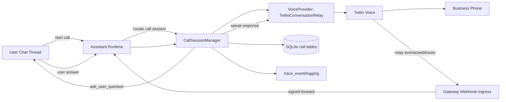
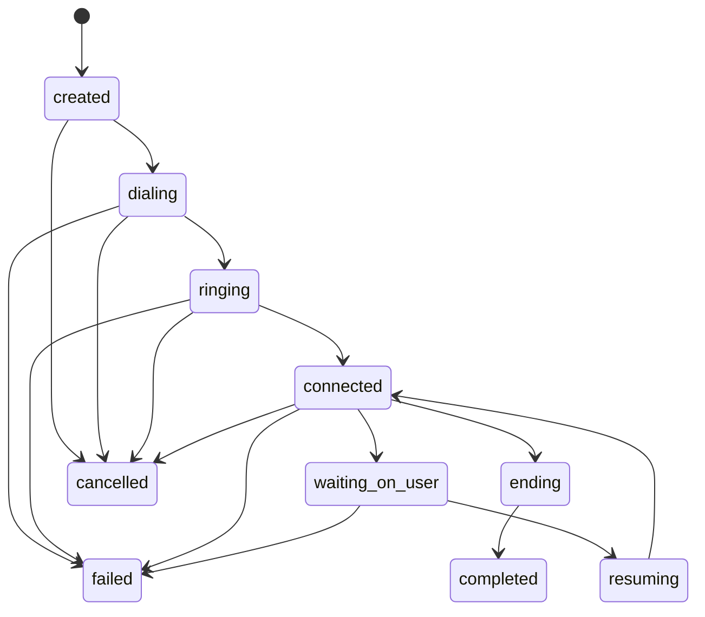

# Outgoing AI Phone Calls: Detailed Implementation Handoff Plan

Status: Draft for implementation handoff
Primary owner: Codex implementation agent
Last updated: 2026-02-19

---

## 1. Executive Summary

Build a reusable `CallSession` platform primitive that lets the assistant place and manage outbound phone calls (not tied to the user's personal phone number), conduct open-ended conversations with businesses, and pause mid-call to ask the user for clarification in-thread before resuming the live call.

The target MVP provider is Twilio Voice + ConversationRelay. The runtime remains the orchestration brain. The design must be generic enough to support additional voice providers later.

This is an LLM-first orchestration feature:
- No hardcoded dialogue trees.
- The model chooses next turn actions within a constrained action schema.
- Runtime enforces policy, safety, timeout, and state invariants.

---

## 2. Problem Statement

Current assistant capabilities support text channels and tool-driven actions, but cannot:
1. Initiate and manage live PSTN calls.
2. Hold an active call while requesting user input in chat.
3. Resume the call with user-provided answers naturally.

Need to support workflows like:
- User: "Call X restaurant and book for 7:30."
- Restaurant: "We only have 8:00."
- Assistant (in chat thread): "8:00 is available, should I confirm?"
- User: "Yes."
- Assistant (to restaurant on live call): "8:00 works, let's do that."

---

## 3. Goals and Non-Goals

### 3.1 Goals

1. Place outbound calls through a provider-owned number.
2. Conduct dynamic, model-driven conversations with callees.
3. Support live user consultation while the call remains active.
4. Persist all call session state for recovery, audit, and debugging.
5. Reuse existing runtime patterns (queue/handoff, long-running notifier style, run lifecycle, channel ingress).
6. Keep architecture provider-agnostic via a `VoiceProvider` abstraction.

### 3.2 Non-Goals (MVP)

1. Inbound call handling.
2. Multi-party conferencing between user and callee.
3. Voice cloning / custom synthetic voices beyond provider defaults.
4. Full legal policy automation for all jurisdictions (provide policy hooks and sane defaults).
5. Replacing existing run/permission systems.

---

## 4. User Experience Requirements

### 4.1 Primary Flow

1. User asks assistant to call a business and complete a task.
2. Assistant initiates call and starts conversation.
3. If the callee asks for a decision not pre-authorized, assistant asks user in the same conversation thread.
4. User responds.
5. Assistant relays answer and continues call.
6. Assistant posts call summary and outcome at end.

### 4.2 UX Constraints

1. Assistant messages in thread must clearly mark pending call decisions.
2. If user does not answer in time, assistant should recover gracefully (ask callee to hold once, then fallback to callback/reschedule).
3. Final summary should include:
- Result (booked, unavailable, failed)
- Any confirmed details (time, party size, name)
- Follow-up actions (if needed)

---

## 5. Existing Capabilities to Reuse

Do not rebuild these; extend and adapt them:

1. Message queue and handoff behavior
- `/Users/noaflaherty/Repos/vellum-ai/vellum-assistant/assistant/src/daemon/session-queue-manager.ts`
- `/Users/noaflaherty/Repos/vellum-ai/vellum-assistant/assistant/src/daemon/session.ts`

2. Long-running notifier/session registry pattern
- `/Users/noaflaherty/Repos/vellum-ai/vellum-assistant/assistant/src/tools/watch/watch-state.ts`
- `/Users/noaflaherty/Repos/vellum-ai/vellum-assistant/assistant/src/daemon/session.ts`

3. Pause/resume lifecycle with persistent intermediate state
- `/Users/noaflaherty/Repos/vellum-ai/vellum-assistant/assistant/src/runtime/run-orchestrator.ts`
- `/Users/noaflaherty/Repos/vellum-ai/vellum-assistant/assistant/src/memory/runs-store.ts`

4. Channel ingress + dedupe + transport metadata
- `/Users/noaflaherty/Repos/vellum-ai/vellum-assistant/assistant/src/runtime/routes/channel-routes.ts`
- `/Users/noaflaherty/Repos/vellum-ai/vellum-assistant/assistant/src/runtime/http-server.ts`

5. Provider abstraction style
- `/Users/noaflaherty/Repos/vellum-ai/vellum-assistant/assistant/src/messaging/provider.ts`
- `/Users/noaflaherty/Repos/vellum-ai/vellum-assistant/assistant/src/messaging/registry.ts`

6. Gateway webhook ownership and runtime forwarding
- `/Users/noaflaherty/Repos/vellum-ai/vellum-assistant/gateway/src/index.ts`
- `/Users/noaflaherty/Repos/vellum-ai/vellum-assistant/gateway/src/runtime/client.ts`

---

## 6. Architecture Overview



Design decisions:
1. Keep telephony transport details in provider adapter.
2. Keep dialogue control and decision policy in runtime call orchestrator.
3. Keep gateway as public webhook ingress boundary.
4. Persist session state so daemon restarts can recover in-flight calls.

---

## 7. New Capability Surface

### 7.1 New Runtime Domain: `calls/`

Add a dedicated call domain (not tool-first) under runtime services.

Suggested files:
- `assistant/src/calls/types.ts`
- `assistant/src/calls/state-machine.ts`
- `assistant/src/calls/session-manager.ts`
- `assistant/src/calls/store.ts`
- `assistant/src/calls/orchestrator.ts`
- `assistant/src/calls/providers/voice-provider.ts`
- `assistant/src/calls/providers/twilio-conversation-relay.ts`
- `assistant/src/calls/policy.ts`
- `assistant/src/calls/signature.ts`

### 7.2 New Runtime Routes: `routes/call-routes.ts`

Hook into dispatcher in:
- `assistant/src/runtime/http-server.ts`

Use new-style routes first (`/v1/...`) and support legacy assistant-scoped aliases only if necessary.

### 7.3 New Gateway Routes

Suggested files:
- `gateway/src/http/routes/twilio-voice-webhook.ts`
- `gateway/src/http/routes/twilio-status-webhook.ts`
- `gateway/src/http/routes/twilio-relay-websocket.ts` (or equivalent relay event ingestion endpoint)

Add runtime forwarding functions in:
- `gateway/src/runtime/client.ts`

---

## 8. Data Model and Persistence

Add tables to `assistant/src/memory/schema.ts` and migration SQL.

### 8.1 `call_sessions`

Purpose: canonical state for each live/outbound call.

Columns:
1. `id` TEXT PK
2. `assistant_id` TEXT NOT NULL
3. `conversation_id` TEXT NOT NULL FK -> `conversations.id`
4. `provider` TEXT NOT NULL (e.g. `twilio_conversation_relay`)
5. `provider_call_sid` TEXT
6. `from_number` TEXT
7. `to_number` TEXT NOT NULL
8. `status` TEXT NOT NULL
9. `task_summary` TEXT
10. `waiting_reason` TEXT
11. `started_at` INTEGER
12. `ended_at` INTEGER
13. `last_error` TEXT
14. `created_at` INTEGER NOT NULL
15. `updated_at` INTEGER NOT NULL

Indexes:
1. `(provider, provider_call_sid)` unique where `provider_call_sid is not null`
2. `(conversation_id, created_at desc)`
3. `(status, updated_at)`

### 8.2 `call_events`

Purpose: append-only event journal for replay/debug.

Columns:
1. `id` TEXT PK
2. `call_session_id` TEXT NOT NULL FK -> `call_sessions.id` cascade
3. `event_type` TEXT NOT NULL
4. `source` TEXT NOT NULL (`runtime`, `provider_webhook`, `gateway`, `model`)
5. `payload_json` TEXT NOT NULL
6. `created_at` INTEGER NOT NULL

Indexes:
1. `(call_session_id, created_at)`
2. `(event_type, created_at)`

### 8.3 `call_pending_questions`

Purpose: user-in-the-loop pause points.

Columns:
1. `id` TEXT PK
2. `call_session_id` TEXT NOT NULL FK -> `call_sessions.id` cascade
3. `question_text` TEXT NOT NULL
4. `status` TEXT NOT NULL (`pending`, `answered`, `expired`, `cancelled`)
5. `asked_message_id` TEXT (assistant message id in thread)
6. `answered_message_id` TEXT (user message id in thread)
7. `answer_text` TEXT
8. `asked_at` INTEGER NOT NULL
9. `answered_at` INTEGER
10. `expires_at` INTEGER
11. `created_at` INTEGER NOT NULL
12. `updated_at` INTEGER NOT NULL

Indexes:
1. `(call_session_id, status)`
2. `(status, expires_at)`

### 8.4 Store Layer

Create `assistant/src/calls/store.ts` with strongly typed operations:
1. `createCallSession`
2. `updateCallStatus`
3. `appendCallEvent`
4. `createPendingQuestion`
5. `resolvePendingQuestion`
6. `getActiveCallByConversationId`
7. `getCallByProviderSid`
8. `listRecoverableCalls`
9. `expirePendingQuestions`

---

## 9. Call Session State Machine

State enum (initial):
1. `created`
2. `dialing`
3. `ringing`
4. `connected`
5. `waiting_on_user`
6. `resuming`
7. `ending`
8. `completed`
9. `failed`
10. `cancelled`



Rules:
1. Only one active call session per conversation by default.
2. `waiting_on_user` requires exactly one `pending` question record.
3. Terminal states (`completed`, `failed`, `cancelled`) are immutable except metadata updates.
4. Every transition appends `call_events` row.

---

## 10. Runtime API Contract

Prefer new route shape (`/v1/...`) since assistant-scoped shape is deprecated in runtime.

### 10.1 Start call

`POST /v1/calls/start`

Request:
```json
{
  "assistantId": "local-assistant",
  "conversationKey": "default:chat",
  "to": "+14155551212",
  "task": "Book dinner for 2 tonight around 7:30 under Noa",
  "context": {
    "userName": "Noa",
    "timezone": "America/Los_Angeles"
  }
}
```

Response:
```json
{
  "callSessionId": "...",
  "status": "dialing",
  "provider": "twilio_conversation_relay"
}
```

### 10.2 Receive provider relay events

`POST /v1/calls/provider-events`

Used by gateway to forward signed provider events after validation.

### 10.3 Call status callback

`POST /v1/calls/status`

Normalize provider statuses into runtime state machine transitions.

### 10.4 Answer pending question (internal path)

This should usually happen automatically when user replies in-thread.
Optional explicit endpoint for robustness:

`POST /v1/calls/:callSessionId/answer`

### 10.5 Get call status

`GET /v1/calls/:callSessionId`

Returns call session, pending question state, and recent event excerpts.

### 10.6 Cancel call

`POST /v1/calls/:callSessionId/cancel`

---

## 11. Gateway Public Ingress and Security

Gateway is internet-facing. Runtime should remain private behind gateway where possible.

### 11.1 Endpoints in gateway

1. `POST /webhooks/twilio/voice`
2. `POST /webhooks/twilio/status`
3. Relay event ingress (HTTP or WS adapter endpoint depending on provider mode)

### 11.2 Security requirements

1. Validate `X-Twilio-Signature` on every Twilio callback.
2. Enforce payload size limits.
3. Reject unsigned/invalid requests with `401`.
4. Forward only normalized payloads to runtime.
5. Use runtime bearer token between gateway and runtime.

### 11.3 Forwarding contract

Add typed forwarding functions in `gateway/src/runtime/client.ts`:
1. `forwardCallStart`
2. `forwardCallProviderEvent`
3. `forwardCallStatus`

---

## 12. Voice Provider Abstraction

Create provider interface modeled on messaging provider pattern.

```ts
export interface VoiceProvider {
  id: string;
  displayName: string;

  startOutboundCall(input: StartCallInput): Promise<StartCallResult>;
  endCall(input: EndCallInput): Promise<void>;
  sendAssistantUtterance(input: SpeakInput): Promise<void>;

  // Normalize provider-specific callbacks into internal events.
  normalizeWebhookEvent(payload: unknown): VoiceWebhookEvent | null;
}
```

Twilio adapter responsibilities:
1. Start outbound call via Twilio API.
2. Provide TwiML/bootstrap for ConversationRelay.
3. Convert provider event payloads into internal event shapes.
4. Surface provider IDs (`CallSid`) for correlation.

---

## 13. LLM Orchestration Design

### 13.1 Action schema (strict)

Each turn, orchestrator asks model for one action:
1. `speak_text`
2. `ask_user_question`
3. `wait_for_user_answer`
4. `end_call`
5. `retry_or_rephrase`

Example output contract:
```json
{
  "action": "ask_user_question",
  "question": "They can do 8:00 PM instead of 7:30 PM. Should I confirm 8:00 PM?",
  "reason": "Time negotiation requires explicit user preference"
}
```

### 13.2 Prompt context for call turns

Include:
1. Current call status.
2. Latest callee utterance transcript.
3. Pending user question state (if any).
4. Task objective and constraints.
5. Policy constraints (disclosure, disallowed tasks, timeout budget).

### 13.3 Guardrails enforced in code

1. Maximum call duration (default 12 min).
2. Maximum waiting-on-user timeout (default 90 sec).
3. Maximum repeated retries/rephrases.
4. Hard deny categories (emergency services, high-risk legal/medical instructions).
5. Enforce disclosure at call start when policy requires.

---

## 14. User Consultation Bridge

### 14.1 Trigger

When model emits `ask_user_question`:
1. Persist `call_pending_questions` row with `pending`.
2. Post assistant question into conversation thread.
3. Transition call session to `waiting_on_user`.
4. Append `call_waiting_on_user` event.

### 14.2 Resume

On next user message in same conversation:
1. If an active call has a pending question, bind this reply to latest pending question.
2. Mark question `answered`.
3. Inject answer into call orchestration context.
4. Transition `resuming` -> `connected`.
5. Send answer to callee via provider.

### 14.3 Timeout behavior

If no answer by `expires_at`:
1. Mark question `expired`.
2. Ask model for graceful fallback.
3. Preferred default fallback:
- Ask callee to hold once.
- If still no answer, offer callback/reschedule.

### 14.4 Concurrency and correctness rules

1. One pending question per call at a time.
2. Ignore unrelated user messages only if they clearly do not answer; otherwise treat as answer text verbatim.
3. If call has ended before user responds, post a thread message indicating call already ended and ask whether to retry.

---

## 15. Runtime Integration Points

### 15.1 Session notifiers

Mirror watch notifier approach for call updates:
- register/unregister start/update/completion callbacks keyed by conversation/session id.

### 15.2 Queue interaction

Call-related system messages that enter the conversation should respect existing queue semantics.
Do not bypass session queue invariants.

### 15.3 Channel capabilities

Calls can be initiated from any channel, but user consultation must route through the originating conversation channel.
Respect transport metadata conventions already used in channel routes.

---

## 16. Configuration and Feature Flags

Add config keys (with defaults):

```json
{
  "calls": {
    "enabled": false,
    "provider": "twilio_conversation_relay",
    "maxDurationSeconds": 720,
    "userConsultTimeoutSeconds": 90,
    "disclosure": {
      "enabled": true,
      "text": "Hi, this is an AI assistant calling on behalf of ..."
    },
    "recording": {
      "enabled": false,
      "requireConsent": true
    },
    "safety": {
      "denyCategories": ["emergency_services", "high_risk_medical", "high_risk_legal"]
    }
  }
}
```

Twilio credentials in secure storage:
1. `credential:integration:twilio:account_sid`
2. `credential:integration:twilio:auth_token`
3. `credential:integration:twilio:phone_number`

---

## 17. Observability

### 17.1 Trace events

Extend trace event kinds to include:
1. `call_started`
2. `call_connected`
3. `call_user_turn`
4. `call_assistant_turn`
5. `call_waiting_on_user`
6. `call_resumed`
7. `call_ended`
8. `call_failed`

### 17.2 Structured logs

Every call log entry should include:
1. `callSessionId`
2. `provider`
3. `providerCallSid`
4. `conversationId`
5. `state`

### 17.3 Durable event journal

Append normalized payload snapshots to `call_events` for debugging and replay.

---

## 18. Safety and Compliance

Minimum policy gates:
1. AI disclosure at call start (configurable).
2. Recording default off.
3. Jurisdiction hook for consent requirements.
4. Hard deny list for disallowed call types.
5. Budget caps: max duration + max retries.

Secrets:
1. Twilio secrets must never enter model context.
2. Use existing secure key + metadata infrastructure.

---

## 19. Reliability and Recovery

### 19.1 Idempotency

1. Dedupe webhook/provider events by provider event id + call sid + timestamp hash.
2. State transitions must be idempotent.

### 19.2 Retry policy

1. Retry transient provider API failures with exponential backoff.
2. Do not retry 4xx auth/validation failures blindly.

### 19.3 Restart recovery

On daemon startup:
1. Find non-terminal call sessions.
2. Reconcile with provider status if possible.
3. Mark stale sessions as failed with explanatory error when unrecoverable.

### 19.4 Dead-letter handling

Persist malformed or unprocessable provider events in a dead-letter store path for investigation.

---

## 20. Testing Strategy

### 20.1 Unit tests

1. `state-machine.test.ts`
- valid transitions
- invalid transition rejection
- terminal state behavior

2. `store.test.ts`
- CRUD for sessions/events/questions
- index/query behavior

3. `orchestrator.test.ts`
- action schema parsing
- ask-user flow
- timeout flow

4. `signature.test.ts`
- Twilio signature pass/fail cases

### 20.2 Integration tests (runtime + mocked provider)

1. Happy path reservation call.
2. Mid-call question flow (`7:30 unavailable, 8:00?`).
3. No-user-response timeout branch.
4. Provider disconnect and reconnect.
5. Duplicate webhook replay idempotency.

### 20.3 Gateway integration tests

1. Webhook signature required.
2. Invalid signature rejected.
3. Forwarding contract to runtime correct.
4. Runtime failure propagation behavior.

### 20.4 Regression tests

1. Existing message queue behavior unchanged.
2. Existing Telegram channel routes unaffected.
3. Existing run orchestrator/permission flow unaffected.

---

## 21. Implementation Plan by PR Slice

Use small, reviewable PRs. Suggested sequence:

### PR 1: Schema + Store + Types

Scope:
1. Add new DB tables and migrations.
2. Add typed store API.
3. Add basic call types + state enum.

Acceptance:
1. Migrations apply cleanly.
2. Unit tests for store/state pass.

### PR 2: Runtime route scaffolding

Scope:
1. Add `call-routes.ts` and route wiring in runtime dispatcher.
2. Add start/get/cancel endpoint skeletons.
3. Add feature flag gating.

Acceptance:
1. Endpoints return expected schema with mocked manager.

### PR 3: Provider abstraction + Twilio adapter

Scope:
1. Implement `VoiceProvider` interface.
2. Implement Twilio start/end + normalization methods.
3. Add secure credential lookup.

Acceptance:
1. Adapter unit tests pass with mocked HTTP.

### PR 4: CallSessionManager + orchestrator loop

Scope:
1. Implement lifecycle transitions and event append.
2. Implement LLM action loop (`speak`, `ask_user`, `wait`, `end`, `retry`).
3. Emit initial trace/log events.

Acceptance:
1. End-to-end mocked call flow works without user consultation.

### PR 5: User consultation bridge

Scope:
1. Pending question creation/resolution.
2. Thread message posting for clarifications.
3. Resume-on-user-reply behavior and timeout path.

Acceptance:
1. Reservation negotiation scenario passes integration test.

### PR 6: Gateway webhook ingress + signature validation

Scope:
1. Add Twilio webhook routes to gateway.
2. Verify signatures.
3. Forward normalized events to runtime.

Acceptance:
1. Signed payloads accepted, unsigned rejected.

### PR 7: Hardening + observability + docs

Scope:
1. Retry/idempotency/dead-letter improvements.
2. Full trace event coverage.
3. Update `ARCHITECTURE.md` with new diagrams and flows.
4. Update `README.md` only if user-facing command surface changed.

Acceptance:
1. Full test suite for new module passes.
2. Architecture docs reflect final implementation.

---

## 22. File-Level Worklist (Expected Touch Points)

### Assistant runtime

1. `assistant/src/memory/schema.ts`
2. `assistant/drizzle/*` (new migration)
3. `assistant/src/runtime/http-server.ts`
4. `assistant/src/runtime/routes/call-routes.ts` (new)
5. `assistant/src/calls/*` (new domain)
6. `assistant/src/daemon/ipc-contract.ts` (trace kind expansion if needed)
7. `assistant/src/config/schema.ts` and `assistant/src/config/defaults.ts` (calls config)
8. `assistant/src/__tests__/*` (new tests)

### Gateway

1. `gateway/src/index.ts`
2. `gateway/src/http/routes/twilio-*.ts` (new)
3. `gateway/src/runtime/client.ts`
4. `gateway/src/__tests__/*`

### Docs

1. `ARCHITECTURE.md` (required when architecture changes)
2. `README.md` (if user-facing behavior changes)

---

## 23. Implementation Constraints and Repo Rules

1. Discovery first: confirm no existing telephony implementation before coding.
2. Avoid adding new tool registrations using `class ___Tool implements Tool` for this feature.
3. Prefer runtime domain + provider + skill-driven invocation paths.
4. Keep capability general-purpose and reusable.
5. Do not hardcode restaurant-specific behavior.

---

## 24. Definition of Done

1. Assistant can place outbound calls and conduct open-ended dialogue.
2. Mid-call user consultation works in-thread while call remains active.
3. User answers are relayed to callee and call continues naturally.
4. Persistent state survives runtime restarts with recoverable behavior.
5. Security controls enforced (signature checks, secret handling, policy gates).
6. Integration tests cover core and failure paths.
7. Architecture documentation updated and accurate.

---

## 25. Open Questions (Resolve Before Final Rollout)

1. Should call initiation be available to all channels or only selected channels initially?
2. Exact disclosure text and localization requirements?
3. Which jurisdictions require mandatory recording consent handling at MVP?
4. Should unresolved user consultations auto-trigger callback scheduling?
5. What product-level limits are needed (daily call cap, max concurrent calls per assistant)?

---

## 26. Default Decisions (To Avoid Blocking)

1. Max call duration: 12 minutes.
2. User consultation timeout: 90 seconds.
3. Recording: off by default.
4. Disclosure: on by default.
5. On timeout: hold once, then fallback to callback/reschedule.
6. One active call per conversation.

---

## 27. Codex Execution Checklist

1. Implement PR slices in order.
2. Keep each PR independently testable.
3. Add/adjust tests in same PR as behavior changes.
4. Maintain idempotency in provider event handling.
5. Verify no regression in existing runtime routes/channels.
6. Update `ARCHITECTURE.md` before completion.

