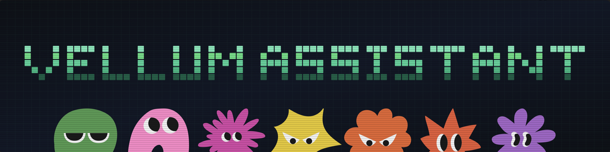

<p align="center">
  
</p>

<p align="center">
  <a href="https://vellum.ai/docs"></a>
  <a href="https://vellum.ai/community"></a>
  <a href="https://github.com/vellum-ai/vellum-assistant/blob/main/LICENSE"></a>
  <a href="https://vellum.ai"></a>
</p>

<p align="center"><b>A personal AI assistant that evolves with you.</b><br>
It learns how you work, remembers what matters, and acts before you ask. Yours to name, shape, and extend.</p>

---

## Get started

**1. [Download the latest release](https://vellum.ai/download)**

**2. Open the app and pick your mode**
  - **Local** — everything runs on your machine
  - **Managed** — sign in via Vellum Cloud, no local runtime required

**3. Hatch your assistant**
  - Give it a name, a personality, and the keys to your work

<sub>Prefer the terminal? See <a href="#cli">CLI install</a> below.</sub>

---

## What it does

<table>
<tr>
<td width="50%" valign="top">

**Remembers what matters**

Long-term memory with source attribution, per-channel isolation, and its own sense of what's worth keeping.

</td>
<td width="50%" valign="top">

**Acts before you ask**

Checks in with itself every hour, notices what's unfinished, and reaches out on the right channel without interrupting.

</td>
</tr>
<tr>
<td width="50%" valign="top">

**Yours to shape**

Name, personality, and skills live in plain files. Bundle your own skills or install from the catalog.

</td>
<td width="50%" valign="top">

**Same assistant everywhere**

Talk to it from the macOS app, Telegram, or Slack. Shared memory and identity across all of them.

</td>
</tr>
</table>

<p align="center">
  
  &nbsp;
  
</p>

---

## Quick demo

https://github.com/user-attachments/assets/009bd0ae-95ac-4cf3-81bc-d54cd8631583

---

## CLI

<details open>
<summary>Install and common commands</summary>

<br>

The CLI works but the desktop app is our primary focus. Available for advanced users, contributors, and non-macOS environments.

**Install**

```bash
bun install -g vellum
vellum hatch
```

**Install from source**

```bash
git clone https://github.com/vellum-ai/vellum-assistant.git
cd vellum-assistant
./setup.sh
vellum hatch
```

**Common commands**

```bash
vellum wake        # start services
vellum sleep       # stop services, keep data
vellum client      # interact through the terminal
vellum ps          # view running assistants
vellum upgrade     # upgrade to latest version
```

All commands target the default assistant. If you have multiple, pass the assistant ID as the second argument.

</details>

---

## Documentation

| Section | What's covered |
|---------|---------------|
| [Architecture](https://vellum.ai/docs/developer-guide/architecture) | Platform domains, repo structure, runtime · clients · gateway |
| [Security & Permissions](https://vellum.ai/docs/developer-guide/security) | Sandbox, credentials, trust rules, permission modes |
| [Features & Capabilities](https://vellum.ai/docs/developer-guide/features) | Integrations, dynamic skills, browser, attachments, media embeds |
| [API & Communication](https://vellum.ai/docs/developer-guide/api) | SSE event stream, event payloads, remote access |
| [Development Workflow](https://vellum.ai/docs/developer-guide/development-workflow) | Claude Code commands, parallel PRs, review loops, release pipeline |

📖 **[Full documentation →](https://vellum.ai/docs)**

---

## Contributing

We welcome contributions from everyone.

- **Development**: The [contributing guide](CONTRIBUTING.md) will help you get started.
- Make sure to check out our [Code of Conduct](CODE_OF_CONDUCT.md).

## Community

- 💬 [Discord](https://vellum.ai/community)
- 🐛 [Issues](https://github.com/vellum-ai/vellum-assistant/issues)

## License

MIT — see [License](https://github.com/vellum-ai/vellum-assistant?tab=MIT-1-ov-file). Integration logos from [Simple Icons](https://github.com/simple-icons/simple-icons), licensed [CC0 1.0](https://creativecommons.org/publicdomain/zero/1.0/).

Vellum Assistant is open-source software built by [Vellum AI](https://vellum.ai), a for-profit company. We also offer a managed product, the [Vellum Platform](https://vellum.ai/platform), which sustains the business. Free to use and modify under MIT, and we're committed to keeping it that way.

---

<p align="center">Built with 💚 by <a href="https://vellum.ai">Vellum</a></p>
