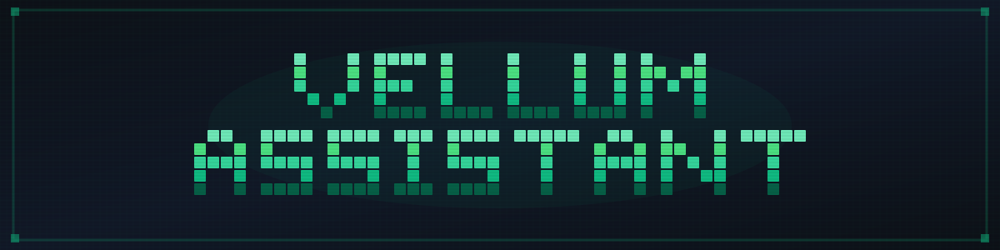

<p align="center">
  
</p>

<p align="center">
  <a href="https://vellum.ai/docs"></a>
  <a href="https://vellum.ai/community"></a>
  <a href="https://github.com/vellum-ai/vellum-assistant/blob/main/LICENSE"></a>
  <a href="https://vellum.ai"></a>
</p>

<p align="center"><b>An AI assistant that lives on your machine.</b><br>Native macOS & iOS apps, a Bun + TypeScript runtime, and a multi-channel gateway — so your assistant can manage your tools, automate your workflows, and talk to you from anywhere.</p>

---

## Highlights

<table>
<tr><td>🖥️ <b>Native Clients</b></td><td>macOS menu bar app with computer-use (accessibility + CGEvent) and iOS chat client. ~50% shared code via Swift Package. Standalone or connected-to-Mac.</td></tr>
<tr><td>🔧 <b>Extensible Skills</b></td><td>40+ bundled skills. The assistant can author, test, and persist new skills at runtime. Version-bound approvals and mutation protection.</td></tr>
<tr><td>💬 <b>Multi-Channel</b></td><td>Desktop, Telegram, Slack, Gmail, SMS, phone calls — one gateway, one conversation. OAuth2 integrations and unified messaging.</td></tr>
<tr><td>🔒 <b>Security-First</b></td><td>OS-level sandboxing (sandbox-exec / bwrap). Keychain-backed credential vault. Secret ingress blocking. Scoped trust rules.</td></tr>
<tr><td>🌐 <b>Browser & Computer Use</b></td><td>Headless browser automation (navigate, click, type, screenshot, extract). macOS computer-use via accessibility APIs. Credential-aware form filling.</td></tr>
<tr><td>📡 <b>Real-Time Streaming</b></td><td>SSE event stream with JWT auth. Streaming deltas for text, thinking, tool use, and attachments. Up to 100 concurrent connections.</td></tr>
<tr><td>🚀 <b>Agent-Driven Dev</b></td><td>Claude Code slash commands for parallel PRs, automated review loops, swarm workflows, and one-shot feature delivery (<code>/blitz</code>).</td></tr>
</table>

---

## Get Started

### Install

```bash
git clone https://github.com/vellum-ai/vellum-assistant.git
cd vellum-assistant
./setup.sh              # installs deps, links packages, registers the global `vellum` CLI
vellum hatch            # first-time assistant setup
vellum wake             # start assistant + gateway
```

> **Prerequisites:** [Bun](https://bun.sh) is the only requirement. The setup script handles everything else — package dependencies, git hooks, local package linking, and the global `vellum` command.

### Vellum CLI

```bash
vellum hatch       # first-time assistant setup
vellum wake        # start assistant + gateway
vellum retire      # shut down an assistant instance
vellum sleep       # stop everything
vellum upgrade     # upgrade to the latest version
```

> **Managed mode:** The macOS app also supports signing in via the Vellum platform and connecting to a hosted assistant — no local runtime required.

---

## Documentation

| Section | What's Covered |
|---------|---------------|
| [Architecture](https://vellum.ai/docs/developer-guide/architecture) | Platform domains, repo structure, runtime · clients · gateway |
| [Security & Permissions](https://vellum.ai/docs/developer-guide/security) | Sandbox, credentials, trust rules, permission modes |
| [Features & Capabilities](https://vellum.ai/docs/developer-guide/features) | Integrations, dynamic skills, browser, attachments, media embeds |
| [API & Communication](https://vellum.ai/docs/developer-guide/api) | SSE event stream, event payloads, remote access |
| [Development Workflow](https://vellum.ai/docs/developer-guide/development-workflow) | Claude Code commands, parallel PRs, review loops, release pipeline |

📖 **[Full documentation →](https://vellum.ai/docs)**

---

## Contributing

We are not currently accepting external contributions. See the [Contributing](https://github.com/vellum-ai/vellum-assistant?tab=contributing-ov-file) tab for updates.

---

## Community

- 💬 [Discord](https://vellum.ai/community)
- 🐛 [Issues](https://github.com/vellum-ai/vellum-assistant/issues)

---

## License

MIT — see [License](https://github.com/vellum-ai/vellum-assistant?tab=MIT-1-ov-file).

Vellum Assistant is open-source software built by [Vellum AI](https://vellum.ai), a for-profit company. We also offer a managed product — the [Vellum Platform](https://vellum.ai/platform) — which sustains the business. This project is free to use, modify, and contribute to under the MIT license, and we're committed to keeping it that way.

---

<p align="center">Built with 💚 by <a href="https://vellum.ai">Vellum</a></p>
