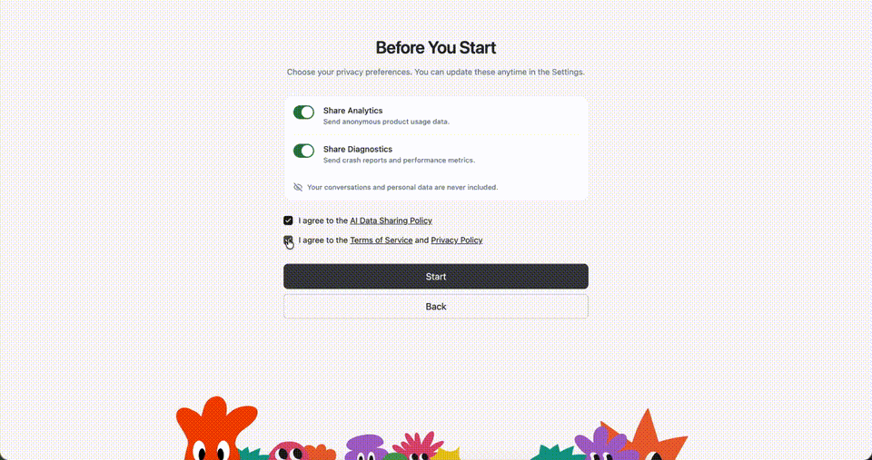

<p align="center">
  
</p>

<p align="center">
  <a href="https://vellum.ai/docs"></a>
  <a href="https://vellum.ai/community"></a>
  <a href="https://github.com/vellum-ai/vellum-assistant/blob/main/LICENSE"></a>
  <a href="https://vellum.ai"></a>
</p>

<p align="center"><b>A personal AI assistant that evolves with you.</b><br>
8 different types of memory (episodic, semantic, procedural, emotional, prospective, behavioral, narrative, shared) make it truly yours. It learns how you work, remembers what matters, and takes action across your apps.</p>

---

## What it does

If you've set up a Personal AI on OpenClaw, Hermes Agent, or Claude Code, you know how long it takes, and how many times you have to hatch a new one to get it right. Vellum gets you the result you're looking for out of the box, one download away.
| Area                          | Summary |
| ----------------------------- | --- |
| **Memory**                    | Eight types (episodic, semantic, procedural, emotional, prospective, behavioral, narrative, shared), each with its own staleness window, hybrid dense + sparse retrieval, and per-user and per-channel isolation. Structured items (identity, preferences, projects, events) extracted from conversations with source attribution and dedup. Embeddings run locally by default. Not a SQLite + markdown file you maintain yourself. |
| **Identity**                  | Behavior lives in SOUL.md. During onboarding the assistant observes how you communicate and writes its own personality files. It keeps a per-user journal of reflections and uses NOW.md as a scratchpad for current focus and active threads. |
| **Proactivity**               | Every hour the assistant re-reads its notes, looks for anything unfinished or due soon, and messages you if something needs attention. Notifications go to the right channel and won't interrupt an active conversation. |
| **Security**                  | Actor identity (guardian, trusted, unknown) is resolved once and enforced everywhere; unknown actors can't read memory, trigger tools, or escalate. Credentials live in a separate process and never reach the model. Every tool call runs in a sandbox. The default is to deny. |
| **Channels**           | macOS, iOS, Web, Voice, Email, Telegram, Slack, Twilio. One assistant, one memory, every channel. |
| **OAuth**             | Slack, Notion, Google, HubSpot, Linear, Discord, Twitter, Telegram, Twilio. No hand-rolled token refresh. |
| **Hosting**      | Managed runtime on Vellum Platform, or self-hosted. Same codebase, same data model. |

---

## Get started

**1. [Sign up](https://vellum.ai/signup) or [download the app](https://vellum.ai/download)**

**2. Pick your mode**

- **Managed**: sign in via Vellum Cloud, no local runtime required
- **Local**: everything runs on your machine

**3. Hatch your assistant**

- It's yours! Have fun with it.

<sub>Prefer the terminal? See <a href="#cli">CLI install</a> below.</sub>

---

## Quick demo

<p align="center">
  
</p>

---

## CLI

<details open>
<summary>Install and common commands</summary>

<br>

The CLI works but the desktop app is our primary focus. Available for advanced users, contributors, and non-macOS environments.

**Install**

```bash
bun install -g vellum
vellum hatch
```

**Install from source**

```bash
git clone https://github.com/vellum-ai/vellum-assistant.git
cd vellum-assistant
./setup.sh
source ~/.bashrc
vellum hatch
```

**Common commands**

```bash
vellum wake        # start services
vellum sleep       # stop services, keep data
vellum client      # interact through the terminal
vellum ps          # view running assistants
vellum terminal    # open a shell into a managed assistant container
vellum upgrade     # upgrade to latest version
```

All commands target the default assistant. If you have multiple, pass the assistant ID as the second argument.

</details>

---

## Infra and security

| Area                       | Summary                                                                                                                                                                                                                                                                                                                  |
| -------------------------- | ------------------------------------------------------------------------------------------------------------------------------------------------------------------------------------------------------------------------------------------------------------------------------------------------------------------------ |
| **Computer use**           | The assistant works in its own sandbox, and with your approval reaches your actual machine: reads and edits files, runs commands, drives the browser. Every action is permission-gated, and you can grant once, for ten minutes, or always. |
| **Skills**                 | Plugins defined by a SKILL.md and a TOOLS.json that add tools and prompt sections at runtime, sandboxed like everything else. Install them from the catalog, bundle them, or drop them in the workspace.                                                                                      |
| **Channels**               | One assistant with one memory, reachable from the macOS app, Telegram, or Slack. Start a thought in one channel and pick it up in another.                                                                                                                                                              |
| **Multi-provider support** | Works with Anthropic, OpenAI, Google Gemini, Fireworks, OpenRouter, MiniMax, and any OpenAI-compatible endpoint. Local models run through Ollama. Embeddings run on local ONNX by default and fall back to cloud providers automatically.                                                                                    |

---

## Foundational documents

The canonical sources for who we are and how we talk about what we're building. The docs site at [vellum.ai/docs](https://vellum.ai/docs) is a rendered view of these files.

| Doc                             | What it is                                                       |
| ------------------------------- | ---------------------------------------------------------------- |
| [Constitution](CONSTITUTION.md) | Who we are, what we believe, and what we refuse to compromise on |
| [Glossary](GLOSSARY.md)         | The shared vocabulary we use to talk about personal intelligence |

---

## Documentation

| Section                                                                             | What's covered                                                     |
| ----------------------------------------------------------------------------------- | ------------------------------------------------------------------ |
| [Architecture](https://vellum.ai/docs/developer-guide/architecture)                 | Platform domains, repo structure, runtime · clients · gateway      |
| [Security & Permissions](https://vellum.ai/docs/developer-guide/security)           | Sandbox, credentials, trust rules, permission modes                |
| [Features & Capabilities](https://vellum.ai/docs/developer-guide/features)          | Integrations, dynamic skills, browser, attachments, media embeds   |
| [API & Communication](https://vellum.ai/docs/developer-guide/api)                   | SSE event stream, event payloads, remote access                    |
| [Development Workflow](https://vellum.ai/docs/developer-guide/development-workflow) | Claude Code commands, parallel PRs, review loops, release pipeline |

📖 **[Full documentation →](https://vellum.ai/docs)**

---

## Contributing

We welcome contributions from everyone.

- **Development**: The [contributing guide](CONTRIBUTING.md) will help you get started.
- Make sure to check out our [Code of Conduct](CODE_OF_CONDUCT.md).

## Community

- 💬 [Discord](https://vellum.ai/community)
- 🐛 [Issues](https://github.com/vellum-ai/vellum-assistant/issues)

## License

MIT. See [License](https://github.com/vellum-ai/vellum-assistant?tab=MIT-1-ov-file). Integration logos from [Simple Icons](https://github.com/simple-icons/simple-icons), licensed [CC0 1.0](https://creativecommons.org/publicdomain/zero/1.0/).

Vellum Assistant is open-source software built by [Vellum AI](https://vellum.ai), a for-profit company. We also offer a managed product, the [Vellum Platform](https://vellum.ai/platform), which sustains the business. Free to use and modify under MIT, and we're committed to keeping it that way.

---

<p align="center">Built with 💚 by <a href="https://vellum.ai">Vellum</a></p>
