# Assistant Architecture

This document owns assistant-runtime architecture details. The repo-level architecture index lives in [`/ARCHITECTURE.md`](../ARCHITECTURE.md).

### Channel Onboarding Playbook Bootstrap

- Transport metadata arrives via `session_create.transport` (IPC) or `/channels/inbound` (`channelId`, optional `hints`, optional `uxBrief`).
- Telegram webhook ingress now injects deterministic channel-safe transport metadata (`hints` + `uxBrief`) so non-dashboard channels defer Home Base-only UI tasks cleanly.
- `OnboardingPlaybookManager` resolves `<channel>_onboarding.md`, checks `onboarding/playbooks/registry.json`, and applies per-channel first-time fast-path onboarding.
- `OnboardingOrchestrator` derives onboarding-mode guidance (post-hatch sequence, USER.md capture, Home Base handoff) from playbook + transport context.
- Session runtime assembly injects both `<channel_onboarding_playbook>` and `<onboarding_mode>` context before provider calls, then strips both from persisted conversation history.
- Daemon startup runs `ensurePrebuiltHomeBaseSeeded()` to provision one idempotent prebuilt Home Base app in `~/.vellum/workspace/data/apps`.
- Home Base onboarding buttons relay prefilled natural-language prompts to the main assistant; permission setup remains user-initiated and hatch + first-conversation flows avoid proactive permission asks.

### Guardian Actor Context (Unified Across Channels)

- Guardian/non-guardian/unverified classification is centralized in `assistant/src/runtime/guardian-context-resolver.ts`.
- The same resolver is used by:
  - `/channels/inbound` (Telegram/SMS/WhatsApp path) before run orchestration.
  - Inbound Twilio voice setup (`RelayConnection.handleSetup`) to seed call-time actor context.
- Runtime channel runs pass this as `guardianContext`, and session runtime assembly injects `<guardian_context>` into provider-facing prompts.
- Voice calls mirror the same prompt contract: `CallController` receives guardian context on setup and refreshes it immediately after successful voice challenge verification, so the first post-verification turn is grounded as `actor_role: guardian`.
- Voice-specific behavior (DTMF/speech verification flow, relay state machine) remains voice-local; only actor-role resolution is shared.

### Outbound Guardian Verification (HTTP Endpoints)

Guardian verification can be initiated through the runtime HTTP API as an alternative to the legacy IPC-only flow. This enables chat-first verification where the assistant guides the user through guardian setup via normal conversation.

**HTTP Endpoints:**

| Endpoint | Method | Description |
|----------|--------|-------------|
| `/v1/integrations/guardian/outbound/start` | POST | Start a new outbound verification session. Body: `{ channel, destination?, assistantId?, rebind? }` |
| `/v1/integrations/guardian/outbound/resend` | POST | Resend the verification code for an active session. Body: `{ channel, assistantId? }` |
| `/v1/integrations/guardian/outbound/cancel` | POST | Cancel an active outbound verification session. Body: `{ channel, assistantId? }` |

All endpoints are bearer-authenticated via the runtime HTTP token (`~/.vellum/http-token`).

**Shared Business Logic:**

The HTTP route handlers (`integration-routes.ts`) and the legacy IPC handlers (`config-channels.ts`) both delegate to the same action functions in `guardian-outbound-actions.ts`. This module contains transport-agnostic business logic for starting, resending, and cancelling outbound verification flows across SMS, Telegram, and voice channels. It returns `OutboundActionResult` objects that the transport layer (HTTP or IPC) maps to its respective response format.

**Chat-First Orchestration Flow:**

1. The user asks the assistant (via desktop chat) to set up guardian verification for a channel.
2. The conversational routing layer detects the guardian-setup intent and loads the `guardian-verify-setup` skill via `skill_load`.
3. The skill guides the assistant through collecting the channel and destination, then calls the outbound HTTP endpoints using `curl`.
4. The assistant relays verification status (code sent, resend available, expiry) back to the user conversationally.
5. On the channel side, the verification code arrives (SMS text, Telegram message, or voice call) and the recipient enters it to complete the binding.

**Key Source Files:**

| File | Purpose |
|------|---------|
| `src/runtime/guardian-outbound-actions.ts` | Shared business logic for start/resend/cancel outbound verification |
| `src/runtime/routes/integration-routes.ts` | HTTP route handlers for `/v1/integrations/guardian/outbound/*` |
| `src/daemon/handlers/config-channels.ts` | IPC handler that delegates to the same shared actions |
| `src/config/vellum-skills/guardian-verify-setup/SKILL.md` | Skill that teaches the assistant how to orchestrate guardian verification via chat |

**Guardian-Only Tool Invocation Gate:**

Guardian verification control-plane endpoints (`/v1/integrations/guardian/*`) are protected by a deterministic gate in the tool executor (`src/tools/executor.ts`). Before any tool invocation proceeds, the executor checks whether the invocation targets a guardian control-plane endpoint and whether the actor role is allowed. The policy uses an allowlist: only `guardian` and `undefined` (desktop/trusted) actor roles can invoke these endpoints. Non-guardian and unverified-channel actors receive a denial message explaining the restriction.

The policy is implemented in `src/tools/guardian-control-plane-policy.ts`, which inspects tool inputs (bash commands, URLs) for guardian endpoint paths. This is a defense-in-depth measure — even if the LLM attempts to call guardian endpoints on behalf of a non-guardian actor, the tool executor blocks it deterministically.

The `guardian-verify-setup` skill is the exclusive handler for guardian verification intents in the system prompt. Other skills (e.g., `phone-calls`) hand off to `guardian-verify-setup` rather than orchestrating verification directly.

### Guardian Action Timeout-to-Follow-Up Lifecycle

When a voice call's ASK_GUARDIAN consultation times out before the guardian responds, the system enters a follow-up lifecycle that allows the guardian to act on their late answer after the call has moved on. The entire flow uses LLM-generated copy (never hardcoded user-facing strings) to maintain a natural, conversational tone across voice and text channels.

**Lifecycle stages:**

```
 ASK_GUARDIAN fires on call
         |
         v
 [pending] -- guardian answers in time --> [answered] (normal flow)
         |
         | (timeout expires)
         v
 [expired, followup_state=none]
         |
         | (guardian replies late)
         v
 [expired, followup_state=awaiting_guardian_choice]
         |
         | (conversation engine classifies intent)
         v
 call_back / message_back / decline
         |                        |
         v                        v
 [dispatching]              [declined] (terminal)
         |
         | (executor runs action)
         v
 [completed] or [failed] (terminal)
```

**Generated messaging requirement:** All user-facing copy in the guardian timeout/follow-up path is generated through the `guardian-action-message-composer.ts` composition system, which uses a 2-tier priority chain: (1) daemon-injected LLM generator for natural, varied text; (2) deterministic fallback templates for reliability. No hardcoded user-facing strings exist in the flow files (call-controller, inbound-message-handler, session-process) outside of internal log messages and LLM-instruction prompts. A guard test (`guardian-action-no-hardcoded-copy.test.ts`) enforces this invariant.

**Callback/message-back branch:** When the conversation engine classifies the guardian's intent as `call_back`, the executor starts an outbound call to the counterparty with context about the guardian's answer. When classified as `message_back`, the executor sends an SMS to the counterparty via the gateway's `/deliver/sms` endpoint. The counterparty phone number is resolved from the original call session by call direction (inbound: `fromNumber`; outbound: `toNumber`).

**Key source files:**

| File | Purpose |
|------|---------|
| `src/memory/guardian-action-store.ts` | Follow-up state machine with atomic transitions (`startFollowupFromExpiredRequest`, `progressFollowupState`, `finalizeFollowup`) and query helpers for pending/expired/follow-up deliveries |
| `src/runtime/guardian-action-message-composer.ts` | 2-tier text generation: daemon-injected LLM generator with deterministic fallback templates. Covers all scenarios from timeout acknowledgment through follow-up completion |
| `src/runtime/guardian-action-conversation-turn.ts` | Follow-up decision engine: classifies guardian replies into `call_back`, `message_back`, `decline`, or `keep_pending` dispositions using LLM tool calling |
| `src/runtime/guardian-action-followup-executor.ts` | Action dispatch: resolves counterparty from call session, executes `message_back` (SMS via gateway) or `call_back` (outbound call via `startCall`), finalizes follow-up state |
| `src/daemon/guardian-action-generators.ts` | Daemon-injected generator factories: `createGuardianActionCopyGenerator` (latency-optimized text rewriting) and `createGuardianFollowUpConversationGenerator` (tool-calling intent classification) |
| `src/calls/call-controller.ts` | Voice timeout handling: marks requests as timed out, sends expiry notices, injects `[GUARDIAN_TIMEOUT]` instruction for generated voice response |
| `src/runtime/routes/inbound-message-handler.ts` | Late reply interception for Telegram/SMS channels: matches late answers to expired requests, routes follow-up conversation turns, dispatches actions |
| `src/daemon/session-process.ts` | Late reply interception for mac/IPC channel: same logic as inbound-message-handler but using conversation-ID-based delivery lookup |
| `src/calls/guardian-action-sweep.ts` | Periodic sweep for stale pending requests; sends expiry notices to guardian destinations |
| `src/memory/migrations/030-guardian-action-followup.ts` | Schema migration adding follow-up columns (`followup_state`, `late_answer_text`, `late_answered_at`, `followup_action`, `followup_completed_at`) |

### SMS Channel (Twilio)

The SMS channel provides text-only messaging via Twilio, sharing the same telephony provider as voice calls. It follows the same ingress/egress pattern as Telegram but uses Twilio's HMAC-SHA1 signature validation instead of a secret header.

**Ingress** (`POST /webhooks/twilio/sms`):
1. Twilio delivers an inbound SMS as a form-encoded POST to the gateway.
2. The gateway validates the `X-Twilio-Signature` header using HMAC-SHA1 with the Twilio Auth Token against the canonical request URL (reconstructed from `INGRESS_PUBLIC_BASE_URL` when behind a tunnel).
3. `MessageSid` deduplication prevents reprocessing retried webhooks.
4. **MMS detection**: The gateway treats a message as MMS when any of: `NumMedia > 0`, any `MediaUrl<N>` key has a non-empty value, or any `MediaContentType<N>` key has a non-empty value. This catches media attachments even when Twilio omits `NumMedia`. The gateway replies with an unsupported notice and does not forward the payload. MMS payloads are explicitly rejected rather than silently dropped.
5. **`/new` command**: When the message body is exactly `/new` (case-insensitive, trimmed), the gateway resolves routing first. If routing is rejected, a rejection notice SMS is sent to the sender (matching Telegram `/new` rejection semantics — "This message could not be routed to an assistant"). If routing succeeds, the gateway calls `resetConversation(...)` on the runtime and sends a confirmation SMS. The message is never forwarded to the runtime.
6. The payload is normalized into a `GatewayInboundEventV1` with `sourceChannel: "sms"` and `externalChatId` set to the sender's phone number (E.164).
7. **Routing** — Phone-number-based routing is checked first: the inbound `To` number is reverse-looked-up in `assistantPhoneNumbers` (a `Record<string, string>` mapping assistant IDs to E.164 numbers, propagated from the assistant config file). If a match is found, that assistant handles the message. Otherwise, the standard routing chain (chat_id -> user_id -> default/reject) is used. This allows multiple assistants to have dedicated phone numbers. The resolved route is passed as a `routingOverride` to `handleInbound()` so the already-resolved routing is used directly instead of re-running `resolveAssistant()` inside the handler.
8. The event is forwarded to the runtime via `POST /channels/inbound`, including SMS-specific transport hints (`chat-first-medium`, `sms-character-limits`, etc.) and a `replyCallbackUrl` pointing to `/deliver/sms`.

**Egress** (`POST /deliver/sms`):
1. The runtime calls the gateway's `/deliver/sms` endpoint with `{ to, text }` or `{ chatId, text }`. The `chatId` field is an alias for `to`, allowing the runtime channel callback (which sends `{ chatId, text }`) to work without translation. When both `to` and `chatId` are provided, `to` takes precedence.
2. The gateway authenticates the request via bearer token (same fail-closed model as `/deliver/telegram`).
3. The gateway sends the SMS via the Twilio Messages API using the configured `TWILIO_PHONE_NUMBER` as the `From` number.

**Setup**: Twilio credentials (Account SID, Auth Token) and phone number are managed via the `twilio_config` IPC contract and the `twilio-setup` skill. A single phone number is shared across voice and SMS for each assistant. Both `provision_number` and `assign_number` auto-persist the number to config and secure storage, and auto-configure Twilio webhooks (voice URL, status callback, SMS URL) via the Twilio IncomingPhoneNumber API when a public ingress URL is available. When `assistantId` is provided, the number is persisted into the per-assistant mapping at `sms.assistantPhoneNumbers[assistantId]`, and the legacy `sms.phoneNumber` field is only set if it was previously empty/unset (acting as a fallback for single-assistant installs). This prevents multi-assistant assignments from clobbering each other's global outbound number. Without `assistantId`, the legacy field is always updated. Webhook configuration is best-effort — if ingress is not yet set up, the number is still assigned and webhooks can be configured later. Non-fatal webhook failures are surfaced as a `warning` field in the `twilio_config_response`.

**Phone Number Resolution**: At runtime, `getTwilioConfig()` resolves the phone number using this priority chain: (1) `TWILIO_PHONE_NUMBER` env var — highest priority, explicit override; (2) `sms.phoneNumber` in config — primary source of truth written by `provision_number`/`assign_number`; (3) `credential:twilio:phone_number` secure key — backward-compatible fallback. An error is thrown if no number is found after all sources are checked.

**Credential Clearing Semantics**: `clear_credentials` removes only the authentication credentials (Account SID and Auth Token) from secure storage. The phone number is preserved in both the config file (`sms.phoneNumber`) and the secure key (`credential:twilio:phone_number`) so that re-entering credentials resumes working without needing to reassign the number.

**Webhook Lifecycle**: Twilio webhook URLs are managed through a shared `syncTwilioWebhooks` helper in `config.ts` that computes voice, status-callback, and SMS URLs from the ingress config and pushes them to Twilio. Webhooks are synchronized at three points:
1. **Number provisioning** (`provision_number`) — immediately after purchasing a number.
2. **Number assignment** (`assign_number`) — when an existing number is assigned to the assistant.
3. **Ingress URL change** (`ingress_config` set) — when the public ingress URL is updated or enabled, the daemon automatically re-synchronizes Twilio webhooks (fire-and-forget) if credentials and an assigned number are present. This ensures tunnel URL changes (e.g., ngrok restart) propagate without manual re-assignment.

All three paths are best-effort: webhook sync failures do not prevent the primary operation from succeeding.

**Limitations (v1)**: Text-only — MMS payloads are explicitly rejected with a user-facing notice rather than silently dropped.

### WhatsApp Channel (Meta Cloud API)

The WhatsApp channel enables inbound and outbound messaging via the Meta WhatsApp Business Cloud API. It follows the same ingress/egress pattern as SMS but uses Meta's HMAC-SHA256 signature validation (`X-Hub-Signature-256`) instead of Twilio's HMAC-SHA1.

**Ingress** (`GET /webhooks/whatsapp` — verification, `POST /webhooks/whatsapp` — messages):

1. **Webhook verification**: Meta sends a `GET` with `hub.mode=subscribe`, `hub.verify_token`, and `hub.challenge`. The gateway compares `hub.verify_token` against `WHATSAPP_WEBHOOK_VERIFY_TOKEN` and echoes `hub.challenge` as plain text.
2. On `POST`, the gateway verifies the `X-Hub-Signature-256` header (HMAC-SHA256 of the raw request body using `WHATSAPP_APP_SECRET`) when the app secret is configured. Fail-closed: requests are rejected when the secret is set but the signature fails.
3. **Normalization**: Only `type=text` messages from `messages` change fields are forwarded. Delivery receipts, read receipts, and non-text message types (image, audio, video, document, sticker) are silently acknowledged with `{ ok: true }`.
4. **`/new` command**: When the message body is `/new` (case-insensitive), the gateway resolves routing, resets the conversation, and sends a confirmation message without forwarding to the runtime.
5. The payload is normalized into a `GatewayInboundEventV1` with `sourceChannel: "whatsapp"` and `externalChatId` set to the sender's WhatsApp phone number (E.164).
6. WhatsApp message IDs are deduplicated via `StringDedupCache` (24-hour TTL).
7. The gateway marks each inbound message as read (best-effort, fire-and-forget).
8. The event is forwarded to the runtime via `POST /channels/inbound` with WhatsApp-specific transport hints and a `replyCallbackUrl` pointing to `/deliver/whatsapp`.

**Egress** (`POST /deliver/whatsapp`):
1. The runtime calls the gateway's `/deliver/whatsapp` endpoint with `{ to, text }` or `{ chatId, text }` (alias).
2. The gateway authenticates the request via bearer token (same fail-closed model as other deliver endpoints).
3. The gateway sends the message via the WhatsApp Cloud API `/{phoneNumberId}/messages` endpoint using the configured access token.
4. Text is split at 4096 characters if needed.

**Required credentials**:
- `WHATSAPP_PHONE_NUMBER_ID` — the numeric WhatsApp Business phone number ID from Meta
- `WHATSAPP_ACCESS_TOKEN` — System User or temporary access token
- `WHATSAPP_APP_SECRET` — App secret for webhook signature verification
- `WHATSAPP_WEBHOOK_VERIFY_TOKEN` — Token for the Meta webhook subscription handshake

These can be set via environment variables or stored in the credential vault (keychain / encrypted store) under the `whatsapp` service prefix.

**Limitations (v1)**: Text-only — non-text message types are acknowledged but not forwarded; rich approval UI (inline buttons) is not supported.

**Channel Readiness**: The `channel_readiness` IPC contract (`ChannelReadinessService` in `src/runtime/channel-readiness-service.ts`) provides a unified readiness subsystem for all channels. Each channel registers a `ChannelProbe` that runs synchronous local checks (credential presence, phone number, ingress config) and optional async remote checks with a 5-minute TTL cache. Built-in probes: SMS (Twilio credentials, phone number, ingress; remote checks query Twilio toll-free verification status for toll-free numbers) and Telegram (bot token, webhook secret, ingress). The `get` action returns cached snapshots; `refresh` invalidates the cache first. Unknown channels return `unsupported_channel`.

**SMS Compliance & Admin**: The `twilio_config` IPC contract extends beyond credential and number management with compliance and admin actions: `sms_compliance_status` detects toll-free vs local number type and fetches verification status; `sms_submit_tollfree_verification`, `sms_update_tollfree_verification`, and `sms_delete_tollfree_verification` manage the Twilio toll-free verification lifecycle; `release_number` removes a phone number from the Twilio account and clears all local references. All compliance actions validate required fields and Twilio enum values before calling the API.

### Slack Channel (Socket Mode)

The Slack channel provides text-based messaging via Slack's Socket Mode API. Unlike other channels that use HTTP webhooks, Slack uses a persistent WebSocket connection managed by the gateway — no public ingress URL is required. The assistant-side manages credential storage and validation through HTTP config endpoints.

**Control-plane endpoints** (`/v1/integrations/slack/channel/config`):

| Endpoint | Method | Description |
|----------|--------|-------------|
| `/v1/integrations/slack/channel/config` | GET | Returns current config status: `hasBotToken`, `hasAppToken`, `connected`, plus workspace metadata (`teamId`, `teamName`, `botUserId`, `botUsername`) |
| `/v1/integrations/slack/channel/config` | POST | Validates and stores credentials. Body: `{ botToken?: string, appToken?: string }` |
| `/v1/integrations/slack/channel/config` | DELETE | Clears all Slack channel credentials from secure storage and credential metadata |

All endpoints are bearer-authenticated via the runtime HTTP token (`~/.vellum/http-token`).

**Credential storage pattern:**

Both tokens are stored in the secure key store (macOS Keychain with encrypted file fallback):

| Secure key | Content |
|-----------|---------|
| `credential:slack_channel:bot_token` | Slack bot token (used for `chat.postMessage` and `auth.test`) |
| `credential:slack_channel:app_token` | Slack app token (`xapp-...`, used for Socket Mode `apps.connections.open`) |

Workspace metadata (team ID, team name, bot user ID, bot username) is stored as JSON in the credential metadata store under `('slack_channel', 'bot_token')`.

**Token validation via `auth.test`:**

When a bot token is provided via `POST /v1/integrations/slack/channel/config`, the handler calls `POST https://slack.com/api/auth.test` with the token before storing it. A successful response yields workspace metadata (`team_id`, `team`, `user_id`, `user`) that is persisted alongside the token. If `auth.test` fails, the token is rejected and not stored.

The app token is validated by format only — it must start with `xapp-`.

**Connection status:**

The `GET` endpoint reports `connected: true` only when both `hasBotToken` and `hasAppToken` are true. If only one token is stored, a `warning` field describes which token is missing.

**Key source files:**

| File | Purpose |
|------|---------|
| `src/daemon/handlers/config-slack-channel.ts` | Business logic for get/set/clear Slack channel config |
| `src/runtime/routes/integration-routes.ts` | HTTP route handlers for `/v1/integrations/slack/channel/config` |

### Trusted Contact Access (Channel-Agnostic)

External users who are not the guardian can gain access to the assistant through a guardian-mediated verification flow. The flow is channel-agnostic — it works identically on Telegram, SMS, voice, and any future channel.

**Full design doc:** [`docs/trusted-contact-access.md`](docs/trusted-contact-access.md)

**Flow summary:**
1. Unknown user messages the assistant on any channel.
2. Ingress ACL (`inbound-message-handler.ts`) rejects the message and emits an `ingress.access_request` notification signal to the guardian.
3. Guardian approves or denies via callback button or conversational intent (routed through `guardian-approval-interception.ts`).
4. On approval, an identity-bound verification session with a 6-digit code is created (`access-request-decision.ts` → `channel-guardian-service.ts`).
5. Guardian gives the code to the requester out-of-band.
6. Requester enters the code; identity binding is verified, the challenge is consumed, and an active member record is created in `assistant_ingress_members`.
7. All subsequent messages are accepted through the ingress ACL.

**Channel-agnostic design:** The entire flow operates on abstract `ChannelId` and `externalUserId`/`externalChatId` fields. Identity binding adapts per channel: Telegram uses chat IDs, SMS/voice use E.164 phone numbers, HTTP API uses caller-provided identity. No channel-specific branching exists in the trusted contact code paths.

**Lifecycle states:** `requested → pending_guardian → verification_pending → active | denied | expired`

**Notification signals:** The flow emits signals at each lifecycle transition via `emitNotificationSignal()`:
- `ingress.access_request` — non-member denied, guardian notified
- `ingress.trusted_contact.guardian_decision` — guardian approved or denied
- `ingress.trusted_contact.verification_sent` — code created and delivered
- `ingress.trusted_contact.activated` — requester verified, member active
- `ingress.trusted_contact.denied` — guardian explicitly denied

**HTTP API (for management):**

| Endpoint | Method | Description |
|----------|--------|-------------|
| `/v1/ingress/members` | GET | List trusted contacts (filterable by channel, status, policy) |
| `/v1/ingress/members` | POST | Upsert a member (add/update trusted contact) |
| `/v1/ingress/members/:id` | DELETE | Revoke a trusted contact |
| `/v1/ingress/members/:id/block` | POST | Block a member |

**Key source files:**

| File | Purpose |
|------|---------|
| `src/runtime/routes/inbound-message-handler.ts` | Ingress ACL, non-member rejection, verification code interception |
| `src/runtime/routes/access-request-decision.ts` | Guardian decision → verification session creation |
| `src/runtime/routes/guardian-approval-interception.ts` | Routes guardian decisions (button + conversational) to access request handler |
| `src/runtime/channel-guardian-service.ts` | Verification challenge lifecycle, identity binding, rate limiting |
| `src/runtime/routes/ingress-routes.ts` | HTTP API handlers for member/invite management |
| `src/runtime/ingress-service.ts` | Business logic for member CRUD |
| `src/memory/ingress-member-store.ts` | Member record persistence |
| `src/memory/channel-guardian-store.ts` | Approval request and verification challenge persistence |
| `src/config/vellum-skills/trusted-contacts/SKILL.md` | Skill teaching the assistant to manage contacts via HTTP API |

---


---

## Data Persistence — Where Everything Lives


```mermaid
graph LR
    subgraph "macOS Keychain"
        K1["API Key<br/>service: vellum-assistant<br/>account: anthropic<br/>stored via /usr/bin/security CLI"]
        K2["Credential Secrets<br/>key: credential:{service}:{field}<br/>stored via secure-keys.ts<br/>(encrypted file fallback if Keychain unavailable)"]
    end

    subgraph "UserDefaults (plist)"
        UD1["hasCompletedOnboarding"]
        UD2["assistantName"]
        UD3["activationKey (fn/ctrl)"]
        UD4["ambientAgentEnabled"]
        UD5["ambientCaptureInterval"]
        UD6["maxStepsPerSession"]
    end

    subgraph "~/Library/Application Support/vellum-assistant/"
        direction TB
        SL["logs/session-*.json<br/>───────────────<br/>Per-session JSON log<br/>task, start/end times, result<br/>Per-turn: AX tree, screenshot,<br/>action, token usage"]
    end

    subgraph "~/.vellum/workspace/data/db/assistant.db (SQLite + WAL)"
        direction TB
        CONV["conversations<br/>───────────────<br/>id, title, timestamps<br/>token counts, estimated cost<br/>context_summary (compaction)<br/>thread_type: 'standard' | 'private'<br/>memory_scope_id: 'default' | 'private:&lt;uuid&gt;'"]
        MSG["messages<br/>───────────────<br/>id, conversation_id (FK)<br/>role: user | assistant<br/>content: JSON array<br/>created_at"]
        TOOL["tool_invocations<br/>───────────────<br/>tool_name, input, result<br/>decision, risk_level<br/>duration_ms"]
        SEG["memory_segments<br/>───────────────<br/>Text chunks for retrieval<br/>Linked to messages<br/>token_estimate per segment"]
        FTS["memory_segment_fts<br/>───────────────<br/>FTS5 virtual table<br/>Auto-synced via triggers<br/>Powers lexical search"]
        ITEMS["memory_items<br/>───────────────<br/>Extracted facts/entities<br/>kind, subject, statement<br/>confidence, fingerprint (dedup)<br/>verification_state, scope_id<br/>first/last seen timestamps"]
        CONFLICTS["memory_item_conflicts<br/>───────────────<br/>Pending/resolved contradiction pairs<br/>existing_item_id + candidate_item_id<br/>clarification question + resolution note<br/>partial unique pending pair index"]
        ENTITIES["memory_entities<br/>───────────────<br/>Canonical entities + aliases<br/>mention_count, first/last seen<br/>Resolved across messages"]
        RELS["memory_entity_relations<br/>───────────────<br/>Directional entity edges<br/>Unique by source/target/relation<br/>first/last seen + evidence"]
        ITEM_ENTS["memory_item_entities<br/>───────────────<br/>Join table linking extracted<br/>memory_items to entities"]
        SUM["memory_summaries<br/>───────────────<br/>scope: conversation | weekly<br/>Compressed history for context<br/>window management"]
        EMB["memory_embeddings<br/>───────────────<br/>target: segment | item | summary<br/>provider + model metadata<br/>vector_json (float array)<br/>Powers semantic search"]
        JOBS["memory_jobs<br/>───────────────<br/>Async task queue<br/>Types: embed, extract,<br/>summarize, backfill,<br/>conflict resolution, cleanup<br/>Status: pending → running →<br/>completed | failed"]
        ATT["attachments<br/>───────────────<br/>base64-encoded file data<br/>mime_type, size_bytes<br/>Linked to messages via<br/>message_attachments join"]
        REM["reminders<br/>───────────────<br/>One-time scheduled reminders<br/>label, message, fireAt<br/>mode: notify | execute<br/>status: pending → fired | cancelled<br/>routing_intent: single_channel |<br/>multi_channel | all_channels<br/>routing_hints_json (free-form)"]
        SCHED_JOBS["cron_jobs (recurrence schedules)<br/>───────────────<br/>Recurring schedule definitions<br/>cron_expression: cron or RRULE string<br/>schedule_syntax: 'cron' | 'rrule'<br/>timezone, message, next_run_at<br/>enabled, retry_count<br/>Legacy alias: scheduleJobs"]
        SCHED_RUNS["cron_runs (schedule runs)<br/>───────────────<br/>Execution history per schedule<br/>job_id (FK → cron_jobs)<br/>status: ok | error<br/>duration_ms, output, error<br/>Legacy alias: scheduleRuns"]
        TASKS["tasks<br/>───────────────<br/>Reusable prompt templates<br/>title, Handlebars template<br/>inputSchema, contextFlags<br/>requiredTools, status"]
        TASK_RUNS["task_runs<br/>───────────────<br/>Execution history per task<br/>taskId (FK → tasks)<br/>conversationId, status<br/>startedAt, finishedAt, error"]
        WORK_ITEMS["work_items<br/>───────────────<br/>Task Queue entries<br/>taskId (FK → tasks)<br/>title, notes, status<br/>priority_tier (0-3), sort_index<br/>last_run_id, last_run_status<br/>source_type, source_id"]
    end

    subgraph "~/.vellum/workspace/data/ipc-blobs/"
        BLOBS["*.blob<br/>───────────────<br/>Ephemeral blob files<br/>UUID filenames<br/>Atomic temp+rename writes<br/>Consumed after daemon hydration<br/>Stale sweep every 5min (30min max age)"]
    end

    subgraph "~/.vellum/ (Root Files)"
        SOCK["vellum.sock<br/>Unix domain socket"]
        TRUST["protected/trust.json<br/>Tool permission rules"]
    end

    subgraph "~/.vellum/workspace/ (Workspace Files)"
        CONFIG["config files<br/>Hot-reloaded by daemon"]
        ONBOARD_PLAYBOOKS["onboarding/playbooks/<br/>[channel]_onboarding.md<br/>assistant-updatable checklists"]
        ONBOARD_REGISTRY["onboarding/playbooks/registry.json<br/>channel-start index for fast-path + reconciliation"]
        APPS_STORE["data/apps/<br/><app-id>.json + pages/*.html<br/>prebuilt Home Base seeded here"]
        SKILLS_DIR["skills/<br/>managed skill directories<br/>SKILL.md + TOOLS.json + tools/"]
    end

    subgraph "PostgreSQL (Web Server Only)"
        PG["assistants, users,<br/>channel_accounts,<br/>channel_contacts,<br/>api_tokens, api_keys<br/>───────────────<br/>Multi-tenant management<br/>Billing & provisioning"]
    end
```

---


---

## Web Server — Connection Modes

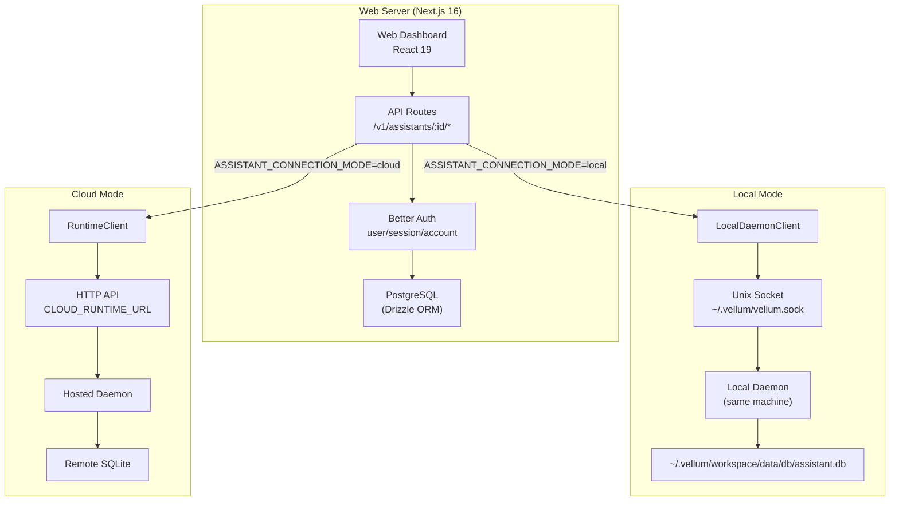
```mermaid
graph TB
    subgraph "Web Server (Next.js 16)"
        DASHBOARD["Web Dashboard<br/>React 19"]
        ROUTES["API Routes<br/>/v1/assistants/:id/*"]
        AUTH["Better Auth<br/>user/session/account"]
        PG["PostgreSQL<br/>(Drizzle ORM)"]
    end

    subgraph "Local Mode"
        LOCAL_CLIENT["LocalDaemonClient"]
        LOCAL_SOCK["Unix Socket<br/>~/.vellum/vellum.sock"]
        LOCAL_DAEMON["Local Daemon<br/>(same machine)"]
        LOCAL_DB["~/.vellum/workspace/data/db/assistant.db"]
    end

    subgraph "Cloud Mode"
        RUNTIME_CLIENT["RuntimeClient"]
        CLOUD_HTTP["HTTP API<br/>CLOUD_RUNTIME_URL"]
        CLOUD_DAEMON["Hosted Daemon"]
        CLOUD_DB["Remote SQLite"]
    end

    DASHBOARD --> ROUTES
    ROUTES --> AUTH
    AUTH --> PG

    ROUTES -->|"ASSISTANT_CONNECTION_MODE=local"| LOCAL_CLIENT
    LOCAL_CLIENT --> LOCAL_SOCK
    LOCAL_SOCK --> LOCAL_DAEMON
    LOCAL_DAEMON --> LOCAL_DB

    ROUTES -->|"ASSISTANT_CONNECTION_MODE=cloud"| RUNTIME_CLIENT
    RUNTIME_CLIENT --> CLOUD_HTTP
    CLOUD_HTTP --> CLOUD_DAEMON
    CLOUD_DAEMON --> CLOUD_DB
```

---

## IPC Contract — Source of Truth and Code Generation

The TypeScript file `assistant/src/daemon/ipc-contract.ts` is the **single source of truth** for all IPC message types. Swift client models are auto-generated from it.

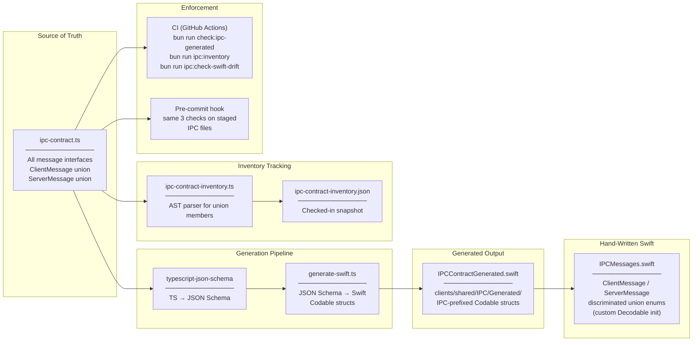
```mermaid
graph LR
    subgraph "Source of Truth"
        CONTRACT["ipc-contract.ts<br/>───────────────<br/>All message interfaces<br/>ClientMessage union<br/>ServerMessage union"]
    end

    subgraph "Generation Pipeline"
        TJS["typescript-json-schema<br/>───────────────<br/>TS → JSON Schema"]
        GEN["generate-swift.ts<br/>───────────────<br/>JSON Schema → Swift<br/>Codable structs"]
    end

    subgraph "Generated Output"
        SWIFT["IPCContractGenerated.swift<br/>───────────────<br/>clients/shared/IPC/Generated/<br/>IPC-prefixed Codable structs"]
    end

    subgraph "Hand-Written Swift"
        ENUMS["IPCMessages.swift<br/>───────────────<br/>ClientMessage / ServerMessage<br/>discriminated union enums<br/>(custom Decodable init)"]
    end

    subgraph "Inventory Tracking"
        INV_SRC["ipc-contract-inventory.ts<br/>───────────────<br/>AST parser for union members"]
        INV_SNAP["ipc-contract-inventory.json<br/>───────────────<br/>Checked-in snapshot"]
    end

    subgraph "Enforcement"
        CI["CI (GitHub Actions)<br/>bun run check:ipc-generated<br/>bun run ipc:inventory<br/>bun run ipc:check-swift-drift"]
        HOOK["Pre-commit hook<br/>same 3 checks on staged<br/>IPC files"]
    end

    CONTRACT --> TJS
    TJS --> GEN
    GEN --> SWIFT
    SWIFT --> ENUMS

    CONTRACT --> INV_SRC
    INV_SRC --> INV_SNAP

    CONTRACT --> CI
    CONTRACT --> HOOK
```

---

## IPC Protocol — Message Types


```mermaid
graph LR
    subgraph "Client → Server"
        direction TB
        C0["task_submit<br/>task, screenWidth, screenHeight,<br/>attachments, source?:'voice'|'text'"]
        C1["cu_session_create<br/>task, attachments"]
        C2["cu_observation<br/>axTree, axDiff, screenshot,<br/>secondaryWindows, result/error,<br/>axTreeBlob?, screenshotBlob?"]
        C3["ambient_observation<br/>screenContent, requestId"]
        C4["session_create<br/>title, threadType?"]
        C5["user_message<br/>text, attachments"]
        C6["confirmation_response<br/>decision"]
        C7["cancel / undo"]
        C8["model_get / model_set<br/>sandbox_set (deprecated no-op)"]
        C9["ping"]
        C10["ipc_blob_probe<br/>probeId, nonceSha256"]
        C11["work_items_list / work_item_get<br/>work_item_create / work_item_update<br/>work_item_complete / work_item_run_task<br/>(planned)"]
        C12["tool_permission_simulate<br/>toolName, input, workingDir?,<br/>isInteractive?, forcePromptSideEffects?,<br/>executionTarget?"]
        C13["conversation_search<br/>query, limit?,<br/>maxMessagesPerConversation?"]
        C14["ingress_invite<br/>create / list / revoke / redeem"]
        C15["ingress_member<br/>list / upsert / revoke / block"]
    end

    SOCKET["Unix Socket<br/>~/.vellum/vellum.sock<br/>───────────────<br/>Newline-delimited JSON<br/>Max 96MB per message<br/>Ping/pong every 30s<br/>Auto-reconnect<br/>1s → 30s backoff"]

    subgraph "Server → Client"
        direction TB
        S0["task_routed<br/>interactionType, sessionId"]
        S1["cu_action<br/>tool, input dict"]
        S2["cu_complete<br/>summary"]
        S3["cu_error<br/>message"]
        S4["assistant_text_delta<br/>streaming text"]
        S5["assistant_thinking_delta<br/>streaming thinking"]
        S6["message_complete<br/>usage stats, attachments?"]
        S7["ambient_result<br/>decision, summary/suggestion"]
        S8["confirmation_request<br/>tool, risk_level,<br/>executionTarget"]
        S9["memory_recalled<br/>source hits + relation counters<br/>ranking/debug telemetry"]
        S10["usage_update / error"]
        S11["generation_cancelled"]
        S12["message_queued<br/>position in queue"]
        S13["message_dequeued<br/>queue drained"]
        S14["generation_handoff<br/>sessionId, requestId?,<br/>queuedCount, attachments?"]
        S15["trace_event<br/>eventId, sessionId, requestId?,<br/>timestampMs, sequence, kind,<br/>status?, summary, attributes?"]
        S16["session_error<br/>sessionId, code,<br/>userMessage, retryable,<br/>debugDetails?"]
        S17["ipc_blob_probe_result<br/>probeId, ok,<br/>observedNonceSha256?, reason?"]
        S18["session_info<br/>sessionId, title,<br/>correlationId?, threadType?"]
        S19["session_title_updated<br/>sessionId, title"]
        S20["session_list_response<br/>sessions[]: id, title,<br/>updatedAt, threadType?"]
        S21["work_item_status_changed<br/>workItemId, newStatus<br/>(planned push)"]
        S22["tool_permission_simulate_response<br/>decision, riskLevel, reason?,<br/>promptPayload?, matchedRuleId?"]
        S23["conversation_search_response<br/>query, results[]: conversationId,<br/>title, updatedAt, matchingMessages[]"]
        S24["ingress_invite_response<br/>invite / invites"]
        S25["ingress_member_response<br/>member / members"]
    end

    C0 --> SOCKET
    C1 --> SOCKET
    C2 --> SOCKET
    C3 --> SOCKET
    C4 --> SOCKET
    C5 --> SOCKET
    C6 --> SOCKET
    C7 --> SOCKET
    C8 --> SOCKET
    C9 --> SOCKET
    C10 --> SOCKET
    C11 --> SOCKET
    C12 --> SOCKET
    C13 --> SOCKET
    C14 --> SOCKET
    C15 --> SOCKET

    SOCKET --> S0
    SOCKET --> S1
    SOCKET --> S2
    SOCKET --> S3
    SOCKET --> S4
    SOCKET --> S5
    SOCKET --> S6
    SOCKET --> S7
    SOCKET --> S8
    SOCKET --> S9
    SOCKET --> S10
    SOCKET --> S11
    SOCKET --> S12
    SOCKET --> S13
    SOCKET --> S14
    SOCKET --> S15
    SOCKET --> S16
    SOCKET --> S17
    SOCKET --> S18
    SOCKET --> S19
    SOCKET --> S20
    SOCKET --> S21
    SOCKET --> S22
    SOCKET --> S24
    SOCKET --> S25
```

---

## Blob Transport — Large Payload Side-Channel

CU observations can carry large payloads (screenshots as JPEG, AX trees as UTF-8 text). Instead of embedding these inline as base64/text in newline-delimited JSON IPC messages, the blob transport offloads them to local files and sends only lightweight references over the socket.

### Probe Mechanism

Blob transport is opt-in per connection. On every macOS socket connect, the client writes a random nonce file to the blob directory and sends an `ipc_blob_probe` message with the SHA-256 of the nonce. The daemon reads the file, computes the hash, and responds with `ipc_blob_probe_result`. If hashes match, the client sets `isBlobTransportAvailable = true` for that connection. The flag resets to `false` on disconnect or reconnect.

On iOS (HTTP+SSE connections via the gateway), blob transport is not applicable — `isBlobTransportAvailable` stays `false` and inline payloads are always used. Over SSH-forwarded Unix sockets on macOS, the probe runs but fails because the client and daemon don't share a filesystem, so blob transport stays disabled and inline payloads are used transparently.

### Blob Directory

All blobs live at `~/.vellum/workspace/data/ipc-blobs/`. Filenames are `${uuid}.blob`. The daemon ensures this directory exists on startup. Both client and daemon use atomic writes (temp file + rename) to prevent partial reads.

### Blob Reference

```
IpcBlobRef {
  id: string              // UUID v4
  kind: "ax_tree" | "screenshot_jpeg"
  encoding: "utf8" | "binary"
  byteLength: number
  sha256?: string         // SHA-256 hex digest for integrity check
}
```

### Transport Decision Flow

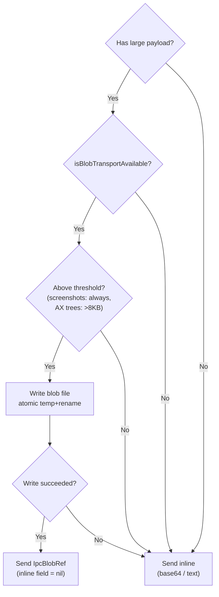
```mermaid
graph TB
    HAS_DATA{"Has large payload?"}
    BLOB_AVAIL{"isBlobTransportAvailable?"}
    THRESHOLD{"Above threshold?<br/>(screenshots: always,<br/>AX trees: >8KB)"}
    WRITE_BLOB["Write blob file<br/>atomic temp+rename"]
    WRITE_OK{"Write succeeded?"}
    SEND_REF["Send IpcBlobRef<br/>(inline field = nil)"]
    SEND_INLINE["Send inline<br/>(base64 / text)"]

    HAS_DATA -->|Yes| BLOB_AVAIL
    HAS_DATA -->|No| SEND_INLINE
    BLOB_AVAIL -->|Yes| THRESHOLD
    BLOB_AVAIL -->|No| SEND_INLINE
    THRESHOLD -->|Yes| WRITE_BLOB
    THRESHOLD -->|No| SEND_INLINE
    WRITE_BLOB --> WRITE_OK
    WRITE_OK -->|Yes| SEND_REF
    WRITE_OK -->|No| SEND_INLINE
```

### Daemon Hydration

When the daemon receives a CU observation with blob refs, it attempts blob-first hydration before the CU session processes the observation:

1. Validate the blob ref's `kind` and `encoding` match the expected field (`axTreeBlob` must be `kind=ax_tree, encoding=utf8`; `screenshotBlob` must be `kind=screenshot_jpeg, encoding=binary`).
2. Verify the blob file is a regular file (not a symlink) and its realpath stays within the blob directory.
3. Read the blob file, verify actual size matches `byteLength`, and check optional `sha256`.
4. For screenshots: base64-encode the bytes into the `screenshot` field.
5. For AX trees: decode UTF-8 bytes into the `axTree` field.
6. Delete the consumed blob file.

**Fallback behavior**: If both a blob ref and an inline field are present and blob hydration succeeds, the blob value takes precedence. If blob hydration fails and an inline fallback exists, the inline value is used. If blob hydration fails and no inline fallback exists, the daemon sends a `cu_error` and does not forward the observation to the session.

### Cleanup

- **Consumed blobs**: Deleted immediately after successful hydration.
- **Stale sweep**: The daemon runs a periodic sweep (every 5 minutes) to delete blob files older than 30 minutes, catching orphans from failed sends or crashes.
- **Size limits**: Screenshot blobs are capped at 10MB, AX tree blobs at 2MB. Oversized blobs are rejected.

---

## Session Errors vs Global Errors

The daemon emits two distinct error message types over IPC:

| Message type | Scope | Purpose | Payload |
|---|---|---|---|
| `session_error` | Session-scoped | Typed, actionable failures during chat/session runtime (e.g., provider network error, rate limit, API failure) | `sessionId`, `code` (typed enum), `userMessage`, `retryable`, `debugDetails?` |
| `error` | Global | Generic, non-session failures (e.g., daemon startup errors, unknown message types) | `message` (string) |

**Design rationale:** `session_error` carries structured metadata (error code, retryable flag, debug details) so the client can present actionable UI — a toast with retry/dismiss buttons — rather than a generic error banner. The older `error` type is retained for backward compatibility with non-session contexts.

### Session Error Codes

| Code | Meaning | Retryable |
|---|---|---|
| `PROVIDER_NETWORK` | Unable to reach the LLM provider (connection refused, timeout, DNS) | Yes |
| `PROVIDER_RATE_LIMIT` | LLM provider rate-limited the request (HTTP 429) | Yes |
| `PROVIDER_API` | Provider returned a server error (5xx) | Yes |
| `QUEUE_FULL` | The message queue is full | Yes |
| `SESSION_ABORTED` | Non-user abort interrupted the request | Yes |
| `SESSION_PROCESSING_FAILED` | Catch-all for unexpected processing failures | No |
| `REGENERATE_FAILED` | Failed to regenerate a previous response | Yes |

### Error Classification

The daemon classifies errors via `classifySessionError()` in `session-error.ts`. Before classification, `isUserCancellation()` checks whether the error is a user-initiated abort (active abort signal or `AbortError`); if so, the daemon emits `generation_cancelled` instead of `session_error` — cancel never surfaces a session-error toast.

Classification uses a two-tier strategy:
1. **Structured provider errors**: If the error is a `ProviderError` with a `statusCode`, the status code determines the category deterministically — `429` maps to `PROVIDER_RATE_LIMIT` (retryable), `5xx` to `PROVIDER_API` (retryable), other `4xx` to `PROVIDER_API` (not retryable).
2. **Regex fallback**: For non-provider errors or `ProviderError` without a status code, regex pattern matching against the error message detects network failures, rate limits, and API errors. Phase-specific overrides handle queue and regeneration contexts.

Debug details are capped at 4,000 characters to prevent oversized IPC payloads.

### Error → Toast → Recovery Flow

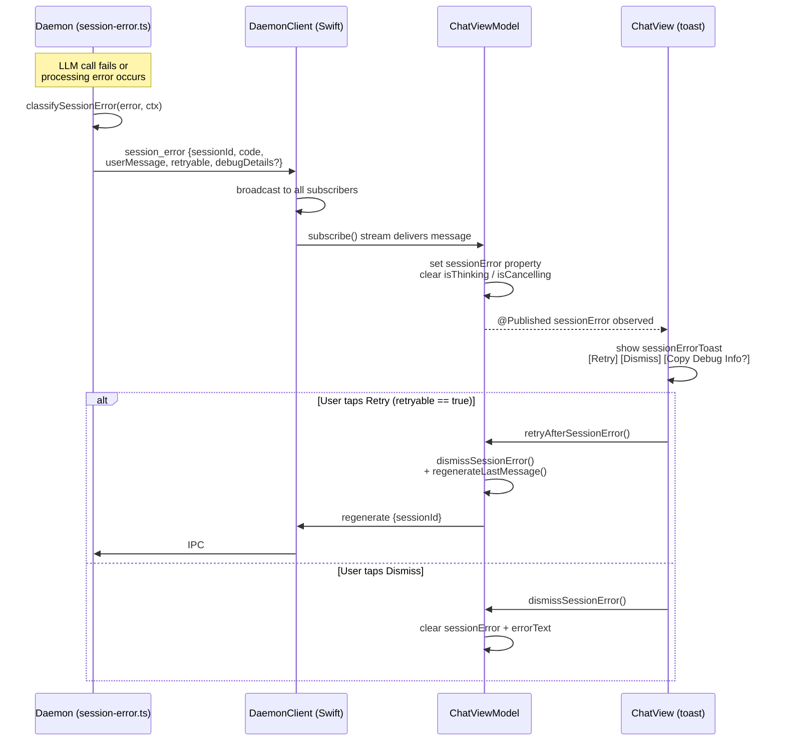
```mermaid
sequenceDiagram
    participant Daemon as Daemon (session-error.ts)
    participant DC as DaemonClient (Swift)
    participant VM as ChatViewModel
    participant UI as ChatView (toast)

    Note over Daemon: LLM call fails or<br/>processing error occurs
    Daemon->>Daemon: classifySessionError(error, ctx)
    Daemon->>DC: session_error {sessionId, code,<br/>userMessage, retryable, debugDetails?}
    DC->>DC: broadcast to all subscribers
    DC->>VM: subscribe() stream delivers message
    VM->>VM: set sessionError property<br/>clear isThinking / isCancelling
    VM-->>UI: @Published sessionError observed

    UI->>UI: show sessionErrorToast<br/>[Retry] [Dismiss] [Copy Debug Info?]

    alt User taps Retry (retryable == true)
        UI->>VM: retryAfterSessionError()
        VM->>VM: dismissSessionError()<br/>+ regenerateLastMessage()
        VM->>DC: regenerate {sessionId}
        DC->>Daemon: IPC
    else User taps Dismiss
        UI->>VM: dismissSessionError()
        VM->>VM: clear sessionError + errorText
    end
```

1. **Daemon** encounters a session-scoped failure, classifies it via `classifySessionError()`, and sends a `session_error` IPC message with the session ID, typed error code, user-facing message, retryable flag, and optional debug details. Session-scoped failures emit *only* `session_error` (never the generic `error` type) to prevent cross-session bleed.
2. **ChatViewModel** receives the error via DaemonClient's `subscribe()` stream (each view model gets an independent stream), sets the `sessionError` property, and transitions out of the streaming/loading state so the UI is interactive. If the error arrives during an active cancel (`wasCancelling == true`), it is suppressed — cancel only shows `generation_cancelled` behavior.
3. **ChatView** observes the published `sessionError` and displays an actionable toast with a category-specific icon and accent color:
   - **Retry** (shown when `retryable` is true): calls `retryAfterSessionError()`, which clears the error and sends a `regenerate` message to the daemon.
   - **Copy Debug Info** (shown when `debugDetails` is non-nil): copies structured debug information to the clipboard for bug reports.
   - **Dismiss (X)**: calls `dismissSessionError()` to clear the error without retrying.
4. If the error is not retryable, the Retry button is hidden and the user can only dismiss.

---

## Task Routing — Voice Source Bypass and Escalation

When a task is submitted via `task_submit`, the daemon classifies it to determine routing. Voice-sourced tasks and slash command candidates bypass the classifier entirely for lower latency and more predictable routing.

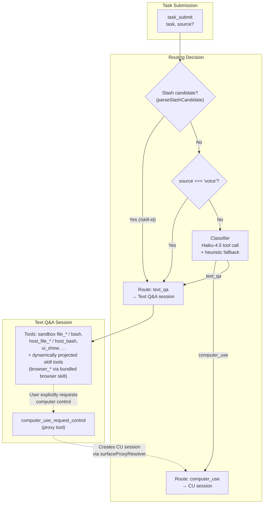
```mermaid
graph TB
    subgraph "Task Submission"
        SUBMIT["task_submit<br/>task, source?"]
    end

    subgraph "Routing Decision"
        SLASH_CHECK{"Slash candidate?<br/>(parseSlashCandidate)"}
        VOICE_CHECK{"source === 'voice'?"}
        CLASSIFIER["Classifier<br/>Haiku-4.5 tool call<br/>+ heuristic fallback"]
        CU_ROUTE["Route: computer_use<br/>→ CU session"]
        QA_ROUTE["Route: text_qa<br/>→ Text Q&A session"]
    end

    subgraph "Text Q&A Session"
        TEXT_TOOLS["Tools: sandbox file_* / bash,<br/>host_file_* / host_bash,<br/>ui_show, ...<br/>+ dynamically projected skill tools<br/>(browser_* via bundled browser skill)"]
        ESCALATE["computer_use_request_control<br/>(proxy tool)"]
    end

    SUBMIT --> SLASH_CHECK
    SLASH_CHECK -->|"Yes (/skill-id)"| QA_ROUTE
    SLASH_CHECK -->|"No"| VOICE_CHECK
    VOICE_CHECK -->|"Yes"| QA_ROUTE
    VOICE_CHECK -->|"No"| CLASSIFIER
    CLASSIFIER -->|"computer_use"| CU_ROUTE
    CLASSIFIER -->|"text_qa"| QA_ROUTE

    QA_ROUTE --> TEXT_TOOLS
    TEXT_TOOLS -.->|"User explicitly requests<br/>computer control"| ESCALATE
    ESCALATE -.->|"Creates CU session<br/>via surfaceProxyResolver"| CU_ROUTE
```

### Action Execution Hierarchy

The text_qa system prompt includes an action execution hierarchy that guides tool selection toward the least invasive method:

| Priority | Method | Tool | When to use |
|----------|--------|------|-------------|
| **BEST** | Sandboxed filesystem/shell | `file_*`, `bash` | Work that can stay isolated in sandbox filesystem |
| **BETTER** | Explicit host filesystem/shell | `host_file_*`, `host_bash` | Host reads/writes/commands that must touch the real machine |
| **GOOD** | Headless browser | `browser_*` (bundled `browser` skill) | Web automation, form filling, scraping (background) |
| **LAST RESORT** | Foreground computer use | `computer_use_request_control` | Only on explicit user request ("go ahead", "take over") |

The `computer_use_request_control` tool is a core proxy tool available only to text_qa sessions. When invoked, the session's `surfaceProxyResolver` creates a CU session and sends a `task_routed` message to the client, effectively escalating from text_qa to foreground computer use. The CU session constructor sets `preactivatedSkillIds: ['computer-use']`, and its `getProjectedCuToolDefinitions()` calls `projectSkillTools()` to load the 12 `computer_use_*` action tools from the bundled `computer-use` skill (via TOOLS.json). These tools are not core-registered at daemon startup; they exist only within CU sessions through skill projection.

### Sandbox Filesystem and Host Access

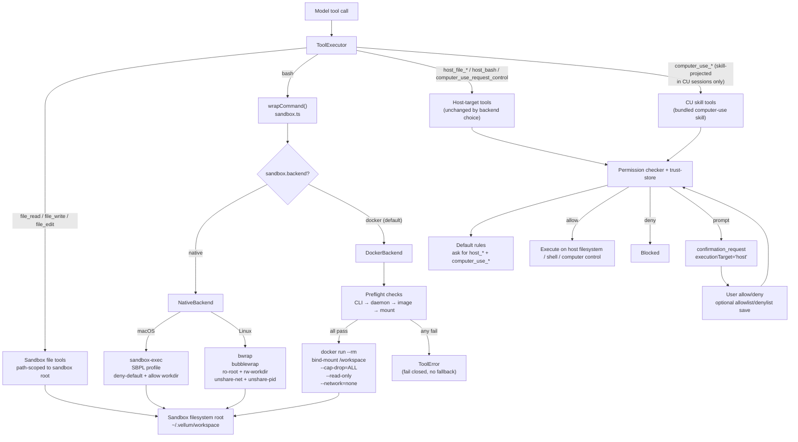
```mermaid
graph TB
    CALL["Model tool call"] --> EXEC["ToolExecutor"]

    EXEC -->|"file_read / file_write / file_edit"| SB_FILE_TOOLS["Sandbox file tools<br/>path-scoped to sandbox root"]
    SB_FILE_TOOLS --> SB_FS

    EXEC -->|"bash"| WRAP["wrapCommand()<br/>sandbox.ts"]

    WRAP --> BACKEND_CHECK{"sandbox.backend?"}
    BACKEND_CHECK -->|"native"| NATIVE["NativeBackend"]
    BACKEND_CHECK -->|"docker (default)"| DOCKER["DockerBackend"]

    NATIVE -->|"macOS"| SBPL["sandbox-exec<br/>SBPL profile<br/>deny-default + allow workdir"]
    NATIVE -->|"Linux"| BWRAP["bwrap<br/>bubblewrap<br/>ro-root + rw-workdir<br/>unshare-net + unshare-pid"]
    SBPL --> SB_FS["Sandbox filesystem root<br/>~/.vellum/workspace"]
    BWRAP --> SB_FS

    DOCKER --> PREFLIGHT["Preflight checks<br/>CLI → daemon → image → mount"]
    PREFLIGHT -->|"all pass"| CONTAINER["docker run --rm<br/>bind-mount /workspace<br/>--cap-drop=ALL<br/>--read-only<br/>--network=none"]
    PREFLIGHT -->|"any fail"| FAIL_CLOSED["ToolError<br/>(fail closed, no fallback)"]
    CONTAINER --> SB_FS

    EXEC -->|"host_file_* / host_bash / computer_use_request_control"| HOST_TOOLS["Host-target tools<br/>(unchanged by backend choice)"]
    EXEC -->|"computer_use_* (skill-projected<br/>in CU sessions only)"| SKILL_CU_TOOLS["CU skill tools<br/>(bundled computer-use skill)"]
    HOST_TOOLS --> CHECK["Permission checker + trust-store"]
    SKILL_CU_TOOLS --> CHECK
    CHECK --> DEFAULTS["Default rules<br/>ask for host_* + computer_use_*"]
    CHECK -->|"allow"| HOST_EXEC["Execute on host filesystem / shell / computer control"]
    CHECK -->|"deny"| BLOCK["Blocked"]
    CHECK -->|"prompt"| PROMPT["confirmation_request<br/>executionTarget='host'"]
    PROMPT --> USER["User allow/deny<br/>optional allowlist/denylist save"]
    USER --> CHECK
```

- **Backend selection**: The `sandbox.backend` config option (`"native"` or `"docker"`) determines how `bash` commands are sandboxed. The default is `"docker"`.
- **Native backend**: Uses OS-level sandboxing — `sandbox-exec` with SBPL profiles on macOS, `bwrap` (bubblewrap) on Linux. Denies network access and restricts filesystem writes to the sandbox root, `/tmp`, `/private/tmp`, and `/var/folders` (macOS) or the sandbox root and `/tmp` (Linux).
- **Docker backend**: Wraps each command in an ephemeral `docker run --rm` container. The canonical sandbox filesystem root (`~/.vellum/workspace`) is always bind-mounted to `/workspace`, regardless of which subdirectory the command runs in. Commands are wrapped with `bash -c`. Containers run with all capabilities dropped, a read-only root filesystem, no network access, and host UID:GID forwarding. The default image is `vellum-sandbox:latest`, built from `assistant/Dockerfile.sandbox` (extends `node:20-slim` with `curl`, `ca-certificates`, and `bash`). The image is auto-built on first use if not found locally.
- **Fail-closed**: Both backends refuse to execute unsandboxed if their prerequisites are unavailable. The Docker backend runs preflight checks (CLI, daemon, image, writable mount probe via `test -w /workspace`) and throws `ToolError` with actionable messages on failure. Positive preflight results are cached; negative results are rechecked on every call. The `vellum doctor` command validates the same checks against the same sandbox path.
- **Host tools unchanged**: `host_bash`, `host_file_read`, `host_file_write`, and `host_file_edit` always execute directly on the host regardless of which sandbox backend is active.
- Sandbox defaults: `file_*` and `bash` execute within `~/.vellum/workspace`.
- Host access is explicit: `host_file_read`, `host_file_write`, `host_file_edit`, and `host_bash` are separate tools.
- Prompt defaults: host tools, `computer_use_request_control`, and `computer_use_*` skill-projected actions default to `ask` unless a trust rule allowlists/denylists them.
- Browser tool defaults: all `browser_*` tools are auto-allowed by default via seeded allow rules at priority 100, preserving the frictionless UX from when browser was a core tool.
- Confirmation payloads include `executionTarget` (`sandbox` or `host`) so clients can label where the action will run.

---

## Slash Command Resolution

When a user message enters the daemon (via `processMessage` or the queue drain path), it passes through slash command resolution before persistence or agent execution.

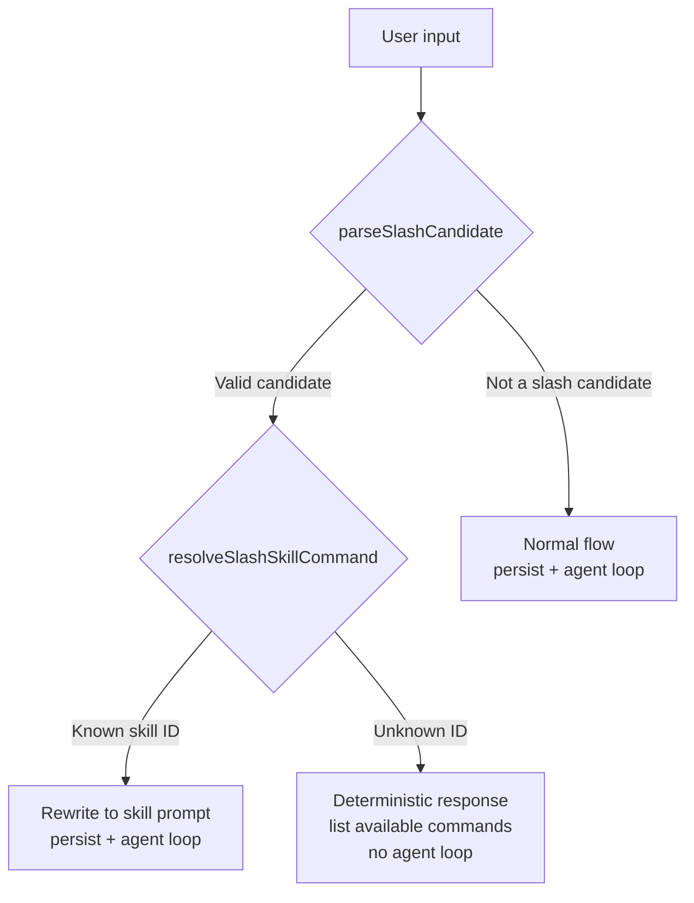
```mermaid
graph TB
    INPUT["User input"]
    PARSE{"parseSlashCandidate"}
    RESOLVE{"resolveSlashSkillCommand"}
    NONE["Normal flow<br/>persist + agent loop"]
    KNOWN["Rewrite to skill prompt<br/>persist + agent loop"]
    UNKNOWN["Deterministic response<br/>list available commands<br/>no agent loop"]

    INPUT --> PARSE
    PARSE -->|"Not a slash candidate"| NONE
    PARSE -->|"Valid candidate"| RESOLVE
    RESOLVE -->|"Known skill ID"| KNOWN
    RESOLVE -->|"Unknown ID"| UNKNOWN
```

Key behaviors:
- **Known**: Content is rewritten via `rewriteKnownSlashCommandPrompt` to instruct the model to invoke the skill. Trailing arguments are preserved.
- **Unknown**: A deterministic `assistant_text_delta` + `message_complete` is emitted listing available slash commands. No message persistence or model call occurs.
- **Queue**: Queued messages receive the same slash resolution. Unknown slash commands in the queue emit their response and continue draining without stalling.

---

## Dynamic Skill Authoring — Tool Flow

The assistant can author, test, and persist new skills at runtime through a three-tool workflow. All operations target `~/.vellum/workspace/skills/` (managed skills directory) and require explicit user confirmation.

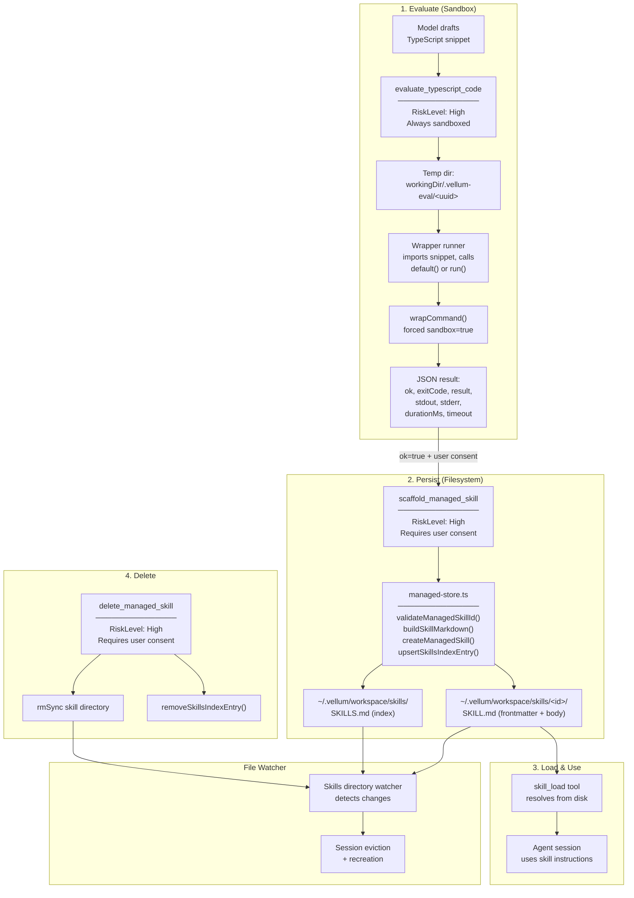
```mermaid
graph TB
    subgraph "1. Evaluate (Sandbox)"
        SNIPPET["Model drafts<br/>TypeScript snippet"]
        EVAL_TOOL["evaluate_typescript_code<br/>───────────────<br/>RiskLevel: High<br/>Always sandboxed"]
        TEMP["Temp dir:<br/>workingDir/.vellum-eval/&lt;uuid&gt;"]
        WRAPPER["Wrapper runner<br/>imports snippet, calls<br/>default() or run()"]
        SANDBOX["wrapCommand()<br/>forced sandbox=true"]
        RESULT["JSON result:<br/>ok, exitCode, result,<br/>stdout, stderr,<br/>durationMs, timeout"]
    end

    subgraph "2. Persist (Filesystem)"
        SCAFFOLD["scaffold_managed_skill<br/>───────────────<br/>RiskLevel: High<br/>Requires user consent"]
        MANAGED_STORE["managed-store.ts<br/>───────────────<br/>validateManagedSkillId()<br/>buildSkillMarkdown()<br/>createManagedSkill()<br/>upsertSkillsIndexEntry()"]
        SKILL_DIR["~/.vellum/workspace/skills/&lt;id&gt;/<br/>SKILL.md (frontmatter + body)"]
        INDEX["~/.vellum/workspace/skills/<br/>SKILLS.md (index)"]
    end

    subgraph "3. Load & Use"
        SKILL_LOAD["skill_load tool<br/>resolves from disk"]
        SESSION["Agent session<br/>uses skill instructions"]
    end

    subgraph "4. Delete"
        DELETE["delete_managed_skill<br/>───────────────<br/>RiskLevel: High<br/>Requires user consent"]
        RM_DIR["rmSync skill directory"]
        RM_INDEX["removeSkillsIndexEntry()"]
    end

    subgraph "File Watcher"
        WATCHER["Skills directory watcher<br/>detects changes"]
        EVICT["Session eviction<br/>+ recreation"]
    end

    SNIPPET --> EVAL_TOOL
    EVAL_TOOL --> TEMP
    TEMP --> WRAPPER
    WRAPPER --> SANDBOX
    SANDBOX --> RESULT
    RESULT -->|"ok=true + user consent"| SCAFFOLD

    SCAFFOLD --> MANAGED_STORE
    MANAGED_STORE --> SKILL_DIR
    MANAGED_STORE --> INDEX

    SKILL_DIR --> WATCHER
    INDEX --> WATCHER
    WATCHER --> EVICT

    SKILL_DIR --> SKILL_LOAD
    SKILL_LOAD --> SESSION

    DELETE --> RM_DIR
    DELETE --> RM_INDEX
    RM_DIR --> WATCHER
```

**Key design decisions:**
- `evaluate_typescript_code` always forces `sandbox.enabled = true` regardless of global config.
- Snippet contract: must export `default` or `run` with signature `(input: unknown) => unknown | Promise<unknown>`.
- Managed-store writes are atomic (tmp file + rename) to prevent partial `SKILL.md` or `SKILLS.md` files.
- After persist or delete, the file watcher triggers session eviction; the next turn runs in a fresh session. The model's system prompt instructs it to continue normally.
- macOS UI shows Inspect and Delete controls for managed skills only (source = "managed").
- `skill_load` validates the recursive include graph (via `include-graph.ts`) before emitting output. Missing children and cycles produce `isError: true` with no `<loaded_skill>` marker. Valid includes produce an "Included Skills (immediate)" metadata section showing child ID, name, description, and path.

### Skills Authoring via IPC

The Skills page in the macOS client can author managed skills through daemon IPC without going through the agent loop:

1. **Draft** (`skills_draft`): The client sends source text (with optional YAML frontmatter). The daemon parses frontmatter for metadata fields (skillId, name, description, emoji), fills missing fields via a latency-optimized LLM call, and falls back to deterministic heuristics if the provider is unavailable. Returns `skills_draft_response` with the complete draft.
2. **Create** (`skills_create`): The client sends finalized skill metadata and body. The daemon calls `createManagedSkill()` from `managed-store.ts`, auto-enables the skill in config, and broadcasts `skills_state_changed`.

### Include Graph Validation

Skills can declare child relationships via the `includes` frontmatter field (a JSON array of skill IDs). When `skill_load` loads a parent skill, it validates the full recursive include graph before emitting output.

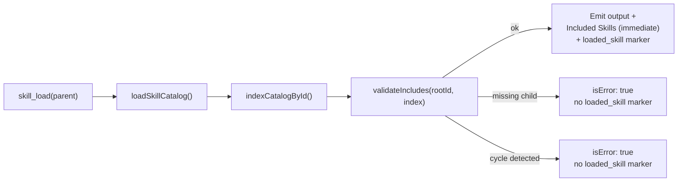
```mermaid
graph LR
    LOAD["skill_load(parent)"] --> CATALOG["loadSkillCatalog()"]
    CATALOG --> INDEX["indexCatalogById()"]
    INDEX --> VALIDATE["validateIncludes(rootId, index)"]
    VALIDATE -->|"ok"| OUTPUT["Emit output +<br/>Included Skills (immediate)<br/>+ loaded_skill marker"]
    VALIDATE -->|"missing child"| ERR_MISSING["isError: true<br/>no loaded_skill marker"]
    VALIDATE -->|"cycle detected"| ERR_CYCLE["isError: true<br/>no loaded_skill marker"]
```

**Validation rules:**
- **Missing children**: If any skill in the recursive graph references an `includes` ID not found in the catalog, validation fails with the full path from root to the missing reference.
- **Cycles**: Three-state DFS (unseen → visiting → done) detects direct and indirect cycles. The error includes the cycle path.
- **Fail-closed**: On any validation error, `skill_load` returns `isError: true` with no `<loaded_skill>` marker, preventing the agent from using a skill with broken dependencies.

**Key constraint**: Include metadata is metadata-only. Child skills are **not** auto-activated — the agent must explicitly call `skill_load` for each child. The `projectSkillTools()` function only projects tools for skills with explicit `<loaded_skill>` markers in conversation history.

| Source File | Purpose |
|---|---|
| `assistant/src/skills/include-graph.ts` | `indexCatalogById()`, `getImmediateChildren()`, `validateIncludes()`, `traverseIncludes()` |
| `assistant/src/tools/skills/load.ts` | Include validation integration in `skill_load` execute path |
| `assistant/src/config/skills.ts` | `includes` field parsing from SKILL.md frontmatter |
| `assistant/src/skills/managed-store.ts` | `includes` emission in `buildSkillMarkdown()` |

---

## Dynamic Skill Tool System — Runtime Tool Projection

Skills can expose custom tools via a `TOOLS.json` manifest alongside their `SKILL.md`. When a skill is activated during a session, its tools are dynamically loaded, registered, and made available to the agent loop. Browser, Gmail, Claude Code, Weather, and other capabilities are delivered as **bundled skills** rather than hardcoded tools. Browser tools (previously the core `headless-browser` tool) are now provided by the bundled `browser` skill with system default allow rules that preserve frictionless auto-approval.

### Skill Directory Structure

Each skill directory (bundled, managed, workspace, or extra) may contain:

```
skills/<skill-id>/
  SKILL.md          # Skill instructions (frontmatter + markdown body; optional includes: [...] for child skills)
  TOOLS.json        # Tool manifest (optional — skills without tools are instruction-only)
  tools/            # Executor scripts referenced by TOOLS.json
    my-tool.ts      # Exports run(input, context) → ToolExecutionResult
```

### Bundled Skills

The following capabilities ship as bundled skills in `assistant/src/config/bundled-skills/`:

| Skill ID | Tools | Purpose |
|----------|-------|---------|
| `browser` | `browser_navigate`, `browser_snapshot`, `browser_screenshot`, `browser_close`, `browser_click`, `browser_type`, `browser_press_key`, `browser_wait_for`, `browser_extract`, `browser_fill_credential` | Headless browser automation — web scraping, form filling, interaction (previously core-registered as `headless-browser`; now skill-provided with default allow rules) |
| `gmail` | Gmail search, archive, send, etc. | Email management via OAuth2 integration |
| `claude-code` | Claude Code tool | Delegate coding tasks to Claude Code subprocess |
| `computer-use` | `computer_use_click`, `computer_use_double_click`, `computer_use_right_click`, `computer_use_type_text`, `computer_use_key`, `computer_use_scroll`, `computer_use_drag`, `computer_use_open_app`, `computer_use_run_applescript`, `computer_use_wait`, `computer_use_done`, `computer_use_respond` | Computer-use action tools — internally preactivated by `ComputerUseSession` via `preactivatedSkillIds`; not user-invocable or model-discoverable in text sessions. Each wrapper script forwards to `forwardComputerUseProxyTool()` which uses the session's proxy resolver to send actions to the macOS client. |
| `weather` | `get-weather` | Fetch current weather data |
| `app-builder` | `app_create`, `app_list`, `app_query`, `app_update`, `app_delete`, `app_file_list`, `app_file_read`, `app_file_edit`, `app_file_write` | Dynamic app authoring — CRUD and file-level editing for persistent apps (activated via `skill_load app-builder`; `app_open` remains a core proxy tool) |
| `self-upgrade` | (instruction-only) | Self-improvement workflow |
| `start-the-day` | (instruction-only) | Morning briefing routine |

### Activation and Projection Flow

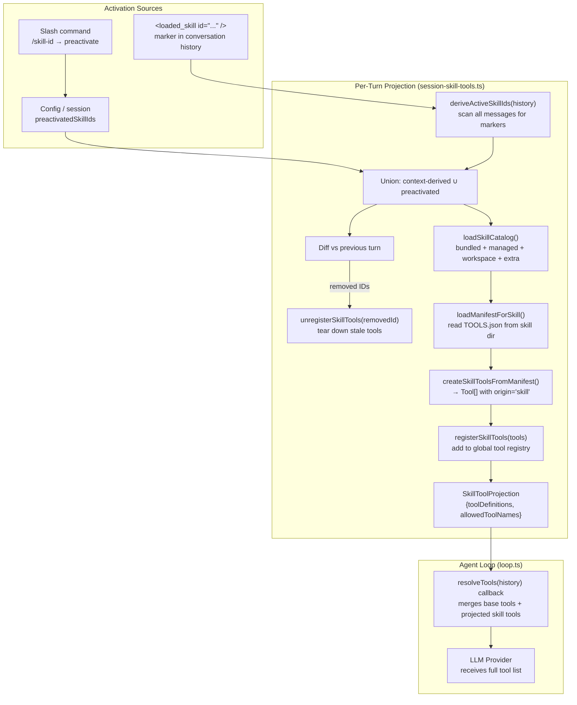
```mermaid
graph TB
    subgraph "Activation Sources"
        SLASH["Slash command<br/>/skill-id → preactivate"]
        MARKER["&lt;loaded_skill id=&quot;...&quot; /&gt;<br/>marker in conversation history"]
        CONFIG["Config / session<br/>preactivatedSkillIds"]
    end

    subgraph "Per-Turn Projection (session-skill-tools.ts)"
        DERIVE["deriveActiveSkillIds(history)<br/>scan all messages for markers"]
        UNION["Union: context-derived ∪ preactivated"]
        DIFF["Diff vs previous turn"]
        UNREGISTER["unregisterSkillTools(removedId)<br/>tear down stale tools"]
        CATALOG["loadSkillCatalog()<br/>bundled + managed + workspace + extra"]
        LOAD_MANIFEST["loadManifestForSkill()<br/>read TOOLS.json from skill dir"]
        FACTORY["createSkillToolsFromManifest()<br/>→ Tool[] with origin='skill'"]
        REGISTER["registerSkillTools(tools)<br/>add to global tool registry"]
        PROJECTION["SkillToolProjection<br/>{toolDefinitions, allowedToolNames}"]
    end

    subgraph "Agent Loop (loop.ts)"
        RESOLVE["resolveTools(history) callback<br/>merges base tools + projected skill tools"]
        PROVIDER["LLM Provider<br/>receives full tool list"]
    end

    SLASH --> CONFIG
    MARKER --> DERIVE
    CONFIG --> UNION
    DERIVE --> UNION
    UNION --> DIFF
    DIFF -->|"removed IDs"| UNREGISTER
    UNION --> CATALOG
    CATALOG --> LOAD_MANIFEST
    LOAD_MANIFEST --> FACTORY
    FACTORY --> REGISTER
    REGISTER --> PROJECTION
    PROJECTION --> RESOLVE
    RESOLVE --> PROVIDER
```

**Internal preactivation**: Some bundled skills are preactivated programmatically rather than by user slash commands or model discovery. For example, `ComputerUseSession` sets `preactivatedSkillIds: ['computer-use']` in its constructor, causing `projectSkillTools()` to load the 12 `computer_use_*` tool definitions from the bundled skill's `TOOLS.json` on the first turn. These tools are never exposed in text sessions — they only appear in the CU session's agent loop.

### Skill Tool Execution

Skill tool executors are TypeScript scripts that export a `run(input, context)` function. Execution is routed based on the `execution_target` field in `TOOLS.json`:

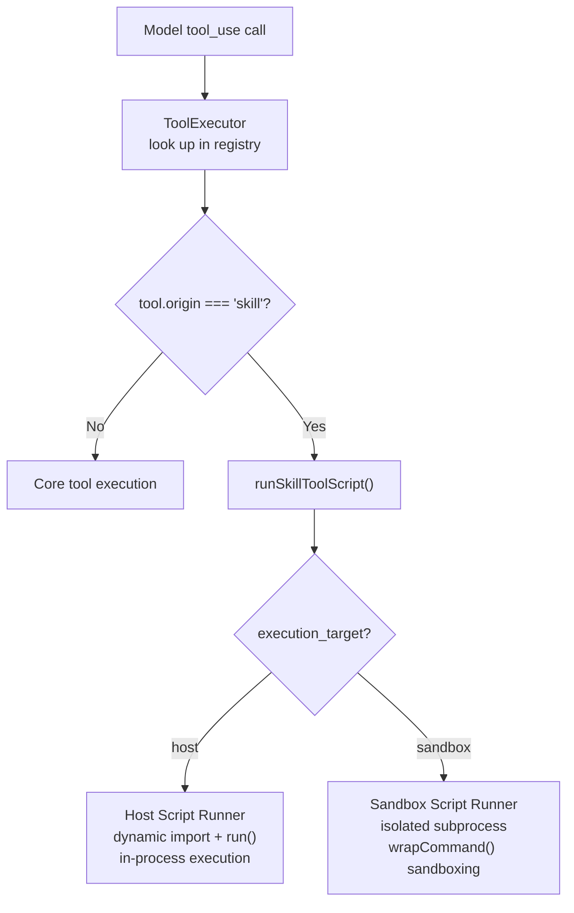
```mermaid
graph TB
    CALL["Model tool_use call"] --> EXEC["ToolExecutor<br/>look up in registry"]
    EXEC --> CHECK{"tool.origin === 'skill'?"}
    CHECK -->|"No"| CORE["Core tool execution"]
    CHECK -->|"Yes"| RUNNER["runSkillToolScript()"]
    RUNNER --> TARGET{"execution_target?"}
    TARGET -->|"host"| HOST["Host Script Runner<br/>dynamic import + run()<br/>in-process execution"]
    TARGET -->|"sandbox"| SANDBOX["Sandbox Script Runner<br/>isolated subprocess<br/>wrapCommand() sandboxing"]
```

### Permission Flow for Skill Tools

Skill-origin tools follow a stricter default permission model than core tools. Even if a skill tool declares `risk: "low"` in its manifest, the permission checker defaults to prompting the user unless a trust rule explicitly allows it. Additionally, high-risk tool invocations always prompt the user even when a matching allow rule exists.

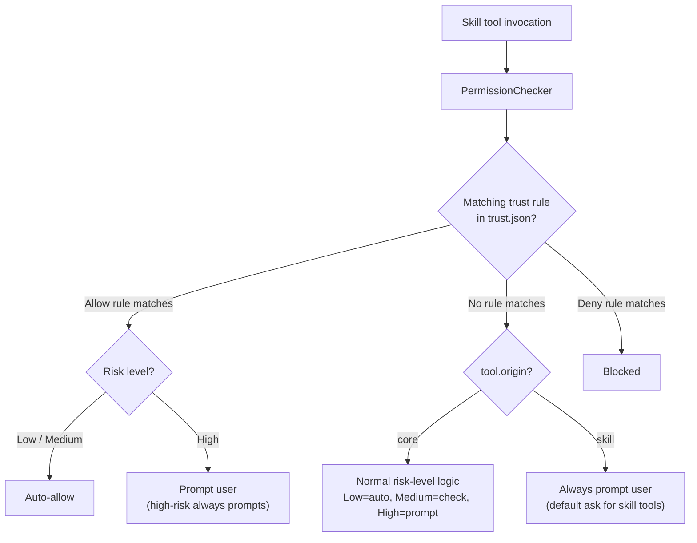
```mermaid
graph TB
    TOOL_CALL["Skill tool invocation"] --> PERM["PermissionChecker"]
    PERM --> TRUST{"Matching trust rule<br/>in trust.json?"}
    TRUST -->|"Allow rule matches"| HRISK{"Risk level?"}
    HRISK -->|"Low / Medium"| ALLOW["Auto-allow"]
    HRISK -->|"High"| HPROMPT["Prompt user<br/>(high-risk always prompts)"]
    TRUST -->|"No rule matches"| ORIGIN{"tool.origin?"}
    ORIGIN -->|"core"| RISK["Normal risk-level logic<br/>Low=auto, Medium=check, High=prompt"]
    ORIGIN -->|"skill"| PROMPT["Always prompt user<br/>(default ask for skill tools)"]
    TRUST -->|"Deny rule matches"| DENY["Blocked"]
```

### Key Source Files

| File | Role |
|------|------|
| `assistant/src/config/skills.ts` | Skill catalog loading: bundled, managed, workspace, extra directories |
| `assistant/src/config/bundled-skills/` | Bundled skill directories (browser, gmail, claude-code, computer-use, weather, etc.) |
| `assistant/src/skills/tool-manifest.ts` | `TOOLS.json` parser and validator |
| `assistant/src/skills/active-skill-tools.ts` | `deriveActiveSkillIds()` — scans history for `<loaded_skill>` markers |
| `assistant/src/skills/include-graph.ts` | Include graph builder: `indexCatalogById()`, `validateIncludes()`, cycle/missing detection |
| `assistant/src/daemon/session-skill-tools.ts` | `projectSkillTools()` — per-turn projection, register/unregister lifecycle |
| `assistant/src/tools/skills/skill-tool-factory.ts` | `createSkillToolsFromManifest()` — manifest entries to Tool objects |
| `assistant/src/tools/skills/skill-script-runner.ts` | Host runner: dynamic import + `run()` call |
| `assistant/src/tools/skills/sandbox-runner.ts` | Sandbox runner: isolated subprocess execution |
| `assistant/src/tools/registry.ts` | `registerSkillTools()` / `unregisterSkillTools()` — global tool registry |
| `assistant/src/permissions/checker.ts` | Skill-origin default-ask permission policy |

---

## Permission and Trust Security Model

The permission system controls which tool actions the agent can execute without explicit user approval. It supports three operating modes (`workspace`, `strict`, and `legacy`), execution-target-scoped trust rules, and risk-based escalation to provide defense-in-depth against unintended or malicious tool execution.

### Permission Evaluation Flow

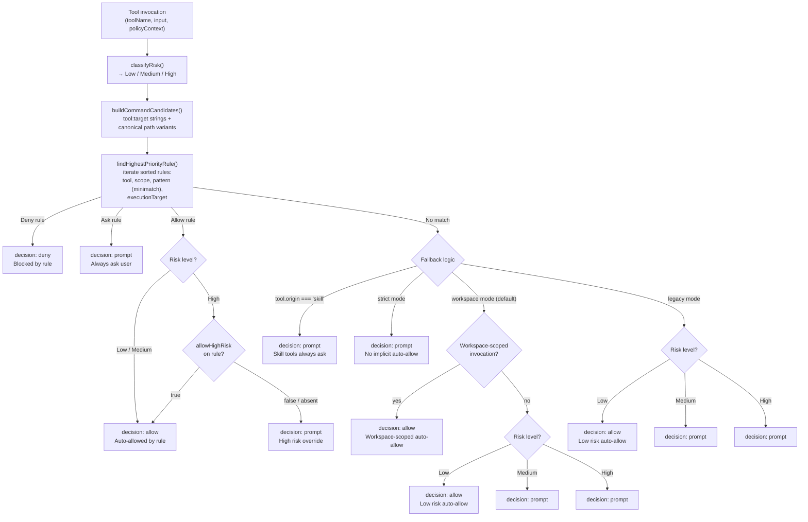
```mermaid
graph TB
    TOOL_CALL["Tool invocation<br/>(toolName, input, policyContext)"] --> CLASSIFY["classifyRisk()<br/>→ Low / Medium / High"]
    CLASSIFY --> CANDIDATES["buildCommandCandidates()<br/>tool:target strings +<br/>canonical path variants"]
    CANDIDATES --> FIND_RULE["findHighestPriorityRule()<br/>iterate sorted rules:<br/>tool, scope, pattern (minimatch),<br/>executionTarget"]

    FIND_RULE -->|"Deny rule"| DENY["decision: deny<br/>Blocked by rule"]
    FIND_RULE -->|"Ask rule"| PROMPT_ASK["decision: prompt<br/>Always ask user"]
    FIND_RULE -->|"Allow rule"| RISK_CHECK{"Risk level?"}
    FIND_RULE -->|"No match"| NO_MATCH{"Fallback logic"}

    RISK_CHECK -->|"Low / Medium"| AUTO_ALLOW["decision: allow<br/>Auto-allowed by rule"]
    RISK_CHECK -->|"High"| HIGH_CHECK{"allowHighRisk<br/>on rule?"}
    HIGH_CHECK -->|"true"| AUTO_ALLOW
    HIGH_CHECK -->|"false / absent"| PROMPT_HIGH["decision: prompt<br/>High risk override"]

    NO_MATCH -->|"tool.origin === 'skill'"| PROMPT_SKILL["decision: prompt<br/>Skill tools always ask"]
    NO_MATCH -->|"strict mode"| PROMPT_STRICT["decision: prompt<br/>No implicit auto-allow"]
    NO_MATCH -->|"workspace mode (default)"| WS_CHECK{"Workspace-scoped<br/>invocation?"}
    WS_CHECK -->|"yes"| AUTO_WS["decision: allow<br/>Workspace-scoped auto-allow"]
    WS_CHECK -->|"no"| RISK_FALLBACK_WS{"Risk level?"}
    RISK_FALLBACK_WS -->|"Low"| AUTO_WS_LOW["decision: allow<br/>Low risk auto-allow"]
    RISK_FALLBACK_WS -->|"Medium"| PROMPT_WS_MED["decision: prompt"]
    RISK_FALLBACK_WS -->|"High"| PROMPT_WS_HIGH["decision: prompt"]
    NO_MATCH -->|"legacy mode"| RISK_FALLBACK{"Risk level?"}
    RISK_FALLBACK -->|"Low"| AUTO_LOW["decision: allow<br/>Low risk auto-allow"]
    RISK_FALLBACK -->|"Medium"| PROMPT_MED["decision: prompt"]
    RISK_FALLBACK -->|"High"| PROMPT_HIGH2["decision: prompt"]
```

### Permission Modes: Workspace, Strict, and Legacy

The `permissions.mode` config option (`workspace`, `strict`, or `legacy`) controls the default behavior when no trust rule matches a tool invocation. The default is `workspace`.

| Behavior | Workspace mode (default) | Strict mode | Legacy mode (deprecated) |
|---|---|---|---|
| Workspace-scoped ops with no matching rule | Auto-allowed | Prompted | Auto-allowed (low risk) |
| Non-workspace low-risk tools with no matching rule | Auto-allowed | Prompted | Auto-allowed |
| Medium-risk tools with no matching rule | Prompted | Prompted | Prompted |
| High-risk tools with no matching rule | Prompted | Prompted | Prompted |
| `skill_load` with no matching rule | Prompted | Prompted | Auto-allowed (low risk) |
| `skill_load` with system default rule | Auto-allowed (`skill_load:*` at priority 100) | Auto-allowed (`skill_load:*` at priority 100) | Auto-allowed (`skill_load:*` at priority 100) |
| `browser_*` skill tools with system default rules | Auto-allowed (priority 100 allow rules) | Auto-allowed (priority 100 allow rules) | Auto-allowed (priority 100 allow rules) |
| Skill-origin tools with no matching rule | Prompted | Prompted | Prompted |
| Allow rules for non-high-risk tools | Auto-allowed | Auto-allowed | Auto-allowed |
| Allow rules with `allowHighRisk: true` | Auto-allowed (even high risk) | Auto-allowed (even high risk) | Auto-allowed (even high risk) |
| Deny rules | Blocked | Blocked | Blocked |

**Workspace mode** (default) auto-allows operations scoped to the workspace (file reads/writes/edits within the workspace directory, sandboxed bash) without prompting. Host operations, network requests, and operations outside the workspace still follow the normal approval flow. Explicit deny and ask rules override auto-allow.

**Strict mode** is designed for security-conscious deployments where every tool action must have an explicit matching rule in the trust store. It eliminates implicit auto-allow for any risk level, ensuring the user has consciously approved each class of tool usage.

**Legacy mode** (deprecated) auto-allows all low-risk tools regardless of scope. It is deprecated and will be removed in a future release. A one-time runtime warning is emitted when legacy mode is active. Users should migrate to `workspace` (default) or `strict`.

### Trust Rules (v3 Schema)

Rules are stored in `~/.vellum/protected/trust.json` with version `3`. Each rule can include the following fields:

| Field | Type | Purpose |
|---|---|---|
| `id` | `string` | Unique identifier (UUID for user rules, `default:*` for system defaults) |
| `tool` | `string` | Tool name to match (e.g., `bash`, `file_write`, `skill_load`) |
| `pattern` | `string` | Minimatch glob pattern for the command/target string |
| `scope` | `string` | Path prefix or `everywhere` — restricts where the rule applies |
| `decision` | `allow \| deny \| ask` | What to do when the rule matches |
| `priority` | `number` | Higher priority wins; deny wins ties at equal priority |
| `executionTarget` | `string?` | `sandbox` or `host` — restricts by execution context |
| `allowHighRisk` | `boolean?` | When true, auto-allows even high-risk invocations |

Missing optional fields act as wildcards. A rule with no `executionTarget` matches any target.

### Risk Classification and Escalation

The `classifyRisk()` function determines the risk level for each tool invocation:

| Tool | Risk level | Notes |
|---|---|---|
| `file_read`, `web_search`, `skill_load` | Low | Read-only or informational |
| `file_write`, `file_edit` | Medium (default) | Filesystem mutations |
| `file_write`, `file_edit` targeting skill source paths | **High** | `isSkillSourcePath()` detects managed/bundled/workspace/extra skill roots |
| `host_file_write`, `host_file_edit` targeting skill source paths | **High** | Same path classification, host variant |
| `bash`, `host_bash` | Varies | Parsed via tree-sitter: low-risk programs = Low, high-risk programs = High, unknown = Medium |
| `scaffold_managed_skill`, `delete_managed_skill` | High | Skill lifecycle mutations always high-risk |
| `evaluate_typescript_code` | High | Arbitrary code execution |
| Skill-origin tools with no matching rule | Prompted regardless of risk | Even Low-risk skill tools default to `ask` |

The escalation of skill source file mutations to High risk is a privilege-escalation defense: modifying skill source code could grant the agent new capabilities, so such operations always require explicit approval.

### Skill Load Approval

The `skill_load` tool generates version-aware command candidates for rule matching:

1. `skill_load:<skill-id>@<version-hash>` — matches version-pinned rules
2. `skill_load:<skill-id>` — matches any-version rules
3. `skill_load:<raw-selector>` — matches the raw user-provided selector

In strict mode, `skill_load` without a matching rule is always prompted. In legacy mode, it is auto-allowed as a Low-risk tool. The allowlist options presented to the user include both version-specific and any-version patterns. Note: the system default allow rule `skill_load:*` (priority 100) now globally allows all skill loads in both modes (see "System Default Allow Rules" below).

### Starter Approval Bundle

The starter bundle is an opt-in set of low-risk allow rules that reduces prompt noise, particularly in strict mode. It covers read-only tools that never mutate the filesystem or execute arbitrary code:

| Rule | Tool | Pattern |
|---|---|---|
| `file_read` | `file_read` | `file_read:**` |
| `glob` | `glob` | `glob:**` |
| `grep` | `grep` | `grep:**` |
| `list_directory` | `list_directory` | `list_directory:**` |
| `web_search` | `web_search` | `web_search:**` |
| `web_fetch` | `web_fetch` | `web_fetch:**` |

Acceptance is idempotent and persisted as `starterBundleAccepted: true` in `trust.json`. Rules are seeded at priority 90 (below user rules at 100, above system defaults at 50).

### System Default Allow Rules

In addition to the opt-in starter bundle, the permission system seeds unconditional default allow rules at priority 100 for two categories:

| Rule ID | Tool | Pattern | Rationale |
|---|---|---|---|
| `default:allow-skill_load-global` | `skill_load` | `skill_load:*` | Loading any skill is globally allowed — no prompt for activating bundled, managed, or workspace skills |
| `default:allow-browser_navigate-global` | `browser_navigate` | `browser_navigate:*` | Browser tools migrated from core to the bundled `browser` skill; default allow preserves frictionless UX |
| `default:allow-browser_snapshot-global` | `browser_snapshot` | `browser_snapshot:*` | (same) |
| `default:allow-browser_screenshot-global` | `browser_screenshot` | `browser_screenshot:*` | (same) |
| `default:allow-browser_close-global` | `browser_close` | `browser_close:*` | (same) |
| `default:allow-browser_click-global` | `browser_click` | `browser_click:*` | (same) |
| `default:allow-browser_type-global` | `browser_type` | `browser_type:*` | (same) |
| `default:allow-browser_press_key-global` | `browser_press_key` | `browser_press_key:*` | (same) |
| `default:allow-browser_wait_for-global` | `browser_wait_for` | `browser_wait_for:*` | (same) |
| `default:allow-browser_extract-global` | `browser_extract` | `browser_extract:*` | (same) |
| `default:allow-browser_fill_credential-global` | `browser_fill_credential` | `browser_fill_credential:*` | (same) |

These rules are emitted by `getDefaultRuleTemplates()` in `assistant/src/permissions/defaults.ts`. Because they use priority 100 (equal to user rules), they take effect in both strict and legacy modes. The `skill_load` rule means skill activation never prompts; the `browser_*` rules mean the browser skill's tools behave identically to the old core `headless-browser` tool from a permission standpoint.

### Shell Command Identity and Allowlist Options

For `bash` and `host_bash` tool invocations, the permission system uses parser-derived action keys (via `shell-identity.ts`) instead of raw whitespace-split patterns. This produces more meaningful allowlist options that reflect the actual command structure.

**Candidate building** (`buildShellCommandCandidates`): The shell parser (`tools/terminal/parser.ts`) produces segments and operators. `analyzeShellCommand()` extracts segments, operators, opaque-construct flags, and dangerous patterns. `deriveShellActionKeys()` then classifies the command:

- **Simple action** (optional setup-prefix segments like `cd`, `export`, `pushd` + exactly one action segment): Produces hierarchical `action:` keys. For example, `cd /repo && gh pr view 5525 --json title` yields candidates: the full original command text (`cd /repo && gh pr view 5525 --json title`), and action keys `action:gh pr view`, `action:gh pr`, `action:gh` (narrowest to broadest, max depth 3).
- **Complex command** (pipelines with `|`, or multiple non-prefix action segments): Only the full original command text is returned as a candidate — no action keys.

**Allowlist option ranking** (`buildShellAllowlistOptions`): For simple actions, the prompt offers options ordered from most specific to broadest: the full original command text (exact match), then action keys from deepest to shallowest. For complex commands, only the full original command text is offered. This prevents over-generalization of pipelines into permissive rules.

**Trust rule pattern format**: Action keys use the `action:` prefix in trust rules (e.g., `action:gh pr view`). The trust store matches these via `findHighestPriorityRule()` against the candidate list produced by `buildShellCommandCandidates()`.

**Scope ordering**: Scope options for all tools (including shell) are ordered from narrowest to broadest: project > parent directories > everywhere. The macOS chat UI uses a two-step flow for persistent rules: the user first selects the allowlist pattern, then selects the scope. This explicit scope selection replaces any silent auto-selection, ensuring the user always knows where the rule will apply.

### Prompt UX

When a permission prompt is sent to the client (via `confirmation_request` IPC message), it includes:

| Field | Content |
|---|---|
| `toolName` | The tool being invoked |
| `input` | Redacted tool input (sensitive fields removed) |
| `riskLevel` | `low`, `medium`, or `high` |
| `executionTarget` | `sandbox` or `host` — where the action will execute |
| `allowlistOptions` | Suggested patterns for "always allow" rules |
| `scopeOptions` | Suggested scopes for rule persistence |

The user can respond with: `allow` (one-time), `always_allow` (create allow rule), `always_allow_high_risk` (create allow rule with `allowHighRisk: true`), `deny` (one-time), or `always_deny` (create deny rule).

### Canonical Paths

File tool candidates include canonical (symlink-resolved) absolute paths via `normalizeFilePath()` to prevent policy bypass through symlinked or relative path variations. The path classifier (`isSkillSourcePath()`) also resolves symlinks before checking against skill root directories.

### Key Source Files

| File | Role |
|---|---|
| `assistant/src/permissions/types.ts` | `TrustRule`, `PolicyContext`, `RiskLevel`, `UserDecision` types |
| `assistant/src/permissions/checker.ts` | `classifyRisk()`, `check()`, `buildCommandCandidates()`, allowlist/scope generation |
| `assistant/src/permissions/shell-identity.ts` | `analyzeShellCommand()`, `deriveShellActionKeys()`, `buildShellCommandCandidates()`, `buildShellAllowlistOptions()` — parser-based shell command identity and action key derivation |
| `assistant/src/permissions/trust-store.ts` | Rule persistence, `findHighestPriorityRule()`, execution-target matching, starter bundle |
| `assistant/src/permissions/prompter.ts` | IPC prompt flow: `confirmation_request` → `confirmation_response` |
| `assistant/src/permissions/defaults.ts` | Default rule templates (system ask rules for host tools, CU, etc.) |
| `assistant/src/skills/version-hash.ts` | `computeSkillVersionHash()` — deterministic SHA-256 of skill source files |
| `assistant/src/skills/path-classifier.ts` | `isSkillSourcePath()`, `normalizeFilePath()`, skill root detection |
| `assistant/src/config/schema.ts` | `PermissionsConfigSchema` — `permissions.mode` (`workspace` / `strict` / `legacy`) |
| `assistant/src/tools/executor.ts` | `ToolExecutor` — orchestrates risk classification, permission check, and execution |
| `assistant/src/daemon/handlers/config.ts` | `handleToolPermissionSimulate()` — dry-run simulation handler |

### Permission Simulation (Tool Permission Tester)

The `tool_permission_simulate` IPC message lets clients dry-run a tool invocation through the full permission evaluation pipeline without actually executing the tool or mutating daemon state. The macOS Settings panel exposes this as a "Tool Permission Tester" UI.

**Simulation semantics:**

- The request specifies `toolName`, `input`, and optional context overrides (`workingDir`, `isInteractive`, `forcePromptSideEffects`, `executionTarget`).
- The daemon runs `classifyRisk()` and `check()` against the live trust rules, then returns the decision (`allow`, `deny`, or `prompt`), risk level, reason, matched rule ID, and (when decision is `prompt`) the full `promptPayload` with allowlist/scope options.
- **Simulation-only allow/deny**: A simulated `allow` or `deny` decision does not persist any state. No trust rules are created or modified.
- **Always-allow persistence**: When the tester UI's "Always Allow" action is used, the client sends a separate `add_trust_rule` message that persists the rule to `trust.json`, identical to the existing confirmation flow.
- **Private-thread override**: When `forcePromptSideEffects` is true, side-effect tools that would normally be auto-allowed are promoted to `prompt`.
- **Non-interactive override**: When `isInteractive` is false, `prompt` decisions are converted to `deny` (no client available to approve).

---

## Swarm Orchestration — Parallel Task Execution

When the model invokes `swarm_delegate`, the daemon decomposes a complex task into parallel specialist subtasks and executes them concurrently.

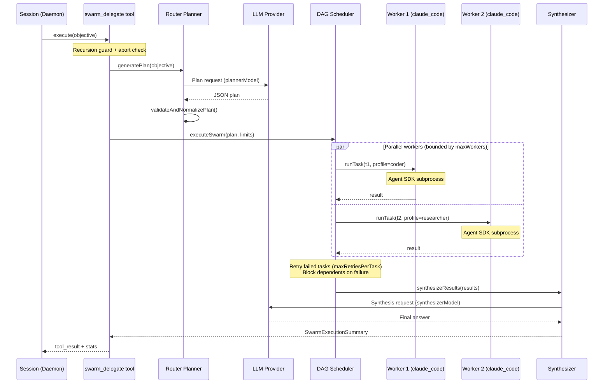
```mermaid
sequenceDiagram
    participant Session as Session (Daemon)
    participant Tool as swarm_delegate tool
    participant Planner as Router Planner
    participant LLM as LLM Provider
    participant Scheduler as DAG Scheduler
    participant W1 as Worker 1 (claude_code)
    participant W2 as Worker 2 (claude_code)
    participant Synth as Synthesizer

    Session->>Tool: execute(objective)
    Note over Tool: Recursion guard + abort check

    Tool->>Planner: generatePlan(objective)
    Planner->>LLM: Plan request (plannerModel)
    LLM-->>Planner: JSON plan
    Planner->>Planner: validateAndNormalizePlan()

    Tool->>Scheduler: executeSwarm(plan, limits)

    par Parallel workers (bounded by maxWorkers)
        Scheduler->>W1: runTask(t1, profile=coder)
        Note over W1: Agent SDK subprocess
        W1-->>Scheduler: result
    and
        Scheduler->>W2: runTask(t2, profile=researcher)
        Note over W2: Agent SDK subprocess
        W2-->>Scheduler: result
    end

    Note over Scheduler: Retry failed tasks (maxRetriesPerTask)<br/>Block dependents on failure

    Scheduler->>Synth: synthesizeResults(results)
    Synth->>LLM: Synthesis request (synthesizerModel)
    LLM-->>Synth: Final answer
    Synth-->>Tool: SwarmExecutionSummary
    Tool-->>Session: tool_result + stats
```

### Key design decisions

- **Recursion guard**: A module-level `Set<sessionId>` prevents concurrent swarms within the same session while allowing independent sessions to run their own swarms in parallel.
- **Abort signal**: The tool checks `context.signal?.aborted` before planning and before execution. The signal is also forwarded into `executeSwarm` and the worker backend, enabling cooperative cancellation of in-flight workers.
- **DAG scheduling**: Tasks with dependencies are topologically ordered. Independent tasks run in parallel up to `maxWorkers`.
- **Per-task retries**: Failed tasks retry up to `maxRetriesPerTask` before being marked failed. Dependents are transitively blocked.
- **Role-scoped profiles**: Workers run with restricted tool access based on their role (coder, researcher, reviewer, general).
- **Synthesis fallback**: If the LLM synthesis call fails, a deterministic markdown summary is generated from task results.
- **Progress streaming**: Status events (`task_started`, `task_completed`, `task_failed`, `task_blocked`, `done`) are streamed via `context.onOutput`.

### Config knobs

| Config key | Default | Purpose |
|---|---:|---|
| `swarm.enabled` | `true` | Master switch for swarm orchestration |
| `swarm.maxWorkers` | `3` | Max concurrent worker processes (hard ceiling: 6) |
| `swarm.maxTasks` | `8` | Max tasks per plan (hard ceiling: 20) |
| `swarm.maxRetriesPerTask` | `1` | Per-task retry limit (hard ceiling: 3) |
| `swarm.workerTimeoutSec` | `900` | Worker timeout in seconds |
| `swarm.plannerModel` | (varies) | Model used for plan generation |
| `swarm.synthesizerModel` | (varies) | Model used for result synthesis |

---

## Opportunistic Message Queue — Handoff Flow

When the daemon is busy generating a response, the client can continue sending messages. These are queued (FIFO, max 10) and drained automatically at safe checkpoints in the tool loop, not only at full completion.

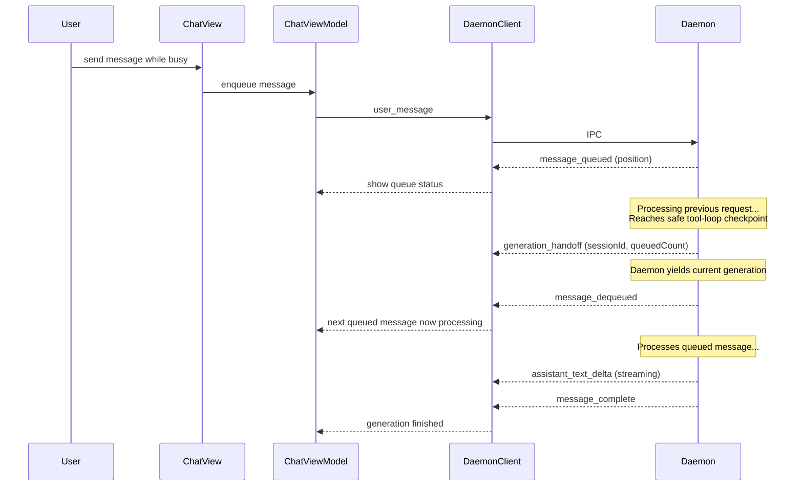
```mermaid
sequenceDiagram
    participant User
    participant Chat as ChatView
    participant VM as ChatViewModel
    participant DC as DaemonClient
    participant Daemon as Daemon

    User->>Chat: send message while busy
    Chat->>VM: enqueue message
    VM->>DC: user_message
    DC->>Daemon: IPC
    Daemon-->>DC: message_queued (position)
    DC-->>VM: show queue status

    Note over Daemon: Processing previous request...<br/>Reaches safe tool-loop checkpoint

    Daemon-->>DC: generation_handoff (sessionId, queuedCount)
    Note over Daemon: Daemon yields current generation

    Daemon-->>DC: message_dequeued
    DC-->>VM: next queued message now processing

    Note over Daemon: Processes queued message...

    Daemon-->>DC: assistant_text_delta (streaming)
    Daemon-->>DC: message_complete
    DC-->>VM: generation finished
```

---

## Trace System — Debug Panel Data Flow

The trace system provides real-time observability of daemon session internals. Each session creates a `TraceEmitter` that emits structured `trace_event` IPC messages as the session processes requests, makes LLM calls, and executes tools.

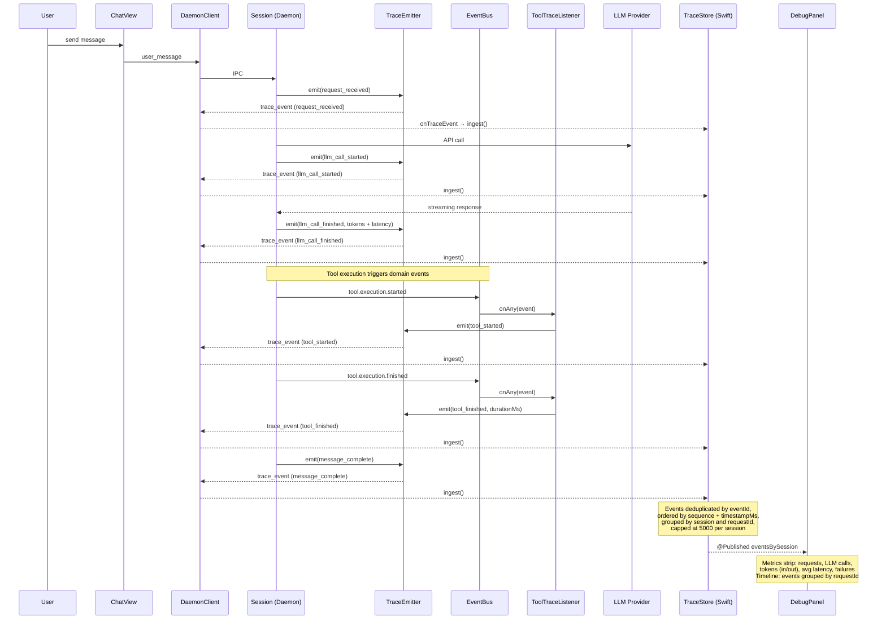
```mermaid
sequenceDiagram
    participant User
    participant Chat as ChatView
    participant DC as DaemonClient
    participant Daemon as Session (Daemon)
    participant TE as TraceEmitter
    participant EB as EventBus
    participant TTL as ToolTraceListener
    participant LLM as LLM Provider
    participant TS as TraceStore (Swift)
    participant DP as DebugPanel

    User->>Chat: send message
    Chat->>DC: user_message
    DC->>Daemon: IPC

    Daemon->>TE: emit(request_received)
    TE-->>DC: trace_event (request_received)
    DC-->>TS: onTraceEvent → ingest()

    Daemon->>LLM: API call
    Daemon->>TE: emit(llm_call_started)
    TE-->>DC: trace_event (llm_call_started)
    DC-->>TS: ingest()

    LLM-->>Daemon: streaming response
    Daemon->>TE: emit(llm_call_finished, tokens + latency)
    TE-->>DC: trace_event (llm_call_finished)
    DC-->>TS: ingest()

    Note over Daemon,EB: Tool execution triggers domain events

    Daemon->>EB: tool.execution.started
    EB->>TTL: onAny(event)
    TTL->>TE: emit(tool_started)
    TE-->>DC: trace_event (tool_started)
    DC-->>TS: ingest()

    Daemon->>EB: tool.execution.finished
    EB->>TTL: onAny(event)
    TTL->>TE: emit(tool_finished, durationMs)
    TE-->>DC: trace_event (tool_finished)
    DC-->>TS: ingest()

    Daemon->>TE: emit(message_complete)
    TE-->>DC: trace_event (message_complete)
    DC-->>TS: ingest()

    Note over TS: Events deduplicated by eventId,<br/>ordered by sequence + timestampMs,<br/>grouped by session and requestId,<br/>capped at 5000 per session

    TS-->>DP: @Published eventsBySession
    Note over DP: Metrics strip: requests, LLM calls,<br/>tokens (in/out), avg latency, failures<br/>Timeline: events grouped by requestId
```

### Trace Event Kinds

Events emitted during a session lifecycle:

| Kind | Emitted by | When |
|------|-----------|------|
| `request_received` | Handlers / Session | User message or surface action arrives |
| `request_queued` | Handlers / Session | Message queued while session is busy |
| `request_dequeued` | Session | Queued message begins processing |
| `llm_call_started` | Session | LLM API call initiated |
| `llm_call_finished` | Session | LLM API call completed (carries `inputTokens`, `outputTokens`, `latencyMs`) |
| `assistant_message` | Session | Assistant response assembled (carries `toolUseCount`) |
| `tool_started` | ToolTraceListener | Tool execution begins |
| `tool_permission_requested` | ToolTraceListener | Permission check needed (carries `riskLevel`) |
| `tool_permission_decided` | ToolTraceListener | Permission granted or denied (carries `decision`) |
| `tool_finished` | ToolTraceListener | Tool execution completed (carries `durationMs`) |
| `tool_failed` | ToolTraceListener | Tool execution failed (carries `durationMs`) |
| `secret_detected` | ToolTraceListener | Secret found in tool output |
| `generation_handoff` | Session | Yielding to next queued message |
| `message_complete` | Session | Full request processing finished |
| `generation_cancelled` | Session | User cancelled the generation |
| `request_error` | Handlers / Session | Unrecoverable error during processing (includes queue-full rejection and persist-failure paths) |

### Architecture

- **TraceEmitter** (daemon, per-session): Constructed with a `sessionId` and a `sendToClient` callback. Maintains a monotonic sequence counter for stable ordering. Truncates summaries to 200 chars and attribute values to 500 chars. Each call to `emit()` sends a `trace_event` IPC message to the connected client.
- **ToolTraceListener** (daemon): Subscribes to the session's `EventBus` via `onAny()` and translates tool domain events (`tool.execution.started`, `tool.execution.finished`, `tool.execution.failed`, `tool.permission.requested`, `tool.permission.decided`, `tool.secret.detected`) into trace events through the `TraceEmitter`.
- **DaemonClient** (Swift, shared): Decodes `trace_event` IPC messages into `TraceEventMessage` structs and invokes the `onTraceEvent` callback.
- **TraceStore** (Swift, macOS): `@MainActor ObservableObject` that ingests `TraceEventMessage` structs. Deduplicates by `eventId`, maintains stable sort order (sequence, then timestampMs, then insertion order), groups events by session and requestId, and enforces a retention cap of 5,000 events per session. Each request group is classified with a terminal status: `completed` (via `message_complete`), `cancelled` (via `generation_cancelled`), `handedOff` (via `generation_handoff`), `error` (via `request_error` or any event with `status == "error"`), or `active` (no terminal event yet).
- **DebugPanel** (Swift, macOS): SwiftUI view that observes `TraceStore`. Displays a metrics strip (request count, LLM calls, total tokens, average latency, tool failures) and a `TraceTimelineView` showing events grouped by requestId with color-coded status indicators. The timeline auto-scrolls to new events while the user is at the bottom; scrolling up pauses auto-scroll and shows a "Jump to bottom" button that resumes it.

---


---

## Assistant Events — SSE Transport Layer

The assistant-events system provides a single, shared publish path that fans out to both the Unix socket IPC layer (native clients) and an HTTP SSE endpoint (web/remote clients). There is no separate message schema for SSE — the `ServerMessage` payload is wrapped in an `AssistantEvent` envelope and serialised as JSON.

### Data Flow

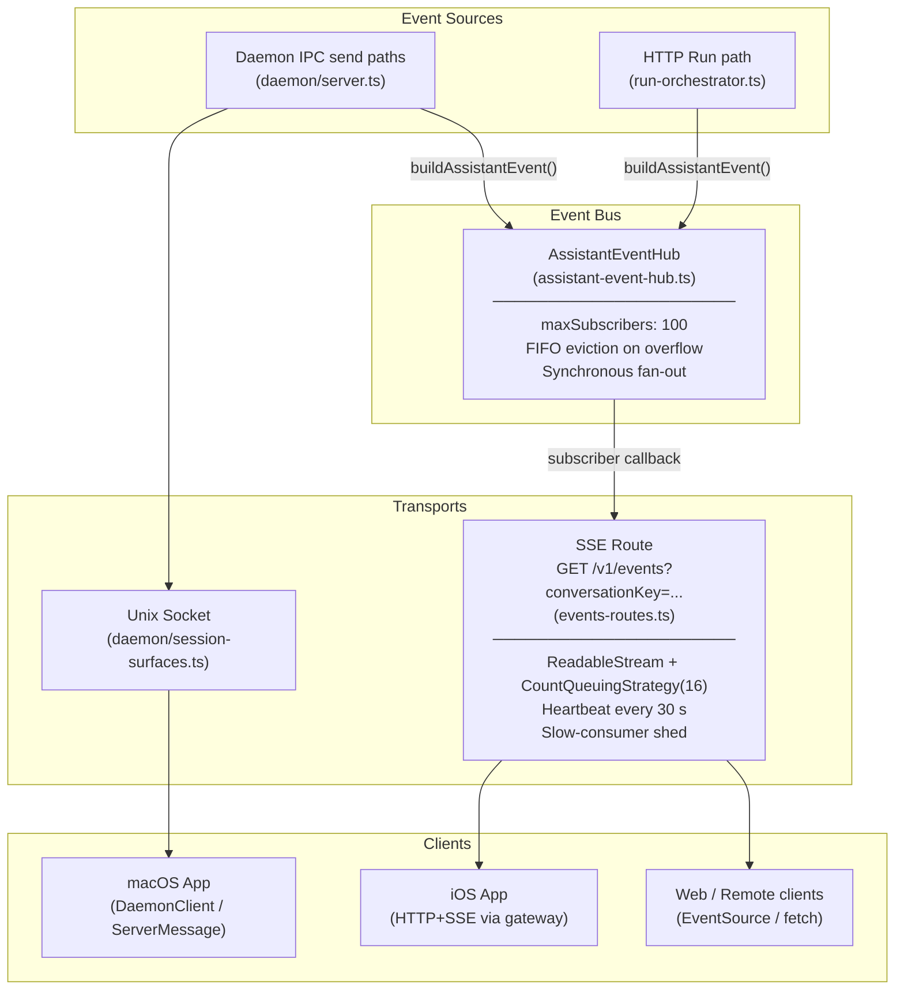
```mermaid
graph TB
    subgraph "Event Sources"
        direction TB
        IPC_DAEMON["Daemon IPC send paths<br/>(daemon/server.ts)"]
        HTTP_RUN["HTTP Run path<br/>(run-orchestrator.ts)"]
    end

    subgraph "Event Bus"
        HUB["AssistantEventHub<br/>(assistant-event-hub.ts)<br/>──────────────────────<br/>maxSubscribers: 100<br/>FIFO eviction on overflow<br/>Synchronous fan-out"]
    end

    subgraph "Transports"
        SSE_ROUTE["SSE Route<br/>GET /v1/events?conversationKey=...<br/>(events-routes.ts)<br/>──────────────────────<br/>ReadableStream + CountQueuingStrategy(16)<br/>Heartbeat every 30 s<br/>Slow-consumer shed"]
        SOCK["Unix Socket<br/>(daemon/session-surfaces.ts)"]
    end

    subgraph "Clients"
        MACOS["macOS App<br/>(DaemonClient / ServerMessage)"]
        IOS["iOS App<br/>(HTTP+SSE via gateway)"]
        WEB["Web / Remote clients<br/>(EventSource / fetch)"]
    end

    IPC_DAEMON -->|"buildAssistantEvent()"| HUB
    HTTP_RUN -->|"buildAssistantEvent()"| HUB
    IPC_DAEMON --> SOCK

    HUB -->|"subscriber callback"| SSE_ROUTE

    SOCK --> MACOS
    SSE_ROUTE --> IOS
    SSE_ROUTE --> WEB
```

### AssistantEvent Envelope

Every event published through the hub is wrapped in an `AssistantEvent` (defined in `runtime/assistant-event.ts`):

| Field | Type | Description |
|---|---|---|
| `id` | `string` (UUID) | Globally unique event identifier |
| `assistantId` | `string` | Logical assistant identifier (`"self"` for HTTP runs) |
| `sessionId` | `string?` | Resolved conversation ID when available |
| `emittedAt` | `string` (ISO-8601) | Server-side timestamp |
| `message` | `ServerMessage` | Unchanged IPC outbound message — no schema fork |

### SSE Frame Format

```
event: assistant_event\n
id: <uuid>\n
data: <JSON-serialised AssistantEvent>\n
\n
```

Keep-alive heartbeats (every 30 s by default):

```
: heartbeat\n
\n
```

### Subscription Lifecycle

| Event | Action |
|---|---|
| `GET /v1/events` received | Hub subscribes eagerly before `ReadableStream` is created |
| Client disconnects / aborts | `req.signal` abort listener disposes subscription and closes stream |
| Client cancels reader | `ReadableStream.cancel()` disposes subscription and closes stream |
| New connection pushes over cap (100) | Oldest subscriber evicted (FIFO); its `onEvict` callback closes its stream |
| Client buffer full (16 queued frames) | `desiredSize <= 0` guard sheds the subscriber immediately |

### Key Source Files

| File | Role |
|---|---|
| `assistant/src/runtime/assistant-event.ts` | `AssistantEvent` type, `buildAssistantEvent()` factory, SSE framing helpers |
| `assistant/src/runtime/assistant-event-hub.ts` | `AssistantEventHub` class and process-level singleton |
| `assistant/src/runtime/routes/events-routes.ts` | `handleSubscribeAssistantEvents()` — SSE route handler |
| `assistant/src/daemon/server.ts` | IPC send/broadcast paths that publish to the hub (`send` → `publishAssistantEvent`) |

---

## Notification System — Signal-Driven Decision Engine

The notification module (`assistant/src/notifications/`) uses a signal-based architecture where producers emit free-form events and an LLM-backed decision engine determines whether, where, and how to notify the user. See `assistant/src/notifications/README.md` for the full developer guide.

```
Producer → NotificationSignal → Decision Engine (LLM) → Deterministic Checks → Broadcaster → Conversation Pairing → Adapters → Delivery
                                       ↑                                                            ↓
                               Preference Summary                                    notification_thread_created IPC
```

### Channel Policy Registry

`assistant/src/channels/config.ts` is the **single source of truth** for per-channel notification behavior. Every `ChannelId` must have an entry in the `CHANNEL_POLICIES` map (enforced at compile time via `satisfies Record<ChannelId, ChannelNotificationPolicy>`). Each policy defines:

- **`deliveryEnabled`** — whether the channel can receive notification deliveries. The `NotificationChannel` type is derived from this flag: only channels with `deliveryEnabled: true` are valid notification targets.
- **`conversationStrategy`** — how the notification pipeline materializes conversations for the channel:
  - `start_new_conversation` — creates a fresh conversation per delivery (e.g. vellum desktop/mobile threads)
  - `continue_existing_conversation` — intended to append to an existing channel-scoped conversation; currently materializes a background audit conversation per delivery (e.g. Telegram)
  - `not_deliverable` — channel cannot receive notifications (e.g. voice)

Helper functions: `getDeliverableChannels()`, `getChannelPolicy()`, `isNotificationDeliverable()`, `getConversationStrategy()`.

### Conversation Pairing

Every notification delivery materializes a conversation + seed message **before** the adapter sends it (`conversation-pairing.ts`). This ensures:

1. Every delivery has an auditable conversation trail in the conversations table
2. The macOS/iOS client can deep-link directly into the notification thread
3. Delivery audit rows in `notification_deliveries` carry `conversation_id`, `message_id`, and `conversation_strategy` columns

The pairing function (`pairDeliveryWithConversation`) is resilient — errors are caught and logged without breaking the delivery pipeline.

### Notification Conversation Materialization

The notification pipeline uses a single conversation materialization path across producers:

1. **Canonical pipeline** (`emitNotificationSignal` → decision engine → broadcaster → conversation pairing → adapters): The broadcaster pairs each delivery with a conversation, then dispatches a `notification_intent` IPC event via the Vellum adapter. The IPC payload includes `deepLinkMetadata` (e.g. `{ conversationId }`) so the macOS/iOS client can deep-link to the relevant context when the user taps the notification.
2. **Guardian bookkeeping** (`dispatchGuardianQuestion`): Guardian dispatch creates `guardian_action_request` / `guardian_action_delivery` audit rows derived from pipeline delivery results and the per-dispatch `onThreadCreated` callback — there is no separate thread-creation path.

### Thread Surfacing via `notification_thread_created` IPC

When a vellum notification thread is paired with a conversation (strategy `start_new_conversation`), the broadcaster emits a `notification_thread_created` IPC event **immediately** (before waiting for slower channel deliveries like Telegram). This pushes the thread to the macOS/iOS client so it can display the notification thread in the sidebar and deep-link to it.

### IPC Thread-Created Events

Two IPC push events surface new threads in the macOS/iOS client sidebar:

- **`notification_thread_created`** — Emitted by `broadcaster.ts` when a notification delivery creates a vellum conversation (strategy `start_new_conversation`). Payload: `{ conversationId, title, sourceEventName }`.
- **`task_run_thread_created`** — Emitted by `work-item-runner.ts` when a task run creates a conversation. Payload: `{ conversationId, workItemId, title }`.

All events follow the same pattern: the daemon creates a server-side conversation, persists an initial message, and broadcasts the IPC event so the macOS `ThreadManager` can create a visible thread in the sidebar.

### Reminder Routing Metadata

Reminders carry optional `routingIntent` (`single_channel` | `multi_channel` | `all_channels`) and free-form `routingHints` metadata. When a reminder fires, this metadata flows through the notification signal into a post-decision enforcement step (`enforceRoutingIntent()` in `decision-engine.ts`) that overrides the LLM's channel selection to match the requested coverage. This enables single-reminder fanout: one reminder can produce multi-channel delivery without duplicate reminders. See `assistant/docs/architecture/scheduling.md` for the full trigger-time data flow.

### Channel Delivery

Notifications are delivered to three channel types:

- **Vellum (always connected)**: Local IPC via the daemon's broadcast mechanism. The `VellumAdapter` emits a `notification_intent` message with rendered copy and optional `deepLinkMetadata`.
- **Telegram (when guardian binding exists)**: HTTP POST to the gateway's `/deliver/telegram` endpoint. Requires an active guardian binding for the assistant.
- **SMS (when guardian binding exists)**: HTTP POST to the gateway's `/deliver/sms` endpoint. Follows the same pattern as Telegram; the `SmsAdapter` sends text-only messages via the Twilio Messages API. The `assistantId` is threaded through the delivery payload for multi-assistant phone number resolution.

Connected channels are resolved at signal emission time: vellum is always included, and binding-based channels (Telegram, SMS) are included only when an active guardian binding exists for the assistant.

**Key modules:**

| Module | Purpose |
|--------|---------|
| `assistant/src/channels/config.ts` | Channel policy registry — single source of truth for per-channel notification behavior |
| `assistant/src/notifications/emit-signal.ts` | Single entry point for all producers; orchestrates the full pipeline |
| `assistant/src/notifications/decision-engine.ts` | LLM-based routing decisions with deterministic fallback |
| `assistant/src/notifications/deterministic-checks.ts` | Hard invariant checks (dedupe, source-active suppression, channel availability) |
| `assistant/src/notifications/broadcaster.ts` | Dispatches decisions to channel adapters; emits `notification_thread_created` IPC |
| `assistant/src/notifications/conversation-pairing.ts` | Materializes conversation + message per delivery based on channel strategy |
| `assistant/src/notifications/adapters/macos.ts` | Vellum adapter — broadcasts `notification_intent` via IPC with deep-link metadata |
| `assistant/src/notifications/adapters/telegram.ts` | Telegram adapter — POSTs to gateway `/deliver/telegram` |
| `assistant/src/notifications/adapters/sms.ts` | SMS adapter — POSTs to gateway `/deliver/sms` via Twilio Messages API |
| `assistant/src/notifications/destination-resolver.ts` | Resolves per-channel endpoints (vellum IPC, Telegram chat ID from guardian binding) |
| `assistant/src/notifications/copy-composer.ts` | Template-based fallback copy when LLM copy is unavailable |
| `assistant/src/notifications/preference-extractor.ts` | Detects preference statements in conversation messages |
| `assistant/src/notifications/preferences-store.ts` | CRUD for user notification preferences |
| `assistant/src/config/bundled-skills/messaging/tools/send-notification.ts` | Explicit producer tool for user-requested notifications; emits signals into the same routing pipeline |
| `assistant/src/calls/guardian-dispatch.ts` | Guardian question dispatch that reuses canonical notification pairing and records guardian delivery bookkeeping from pipeline results |

**Audit trail (SQLite):** `notification_events` → `notification_decisions` → `notification_deliveries` (with `conversation_id`, `message_id`, `conversation_strategy`)

**Configuration:** `notifications.decisionModelIntent` in `config.json`.

---

## Storage Summary

| What | Where | Format | ORM/Driver | Retention |
|------|-------|--------|-----------|-----------|
| API key | macOS Keychain | Encrypted binary | `/usr/bin/security` CLI | Permanent |
| Credential secrets | macOS Keychain (or encrypted file fallback) | Encrypted binary | `secure-keys.ts` wrapper | Permanent (until deleted via tool) |
| Credential metadata | `~/.vellum/workspace/data/credentials/metadata.json` | JSON | Atomic file write | Permanent (until deleted via tool) |
| Integration OAuth tokens | macOS Keychain (or encrypted file fallback, via `secure-keys.ts`) | Encrypted binary | `TokenManager` auto-refresh | Until disconnected or revoked |
| User preferences | UserDefaults | plist | Foundation | Permanent |
| Session logs | `~/Library/.../logs/session-*.json` | JSON per session | Swift Codable | Unbounded |
| Conversations & messages | `~/.vellum/workspace/data/db/assistant.db` | SQLite + WAL | Drizzle ORM (Bun) | Permanent |
| Memory segments & FTS | `~/.vellum/workspace/data/db/assistant.db` | SQLite FTS5 | Drizzle ORM | Permanent |
| Extracted facts | `~/.vellum/workspace/data/db/assistant.db` | SQLite | Drizzle ORM | Permanent, deduped |
| Conflict lifecycle rows | `~/.vellum/workspace/data/db/assistant.db` | SQLite | Drizzle ORM | Pending until clarified, then retained as resolved history |
| Entity graph (entities/relations/item links) | `~/.vellum/workspace/data/db/assistant.db` | SQLite | Drizzle ORM | Permanent, deduped by unique relation edge |
| Embeddings | `~/.vellum/workspace/data/db/assistant.db` | JSON float arrays | Drizzle ORM | Permanent |
| Async job queue | `~/.vellum/workspace/data/db/assistant.db` | SQLite | Drizzle ORM | Completed jobs persist |
| Attachments | `~/.vellum/workspace/data/db/assistant.db` | Base64 in SQLite | Drizzle ORM | Permanent |
| Sandbox filesystem | `~/.vellum/workspace` | Real filesystem tree | Node FS APIs | Persistent across sessions |
| Tool permission rules | `~/.vellum/protected/trust.json` | JSON | File I/O | Permanent |
| Web users & assistants | PostgreSQL | Relational | Drizzle ORM (pg) | Permanent |
| Trace events | In-memory (TraceStore) | Structured events | Swift ObservableObject | Max 5,000 per session, ephemeral |
| Media embed settings | `~/.vellum/workspace/config.json` (`ui.mediaEmbeds`) | JSON | `WorkspaceConfigIO` (atomic merge) | Permanent |
| Media embed MIME cache | In-memory (`ImageMIMEProbe`) | `NSCache` (500 entries) | HTTP HEAD | Ephemeral; cleared on app restart |
| IPC blob payloads | `~/.vellum/workspace/data/ipc-blobs/` | Binary files (UUID names) | File I/O (atomic write) | Ephemeral; consumed on hydration, stale sweep every 5min |
| Tasks & task runs | `~/.vellum/workspace/data/db/assistant.db` | SQLite | Drizzle ORM | Permanent |
| Work items (Task Queue) | `~/.vellum/workspace/data/db/assistant.db` | SQLite | Drizzle ORM | Permanent; archived items retained |
| Recurrence schedules & runs | `~/.vellum/workspace/data/db/assistant.db` | SQLite | Drizzle ORM | Permanent; supports cron and RRULE syntax |
| Watchers & events | `~/.vellum/workspace/data/db/assistant.db` | SQLite | Drizzle ORM | Permanent, cascade on watcher delete |
| Proxy CA cert + key | `{dataDir}/proxy-ca/` | PEM files (ca.pem, ca-key.pem) | openssl CLI | Permanent (10-year validity) |
| Proxy leaf certs | `{dataDir}/proxy-ca/issued/` | PEM files per hostname | openssl CLI, cached | 1-year validity, re-issued on CA change |
| Proxy sessions | In-memory (SessionManager) | Map<ProxySessionId, ManagedSession> | Manual lifecycle | Ephemeral; 5min idle timeout, cleared on shutdown |
| Call sessions, events, pending questions | `~/.vellum/workspace/data/db/assistant.db` | SQLite | Drizzle ORM | Permanent, cascade on session delete |
| Active call controllers | In-memory (CallState) | Map<callSessionId, CallController> | Manual lifecycle | Ephemeral; cleared on call end or destroy |
| Guardian bindings | `~/.vellum/workspace/data/db/assistant.db` | SQLite | Drizzle ORM | Permanent; revoked bindings retained |
| Guardian verification challenges | `~/.vellum/workspace/data/db/assistant.db` | SQLite | Drizzle ORM | Permanent; consumed/expired challenges retained |
| Guardian approval requests | `~/.vellum/workspace/data/db/assistant.db` | SQLite | Drizzle ORM | Permanent; decision outcome retained |
| Ingress invites | `~/.vellum/workspace/data/db/assistant.db` | SQLite | Drizzle ORM | Permanent; token hash stored, raw token never persisted |
| Ingress members | `~/.vellum/workspace/data/db/assistant.db` | SQLite | Drizzle ORM | Permanent; revoked/blocked members retained |
| Notification events | `~/.vellum/workspace/data/db/assistant.db` | SQLite | Drizzle ORM | Permanent; deduplicated by dedupeKey |
| Notification decisions | `~/.vellum/workspace/data/db/assistant.db` | SQLite | Drizzle ORM | Permanent; FK to notification_events |
| Notification deliveries | `~/.vellum/workspace/data/db/assistant.db` | SQLite | Drizzle ORM | Permanent; FK to notification_decisions |
| Notification preferences | `~/.vellum/workspace/data/db/assistant.db` | SQLite | Drizzle ORM | Permanent; per-assistant conversational preferences |
| IPC transport | `~/.vellum/vellum.sock` | Unix domain socket | NWConnection (Swift) / Bun net | Ephemeral |


### Notifications

For full notification developer guidance and lifecycle details, see [`assistant/src/notifications/README.md`](src/notifications/README.md).
