# Assistant Architecture

This document owns assistant-runtime architecture details. The repo-level architecture index lives in [`/ARCHITECTURE.md`](../ARCHITECTURE.md).

### Channel Onboarding Playbook Bootstrap

- Transport metadata arrives via `session_create.transport` (HTTP) or `/channels/inbound` (`channelId`, optional `hints`, optional `uxBrief`).
- Telegram webhook ingress injects deterministic channel-safe transport metadata (`hints` + `uxBrief`) so non-dashboard channels defer dashboard-only UI tasks cleanly.
- `OnboardingPlaybookManager` resolves `<channel>_onboarding.md`, checks `onboarding/playbooks/registry.json`, and applies per-channel first-time fast-path onboarding.
- `OnboardingOrchestrator` derives onboarding-mode guidance (post-hatch sequence, USER.md capture) from playbook + transport context.
- Session runtime assembly injects both `<channel_onboarding_playbook>` and `<onboarding_mode>` context before provider calls, then strips both from persisted conversation history.
- Permission setup remains user-initiated and hatch + first-conversation flows avoid proactive permission asks.

### Guardian Actor Context (Unified Across Channels)

- Guardian/non-guardian/unverified classification is centralized in `assistant/src/runtime/trust-context-resolver.ts`.
- The same resolver is used by:
  - `/channels/inbound` (Telegram/WhatsApp path) before run orchestration.
  - Inbound Twilio voice setup (`RelayConnection.handleSetup`) to seed call-time actor context.
- Runtime channel runs pass this as `trustContext`, and session runtime assembly injects `<inbound_actor_context>` (via `inboundActorContextFromTrustContext()`) into provider-facing prompts.
- Voice calls mirror the same prompt contract: `CallController` receives guardian context on setup and refreshes it immediately after successful voice challenge verification, so the first post-verification turn is grounded as `actor_role: guardian`.
- Voice-specific behavior (DTMF/speech verification flow, relay state machine) remains voice-local; only actor-role resolution is shared.

### Single-Header JWT Auth Model

All HTTP API requests use a single `Authorization: Bearer <jwt>` header for authentication. The JWT carries identity, permissions, and policy versioning in a unified token.

**Token schema (JWT claims):**

| Claim           | Type                                    | Description                                                        |
| --------------- | --------------------------------------- | ------------------------------------------------------------------ |
| `iss`           | `'vellum-auth'`                         | Issuer — always `vellum-auth`                                      |
| `aud`           | `'vellum-daemon'` or `'vellum-gateway'` | Audience — which service the token targets                         |
| `sub`           | string                                  | Subject — encodes principal type and identity (see patterns below) |
| `scope_profile` | string                                  | Named permission bundle (see profiles below)                       |
| `exp`           | number                                  | Expiry timestamp (seconds since epoch)                             |
| `policy_epoch`  | number                                  | Policy version — stale tokens are rejected with `refresh_required` |
| `iat`           | number                                  | Issued-at timestamp                                                |
| `jti`           | string                                  | Unique token ID                                                    |

**Subject patterns:**

| Pattern                                  | Principal Type | Description                         |
| ---------------------------------------- | -------------- | ----------------------------------- |
| `actor:<assistantId>:<actorPrincipalId>` | `actor`        | Desktop, iOS, or CLI client         |
| `svc:gateway:<assistantId>`              | `svc_gateway`  | Gateway service (ingress, webhooks) |
| `svc:internal:<assistantId>:<sessionId>` | `svc_internal` | Internal service connections        |
| `svc:daemon:<identifier>`                | `svc_daemon`   | Daemon service token (local)        |

**Scope profiles:**

| Profile              | Scopes                                                                                                                                                | Used by                                      |
| -------------------- | ----------------------------------------------------------------------------------------------------------------------------------------------------- | -------------------------------------------- |
| `actor_client_v1`    | `chat.{read,write}`, `approval.{read,write}`, `settings.{read,write}`, `attachments.{read,write}`, `calls.{read,write}`, `feature_flags.{read,write}` | Desktop, iOS, CLI clients                    |
| `gateway_ingress_v1` | `ingress.write`, `internal.write`                                                                                                                     | Gateway channel inbound + webhook forwarding |
| `gateway_service_v1` | `settings.read`, `settings.write`, `internal.write`                                                                                                   | Gateway service-to-daemon calls              |
| `internal_v1`        | `internal.all`                                                                                                                                        | Internal service connections                 |

**Identity lifecycle:**

1. **Bootstrap (loopback-only, macOS)** — On first launch, the macOS client calls `POST /v1/guardian/init` with `{ platform, deviceId }`. The endpoint is loopback-only and mints a JWT access token + refresh token pair. Returns `{ guardianPrincipalId, accessToken, accessTokenExpiresAt, refreshToken, refreshTokenExpiresAt, refreshAfter, isNew }`. The CLI obtains its bearer token during `hatch` and does not perform a separate bootstrap step.

2. **iOS pairing** — iOS devices obtain JWTs through the QR pairing flow. The pairing response includes `accessToken` and `refreshToken` credentials.

3. **Refresh** — `POST /v1/guardian/refresh` accepts `{ refreshToken }` and returns a new access/refresh token pair. Single-use rotation with replay detection and family-based revocation.

4. **Local identity** — Local connections use deterministic identity resolution without tokens.

**Route policy enforcement:** Every protected endpoint declares required scopes and allowed principal types in `src/runtime/auth/route-policy.ts`. The `enforcePolicy()` function checks the AuthContext against these requirements and returns 403 when access is denied. A guard test ensures every dispatched endpoint has a corresponding policy entry.

**Credential storage:** Only hashed tokens are persisted. Access token hashes go in `credential_records`; refresh token hashes in `refresh_token_records`. Raw tokens are returned once and never stored server-side.

**Notification scoping:** Guardian-sensitive notifications are annotated with `targetGuardianPrincipalId` for identity-scoped delivery.

**Key source files:**

| File                                              | Purpose                                                                                       |
| ------------------------------------------------- | --------------------------------------------------------------------------------------------- |
| `src/runtime/auth/types.ts`                       | Core type definitions: `TokenClaims`, `AuthContext`, `ScopeProfile`, `Scope`, `PrincipalType` |
| `src/runtime/auth/token-service.ts`               | JWT signing, verification, and policy epoch management                                        |
| `src/runtime/auth/credential-service.ts`          | Credential pair minting (access token + refresh token)                                        |
| `src/runtime/auth/scopes.ts`                      | Scope profile resolver (`resolveScopeProfile`)                                                |
| `src/runtime/auth/context.ts`                     | AuthContext builder from JWT claims                                                           |
| `src/runtime/auth/subject.ts`                     | Subject string parser (`parseSub`)                                                            |
| `src/runtime/auth/middleware.ts`                  | JWT bearer auth middleware (`authenticateRequest`)                                            |
| `src/runtime/auth/route-policy.ts`                | Route-level scope/principal enforcement                                                       |
| `src/runtime/routes/guardian-bootstrap-routes.ts` | `POST /v1/guardian/init` (initial JWT issuance)                                               |
| `src/runtime/routes/guardian-refresh-routes.ts`   | `POST /v1/guardian/refresh` (token rotation)                                                  |
| `src/runtime/routes/pairing-routes.ts`            | JWT credential issuance in pairing flow                                                       |
| `src/runtime/local-actor-identity.ts`             | `resolveLocalGuardianContext` — deterministic local identity                                  |
| `src/memory/channel-verification-sessions.ts`     | Guardian binding types, verification session management                                       |

### Channel-Agnostic Scoped Approval Grants

Scoped approval grants allow a guardian's approval decision on one channel (e.g., Telegram) to authorize a tool execution on a different channel (e.g., voice). Two scope modes exist: `request_id` (bound to a specific pending request) and `tool_signature` (bound to `toolName` + canonical `inputDigest`). Grants are one-time-use, exact-match, fail-closed, and TTL-bound. Full architecture details (lifecycle flow, security invariants, key files) live in [`docs/architecture/security.md`](docs/architecture/security.md#channel-agnostic-scoped-approval-grants).

### Guardian Decision Primitive (Dual-Mode Approval)

All guardian approval decisions — regardless of how they arrive — route through a single unified primitive in `src/approvals/guardian-decision-primitive.ts`. This centralizes decision logic that was previously duplicated across callback button handlers, the conversational approval engine, and the requester self-cancel path.

**Core API:**

| Function                                          | Purpose                                                                                                                                                                                                                                                               |
| ------------------------------------------------- | --------------------------------------------------------------------------------------------------------------------------------------------------------------------------------------------------------------------------------------------------------------------- |
| `applyGuardianDecision(params)`                   | Apply a guardian decision atomically: downgrade `approve_always` for guardian-on-behalf requests, capture approval info, resolve the pending interaction, update the approval record, and mint a scoped grant on approve. Returns `{ applied, reason?, requestId? }`. |
| `listGuardianDecisionPrompts({ conversationId })` | List pending prompts for a conversation, aggregating channel guardian approval requests and pending confirmation interactions into a uniform `GuardianDecisionPrompt` shape.                                                                                          |

**Security invariants enforced by the primitive:**

- Decision application is identity-bound to the expected guardian identity.
- Decisions are first-response-wins (CAS-like stale protection via `handleChannelDecision`).
- `approve_always` is downgraded to `approve_once` for guardian-on-behalf requests (guardians cannot permanently allowlist tools for requesters).
- Scoped grant minting only fires on explicit approve for requests with tool metadata.

**Unified interaction model — buttons first, text fallback:** All guardian approval prompts follow a canonical "buttons first, text fallback" pattern. Structured button UIs are the primary interaction surface, but every prompt also carries deterministic text fallback instructions so guardians can always act even when buttons are unavailable or not used. This applies uniformly across all request kinds (`tool_approval`, `pending_question`, `access_request`) and all channels (macOS desktop, Telegram, WhatsApp).

**Button-first path (deterministic):**

- Desktop clients (macOS/iOS) render `GuardianDecisionPrompt` objects as tappable card UIs with kind-aware headers and action buttons. The `GuardianDecisionBubble` renders distinct headers for each kind: "Tool Approval Required", "Question Pending", or "Access Request".
- Desktop clients submit decisions via HTTP (`POST /v1/guardian-actions/decision`), routed through `applyCanonicalGuardianDecision`.
- Channel adapters (Telegram inline keyboards, WhatsApp) encode actions as callback data (`apr:<requestId>:<action>`).

**Text fallback path (always available):**

- Every prompt includes a `requestCode` (6-char alphanumeric). Guardians can reply with `<requestCode> approve` or `<requestCode> reject` on any channel.
- `access_request` prompts additionally embed explicit text directives in `questionText`: the request-code approve/reject directive and the `"open invite flow"` phrase for starting the Trusted Contacts invite flow.
- `pending_question` prompts (voice-originated) support `<requestCode> <your answer>` for free-text answers.
- The `routeGuardianReply` router processes text replies through a priority-ordered pipeline: callback parsing -> request code parsing -> NL classification. All paths converge on `applyCanonicalGuardianDecision`.

**Shared type system:** `GuardianDecisionPrompt` and `GuardianDecisionAction` (in `src/runtime/guardian-decision-types.ts`) define the structured prompt model. `buildDecisionActions()` computes the action set respecting `persistentDecisionsAllowed` and `forGuardianOnBehalf` flags. `buildPlainTextFallback()` generates parser-compatible text instructions. Channel adapters map these to channel-specific formats via `toApprovalActionOptions()` in `channel-approval-types.ts`.

**Key source files:**

| File                                           | Purpose                                                                                                                                           |
| ---------------------------------------------- | ------------------------------------------------------------------------------------------------------------------------------------------------- |
| `src/approvals/guardian-decision-primitive.ts` | Unified decision application: downgrade, approval info capture, `handleChannelDecision`, record update, grant minting                             |
| `src/runtime/guardian-decision-types.ts`       | Shared types: `GuardianDecisionPrompt`, `GuardianDecisionAction`, `buildDecisionActions`, `buildPlainTextFallback`, `ApplyGuardianDecisionResult` |
| `src/runtime/routes/guardian-action-routes.ts` | HTTP route handlers for `GET /v1/guardian-actions/pending` and `POST /v1/guardian-actions/decision`                                               |
| `src/runtime/channel-approval-types.ts`        | Channel-facing approval action types and `toApprovalActionOptions` bridge                                                                         |

### Temporary Approval Modes (Session-Scoped Overrides)

In addition to persistent trust rules (`always_allow` / `always_deny`), the approval system supports two **temporary** approval modes that auto-approve tool confirmations for the duration of a conversation or a fixed time window. These exist to reduce prompt fatigue during intensive sessions without permanently altering the trust configuration.

**Two modes:**

1. **`allow_conversation`** — Auto-approve all tool confirmations for the remainder of the current conversation. The override persists until the session ends, the conversation is closed, or the mode is explicitly cleared.
2. **`allow_10m`** — Auto-approve all tool confirmations for 10 minutes (configurable). The override expires lazily on the next read after the TTL elapses — no background sweep runs.

**Session-scoped, in-memory only:** Overrides are keyed by `conversationId` and stored in an in-memory `Map` inside `session-approval-overrides.ts`. They do not survive daemon restarts, which is intentional — temporary approvals should not outlive the session that created them.

**Integration with the permission pipeline:** The permission checker (`src/tools/permission-checker.ts`) checks for an active temporary override via `getEffectiveMode()` before prompting the user. If an active override exists for the current conversation, the confirmation is auto-approved without surfacing a prompt. This check runs after persistent trust rules, so a persistent `deny` rule still takes precedence.

**No persistent side effects:** Temporary modes do not write to `trust.json` or create persistent trust rules. They are purely ephemeral. The `buildDecisionActions()` function in `guardian-decision-types.ts` controls whether temporary options (`allow_10m`, `allow_conversation`) are surfaced in the approval prompt UI, gated by the `temporaryOptionsAvailable` flag.

**Key source files:**

| File                                        | Purpose                                                                                                                  |
| ------------------------------------------- | ------------------------------------------------------------------------------------------------------------------------ |
| `src/runtime/session-approval-overrides.ts` | In-memory store: `setConversationMode`, `setTimedMode`, `getEffectiveMode`, `clearMode`, `hasActiveOverride`, `clearAll` |
| `src/permissions/types.ts`                  | `UserDecision` type (includes `allow_10m`, `allow_conversation`, `temporary_override`), `isAllowDecision()` helper       |
| `src/runtime/guardian-decision-types.ts`    | `buildDecisionActions()` — controls which temporary options appear in approval prompts                                   |
| `src/tools/permission-checker.ts`           | Permission pipeline integration — checks temporary overrides before prompting                                            |

### Canonical Guardian Request System

The canonical guardian request system provides a channel-agnostic, unified domain for all guardian approval and question flows. It replaces the fragmented per-channel storage with a single source of truth that works identically for voice calls, Telegram/WhatsApp, and desktop UI.

**Architecture layers:**

1. **Canonical domain (single source of truth):** All guardian requests — tool approvals, pending questions, access requests — are persisted in the `canonical_guardian_requests` table (`src/memory/canonical-guardian-store.js`). Each request has a unique ID, a short human-readable request code, and a status that follows a CAS (compare-and-swap) lifecycle: `pending` -> `approved` | `denied` | `expired` | `cancelled`. Deliveries (notifications sent to guardians) are tracked in `canonical_guardian_deliveries`.

2. **Unified apply primitive (single write path):** `applyCanonicalGuardianDecision()` in `src/approvals/guardian-decision-primitive.ts` is the single write path for all guardian decisions. It enforces identity validation, expiry checks, CAS resolution, `approve_always` downgrade (guardian-on-behalf invariant), kind-specific resolver dispatch via the resolver registry, and scoped grant minting. All callers — HTTP API, inbound channel router, desktop session — route decisions through this function.

3. **Shared reply router (priority-ordered routing):** `routeGuardianReply()` in `src/runtime/guardian-reply-router.ts` provides a single entry point for all inbound guardian reply processing across channels. It routes through a priority-ordered pipeline: (a) deterministic callback parsing (button presses with `apr:<requestId>:<action>`), (b) request code parsing (6-char alphanumeric prefix), (c) NL classification via the conversational approval engine. All decisions flow through `applyCanonicalGuardianDecision`.

4. **Deterministic API (prompt listing and decision endpoints):** Desktop clients and API consumers use `GET /v1/guardian-actions/pending` and `POST /v1/guardian-actions/decision` (HTTP). These endpoints surface canonical requests alongside legacy pending interactions and channel approval records, with deduplication to avoid double-rendering.

5. **Buttons first, text fallback:** All request kinds (`tool_approval`, `pending_question`, `access_request`) are rendered as structured button cards when displayed in macOS/iOS guardian conversations. Each prompt also embeds deterministic text fallback instructions (request-code-based approve/reject directives, and for `access_request` the "open invite flow" phrase) so text-based channels and manual fallback always work. Code-only messages (just a request code without decision text) return clarification instead of auto-approving. Disambiguation with multiple pending requests stays fail-closed — no auto-resolve when the target is ambiguous.

**Resolver registry:** Kind-specific resolvers (`src/approvals/guardian-request-resolvers.ts`) handle side effects after CAS resolution. Built-in resolvers: `tool_approval` (channel/desktop approval path), `pending_question` (voice call question path), and `access_request` (trusted-contact verification session creation). New request kinds register resolvers without touching the core primitive.

**Expiry sweeps:** Three complementary sweeps run on 60-second intervals to clean up stale requests:

- `src/calls/guardian-action-sweep.ts` — voice call guardian action requests
- `src/runtime/routes/guardian-expiry-sweep.ts` — channel guardian approval requests
- `src/runtime/routes/canonical-guardian-expiry-sweep.ts` — canonical guardian requests (CAS-safe)

**Key source files:**

| File                                                    | Purpose                                                                                                       |
| ------------------------------------------------------- | ------------------------------------------------------------------------------------------------------------- |
| `src/memory/canonical-guardian-store.ts`                | Canonical request and delivery persistence (CRUD, CAS resolve, list with filters)                             |
| `src/approvals/guardian-decision-primitive.ts`          | Unified decision primitive: `applyCanonicalGuardianDecision` (canonical) and `applyGuardianDecision` (legacy) |
| `src/approvals/guardian-request-resolvers.ts`           | Resolver registry: kind-specific side-effect dispatch after CAS resolution                                    |
| `src/runtime/guardian-reply-router.ts`                  | Shared inbound router: callback -> code -> NL classification pipeline                                         |
| `src/runtime/routes/guardian-action-routes.ts`          | HTTP endpoints for prompt listing and decision submission                                                     |
| `src/runtime/routes/canonical-guardian-expiry-sweep.ts` | Canonical request expiry sweep                                                                                |

### Outbound Channel Verification (HTTP Endpoints)

Channel verification is initiated through gateway HTTP endpoints (which forward to runtime handlers). This enables chat-first verification where the assistant guides the user through channel verification setup via normal conversation.

**HTTP Endpoints:**

| Endpoint                                   | Method | Description                                                                                                                                                                                                                                                                                               |
| ------------------------------------------ | ------ | --------------------------------------------------------------------------------------------------------------------------------------------------------------------------------------------------------------------------------------------------------------------------------------------------------- |
| `/v1/channel-verification-sessions`        | POST   | Create a verification session. If `destination` is provided, starts outbound verification; if `purpose: "trusted_contact"` with `contactChannelId`, starts trusted contact verification; otherwise creates an inbound challenge. Body: `{ channel?, destination?, rebind?, purpose?, contactChannelId? }` |
| `/v1/channel-verification-sessions/resend` | POST   | Resend the verification code for an active outbound session. Body: `{ channel }`                                                                                                                                                                                                                          |
| `/v1/channel-verification-sessions`        | DELETE | Cancel all active sessions (inbound + outbound) for a channel. Body: `{ channel }`                                                                                                                                                                                                                        |
| `/v1/channel-verification-sessions/revoke` | POST   | Cancel all active sessions and revoke the guardian binding. Body: `{ channel? }`                                                                                                                                                                                                                          |
| `/v1/channel-verification-sessions/status` | GET    | Check guardian binding status. Query: `?channel=<channel>`                                                                                                                                                                                                                                                |

All endpoints are JWT-authenticated via `Authorization: Bearer <jwt>`. Skills and user-facing tooling should target the gateway URL (default `http://localhost:7830`), not the runtime port.

**Shared Business Logic:**

The HTTP route handlers (`channel-verification-routes.ts`) delegate to action functions in `verification-outbound-actions.ts`. This module contains transport-agnostic business logic for starting, resending, and cancelling outbound verification flows across Telegram and voice channels. It returns `OutboundActionResult` objects that the transport layer maps to the HTTP response format.

**Chat-First Orchestration Flow:**

1. The user asks the assistant (via desktop chat) to set up channel verification.
2. The conversational routing layer detects the verification-setup intent and loads the `guardian-verify-setup` skill via `skill_load`.
3. The skill guides the assistant through collecting the channel and destination, then calls the outbound HTTP endpoints using `curl`.
4. The assistant relays verification status (code sent, resend available, expiry) back to the user conversationally.
5. On the channel side, the verification code arrives (Telegram message or voice call) and the recipient enters it to complete the binding.

**Key Source Files:**

| File                                                       | Purpose                                                                                                              |
| ---------------------------------------------------------- | -------------------------------------------------------------------------------------------------------------------- |
| `src/runtime/verification-outbound-actions.ts`             | Shared business logic for start/resend/cancel outbound verification                                                  |
| `src/runtime/routes/channel-verification-routes.ts`        | HTTP route handlers for unified verification session API (`/v1/channel-verification-sessions`, `/revoke`, `/status`) |
| `src/config/bundled-skills/guardian-verify-setup/SKILL.md` | Skill that teaches the assistant how to orchestrate channel verification via chat                                    |

**Guardian-Only Tool Invocation Gate:**

Channel verification control-plane endpoints (`/v1/channel-verification-sessions/*`) are protected by a deterministic gate in the tool executor (`src/tools/executor.ts`). Before any tool invocation proceeds, the executor checks whether the invocation targets a guardian control-plane endpoint and whether the actor role is allowed. The policy uses an allowlist: only `guardian` and `undefined` (desktop/trusted) actor roles can invoke these endpoints. Non-guardian and unverified-channel actors receive a denial message explaining the restriction.

The policy is implemented in `src/tools/verification-control-plane-policy.ts`, which inspects tool inputs (bash commands, URLs) for verification endpoint paths. This is a defense-in-depth measure — even if the LLM attempts to call verification endpoints on behalf of a non-guardian actor, the tool executor blocks it deterministically.

The `guardian-verify-setup` skill is the exclusive handler for channel verification intents in the system prompt. Other skills (e.g., `phone-calls`) hand off to `guardian-verify-setup` rather than orchestrating verification directly.

### Guardian Action Timeout-to-Follow-Up Lifecycle

When a voice call's ASK_GUARDIAN consultation times out before the guardian responds, the system enters a follow-up lifecycle that allows the guardian to act on their late answer after the call has moved on. The entire flow uses LLM-generated copy (never hardcoded user-facing strings) to maintain a natural, conversational tone across voice and text channels.

**Lifecycle stages:**

```
 ASK_GUARDIAN fires on call
         |
         v
 [pending] -- guardian answers in time --> [answered] (normal flow)
         |
         | (timeout expires)
         v
 [expired, followup_state=none]
         |
         | (guardian replies late)
         v
 [expired, followup_state=awaiting_guardian_choice]
         |
         | (conversation engine classifies intent)
         v
 call_back / decline
         |                        |
         v                        v
 [dispatching]              [declined] (terminal)
         |
         | (executor runs action)
         v
 [completed] or [failed] (terminal)
```

**Generated messaging requirement:** All user-facing copy in the guardian timeout/follow-up path is generated through the `guardian-action-message-composer.ts` composition system, which uses a 2-tier priority chain: (1) daemon-injected LLM generator for natural, varied text; (2) deterministic fallback templates for reliability. No hardcoded user-facing strings exist in the flow files (call-controller, inbound-message-handler, session-process) outside of internal log messages and LLM-instruction prompts. A guard test (`guardian-action-no-hardcoded-copy.test.ts`) enforces this invariant.

**Callback branch:** When the conversation engine classifies the guardian's intent as `call_back`, the executor starts an outbound call to the counterparty with context about the guardian's answer. The counterparty phone number is resolved from the original call session by call direction (inbound: `fromNumber`; outbound: `toNumber`).

**Key source files:**

| File                                                    | Purpose                                                                                                                                                                                            |
| ------------------------------------------------------- | -------------------------------------------------------------------------------------------------------------------------------------------------------------------------------------------------- |
| `src/memory/guardian-action-store.ts`                   | Follow-up state machine with atomic transitions (`startFollowupFromExpiredRequest`, `progressFollowupState`, `finalizeFollowup`) and query helpers for pending/expired/follow-up deliveries        |
| `src/runtime/guardian-action-message-composer.ts`       | 2-tier text generation: daemon-injected LLM generator with deterministic fallback templates. Covers all scenarios from timeout acknowledgment through follow-up completion                         |
| `src/runtime/guardian-action-conversation-turn.ts`      | Follow-up decision engine: classifies guardian replies into `call_back`, `decline`, or `keep_pending` dispositions using LLM tool calling                                                          |
| `src/runtime/guardian-action-followup-executor.ts`      | Action dispatch: resolves counterparty from call session, executes `call_back` (outbound call via `startCall`), finalizes follow-up state                                                          |
| `src/daemon/guardian-action-generators.ts`              | Daemon-injected generator factories: `createGuardianActionCopyGenerator` (latency-optimized text rewriting) and `createGuardianFollowUpConversationGenerator` (tool-calling intent classification) |
| `src/calls/call-controller.ts`                          | Voice timeout handling: marks requests as timed out, sends expiry notices, injects `[GUARDIAN_TIMEOUT]` instruction for generated voice response                                                   |
| `src/runtime/routes/inbound-message-handler.ts`         | Late reply interception for Telegram channels: matches late answers to expired requests, routes follow-up conversation turns, dispatches actions                                                   |
| `src/daemon/session-process.ts`                         | Late reply interception for mac channel: same logic as inbound-message-handler but using conversation-ID-based delivery lookup                                                                     |
| `src/calls/guardian-action-sweep.ts`                    | Periodic sweep for stale pending requests; sends expiry notices to guardian destinations                                                                                                           |
| `src/memory/migrations/030-guardian-action-followup.ts` | Schema migration adding follow-up columns (`followup_state`, `late_answer_text`, `late_answered_at`, `followup_action`, `followup_completed_at`)                                                   |

### WhatsApp Channel (Meta Cloud API)

The WhatsApp channel enables inbound and outbound messaging via the Meta WhatsApp Business Cloud API. It follows the standard ingress/egress pattern with Meta's HMAC-SHA256 signature validation (`X-Hub-Signature-256`).

**Ingress** (`GET /webhooks/whatsapp` — verification, `POST /webhooks/whatsapp` — messages):

1. **Webhook verification**: Meta sends a `GET` with `hub.mode=subscribe`, `hub.verify_token`, and `hub.challenge`. The gateway compares `hub.verify_token` against `WHATSAPP_WEBHOOK_VERIFY_TOKEN` and echoes `hub.challenge` as plain text.
2. On `POST`, the gateway verifies the `X-Hub-Signature-256` header (HMAC-SHA256 of the raw request body using `WHATSAPP_APP_SECRET`) when the app secret is configured. Fail-closed: requests are rejected when the secret is set but the signature fails.
3. **Normalization**: Text and media messages (image, audio, video, document, sticker) from `messages` change fields are forwarded. Delivery receipts, read receipts, and unsupported message types (contacts, location) are silently acknowledged with `{ ok: true }`. Media attachments are downloaded from the WhatsApp Cloud API, uploaded to the runtime attachment store, and their IDs are passed alongside the message content.
4. **`/new` command**: When the message body is `/new` (case-insensitive), the gateway resolves routing, resets the conversation, and sends a confirmation message without forwarding to the runtime.
5. The payload is normalized into a `GatewayInboundEvent` with `sourceChannel: "whatsapp"` and `conversationExternalId` set to the sender's WhatsApp phone number (E.164).
6. WhatsApp message IDs are deduplicated via `StringDedupCache` (24-hour TTL).
7. The gateway marks each inbound message as read (best-effort, fire-and-forget).
8. The event is forwarded to the runtime via `POST /channels/inbound` with WhatsApp-specific transport hints and a `replyCallbackUrl` pointing to `/deliver/whatsapp`.

**Egress** (`POST /deliver/whatsapp`):

1. The runtime calls the gateway's `/deliver/whatsapp` endpoint with `{ to, text }` or `{ chatId, text }` (alias).
2. The gateway authenticates the request via bearer token (same fail-closed model as other deliver endpoints).
3. The gateway sends the message via the WhatsApp Cloud API `/{phoneNumberId}/messages` endpoint using the configured access token.
4. Text is split at 4096 characters if needed.

**Required credentials**:

- `WHATSAPP_PHONE_NUMBER_ID` — the numeric WhatsApp Business phone number ID from Meta
- `WHATSAPP_ACCESS_TOKEN` — System User or temporary access token
- `WHATSAPP_APP_SECRET` — App secret for webhook signature verification
- `WHATSAPP_WEBHOOK_VERIFY_TOKEN` — Token for the Meta webhook subscription handshake

These can be set via environment variables or stored in the credential vault (keychain / encrypted store) under the `whatsapp` service prefix.

**Limitations (v1)**: Rich approval UI (inline buttons) is not supported. Contacts and location message types are acknowledged but not forwarded.

**Channel Readiness**: The channel readiness HTTP endpoints (`GET /v1/channels/readiness`, `POST /v1/channels/readiness/refresh`) backed by `ChannelReadinessService` in `src/runtime/channel-readiness-service.ts` provide a unified readiness subsystem for all channels. Each channel registers a `ChannelProbe` that runs synchronous local checks (credential presence, ingress config) and optional async remote checks with a 5-minute TTL cache. Built-in probes: Telegram (bot token, webhook secret, ingress). The GET endpoint returns cached snapshots; the refresh endpoint invalidates the cache first. Unknown channels return `unsupported_channel`. Route handlers live in `src/runtime/routes/channel-readiness-routes.ts`.

### Slack Channel (Socket Mode)

The Slack channel provides text-based messaging via Slack's Socket Mode API. Unlike other channels that use HTTP webhooks, Slack uses a persistent WebSocket connection managed by the gateway — no public ingress URL is required. The assistant-side manages credential storage and validation through HTTP config endpoints.

**Control-plane endpoints** (`/v1/integrations/slack/channel/config`):

| Endpoint                                | Method | Description                                                                                                                                          |
| --------------------------------------- | ------ | ---------------------------------------------------------------------------------------------------------------------------------------------------- |
| `/v1/integrations/slack/channel/config` | GET    | Returns current config status: `hasBotToken`, `hasAppToken`, `connected`, plus workspace metadata (`teamId`, `teamName`, `botUserId`, `botUsername`) |
| `/v1/integrations/slack/channel/config` | POST   | Validates and stores credentials. Body: `{ botToken?: string, appToken?: string }`                                                                   |
| `/v1/integrations/slack/channel/config` | DELETE | Clears all Slack channel credentials from secure storage and credential metadata                                                                     |

All endpoints are JWT-authenticated via `Authorization: Bearer <jwt>`.

**Credential storage pattern:**

Both tokens are stored in the secure key store (macOS Keychain with encrypted file fallback):

| Secure key                           | Content                                                                    |
| ------------------------------------ | -------------------------------------------------------------------------- |
| `credential/slack_channel/bot_token` | Slack bot token (used for `chat.postMessage` and `auth.test`)              |
| `credential/slack_channel/app_token` | Slack app token (`xapp-...`, used for Socket Mode `apps.connections.open`) |

Workspace metadata (team ID, team name, bot user ID, bot username) is stored as JSON in the credential metadata store under `('slack_channel', 'bot_token')`.

**Token validation via `auth.test`:**

When a bot token is provided via `POST /v1/integrations/slack/channel/config`, the handler calls `POST https://slack.com/api/auth.test` with the token before storing it. A successful response yields workspace metadata (`team_id`, `team`, `user_id`, `user`) that is persisted alongside the token. If `auth.test` fails, the token is rejected and not stored.

The app token is validated by format only — it must start with `xapp-`.

**Connection status:**

Both `GET` and `POST` endpoints report `connected: true` only when both `hasBotToken` and `hasAppToken` are true. The `POST` endpoint additionally returns a `warning` field when only one token is stored, describing which token is missing.

**Key source files:**

| File                                               | Purpose                                                         |
| -------------------------------------------------- | --------------------------------------------------------------- |
| `src/daemon/handlers/config-slack-channel.ts`      | Business logic for get/set/clear Slack channel config           |
| `src/runtime/routes/integrations/slack/channel.ts` | HTTP route handlers for `/v1/integrations/slack/channel/config` |

### Trusted Contact Access (Channel-Agnostic)

External users who are not the guardian can gain access to the assistant through a guardian-mediated verification flow. The flow is channel-agnostic — it works identically on Telegram, voice, and any future channel.

**Full design doc:** [`docs/trusted-contact-access.md`](docs/trusted-contact-access.md)

**Flow summary:**

1. Unknown user messages the assistant on any channel.
2. Ingress ACL (`inbound-message-handler.ts`) rejects the message and emits an `ingress.access_request` notification signal to the guardian.
3. Guardian approves or denies via callback button or conversational intent (routed through `guardian-approval-interception.ts`).
4. On approval, an identity-bound verification session with a 6-digit code is created (`access-request-decision.ts` → `channel-verification-service.ts`).
5. Guardian gives the code to the requester out-of-band.
6. Requester enters the code; identity binding is verified, the challenge is consumed, and an active contact channel is created in the contacts table.
7. All subsequent messages are accepted through the ingress ACL.

**Channel-agnostic design:** The entire flow operates on abstract `ChannelId` and `actorExternalId`/`conversationExternalId` fields (DB column names `externalUserId`/`externalChatId` are unchanged). Identity binding adapts per channel: Telegram uses chat IDs, voice uses E.164 phone numbers, HTTP API uses caller-provided identity. No channel-specific branching exists in the trusted contact code paths.

**Lifecycle states:** `requested → pending_guardian → verification_pending → active | denied | expired`

**Notification signals:** The flow emits signals at each lifecycle transition via `emitNotificationSignal()`:

- `ingress.access_request` — unknown contact denied, guardian notified
- `ingress.trusted_contact.guardian_decision` — guardian approved or denied
- `ingress.trusted_contact.verification_sent` — code created and delivered
- `ingress.trusted_contact.activated` — requester verified, contact active
- `ingress.trusted_contact.denied` — guardian explicitly denied

**HTTP API (for management):**

| Endpoint                                 | Method | Description                                                      |
| ---------------------------------------- | ------ | ---------------------------------------------------------------- |
| `/v1/contacts`                           | GET    | List contacts (filterable by role, search by query/channel/etc.) |
| `/v1/contacts`                           | POST   | Create or update a contact                                       |
| `/v1/contacts/:id`                       | GET    | Get a contact by ID                                              |
| `/v1/contacts/merge`                     | POST   | Merge two contacts                                               |
| `/v1/contact-channels/:contactChannelId` | PATCH  | Update a contact channel's status/policy                         |

**Key source files:**

| File                                                   | Purpose                                                                       |
| ------------------------------------------------------ | ----------------------------------------------------------------------------- |
| `src/runtime/routes/inbound-message-handler.ts`        | Ingress ACL, unknown-contact rejection, verification code interception        |
| `src/runtime/routes/access-request-decision.ts`        | Guardian decision → verification session creation                             |
| `src/runtime/routes/guardian-approval-interception.ts` | Routes guardian decisions (button + conversational) to access request handler |
| `src/runtime/channel-verification-service.ts`          | Verification session lifecycle, identity binding, rate limiting               |
| `src/runtime/routes/contact-routes.ts`                 | HTTP API handlers for contact and channel management                          |
| `src/runtime/routes/invite-routes.ts`                  | HTTP API handlers for invite management                                       |
| `src/runtime/invite-service.ts`                        | Business logic for invite operations                                          |
| `src/contacts/contact-store.ts`                        | Contact read queries — lookup, search, list, and channel operations           |
| `src/memory/guardian-approvals.ts`                     | Approval request persistence                                                  |
| `src/memory/channel-verification-sessions.ts`          | Verification challenge persistence                                            |
| `src/config/bundled-skills/contacts/SKILL.md`          | Unified skill for contact management, access control, and invite links        |

### Guardian-Initiated Invite Links

A complementary access-granting flow where the guardian proactively creates a shareable invite link rather than waiting for an unknown user to request access. Currently implemented for Telegram; the architecture supports future channel adapters.

**Three-layer architecture:**

```
┌─────────────────────────────────────────────────────────────┐
│  Conversational Orchestration (guardian-invite-intent.ts)    │
│  Pattern-based intent detection → forces contacts            │
│  skill load for create / list / revoke actions               │
├─────────────────────────────────────────────────────────────┤
│  Channel Transport Adapters (channel-invite-transport.ts)    │
│  Registry of per-channel adapters:                           │
│    • buildShareableInvite(token) → { url, displayText }     │
│    • extractInboundToken(payload) → token | undefined        │
│  Registered: Telegram  │  Deferred: Slack, Voice             │
├─────────────────────────────────────────────────────────────┤
│  Core Redemption Engine (invite-redemption-service.ts)       │
│  Channel-agnostic token validation, expiry, use-count,       │
│  channel-match enforcement, contact activation/reactivation  │
│  Returns: InviteRedemptionOutcome (discriminated union)      │
│  Reply templates: invite-redemption-templates.ts             │
└─────────────────────────────────────────────────────────────┘
```

**Invite link flow (Telegram):**

1. Guardian asks the assistant to create an invite via desktop chat.
2. `guardian-invite-intent.ts` detects the intent and rewrites the message to force-load the `contacts` skill.
3. The skill calls the ingress HTTP API to create an invite token, then calls the Telegram transport adapter to build a deep link: `https://t.me/<bot>?start=iv_<token>`.
4. Guardian shares the link with the invitee out-of-band.
5. Invitee clicks the link, opening Telegram which sends `/start iv_<token>` to the bot.
6. The gateway forwards the message to `/channels/inbound`. The inbound handler calls `getInviteAdapterRegistry().get('telegram').extractInboundToken()` to parse the `iv_` token.
7. The token is redeemed via `invite-redemption-service.ts`, which validates, activates the contact, and returns a `redeemed` outcome.
8. A deterministic welcome message is delivered to the invitee (bypasses the LLM pipeline).

**Token prefix convention:** The `iv_` prefix distinguishes invite tokens from `gv_` (guardian verification) tokens. Both use the same Telegram `/start` deep-link mechanism but are routed to different handlers.

**Inbound intercept points:** Invite token extraction runs early in the inbound handler, before ACL denial, so valid invites short-circuit the contact check. Two intercept branches handle: (a) unknown contacts — the invite creates their first contact record; (b) inactive contacts (revoked/pending) — the invite reactivates them.

**Channel adapter status:**

| Channel  | Status   | Prerequisites                                                                                                                                                 |
| -------- | -------- | ------------------------------------------------------------------------------------------------------------------------------------------------------------- |
| Telegram | Shipped  | Bot username resolved from credential metadata or config                                                                                                      |
| Voice    | Shipped  | Identity-bound voice code redemption via DTMF/speech in the relay state machine. Always-on canonical behavior with personalized friend/guardian name prompts. |
| Slack    | Deferred | Needs DM-safe ingress — Socket Mode handles channel messages but DM-initiated invite flows need routing                                                       |

### Voice Invite Flow (invite_redemption_pending)

Voice invites use a short numeric code (4-10 digits, default 6) instead of a URL token. The guardian creates an invite bound to the invitee's E.164 phone number; the invitee redeems it by entering the code during an inbound voice call.

**Creation flow:**

1. Guardian creates a voice invite via `POST /v1/contacts/invites` with `sourceChannel: "phone"` and `expectedExternalUserId` (E.164 phone).
2. `invite-service.ts` generates a cryptographically random numeric code (`generateVoiceCode`), hashes it with SHA-256 (`hashVoiceCode`), and stores only the hash.
3. The one-time plaintext `voiceCode` is returned in the creation response. The raw token is NOT returned for voice invites — redemption uses the identity-bound code flow exclusively.
4. Guardian communicates the code to the invitee out-of-band.

**Call-time redemption subflow (`invite_redemption_pending`):**

1. Unknown caller dials in. `relay-server.ts` resolves trust via `resolveActorTrust`. Caller is `unknown`, no pending guardian challenge.
2. The relay checks `findActiveVoiceInvites` for invites bound to the caller's phone number.
3. If active, non-expired invites exist, the relay enters the `invite_redemption_pending` state (reuses the `verification_pending` connection state) and prompts the caller with personalized copy: `Welcome <friend-name>. Please enter the 6-digit code that <guardian-name> provided you to verify your identity.`
4. `redeemVoiceInviteCode` validates: identity match, code hash match, expiry, use count. On success, the contact is activated and the call transitions to the normal call flow.
5. On invalid/expired code, the caller hears deterministic failure copy: `Sorry, the code you provided is incorrect or has since expired. Please ask <guardian-name> for a new code. Goodbye.` and the call ends immediately.

**Security invariants:**

- The plaintext voice code is returned exactly once at creation time and never stored.
- Voice invites are identity-bound: `expectedExternalUserId` must match the caller's E.164 number. An attacker with the code but the wrong phone number cannot redeem.
- Failure responses are intentionally generic (`invalid_or_expired`) to prevent oracle attacks.
- Blocked contacts cannot bypass the guardian's explicit block via invite redemption.

**Key source files:**

| File                                                | Purpose                                                                                                            |
| --------------------------------------------------- | ------------------------------------------------------------------------------------------------------------------ |
| `src/runtime/invite-redemption-service.ts`          | Core redemption engine — token validation, voice code redemption, contact activation, discriminated-union outcomes |
| `src/runtime/invite-redemption-templates.ts`        | Deterministic reply templates for each redemption outcome                                                          |
| `src/runtime/channel-invite-transport.ts`           | Transport adapter registry with `buildShareableInvite` / `extractInboundToken` interface                           |
| `src/runtime/channel-invite-transports/telegram.ts` | Telegram adapter — `t.me/<bot>?start=iv_<token>` deep links, `/start iv_<token>` extraction                        |
| `src/runtime/channel-invite-transports/voice.ts`    | Voice transport adapter — code-based redemption metadata                                                           |
| `src/daemon/guardian-invite-intent.ts`              | Intent detection — routes create/list/revoke requests into the contacts skill                                      |
| `src/runtime/invite-service.ts`                     | Shared business logic for invite operations (used by HTTP routes)                                                  |
| `src/runtime/routes/invite-routes.ts`               | HTTP API handlers for invite management including voice invite creation and redemption                             |
| `src/runtime/routes/inbound-message-handler.ts`     | Invite token intercept in the inbound flow (unknown-contact and inactive-contact branches)                         |
| `src/calls/relay-server.ts`                         | Voice relay state machine — `invite_redemption_pending` subflow (always-on canonical behavior)                     |
| `src/util/voice-code.ts`                            | Cryptographic voice code generation and SHA-256 hashing                                                            |
| `src/memory/invite-store.ts`                        | Invite persistence including `findActiveVoiceInvites` for identity-bound lookup                                    |

### Voice Inbound Security Model (Canonical)

The voice inbound security model determines how unknown callers are handled when they dial in. Three paths exist, evaluated in priority order by `relay-server.ts` during the `handleSetup` phase. All guardian decisions route through `applyCanonicalGuardianDecision` in the canonical guardian request system.

**Decision tree for inbound unknown callers:**

```
Unknown caller dials in
        |
        v
resolveActorTrust() → trustClass
        |
        ├── guardian / trusted_contact → normal call flow
        ├── blocked → immediate denial + disconnect
        ├── policy: deny → immediate denial + disconnect
        ├── policy: escalate → denial (voice cannot hold for async approval)
        |
        └── unknown (no binding) ──┐
                                   |
              ┌────────────────────┼──────────────────────┐
              |                    |                       |
    pendingChallenge?     activeVoiceInvites?      no invite, no challenge
              |                    |                       |
              v                    v                       v
    Guardian verification   Invite redemption     Name capture +
    (DTMF/speech code)     (personalized code)   guardian approval wait
```

**Path 1: Voice invite code redemption (guardian-initiated)**

The guardian proactively creates a voice invite bound to the caller's E.164 phone number. When the unknown caller dials in and has an active, non-expired invite, the relay enters the `invite_redemption_pending` subflow with personalized prompts using the friend's and guardian's names. This is always-on canonical behavior (no feature flag). See [Voice Invite Flow](#voice-invite-flow-invite_redemption_pending) above.

**Path 2: Live in-call guardian approval (friend-initiated)**

When no invite exists and no pending guardian challenge is active, the relay enters the name capture + guardian approval wait flow:

1. The relay transitions to `awaiting_name` state and prompts the caller for their name with a timeout.
2. On name capture, `notifyGuardianOfAccessRequest` creates a canonical guardian request (`kind: 'access_request'`) and notifies the guardian via the notification pipeline.
3. The relay transitions to `awaiting_guardian_decision` and plays hold music/messaging while polling the canonical request status.
4. The guardian approves or denies via any channel (Telegram, desktop). All decisions route through `applyCanonicalGuardianDecision`, which dispatches to the `access_request` resolver in `guardian-request-resolvers.ts`.
5. On approval: the resolver directly activates the caller as a trusted contact (sets channel `status: 'active'`, `policy: 'allow'`), the poll detects the approved status, the relay transitions to the normal call flow with the caller's guardian context updated.
6. On denial or timeout: the caller hears a denial message and the call ends.

**Path 3: Inbound guardian verification (pending challenge)**

When a pending voice guardian challenge exists (`getPendingSession`), the caller enters the DTMF/speech verification flow to complete an outbound-initiated guardian binding. This path is for guardian identity verification, not trusted-contact access.

**Canonical decision routing:**

All guardian decisions for voice access requests flow through:

- `applyCanonicalGuardianDecision` (canonical guardian request system)
- `accessRequestResolver` in `guardian-request-resolvers.ts` (kind-specific resolver)
- For voice approvals: direct trusted-contact activation (no verification session needed since the caller is already on the line)
- For text-channel access requests: verification session creation with 6-digit code (existing `access-request-decision.ts` path for legacy `channel_guardian_approval_requests`)

**Key source files:**

| File                                           | Purpose                                                                                |
| ---------------------------------------------- | -------------------------------------------------------------------------------------- |
| `src/calls/relay-server.ts`                    | Inbound call decision tree, name capture, guardian approval wait polling               |
| `src/runtime/access-request-helper.ts`         | Creates canonical access request and notifies guardian                                 |
| `src/approvals/guardian-decision-primitive.ts` | `applyCanonicalGuardianDecision` — unified decision primitive                          |
| `src/approvals/guardian-request-resolvers.ts`  | `access_request` resolver — voice direct activation, text-channel verification session |
| `src/runtime/actor-trust-resolver.ts`          | `resolveActorTrust` — caller trust classification                                      |
| `src/memory/canonical-guardian-store.ts`       | Canonical request persistence and CAS resolution                                       |

### Update Bulletin System

Release-driven update notification system that surfaces release notes to the assistant via the system prompt.

**Data flow:**

1. **Bundled template** (`src/prompts/templates/UPDATES.md`) — source of release notes, maintained per-release in the repo.
2. **Startup sync** (`syncUpdateBulletinOnStartup()` in `src/config/update-bulletin.ts`) — materializes the bundled template into the workspace `UPDATES.md` on daemon boot. Uses atomic write (temp + rename) for crash safety.
3. **System prompt injection** — `buildSystemPrompt()` reads workspace `UPDATES.md` and injects it as a `## Recent Updates` section with judgment-based handling instructions.
4. **Completion by deletion** — the assistant deletes `UPDATES.md` when it has actioned all updates. Next startup detects the deletion and marks those releases as completed in checkpoint state.
5. **Cross-release merge** — if pending updates from a prior release exist when a new release lands, both release blocks coexist in the same file.

**Checkpoint keys** (in `memory_checkpoints` table):

- `updates:active_releases` — JSON array of version strings currently active.
- `updates:completed_releases` — JSON array of version strings already completed.

**Key source files:**

| File                                   | Purpose                                                   |
| -------------------------------------- | --------------------------------------------------------- |
| `src/prompts/templates/UPDATES.md`     | Bundled release-note template                             |
| `src/config/update-bulletin.ts`        | Startup sync logic (materialize, delete-complete, merge)  |
| `src/config/update-bulletin-format.ts` | Release block formatter/parser helpers                    |
| `src/config/update-bulletin-state.ts`  | Checkpoint state helpers for active/completed releases    |
| `src/prompts/system-prompt.ts`         | Prompt injection of updates section                       |
| `src/daemon/config-watcher.ts`         | File watcher — evicts sessions on UPDATES.md changes      |
| `src/permissions/defaults.ts`          | Auto-allow rules for file_read/write/edit + rm UPDATES.md |

---

### Assistant Feature Flags — Resolver and Enforcement Points

The assistant feature-flag resolver (`src/config/assistant-feature-flags.ts`) is the canonical module for determining whether an assistant feature flag is enabled. It loads default values from the unified registry at `meta/feature-flags/feature-flag-registry.json` (bundled copy at `src/config/feature-flag-registry.json`) and resolves the effective state for each declared assistant-scope flag. Assistant feature flags are declaration-driven assistant-scoped booleans that can gate any assistant behavior; skill availability is one consumer.

**Canonical key format:** `feature_flags.<flag_id>.enabled` (e.g., `feature_flags.hatch-new-assistant.enabled`).

**Resolution priority** (highest wins):

1. `config.assistantFeatureFlagValues[key]` — canonical config section, written by the gateway's PATCH endpoint
2. Defaults registry `defaultEnabled` — from the unified registry (`meta/feature-flags/feature-flag-registry.json`, filtered to `scope: "assistant"`)
3. `true` — unknown/undeclared flags with no persisted override default to enabled

**Storage:** Flags are persisted in `~/.vellum/workspace/config.json` in the `assistantFeatureFlagValues` section (managed by the gateway's `/v1/feature-flags` API — see [`gateway/ARCHITECTURE.md`](../gateway/ARCHITECTURE.md)). The daemon's config watcher hot-reloads this file, so flag changes take effect on the next tool resolution or session.

**Public API:**

- `isAssistantFeatureFlagEnabled(key, config)` — full resolver with the canonical key
- `skillFlagKey(skill)` — takes a skill object (anything with a `featureFlag` field) and returns the canonical flag key (`string`) if the skill declares a `featureFlag` in its SKILL.md frontmatter, or `undefined` if it does not (in `config/skill-state.ts`)

**Skill-gating guarantee:** Skill feature-flag gating is **opt-in**: only skills whose SKILL.md frontmatter contains a `featureFlag` field are gated. Skills without the field are always available regardless of feature flag state. For skills that declare a `featureFlag`, when the corresponding flag is OFF the skill is unavailable everywhere — it cannot appear in client UIs, model context, or runtime tool execution. This is enforced at six independent points:

| Enforcement Point                  | Module                                                   | Effect                                                                                                                                                                                                      |
| ---------------------------------- | -------------------------------------------------------- | ----------------------------------------------------------------------------------------------------------------------------------------------------------------------------------------------------------- |
| **1. Client skill list**           | `resolveSkillStates()` in `config/skill-state.ts`        | Skills with flag OFF are excluded from the resolved list returned to clients (macOS skill list, settings UI). The skill never appears in the client.                                                        |
| **2. System prompt skill catalog** | `appendSkillsCatalog()` in `prompts/system-prompt.ts`    | The model-visible `## Skills Catalog` section in the system prompt filters out flagged-off skills. The model cannot see or reference them.                                                                  |
| **3. `skill_load` tool**           | `executeSkillLoad()` in `tools/skills/load.ts`           | If the model attempts to load a flagged-off skill by name, the tool returns an error: `"skill is currently unavailable (disabled by feature flag)"`.                                                        |
| **4. Runtime tool projection**     | `projectSkillTools()` in `daemon/session-skill-tools.ts` | Even if a skill was previously active in a session (has `<loaded_skill>` markers in history), the per-turn projection drops it when the flag is OFF. Already-registered tools are unregistered.             |
| **5. Included child skills**       | `executeSkillLoad()` in `tools/skills/load.ts`           | When a parent skill includes children via the `includes` directive, each child is independently checked against its feature flag. Flagged-off children are silently excluded from the loaded skill content. |
| **6. Skill install gate**          | `installSkill()` in `daemon/handlers/skills.ts`          | When a client requests skill installation, the function checks the skill's feature flag before proceeding. If the flag is OFF, the install is rejected with an error.                                       |

All six enforcement points derive the flag key via `skillFlagKey(skill)` — which returns `undefined` for ungated skills, short-circuiting the check — and then call `isAssistantFeatureFlagEnabled(flagKey, config)` for consistency.

**Migration path:** The legacy `skills.<id>.enabled` key format is no longer supported. All code must use the canonical `feature_flags.<id>.enabled` format. Guard tests enforce canonical key usage and declaration coverage for literal key references in the unified registry.

**Key source files:**

| File                                            | Purpose                                                                                                                                                                   |
| ----------------------------------------------- | ------------------------------------------------------------------------------------------------------------------------------------------------------------------------- |
| `src/config/assistant-feature-flags.ts`         | Canonical resolver: `isAssistantFeatureFlagEnabled()`, `getAssistantFeatureFlagDefaults()`, registry loader                                                               |
| `src/config/skill-state.ts`                     | `skillFlagKey(skill)` — returns canonical flag key for skills with a `featureFlag` frontmatter field, `undefined` otherwise; `resolveSkillStates()` — enforcement point 1 |
| `src/prompts/system-prompt.ts`                  | `appendSkillsCatalog()` — enforcement point 2                                                                                                                             |
| `src/tools/skills/load.ts`                      | `executeSkillLoad()` — enforcement points 3 and 5                                                                                                                         |
| `src/daemon/session-skill-tools.ts`             | `projectSkillTools()` — enforcement point 4                                                                                                                               |
| `src/config/schema.ts`                          | `assistantFeatureFlagValues` field definition in `AssistantConfig` (Zod schema)                                                                                           |
| `src/daemon/handlers/skills.ts`                 | `listSkills()` — uses `resolveSkillStates()` for client responses; `installSkill()` — enforcement point 6                                                                 |
| `meta/feature-flags/feature-flag-registry.json` | Unified feature flag registry (repo root) — all declared flags with scope, label, default values, and descriptions                                                        |
| `src/config/feature-flag-registry.json`         | Bundled copy of the unified registry for compiled binary resolution                                                                                                       |

---

## Data Persistence — Where Everything Lives

```mermaid
graph LR
    subgraph "macOS Keychain"
        K1["API Key<br/>service: vellum-assistant<br/>account: anthropic<br/>stored via /usr/bin/security CLI"]
        K2["Credential Secrets<br/>key: credential/{service}/{field}<br/>stored via secure-keys.ts<br/>(encrypted file fallback if Keychain unavailable)"]
    end

    subgraph "UserDefaults (plist)"
        UD1["hasCompletedOnboarding"]
        UD2["assistantName"]
        UD3["activationKey (fn/ctrl)"]
        UD4["ambientAgentEnabled"]
        UD5["ambientCaptureInterval"]
        UD6["maxStepsPerSession"]
    end

    subgraph "~/Library/Application Support/vellum-assistant/"
        direction TB
        SL["logs/session-*.json<br/>───────────────<br/>Per-session JSON log<br/>task, start/end times, result<br/>Per-turn: AX tree, screenshot,<br/>action, token usage"]
    end

    subgraph "~/.vellum/workspace/data/db/assistant.db (SQLite + WAL)"
        direction TB
        CONV["conversations<br/>───────────────<br/>id, title, timestamps<br/>token counts, estimated cost<br/>context_summary (compaction)<br/>conversation_type: 'standard' | 'private'<br/>memory_scope_id: 'default' | 'private:&lt;uuid&gt;'"]
        MSG["messages<br/>───────────────<br/>id, conversation_id (FK)<br/>role: user | assistant<br/>content: JSON array<br/>created_at"]
        TOOL["tool_invocations<br/>───────────────<br/>tool_name, input, result<br/>decision, risk_level<br/>duration_ms"]
        SEG["memory_segments<br/>───────────────<br/>Text chunks for retrieval<br/>Linked to messages<br/>token_estimate per segment"]
        ITEMS["memory_items<br/>───────────────<br/>Extracted facts/entities<br/>kind, subject, statement<br/>confidence, fingerprint (dedup)<br/>verification_state, scope_id<br/>first/last seen timestamps"]
        SUM["memory_summaries<br/>───────────────<br/>scope: conversation | weekly<br/>Compressed history for context<br/>window management"]
        EMB["memory_embeddings<br/>───────────────<br/>target: segment | item | summary<br/>provider + model metadata<br/>vector_json (float array)<br/>Powers semantic search"]
        JOBS["memory_jobs<br/>───────────────<br/>Async task queue<br/>Types: embed, extract,<br/>summarize, backfill, cleanup<br/>Status: pending → running →<br/>completed | failed"]
        ATT["attachments<br/>───────────────<br/>base64-encoded file data<br/>mime_type, size_bytes<br/>Linked to messages via<br/>message_attachments join"]
        REM["reminders<br/>───────────────<br/>One-time scheduled reminders<br/>label, message, fireAt<br/>mode: notify | execute<br/>status: pending → fired | cancelled<br/>routing_intent: single_channel |<br/>multi_channel | all_channels<br/>routing_hints_json (free-form)"]
        SCHED_JOBS["cron_jobs (recurrence schedules)<br/>───────────────<br/>Recurring schedule definitions<br/>cron_expression: cron or RRULE string<br/>schedule_syntax: 'cron' | 'rrule'<br/>timezone, message, next_run_at<br/>enabled, retry_count<br/>Legacy alias: scheduleJobs"]
        SCHED_RUNS["cron_runs (schedule runs)<br/>───────────────<br/>Execution history per schedule<br/>job_id (FK → cron_jobs)<br/>status: ok | error<br/>duration_ms, output, error<br/>Legacy alias: scheduleRuns"]
        TASKS["tasks<br/>───────────────<br/>Reusable prompt templates<br/>title, Handlebars template<br/>inputSchema, contextFlags<br/>requiredTools, status"]
        TASK_RUNS["task_runs<br/>───────────────<br/>Execution history per task<br/>taskId (FK → tasks)<br/>conversationId, status<br/>startedAt, finishedAt, error"]
        WORK_ITEMS["work_items<br/>───────────────<br/>Task Queue entries<br/>taskId (FK → tasks)<br/>title, notes, status<br/>priority_tier (0-3), sort_index<br/>last_run_id, last_run_status<br/>source_type, source_id"]
    end

    subgraph "~/.vellum/ (Root Files)"
        TRUST["protected/trust.json<br/>Tool permission rules"]
        FF_TOKEN["feature-flag-token<br/>Client token for feature-flag API"]
    end

    subgraph "~/.vellum/workspace/ (Workspace Files)"
        CONFIG["config files<br/>Hot-reloaded by daemon<br/>(includes assistantFeatureFlagValues)"]
        ONBOARD_PLAYBOOKS["onboarding/playbooks/<br/>[channel]_onboarding.md<br/>assistant-updatable checklists"]
        ONBOARD_REGISTRY["onboarding/playbooks/registry.json<br/>channel-start index for fast-path + reconciliation"]
        APPS_STORE["data/apps/<br/><app-id>.json + pages/*.html<br/>User-created apps stored here"]
        SKILLS_DIR["skills/<br/>managed skill directories<br/>SKILL.md + TOOLS.json + tools/"]
    end

    subgraph "PostgreSQL (Web Server Only)"
        PG["assistants, users,<br/>channel_accounts,<br/>channel_contacts,<br/>api_tokens, api_keys<br/>───────────────<br/>Multi-tenant management<br/>Billing & provisioning"]
    end
```

---

---

## Web Server — Connection Modes

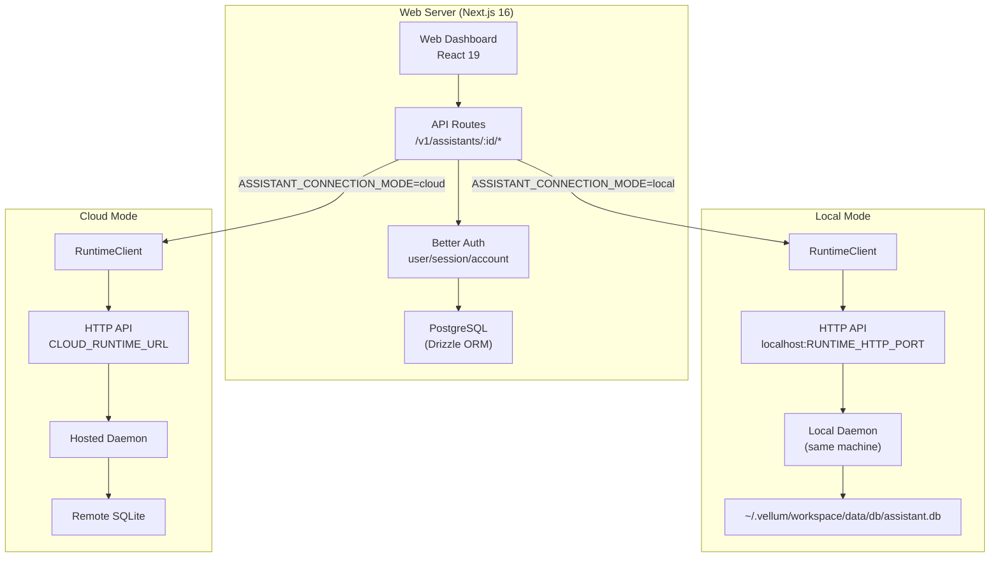

---

## Client-Server Communication — HTTP + SSE

All client-server communication uses HTTP for request/response operations and Server-Sent Events (SSE) for streaming server-to-client events. The runtime HTTP server (`RUNTIME_HTTP_PORT`, default 7821) is the sole transport.

**Client → Server (HTTP POST):** Clients send messages, session operations, configuration changes, and approval decisions via HTTP endpoints (e.g., `POST /v1/messages`, `POST /v1/confirm`, `POST /v1/sessions`).

**Server → Client (SSE):** The daemon streams events to clients via `GET /v1/events`. All agent events (text deltas, tool execution, confirmations, session state changes) are published through the `assistantEventHub` and delivered as SSE events.

---

## Session Errors vs Global Errors

The daemon emits two distinct error message types via SSE:

| Message type    | Scope          | Purpose                                                                                                        | Payload                                                                       |
| --------------- | -------------- | -------------------------------------------------------------------------------------------------------------- | ----------------------------------------------------------------------------- |
| `session_error` | Session-scoped | Typed, actionable failures during chat/session runtime (e.g., provider network error, rate limit, API failure) | `sessionId`, `code` (typed enum), `userMessage`, `retryable`, `debugDetails?` |
| `error`         | Global         | Generic, non-session failures (e.g., daemon startup errors, unknown message types)                             | `message` (string)                                                            |

**Design rationale:** `session_error` carries structured metadata (error code, retryable flag, debug details) so the client can present actionable UI — a toast with retry/dismiss buttons — rather than a generic error banner. The older `error` type is retained for backward compatibility with non-session contexts.

### Session Error Codes

| Code                        | Meaning                                                                 | Retryable |
| --------------------------- | ----------------------------------------------------------------------- | --------- |
| `PROVIDER_NETWORK`          | Unable to reach the LLM provider (connection refused, timeout, DNS)     | Yes       |
| `PROVIDER_RATE_LIMIT`       | LLM provider rate-limited the request (HTTP 429)                        | Yes       |
| `PROVIDER_API`              | Provider returned a server error (5xx) or retryable 4xx                 | Yes       |
| `PROVIDER_BILLING`          | Invalid/expired API key or insufficient credits (HTTP 401, billing 4xx) | No        |
| `CONTEXT_TOO_LARGE`         | Request exceeds the model's context window (HTTP 413, token limit)      | No        |
| `SESSION_ABORTED`           | Non-user abort interrupted the request                                  | Yes       |
| `SESSION_PROCESSING_FAILED` | Catch-all for unexpected processing failures                            | No        |
| `REGENERATE_FAILED`         | Failed to regenerate a previous response                                | Yes       |
| `UNKNOWN`                   | Unrecognized error that does not match any specific category            | No        |

### Error Classification

The daemon classifies errors via `classifySessionError()` in `session-error.ts`. Before classification, `isUserCancellation()` checks whether the error is a user-initiated abort (active abort signal or `AbortError`); if so, the daemon emits `generation_cancelled` instead of `session_error` — cancel never surfaces a session-error toast.

Classification uses a two-tier strategy:

1. **Structured provider errors**: If the error is a `ProviderError` with a `statusCode`, the status code determines the category deterministically — `413` maps to `CONTEXT_TOO_LARGE` (not retryable), `401` maps to `PROVIDER_BILLING` (not retryable, invalid/expired key), `429` maps to `PROVIDER_RATE_LIMIT` (retryable), `5xx` to `PROVIDER_API` (retryable), other `4xx` to `PROVIDER_API` (retryable) unless a message pattern matches a more specific non-retryable category (context-too-large, billing/auth).
2. **Regex fallback**: For non-provider errors or `ProviderError` without a status code, regex pattern matching against the error message detects network failures, rate limits, and API errors. Phase-specific overrides handle regeneration contexts.

Debug details are capped at 4,000 characters to prevent oversized payloads.

### Error → Toast → Recovery Flow

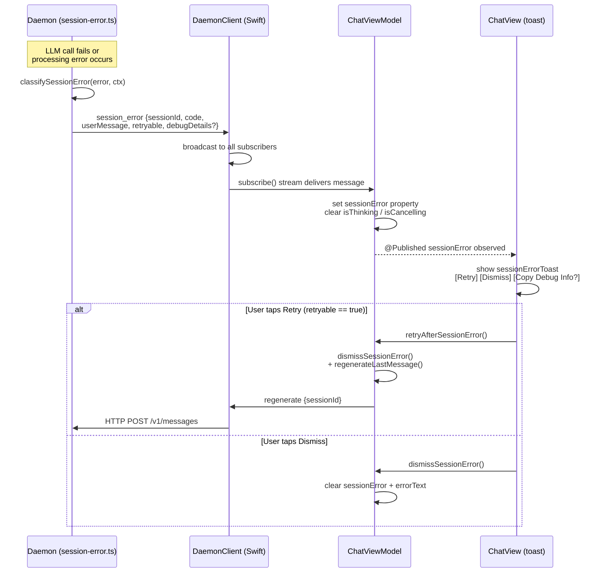

1. **Daemon** encounters a session-scoped failure, classifies it via `classifySessionError()`, and sends a `session_error` SSE event with the session ID, typed error code, user-facing message, retryable flag, and optional debug details. Session-scoped failures emit _only_ `session_error` (never the generic `error` type) to prevent cross-session bleed.
2. **ChatViewModel** receives the error via DaemonClient's `subscribe()` stream (each view model gets an independent stream), sets the `sessionError` property, and transitions out of the streaming/loading state so the UI is interactive. If the error arrives during an active cancel (`wasCancelling == true`), it is suppressed — cancel only shows `generation_cancelled` behavior.
3. **ChatView** observes the published `sessionError` and displays an actionable toast with a category-specific icon and accent color:
   - **Retry** (shown when `retryable` is true): calls `retryAfterSessionError()`, which clears the error and sends a `regenerate` message to the daemon.
   - **Copy Debug Info** (shown when `debugDetails` is non-nil): copies structured debug information to the clipboard for bug reports.
   - **Dismiss (X)**: calls `dismissSessionError()` to clear the error without retrying.
4. If the error is not retryable, the Retry button is hidden and the user can only dismiss.

---

## Context Overflow Recovery

The session loop implements a deterministic overflow convergence pipeline that recovers from context-too-large provider rejections without surfacing errors to the user. Instead of the previous behavior where a `CONTEXT_TOO_LARGE` error was emitted as a `session_error`, the pipeline iteratively reduces the context payload until it fits within the provider's limit.

### Two-Phase Architecture

**Phase 1 — Preflight budgeting:** Before calling the provider, the session loop estimates prompt token count and compares it against a preflight budget (`maxInputTokens * (1 - safetyMarginRatio)`). If the estimate exceeds the budget, the reducer runs proactively, avoiding a wasted provider round-trip. This catches overflow caused by large tool results, media payloads, or accumulated history before any network call.

**Phase 2 — Post-rejection convergence:** If the provider returns a context-too-large error despite preflight checks (e.g., due to estimation inaccuracy), the same reducer runs reactively in a bounded loop, retrying the provider after each tier.

### Tiered Reduction

The reducer (`context-overflow-reducer.ts`) applies four monotonically more aggressive tiers, each idempotent:

| Tier                      | Reduction                                                                  | Effect                                                                                       |
| ------------------------- | -------------------------------------------------------------------------- | -------------------------------------------------------------------------------------------- |
| 1. Forced compaction      | Emergency `maybeCompact()` with `force: true`, `minKeepRecentUserTurns: 0` | Summarizes older history more aggressively than normal compaction                            |
| 2. Tool-result truncation | `truncateToolResultsAcrossHistory()` at 4,000 chars per result             | Shrinks verbose tool outputs (shell, file reads) across all retained messages                |
| 3. Media/file stubbing    | `stripMediaPayloadsForRetry()`                                             | Replaces image and file content blocks with lightweight text stubs                           |
| 4. Injection downgrade    | Sets `injectionMode` to `"minimal"`                                        | Drops runtime injections (workspace listing, temporal context, memory recall) to minimal set |

After each tier, the reducer re-estimates tokens. If the estimate is within budget, the loop breaks and the provider call proceeds. The loop is bounded by `maxAttempts` (default 3).

### Overflow Policy and Latest-Turn Compression

When all four reducer tiers are exhausted and the provider still rejects, the overflow policy resolver (`context-overflow-policy.ts`) determines the next action based on config and session interactivity:

| Session Type    | Config Policy           | Action                                                                                                 |
| --------------- | ----------------------- | ------------------------------------------------------------------------------------------------------ |
| Interactive     | `"summarize"` (default) | `request_user_approval` — prompt the user via `PermissionPrompter` before compressing the latest turn  |
| Non-interactive | `"truncate"` (default)  | `auto_compress_latest_turn` — compress without asking                                                  |
| Any             | `"drop"`                | `fail_gracefully` — fall through to the final context-overflow fallback, which emits a `session_error` |

**Approval gate:** For interactive sessions, the pipeline uses `requestCompressionApproval()` in `context-overflow-approval.ts`, which presents a confirmation prompt through the existing `PermissionPrompter` flow (`POST /v1/confirm`). The prompt uses a reserved pseudo tool name (`context_overflow_compression`) so the UI can display a meaningful label. The decision is one-shot per overflow (no "always allow" option).

**Deny handling:** If the user declines compression, the session emits a graceful assistant explanation message ("The conversation has grown too long...") instead of a `session_error`. The deny message is persisted to conversation history and delivered via `assistant_text_delta` events, so the user sees a normal chat bubble rather than an error toast. The turn ends cleanly without triggering the error classification pipeline.

### Config

All overflow recovery settings live under `contextWindow.overflowRecovery` in the assistant config schema:

| Config key                            |       Default | Purpose                                                                        |
| ------------------------------------- | ------------: | ------------------------------------------------------------------------------ |
| `enabled`                             |        `true` | Master switch for the overflow recovery pipeline                               |
| `safetyMarginRatio`                   |        `0.05` | Fraction of `maxInputTokens` reserved as safety margin for preflight budget    |
| `maxAttempts`                         |           `3` | Maximum reducer iterations per overflow event (both preflight and convergence) |
| `interactiveLatestTurnCompression`    | `"summarize"` | Policy for interactive sessions: `"summarize"`, `"truncate"`, or `"drop"`      |
| `nonInteractiveLatestTurnCompression` |  `"truncate"` | Policy for non-interactive sessions: same options                              |

### Key Source Files

| File                                      | Purpose                                                                          |
| ----------------------------------------- | -------------------------------------------------------------------------------- |
| `src/daemon/context-overflow-reducer.ts`  | Tiered reducer: four-tier pipeline with idempotent steps and cumulative state    |
| `src/daemon/context-overflow-policy.ts`   | Overflow policy resolver: maps config + interactivity to concrete action         |
| `src/daemon/context-overflow-approval.ts` | Approval gate: prompts user for latest-turn compression via `PermissionPrompter` |
| `src/daemon/session-agent-loop.ts`        | Integration: preflight budget check, convergence loop, approval/deny flow        |
| `src/config/core-schema.ts`               | `ContextOverflowRecoveryConfigSchema` with defaults and validation               |

---

## Task Routing — Voice Source Bypass and Escalation

When a task is submitted via `task_submit`, the daemon classifies it to determine routing. Voice-sourced tasks and built-in slash commands bypass the classifier entirely for lower latency and more predictable routing.

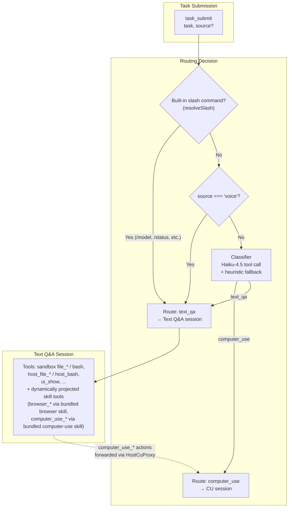

### Action Execution Hierarchy

The text_qa system prompt includes an action execution hierarchy that guides tool selection toward the least invasive method:

| Priority        | Method                         | Tool                                            | When to use                                                 |
| --------------- | ------------------------------ | ----------------------------------------------- | ----------------------------------------------------------- |
| **BEST**        | Sandboxed filesystem/shell     | `file_*`, `bash`                                | Work that can stay isolated in sandbox filesystem           |
| **BETTER**      | Explicit host filesystem/shell | `host_file_*`, `host_bash`                      | Host reads/writes/commands that must touch the real machine |
| **GOOD**        | Headless browser               | `browser_*` (bundled `browser` skill)           | Web automation, form filling, scraping (background)         |
| **LAST RESORT** | Foreground computer use        | `computer_use_*` (bundled `computer-use` skill) | Only on explicit user request ("go ahead", "take over")     |

Computer-use tools are proxy tools provided by the bundled `computer-use` skill, preactivated via `preactivatedSkillIds` in desktop sessions. Each tool forwards actions to the connected macOS client via `HostCuProxy`, which handles request/resolve proxying, step counting, loop detection, and observation formatting within the unified agent loop. These tools are not core-registered at daemon startup; they exist only through skill projection.

### Sandbox Filesystem and Host Access

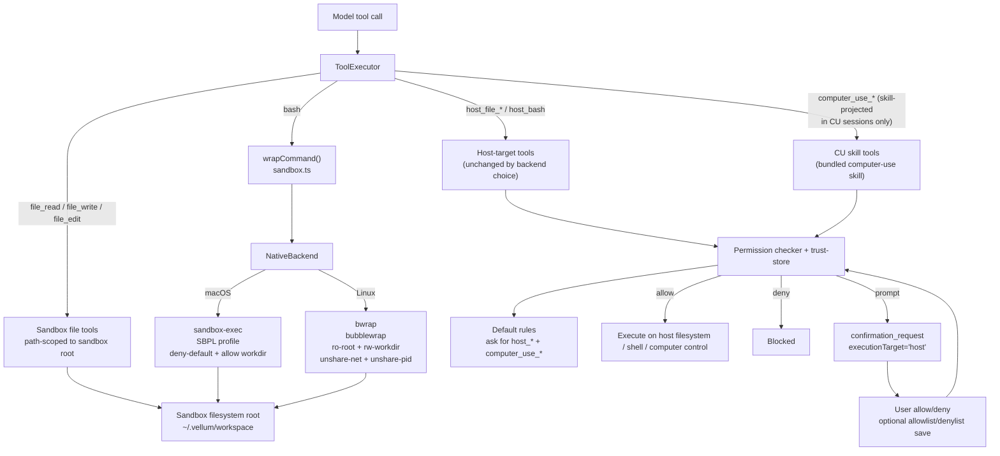

- **Native backend**: Uses OS-level sandboxing — `sandbox-exec` with SBPL profiles on macOS, `bwrap` (bubblewrap) on Linux. Denies network access and restricts filesystem writes to the sandbox root, `/tmp`, `/private/tmp`, and `/var/folders` (macOS) or the sandbox root and `/tmp` (Linux).
- **Fail-closed**: The native backend refuses to execute unsandboxed if its prerequisites are unavailable, throwing `ToolError` with actionable messages on failure.
- **Host tools unchanged**: `host_bash`, `host_file_read`, `host_file_write`, and `host_file_edit` always execute directly on the host regardless of which sandbox backend is active.
- Sandbox defaults: `file_*` and `bash` execute within `~/.vellum/workspace`.
- Host access is explicit: `host_file_read`, `host_file_write`, `host_file_edit`, and `host_bash` are separate tools.
- Prompt defaults: host tools and `computer_use_*` skill-projected actions default to `ask` unless a trust rule allowlists/denylists them.
- Browser tool defaults: all `browser_*` tools are auto-allowed by default via seeded allow rules at priority 100, preserving the frictionless UX from when browser was a core tool.
- Confirmation payloads include `executionTarget` (`sandbox` or `host`) so clients can label where the action will run.

---

## Slash Command Resolution

When a user message enters the daemon (via `processMessage` or the queue drain path), it passes through `resolveSlash()` before persistence or agent execution. Resolution uses direct string matching against a fixed set of built-in commands.

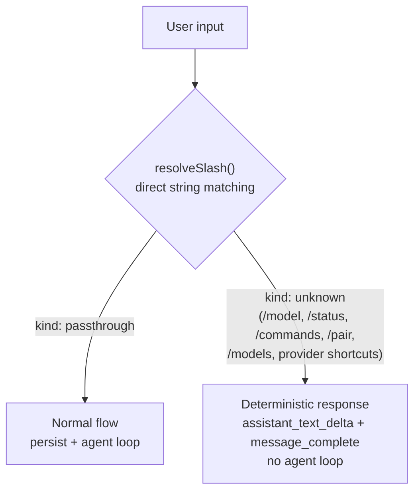

Key behaviors:

- **Built-in commands**: `/model`, `/models`, `/status`, `/commands`, `/pair`, and provider shortcuts (`/opus`, `/sonnet`, `/gpt4`, etc.) are handled directly by `resolveSlash()`. A deterministic `assistant_text_delta` + `message_complete` is emitted. No message persistence or model call occurs.
- **Passthrough**: Any input that does not match a built-in command passes through to the normal agent loop, including slash-like tokens that are not recognized.
- **Queue**: Queued messages receive the same slash resolution.

---

## Dynamic Skill Authoring — Tool Flow

The assistant can author, test, and persist new skills at runtime through a three-tool workflow. All operations target `~/.vellum/workspace/skills/` (managed skills directory) and require explicit user confirmation.

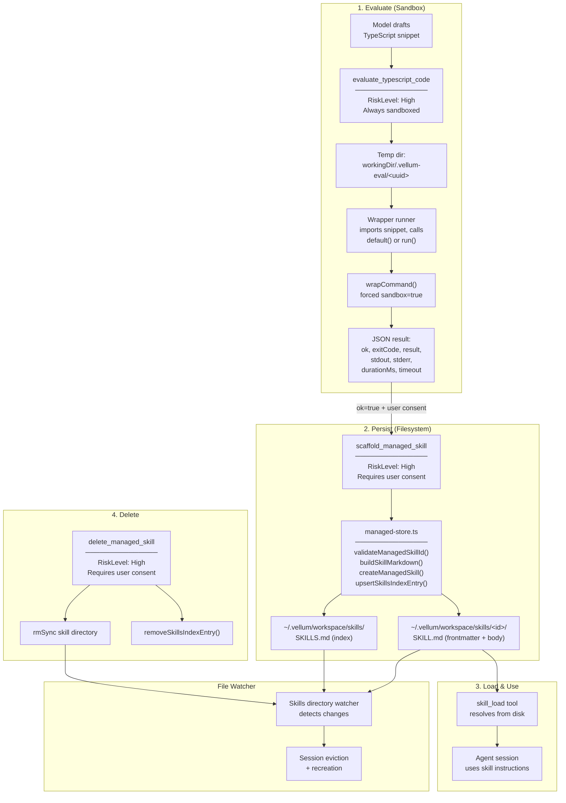

**Key design decisions:**

- `evaluate_typescript_code` always forces `sandbox.enabled = true` regardless of global config.
- Snippet contract: must export `default` or `run` with signature `(input: unknown) => unknown | Promise<unknown>`.
- Managed-store writes are atomic (tmp file + rename) to prevent partial `SKILL.md` or `SKILLS.md` files.
- After persist or delete, the file watcher triggers session eviction; the next turn runs in a fresh session. The model's system prompt instructs it to continue normally.
- macOS UI shows Inspect and Delete controls for managed skills only (source = "managed").
- `skill_load` validates the recursive include graph (via `include-graph.ts`) before emitting output. Missing children and cycles produce `isError: true` with no `<loaded_skill>` marker. Valid includes produce an "Included Skills (immediate)" metadata section showing child ID, name, description, and path.

### Skills Authoring via HTTP

The Skills page in the macOS client can author managed skills through the daemon HTTP API without going through the agent loop:

1. **Draft** (`skills_draft`): The client sends source text (with optional YAML frontmatter). The daemon parses frontmatter for metadata fields (skillId, name, description, emoji), fills missing fields via a latency-optimized LLM call, and falls back to deterministic heuristics if the provider is unavailable. Returns `skills_draft_response` with the complete draft.
2. **Create** (`skills_create`): The client sends finalized skill metadata and body. The daemon calls `createManagedSkill()` from `managed-store.ts`, auto-enables the skill in config, and broadcasts `skills_state_changed`.

### Include Graph Validation

Skills can declare child relationships via the `includes` frontmatter field (a JSON array of skill IDs). When `skill_load` loads a parent skill, it validates the full recursive include graph before emitting output.

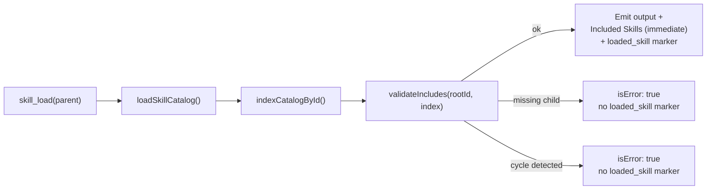

**Validation rules:**

- **Missing children**: If any skill in the recursive graph references an `includes` ID not found in the catalog, validation fails with the full path from root to the missing reference.
- **Cycles**: Three-state DFS (unseen → visiting → done) detects direct and indirect cycles. The error includes the cycle path.
- **Fail-closed**: On any validation error, `skill_load` returns `isError: true` with no `<loaded_skill>` marker, preventing the agent from using a skill with broken dependencies.

**Key constraint**: Include metadata is metadata-only. Child skills are **not** auto-activated — the agent must explicitly call `skill_load` for each child. The `projectSkillTools()` function only projects tools for skills with explicit `<loaded_skill>` markers in conversation history.

| Source File                             | Purpose                                                                                    |
| --------------------------------------- | ------------------------------------------------------------------------------------------ |
| `assistant/src/skills/include-graph.ts` | `indexCatalogById()`, `getImmediateChildren()`, `validateIncludes()`, `traverseIncludes()` |
| `assistant/src/tools/skills/load.ts`    | Include validation integration in `skill_load` execute path                                |
| `assistant/src/config/skills.ts`        | `includes` field parsing from SKILL.md frontmatter                                         |
| `assistant/src/skills/managed-store.ts` | `includes` emission in `buildSkillMarkdown()`                                              |

---

## Dynamic Skill Tool System — Runtime Tool Projection

Skills can expose custom tools via a `TOOLS.json` manifest alongside their `SKILL.md`. When a skill is activated during a session, its tools are dynamically loaded, registered, and made available to the agent loop. Browser, Gmail, Claude Code, Weather, and other capabilities are delivered as **bundled skills** rather than hardcoded tools. Browser tools (previously the core `headless-browser` tool) are now provided by the bundled `browser` skill with system default allow rules that preserve frictionless auto-approval.

### Bundled Skill Retrieval Contract (CLI-First)

Config/status retrieval instructions in bundled `SKILL.md` files are CLI-first. Retrieval should flow through canonical `vellum` CLI surfaces (`assistant config get` for generic settings, secure credential surfaces for secrets, and domain reads where available) instead of direct gateway curl snippets or keychain lookups.

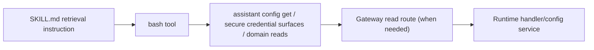

Rules enforced by guard tests:

- Retrieval reads use `bash` + canonical CLI surfaces (`assistant config get` and domain read commands where available).
- Direct gateway `curl` + manual bearer headers are for control-plane writes/actions, not retrieval reads.
- Bundled skill docs must not instruct direct keychain lookups (`security find-generic-password`, `secret-tool`) for retrieval.
- `host_bash` is not used for Vellum CLI retrieval commands unless intentionally allowlisted.
- Outbound credentialed API calls use CES tools (`make_authenticated_request`, `run_authenticated_command`) so credentials never enter the assistant process. `host_bash` is available as a user-approved escape hatch but is outside the strong secrecy guarantee.

### Skill Directory Structure

Each skill directory (bundled, managed, workspace, or extra) may contain:

```
skills/<skill-id>/
  SKILL.md          # Skill instructions (frontmatter + markdown body; optional includes: [...] for child skills)
  TOOLS.json        # Tool manifest (optional — skills without tools are instruction-only)
  tools/            # Executor scripts referenced by TOOLS.json
    my-tool.ts      # Exports run(input, context) → ToolExecutionResult
```

### Bundled Skills

The following capabilities ship as bundled skills in `assistant/src/config/bundled-skills/`:

| Skill ID        | Tools                                                                                                                                                                                                                                                             | Purpose                                                                                                                                                                                                                                                                                              |
| --------------- | ----------------------------------------------------------------------------------------------------------------------------------------------------------------------------------------------------------------------------------------------------------------- | ---------------------------------------------------------------------------------------------------------------------------------------------------------------------------------------------------------------------------------------------------------------------------------------------------- |
| `browser`       | `browser_navigate`, `browser_snapshot`, `browser_screenshot`, `browser_close`, `browser_click`, `browser_type`, `browser_press_key`, `browser_wait_for`, `browser_extract`, `browser_fill_credential`                                                             | Headless browser automation — web scraping, form filling, interaction (previously core-registered as `headless-browser`; now skill-provided with default allow rules)                                                                                                                                |
| `gmail`         | Gmail search, archive, send, etc.                                                                                                                                                                                                                                 | Email management via OAuth2 integration                                                                                                                                                                                                                                                              |
| `claude-code`   | Claude Code tool                                                                                                                                                                                                                                                  | Delegate coding tasks to Claude Code subprocess                                                                                                                                                                                                                                                      |
| `computer-use`  | `computer_use_observe`, `computer_use_click`, `computer_use_type_text`, `computer_use_key`, `computer_use_scroll`, `computer_use_drag`, `computer_use_wait`, `computer_use_open_app`, `computer_use_run_applescript`, `computer_use_done`, `computer_use_respond` | Computer-use proxy tools — preactivated via `preactivatedSkillIds` in desktop sessions. Each tool forwards actions to the connected macOS client via `HostCuProxy`, which handles request/resolve proxying, step counting, loop detection, and observation formatting within the unified agent loop. |
| `weather`       | `get-weather`                                                                                                                                                                                                                                                     | Fetch current weather data                                                                                                                                                                                                                                                                           |
| `app-builder`   | `app_create`, `app_list`, `app_query`, `app_update`, `app_delete`, `app_file_list`, `app_file_read`, `app_file_edit`, `app_file_write`                                                                                                                            | Dynamic app authoring — CRUD and file-level editing for persistent apps (activated via `skill_load app-builder`; `app_open` remains a core proxy tool)                                                                                                                                               |
| `self-upgrade`  | (instruction-only)                                                                                                                                                                                                                                                | Self-improvement workflow                                                                                                                                                                                                                                                                            |
| `start-the-day` | (instruction-only)                                                                                                                                                                                                                                                | Morning briefing routine                                                                                                                                                                                                                                                                             |

### Activation and Projection Flow

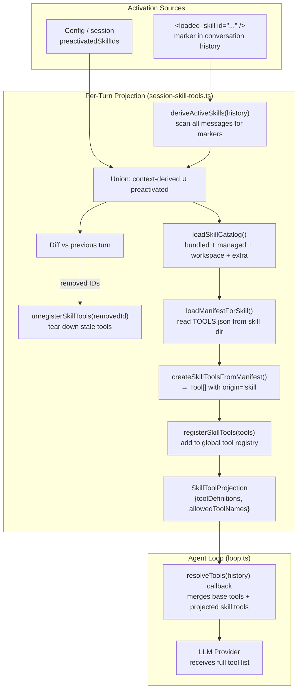

**Internal preactivation**: Some bundled skills are preactivated programmatically rather than by model discovery. For example, desktop sessions set `preactivatedSkillIds: ['computer-use']`, causing `projectSkillTools()` to load the 11 `computer_use_*` tool definitions from the bundled skill's `TOOLS.json` on the first turn. These proxy tools forward actions to the connected macOS client via `HostCuProxy`.

### Skill Tool Execution

Skill tool executors are TypeScript scripts that export a `run(input, context)` function. Execution is routed based on the `execution_target` field in `TOOLS.json`:

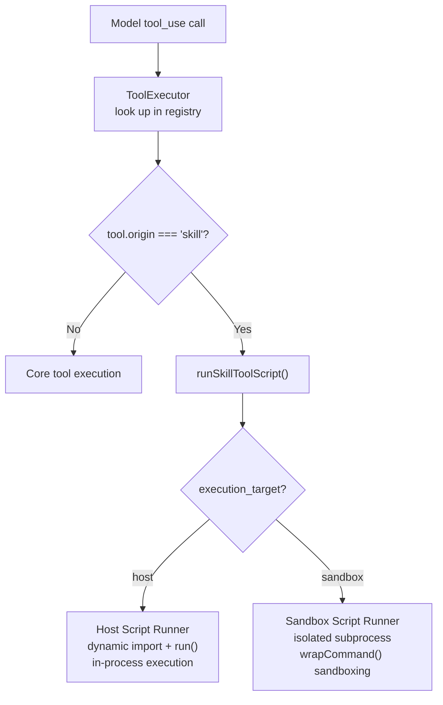

### Permission Flow for Skill Tools

Skill-origin tools follow a stricter default permission model than core tools. Even if a skill tool declares `risk: "low"` in its manifest, the permission checker defaults to prompting the user unless a trust rule explicitly allows it. Additionally, high-risk tool invocations always prompt the user even when a matching allow rule exists.

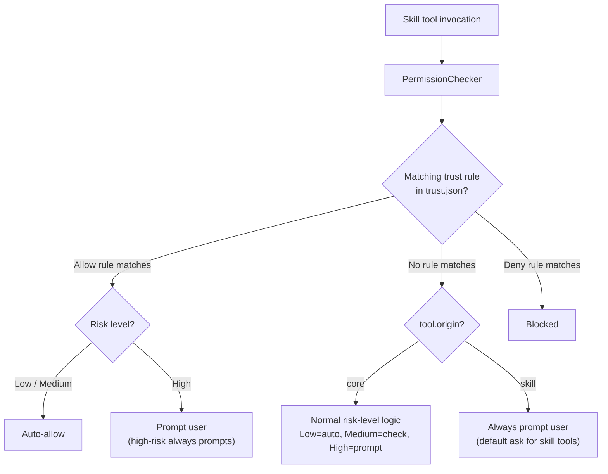

### Key Source Files

| File                                                | Role                                                                                       |
| --------------------------------------------------- | ------------------------------------------------------------------------------------------ |
| `assistant/src/config/skills.ts`                    | Skill catalog loading: bundled, managed, workspace, extra directories                      |
| `assistant/src/config/bundled-skills/`              | Bundled skill directories (browser, gmail, claude-code, computer-use, weather, etc.)       |
| `assistant/src/skills/tool-manifest.ts`             | `TOOLS.json` parser and validator                                                          |
| `assistant/src/skills/active-skill-tools.ts`        | `deriveActiveSkills()` — scans history for `<loaded_skill>` markers                        |
| `assistant/src/skills/include-graph.ts`             | Include graph builder: `indexCatalogById()`, `validateIncludes()`, cycle/missing detection |
| `assistant/src/daemon/session-skill-tools.ts`       | `projectSkillTools()` — per-turn projection, register/unregister lifecycle                 |
| `assistant/src/tools/skills/skill-tool-factory.ts`  | `createSkillToolsFromManifest()` — manifest entries to Tool objects                        |
| `assistant/src/tools/skills/skill-script-runner.ts` | Host runner: dynamic import + `run()` call                                                 |
| `assistant/src/tools/skills/sandbox-runner.ts`      | Sandbox runner: isolated subprocess execution                                              |
| `assistant/src/tools/registry.ts`                   | `registerSkillTools()` / `unregisterSkillTools()` — global tool registry                   |
| `assistant/src/permissions/checker.ts`              | Skill-origin default-ask permission policy                                                 |

---

## Permission and Trust Security Model

The permission system controls which tool actions the agent can execute without explicit user approval. It supports two operating modes (`workspace` and `strict`), execution-target-scoped trust rules, and risk-based escalation to provide defense-in-depth against unintended or malicious tool execution.

### Permission Evaluation Flow

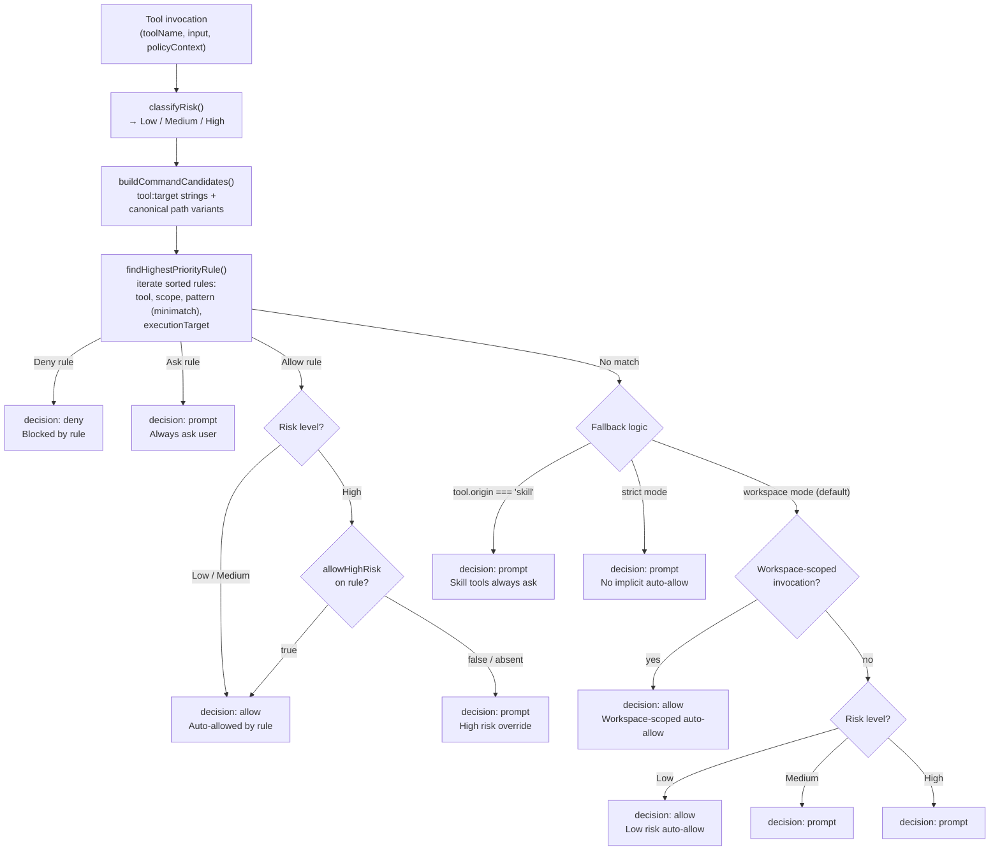

### Permission Modes: Workspace and Strict

The `permissions.mode` config option (`workspace` or `strict`) controls the default behavior when no trust rule matches a tool invocation. The default is `workspace`.

| Behavior                                           | Workspace mode (default)                      | Strict mode                                   |
| -------------------------------------------------- | --------------------------------------------- | --------------------------------------------- |
| Workspace-scoped ops with no matching rule         | Auto-allowed                                  | Prompted                                      |
| Non-workspace low-risk tools with no matching rule | Auto-allowed                                  | Prompted                                      |
| Medium-risk tools with no matching rule            | Prompted                                      | Prompted                                      |
| High-risk tools with no matching rule              | Prompted                                      | Prompted                                      |
| `skill_load` with no matching rule                 | Prompted                                      | Prompted                                      |
| `skill_load` with system default rule              | Auto-allowed (`skill_load:*` at priority 100) | Auto-allowed (`skill_load:*` at priority 100) |
| `browser_*` skill tools with system default rules  | Auto-allowed (priority 100 allow rules)       | Auto-allowed (priority 100 allow rules)       |
| Skill-origin tools with no matching rule           | Prompted                                      | Prompted                                      |
| Allow rules for non-high-risk tools                | Auto-allowed                                  | Auto-allowed                                  |
| Allow rules with `allowHighRisk: true`             | Auto-allowed (even high risk)                 | Auto-allowed (even high risk)                 |
| Deny rules                                         | Blocked                                       | Blocked                                       |

**Workspace mode** (default) auto-allows operations scoped to the workspace (file reads/writes/edits within the workspace directory, sandboxed bash) without prompting. Host operations, network requests, and operations outside the workspace still follow the normal approval flow. Explicit deny and ask rules override auto-allow.

**Strict mode** is designed for security-conscious deployments where every tool action must have an explicit matching rule in the trust store. It eliminates implicit auto-allow for any risk level, ensuring the user has consciously approved each class of tool usage.

> **Migration note:** Existing config files with `permissions.mode = "legacy"` are automatically migrated to `workspace` during config loading. The `legacy` value is not a supported steady-state mode.

### Trust Rules (v3 Schema)

Rules are stored in `~/.vellum/protected/trust.json` with version `3`. Each rule can include the following fields:

| Field             | Type                   | Purpose                                                                  |
| ----------------- | ---------------------- | ------------------------------------------------------------------------ |
| `id`              | `string`               | Unique identifier (UUID for user rules, `default:*` for system defaults) |
| `tool`            | `string`               | Tool name to match (e.g., `bash`, `file_write`, `skill_load`)            |
| `pattern`         | `string`               | Minimatch glob pattern for the command/target string                     |
| `scope`           | `string`               | Path prefix or `everywhere` — restricts where the rule applies           |
| `decision`        | `allow \| deny \| ask` | What to do when the rule matches                                         |
| `priority`        | `number`               | Higher priority wins; deny wins ties at equal priority                   |
| `executionTarget` | `string?`              | `sandbox` or `host` — restricts by execution context                     |
| `allowHighRisk`   | `boolean?`             | When true, auto-allows even high-risk invocations                        |

Missing optional fields act as wildcards. A rule with no `executionTarget` matches any target.

### Risk Classification and Escalation

The `classifyRisk()` function determines the risk level for each tool invocation:

| Tool                                                             | Risk level                  | Notes                                                                                        |
| ---------------------------------------------------------------- | --------------------------- | -------------------------------------------------------------------------------------------- |
| `file_read`, `web_search`, `skill_load`                          | Low                         | Read-only or informational                                                                   |
| `file_write`, `file_edit`                                        | Medium (default)            | Filesystem mutations                                                                         |
| `file_write`, `file_edit` targeting skill source paths           | **High**                    | `isSkillSourcePath()` detects managed/bundled/workspace/extra skill roots                    |
| `host_file_write`, `host_file_edit` targeting skill source paths | **High**                    | Same path classification, host variant                                                       |
| `bash`, `host_bash`                                              | Varies                      | Parsed via tree-sitter: low-risk programs = Low, high-risk programs = High, unknown = Medium |
| `scaffold_managed_skill`, `delete_managed_skill`                 | High                        | Skill lifecycle mutations always high-risk                                                   |
| `evaluate_typescript_code`                                       | High                        | Arbitrary code execution                                                                     |
| Skill-origin tools with no matching rule                         | Prompted regardless of risk | Even Low-risk skill tools default to `ask`                                                   |

The escalation of skill source file mutations to High risk is a privilege-escalation defense: modifying skill source code could grant the agent new capabilities, so such operations always require explicit approval.

### Skill Load Approval

The `skill_load` tool generates version-aware command candidates for rule matching:

1. `skill_load:<skill-id>@<version-hash>` — matches version-pinned rules
2. `skill_load:<skill-id>` — matches any-version rules
3. `skill_load:<raw-selector>` — matches the raw user-provided selector

In strict mode, `skill_load` without a matching rule is always prompted. The allowlist options presented to the user include both version-specific and any-version patterns. Note: the system default allow rule `skill_load:*` (priority 100) now globally allows all skill loads in both modes (see "System Default Allow Rules" below).

### Starter Approval Bundle

The starter bundle is an opt-in set of low-risk allow rules that reduces prompt noise, particularly in strict mode. It covers read-only tools that never mutate the filesystem or execute arbitrary code:

| Rule             | Tool             | Pattern             |
| ---------------- | ---------------- | ------------------- |
| `file_read`      | `file_read`      | `file_read:**`      |
| `glob`           | `glob`           | `glob:**`           |
| `grep`           | `grep`           | `grep:**`           |
| `list_directory` | `list_directory` | `list_directory:**` |
| `web_search`     | `web_search`     | `web_search:**`     |
| `web_fetch`      | `web_fetch`      | `web_fetch:**`      |

Acceptance is idempotent and persisted as `starterBundleAccepted: true` in `trust.json`. Rules are seeded at priority 90 (below user rules at 100, above system defaults at 50).

### System Default Allow Rules

In addition to the opt-in starter bundle, the permission system seeds unconditional default allow rules at priority 100 for two categories:

| Rule ID                                        | Tool                      | Pattern                     | Rationale                                                                                                |
| ---------------------------------------------- | ------------------------- | --------------------------- | -------------------------------------------------------------------------------------------------------- |
| `default:allow-skill_load-global`              | `skill_load`              | `skill_load:*`              | Loading any skill is globally allowed — no prompt for activating bundled, managed, or workspace skills   |
| `default:allow-browser_navigate-global`        | `browser_navigate`        | `browser_navigate:*`        | Browser tools migrated from core to the bundled `browser` skill; default allow preserves frictionless UX |
| `default:allow-browser_snapshot-global`        | `browser_snapshot`        | `browser_snapshot:*`        | (same)                                                                                                   |
| `default:allow-browser_screenshot-global`      | `browser_screenshot`      | `browser_screenshot:*`      | (same)                                                                                                   |
| `default:allow-browser_close-global`           | `browser_close`           | `browser_close:*`           | (same)                                                                                                   |
| `default:allow-browser_click-global`           | `browser_click`           | `browser_click:*`           | (same)                                                                                                   |
| `default:allow-browser_type-global`            | `browser_type`            | `browser_type:*`            | (same)                                                                                                   |
| `default:allow-browser_press_key-global`       | `browser_press_key`       | `browser_press_key:*`       | (same)                                                                                                   |
| `default:allow-browser_wait_for-global`        | `browser_wait_for`        | `browser_wait_for:*`        | (same)                                                                                                   |
| `default:allow-browser_extract-global`         | `browser_extract`         | `browser_extract:*`         | (same)                                                                                                   |
| `default:allow-browser_fill_credential-global` | `browser_fill_credential` | `browser_fill_credential:*` | (same)                                                                                                   |

These rules are emitted by `getDefaultRuleTemplates()` in `assistant/src/permissions/defaults.ts`. Because they use priority 100 (equal to user rules), they take effect in both workspace and strict modes. The `skill_load` rule means skill activation never prompts; the `browser_*` rules mean the browser skill's tools behave identically to the old core `headless-browser` tool from a permission standpoint.

### Shell Command Identity and Allowlist Options

For `bash` and `host_bash` tool invocations, the permission system uses parser-derived action keys (via `shell-identity.ts`) instead of raw whitespace-split patterns. This produces more meaningful allowlist options that reflect the actual command structure.

**Candidate building** (`buildShellCommandCandidates`): The shell parser (`tools/terminal/parser.ts`) produces segments and operators. `analyzeShellCommand()` extracts segments, operators, opaque-construct flags, and dangerous patterns. `deriveShellActionKeys()` then classifies the command:

- **Simple action** (optional setup-prefix segments like `cd`, `export`, `pushd` + exactly one action segment): Produces hierarchical `action:` keys. For example, `cd /repo && gh pr view 5525 --json title` yields candidates: the full original command text (`cd /repo && gh pr view 5525 --json title`), and action keys `action:gh pr view`, `action:gh pr`, `action:gh` (narrowest to broadest, max depth 3).
- **Complex command** (pipelines with `|`, or multiple non-prefix action segments): Only the full original command text is returned as a candidate — no action keys.

**Allowlist option ranking** (`buildShellAllowlistOptions`): For simple actions, the prompt offers options ordered from most specific to broadest: the full original command text (exact match), then action keys from deepest to shallowest. For complex commands, only the full original command text is offered. This prevents over-generalization of pipelines into permissive rules.

**Trust rule pattern format**: Action keys use the `action:` prefix in trust rules (e.g., `action:gh pr view`). The trust store matches these via `findHighestPriorityRule()` against the candidate list produced by `buildShellCommandCandidates()`.

**Scope ordering**: Scope options for all tools (including shell) are ordered from narrowest to broadest: project > parent directories > everywhere. The macOS chat UI uses a two-step flow for persistent rules: the user first selects the allowlist pattern, then selects the scope. This explicit scope selection replaces any silent auto-selection, ensuring the user always knows where the rule will apply.

### Prompt UX

When a permission prompt is sent to the client (via `confirmation_request` SSE event), it includes:

| Field              | Content                                             |
| ------------------ | --------------------------------------------------- |
| `toolName`         | The tool being invoked                              |
| `input`            | Redacted tool input (sensitive fields removed)      |
| `riskLevel`        | `low`, `medium`, or `high`                          |
| `executionTarget`  | `sandbox` or `host` — where the action will execute |
| `allowlistOptions` | Suggested patterns for "always allow" rules         |
| `scopeOptions`     | Suggested scopes for rule persistence               |

The user can respond with: `allow` (one-time), `always_allow` (create allow rule), `always_allow_high_risk` (create allow rule with `allowHighRisk: true`), `deny` (one-time), or `always_deny` (create deny rule).

### Canonical Paths

File tool candidates include canonical (symlink-resolved) absolute paths via `normalizeFilePath()` to prevent policy bypass through symlinked or relative path variations. The path classifier (`isSkillSourcePath()`) also resolves symlinks before checking against skill root directories.

### Key Source Files

| File                                          | Role                                                                                                                                                                                |
| --------------------------------------------- | ----------------------------------------------------------------------------------------------------------------------------------------------------------------------------------- |
| `assistant/src/permissions/types.ts`          | `TrustRule`, `PolicyContext`, `RiskLevel`, `UserDecision` types                                                                                                                     |
| `assistant/src/permissions/checker.ts`        | `classifyRisk()`, `check()`, `buildCommandCandidates()`, allowlist/scope generation                                                                                                 |
| `assistant/src/permissions/shell-identity.ts` | `analyzeShellCommand()`, `deriveShellActionKeys()`, `buildShellCommandCandidates()`, `buildShellAllowlistOptions()` — parser-based shell command identity and action key derivation |
| `assistant/src/permissions/trust-store.ts`    | Rule persistence, `findHighestPriorityRule()`, execution-target matching, starter bundle                                                                                            |
| `assistant/src/permissions/prompter.ts`       | Prompt flow: `confirmation_request` (SSE) → `confirmation_response` (HTTP POST)                                                                                                     |
| `assistant/src/permissions/defaults.ts`       | Default rule templates (system ask rules for host tools, CU, etc.)                                                                                                                  |
| `assistant/src/skills/version-hash.ts`        | `computeSkillVersionHash()` — deterministic SHA-256 of skill source files                                                                                                           |
| `assistant/src/skills/path-classifier.ts`     | `isSkillSourcePath()`, `normalizeFilePath()`, skill root detection                                                                                                                  |
| `assistant/src/config/schema.ts`              | `PermissionsConfigSchema` — `permissions.mode` (`workspace` / `strict`)                                                                                                             |
| `assistant/src/tools/executor.ts`             | `ToolExecutor` — orchestrates risk classification, permission check, and execution                                                                                                  |
| `assistant/src/daemon/handlers/config.ts`     | `handleToolPermissionSimulate()` — dry-run simulation handler                                                                                                                       |

### Permission Simulation (Tool Permission Tester)

The `tool_permission_simulate` HTTP endpoint lets clients dry-run a tool invocation through the full permission evaluation pipeline without actually executing the tool or mutating daemon state. The macOS Settings panel exposes this as a "Tool Permission Tester" UI.

**Simulation semantics:**

- The request specifies `toolName`, `input`, and optional context overrides (`workingDir`, `isInteractive`, `forcePromptSideEffects`, `executionTarget`).
- The daemon runs `classifyRisk()` and `check()` against the live trust rules, then returns the decision (`allow`, `deny`, or `prompt`), risk level, reason, matched rule ID, and (when decision is `prompt`) the full `promptPayload` with allowlist/scope options.
- **Simulation-only allow/deny**: A simulated `allow` or `deny` decision does not persist any state. No trust rules are created or modified.
- **Always-allow persistence**: When the tester UI's "Always Allow" action is used, the client sends a separate `add_trust_rule` message that persists the rule to `trust.json`, identical to the existing confirmation flow.
- **Private-conversation override**: When `forcePromptSideEffects` is true, side-effect tools that would normally be auto-allowed are promoted to `prompt`.
- **Non-interactive override**: When `isInteractive` is false, `prompt` decisions are converted to `deny` (no client available to approve).

---

## Swarm Orchestration — Parallel Task Execution

When the model invokes `swarm_delegate`, the daemon decomposes a complex task into parallel specialist subtasks and executes them concurrently.

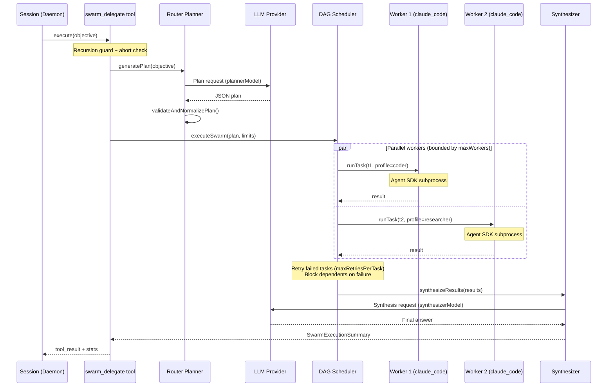

### Key design decisions

- **Recursion guard**: A module-level `Set<sessionId>` prevents concurrent swarms within the same session while allowing independent sessions to run their own swarms in parallel.
- **Abort signal**: The tool checks `context.signal?.aborted` before planning and before execution. The signal is also forwarded into `executeSwarm` and the worker backend, enabling cooperative cancellation of in-flight workers.
- **DAG scheduling**: Tasks with dependencies are topologically ordered. Independent tasks run in parallel up to `maxWorkers`.
- **Per-task retries**: Failed tasks retry up to `maxRetriesPerTask` before being marked failed. Dependents are transitively blocked.
- **Role-scoped profiles**: Workers run with restricted tool access based on their role (coder, researcher, reviewer, general).
- **Synthesis fallback**: If the LLM synthesis call fails, a deterministic markdown summary is generated from task results.
- **Progress streaming**: Status events (`task_started`, `task_completed`, `task_failed`, `task_blocked`, `done`) are streamed via `context.onOutput`.

### Config knobs

| Config key                |  Default | Purpose                                           |
| ------------------------- | -------: | ------------------------------------------------- |
| `swarm.enabled`           |   `true` | Master switch for swarm orchestration             |
| `swarm.maxWorkers`        |      `3` | Max concurrent worker processes (hard ceiling: 6) |
| `swarm.maxTasks`          |      `8` | Max tasks per plan (hard ceiling: 20)             |
| `swarm.maxRetriesPerTask` |      `1` | Per-task retry limit (hard ceiling: 3)            |
| `swarm.workerTimeoutSec`  |    `900` | Worker timeout in seconds                         |
| `swarm.plannerModel`      | (varies) | Model used for plan generation                    |
| `swarm.synthesizerModel`  | (varies) | Model used for result synthesis                   |

---

## Opportunistic Message Queue — Handoff Flow

When the daemon is busy generating a response, the client can continue sending messages. These are queued (FIFO, max 10) and drained automatically at safe checkpoints in the tool loop, not only at full completion.

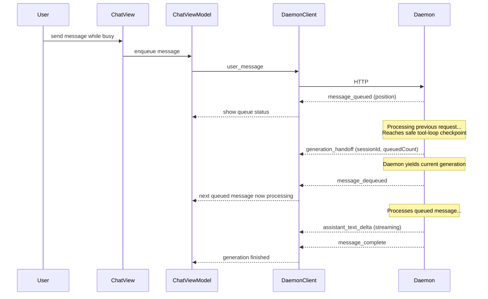

---

## Trace System — Debug Panel Data Flow

The trace system provides real-time observability of daemon session internals. Each session creates a `TraceEmitter` that emits structured `trace_event` SSE events as the session processes requests, makes LLM calls, and executes tools.


### Trace Event Kinds

Events emitted during a session lifecycle:

| Kind                        | Emitted by         | When                                                                                            |
| --------------------------- | ------------------ | ----------------------------------------------------------------------------------------------- |
| `request_received`          | Handlers / Session | User message or surface action arrives                                                          |
| `request_queued`            | Handlers / Session | Message queued while session is busy                                                            |
| `request_dequeued`          | Session            | Queued message begins processing                                                                |
| `llm_call_started`          | Session            | LLM API call initiated                                                                          |
| `llm_call_finished`         | Session            | LLM API call completed (carries `inputTokens`, `outputTokens`, `latencyMs`)                     |
| `assistant_message`         | Session            | Assistant response assembled (carries `toolUseCount`)                                           |
| `tool_started`              | ToolTraceListener  | Tool execution begins                                                                           |
| `tool_permission_requested` | ToolTraceListener  | Permission check needed (carries `riskLevel`)                                                   |
| `tool_permission_decided`   | ToolTraceListener  | Permission granted or denied (carries `decision`)                                               |
| `tool_finished`             | ToolTraceListener  | Tool execution completed (carries `durationMs`)                                                 |
| `tool_failed`               | ToolTraceListener  | Tool execution failed (carries `durationMs`)                                                    |
| `secret_detected`           | ToolTraceListener  | Secret found in tool output                                                                     |
| `generation_handoff`        | Session            | Yielding to next queued message                                                                 |
| `message_complete`          | Session            | Full request processing finished                                                                |
| `generation_cancelled`      | Session            | User cancelled the generation                                                                   |
| `request_error`             | Handlers / Session | Unrecoverable error during processing (includes queue-full rejection and persist-failure paths) |

### Architecture

- **TraceEmitter** (daemon, per-session): Constructed with a `sessionId` and a `sendToClient` callback. Maintains a monotonic sequence counter for stable ordering. Truncates summaries to 200 chars and attribute values to 500 chars. Each call to `emit()` sends a `trace_event` SSE event to connected clients.
- **ToolTraceListener** (daemon): Subscribes to the session's `EventBus` via `onAny()` and translates tool domain events (`tool.execution.started`, `tool.execution.finished`, `tool.execution.failed`, `tool.permission.requested`, `tool.permission.decided`, `tool.secret.detected`) into trace events through the `TraceEmitter`.
- **DaemonClient** (Swift, shared): Decodes `trace_event` SSE events into `TraceEventMessage` structs and invokes the `onTraceEvent` callback.
- **TraceStore** (Swift, macOS): `@MainActor ObservableObject` that ingests `TraceEventMessage` structs. Deduplicates by `eventId`, maintains stable sort order (sequence, then timestampMs, then insertion order), groups events by session and requestId, and enforces a retention cap of 5,000 events per session. Each request group is classified with a terminal status: `completed` (via `message_complete`), `cancelled` (via `generation_cancelled`), `handedOff` (via `generation_handoff`), `error` (via `request_error` or any event with `status == "error"`), or `active` (no terminal event yet).
- **DebugPanel** (Swift, macOS): SwiftUI view that observes `TraceStore`. Displays a metrics strip (request count, LLM calls, total tokens, average latency, tool failures) and a `TraceTimelineView` showing events grouped by requestId with color-coded status indicators. The timeline auto-scrolls to new events while the user is at the bottom; scrolling up pauses auto-scroll and shows a "Jump to bottom" button that resumes it.

---

---

## Assistant Events — SSE Transport Layer

The assistant-events system provides a single, shared publish path that fans out to all connected clients via HTTP SSE. The `ServerMessage` payload is wrapped in an `AssistantEvent` envelope and serialised as JSON.

### Data Flow

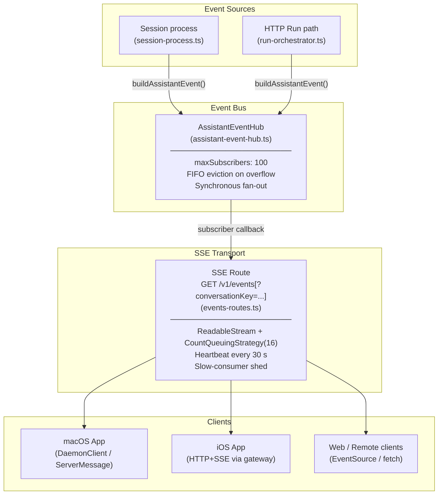

### AssistantEvent Envelope

Every event published through the hub is wrapped in an `AssistantEvent` (defined in `runtime/assistant-event.ts`):

| Field         | Type                | Description                                           |
| ------------- | ------------------- | ----------------------------------------------------- |
| `id`          | `string` (UUID)     | Globally unique event identifier                      |
| `assistantId` | `string`            | Logical assistant identifier (`"self"` for HTTP runs) |
| `sessionId`   | `string?`           | Resolved conversation ID when available               |
| `emittedAt`   | `string` (ISO-8601) | Server-side timestamp                                 |
| `message`     | `ServerMessage`     | The outbound message payload                          |

### SSE Frame Format

```
event: assistant_event\n
id: <uuid>\n
data: <JSON-serialised AssistantEvent>\n
\n
```

Keep-alive heartbeats (every 30 s by default):

```
: heartbeat\n
\n
```

### Subscription Lifecycle

| Event                                 | Action                                                                     |
| ------------------------------------- | -------------------------------------------------------------------------- |
| `GET /v1/events` received             | Hub subscribes eagerly before `ReadableStream` is created                  |
| Client disconnects / aborts           | `req.signal` abort listener disposes subscription and closes stream        |
| Client cancels reader                 | `ReadableStream.cancel()` disposes subscription and closes stream          |
| New connection pushes over cap (100)  | Oldest subscriber evicted (FIFO); its `onEvict` callback closes its stream |
| Client buffer full (16 queued frames) | `desiredSize <= 0` guard sheds the subscriber immediately                  |

### Key Source Files

| File                                            | Role                                                                           |
| ----------------------------------------------- | ------------------------------------------------------------------------------ |
| `assistant/src/runtime/assistant-event.ts`      | `AssistantEvent` type, `buildAssistantEvent()` factory, SSE framing helpers    |
| `assistant/src/runtime/assistant-event-hub.ts`  | `AssistantEventHub` class and process-level singleton                          |
| `assistant/src/runtime/routes/events-routes.ts` | `handleSubscribeAssistantEvents()` — SSE route handler                         |
| `assistant/src/daemon/server.ts`                | Session event paths that publish to the hub (`send` → `publishAssistantEvent`) |

---

## Notification System — Signal-Driven Decision Engine

The notification module (`assistant/src/notifications/`) uses a signal-based architecture where producers emit free-form events and an LLM-backed decision engine determines whether, where, and how to notify the user. See `assistant/src/notifications/README.md` for the full developer guide.

```
Producer → NotificationSignal → Candidate Generation → Decision Engine (LLM) → Deterministic Checks → Broadcaster → Conversation Pairing → Adapters → Delivery
                                                              ↑                                                            ↓
                                                      Preference Summary                                    notification_conversation_created SSE event
                                                      Conversation Candidates                                (creation-only — not emitted on reuse)
```

### Channel Policy Registry

`assistant/src/channels/config.ts` is the **single source of truth** for per-channel notification behavior. Every `ChannelId` must have an entry in the `CHANNEL_POLICIES` map (enforced at compile time via `satisfies Record<ChannelId, ChannelNotificationPolicy>`). Each policy defines:

- **`deliveryEnabled`** — whether the channel can receive notification deliveries. The `NotificationChannel` type is derived from this flag: only channels with `deliveryEnabled: true` are valid notification targets.
- **`conversationStrategy`** — how the notification pipeline materializes conversations for the channel:
  - `start_new_conversation` — creates a fresh conversation per delivery (e.g. vellum desktop/mobile conversations)
  - `continue_existing_conversation` — intended to append to an existing channel-scoped conversation; currently materializes a background audit conversation per delivery (e.g. Telegram)
  - `not_deliverable` — channel cannot receive notifications (e.g. phone)

Helper functions: `getDeliverableChannels()`, `getChannelPolicy()`, `isNotificationDeliverable()`, `getConversationStrategy()`.

### Conversation Pairing and Conversation Routing

Every notification delivery materializes a conversation + seed message **before** the adapter sends it (`conversation-pairing.ts`). The pairing function now accepts a `conversationAction` from the decision engine:

- **`reuse_existing`**: Looks up the target conversation. If valid (exists with `source: 'notification'`), the seed message is appended to the existing conversation. If invalid, falls back to creating a new conversation with `conversationDecisionFallbackUsed: true`.
- **`start_new` (default)**: Creates a fresh conversation per delivery.

This ensures:

1. Every delivery has an auditable conversation trail in the conversations table
2. The macOS/iOS client can deep-link directly into the notification conversation
3. Delivery audit rows in `notification_deliveries` carry `conversation_id`, `message_id`, `conversation_strategy`, `conversation_action`, `conversation_target_id`, and `conversation_fallback_used` columns

The pairing function (`pairDeliveryWithConversation`) is resilient — errors are caught and logged without breaking the delivery pipeline.

### Notification Conversation Materialization

The notification pipeline uses a single conversation materialization path across producers:

1. **Canonical pipeline** (`emitNotificationSignal` → decision engine → broadcaster → conversation pairing → adapters): The broadcaster pairs each delivery with a conversation, then dispatches a `notification_intent` SSE event via the Vellum adapter. The payload includes `deepLinkMetadata` (e.g. `{ conversationId, messageId }`) so the macOS/iOS client can deep-link to the relevant context when the user taps the notification. When `messageId` is present, the client scrolls to that specific message within the conversation (message-level anchoring).
2. **Guardian bookkeeping** (`dispatchGuardianQuestion`): Guardian dispatch creates `guardian_action_request` / `guardian_action_delivery` audit rows derived from pipeline delivery results and the per-dispatch `onConversationCreated` callback — there is no separate conversation-creation path.

### Conversation Surfacing via `notification_conversation_created` (Creation-Only)

The `notification_conversation_created` SSE event is emitted **only when a brand-new conversation is created** by the broadcaster. Reusing an existing conversation does not trigger this event — the macOS/iOS client already knows about the conversation from the original creation. This is enforced in `broadcaster.ts` by gating on `pairing.createdNewConversation === true`.

When a new vellum notification conversation is created (strategy `start_new_conversation`), the broadcaster emits the event **immediately** (before waiting for slower channel deliveries like Telegram). This pushes the conversation to the macOS/iOS client so it can display the notification conversation in the sidebar and deep-link to it.

### Conversation-Created Events

Two SSE push events surface new conversations in the macOS/iOS client sidebar:

- **`notification_conversation_created`** — Emitted by `broadcaster.ts` when a notification delivery **creates** a new vellum conversation (strategy `start_new_conversation`, `createdNewConversation: true`). **Not** emitted when a conversation is reused. Payload: `{ conversationId, title, sourceEventName }`.
- **`task_run_conversation_created`** — Emitted by `work-item-runner.ts` when a task run creates a conversation. Payload: `{ conversationId, workItemId, title }`.

All events follow the same pattern: the daemon creates a server-side conversation, persists an initial message, and broadcasts the SSE event so the macOS `ThreadManager` can create a visible conversation in the sidebar.

### Conversation Routing Decision Flow

The decision engine produces per-channel conversation actions using a candidate-driven approach:

1. **Candidate generation** (`conversation-candidates.ts`): Queries recent notification-sourced conversations (24-hour window, up to 5 per channel) and enriches them with guardian context (pending request counts).
2. **LLM decision**: The candidate set is serialized into the system prompt. The LLM chooses `start_new` or `reuse_existing` (with a candidate `conversationId`) per channel.
3. **Strict validation** (`validateConversationActions`): Reuse targets must exist in the candidate set. Invalid targets are downgraded to `start_new`.
4. **Pairing execution**: `pairDeliveryWithConversation` executes the conversation action — appending to an existing conversation on reuse, creating a new one otherwise.
5. **Creation-only gating**: `notification_conversation_created` fires only on actual creation, not on reuse.
6. **Audit trail**: Conversation actions are persisted in both `notification_decisions.validation_results` and `notification_deliveries` columns (`conversation_action`, `conversation_target_id`, `conversation_fallback_used`).

### Guardian Call Conversation Affinity

When a guardian question originates from an active phone call (`callSessionId` present on the signal), the decision engine enforces conversation affinity so all questions within the same call land in one vellum conversation:

- **First question in a call** (no `conversationAffinityHint`): `enforceGuardianCallConversationAffinity` forces `start_new` for the vellum channel, creating a dedicated conversation for the call.
- **Subsequent questions in the same call** (affinity hint already set by `dispatchGuardianQuestion`): The guard is a no-op, and `enforceConversationAffinity` routes to `reuse_existing` using the hint's `conversationId`.

This guard runs **before** `enforceConversationAffinity` in the post-decision chain so the two cooperate: the first dispatch creates the conversation, and subsequent dispatches reuse it via the affinity hint that `dispatchGuardianQuestion` sets after observing the first delivery's `conversationId`.

### Guardian Multi-Request Disambiguation in Reused Conversations

When the decision engine routes multiple guardian questions to the same conversation (via `reuse_existing`), those questions share a single conversation. The guardian disambiguates which question they are answering using **request-code prefixes**:

- **Single pending delivery**: Matched automatically (single-match fast path).
- **Multiple pending deliveries**: The guardian must prefix their reply with the 6-char hex request code (e.g. `A1B2C3 yes, allow it`). Case-insensitive matching.
- **No match**: A disambiguation message is sent listing all active request codes.

This invariant is enforced identically on mac/vellum (`session-process.ts`) and Telegram (`inbound-message-handler.ts`). All disambiguation messages are generated through the guardian action message composer (LLM with deterministic fallback).

### Reminder Routing Metadata

Reminders carry optional `routingIntent` (`single_channel` | `multi_channel` | `all_channels`) and free-form `routingHints` metadata. When a reminder fires, this metadata flows through the notification signal into a post-decision enforcement step (`enforceRoutingIntent()` in `decision-engine.ts`) that overrides the LLM's channel selection to match the requested coverage. This enables single-reminder fanout: one reminder can produce multi-channel delivery without duplicate reminders. See `assistant/docs/architecture/scheduling.md` for the full trigger-time data flow.

### Channel Delivery

Notifications are delivered to three channel types:

- **Vellum (always connected)**: SSE via the daemon's broadcast mechanism. The `VellumAdapter` emits a `notification_intent` message with rendered copy and optional `deepLinkMetadata` (includes `conversationId` for conversation navigation and `messageId` for message-level scroll anchoring).
- **Telegram (when guardian binding exists)**: HTTP POST to the gateway's `/deliver/telegram` endpoint. Requires an active guardian binding for the assistant.

Connected channels are resolved at signal emission time: vellum is always included, and binding-based channels (Telegram) are included only when an active guardian binding exists for the assistant.

**Key modules:**

| Module                                                                     | Purpose                                                                                                                               |
| -------------------------------------------------------------------------- | ------------------------------------------------------------------------------------------------------------------------------------- |
| `assistant/src/channels/config.ts`                                         | Channel policy registry — single source of truth for per-channel notification behavior                                                |
| `assistant/src/notifications/emit-signal.ts`                               | Single entry point for all producers; orchestrates the full pipeline                                                                  |
| `assistant/src/notifications/decision-engine.ts`                           | LLM-based routing decisions with deterministic fallback                                                                               |
| `assistant/src/notifications/deterministic-checks.ts`                      | Hard invariant checks (dedupe, source-active suppression, channel availability)                                                       |
| `assistant/src/notifications/broadcaster.ts`                               | Dispatches decisions to channel adapters; emits `notification_conversation_created` SSE event (creation-only)                         |
| `assistant/src/notifications/conversation-pairing.ts`                      | Materializes conversation + message per delivery; executes conversation reuse decisions                                               |
| `assistant/src/notifications/conversation-candidates.ts`                   | Builds per-channel candidate set of recent conversations for the decision engine                                                      |
| `assistant/src/notifications/adapters/macos.ts`                            | Vellum adapter — broadcasts `notification_intent` via SSE with deep-link metadata                                                     |
| `assistant/src/notifications/adapters/telegram.ts`                         | Telegram adapter — POSTs to gateway `/deliver/telegram`                                                                               |
| `assistant/src/notifications/destination-resolver.ts`                      | Resolves per-channel endpoints (vellum SSE, Telegram chat ID from guardian binding)                                                   |
| `assistant/src/notifications/copy-composer.ts`                             | Template-based fallback copy when LLM copy is unavailable                                                                             |
| `assistant/src/notifications/preference-extractor.ts`                      | Detects preference statements in conversation messages                                                                                |
| `assistant/src/notifications/preferences-store.ts`                         | CRUD for user notification preferences                                                                                                |
| `assistant/src/config/bundled-skills/messaging/tools/send-notification.ts` | Explicit producer tool for user-requested notifications; emits signals into the same routing pipeline                                 |
| `assistant/src/calls/guardian-dispatch.ts`                                 | Guardian question dispatch that reuses canonical notification pairing and records guardian delivery bookkeeping from pipeline results |

**Audit trail (SQLite):** `notification_events` → `notification_decisions` (with `conversationActions` in validation results) → `notification_deliveries` (with `conversation_id`, `message_id`, `conversation_strategy`, `conversation_action`, `conversation_target_id`, `conversation_fallback_used`)

**Configuration:** `notifications.decisionModelIntent` in `config.json`.

---

## Storage Summary

| What                                     | Where                                                             | Format                              | ORM/Driver                         | Retention                                               |
| ---------------------------------------- | ----------------------------------------------------------------- | ----------------------------------- | ---------------------------------- | ------------------------------------------------------- |
| API key                                  | macOS Keychain                                                    | Encrypted binary                    | `/usr/bin/security` CLI            | Permanent                                               |
| Credential secrets                       | macOS Keychain (or encrypted file fallback)                       | Encrypted binary                    | `secure-keys.ts` wrapper           | Permanent (until deleted via tool)                      |
| Credential metadata                      | `~/.vellum/workspace/data/credentials/metadata.json`              | JSON                                | Atomic file write                  | Permanent (until deleted via tool)                      |
| Integration OAuth tokens                 | macOS Keychain (or encrypted file fallback, via `secure-keys.ts`) | Encrypted binary                    | `TokenManager` auto-refresh        | Until disconnected or revoked                           |
| User preferences                         | UserDefaults                                                      | plist                               | Foundation                         | Permanent                                               |
| Session logs                             | `~/Library/.../logs/session-*.json`                               | JSON per session                    | Swift Codable                      | Unbounded                                               |
| Conversations & messages                 | `~/.vellum/workspace/data/db/assistant.db`                        | SQLite + WAL                        | Drizzle ORM (Bun)                  | Permanent                                               |
| Memory segments                          | `~/.vellum/workspace/data/db/assistant.db`                        | SQLite                              | Drizzle ORM                        | Permanent                                               |
| Extracted facts                          | `~/.vellum/workspace/data/db/assistant.db`                        | SQLite                              | Drizzle ORM                        | Permanent, deduped                                      |
| Embeddings                               | `~/.vellum/workspace/data/db/assistant.db`                        | JSON float arrays                   | Drizzle ORM                        | Permanent                                               |
| Async job queue                          | `~/.vellum/workspace/data/db/assistant.db`                        | SQLite                              | Drizzle ORM                        | Completed jobs persist                                  |
| Attachments                              | `~/.vellum/workspace/data/db/assistant.db`                        | Base64 in SQLite                    | Drizzle ORM                        | Permanent                                               |
| Sandbox filesystem                       | `~/.vellum/workspace`                                             | Real filesystem tree                | Node FS APIs                       | Persistent across sessions                              |
| Tool permission rules                    | `~/.vellum/protected/trust.json`                                  | JSON                                | File I/O                           | Permanent                                               |
| Web users & assistants                   | PostgreSQL                                                        | Relational                          | Drizzle ORM (pg)                   | Permanent                                               |
| Trace events                             | In-memory (TraceStore)                                            | Structured events                   | Swift ObservableObject             | Max 5,000 per session, ephemeral                        |
| Media embed settings                     | `~/.vellum/workspace/config.json` (`ui.mediaEmbeds`)              | JSON                                | `WorkspaceConfigIO` (atomic merge) | Permanent                                               |
| Media embed MIME cache                   | In-memory (`ImageMIMEProbe`)                                      | `NSCache` (500 entries)             | HTTP HEAD                          | Ephemeral; cleared on app restart                       |
| Tasks & task runs                        | `~/.vellum/workspace/data/db/assistant.db`                        | SQLite                              | Drizzle ORM                        | Permanent                                               |
| Work items (Task Queue)                  | `~/.vellum/workspace/data/db/assistant.db`                        | SQLite                              | Drizzle ORM                        | Permanent; archived items retained                      |
| Recurrence schedules & runs              | `~/.vellum/workspace/data/db/assistant.db`                        | SQLite                              | Drizzle ORM                        | Permanent; supports cron and RRULE syntax               |
| Watchers & events                        | `~/.vellum/workspace/data/db/assistant.db`                        | SQLite                              | Drizzle ORM                        | Permanent, cascade on watcher delete                    |
| Proxy CA cert + key                      | `{dataDir}/proxy-ca/`                                             | PEM files (ca.pem, ca-key.pem)      | openssl CLI                        | Permanent (10-year validity)                            |
| Proxy leaf certs                         | `{dataDir}/proxy-ca/issued/`                                      | PEM files per hostname              | openssl CLI, cached                | 1-year validity, re-issued on CA change                 |
| Proxy sessions                           | In-memory (SessionManager)                                        | Map<ProxySessionId, ManagedSession> | Manual lifecycle                   | Ephemeral; 5min idle timeout, cleared on shutdown       |
| Call sessions, events, pending questions | `~/.vellum/workspace/data/db/assistant.db`                        | SQLite                              | Drizzle ORM                        | Permanent, cascade on session delete                    |
| Active call controllers                  | In-memory (CallState)                                             | Map<callSessionId, CallController>  | Manual lifecycle                   | Ephemeral; cleared on call end or destroy               |
| Guardian bindings                        | `~/.vellum/workspace/data/db/assistant.db`                        | SQLite                              | Drizzle ORM                        | Permanent; revoked bindings retained                    |
| Channel verification sessions            | `~/.vellum/workspace/data/db/assistant.db`                        | SQLite                              | Drizzle ORM                        | Permanent; consumed/expired sessions retained           |
| Guardian approval requests               | `~/.vellum/workspace/data/db/assistant.db`                        | SQLite                              | Drizzle ORM                        | Permanent; decision outcome retained                    |
| Contact invites                          | `~/.vellum/workspace/data/db/assistant.db`                        | SQLite                              | Drizzle ORM                        | Permanent; token hash stored, raw token never persisted |
| Contacts & channels                      | `~/.vellum/workspace/data/db/assistant.db`                        | SQLite                              | Drizzle ORM                        | Permanent; revoked/blocked contacts retained            |
| Notification events                      | `~/.vellum/workspace/data/db/assistant.db`                        | SQLite                              | Drizzle ORM                        | Permanent; deduplicated by dedupeKey                    |
| Notification decisions                   | `~/.vellum/workspace/data/db/assistant.db`                        | SQLite                              | Drizzle ORM                        | Permanent; FK to notification_events                    |
| Notification deliveries                  | `~/.vellum/workspace/data/db/assistant.db`                        | SQLite                              | Drizzle ORM                        | Permanent; FK to notification_decisions                 |
| Notification preferences                 | `~/.vellum/workspace/data/db/assistant.db`                        | SQLite                              | Drizzle ORM                        | Permanent; per-assistant conversational preferences     |

### Sensitive Tool Output Placeholder Substitution

Some tool outputs contain values that must reach the user's final reply but should never be visible to the LLM (e.g., invite tokens). The system handles this with a three-stage pipeline:

1. **Directive extraction** (`src/tools/sensitive-output-placeholders.ts`): Tool output may include `<vellum-sensitive-output kind="invite_code" value="<raw>" />` directives. The executor strips directives, replaces raw values with deterministic placeholders (`VELLUM_ASSISTANT_INVITE_CODE_<shortId>`), and attaches `sensitiveBindings` metadata to the tool result.

2. **Placeholder-only model context**: The agent loop stores placeholder->value bindings in a per-run `substitutionMap`. Tool results sent to the LLM contain only placeholders — the model generates conversational text referencing them without ever seeing the real values.

3. **Post-generation substitution** (`src/agent/loop.ts`): Before emitting streamed `text_delta` events and before building the final `assistantMessage`, all placeholders are deterministically replaced with their real values. The substitution is chunk-safe for streaming (buffering partial placeholder prefixes across deltas).

Key files: `src/tools/sensitive-output-placeholders.ts`, `src/tools/executor.ts` (extraction hook), `src/agent/loop.ts` (substitution), `src/config/bundled-skills/contacts/SKILL.md` (invite flow adoption).

### Notifications

For full notification developer guidance and lifecycle details, see [`assistant/src/notifications/README.md`](src/notifications/README.md).

### Assistant Identity Boundary

The daemon uses a single fixed internal scope constant — `DAEMON_INTERNAL_ASSISTANT_ID` (`'self'`), exported from `src/runtime/assistant-scope.ts` — for all assistant-scoped storage and routing within the daemon process. Public/external assistant IDs (e.g., those assigned during hatch, invite links, or platform registration) are an **edge concern** owned by the gateway and platform layers.

**Boundary rule:** Daemon code must never derive internal scoping decisions from externally-provided assistant IDs. When a daemon path needs an assistant scope and none is provided, it defaults to `DAEMON_INTERNAL_ASSISTANT_ID`. The gateway is responsible for mapping public assistant IDs to internal routing before forwarding requests to the daemon.

**Key files:**

| File                                                | Purpose                                         |
| --------------------------------------------------- | ----------------------------------------------- |
| `src/runtime/assistant-scope.ts`                    | Exports `DAEMON_INTERNAL_ASSISTANT_ID` constant |
| `src/__tests__/assistant-id-boundary-guard.test.ts` | Guard tests enforcing the identity boundary     |

### Canonical Trust-Context Model

The guardian trust system uses a three-valued `TrustClass` — `'guardian'`, `'trusted_contact'`, or `'unknown'` — as the single vocabulary for actor trust classification across all channels and runtime paths. There is no legacy `actorRole` concept; all trust decisions flow through `TrustClass`.

**`TrustContext`** (in `src/daemon/session-runtime-assembly.ts`) is the single runtime carrier for trust state on channel-originated turns. It carries `trustClass`, guardian identity fields, and requester metadata. The `guardianPrincipalId` field is typed as `?: string` (optional but non-nullable) — a principal ID is present when a guardian binding exists but is never `null`.

**Explicit trust gates:** `trustClass` is a **required** field in `ToolContext` (in `src/tools/types.ts`). Every tool execution must carry a trust classification — the field is not optional. This ensures trust-gated tool policies (guardian control-plane restrictions, host-tool blocking for untrusted actors) cannot be bypassed by omitting the classification.

**Guardian bindings** (in `src/memory/channel-verification-sessions.ts`) always carry `guardianPrincipalId: string` as a required, non-null field. A binding without a principal ID is invalid and cannot be created.

**Strict retry sweep parsing:** The channel retry sweep (`src/runtime/channel-retry-sweep.ts`) uses `parseTrustRuntimeContext()` which validates `trustClass` against the canonical three-value set. There is no fallback to a legacy `actorRole` field — stored payloads that lack a valid `trustClass` are rejected deterministically to prevent silent privilege escalation. When `trustCtx` is entirely absent from a stored payload (pre-guardian events), the sweep synthesizes an explicit `trustClass: 'unknown'` context so that replay never proceeds without a trust classification.

**Rollout note — legacy `actorRole` payloads:** Previously failed events stored with only `actorRole` (no `trustClass`) will be marked as failed on each retry attempt and eventually dead-lettered after exhausting `RETRY_MAX_ATTEMPTS`. This is an intentional security tradeoff: replaying these events with inferred trust would violate the explicit-trust model. If legacy events need to be recovered, they should be repaired (adding a canonical `trustClass` to the stored payload) before replay via `replayDeadLetters()`.

**Key files:**

| File                                          | Purpose                                               |
| --------------------------------------------- | ----------------------------------------------------- |
| `src/daemon/session-runtime-assembly.ts`      | `TrustContext` type definition                        |
| `src/tools/types.ts`                          | `ToolContext.trustClass` (required trust gate)        |
| `src/runtime/channel-retry-sweep.ts`          | Strict `trustClass` parser for retry sweep            |
| `src/memory/channel-verification-sessions.ts` | `GuardianBinding` with required `guardianPrincipalId` |
| `src/__tests__/trust-context-guards.test.ts`  | Guard tests enforcing trust-context type invariants   |
