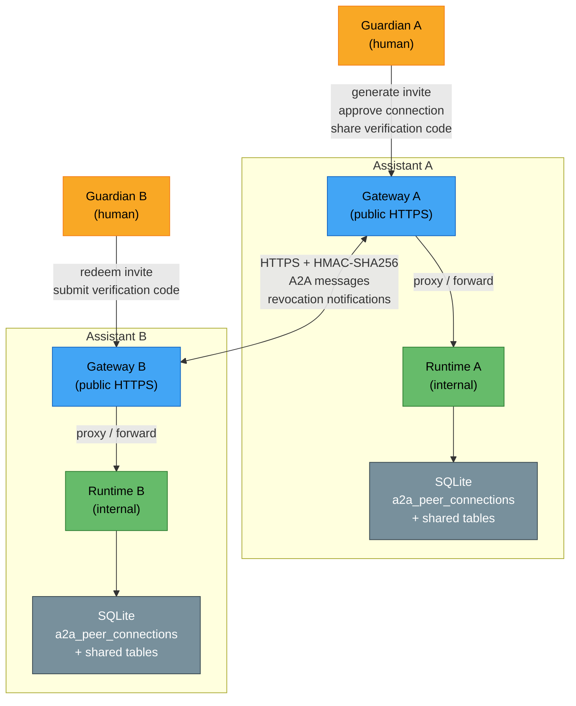
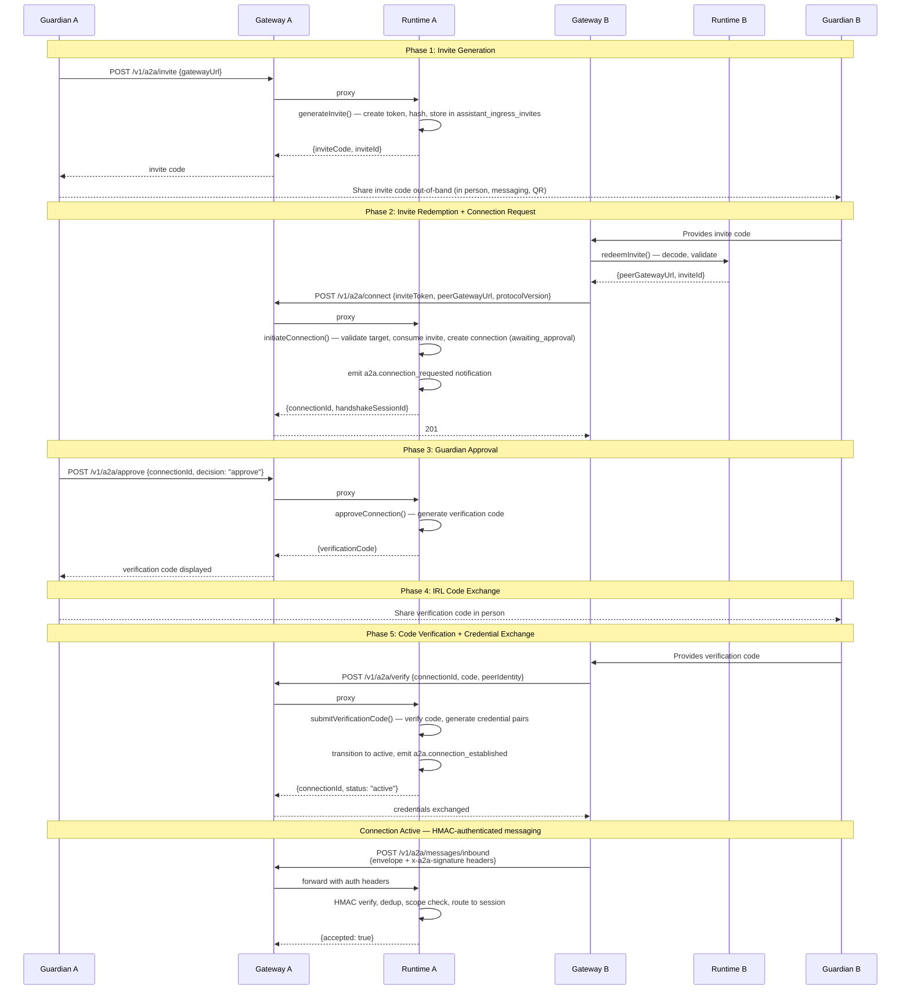
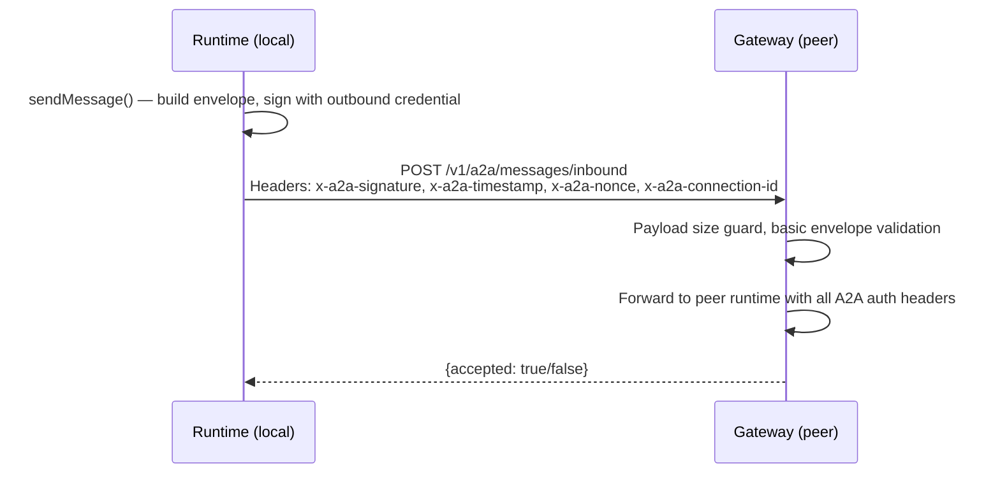
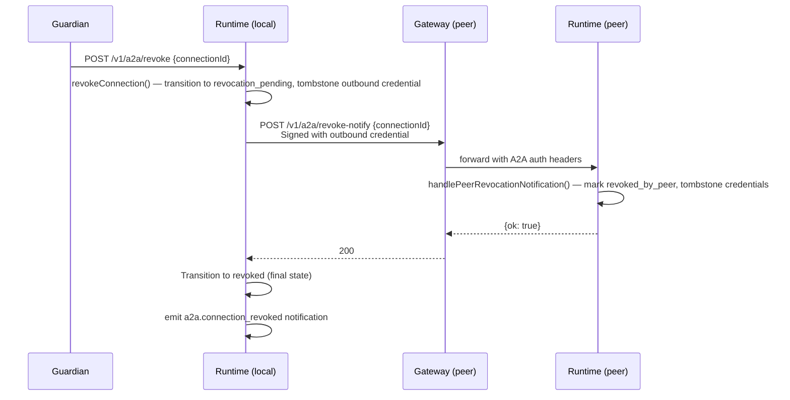
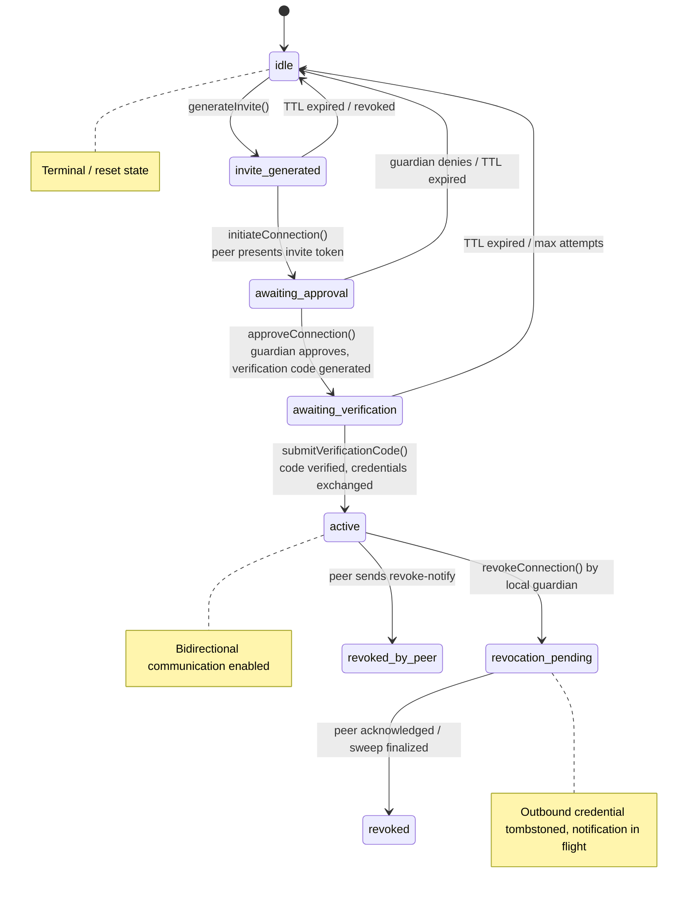
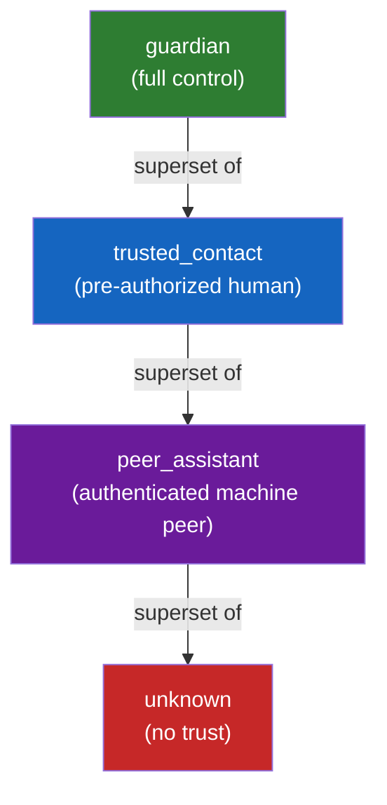
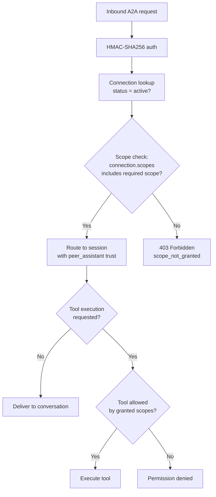

# A2A (Assistant-to-Assistant) Architecture

Comprehensive architecture reference for the A2A communications system. This document covers the full system topology, data flows, service API contract, handshake protocol, trust model, scope model, and extension points.

Related docs:
- [A2A Communications Design (constraints, threat model, protocol)](a2a-communications.md)
- [A2A Scope Model (scope semantics, catalog, policy)](a2a-scope-model.md)
- [A2A / Pairing Convergence Analysis (shared primitives evaluation)](a2a-pairing-convergence.md)
- [Security (includes approval grants)](security.md)

---

## System Overview

The A2A system enables two Vellum assistants to communicate securely over the internet. Each assistant has a gateway (public-facing) and a daemon runtime (internal). All peer-to-peer traffic routes through gateways -- the daemon is never directly reachable.



### Key Invariants

- **Gateway-only ingress**: All A2A traffic routes through the gateway. The daemon never accepts direct peer connections.
- **Assistant identity boundary**: The daemon uses `DAEMON_INTERNAL_ASSISTANT_ID` (`'self'`) for all internal scoping. Peer connections are keyed by gateway URL and connection ID, not by a peer's internal identity.
- **Fail-closed trust**: New peer connections start with zero capabilities. The guardian must explicitly grant scopes.
- **HMAC-SHA256 authentication**: All post-handshake messages are signed with per-connection credentials.

---

## Data Flow — Invite and Handshake



---

## Data Flow — Outbound Message Delivery



---

## Data Flow — Revocation



A background sweep (`a2a-revocation-sweep.ts`) retries failed revocation notifications and finalizes connections that have been in `revocation_pending` beyond the retry window.

---

## Handshake State Machine



### State Definitions

| State | Description | Timeout |
|-------|-------------|---------|
| `idle` | No connection attempt in progress | -- |
| `invite_generated` | Invite token created, waiting for peer redemption | 24 hours (default) |
| `awaiting_approval` | Peer sent connection request, guardian must approve/deny | 15 minutes |
| `awaiting_verification` | Guardian approved, verification code generated and delivered | 5 minutes (code TTL) |
| `active` | Connection live, bidirectional messaging within granted scopes | Persists until revoked |
| `revocation_pending` | Local guardian revoked, notification to peer in flight | Sweep retry window |
| `revoked` | Final state after successful local revocation | Terminal |
| `revoked_by_peer` | Peer initiated revocation | Terminal |

---

## Service API Contract — `A2AConnectionService`

All A2A operations go through a single stateless service in `assistant/src/a2a/a2a-connection-service.ts`. Every method takes structured input and returns a discriminated union result (`{ ok: true, ... } | { ok: false, reason }`) with no coupling to UI, IPC, or chat sessions.

### Management Methods (internal, bearer-auth)

| Method | Input | Success Result | Failure Reasons |
|--------|-------|---------------|----------------|
| `generateInvite()` | `{ gatewayUrl, expiresInMs?, note?, idempotencyKey? }` | `{ ok, inviteCode, inviteId }` | `missing_gateway_url`, `generation_failed` |
| `redeemInvite()` | `{ inviteCode }` | `{ ok, peerGatewayUrl, inviteId }` | `malformed_invite`, `invalid_or_expired`, `already_redeemed` |
| `approveConnection()` | `{ connectionId, decision }` | `{ ok, verificationCode?, connectionId }` | `not_found`, `invalid_state`, `already_resolved` |
| `revokeConnection()` | `{ connectionId }` | `{ ok, status }` | `not_found` |
| `listConnectionsFiltered()` | `{ status? }` | `{ connections: PeerConnection[] }` | -- (always succeeds) |
| `updateScopes()` | `{ connectionId, scopes }` | `{ ok, previousScopes, newScopes }` | `not_found`, `not_active`, `invalid_scopes` |
| `getScopes()` | `{ connectionId }` | `{ ok, connectionId, scopes }` | `not_found`, `not_active` |

### Peer-Facing Methods (unauthenticated / invite-gated / HMAC-auth)

| Method | Input | Success Result | Failure Reasons |
|--------|-------|---------------|----------------|
| `initiateConnection()` | `{ peerGatewayUrl, inviteToken, protocolVersion, capabilities, ownGatewayUrl }` | `{ ok, connectionId, handshakeSessionId }` | `invalid_target`, `version_mismatch`, `invite_not_found`, `invite_consumed` |
| `submitVerificationCode()` | `{ connectionId, code, peerIdentity }` | `{ ok, connection }` | `not_found`, `invalid_code`, `expired`, `max_attempts`, `invalid_state`, `identity_mismatch` |
| `sendMessage()` | `{ connectionId, content, correlationId? }` | `{ ok, messageId, conversationId }` | `not_found`, `not_active`, `not_enabled`, `scope_denied`, `no_credential`, `delivery_failed` |
| `handlePeerRevocationNotification()` | `{ connectionId }` | `{ ok }` | `not_found`, `already_revoked` |

### Key Design Principles

- **Stateless request-in / result-out**: No method holds references to sessions, IPC sockets, or UI state.
- **Surface-agnostic**: v1 consumers are chat skills and HTTP endpoints. v2 consumers include Telegram handlers and macOS Settings UI -- the service does not change.
- **Idempotent where possible**: `generateInvite()` supports idempotency keys; `revokeConnection()` is idempotent; CAS-based resolution prevents duplicate state mutations.

---

## Trust Model

### Trust Hierarchy



### `peer_assistant` Trust Classification

| Property | Value |
|----------|-------|
| Trust class | `peer_assistant` |
| Actor role | `peer_assistant` |
| Source channel | `assistant` |
| Default capabilities | Zero -- fail-closed |
| Capability source | Explicit scope grants from the guardian |
| Memory provenance | Peer messages indexed with `peer_assistant` provenance; extraction suppressed |
| Tool execution | No host-target or side-effect tools unless explicitly scoped |
| History view | Peer-provenance messages only; no guardian-era context replay |

### Trust Enforcement Points

| Gate | Module | Behavior for `peer_assistant` |
|------|--------|-------------------------------|
| Tool execution | `tool-approval-handler.ts` | Blocked unless scope grants the specific tool category |
| Memory write | `indexer.ts` | Segments indexed for search; `extract_items` jobs suppressed |
| Memory read | `session-memory.ts` | Empty recall result (no profile, no conflicts) |
| History view | `session-lifecycle.ts` | Only peer-provenance messages visible |
| Backfill | `job-handlers/backfill.ts` | `peer_assistant` provenance excluded from extraction |

---

## Scope Model Summary

Scopes are **asymmetric and per-connection**. Each guardian independently decides what to expose to each peer. See [A2A Scope Model](a2a-scope-model.md) for the full specification.

### Initial Scope Catalog

| Scope ID | Label | Risk | Description |
|----------|-------|------|-------------|
| `message` | Send/receive messages | Low | Text message exchange over the connection |
| `read_availability` | Read calendar availability | Low | Query free/busy information |
| `create_events` | Create calendar events | Medium | Create events/reminders (guardian confirmation may apply) |
| `read_profile` | Read basic profile | Low | Non-sensitive profile: name, timezone, language |
| `execute_requests` | Execute structured requests | High | Typed action/response patterns beyond messaging |

### Evaluation Flow



The `a2a-scope-policy` feature flag (`feature_flags.a2a-scope-policy.enabled`, default: false) gates scope enforcement on both inbound and outbound message paths. When off, inbound messages from active connections are accepted without a scope check (the tool execution gate still blocks privileged actions) and outbound sends are rejected with `not_enabled`.

---

## Peer Authentication Model

All post-handshake communication uses HMAC-SHA256 request signing. Each connection has two independent credential pairs:

- **Inbound credential**: Token the peer uses to sign requests to us. We verify against the stored credential.
- **Outbound credential**: Token we use to sign requests to the peer. The peer verifies against their stored credential.

### Request Signing

Every outbound A2A request includes four headers:

| Header | Purpose |
|--------|---------|
| `x-a2a-signature` | HMAC-SHA256 of `timestamp.nonce.body` using the outbound credential |
| `x-a2a-timestamp` | Unix epoch milliseconds when the request was created |
| `x-a2a-nonce` | Cryptographic nonce (UUID) for replay protection |
| `x-a2a-connection-id` | Connection ID for credential lookup |

### Verification

The receiver:
1. Checks the timestamp is within the replay window (5 minutes)
2. Checks the nonce has not been seen before
3. Recomputes the HMAC and compares using timing-safe comparison
4. Records the nonce to prevent replay

### Key Source Files

| File | Purpose |
|------|---------|
| `a2a-peer-auth.ts` | Credential generation, HMAC signing/verification, nonce tracking |
| `a2a-revoke-notify-auth.ts` | Signature verification for revocation notification endpoint |

---

## Message Schema

All A2A messages use the `A2AMessageEnvelope` wire format defined in `a2a-message-schema.ts`:

### Content Types

| Type | Fields | Description |
|------|--------|-------------|
| `text` | `text: string` | Plain text message |
| `structured_request` | `action: string, params: Record<string, unknown>` | Typed action request |
| `structured_response` | `action: string, result: Record<string, unknown>, success: boolean, error?: string` | Response to a structured request |

### Deduplication

Messages are deduplicated by `(connectionId, nonce)`. The dedup store (`a2a-message-dedup.ts`) tracks recently seen nonces per connection with bounded retention (10,000 entries across all connections, entries older than 10 minutes are evicted).

### Lifecycle Events

The system emits notification signals for all connection lifecycle transitions:

| Event | When |
|-------|------|
| `a2a.connection_requested` | Peer sends a connection request |
| `a2a.connection_approved` | Guardian approves a connection |
| `a2a.connection_denied` | Guardian denies a connection |
| `a2a.verification_code_ready` | Verification code generated after approval |
| `a2a.connection_established` | Handshake complete, connection active |
| `a2a.connection_revoked` | Connection revoked by either side |
| `a2a.scopes_changed` | Scope set modified by guardian |
| `a2a.message_received` | Inbound message processed |
| `a2a.message_delivered` | Outbound message accepted by peer |
| `a2a.message_failed` | Outbound delivery failed |

---

## HTTP Route Map

### Gateway Routes (public-facing)

These are the endpoints that peer assistants call. The gateway validates payload size and basic structure, then proxies to the runtime.

| Method | Path | Auth | Purpose |
|--------|------|------|---------|
| `POST` | `/v1/a2a/connect` | Invite-token-gated | Peer initiates a connection |
| `POST` | `/v1/a2a/verify` | Unauthenticated (during handshake) | Peer submits verification code |
| `GET` | `/v1/a2a/connections/:id/status` | Unauthenticated (during handshake) | Peer polls connection status |
| `POST` | `/v1/a2a/messages/inbound` | HMAC-SHA256 (x-a2a-* headers) | Peer sends a message |
| `POST` | `/v1/a2a/revoke-notify` | HMAC-SHA256 (x-a2a-* headers) | Peer sends revocation notification |

Source: `gateway/src/http/routes/a2a-proxy.ts`, `gateway/src/http/routes/a2a-inbound.ts`

### Runtime Routes (internal, bearer-auth)

Management endpoints called by the local guardian via gateway proxy or directly.

| Method | Path | Purpose |
|--------|------|---------|
| `POST` | `/v1/a2a/invite` | Generate an invite code |
| `POST` | `/v1/a2a/redeem` | Validate and decode an invite code |
| `POST` | `/v1/a2a/approve` | Approve or deny a pending connection |
| `POST` | `/v1/a2a/revoke` | Revoke a connection |
| `GET` | `/v1/a2a/connections` | List connections (optional status filter) |
| `POST` | `/v1/a2a/connections/:id/messages` | Send a message to a peer |
| `PUT` | `/v1/a2a/connections/:id/scopes` | Update connection scopes |
| `GET` | `/v1/a2a/connections/:id/scopes` | Get connection scopes |

Source: `assistant/src/runtime/routes/a2a-routes.ts`

### Runtime Routes (peer-facing, proxied from gateway)

These endpoints handle the peer-facing side of the handshake and message ingress:

| Method | Path | Purpose |
|--------|------|---------|
| `POST` | `/v1/a2a/connect` | Process connection request (validate invite, create connection) |
| `POST` | `/v1/a2a/verify` | Process verification code submission |
| `GET` | `/v1/a2a/connections/:id/status` | Return connection status |
| `POST` | `/v1/a2a/messages/inbound` | Process inbound message (HMAC verify, dedup, route to session) |
| `POST` | `/v1/a2a/revoke-notify` | Process peer revocation notification |

Source: `assistant/src/runtime/routes/a2a-routes.ts`, `assistant/src/runtime/routes/a2a-inbound-routes.ts`

---

## Rate Limiting

The A2A system has dedicated rate limiters for peer-facing endpoints to prevent abuse:

| Endpoint | Limiter | Key | Limits |
|----------|---------|-----|--------|
| `POST /v1/a2a/connect` | `connectRequestLimiter` | Client IP | Per IP |
| `POST /v1/a2a/redeem` | `inviteRedemptionLimiter` | Invite code | Per invite code |
| `POST /v1/a2a/verify` | `codeVerificationLimiter` | Connection ID | Per connection |
| `GET /v1/a2a/connections/:id/status` | `statusPollingLimiter` | Connection ID | Per connection |

Source: `assistant/src/a2a/a2a-rate-limiter.ts`

---

## Storage

### New Table: `a2a_peer_connections`

Stores the bidirectional connection state between two assistants.

| Column | Type | Description |
|--------|------|-------------|
| `id` | text PK | Connection ID (UUID) |
| `assistantId` | text | Always `DAEMON_INTERNAL_ASSISTANT_ID` |
| `peerGatewayUrl` | text | Peer's gateway URL (validated, pinned at connection time) |
| `peerDisplayName` | text? | Human-readable name for the peer |
| `peerAssistantId` | text? | Peer's assistant ID (if provided during handshake) |
| `inviteId` | text? | FK to `assistant_ingress_invites.id` |
| `status` | text | Lifecycle state (see state machine above) |
| `protocolVersion` | text | Negotiated protocol version |
| `capabilities` | text | JSON array of negotiated capabilities |
| `scopes` | text | JSON array of granted scope strings |
| `outboundCredentialHash` | text? | SHA-256 hash of credential we send to the peer |
| `inboundCredentialHash` | text? | SHA-256 hash of credential the peer sends to us |
| `inboundCredential` | text? | Raw inbound credential (for HMAC verification) |
| `lastSeenAt` | integer? | Timestamp of last successful communication |
| `createdAt` | integer | Connection creation timestamp |
| `updatedAt` | integer | Last state change timestamp |
| `revokedAt` | integer? | When the connection was revoked |
| `revokedReason` | text? | Why the connection was revoked |

### Reused Tables

| Table | A2A Usage | Discriminator |
|-------|-----------|---------------|
| `assistant_ingress_invites` | A2A invite tokens (one-time-use, TTL, hash-based storage) | `sourceChannel = 'assistant'` |
| `canonical_guardian_requests` | Connection approval requests via guardian decision primitive | `kind = 'a2a_connection_request'` |
| `channel_guardian_verification_challenges` | Verification code challenges for IRL code exchange | `channel = 'assistant'` |
| `external_conversation_bindings` | Conversation thread bindings for peer connections | `sourceChannel = 'assistant'` |

---

## Key Source Files

### `assistant/src/a2a/`

| File | Purpose |
|------|---------|
| `a2a-connection-service.ts` | Surface-agnostic orchestration layer (all service methods) |
| `a2a-peer-connection-store.ts` | SQLite CRUD for `a2a_peer_connections` table |
| `a2a-handshake.ts` | Handshake state machine, crypto helpers, verification code generation |
| `a2a-peer-auth.ts` | HMAC-SHA256 signing/verification, credential generation, nonce tracking |
| `a2a-message-schema.ts` | Wire format types: envelope, content types, lifecycle events |
| `a2a-message-dedup.ts` | Message deduplication store (bounded, per-connection) |
| `a2a-outbound-delivery.ts` | Outbound message delivery with HMAC signing |
| `a2a-revocation-delivery.ts` | Revocation notification delivery to peer |
| `a2a-revocation-sweep.ts` | Background sweep for retrying failed revocation notifications |
| `a2a-scope-catalog.ts` | Scope definitions registry (IDs, labels, risk levels) |
| `a2a-scope-policy.ts` | Scope evaluation engine (set-membership check) |
| `a2a-rate-limiter.ts` | Per-endpoint rate limiters for peer-facing routes |

### `assistant/src/runtime/routes/`

| File | Purpose |
|------|---------|
| `a2a-routes.ts` | Runtime HTTP handlers for management + peer-facing endpoints |
| `a2a-inbound-routes.ts` | Inbound message processing (HMAC verify, dedup, scope check, route) |
| `a2a-revoke-notify-auth.ts` | Signature verification for revocation notifications |

### `gateway/src/http/routes/`

| File | Purpose |
|------|---------|
| `a2a-inbound.ts` | Gateway handlers for inbound A2A messages and revocation notifications |
| `a2a-proxy.ts` | Gateway proxy for handshake endpoints (connect, verify, status) |

### `gateway/src/a2a/`

| File | Purpose |
|------|---------|
| `normalize.ts` | Type definitions for the A2A inbound envelope at the gateway layer |

---

## Target Validation

All outbound A2A requests pass through `validateA2ATarget()` before any network call:

- **HTTPS required** for all public/routable addresses
- **HTTP permitted** only for RFC 1918, loopback, and other private addresses (via `LocalAddressValidator.isLocalAddress()`)
- **Always-deny list**: cloud metadata endpoints (`169.254.0.0/16`, `fe80::/10`), port 7821 on any address (runtime port), loopback to own gateway, non-HTTP(S) schemes

---

## v2 Extension Points

The v1 design is built to be extended without protocol changes. The following areas are explicitly reserved for v2:

### Telegram Handlers

A2A connection management via Telegram (generate invite, approve connection, revoke):
- New Telegram inline button handlers in `gateway/src/telegram/` that call the same `A2AConnectionService` methods via gateway proxy endpoints
- The guardian approval flow already works via Telegram through `canonical_guardian_requests` -- A2A adds a new `kind` but uses the same delivery infrastructure

### macOS Settings UI

A "Peer Assistants" section in Settings > Connect tab:
- List active connections with status, peer name, and scopes
- Generate invite codes (calls `generateInvite()` via gateway HTTP)
- Revoke connections
- Adjust scopes per connection
- No protocol changes needed -- the macOS app calls gateway HTTP endpoints that delegate to `A2AConnectionService`

### Directory Resolver

Replace or augment invite-based discovery with a directory service:
- Implement `DirectoryResolver` conforming to the `PeerDiscoveryResolver` interface defined in the architecture doc
- The invite-code path remains available as a fallback
- The `redeemInvite()` method in `A2AConnectionService` delegates to the active resolver

### Scope Expansion

New scope strings can be added at any time:
1. Add the scope ID and metadata to `a2a-scope-catalog.ts`
2. Add tool-to-scope mapping entries in `a2a-scope-policy.ts`
3. Add gateway-side enforcement for the new scope
4. Existing connections can be upgraded by the guardian granting the new scope
5. No protocol version bump needed for additive scope additions

### Scope Hints in Handshake

Allow connecting peers to include `requestedScopes` in the handshake payload as a hint. The guardian sees suggestions in the approval UI but the granted scopes remain the guardian's decision. Additive -- no protocol version bump.

### Custom Scopes

Let guardians define custom scope IDs with descriptions and tool-pattern mappings. The `string[]` storage format already supports arbitrary scope IDs without schema migration.

---

## Operator Runbook

### Diagnosing Connection Issues

1. **Check connection status**: `GET /v1/a2a/connections?status=active` lists all active connections
2. **Check specific connection**: `GET /v1/a2a/connections/:id/status` returns current state
3. **Verify gateway URL reachability**: The peer's `peerGatewayUrl` must be reachable over HTTPS (or HTTP for LAN peers)

### Common Failure Modes

| Symptom | Likely Cause | Resolution |
|---------|-------------|-----------|
| `invalid_or_expired` on redeem | Invite TTL (24h) exceeded or already used | Generate a new invite |
| `identity_mismatch` on verify | Verification code submitted by wrong identity | Ensure the correct guardian is submitting the code |
| `max_attempts` on verify | 3 failed verification attempts | Connection is invalidated; start a new handshake |
| `scope_denied` on message | Connection lacks required scope | Guardian grants the scope via `PUT /v1/a2a/connections/:id/scopes` |
| `delivery_failed` on send | Peer gateway unreachable | Check peer's gateway URL and network connectivity |
| Connection stuck in `revocation_pending` | Peer did not acknowledge revocation | The background sweep will finalize after the retry window |

### Revoking a Connection

```
POST /v1/a2a/revoke
{ "connectionId": "<uuid>" }
```

This immediately tombstones the outbound credential and sends a revocation notification to the peer. The connection transitions through `revocation_pending` to `revoked`.

### Modifying Scopes

```
PUT /v1/a2a/connections/:id/scopes
{ "scopes": ["message", "read_availability"] }
```

Scope changes take effect immediately. The peer is optionally notified via an `a2a.scopes_changed` lifecycle event.

### Feature Flags

| Flag | Key | Default | Controls |
|------|-----|---------|----------|
| A2A Scope Policy | `feature_flags.a2a-scope-policy.enabled` | `false` | When enabled, inbound messages are checked against connection scopes and outbound sends are allowed. When disabled, all inbound messages from active connections are accepted (tool execution gate still applies) and outbound sends are rejected with `not_enabled`. |
