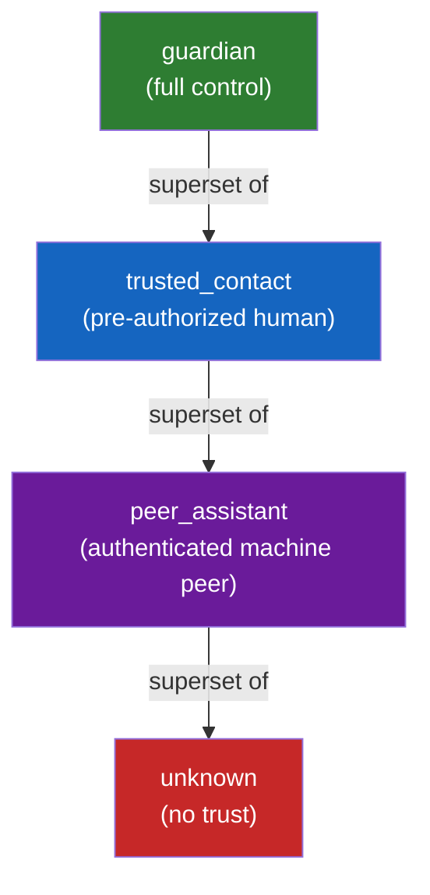
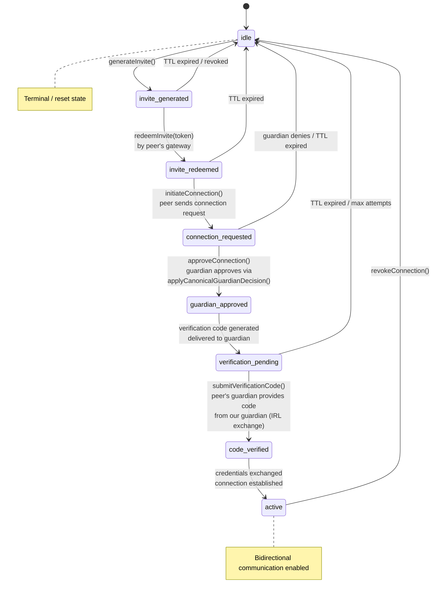

# A2A (Assistant-to-Assistant) Communications

Design constraints and architecture for enabling two Vellum assistants to communicate securely with each other.

## Required Invariants

A2A communications must respect every cross-cutting invariant already established in the system. These are not optional design preferences -- they are hard constraints enforced by guard tests and architectural boundaries.

### Gateway-only ingress

All A2A traffic -- connection handshakes, message exchange, status probes -- routes through the gateway. The daemon runtime is never directly reachable from a peer assistant. Outbound requests from this assistant to a peer's gateway are also initiated through gateway-mediated paths, never by the daemon opening outbound connections itself.

This means:
- Inbound A2A endpoints live in `gateway/` and forward internally to the runtime.
- Outbound A2A calls are made by the gateway on behalf of the runtime.
- The peer's gateway URL (obtained during the handshake) is the only network address stored and used for communication.

### Assistant identity boundary

The daemon uses `DAEMON_INTERNAL_ASSISTANT_ID` (`'self'`) for all internal scoping. A2A peer connections are identified by their external gateway URL and a peer-specific credential -- never by importing or deriving from a peer's internal assistant ID.

Concretely:
- The `a2a_peer_connections` table uses the peer's gateway URL + a locally-generated connection ID as the key, not the peer's internal identity.
- The daemon never needs to know or store a peer's `DAEMON_INTERNAL_ASSISTANT_ID` value.
- All A2A-scoped storage uses `DAEMON_INTERNAL_ASSISTANT_ID` as the owning assistant, consistent with every other daemon-scoped table.

### Actor/trust provenance

A2A peers receive a new `peer_assistant` trust classification (see Trust Model below). This classification is distinct from `guardian`, `trusted_contact`, and `unknown`. Inbound messages from a peer assistant carry `actorRole: 'peer_assistant'` in the actor context, enabling the trust gates in tool execution, memory provenance, and history view to apply appropriate policies.

### Approval decision primitive

Any guardian decisions triggered by A2A flows (e.g., "Assistant B wants to connect") route through `applyCanonicalGuardianDecision()` in `assistant/src/approvals/guardian-decision-primitive.ts`. The A2A connection approval is a new `kind` in the `canonical_guardian_requests` table with a dedicated resolver in the resolver registry.

---

## Threat Model

### Replay attacks

**Threat:** An attacker intercepts a valid handshake message and replays it to establish an unauthorized connection or re-execute a completed action.

**Mitigations:**
- Every handshake message includes a cryptographic nonce and a timestamp. The receiver validates that the nonce has not been seen before (tracked in a bounded replay window) and that the timestamp is within acceptable clock skew (e.g., 5 minutes).
- Invite tokens are one-time-use. Once redeemed, the token hash is marked `redeemed` in `assistant_ingress_invites` and cannot be used again.
- Verification codes are consumed atomically via CAS on the challenge record. A replayed code finds the challenge already consumed.

### Spoofed peer identity

**Threat:** An attacker claims to be a legitimate peer assistant to gain access.

**Mitigations:**
- Mutual authentication during the handshake: both sides exchange credentials derived from the invite flow. The invite token proves the connection was initiated by a legitimate party, and the verification code exchange proves the peer's guardian has real-world trust.
- After connection establishment, all subsequent requests carry a shared secret (bearer token or HMAC) that was exchanged during the verified handshake. Requests without valid credentials are rejected at the gateway.
- The peer's gateway URL is pinned at connection time. Messages arriving from a different origin are rejected.

### Stale code reuse

**Threat:** A verification code that was generated for one connection attempt is used for a different one.

**Mitigations:**
- Verification codes are bound to a specific connection request ID. The challenge record in `channel_guardian_verification_challenges` links to the originating request.
- Codes have a TTL (default: 10 minutes). Expired codes are rejected.
- Codes are consumed atomically -- once used, they cannot be reused.

### Downgraded scopes

**Threat:** A peer that was granted narrow scopes (e.g., read-only scheduling) attempts to escalate by presenting stale credentials from a broader previous connection.

**Mitigations:**
- Scope changes require re-authentication. The peer connection record stores the currently authorized scopes, and the gateway validates every inbound request against these scopes.
- Scope modifications go through the guardian approval flow, producing a new scope set that atomically replaces the old one.
- Credentials are bound to the current scope set. If scopes are narrowed or revoked, the old credential is invalidated.

### SSRF / open-relay via target URLs

**Threat:** A malicious peer provides a gateway URL that points to an internal service (e.g., `http://169.254.169.254/metadata`, `http://localhost:7821`), turning the assistant into an SSRF proxy.

**Mitigations:** See Target Validation Canonical Rule below.

---

## A2A Trust Model

### Trust hierarchy

The existing trust hierarchy is: `guardian > trusted_contact > unknown`. A2A introduces `peer_assistant` as a new trust classification that sits between `trusted_contact` and `unknown` in terms of default capabilities, but is semantically distinct from both.



### Classification: `peer_assistant`

| Property | Value |
|----------|-------|
| Trust class | `peer_assistant` |
| Actor role | `peer_assistant` |
| Source channel | `assistant` |
| Default capabilities | Zero -- fail-closed |
| Capability source | Explicit scope grants from the guardian |
| Memory provenance | Peer messages are indexed with `peer_assistant` provenance; recall gates apply |
| Tool execution | No host-target tools, no side-effect tools unless explicitly scoped |
| History view | Peer-provenance messages only; no guardian-era context replay |

### Fail-closed default

A newly connected peer assistant has **zero capabilities** until the guardian explicitly grants scopes. This is the same principle as the existing trust model: untrusted actors get nothing by default, and capabilities are additive.

The rationale: an assistant-to-assistant channel is a machine-to-machine interface with no human in the loop. Granting default capabilities would allow a compromised peer to take actions without guardian awareness.

### Scope-gated autonomy

Guardians can pre-authorize specific action categories for a peer:

| Scope | Grants | Example |
|-------|--------|---------|
| `scheduling:read` | Read calendar/reminder state | Peer checks if a time slot is free |
| `scheduling:write` | Create/modify reminders | Peer creates a shared reminder |
| `preferences:read` | Read non-sensitive preferences | Peer asks for timezone |
| `messaging:relay` | Relay messages to the guardian | Peer forwards a notification |
| `memory:query` | Query non-sensitive memory items | Peer asks for shared context |

Scope definitions are extensible. New scopes can be added without protocol changes -- they are opaque strings validated by the gateway's scope enforcement layer. The guardian can grant and revoke scopes per-connection at any time.

---

## Handshake State Machine

The connection handshake follows a multi-step flow with guardian approval and IRL (in-real-life) code exchange as the trust anchor.



### State definitions

| State | Description | Timeout |
|-------|-------------|---------|
| `idle` | No connection attempt in progress. | -- |
| `invite_generated` | Guardian A generated an invite code. The invite encodes the gateway URL + a one-time token. Waiting for peer to redeem. | Invite TTL (default: 24 hours) |
| `invite_redeemed` | Peer's gateway redeemed the invite token. The token is consumed (one-time use). | 1 hour from redemption |
| `connection_requested` | The peer has sent a formal connection request. Guardian A is notified and must approve or deny. | Guardian approval TTL (default: 24 hours) |
| `guardian_approved` | Guardian A approved the connection. A verification code is generated and delivered to Guardian A. | -- (transitions immediately to `verification_pending`) |
| `verification_pending` | Waiting for the IRL code exchange. Guardian A gives the code to Guardian B in person; Guardian B's assistant submits it. | Code TTL (default: 10 minutes) |
| `code_verified` | Code verified successfully. Both sides exchange long-lived credentials. | -- (transitions immediately to `active`) |
| `active` | Connection is live. Both assistants can communicate within granted scopes. | No timeout; persists until revoked |

### Failure modes

| Failure | Behavior |
|---------|----------|
| Invite token invalid/expired | `redeemInvite()` returns `{ ok: false, reason: 'invalid_or_expired' }` |
| Guardian denies connection | Connection request is rejected; peer is notified; state returns to `idle` |
| Verification code wrong | Attempt is logged; peer can retry up to 3 times before the session is invalidated |
| Verification code expired | Session returns to `idle`; a new connection attempt must start from `invite_generated` |
| Peer gateway unreachable | Outbound requests fail with network error; connection state remains unchanged; retry is caller's responsibility |
| Protocol version mismatch | Clear error returned during `initiateConnection()`; connection is not established |

### IRL code exchange flow

The verification code exchange is the trust anchor for A2A connections. It follows the same pattern as the existing trusted contact verification flow:

1. Guardian A generates a connection invite and shares the invite code with Guardian B out-of-band (in person, phone call, etc.).
2. Guardian B's assistant redeems the invite and sends a connection request.
3. Guardian A approves the request. The system generates a short verification code and delivers it to Guardian A.
4. Guardian A gives the verification code to Guardian B in person.
5. Guardian B enters the code into their assistant (via chat, Settings UI, etc.).
6. The code is verified, and the connection becomes active.

This two-step out-of-band exchange (invite code + verification code) ensures both guardians have real-world trust in each other and prevents remote-only attacks.

---

## Surface-Agnostic Service API Contract

All A2A connection operations are exposed through a single stateless service -- `A2AConnectionService`. The service methods accept structured input and return structured results with no coupling to any specific UI surface, IPC transport, or chat interface.

### Service methods

```
A2AConnectionService
├── generateInvite(options?) → { ok, inviteCode, inviteId } | { ok: false, reason }
├── redeemInvite(token) → { ok, connectionRequestId, peerGatewayUrl } | { ok: false, reason }
├── initiateConnection(inviteRedemptionId) → { ok, connectionId } | { ok: false, reason }
├── approveConnection(requestId) → { ok } | { ok: false, reason }
├── submitVerificationCode(connectionId, code) → { ok } | { ok: false, reason }
├── revokeConnection(connectionId) → { ok } | { ok: false, reason }
├── listConnections(filters?) → { connections: PeerConnection[] }
└── [deferred] sendMessage(connectionId, message) → (not implemented until trust gating + scopes are in place)
```

### Method contracts

| Method | Input | Output (success) | Output (failure) |
|--------|-------|-------------------|-------------------|
| `generateInvite` | `{ idempotencyKey?: string, expiresInMs?, note? }` | `{ ok: true, inviteCode: string, inviteId: string }` | `{ ok: false, reason: 'generation_failed' }` |
| `redeemInvite` | `{ token: string, peerGatewayUrl: string, protocolVersion: string, capabilities: string[] }` | `{ ok: true, connectionRequestId: string }` | `{ ok: false, reason: 'invalid_or_expired' \| 'already_redeemed' \| 'version_mismatch' }` |
| `initiateConnection` | `{ redemptionId: string, peerInfo: PeerInfo }` | `{ ok: true, connectionId: string }` | `{ ok: false, reason: 'not_found' \| 'expired' }` |
| `approveConnection` | `{ requestId: string }` | `{ ok: true }` | `{ ok: false, reason: 'not_found' \| 'already_resolved' \| 'identity_mismatch' }` |
| `submitVerificationCode` | `{ connectionId: string, code: string }` | `{ ok: true }` | `{ ok: false, reason: 'invalid_code' \| 'expired' \| 'max_attempts' }` |
| `revokeConnection` | `{ connectionId: string }` | `{ ok: true }` | `{ ok: false, reason: 'not_found' }` |
| `listConnections` | `{ status?: string }` | `{ connections: PeerConnection[] }` | -- (always succeeds, returns empty array) |

### Design principles

- **Stateless request-in / result-out.** Every method takes a typed input and returns a discriminated union result. No method holds a reference to chat sessions, IPC sockets, or UI state.
- **Surface consumers.** v1: chat skills call the service via the daemon's tool executor. v2: Telegram handlers and macOS Settings UI call the same service through gateway HTTP endpoints. The service does not change across surfaces.
- **`sendMessage()` is deferred.** Message exchange between peers is not implemented until the trust gating and scope enforcement infrastructure is in place. The service contract reserves the method signature.

---

## Invite-Based Discovery Model

### v1: Invite codes

Discovery in v1 is entirely invite-based. There is no directory, no public registry, and no way to find a peer assistant without an explicit invite from its guardian.

An invite code encodes:
- The assistant's gateway URL (how to reach it).
- A one-time token (proof of invitation, SHA-256 hashed in storage).
- Metadata: protocol version, expiry timestamp.

The invite is a compact, share-friendly string (base64url-encoded JSON payload or similar). The guardian generates it via `generateInvite()` and shares it out-of-band (in person, messaging app, QR code, etc.).

### Resolver abstraction

The discovery mechanism is abstracted behind a resolver interface so the backend can swap implementations without changing the connection handshake:

```typescript
interface PeerDiscoveryResolver {
  resolve(input: DiscoveryInput): Promise<DiscoveryResult>;
}

// v1: Invite-based resolver
// Parses the invite code, extracts gateway URL and token, validates.
class InviteCodeResolver implements PeerDiscoveryResolver { ... }

// v2 (future): Directory-backed resolver
// Looks up the peer by name/ID in a directory service.
class DirectoryResolver implements PeerDiscoveryResolver { ... }
```

The `redeemInvite()` method in `A2AConnectionService` delegates to the active resolver. In v1, this is always `InviteCodeResolver`. In v2, the resolver can be swapped or composed (try directory first, fall back to invite code).

---

## Target Validation Canonical Rule

All outbound A2A requests must pass through target URL validation before any network call is made. This is a single rule applied identically in local dev and production -- no environment branching.

### Allowed targets

- **HTTPS required** for all public/routable addresses.
- **HTTP permitted** only when `LocalAddressValidator.isLocalAddress()` returns true (RFC 1918, loopback, etc.), matching the existing iOS pairing behavior.

### Always-deny list

| Target | Reason |
|--------|--------|
| `169.254.0.0/16` (link-local) | AWS/GCP metadata endpoint; SSRF vector |
| `fe80::/10` (IPv6 link-local) | Same |
| Port `7821` on any address | Runtime port; direct daemon access bypasses gateway |
| Loopback to own gateway | Self-connection is meaningless and could cause infinite loops |
| Non-HTTP(S) schemes | Only `https://` (and `http://` for local addresses) are valid |

### Validation enforcement point

Target validation runs at the gateway layer before any outbound A2A request is dispatched. The daemon never constructs or sends outbound requests directly -- it asks the gateway to make the call, and the gateway applies the validation rule.

The validation function signature:

```typescript
function validateA2ATarget(url: string): { ok: true } | { ok: false, reason: string }
```

This function is pure (no I/O, no environment branching) and unit-testable. It is the single source of truth for target safety.

---

## Protocol Versioning

### Version negotiation

Every connection handshake includes `protocolVersion` and `capabilities` in the initial exchange:

```typescript
interface HandshakePayload {
  protocolVersion: string;   // semver, e.g., '1.0.0'
  capabilities: string[];    // e.g., ['scheduling:read', 'messaging:relay']
  gatewayUrl: string;
  // ... other fields
}
```

### Compatibility rules

- **Major version mismatch:** Connection is rejected with a clear error: `{ ok: false, reason: 'version_mismatch', detail: 'Expected major version 1, got 2' }`.
- **Minor version mismatch:** Connection proceeds. The higher-version peer downgrades to the intersection of capabilities.
- **Capabilities:** Each side advertises what it supports. The effective capability set is the intersection. Unknown capabilities are ignored (forward compatibility).

### Version field in storage

The `a2a_peer_connections` table stores `protocolVersion` for each active connection. This enables:
- Graceful upgrade paths (notify peers when a new version is available).
- Diagnostics (identify connections using outdated protocols).
- Selective feature gating (only use a capability if the peer's protocol version supports it).

---

## Table Reuse Strategy

A2A connections reuse existing tables where the schema already supports the required data shape, and introduces one new table for peer-specific state.

### Reused tables

| Table | Reuse pattern | A2A-specific discriminator |
|-------|---------------|---------------------------|
| `assistant_ingress_invites` | Store A2A invite tokens. Same one-time-use, TTL, and hash-based storage pattern. | `sourceChannel = 'assistant'` |
| `canonical_guardian_requests` | Store connection approval requests. Guardian approves/denies via the same decision primitive. | `kind = 'a2a_connection_request'` |
| `channel_guardian_verification_challenges` | Store verification code challenges for the IRL code exchange step. Same identity-bound, CAS-consumed pattern. | `channel = 'assistant'` |
| `external_conversation_bindings` | Bind A2A conversation threads to peer connections for message routing. | `sourceChannel = 'assistant'` |

### New table: `a2a_peer_connections`

This table stores the bidirectional connection state between two assistants.

| Column | Type | Description |
|--------|------|-------------|
| `id` | text PK | Connection ID (UUID) |
| `assistantId` | text | Always `DAEMON_INTERNAL_ASSISTANT_ID` |
| `peerGatewayUrl` | text | The peer's gateway URL (validated, pinned at connection time) |
| `peerDisplayName` | text? | Human-readable name for the peer (set by guardian) |
| `inviteId` | text? | FK to `assistant_ingress_invites.id` |
| `status` | text | Connection lifecycle: `pending`, `awaiting_verification`, `active`, `suspended`, `revoked` |
| `protocolVersion` | text | Negotiated protocol version |
| `capabilities` | text | JSON array of negotiated capabilities |
| `scopes` | text | JSON array of granted scope strings |
| `outboundCredentialHash` | text | SHA-256 hash of the credential we send to the peer |
| `inboundCredentialHash` | text | SHA-256 hash of the credential the peer sends to us |
| `lastSeenAt` | integer? | Timestamp of last successful communication |
| `createdAt` | integer | Connection creation timestamp |
| `updatedAt` | integer | Last state change timestamp |
| `revokedAt` | integer? | When the connection was revoked |
| `revokedReason` | text? | Why the connection was revoked |

Indexes:
- `idx_a2a_peer_connections_status` on `(assistantId, status)` for listing active connections.
- `idx_a2a_peer_connections_gateway_url` on `(peerGatewayUrl)` for URL-based lookup.

---

## v2 Extension Points

The v1 design is built to be extended without protocol changes. The following areas are explicitly reserved for v2:

### Telegram handlers

A2A connection management via Telegram (generate invite, approve connection, revoke):
- New Telegram inline button handlers in `gateway/src/telegram/` that call the same `A2AConnectionService` methods.
- The guardian approval flow already works via Telegram through `canonical_guardian_requests` -- A2A adds a new `kind` but uses the same delivery infrastructure.

### macOS Settings UI

A "Peer Assistants" section in the Settings > Connect tab:
- List active connections with status, peer name, and scopes.
- Generate invite codes (calls `generateInvite()` via gateway HTTP).
- Revoke connections.
- Adjust scopes per connection.
- No protocol changes needed -- the macOS app calls gateway HTTP endpoints that delegate to `A2AConnectionService`.

### Directory resolver

Replace or augment invite-based discovery with a directory service:
- Implement `DirectoryResolver` conforming to the `PeerDiscoveryResolver` interface.
- The `redeemInvite()` path remains available as a fallback.
- Directory entries could be published voluntarily by guardians who want their assistant to be discoverable.

### Scope expansion

New scope strings can be added at any time:
- Define the scope string (e.g., `tasks:delegate`).
- Add gateway-side enforcement for the new scope.
- Existing connections can be upgraded by the guardian granting the new scope.
- No protocol version bump needed for additive scope additions.

---

## Per-PR Definition of Done

Every PR that implements part of the A2A communications system must meet these criteria before merge:

### Test coverage

- **Unit/integration tests for all handshake state transitions.** Every edge in the state machine diagram must have at least one test covering the happy path and at least one covering the failure/timeout path.
- **Authorization checks tested.** Every method in `A2AConnectionService` that requires identity validation must have tests for:
  - Valid identity (passes).
  - Missing identity (fails with clear reason).
  - Wrong identity (fails with clear reason).
  - Expired credential (fails with clear reason).

### Negative tests for security-critical paths

- **Replay protection:** Test that a replayed nonce or timestamp is rejected.
- **Stale code reuse:** Test that a consumed verification code cannot be reused.
- **Scope escalation:** Test that a peer cannot access capabilities outside its granted scopes.
- **Target validation:** Test every entry in the always-deny list. Test HTTP-over-public-address rejection. Test HTTPS-over-local-address acceptance.
- **Identity binding:** Test that a verification code from the wrong identity is rejected with the same error as an invalid code (anti-oracle invariant).

### Idempotency guarantees

- **`generateInvite()`**: Idempotent per caller-supplied `idempotencyKey`. When a key is provided and an invite with that key already exists, the existing invite is returned instead of creating a duplicate. When no key is provided, a new invite is always created (fire-and-forget usage).
- **`redeemInvite()`**: Not idempotent by design (one-time use), but the second call returns `{ ok: false, reason: 'already_redeemed' }` deterministically.
- **`approveConnection()` / `submitVerificationCode()`**: CAS-based resolution. Concurrent calls race safely; exactly one wins and subsequent calls return `already_resolved`.
- **`revokeConnection()`**: Idempotent. Revoking an already-revoked connection is a no-op that returns `{ ok: true }`. Callers can safely retry after network failures without distinguishing first-revoke from repeat-revoke.
- **All mutating endpoints must be safe to retry** after network failures. The caller should be able to retry without creating duplicate state or corrupting the connection lifecycle.
