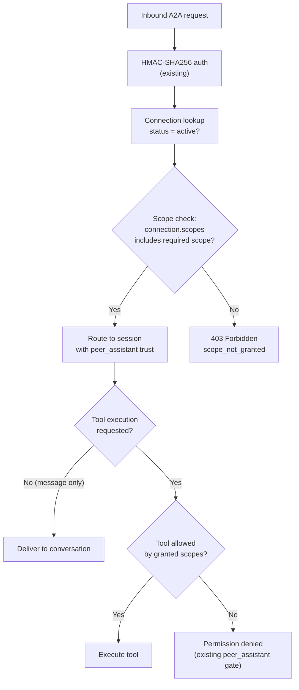
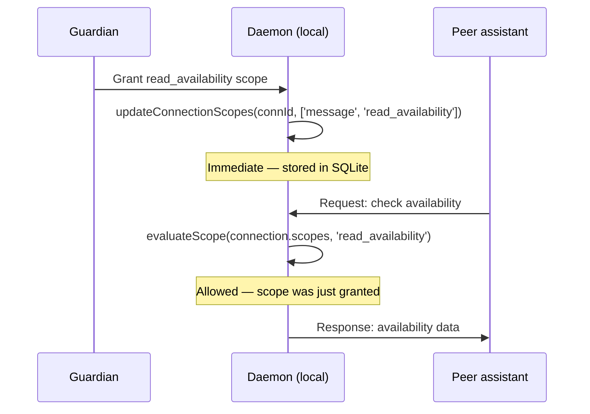
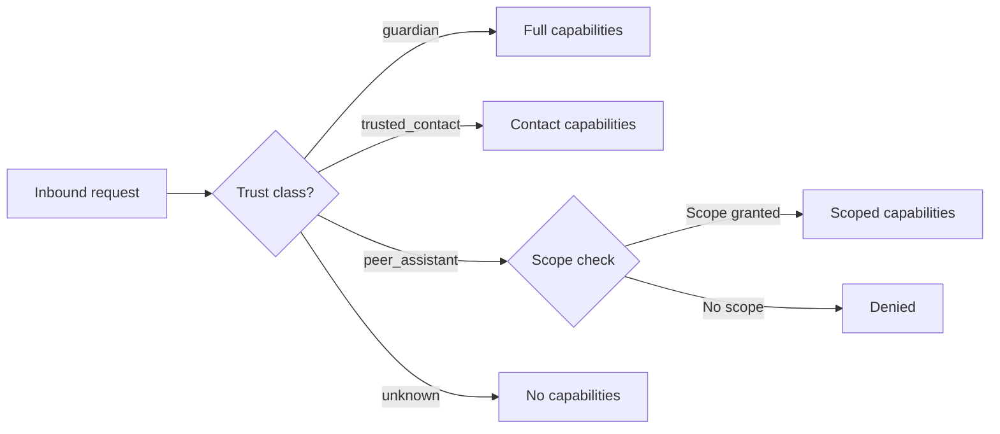

# A2A Scope Model

Defines how guardians control what their assistant exposes to each peer assistant, how scope grants map to runtime policy decisions, and how the model evolves.

---

## Scope Semantics

Scopes are **asymmetric and per-connection**. Each guardian independently decides what their assistant exposes to a specific peer -- there is no global scope configuration, and no assumption of reciprocity.

Concretely:
- Guardian A grants `read_availability` to Harrison's assistant. This means Harrison's assistant can query Guardian A's calendar. It says nothing about what Guardian A's assistant can do on Harrison's side.
- Guardian A might grant `message` + `read_availability` to one peer and only `read_profile` to another. Scopes are set per connection, not per peer identity.
- Revoking a scope on one connection has no effect on other connections, even to the same peer.

### Zero-scope default

All connections start with zero scopes. The `peer_assistant` trust class is fail-closed: until the guardian explicitly grants at least one scope, the peer can do nothing. This is enforced by the existing gate in `tool-approval-handler.ts` which blocks all tool execution for `peer_assistant` actors.

### Scope as a filter, not a gate

The **trust class** (`peer_assistant`) is the gate -- it determines whether the actor is recognized at all. **Scopes** are the filter within that gate -- they determine which specific actions are allowed. A request must pass both checks:

1. Is the actor a `peer_assistant` on an active connection? (trust gate)
2. Does the connection have a scope that covers the requested action? (scope filter)

---

## Initial Scope Catalog

| ID | Label | Description | Risk | Default |
|----|-------|-------------|------|---------|
| `message` | Send/receive messages | Allow sending and receiving text messages over the A2A connection. The minimal scope for any communication. | Low | No |
| `read_availability` | Read calendar availability | Allow reading calendar free/busy information and time slot availability. Does not expose event details -- only whether a slot is free or busy. | Low | No |
| `create_events` | Create calendar events | Allow creating calendar events (meetings, reminders). The peer can propose events; the assistant may still require guardian confirmation depending on the event's properties. | Medium | No |
| `read_profile` | Read basic profile | Allow reading non-sensitive profile information: display name, timezone, preferred language, and other guardian-published metadata. | Low | No |
| `execute_requests` | Execute structured requests | Allow executing structured A2A requests (`structured_request` content type). This is a broader permission that enables typed action/response patterns beyond simple messaging. | High | No |

### Scope ID format

Scope IDs are lowercase, underscore-separated strings. They are opaque to the transport layer -- the gateway and message envelope carry them as `string[]` without parsing.

### Why no scopes are granted by default

The A2A channel is a machine-to-machine interface with no human in the loop for individual messages. Granting any default scope would allow a newly connected peer to take actions before the guardian has reviewed the connection. The guardian must make an explicit decision for each scope grant.

---

## Scope-to-Policy Mapping

When a peer assistant sends a message or request, the scope engine evaluates the connection's granted scopes against the action being attempted. The mapping from scopes to allowed actions is defined by a policy table.

### Policy table

| Scope | Allowed actions | Enforcement point |
|-------|----------------|-------------------|
| `message` | Send/receive `text` content type messages on the connection. The peer's messages are routed to the assistant's conversation thread for the connection. | Inbound route handler (`a2a-inbound-routes.ts`) checks scope before routing to `processMessage`. |
| `read_availability` | Execute calendar read actions: query free/busy, list availability windows. Maps to specific tool invocations the assistant can make on behalf of the peer. | Scope engine intercepts tool calls in the peer's session and allows only calendar-read tools. |
| `create_events` | Execute calendar write actions: create events, create reminders. The assistant may layer additional guardian confirmation on top depending on event properties (e.g., events with other attendees). | Scope engine allows calendar-write tools. Guardian confirmation is orthogonal -- scopes control whether the action is even considered. |
| `read_profile` | Return profile metadata (name, timezone, language) in response to profile queries. No tool execution -- the assistant assembles the response from config/memory. | Scope engine allows profile-read responses. |
| `execute_requests` | Process `structured_request` content type messages and return `structured_response`. The action field in the request is validated against a secondary action allowlist if one is configured. | Inbound route handler checks scope. Action-level filtering is an optional second layer. |

### Evaluation flow



### Scope resolution function

The scope engine exposes a single pure function:

```typescript
function evaluateScope(
  connectionScopes: string[],
  requiredScope: string,
): { allowed: true } | { allowed: false; reason: string }
```

For v1, this is a simple set-membership check. The function is pure (no I/O, no side effects) and unit-testable. Future versions can add scope hierarchies or compound scope expressions without changing the call signature.

### Tool-to-scope mapping

Each tool (or tool category) declares which scope is required for peer assistant invocation. This is a static mapping maintained alongside tool definitions:

| Tool / action category | Required scope |
|-----------------------|---------------|
| `sendMessage` (outbound text) | `message` |
| Calendar read tools (free/busy, availability) | `read_availability` |
| Calendar write tools (create event, create reminder) | `create_events` |
| Profile query responses | `read_profile` |
| `structured_request` processing | `execute_requests` |

When a tool has no mapping entry, it falls through to the existing `peer_assistant` deny-all gate -- no scope can authorize it. This is the fail-closed default.

---

## Scope Negotiation at Connection Time

### v1: No negotiation

In v1, there is no scope negotiation at connection time. All connections are established with zero scopes (`scopes: []` in `a2a_peer_connections`). The guardian configures scopes after the connection is active, through the Settings UI or chat commands.

### Rationale

Negotiation adds protocol complexity (propose/counter-propose/accept) that is not justified when the guardian is the sole authority. The guardian sees the connected peer, decides what to allow, and grants scopes unilaterally. The peer does not need to "request" scopes -- the guardian's decision is final.

### v2 extension: Scope hints

A future version could allow the connecting peer to include `requestedScopes` in the handshake payload as a hint. The guardian would see these as suggestions in the approval UI, but the granted scopes are still entirely the guardian's decision. This is additive and does not require a protocol version bump.

---

## Scope Change Propagation

### Local effect: immediate

When the guardian changes scopes for a connection (via `updateConnectionScopes()` in the store), the effect is immediate. The next inbound request from the peer is evaluated against the updated scope set. There is no caching or replication delay because the scope check reads directly from the `a2a_peer_connections` table.



### Peer notification: optional

When scopes change, the daemon can optionally notify the peer so the peer's UI can reflect the updated capabilities. This notification is best-effort and not required for correctness -- the peer will discover scope changes when its next request succeeds or fails.

The notification uses the existing A2A lifecycle event infrastructure:

```typescript
// New lifecycle event (additive — no protocol change)
'a2a.scopes_changed': {
  connectionId: string;
  scopes: string[];       // The updated scope set
  timestamp: number;
}
```

The peer receiving this event can update its local view of the connection's capabilities. If the notification is lost (network failure, peer offline), the peer's next request will be evaluated against the current scopes and the response will implicitly convey the scope state.

### Scope narrowing

Revoking a scope takes effect immediately. Any in-flight request that started before the revocation but arrives after it will be denied. This is the correct behavior -- there is no grace period for scope narrowing.

---

## Extensibility Model

### v1: Fixed catalog only

In v1, only the scopes defined in the Initial Scope Catalog are recognized. The scope engine validates granted scopes against the catalog and rejects unknown scope IDs. This prevents typos and undefined behavior from unrecognized scopes.

```typescript
const SCOPE_CATALOG = new Set([
  'message',
  'read_availability',
  'create_events',
  'read_profile',
  'execute_requests',
]);

function isValidScope(scopeId: string): boolean {
  return SCOPE_CATALOG.has(scopeId);
}
```

### v2: Adding new built-in scopes

New scopes are added by:
1. Adding the scope ID to the catalog set.
2. Adding the tool-to-scope mapping entries.
3. Adding scope enforcement at the relevant enforcement points.

No protocol changes are needed. Existing connections can be upgraded by the guardian granting the new scope. Peers running older versions will ignore unknown scopes in notifications (forward compatibility).

### v2: Custom scopes

Custom (user-defined) scopes are a potential v2 extension. The design would:
- Allow guardians to define custom scope IDs with descriptions.
- Require custom scopes to map to specific tool patterns or action categories.
- Store custom scope definitions in the assistant's config, not in the protocol.
- Keep the wire format unchanged -- custom scopes are still `string[]` in the connection record.

This extension is deferred because v1 needs to validate the scope model with a fixed catalog before adding user-extensibility. The `string[]` storage format already supports arbitrary scope IDs, so no schema migration is needed.

---

## Integration with Trust Gating (M12)

The scope model integrates with the existing trust hierarchy at two levels.

### Level 1: Trust class gate

The `peer_assistant` trust class is the first gate. It is assigned by `actor-trust-resolver.ts` when `sourceChannel === 'assistant'`. This classification triggers:
- Memory provenance isolation (peer messages indexed with `peer_assistant` provenance).
- History view isolation (peer-provenance messages only, no guardian-era context).
- Tool execution gate (no host-target or side-effect tools unless scoped).

### Level 2: Scope filter

Within the `peer_assistant` trust class, scopes provide fine-grained control. The evaluation chain:



### Modification to tool-approval-handler.ts

The current `peer_assistant` handling in `tool-approval-handler.ts` is a blanket deny:

```typescript
if (context.guardianTrustClass === 'peer_assistant') {
  // Block all tool execution
}
```

With scopes, this becomes:

```typescript
if (context.guardianTrustClass === 'peer_assistant') {
  const connection = getConnectionForSession(context);
  const requiredScope = getRequiredScopeForTool(name);
  if (!requiredScope || !connection?.scopes.includes(requiredScope)) {
    // Deny: no scope covers this tool
  }
  // Allow: scope grants this tool
}
```

The blanket deny is the correct starting state. The scope-aware check replaces it when the scope engine is implemented.

### Scope does not override trust constraints

Scopes can only grant capabilities that the `peer_assistant` trust class permits. Even with `execute_requests` scope, a peer cannot:
- Execute host-target tools (blocked by trust class).
- Read guardian-era conversation history (blocked by history view gate).
- Trigger memory profile extraction (blocked by memory provenance gate).

Scopes operate strictly within the boundaries of the trust class.

---

## Schema Reference

The scope model uses the existing `scopes` column in `a2a_peer_connections`:

```sql
scopes TEXT NOT NULL DEFAULT '[]'
-- JSON array of granted scope ID strings
-- Example: '["message", "read_availability"]'
```

### Store API

Reading scopes:
```typescript
import { getConnection } from '../a2a/a2a-peer-connection-store.js';

const connection = getConnection(connectionId);
const scopes: string[] = connection.scopes;  // Already parsed from JSON
```

Writing scopes:
```typescript
import { updateConnectionScopes } from '../a2a/a2a-peer-connection-store.js';

updateConnectionScopes(connectionId, ['message', 'read_availability']);
// Atomically replaces the scope set and updates `updatedAt`
```

The store handles JSON serialization/deserialization internally. Callers work with `string[]`.

---

## Decisions

| Decision | Rationale |
|----------|-----------|
| **Asymmetric, per-connection scopes** | Each guardian is the sole authority over their assistant's exposure. No assumption of reciprocity -- what I expose to you is independent of what you expose to me. |
| **Zero scopes by default** | Fail-closed is the only safe default for a machine-to-machine channel with no human in the loop per message. The guardian must make an explicit grant. |
| **No negotiation in v1** | Negotiation adds protocol complexity without value when the guardian is the sole decision-maker. Scope hints can be added in v2 without protocol changes. |
| **Simple set-membership evaluation** | A flat set check (`scopes.includes(required)`) is sufficient for v1. Hierarchical scopes (e.g., `calendar:*` implying `calendar:read`) can be added later without changing the evaluation interface. |
| **Fixed catalog in v1** | A fixed catalog prevents undefined scope behavior and catches configuration errors. The `string[]` wire format already supports future custom scopes without migration. |
| **Immediate local propagation** | SQLite reads are consistent within the daemon process. No cache invalidation or replication needed. The next request sees the updated scopes. |
| **Optional peer notification** | Correctness does not depend on the peer knowing about scope changes. The notification is a UX convenience -- the peer can update its UI, but the daemon enforces scopes regardless. |
| **Scopes filter within trust class** | Scopes never override trust class constraints. A `peer_assistant` with `execute_requests` still cannot run host-target tools. This preserves the layered security model. |

---

## Future Work

### v2: Scope hierarchies

Introduce parent-child scope relationships (e.g., `calendar` implies `read_availability` + `create_events`). The evaluation function gains a `resolveScope()` step that expands a granted scope into its children before the set-membership check.

### v2: Scope hints in handshake

Allow the connecting peer to include `requestedScopes` in the handshake payload. The guardian sees these as suggestions, not demands. Additive -- no protocol version bump.

### v2: Custom scopes

Let guardians define custom scope IDs with descriptions and tool-pattern mappings. Requires a config-backed scope registry and UI for managing custom definitions.

### v2: Scope change audit log

Record every scope change (grant, revoke, modification) with timestamp, actor (guardian), and the before/after scope sets. Useful for compliance and debugging. Can be stored in an existing audit table or a new `a2a_scope_changes` table.

### v2: Compound scope expressions

Support boolean expressions (`read_availability AND create_events`) for tool actions that require multiple scopes. The evaluation function extends to handle `AND`/`OR` operators over the scope set.

### v2: Time-bounded scopes

Allow scopes with an expiry time (e.g., "grant `create_events` for the next 24 hours"). Requires adding an optional `expiresAt` per-scope, changing the storage from `string[]` to `{ scopeId: string, expiresAt?: number }[]`.
