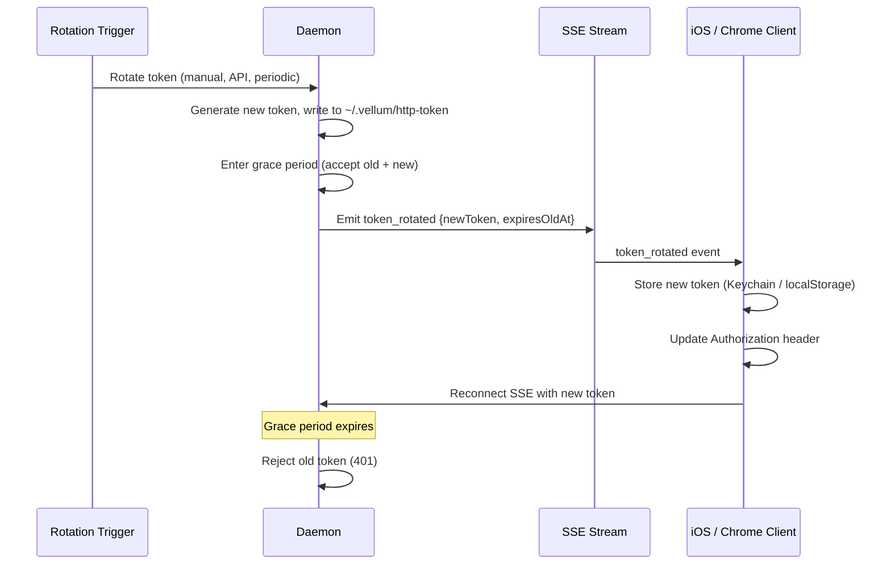

# HTTP Token Refresh Protocol

Design for how the daemon notifies clients of bearer token rotation and how clients recover from stale tokens.

## Current State

The daemon's HTTP bearer token is generated at startup and persisted to `~/.vellum/http-token` (mode 0600). Clients read this file at connection time:

- **macOS (local)**: Reads `~/.vellum/http-token` from disk via `resolveHttpTokenPath()` / `readHttpToken()`. Has direct filesystem access to the token file.
- **iOS (remote)**: Receives the bearer token during the QR-code pairing flow. The token is stored in the iOS Keychain and used for all subsequent HTTP/SSE requests.
- **Chrome extension**: User manually pastes the token from `~/.vellum/http-token` into the extension popup.

Token regeneration today (macOS Settings > Connect > Regenerate Bearer Token):
1. macOS client writes a new random token to `~/.vellum/http-token`.
2. macOS client kills the daemon process.
3. The health monitor restarts the daemon, which reads the new token from disk.
4. macOS client re-reads the token from disk on next health check.
5. **iOS clients are broken** -- they still hold the old token and get 401s. The only recovery is to re-pair via QR code.

## Problem

When the bearer token is rotated (manually or programmatically), remote clients (iOS, Chrome extension) have no way to learn about the new token. They receive 401 responses and cannot recover without manual re-configuration.

## Design

### 1. SSE Token Rotation Event

When the daemon detects that its bearer token has changed, it emits a `token_rotated` SSE event to all connected clients **before** the old token is invalidated. This gives clients a window to capture the new token and seamlessly reconnect.

**Event format** (delivered as an `AssistantEvent` envelope wrapping a new `ServerMessage` type):

```typescript
// New ServerMessage variant
interface TokenRotatedMessage {
  type: 'token_rotated';
  newToken: string;     // The replacement bearer token
  expiresOldAt: number; // Unix timestamp (ms) -- old token stops working after this
}
```

**Grace period**: The daemon accepts both old and new tokens for a configurable grace window (default: 30 seconds) after emitting the event. This gives slow clients time to process the event and switch tokens. After the grace period, only the new token is valid.

**Sequence diagram**:



### 2. Client 401 Recovery (Stale Token Detection)

If a client misses the SSE event (network partition, app backgrounded, SSE disconnected at rotation time), it needs a fallback recovery mechanism.

**401 response handling**:

When a client receives a `401 Unauthorized` response:

1. **macOS (local)**: Re-reads `~/.vellum/http-token` from disk. If the token differs from the in-memory token, updates and retries. This already works implicitly since macOS re-reads the token on most HTTP calls via `resolveLocalDaemonHTTPEndpoint()`.

2. **iOS (remote)**: Cannot read the token file. Must re-pair via QR code. The 401 response triggers the client to surface a "Session expired -- re-pair required" UI prompt. This is the expected behavior when the SSE notification is missed.

3. **Chrome extension**: Surfaces an error message directing the user to paste the new token.

**Retry logic**: Clients should retry at most once after a 401 before surfacing the error UI. This prevents retry storms during legitimate auth failures (wrong token, not just stale).

### 3. Token Rotation Triggers

The token can be rotated via:

| Trigger | Description | Current | Proposed |
|---------|-------------|---------|----------|
| Manual (macOS Settings) | User clicks "Regenerate Bearer Token" | Yes (kills daemon) | Graceful rotation via daemon API |
| API endpoint | `POST /v1/auth/rotate-token` | No | New endpoint |
| Periodic rotation | Automatic rotation on a configurable schedule | No | Future consideration |
| Security event | Forced rotation after suspicious activity | No | Future consideration |

**`POST /v1/auth/rotate-token`** (new endpoint):

Allows programmatic token rotation without restarting the daemon. The daemon:
1. Generates a new random token.
2. Writes it to `~/.vellum/http-token`.
3. Emits the `token_rotated` SSE event with grace period.
4. Starts accepting both tokens during the grace period.
5. After grace period, rejects the old token.

This eliminates the current "kill and restart" approach for token rotation.

### 4. Daemon-Side Implementation

**Grace period token validation**: During the grace period, `verifyBearerToken()` accepts either the old or new token. The `RuntimeHttpServer` holds both tokens:

```typescript
// Conceptual extension to RuntimeHttpServer
private currentToken: string;
private previousToken: string | null = null;
private graceDeadline: number | null = null;

// Modified auth check
private isValidToken(provided: string): boolean {
  if (verifyBearerToken(provided, this.currentToken)) return true;
  if (this.previousToken && this.graceDeadline && Date.now() < this.graceDeadline) {
    return verifyBearerToken(provided, this.previousToken);
  }
  return false;
}
```

**SSE event emission**: The `token_rotated` event is published to `assistantEventHub` as a `ServerMessage`, reaching all connected SSE subscribers across all conversations.

### 5. iOS Client Implementation

**SSE event handler** (in `HTTPTransport`):

```swift
// In parseSSEData, handle the new message type
case .tokenRotated(let msg):
    // Persist the new token to Keychain
    DaemonConfigStore.shared.updateBearerToken(msg.newToken)
    // Update in-memory token
    self.bearerToken = msg.newToken
    // Reconnect SSE with the new token
    self.stopSSE()
    self.startSSE()
```

**401 response handler**:

```swift
// In any HTTP request that receives 401
if http.statusCode == 401 {
    // Token is stale and we missed the rotation event
    // Surface re-pairing UI
    onMessage?(.sessionError(SessionErrorMessage(
        sessionId: sessionId,
        code: .authenticationRequired,
        userMessage: "Session expired. Please re-pair your device.",
        retryable: false
    )))
}
```

### 6. Security Considerations

- **Token in SSE stream**: The new token is transmitted over the SSE connection, which is already authenticated with the old (still-valid) token. The connection is local (loopback) or over TLS via the gateway. An attacker who can read the SSE stream already has the current token, so transmitting the new token does not expand the attack surface.
- **Grace period length**: 30 seconds is long enough for clients to process the event but short enough to limit the window where a compromised old token remains valid.
- **No token in logs**: The `token_rotated` event payload must be excluded from any server-side event logging. Use the existing log-redaction patterns.
- **Constant-time comparison**: The existing `verifyBearerToken()` using `timingSafeEqual` continues to be used for both old and new token checks during the grace period.

### 7. Migration Path

This design is additive and backward-compatible:

1. **Phase 1**: Add `POST /v1/auth/rotate-token` endpoint and `token_rotated` SSE event to the daemon. Update macOS Settings to call the API endpoint instead of kill-and-restart.
2. **Phase 2**: Add `token_rotated` handler to `HTTPTransport.swift` (shared between macOS and iOS). Add 401 retry-once logic.
3. **Phase 3** (future): Add periodic rotation and security-event-triggered rotation.

Clients that do not understand the `token_rotated` event will simply ignore it (SSE events with unknown types are safe to skip). They will eventually get 401s after the grace period and fall back to their existing recovery path (re-read from disk for macOS, re-pair for iOS).

## Key Files

| File | Role |
|------|------|
| `assistant/src/runtime/http-server.ts` | Auth check, grace period logic, rotation endpoint |
| `assistant/src/runtime/middleware/auth.ts` | `verifyBearerToken()` -- constant-time token comparison |
| `assistant/src/runtime/assistant-event.ts` | `AssistantEvent` envelope, SSE framing |
| `assistant/src/daemon/lifecycle.ts` | Token generation and persistence at startup |
| `clients/shared/IPC/HTTPDaemonClient.swift` | `HTTPTransport` -- SSE stream, 401 handling |
| `clients/shared/IPC/DaemonClient.swift` | `readHttpToken()`, `resolveHttpTokenPath()` |
| `clients/macos/.../SettingsConnectTab.swift` | Manual token regeneration UI |
