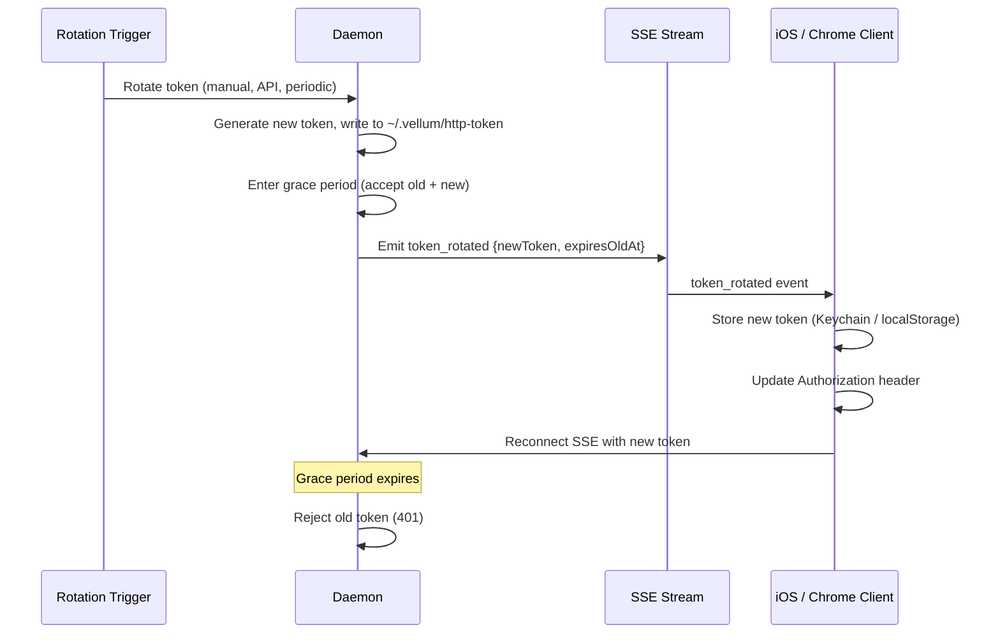
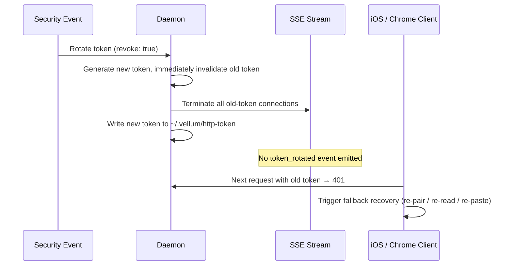

# HTTP Token Refresh Protocol

> **DEPRECATED**: This document describes the legacy static bearer token (`~/.vellum/http-token`) refresh protocol. The runtime has migrated to a JWT-based auth model where the daemon signs short-lived JWTs using an Ed25519 signing key, and route-level enforcement is handled by `route-policy.ts` with per-endpoint scope requirements. The `readHttpToken()` export has been removed from `platform.ts`. The `http-token` file on disk is still written at startup for backward compatibility with legacy Swift clients that have not yet migrated to JWT auth, but it is no longer the primary auth mechanism. New code should use the JWT auth system (see `auth/token-service.ts` and `auth/route-policy.ts`).

Design for how the daemon notifies clients of bearer token rotation and how clients recover from stale tokens.

## Current State (Legacy)

The daemon's HTTP bearer token is resolved at startup and persisted to `~/.vellum/http-token` (mode 0600). The startup token resolution order is: (1) the `RUNTIME_PROXY_BEARER_TOKEN` env var if set, (2) the existing token read from `~/.vellum/http-token` if the file is readable and non-empty, (3) a newly generated random token as a last resort. Clients read this file at connection time:

- **macOS (local)**: Reads `~/.vellum/http-token` from disk via `resolveHttpTokenPath()` / `readHttpToken()`. Has direct filesystem access to the token file.
- **iOS (remote)**: Receives the bearer token during the QR-code pairing flow. The token is stored in the iOS Keychain and used for all subsequent HTTP/SSE requests.
- **Chrome extension**: User manually pastes the token from `~/.vellum/http-token` into the extension popup.

Token regeneration today (macOS Settings > Connect > Regenerate Bearer Token):
1. macOS client writes a new random token to `~/.vellum/http-token`.
2. macOS client kills the daemon process.
3. The health monitor restarts the daemon, which reads the new token from disk.
4. macOS client re-reads the token from disk on next health check.
5. **iOS clients are broken** -- they still hold the old token and get 401s. The only recovery is to re-pair via QR code.

## Problem

When the bearer token is rotated (manually or programmatically), remote clients (iOS, Chrome extension) have no way to learn about the new token. They receive 401 responses and cannot recover without manual re-configuration.

## Design

### 1. SSE Token Rotation Event

When the daemon detects that its bearer token has changed, it emits a `token_rotated` SSE event to all connected clients **before** the old token is invalidated. This gives clients a window to capture the new token and seamlessly reconnect.

**Event format** (delivered as an `AssistantEvent` envelope wrapping a new `ServerMessage` type):

```typescript
// New ServerMessage variant
interface TokenRotatedMessage {
  type: 'token_rotated';
  newToken: string;     // The replacement bearer token
  expiresOldAt: number; // Unix timestamp (ms) -- old token stops working after this
}
```

**Grace period**: The daemon accepts both old and new tokens for a configurable grace window (default: 30 seconds) after emitting the event. This gives slow clients time to process the event and switch tokens. After the grace period, only the new token is valid.

**Sequence diagram (routine rotation)**:



**Sequence diagram (revocation rotation)**:



### 2. Client 401 Recovery (Stale Token Detection)

If a client misses the SSE event (network partition, app backgrounded, SSE disconnected at rotation time), it needs a fallback recovery mechanism.

**401 response handling**:

When a client receives a `401 Unauthorized` response:

1. **macOS (local)**: Re-reads `~/.vellum/http-token` from disk. If the token differs from the in-memory token, updates and retries. This already works implicitly since macOS re-reads the token on most HTTP calls via `resolveLocalDaemonHTTPEndpoint()`.

2. **iOS (remote)**: Cannot read the token file. Must re-pair via QR code. The 401 response triggers the client to surface a "Session expired -- re-pair required" UI prompt. This is the expected behavior when the SSE notification is missed.

3. **Chrome extension**: Surfaces an error message directing the user to paste the new token.

**Retry logic**: Clients should retry at most once after a 401 before surfacing the error UI. This prevents retry storms during legitimate auth failures (wrong token, not just stale).

### 3. Token Rotation Triggers

The token can be rotated via:

| Trigger | Description | Current | Proposed | Mode |
|---------|-------------|---------|----------|------|
| Manual (macOS Settings) | User clicks "Regenerate Bearer Token" | Yes (kills daemon) | Graceful rotation via daemon API | Routine |
| API endpoint | `POST /v1/auth/rotate-token` | No | New endpoint | Routine (default) or Revocation (`revoke: true`) |
| Periodic rotation | Automatic rotation on a configurable schedule | No | Future consideration | Routine |
| Security event | Forced rotation after suspicious activity | No | Future consideration | Revocation |

**`POST /v1/auth/rotate-token`** (new endpoint):

Allows programmatic token rotation without restarting the daemon.

Request body (optional): `{ "revoke": boolean }` (default: `false`).

**Routine mode** (`revoke: false`, default):
1. Generates a new random token.
2. Writes it to `~/.vellum/http-token`.
3. Emits the `token_rotated` SSE event with grace period.
4. Starts accepting both tokens during the grace period.
5. After grace period, rejects the old token.

**Revocation mode** (`revoke: true`):
1. Generates a new random token.
2. Immediately invalidates the old token in memory (no grace period).
3. Terminates all SSE connections authenticated with the old token.
4. Writes the new token to `~/.vellum/http-token`.
5. Does **not** emit `token_rotated` -- the new token is never sent to old-token sessions.
6. Clients must recover via their platform-specific fallback (re-read from disk, re-pair, or re-paste).

This eliminates the current "kill and restart" approach for token rotation.

### 4. Daemon-Side Implementation

**Grace period token validation**: During routine rotation, `verifyBearerToken()` accepts either the old or new token. The `RuntimeHttpServer` holds both tokens:

```typescript
// Conceptual extension to RuntimeHttpServer
private currentToken: string;
private previousToken: string | null = null;
private graceDeadline: number | null = null;

// Modified auth check
private isValidToken(provided: string): boolean {
  if (verifyBearerToken(provided, this.currentToken)) return true;
  if (this.previousToken && this.graceDeadline && Date.now() < this.graceDeadline) {
    return verifyBearerToken(provided, this.previousToken);
  }
  return false;
}

// Rotation has two ordering strategies depending on revoke mode:
//   - Revocation: invalidate in-memory FIRST (security-critical), then persist.
//     A disk write failure must never leave a compromised token valid.
//   - Routine: persist to disk FIRST, then update in-memory state.
//     A disk write failure aborts rotation — clients keep the old token
//     rather than being locked out by an in-memory-only switch.
private rotateToken(revoke: boolean): string {
  const newToken = generateToken();

  if (revoke) {
    // Revocation: invalidate the compromised token immediately.
    // Even if the disk write below fails, the old token is gone from memory.
    this.currentToken = newToken;
    this.previousToken = null;
    this.graceDeadline = null;
    this.terminateOldTokenSSEConnections();
    writeTokenToDisk(newToken);
  } else {
    // Routine: persist to disk first — if this throws, auth state is untouched
    writeTokenToDisk(newToken);
    this.previousToken = this.currentToken;
    this.currentToken = newToken;
    this.graceDeadline = Date.now() + GRACE_PERIOD_MS;
    this.emitTokenRotatedEvent(newToken, this.graceDeadline);
  }
  return newToken;
}
```

**Failure semantics — routine vs. revocation**:

The two rotation modes have deliberately different failure ordering to match their security requirements:

| | Routine (`revoke: false`) | Revocation (`revoke: true`) |
|---|---|---|
| **Order** | Persist to disk first, then update in-memory state | Update in-memory state first, then persist to disk |
| **Disk write failure** | Rotation aborts cleanly — in-memory auth state is untouched, clients keep working with the old token | Old token is already invalidated in memory; the API endpoint returns an error to the caller |
| **Rationale** | Availability: don't lock out clients if persistence fails | Security: a potentially compromised token must never remain valid, even briefly |

**Revocation disk-write failure in detail**: If `writeTokenToDisk` throws after the in-memory switch during revocation, the system enters a degraded state:

1. **In-memory state**: `currentToken` holds the new (unpersisted) token. The old token is rejected. All old-token SSE connections have been terminated.
2. **Disk state**: `~/.vellum/http-token` still contains the old (now-invalid) token.
3. **API response**: The `POST /v1/auth/rotate-token` endpoint returns an error indicating the persistence failure. The response body includes the new token so the caller can manually persist or distribute it if needed.
4. **Client impact by platform**:
   - **macOS**: Re-reading the token file yields the stale old token, which is rejected (401). Recovery requires a daemon restart (which generates a fresh token and persists it) or a successful retry of the rotation API call.
   - **iOS**: Already disconnected (old-token SSE terminated). Cannot recover until the daemon restarts or the rotation is retried successfully, at which point re-pairing is required.
   - **Chrome extension**: Same as iOS — the pasted token is stale and rejected.
5. **Daemon restart recovery**: A daemon restart does **not** automatically heal this state. At startup, the daemon first checks for the `RUNTIME_PROXY_BEARER_TOKEN` env var, then tries to read the existing token from `~/.vellum/http-token`, and only generates a new random token if both are unavailable (see `assistant/src/daemon/lifecycle.ts`, lines 110-124). In the degraded state described here — where the disk still holds the old (now-invalid) token — a restart would reload that stale token, making it the active bearer token again. To actually recover, the operator must either: (a) manually delete or overwrite `~/.vellum/http-token` before restarting the daemon, (b) set `RUNTIME_PROXY_BEARER_TOKEN` to a known-good value, or (c) successfully retry the `POST /v1/auth/rotate-token` endpoint while the daemon is still running with the new in-memory token.
6. **Why this is acceptable**: Revocation is a security-critical operation triggered when the old token is suspected compromised. The invariant — "a compromised token must not remain valid" — takes precedence over client convenience. The degraded state requires manual intervention but disk write failures are rare in practice (permissions, disk full), and the API response includes the new token so the caller can retry or manually persist it.

**SSE event emission** (routine rotation only): The `token_rotated` event is published to `assistantEventHub` as a `ServerMessage`, reaching all connected SSE subscribers across all conversations. This event is never emitted during revocation rotations.

### 5. iOS Client Implementation

**SSE event handler** (in `HTTPTransport`):

```swift
// In parseSSEData, handle the new message type
case .tokenRotated(let msg):
    // Persist the new token to Keychain
    DaemonConfigStore.shared.updateBearerToken(msg.newToken)
    // Update in-memory token
    self.bearerToken = msg.newToken
    // Reconnect SSE with the new token
    self.stopSSE()
    self.startSSE()
```

**401 response handler**:

```swift
// In any HTTP request that receives 401
if http.statusCode == 401 {
    // Token is stale and we missed the rotation event
    // Surface re-pairing UI
    onMessage?(.sessionError(SessionErrorMessage(
        sessionId: sessionId,
        code: .authenticationRequired,
        userMessage: "Session expired. Please re-pair your device.",
        retryable: false
    )))
}
```

### 6. Security Considerations

- **Rotation modes**: Token rotation has two distinct modes with different security requirements:

  1. **Routine rotation** (manual refresh, periodic schedule): The old token is not compromised -- the goal is seamless credential rollover. The SSE `token_rotated` event delivers the new token to connected clients, and the grace period allows them to transition. This is safe because the SSE channel is authenticated, and any session holding the old token is a legitimate client.

  2. **Revocation rotation** (security event, suspected compromise): The old token may be in the hands of an attacker. In this mode, the daemon **must not** push the replacement token to old-token SSE sessions -- doing so would hand the new credential to the very sessions being revoked. Instead:
     - The daemon immediately invalidates the old token (no grace period).
     - All SSE connections authenticated with the old token are terminated.
     - The `POST /v1/auth/rotate-token` endpoint accepts an optional `revoke: true` flag to select this mode.
     - Legitimate clients recover via their fallback path: macOS re-reads `~/.vellum/http-token` from disk; iOS prompts for re-pairing; Chrome extension prompts for a new token.

  The `token_rotated` SSE event is only emitted during routine rotations. The rotation trigger determines the mode.

- **Grace period length**: 30 seconds is long enough for clients to process the event but short enough to limit the window where both tokens are valid. Only applies to routine rotations.
- **No token in logs**: The `token_rotated` event payload must be excluded from any server-side event logging. Use the existing log-redaction patterns.
- **Constant-time comparison**: The existing `verifyBearerToken()` using `timingSafeEqual` continues to be used for both old and new token checks during the grace period.

### 7. Migration Path

This design is additive and backward-compatible:

1. **Phase 1**: Add `POST /v1/auth/rotate-token` endpoint and `token_rotated` SSE event to the daemon. Update macOS Settings to call the API endpoint instead of kill-and-restart.
2. **Phase 2**: Add `token_rotated` handler to `HTTPTransport.swift` (shared between macOS and iOS). Add 401 retry-once logic.
3. **Phase 3** (future): Add periodic rotation and security-event-triggered rotation.

Clients that do not understand the `token_rotated` event will simply ignore it (SSE events with unknown types are safe to skip). They will eventually get 401s after the grace period and fall back to their existing recovery path (re-read from disk for macOS, re-pair for iOS).

## Key Files

| File | Role |
|------|------|
| `assistant/src/runtime/http-server.ts` | Auth check, grace period logic, rotation endpoint |
| `assistant/src/runtime/middleware/auth.ts` | `verifyBearerToken()` -- constant-time token comparison |
| `assistant/src/runtime/assistant-event.ts` | `AssistantEvent` envelope, SSE framing |
| `assistant/src/daemon/lifecycle.ts` | Token generation and persistence at startup |
| `clients/shared/IPC/HTTPDaemonClient.swift` | `HTTPTransport` -- SSE stream, 401 handling |
| `clients/shared/IPC/DaemonClient.swift` | `readHttpToken()`, `resolveHttpTokenPath()` |
| `clients/macos/.../SettingsConnectTab.swift` | Manual token regeneration UI |
