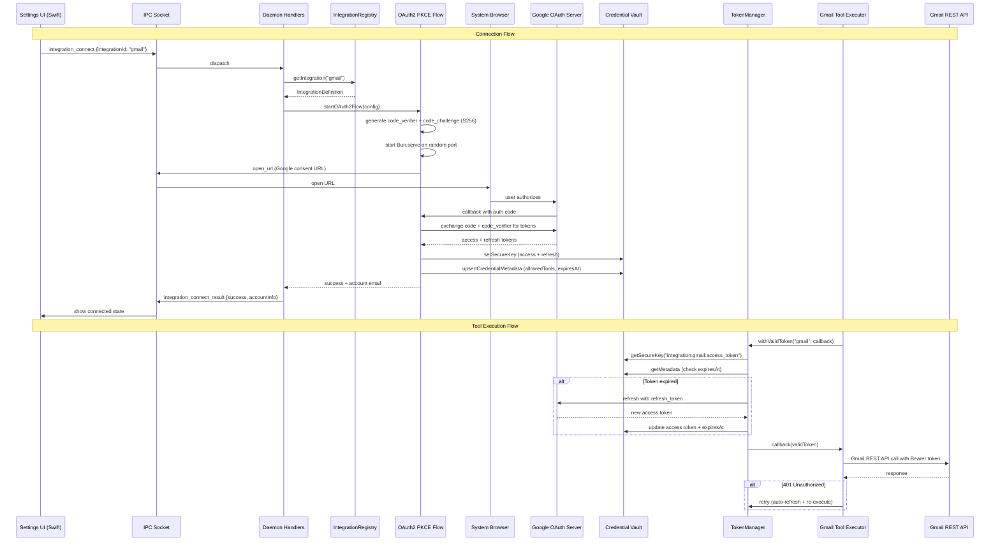
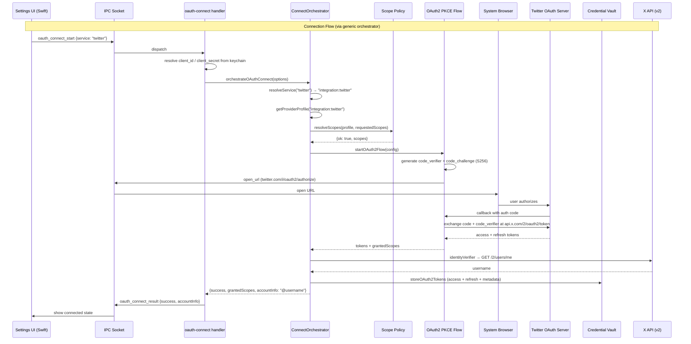
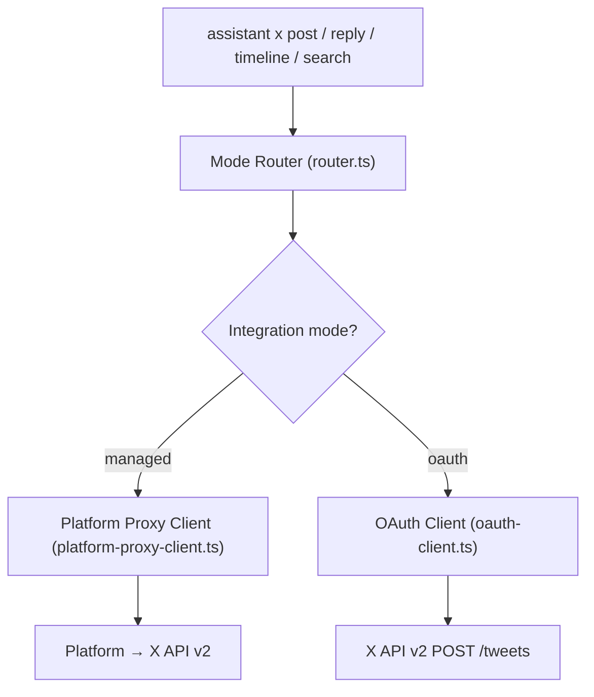
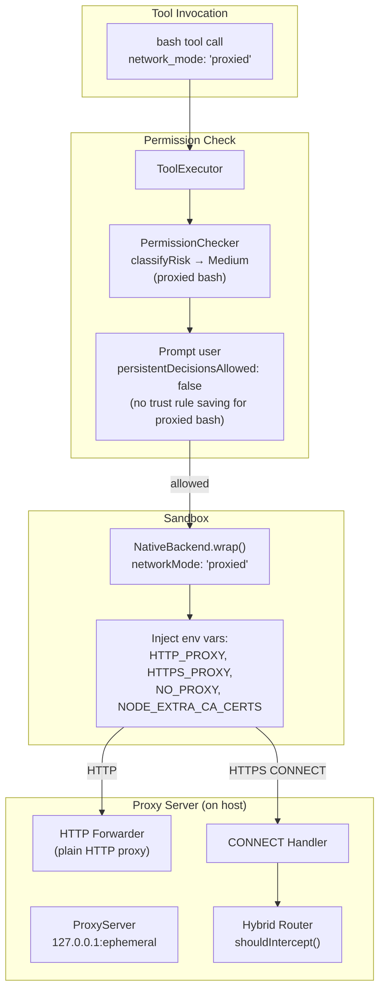
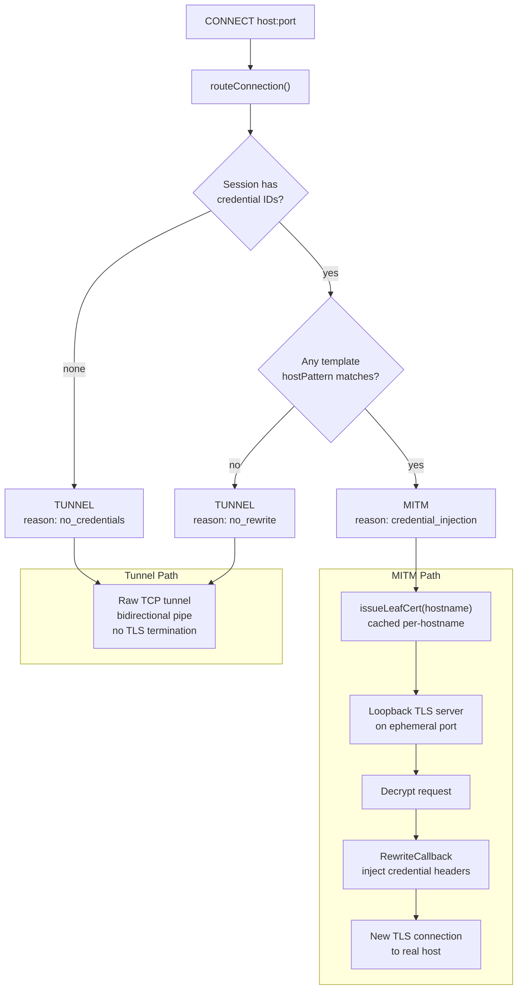
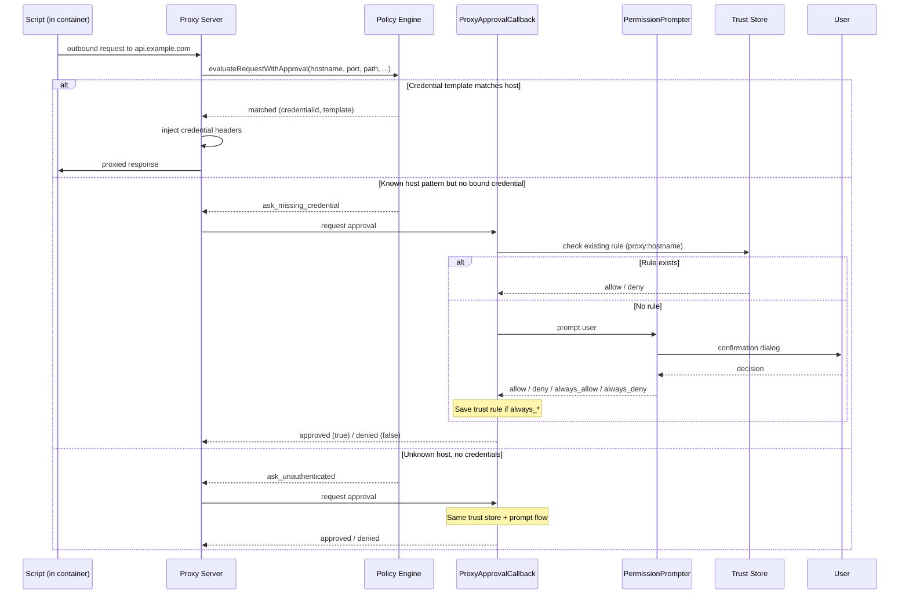
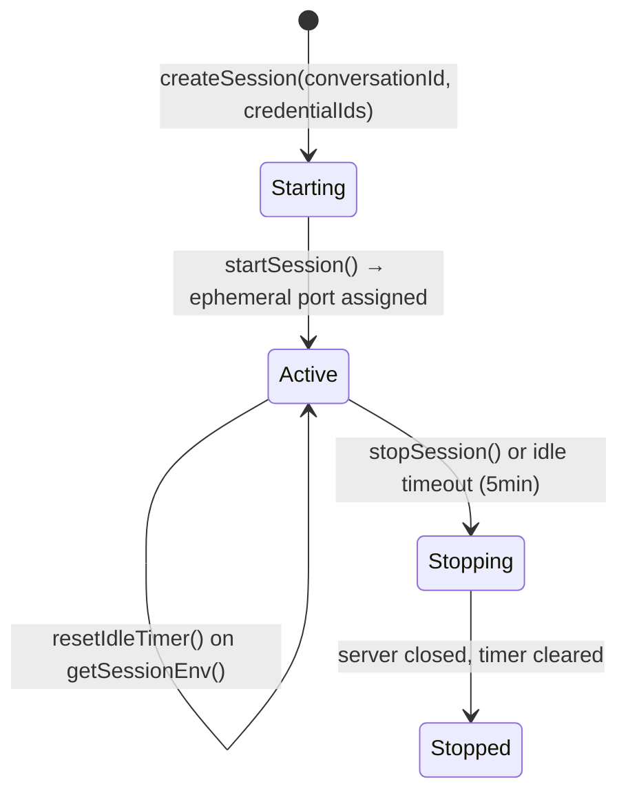
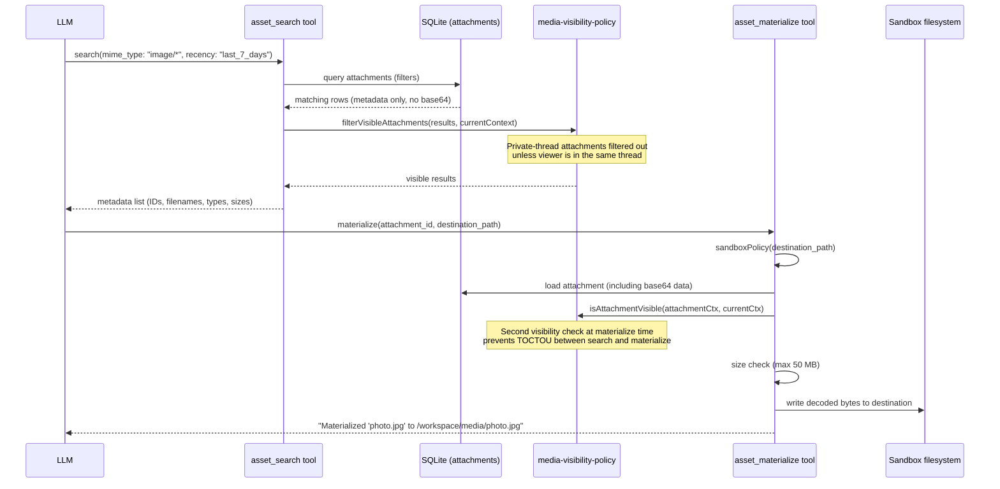
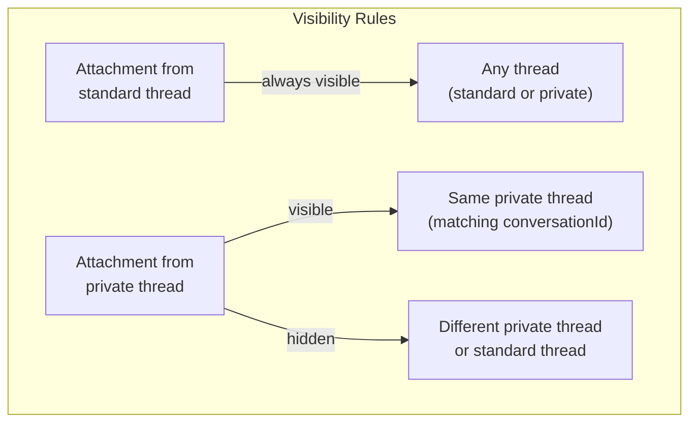

# Integrations Architecture

OAuth, messaging adapters, script proxy, and asset-tool architecture.

## Integrations — OAuth2 + Unified Messaging + Twitter

The integration framework lets Vellum connect to third-party services via OAuth2. The architecture follows these principles:

- **Secrets never reach the LLM** — OAuth tokens are stored in the credential vault and accessed exclusively through the `TokenManager`, which provides tokens to tool executors via `withValidToken()`. The LLM never sees raw tokens.
- **PKCE or client_secret flows** — Desktop apps use PKCE by default (S256). Providers that require a client secret (e.g. Slack) pass it during the OAuth2 flow and store it in credential metadata for autonomous refresh. Twitter uses PKCE with an optional client secret in `local_byo` mode.
- **Unified messaging layer** — All messaging platforms implement the `MessagingProvider` interface. Generic tools delegate to the provider, so adding a new platform is just implementing one adapter + an OAuth setup skill.
- **Standalone integrations** — Not all integrations fit the messaging model. Twitter has its own OAuth2 flow via the shared connect orchestrator, plus a managed mode that routes through the platform proxy. It sits outside the unified messaging layer.
- **Provider registry** — Messaging providers register at daemon startup. The registry tracks which providers have stored credentials, enabling auto-selection when only one is connected.

### Unified Messaging Architecture

```mermaid
graph TB
    subgraph "Messaging Skill (bundled-skills/messaging/)"
        SKILL_MD["SKILL.md<br/>agent instructions"]
        TOOLS_JSON["TOOLS.json<br/>tool manifest"]
        subgraph "Generic Tools"
            AUTH_TEST["messaging_auth_test"]
            LIST["messaging_list_conversations"]
            READ["messaging_read"]
            SEARCH["messaging_search"]
            SEND["messaging_send"]
            REPLY["messaging_reply"]
            MARK_READ["messaging_mark_read"]
            ACTIVITY["messaging_analyze_activity"]
            STYLE["messaging_analyze_style"]
            DRAFT["messaging_draft"]
        end
        subgraph "Slack-specific Tools"
            REACT["slack_add_reaction"]
            LEAVE["slack_leave_channel"]
        end
        subgraph "Gmail-specific Tools"
            ARCHIVE["gmail_archive"]
            LABEL["gmail_label"]
            TRASH["gmail_trash"]
            UNSUB["gmail_unsubscribe"]
            GMAIL_DRAFT["gmail_draft"]
        end
        SHARED["shared.ts<br/>resolveProvider + withProviderToken"]
    end

    subgraph "Messaging Layer (messaging/)"
        PROVIDER_IF["MessagingProvider interface"]
        REGISTRY["Provider Registry"]
        TYPES["Platform-agnostic types<br/>Conversation, Message, SearchResult"]
        ACTIVITY_ANALYZER["Activity Analyzer"]
        STYLE_ANALYZER["Style Analyzer"]
        DRAFT_STORE["Draft Store"]
    end

    subgraph "Provider Adapters"
        SLACK_ADAPTER["Slack Adapter<br/>messaging/providers/slack/"]
        GMAIL_ADAPTER["Gmail Adapter<br/>messaging/providers/gmail/"]
        TELEGRAM_ADAPTER["Telegram Adapter<br/>messaging/providers/telegram-bot/"]
    end

    subgraph "External APIs"
        SLACK_API["Slack Web API"]
        GMAIL_API["Gmail REST API"]
        TELEGRAM_API["Telegram Bot API"]
    end

    SHARED --> REGISTRY
    REGISTRY --> PROVIDER_IF
    SLACK_ADAPTER -.->|implements| PROVIDER_IF
    GMAIL_ADAPTER -.->|implements| PROVIDER_IF
    TELEGRAM_ADAPTER -.->|implements| PROVIDER_IF
    SLACK_ADAPTER --> SLACK_API
    GMAIL_ADAPTER --> GMAIL_API
    TELEGRAM_ADAPTER --> TELEGRAM_API
    AUTH_TEST --> SHARED
    LIST --> SHARED
    SEARCH --> SHARED
    SEND --> SHARED
    REACT --> SLACK_ADAPTER
    ARCHIVE --> GMAIL_ADAPTER
    ACTIVITY --> ACTIVITY_ANALYZER
    STYLE --> STYLE_ANALYZER
```



### Data Flow



### Twitter Integration Architecture

Twitter uses a standalone OAuth2 flow separate from the unified messaging layer. It supports a two-mode operation architecture determined by the `twitter.integrationMode` config field: **managed** mode routes all API calls through the Vellum platform proxy (which holds the OAuth credentials), while **OAuth** mode uses locally-stored OAuth2 tokens to call X API v2 directly. A mode router (`router.ts`) selects the appropriate path based on the caller-provided mode.

#### Twitter OAuth2 Flow

Twitter's OAuth2 flow delegates to the shared **connect orchestrator** (`oauth/connect-orchestrator.ts`). The Twitter provider profile in the registry defines auth/token URLs, default scopes, and an identity verifier. The daemon handler (`daemon/handlers/oauth-connect.ts`) resolves credentials from the keychain using canonical names (`client_id`, `client_secret`), then calls `orchestrateOAuthConnect()`.



#### Two-Mode Operation Architecture

The mode router (`router.ts`) determines whether to use the managed or OAuth path for each operation. The mode is determined by the `twitter.integrationMode` config field: `"managed"` routes through the platform proxy, everything else uses OAuth directly.



- **`managed`**: Routes all API calls through the Vellum platform proxy. The platform holds the OAuth credentials and forwards requests on behalf of the assistant. Supports both write operations (post, reply) and read operations (timeline, tweet detail, search, user lookup). This is the default when the user has a managed assistant.
- **`oauth`**: Uses locally-stored OAuth2 Bearer tokens to call X API v2 directly. Supports only write operations (post, reply). Read operations throw an error directing the user to use managed mode.

#### Twitter OAuth2 Specifics

| Aspect                | Detail                                                                                     |
| --------------------- | ------------------------------------------------------------------------------------------ |
| Auth URL              | `https://twitter.com/i/oauth2/authorize` (from provider profile)                           |
| Token URL             | `https://api.x.com/2/oauth2/token` (from provider profile)                                 |
| Flow                  | PKCE (S256), optional client secret, via connect orchestrator                              |
| Default scopes        | `tweet.read`, `tweet.write`, `users.read`, `offline.access` (from provider profile)        |
| Identity verification | Provider profile `identityVerifier` → `GET https://api.x.com/2/users/me` with Bearer token |
| Credential names      | `client_id`, `client_secret`                                                               |
| HTTP endpoints        | `oauth_connect_start` / `oauth_connect_result` (generic)                                   |

#### Twitter Credential Metadata Structure

When the OAuth2 flow completes, the handler stores credential metadata at `integration:twitter` / `access_token`:

```
{
  accountInfo: "@username",
  allowedTools: ["twitter_post"],
  allowedDomains: [],
  oauth2TokenUrl: "https://api.x.com/2/oauth2/token",
  oauth2ClientId: "<user's client ID>",
  oauth2ClientSecret: "<optional>",
  grantedScopes: ["tweet.read", "tweet.write", "users.read", "offline.access"],
  expiresAt: <epoch ms>
}
```

#### Twitter Operation Paths

**Managed path** (`platform-proxy-client.ts`): Routes API calls through the Vellum platform proxy at `${platformBaseUrl}/api/v1/assistants/${assistantId}/integrations/twitter/proxy/*`. The platform holds the OAuth credentials and forwards requests to X API v2 on behalf of the assistant. Supports all operations: post, reply, user lookup, user tweets, tweet detail, and search. Errors from the proxy surface as `TwitterProxyError` with structured error codes and retryability hints.

**OAuth path** (`oauth-client.ts`): The `oauthPostTweet` function calls X API v2 (`POST https://api.x.com/2/tweets`) with a Bearer token provided by the caller. Supports `post` and `reply` (by including `reply.in_reply_to_tweet_id` in the request body). Read operations are not supported via this path and will throw an error directing the user to use managed mode.

#### Available Twitter Tools

| Tool / Command         | Mechanism                      | Description                                                                                |
| ---------------------- | ------------------------------ | ------------------------------------------------------------------------------------------ |
| `assistant x post`     | Mode router (OAuth or managed) | Post a tweet. Defaults to OAuth; pass `--managed` to route through the platform proxy.     |
| `assistant x reply`    | Mode router (OAuth or managed) | Reply to a tweet. Defaults to OAuth; pass `--managed` to route through the platform proxy. |
| `assistant x timeline` | Managed only                   | Fetch a user's recent tweets. Resolves screen name to user ID, then fetches timeline.      |
| `assistant x tweet`    | Managed only                   | Fetch a single tweet and its reply thread via conversation ID search.                      |
| `assistant x search`   | Managed only                   | Search tweets. Supports `Top`, `Latest`, `People`, and `Media` product types.              |
| `assistant x status`   | HTTP (daemon)                  | Check OAuth connection and managed mode availability.                                      |

Note: Write operations (post, reply) support both OAuth and managed modes. Read operations (timeline, tweet, search) require managed mode because the OAuth path only supports `post` and `reply`.

### Key Design Decisions

| Decision                                           | Rationale                                                                                                                                                                                                                                                                              |
| -------------------------------------------------- | -------------------------------------------------------------------------------------------------------------------------------------------------------------------------------------------------------------------------------------------------------------------------------------- |
| PKCE by default, optional client_secret            | Desktop apps prefer PKCE; some providers (Slack) require a secret, which is stored in credential metadata for autonomous refresh                                                                                                                                                       |
| Shared connect orchestrator                        | All OAuth providers route through `orchestrateOAuthConnect()`, which resolves profiles, enforces scope policy, runs the flow, stores tokens, and verifies identity. Adding a provider is a declarative profile entry, not new orchestration code                                       |
| Canonical credential naming                        | All reads and writes use `client_id`/`client_secret` as canonical field names                                                                                                                                                                                                          |
| Gateway callback transport                         | OAuth callbacks are now routed through the gateway at `${ingress.publicBaseUrl}/webhooks/oauth/callback` instead of a loopback redirect URI. This enables OAuth flows to work in remote and tunneled deployments.                                                                      |
| Unified `MessagingProvider` interface              | All platforms implement the same contract; generic tools work immediately for new providers                                                                                                                                                                                            |
| Twitter outside unified messaging                  | Twitter is a broadcast/read platform, not a conversation platform — it doesn't fit the `MessagingProvider` contract                                                                                                                                                                    |
| Two-mode Twitter architecture (managed + OAuth)    | Managed mode delegates to the platform proxy which holds credentials — no local browser or session management needed. OAuth mode provides direct API access for users with their own developer credentials. Read operations require managed mode since OAuth only supports post/reply. |
| Provider auto-selection                            | If only one provider is connected, tools skip the `platform` parameter — seamless single-platform UX                                                                                                                                                                                   |
| Token expiry in credential metadata                | Reuses existing `CredentialMetadata` store; `expiresAt` field enables proactive refresh with 5min buffer                                                                                                                                                                               |
| Confidence scores on medium-risk tools             | LLM self-reports confidence (0-1); enables future trust calibration without blocking execution                                                                                                                                                                                         |
| Platform-specific extension tools                  | Operations unique to one platform (e.g. Gmail labels, Slack reactions) are separate tools, not forced into the generic interface                                                                                                                                                       |
| Twitter identity verification before token storage | OAuth2 tokens are only persisted after a successful `GET /2/users/me` call, preventing storage of invalid or mismatched credentials                                                                                                                                                    |

### Source Files

| File                                                   | Role                                                                                               |
| ------------------------------------------------------ | -------------------------------------------------------------------------------------------------- |
| `assistant/src/security/oauth2.ts`                     | OAuth2 flow: PKCE or client_secret, Bun.serve callback, token exchange                             |
| `assistant/src/security/token-manager.ts`              | `withValidToken()` — auto-refresh, 401 retry, expiry buffer                                        |
| `assistant/src/messaging/provider.ts`                  | `MessagingProvider` interface                                                                      |
| `assistant/src/messaging/provider-types.ts`            | Platform-agnostic types (Conversation, Message, SearchResult)                                      |
| `assistant/src/messaging/registry.ts`                  | Provider registry: register, lookup, list connected                                                |
| `assistant/src/messaging/activity-analyzer.ts`         | Activity classification for conversations                                                          |
| `assistant/src/messaging/style-analyzer.ts`            | Writing style extraction from message corpus                                                       |
| `assistant/src/messaging/draft-store.ts`               | Local draft storage (platform/id JSON files)                                                       |
| `assistant/src/messaging/providers/slack/`             | Slack adapter, client, types                                                                       |
| `assistant/src/messaging/providers/gmail/`             | Gmail adapter, client, types                                                                       |
| `assistant/src/config/bundled-skills/messaging/`       | Unified messaging skill (SKILL.md, TOOLS.json, tools/)                                             |
| `assistant/src/watcher/providers/gmail.ts`             | Gmail watcher using History API                                                                    |
| `assistant/src/watcher/providers/github.ts`            | GitHub watcher for PRs, issues, review requests, and mentions                                      |
| `assistant/src/watcher/providers/linear.ts`            | Linear watcher for assigned issues, status changes, and @mentions                                  |
| `assistant/src/oauth/provider-profiles.ts`             | Provider profile registry: auth URLs, token URLs, scopes, policies, identity verifiers             |
| `assistant/src/oauth/connect-orchestrator.ts`          | Shared OAuth connect orchestrator: profile resolution, scope policy, flow execution, token storage |
| `assistant/src/oauth/scope-policy.ts`                  | Deterministic scope resolution and policy enforcement                                              |
| `assistant/src/oauth/connect-types.ts`                 | Shared types: `OAuthProviderProfile`, `OAuthScopePolicy`, `OAuthConnectResult`                     |
| `assistant/src/oauth/token-persistence.ts`             | Token storage helper: persists tokens, metadata, and runs post-connect hooks                       |
| `assistant/src/daemon/handlers/oauth-connect.ts`       | Generic OAuth connect handler (`oauth_connect_start` / `oauth_connect_result`)                     |
| `assistant/src/cli/commands/twitter/oauth-client.ts`   | OAuth-backed Twitter client: X API v2 post/reply via Bearer token                                  |
| `assistant/src/cli/commands/twitter/router.ts`         | Mode router: selects managed or OAuth path based on caller-provided `TwitterMode`                  |
| `assistant/src/cli/commands/twitter/types.ts`          | Shared types: `PostTweetResult`, `UserInfo`, `TweetEntry`, `NotificationEntry`                     |
| `assistant/src/cli/commands/twitter/index.ts`          | `assistant x` CLI command group (post, reply, timeline, tweet, search, status)                     |
| `assistant/src/twitter/platform-proxy-client.ts`       | Platform-managed Twitter proxy client: routes API calls through the Vellum platform                |
| `assistant/src/config/bundled-skills/twitter/SKILL.md` | X (Twitter) bundled skill instructions                                                             |

---

## OAuth Extensibility — Provider Profiles, Scope Policy, and Connect Orchestrator

The OAuth extensibility layer makes adding a new OAuth provider a declarative operation. Instead of writing custom auth handlers, new providers are added as entries in the **provider profile registry**. The shared **connect orchestrator** handles the full flow from profile resolution through token storage.

### Provider Profile Registry

`assistant/src/oauth/provider-profiles.ts` contains the `PROVIDER_PROFILES` map — a canonical registry of well-known OAuth providers. Each profile (`OAuthProviderProfile`) declares:

| Field                  | Purpose                                                                                                |
| ---------------------- | ------------------------------------------------------------------------------------------------------ |
| `authUrl` / `tokenUrl` | OAuth2 authorization and token endpoints                                                               |
| `defaultScopes`        | Scopes requested on every connect attempt                                                              |
| `scopePolicy`          | Controls whether additional scopes are allowed (see Scope Policy below)                                |
| `callbackTransport`    | `'loopback'` (local redirect) or `'gateway'` (public ingress)                                          |
| `identityVerifier`     | Async function that fetches human-readable account info (e.g. `@username`, email) after token exchange |
| `setup`                | Optional metadata for the generic OAuth setup skill (display name, dashboard URL, app type)            |
| `injectionTemplates`   | Auto-applied credential injection rules for the script proxy                                           |

Registered providers: `integration:gmail`, `integration:slack`, `integration:notion`, `integration:twitter`. Short aliases (e.g. `gmail`, `twitter`) are resolved via `SERVICE_ALIASES`.

### Scope Policy Engine

`assistant/src/oauth/scope-policy.ts` exports `resolveScopes(profile, requestedScopes)`, which deterministically computes the final scope set:

1. No requested scopes → returns `defaultScopes`.
2. Requested scopes provided → starts with defaults, then validates each additional scope:
   - Rejected if in `forbiddenScopes`.
   - Rejected if `allowAdditionalScopes` is `false`.
   - Rejected if not in `allowedOptionalScopes`.
   - Accepted otherwise, added to the union.

Returns `{ ok: true, scopes }` or `{ ok: false, error, allowedScopes }`.

### Connect Orchestrator

`assistant/src/oauth/connect-orchestrator.ts` exports `orchestrateOAuthConnect(options)`, which runs the full OAuth2 flow:

1. **Resolve service** — alias expansion via `resolveService()`.
2. **Load profile** — `getProviderProfile()` from the registry.
3. **Compute scopes** — `resolveScopes()` with scope policy enforcement.
4. **Build OAuth config** — merge profile defaults with caller overrides.
5. **Run flow** — interactive (opens browser, blocks until completion) or deferred (returns auth URL for the caller to deliver).
6. **Verify identity** — runs the profile's `identityVerifier` if defined.
7. **Store tokens** — `storeOAuth2Tokens()` persists access/refresh tokens, client credentials, and metadata.

Result is a discriminated union: `{ success, deferred, grantedScopes, accountInfo }` or `{ success: false, error }`.

### Generic Daemon IPC

`assistant/src/daemon/handlers/oauth-connect.ts` handles `oauth_connect_start` messages. The handler:

1. Resolves client credentials from the keychain using canonical names (`client_id`, `client_secret`).
2. Validates that required credentials exist (including `client_secret` when the provider requires it).
3. Delegates to `orchestrateOAuthConnect()`.
4. Sends `oauth_connect_result` back to the client.

This replaces provider-specific handlers — any provider in the registry can be connected through the same message pair.

### Adding a New OAuth Provider

1. **Declare a profile** in `PROVIDER_PROFILES` (`oauth/provider-profiles.ts`):
   - Set `authUrl`, `tokenUrl`, `defaultScopes`, `scopePolicy`, and `callbackTransport`.
   - Add a `SERVICE_ALIASES` entry if a shorthand name is desired.
2. **Optional: add an identity verifier** — an async function on the profile that fetches the user's account info from the provider's API.
3. **Optional: add setup metadata** — `setup.displayName`, `setup.dashboardUrl`, `setup.appType` enable the generic OAuth setup skill to guide users through app creation.
4. **Optional: add injection templates** — for providers whose tokens should be auto-injected by the script proxy.
5. **No handler code needed** — the generic `oauth_connect_start` handler and the connect orchestrator handle the flow automatically.

### Key Source Files

| File                                             | Role                                                                            |
| ------------------------------------------------ | ------------------------------------------------------------------------------- |
| `assistant/src/oauth/provider-profiles.ts`       | Provider profile registry and alias resolution                                  |
| `assistant/src/oauth/scope-policy.ts`            | Scope resolution and policy enforcement (pure, no I/O)                          |
| `assistant/src/oauth/connect-orchestrator.ts`    | Shared connect orchestrator (profile → scopes → flow → tokens)                  |
| `assistant/src/oauth/connect-types.ts`           | Shared types (`OAuthProviderProfile`, `OAuthScopePolicy`, `OAuthConnectResult`) |
| `assistant/src/oauth/token-persistence.ts`       | Token storage: keychain writes, metadata upsert, post-connect hooks             |
| `assistant/src/daemon/handlers/oauth-connect.ts` | Generic `oauth_connect_start` / `oauth_connect_result` handler                  |

---

---

## Script Proxy — Proxied Bash Execution and Credential Injection

Scripts executed via the `bash` tool can optionally run through a per-session HTTP proxy. The proxy subsystem extends the existing credential storage and permission systems rather than introducing parallel mechanisms. The session manager uses `createProxyServer()` with a fully configured MITM handler, policy callback, and rewrite callback — so credential injection, policy enforcement, and approval prompting are all active at runtime. `host_bash` is explicitly unaffected: only the `bash` tool participates in proxied-mode checks.

### Proxied Bash Execution Path

When a bash command requires network access with credential injection, the sandbox backend switches from `network=none` to `network=bridge` and injects proxy environment variables so all HTTP/HTTPS traffic routes through the session proxy.



### Hybrid MITM + Tunnel Routing

The proxy uses a two-mode routing strategy for HTTPS CONNECT requests. Only connections to hosts that match a credential injection template are MITM-intercepted; all other HTTPS traffic passes through a plain TCP tunnel with no TLS termination.



**MITM path**: The proxy issues a leaf certificate signed by a local CA (`proxy-ca/ca.pem`), terminates TLS on a loopback ephemeral port, reads the decrypted HTTP request, calls the `RewriteCallback` to inject credential headers, and forwards the rewritten request over a fresh TLS connection to the real upstream. The local CA cert is injected into the container via `NODE_EXTRA_CA_CERTS`.

**Tunnel path**: For hosts that do not require credential injection, the proxy establishes a raw TCP tunnel (bidirectional pipe) and never sees the plaintext traffic. This avoids the overhead and security exposure of unnecessary TLS termination.

### Proxy Policy Engine and Approval Loop

The policy engine evaluates each outbound request against credential injection templates and determines whether credentials should be injected, whether the user should be prompted, or whether the request should pass through unauthenticated.



**Policy decisions** are deterministic and structured:

| Decision                 | Meaning                                                                    |
| ------------------------ | -------------------------------------------------------------------------- |
| `matched`                | Exactly one credential template matches the host — inject it               |
| `ambiguous`              | Multiple credential templates match — caller must disambiguate             |
| `missing`                | Credentials exist but none match this host — no rewrite                    |
| `unauthenticated`        | No credentials configured for the session                                  |
| `ask_missing_credential` | A known template pattern matches but no credential is bound to the session |
| `ask_unauthenticated`    | Completely unknown host — prompt for unauthenticated access                |

**Trust rule persistence**: The `createProxyApprovalCallback` in `session-tool-setup.ts` is wired into the session startup path and routes policy "ask" decisions through the existing `PermissionPrompter` UI. Trust rules use the `network_request` tool name (not `proxy:*`) with URL-based scope patterns (e.g., `https://api.example.com/*`), aligning with the `buildCommandCandidates()` allowlist generation in `checker.ts`.

**Proxied bash permission restriction**: The `ToolExecutor` sets `persistentDecisionsAllowed = false` when the bash tool is invoked with `network_mode: 'proxied'`. This prevents users from saving permanent trust rules for proxied bash commands, since the proxy session's credential scope can change between invocations.

### Session Lifecycle



Each proxy session is bound to a conversation and tracks authorized credential IDs. The `SessionManager` enforces a per-conversation limit (default 3 concurrent sessions). Sessions auto-stop after 5 minutes of inactivity. `stopAllSessions()` is called on daemon shutdown.

### Local CA and Certificate Management

The proxy generates and manages a local Certificate Authority for MITM interception:

| Component  | Location                                   | Purpose                                                  |
| ---------- | ------------------------------------------ | -------------------------------------------------------- |
| CA cert    | `{dataDir}/proxy-ca/ca.pem`                | Self-signed root cert (valid 10 years, permissions 0644) |
| CA key     | `{dataDir}/proxy-ca/ca-key.pem`            | CA private key (permissions 0600)                        |
| Leaf certs | `{dataDir}/proxy-ca/issued/{hostname}.pem` | Per-hostname certs (cached, verified against current CA) |

`ensureLocalCA()` is idempotent — it only generates the CA if the files do not already exist. Leaf certificates are cached and revalidated via `X509Certificate.checkIssued()` to detect stale certs from a previous CA.

### Log Sanitization

All proxy logging passes through sanitization helpers (`logging.ts`) that redact credential values before they reach logs or lifecycle events:

- `sanitizeHeaders()` — replaces values of sensitive header keys (e.g. `Authorization`) with `[REDACTED]`
- `sanitizeUrl()` — redacts query parameter values for sensitive param names (e.g. `api_key`)
- `createSafeLogEntry()` — combines both into a log-safe request snapshot

### Security Invariants

1. **Credential values never reach the LLM** — The proxy injects credentials at the network layer; the model only sees tool results, never the injected headers or query parameters.
2. **Minimal MITM surface** — Only hosts matching a credential injection template are MITM-intercepted. All other HTTPS traffic passes through an opaque TCP tunnel.
3. **CA key isolation** — The CA private key has 0600 permissions and never leaves the host filesystem. Container processes only receive the CA cert via `NODE_EXTRA_CA_CERTS`.
4. **No persistent trust rules for proxied bash** — `persistentDecisionsAllowed: false` prevents saving trust rules that could auto-allow proxied commands across sessions with different credential scopes.
5. **Auditable routing** — Every CONNECT routing decision carries a deterministic `RouteReason` code (`mitm:credential_injection`, `tunnel:no_rewrite`, `tunnel:no_credentials`) for audit and testing.

### Credential Proxy Injection

The proxy subsystem intercepts outbound HTTPS requests and injects stored credentials via header injection. Key behaviors:

- **Wildcard host patterns** (`*.example.com`) match both subdomains and the bare apex domain (`example.com`)
- **Specificity selection**: When one credential has both exact and wildcard templates for the same host, the most specific match wins (exact > wildcard)
- **Cross-credential ambiguity**: When multiple credentials match the same host, injection is blocked (fail-closed)
- **Credential references**: The shell tool accepts both UUIDs and `service/field` format (e.g., `fal/api_key`); unknown references fail fast before command execution
- **Diagnostic logging**: Policy and rewrite decisions are logged with structured traces that never include secret values

### Key Source Files

| File                                                          | Role                                                                                                                    |
| ------------------------------------------------------------- | ----------------------------------------------------------------------------------------------------------------------- |
| `assistant/src/tools/network/script-proxy/server.ts`          | Proxy server factory — HTTP forwarding, CONNECT handling, MITM dispatch                                                 |
| `assistant/src/tools/network/script-proxy/policy.ts`          | Policy engine — evaluates requests against credential templates                                                         |
| `assistant/src/tools/network/script-proxy/mitm-handler.ts`    | MITM TLS interception — loopback TLS server, request rewrite, upstream forwarding                                       |
| `assistant/src/tools/network/script-proxy/connect-tunnel.ts`  | Plain CONNECT tunnel — raw TCP bidirectional pipe                                                                       |
| `assistant/src/tools/network/script-proxy/http-forwarder.ts`  | HTTP proxy forwarder — absolute-URL form forwarding with policy callback                                                |
| `assistant/src/tools/network/script-proxy/session-manager.ts` | Session lifecycle — create, start, stop, idle timeout, env var generation                                               |
| `assistant/src/tools/network/script-proxy/certs.ts`           | Local CA management — ensureLocalCA, issueLeafCert, getCAPath                                                           |
| `assistant/src/tools/network/script-proxy/logging.ts`         | Log sanitization (header/URL redaction) and safe decision trace builders for policy and credential resolution           |
| `assistant/src/tools/network/script-proxy/types.ts`           | Type definitions — session, policy decisions, approval callback                                                         |
| `assistant/src/tools/executor.ts`                             | `persistentDecisionsAllowed` gate — disables trust rule saving for proxied bash                                         |
| `assistant/src/daemon/session-tool-setup.ts`                  | `createProxyApprovalCallback` — wired into session startup, uses `network_request` tool name with URL-based trust rules |
| `assistant/src/permissions/checker.ts`                        | `network_request` trust rule matching and risk classification (Medium)                                                  |

### Runtime Wiring Summary

The proxy subsystem is fully wired, including credential injection. The session manager's `startSession()` calls `createProxyServer()` with:

- **MITM handler config**: `mitmHandler` is configured with the local CA path and a `rewriteCallback` that performs per-credential specificity-based template selection — for each credential it picks the most specific matching header template (exact > wildcard), blocks on same-credential equal-specificity ties or cross-credential ambiguity, and for the winning `header`-type template resolves the secret from secure storage and sets the outbound header. Wildcard patterns (`*.fal.run`) match the bare apex domain (`fal.run`) via apex-inclusive matching.
- **Policy callback**: `evaluateRequestWithApproval()` is called via the `policyCallback`; for `'matched'` decisions it injects credential headers (reading the secret value at injection time), while `'ambiguous'` decisions are blocked and `'ask_*'` decisions route through the approval callback
- **Approval callback**: `createProxyApprovalCallback()` from `session-tool-setup.ts` routes approval prompts through the `PermissionPrompter`, using the `network_request` tool name with URL-based trust rules
- **networkMode plumbing**: `shell.ts` passes `{ networkMode }` to `wrapCommand()`, which forwards it to the native backend
- **Session lifecycle**: `createSession` / `startSession` / `stopSession` with idle timeout and per-conversation limits

---

## Asset Search and Materialize — Cross-Thread Media Reuse

The `asset_search` and `asset_materialize` tools enable the assistant to discover and use previously uploaded media assets (images, documents, audio) across conversations. Assets are stored as base64-encoded blobs in the `attachments` table and linked to messages via the `message_attachments` join table.

### Asset Discovery and Materialization Flow



### Private Thread Visibility Gate

Attachments from private threads are only visible to the same private thread. Standard-thread attachments are visible everywhere. The policy is enforced at both the search and materialize stages to prevent cross-thread data leakage.



**Source conversation lookup**: The `getAttachmentSourceConversations()` function traces an attachment's lineage through `message_attachments` -> `messages` -> `conversations` to determine which threads it belongs to and whether any of them are private.

**Mixed-source attachments**: If an attachment is linked to messages in both standard and private conversations (e.g., the user shared the same file in two threads), the attachment is treated as globally visible because at least one source is non-private.

**Orphan attachments**: Attachments with no message linkage (orphans) are treated as universally visible rather than hidden, since they have no private-thread provenance.

### Search Capabilities

| Parameter         | Type   | Description                                                                                    |
| ----------------- | ------ | ---------------------------------------------------------------------------------------------- |
| `mime_type`       | string | MIME type filter with wildcard support (`image/*`, `application/pdf`)                          |
| `filename`        | string | Case-insensitive substring match on original filename                                          |
| `recency`         | enum   | Time-based filter: `last_hour`, `last_24_hours`, `last_7_days`, `last_30_days`, `last_90_days` |
| `conversation_id` | string | Scope results to attachments in a specific conversation                                        |
| `limit`           | number | Maximum results (default 20, max 100)                                                          |

### Materialize Safeguards

- **Sandbox path enforcement**: Destination path must resolve inside the sandbox working directory
- **Size limit**: 50 MB ceiling prevents materializing excessively large attachments
- **Double visibility check**: Both `asset_search` and `asset_materialize` independently verify visibility, preventing TOCTOU races between search and use
- **Risk level**: Both tools are `RiskLevel.Low` since they read existing data and write only within the sandbox

### Key Source Files

| File                                              | Role                                                                                    |
| ------------------------------------------------- | --------------------------------------------------------------------------------------- |
| `assistant/src/tools/assets/search.ts`            | `asset_search` tool — cross-thread attachment metadata search with visibility filtering |
| `assistant/src/tools/assets/materialize.ts`       | `asset_materialize` tool — decode and write attachment to sandbox path                  |
| `assistant/src/daemon/media-visibility-policy.ts` | Pure policy module — `isAttachmentVisible()`, `filterVisibleAttachments()`              |
| `assistant/src/memory/schema.ts`                  | `attachments` and `message_attachments` table schemas                                   |
| `assistant/src/memory/conversation-crud.ts`       | `getConversationThreadType()` — thread type lookup for visibility context               |

---
