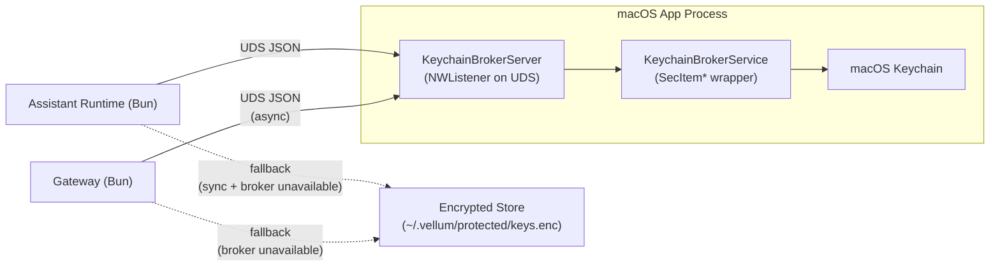

# macOS Keychain Broker Architecture

**Status:** Accepted
**Last Updated:** 2026-03-05
**Owners:** macOS client + assistant runtime

## Decision

Embed the keychain broker in the macOS app process rather than running a standalone daemon. The app exposes SecItem keychain operations over a Unix domain socket to the assistant runtime and gateway. Debug builds skip the broker entirely (`#if !DEBUG` guard) so developers never see keychain authorization prompts during rebuilds.

## Problem Statement

We want macOS to use Keychain as the primary secret store, but direct keychain access from the daemon process causes repeated authorization prompts. The prompts are especially problematic during development with ad-hoc signed builds, where every rebuild changes the signing identity and triggers a new keychain prompt.

Prior state:

- macOS defaulted to encrypted file storage to avoid prompt fatigue: `assistant/src/security/secure-keys.ts`.
- Historical comments documented prompt issues with ad-hoc signing: `clients/shared/App/SigningIdentityManager.swift`.
- The `keychain.ts` module (now deleted) called `/usr/bin/security` CLI, which was unreliable and prompt-heavy.

## Architecture



### Key properties

- **No separate process lifecycle.** The broker starts when the app starts and stops when the app stops. No launchd plist, no health checks, no orphan cleanup.
- **No auth bootstrap problem.** The app writes the broker auth token to disk before launching the daemon, so the daemon always has a valid token at startup.
- **No keychain prompts on signed builds.** Items are stored with `kSecAttrAccessibleAfterFirstUnlock` under the `vellum-assistant` service name. A stable code-signing identity means macOS grants access without prompting after the first unlock.
- **No keychain interaction on debug builds.** The entire `KeychainBrokerServer` is compiled out with `#if !DEBUG`, so development builds use the encrypted file store exclusively.
- **Encrypted file store as permanent fallback.** CLI-only, headless, and development environments always have the encrypted store (`~/.vellum/protected/keys.enc`) available. Async callers that use the broker also write through to the encrypted store so sync callers see a consistent view.

## Components

### Swift side (macOS app)

| File                                                                  | Role                                                                                                                                                                             |
| --------------------------------------------------------------------- | -------------------------------------------------------------------------------------------------------------------------------------------------------------------------------- |
| `clients/macos/vellum-assistant/Security/KeychainBrokerServer.swift`  | UDS server using `NWListener`. Accepts newline-delimited JSON requests, validates auth token, dispatches to `KeychainBrokerService`. Compiled only for `!DEBUG` builds.          |
| `clients/macos/vellum-assistant/Security/KeychainBrokerService.swift` | Thin `SecItem*` wrapper scoped to the `vellum-assistant` service. Provides `get`, `set`, `delete`, `list`. Uses `kSecAttrAccessibleAfterFirstUnlock`. Compiled only for `macOS`. |

### TypeScript side (runtime + gateway)

| File                                               | Role                                                                                                                                                                                                                                                                                                                                                                                                                                                                    |
| -------------------------------------------------- | ----------------------------------------------------------------------------------------------------------------------------------------------------------------------------------------------------------------------------------------------------------------------------------------------------------------------------------------------------------------------------------------------------------------------------------------------------------------------- |
| `assistant/src/security/keychain-broker-client.ts` | Async UDS client for the runtime. Persistent socket connection, request/response correlation, auth token caching with auto-refresh on `UNAUTHORIZED`. Falls back gracefully (returns safe defaults, never throws).                                                                                                                                                                                                                                                      |
| `assistant/src/security/secure-keys.ts`            | Unified API surface. Sync variants use encrypted store only. Async variants (`getSecureKeyAsync`, `setSecureKeyAsync`, `deleteSecureKeyAsync`) try broker first. **Reads** fall back to the encrypted store when the broker is unavailable or key is not found. **Writes** return `false` on broker failure (no encrypted-store fallback). **Deletes** return `"deleted"`, `"not-found"`, or `"error"` to let callers distinguish idempotent no-ops from real failures. |
| `gateway/src/credential-reader.ts`                 | Read-only credential reader. Tries broker via native async UDS connection (`node:net`), falls back to encrypted store. All public credential read functions are async.                                                                                                                                                                                                                                                                                                  |

## Message Contract

### Transport

- Unix domain socket: `~/.vellum/keychain-broker.sock`
- Socket path is derived from the data directory (e.g., `join(getRootDir(), "keychain-broker.sock")`)
- Newline-delimited JSON (`\n` as message boundary)

### Request envelope

```json
{
  "v": 1,
  "id": "uuid",
  "token": "hex-auth-token",
  "method": "key.get",
  "params": { "account": "anthropic" }
}
```

The `v` field is a protocol version number (currently `1`). The server rejects requests with unsupported versions.

### Response envelope

Success:

```json
{
  "id": "uuid",
  "ok": true,
  "result": { "found": true, "value": "sk-..." }
}
```

Error:

```json
{
  "id": "uuid",
  "ok": false,
  "error": { "code": "UNAUTHORIZED", "message": "Invalid auth token" }
}
```

### Methods

| Method        | Params               | Result                   |
| ------------- | -------------------- | ------------------------ |
| `broker.ping` | none                 | `{ pong: true }`         |
| `key.get`     | `{ account }`        | `{ found, value? }`      |
| `key.set`     | `{ account, value }` | `{ stored: true }`       |
| `key.delete`  | `{ account }`        | `{ deleted: true }`      |
| `key.list`    | none                 | `{ accounts: string[] }` |

### Error codes

- `UNAUTHORIZED` — invalid or missing auth token
- `INVALID_REQUEST` — malformed request, missing params, or unsupported protocol version
- `KEYCHAIN_ERROR` — SecItem operation failed

## Security Model

### Authentication

1. On app launch, the broker generates 32 random bytes via `SecRandomCopyBytes` and hex-encodes them as the auth token.
2. The token is written to `~/.vellum/protected/keychain-broker.token` with `0600` permissions. The parent directory is `0700`.
3. Every request must include the token. Requests with missing or invalid tokens are rejected before method dispatch.
4. If the app restarts (new token), the TS client detects `UNAUTHORIZED`, re-reads the token from disk, and retries once.

### Process boundary

- The UDS itself restricts access to local processes.
- The token file's `0600` permissions restrict readers to the same user.
- Together: only same-user local processes that can read the token file can authenticate.

### Keychain access control

- All items use `kSecAttrAccessibleAfterFirstUnlock` — secrets survive screen lock without re-prompting.
- All items are scoped to the `vellum-assistant` service name via `kSecAttrService`.
- On signed release builds, the stable code-signing identity means macOS trusts the app to access its own keychain items without prompting.

### Threat model

| Threat                                      | Mitigation                                                                                 |
| ------------------------------------------- | ------------------------------------------------------------------------------------------ |
| Other-user process reads secrets            | UDS + token file `0600` restrict to same user                                              |
| Malicious local process impersonates broker | Client reads token from a known file path; attacker would need same-user file write access |
| Stale socket from unclean exit              | Server calls `unlink()` on the socket path before binding                                  |
| App restart invalidates cached token        | Client detects `UNAUTHORIZED`, re-reads token, retries once                                |

### Future: XPC transport

XPC provides stronger caller identity guarantees via audit tokens and code requirement checks. This would replace the file-based auth token with kernel-enforced caller verification, preventing same-user impersonation. No timeline — the UDS + token model is sufficient for the current threat profile.

## Developer Experience

- **Debug builds:** The `#if !DEBUG` guard compiles out the entire `KeychainBrokerServer`. The broker socket is not created, so clients see the broker as unavailable and use the encrypted store. Developers never encounter keychain prompts during the edit-build-run cycle.
- **Release builds:** The broker starts automatically with the app. The daemon discovers it via the socket env var and token file. No configuration needed.
- **CLI-only / headless:** No macOS app means no broker socket. All storage uses the encrypted file store. This is the expected path for CI, servers, and non-macOS platforms.

## Callsite Policy

### Runtime request handlers (secret-routes, etc.)

All runtime HTTP handlers that write or delete secrets **must** use the async APIs (`setSecureKeyAsync`, `deleteSecureKeyAsync`). These are the primary entry points for macOS app flows and must go through the broker to reach keychain.

### CLI commands (keys, credentials)

CLI commands may use sync APIs (`setSecureKey`, `deleteSecureKey`, `getSecureKey`) since they run outside the macOS app process and the broker may not be available. The sync path uses the encrypted store directly, which is correct for headless/CLI environments.

### Gateway (credential-reader)

The gateway reads credentials via async `readCredential()` which tries the broker first (native async UDS), falling back to the encrypted store. The gateway never writes credentials — that responsibility belongs to the assistant runtime.

### Startup / initialization code

Sync APIs are acceptable for startup paths (e.g. provider initialization, config loading) where async is impractical or the broker may not yet be available.

## Migration

Existing encrypted store keys remain accessible — the encrypted store is always consulted as a **read** fallback when the broker does not have a key. Successful writes from async code paths go to both the broker (keychain) and the encrypted store, keeping both in sync. If a broker write or delete fails, the operation returns `false` without falling back to the encrypted store alone, preventing stale divergence. Callers must inspect the boolean return value and handle failures (typically by logging a warning). There is no one-time migration step required.

The old `keychain.ts` module (which called `/usr/bin/security` CLI directly) has been deleted. The old keychain-to-encrypted migration code has been removed. All keychain access now flows exclusively through the broker.
