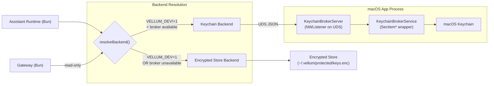

# macOS Keychain Broker Architecture

**Status:** Accepted
**Last Updated:** 2026-03-14
**Owners:** macOS client + assistant runtime

## Decision

Embed the keychain broker in the macOS app process rather than running a standalone daemon. The app exposes SecItem keychain operations over a Unix domain socket to the assistant runtime and gateway. Debug builds skip the broker entirely (`#if !DEBUG` guard) so developers never see keychain authorization prompts during rebuilds.

Credential storage is abstracted behind a `CredentialBackend` interface with two implementations: a keychain backend (backed by the broker) and an encrypted file store backend. Each process resolves a single primary backend at startup and uses single-writer semantics -- all writes go to the resolved backend only, with no dual-writing.

## Problem Statement

We want macOS to use Keychain as the primary secret store, but direct keychain access from the daemon process causes repeated authorization prompts. The prompts are especially problematic during development with ad-hoc signed builds, where every rebuild changes the signing identity and triggers a new keychain prompt.

Prior state:

- macOS defaulted to encrypted file storage to avoid prompt fatigue: `assistant/src/security/secure-keys.ts`.
- Historical comments documented prompt issues with ad-hoc signing: `clients/shared/App/SigningIdentityManager.swift`.
- The `keychain.ts` module (now deleted) called `/usr/bin/security` CLI, which was unreliable and prompt-heavy.

## Architecture

### CredentialBackend interface

All credential storage operations are routed through the `CredentialBackend` interface, which provides a uniform API for get, set, delete, and list operations. This abstraction decouples `secure-keys.ts` from any specific storage mechanism.

Two implementations exist:

| Backend          | Backing store                                | When used                                                               |
| ---------------- | -------------------------------------------- | ----------------------------------------------------------------------- |
| Keychain backend | macOS Keychain via the broker UDS connection | Production app context (`VELLUM_DEV` is NOT `"1"`) and broker available |
| Encrypted store  | `~/.vellum/protected/keys.enc` (AES-256-GCM) | `VELLUM_DEV=1`, broker unavailable, CLI-only, headless, CI              |

The interface is intentionally minimal to make adding future backends trivial -- e.g., Linux secret service (libsecret/D-Bus), 1Password CLI, or cloud KMS. A new backend only needs to implement the `CredentialBackend` interface and be wired into the backend resolution logic.

### Broker topology



### Key properties

- **No separate process lifecycle.** The broker starts when the app starts and stops when the app stops. No launchd plist, no health checks, no orphan cleanup.
- **No auth bootstrap problem.** The app writes the broker auth token to disk before launching the daemon, so the daemon always has a valid token at startup.
- **No keychain prompts on signed builds.** Items are stored with `kSecAttrAccessibleAfterFirstUnlock` under the `vellum-assistant` service name. A stable code-signing identity means macOS grants access without prompting after the first unlock.
- **No keychain interaction on debug builds.** The entire `KeychainBrokerServer` is compiled out with `#if !DEBUG`, so development builds use the encrypted file store exclusively.
- **Single-writer to resolved backend.** Each process resolves exactly one primary backend at startup. Writes go only to that backend. There is no dual-writing.
- **Encrypted file store as permanent fallback.** CLI-only, headless, and development environments always have the encrypted store (`~/.vellum/protected/keys.enc`) available.

## Components

### Swift side (macOS app)

| File                                                                  | Role                                                                                                                                                                             |
| --------------------------------------------------------------------- | -------------------------------------------------------------------------------------------------------------------------------------------------------------------------------- |
| `clients/macos/vellum-assistant/Security/KeychainBrokerServer.swift`  | UDS server using `NWListener`. Accepts newline-delimited JSON requests, validates auth token, dispatches to `KeychainBrokerService`. Compiled only for `!DEBUG` builds.          |
| `clients/macos/vellum-assistant/Security/KeychainBrokerService.swift` | Thin `SecItem*` wrapper scoped to the `vellum-assistant` service. Provides `get`, `set`, `delete`, `list`. Uses `kSecAttrAccessibleAfterFirstUnlock`. Compiled only for `macOS`. |

### TypeScript side (runtime + gateway)

| File                                               | Role                                                                                                                                                                                                                                                                                                                                                          |
| -------------------------------------------------- | ------------------------------------------------------------------------------------------------------------------------------------------------------------------------------------------------------------------------------------------------------------------------------------------------------------------------------------------------------------- |
| `assistant/src/security/credential-backend.ts`     | `CredentialBackend` interface definition (`get`, `set`, `delete`, `list`) plus both adapter implementations: `KeychainBackend` (backed by the broker UDS client) and `EncryptedStoreBackend` (backed by `encrypted-store.ts` / `~/.vellum/protected/keys.enc`). Also exports factory functions `createKeychainBackend()` and `createEncryptedStoreBackend()`. |
| `assistant/src/security/keychain-broker-client.ts` | Async UDS client for the runtime. Persistent socket connection, request/response correlation, auth token caching with auto-refresh on `UNAUTHORIZED`. Falls back gracefully (returns safe defaults, never throws).                                                                                                                                            |
| `assistant/src/security/secure-keys.ts`            | Unified API surface. Resolves a single primary `CredentialBackend` at startup based on environment and broker availability. All writes go to the resolved backend only (single-writer). Reads check the primary backend first, with legacy fallback to the encrypted store for migration. Deletes clean up both stores to prevent stale keys.                 |
| `gateway/src/credential-reader.ts`                 | Read-only credential reader. Tries broker via native async UDS connection (`node:net`), falls back to encrypted store. All public credential read functions are async.                                                                                                                                                                                        |

## Message Contract

### Transport

- Unix domain socket: `~/.vellum/keychain-broker.sock`
- Socket path is derived from the data directory (e.g., `join(getRootDir(), "keychain-broker.sock")`)
- Newline-delimited JSON (`\n` as message boundary)

### Request envelope

```json
{
  "v": 1,
  "id": "uuid",
  "token": "hex-auth-token",
  "method": "key.get",
  "params": { "account": "anthropic" }
}
```

The `v` field is a protocol version number (currently `1`). The server rejects requests with unsupported versions.

### Response envelope

Success:

```json
{
  "id": "uuid",
  "ok": true,
  "result": { "found": true, "value": "sk-..." }
}
```

Error:

```json
{
  "id": "uuid",
  "ok": false,
  "error": { "code": "UNAUTHORIZED", "message": "Invalid auth token" }
}
```

### Methods

| Method        | Params               | Result                   |
| ------------- | -------------------- | ------------------------ |
| `broker.ping` | none                 | `{ pong: true }`         |
| `key.get`     | `{ account }`        | `{ found, value? }`      |
| `key.set`     | `{ account, value }` | `{ stored: true }`       |
| `key.delete`  | `{ account }`        | `{ deleted: true }`      |
| `key.list`    | none                 | `{ accounts: string[] }` |

### Error codes

- `UNAUTHORIZED` — invalid or missing auth token
- `INVALID_REQUEST` — malformed request, missing params, or unsupported protocol version
- `KEYCHAIN_ERROR` — SecItem operation failed

## Security Model

### Authentication

1. On app launch, the broker generates 32 random bytes via `SecRandomCopyBytes` and hex-encodes them as the auth token.
2. The token is written to `~/.vellum/protected/keychain-broker.token` with `0600` permissions. The parent directory is `0700`.
3. Every request must include the token. Requests with missing or invalid tokens are rejected before method dispatch.
4. If the app restarts (new token), the TS client detects `UNAUTHORIZED`, re-reads the token from disk, and retries once.

### Process boundary

- The UDS itself restricts access to local processes.
- The token file's `0600` permissions restrict readers to the same user.
- Together: only same-user local processes that can read the token file can authenticate.

### Keychain access control

- All items use `kSecAttrAccessibleAfterFirstUnlock` — secrets survive screen lock without re-prompting.
- All items are scoped to the `vellum-assistant` service name via `kSecAttrService`.
- On signed release builds, the stable code-signing identity means macOS trusts the app to access its own keychain items without prompting.

### Threat model

| Threat                                      | Mitigation                                                                                 |
| ------------------------------------------- | ------------------------------------------------------------------------------------------ |
| Other-user process reads secrets            | UDS + token file `0600` restrict to same user                                              |
| Malicious local process impersonates broker | Client reads token from a known file path; attacker would need same-user file write access |
| Stale socket from unclean exit              | Server calls `unlink()` on the socket path before binding                                  |
| App restart invalidates cached token        | Client detects `UNAUTHORIZED`, re-reads token, retries once                                |

### Future: XPC transport

XPC provides stronger caller identity guarantees via audit tokens and code requirement checks. This would replace the file-based auth token with kernel-enforced caller verification, preventing same-user impersonation. No timeline — the UDS + token model is sufficient for the current threat profile.

## Developer Experience

- **Debug builds:** The `#if !DEBUG` guard compiles out the entire `KeychainBrokerServer`. The broker socket is not created, so clients see the broker as unavailable and use the encrypted store. Developers never encounter keychain prompts during the edit-build-run cycle.
- **Release builds:** The broker starts automatically with the app. The daemon discovers the broker via the derived socket path (`join(getRootDir(), "keychain-broker.sock")`) and token file. No configuration needed.
- **CLI-only / headless:** No macOS app means no broker socket. All storage uses the encrypted file store. This is the expected path for CI, servers, and non-macOS platforms.

## Store-Routing Policy

### Backend resolution

At process startup, `secure-keys.ts` resolves a single primary `CredentialBackend` for the lifetime of the process:

| Condition                                             | Resolved backend |
| ----------------------------------------------------- | ---------------- |
| `VELLUM_DEV` is NOT `"1"` **and** broker is available | Keychain backend |
| `VELLUM_DEV=1` **or** broker is unavailable           | Encrypted store  |

Once resolved, the backend does not change during the process lifetime. There is no runtime switching between backends.

### Read strategy

Reads go to the **primary backend first**. If the primary backend is the keychain backend and the key is not found, a legacy fallback read is attempted against the encrypted store. This fallback handles the migration period where keys written before the single-writer policy may still exist only in the encrypted store. When the primary backend is the encrypted store, there is no fallback -- the encrypted store is the sole source of truth.

### Write strategy

Writes go **only to the resolved primary backend**. There is no dual-writing. This eliminates the consistency problems that dual-writing introduced (partial failures leaving stores out of sync, unclear source of truth).

- Keychain backend resolved: writes go to the keychain via broker only.
- Encrypted store resolved: writes go to the encrypted file store only.

### Delete strategy

Deletes **always clean up both stores** regardless of the resolved backend. This ensures that stale keys do not linger in the non-primary store, which could cause unexpected reads through the legacy fallback path.

### `VELLUM_DEV` environment variable

Setting `VELLUM_DEV=1` forces the encrypted store as the sole backend, bypassing the keychain broker entirely even when the broker socket is available. This serves two purposes:

1. **Development ergonomics.** Developers running the daemon outside the macOS app context (e.g., `bun run` directly) avoid broker connectivity issues and keychain prompt noise.
2. **Deterministic testing.** Tests and CI environments get predictable encrypted-store-only behavior without depending on macOS Keychain infrastructure.

When `VELLUM_DEV` is not set or is set to any value other than `"1"`, backend resolution proceeds normally (broker availability check).

## Callsite Policy

### Async-only policy

**All credential access uses the async functions** (`getSecureKeyAsync`, `setSecureKeyAsync`, `deleteSecureKeyAsync`). These route through the resolved `CredentialBackend`, with legacy fallback reads to the encrypted store when the keychain backend is primary. The migration from sync to async is complete: the sync variants (`getSecureKey`, `setSecureKey`, `deleteSecureKey`) have been deleted and no longer exist in the codebase.

### Runtime request handlers (secret-routes, etc.)

All runtime HTTP handlers that write or delete secrets use the async APIs (`setSecureKeyAsync`, `deleteSecureKeyAsync`). These are the primary entry points for macOS app flows and route through the resolved backend.

### Gateway (credential-reader)

The gateway reads credentials via async `readCredential()` which tries the broker first (native async UDS), falling back to the encrypted store. The gateway never writes credentials -- that responsibility belongs to the assistant runtime.

### Sync function removal

The sync secure-key functions (`getSecureKey`, `setSecureKey`, `deleteSecureKey`) have been deleted. All code uses the async variants (`getSecureKeyAsync`, `setSecureKeyAsync`, `deleteSecureKeyAsync`).

## Migration

Existing encrypted store keys remain accessible through the legacy read fallback. When the keychain backend is the resolved primary, reads that miss in the keychain fall back to the encrypted store, so keys written before the single-writer policy are still reachable without a one-time migration step.

Over time, as keys are re-written through normal credential update flows, they will be written only to the resolved primary backend. The legacy fallback read path will eventually become a no-op as all keys migrate naturally to the keychain.

Deletes always clean up both stores, so stale keys in the non-primary store are removed as part of normal credential lifecycle operations.

The old `keychain.ts` module (which called `/usr/bin/security` CLI directly) has been deleted. The old keychain-to-encrypted migration code has been removed. All keychain access now flows exclusively through the broker.

## Extensibility

The `CredentialBackend` interface is the extension point for adding new storage backends. To add a new backend (e.g., Linux secret service via libsecret/D-Bus, 1Password CLI, cloud KMS):

1. Implement the `CredentialBackend` interface in a new module.
2. Wire the new backend into the resolution logic in `secure-keys.ts`.
3. The rest of the codebase is unaffected -- all callers go through the existing async API surface.

No changes to callsites, the gateway, or the broker protocol are needed when adding a backend.
