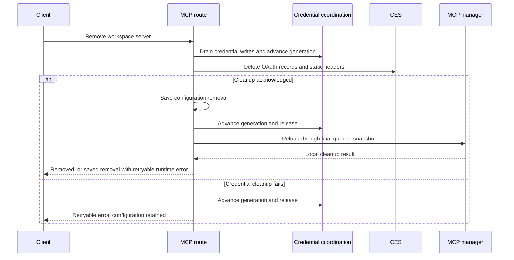

# MCP connection lifecycle

Workspace MCP mutations use a per-server operation mutex. Add, update, removal,
and legacy-header migration also serialize asynchronous configuration writes.
Existing server IDs and credential keys remain unchanged. Plugin-owned
servers cannot authorize workspace credential operations.

`internal_mcp_remove` and `internal_mcp_auth_revoke` share
`teardownMcpConnection`. Removal clears OAuth tokens, client registration,
client binding, discovery metadata, and static headers before removing the
saved server. Legacy revoke clears only OAuth records and retains the server
and static headers. Missing keys count as successful cleanup; failed deletion
retains configuration for retry. If runtime reload fails after removal is
saved, repeating remove retries runtime cleanup without looking up credentials
for an absent configuration.

Each OAuth provider captures a random credential generation. Its persistence
operations obtain a process-shared lock, check that generation and the current
configured endpoint, then write through the existing credential backend.
Tokens, client registration/binding, discovery, and invalidation all use this
boundary. Closing a provider also rejects queued writes. This covers silent
refresh in the schedule worker as well as browser authorization in the main
process.

The coordination file is `signals/mcp-credential-coordination.sqlite`. It holds
only hashed server IDs, random generations, pending cancellation attempt IDs,
and lock owner PID/token/process-start metadata.
It contains no credentials, server definitions, or enable/disable state. Its
local schema is initialized idempotently; no application database migration or
existing plugin conversion is required. A compare-and-swap update arbitrates
ownership without holding a SQL transaction across process inspection or network
I/O. A dead owner or changed process-start identity can be reclaimed atomically;
a live owner is never stolen on timeout. Process identity is qualified by its
lease token so older writers cannot inherit stale identity metadata. Linux identity includes the boot ID.
If another process's identity cannot be read, PID liveness remains the conservative
fallback. Handles are closed after each operation.

This is coordination among cooperating assistant processes, not an access-control
boundary. Workspace writers can change or delete the file, defeating the ordering
guarantee or blocking operations. Credential access remains subject to CES policy;
the coordination metadata neither grants access nor protects against a malicious
workspace writer. The repository's trusted host/pod process model applies here.

The file is local runtime metadata and remains across ordinary restarts so live
workers share the same generations. Workspace exports exclude `signals`, and a
fresh instance creates fresh metadata. Existing workspace configuration and
installed plugin formats are unchanged. Do not delete or replace the file while the assistant or its workers
are running; maintenance cleanup requires stopping all of them first.

A scoped credential-completion context prevents the secure-key wrapper's outer
deadline from releasing a mutation lock while its underlying promise still
runs. Lock acquisition is bounded, so a blocked writer prevents a later remove
from claiming successful cleanup.

Auth start returns an additive `attempt_id`. Status retains the existing
pending/complete/error vocabulary and also returns `attempt_id`. Cancel takes
`{serverId, attemptId}` and only accepts a matching pending attempt or unfinished
cancellation cleanup. It closes
the callback, fences writes, clears that attempt's OAuth records, and keeps
configuration for retry. The coordination store records the cancellation attempt
before cleanup and clears it only after all OAuth credential deletions succeed.
This survives assistant restarts: pending cleanup blocks new OAuth providers and
credential writes, and authorization start retries cleanup before creating a
replacement attempt. If cleanup still fails, start fails with the persisted
attempt intact. Disconnect and legacy revoke also settle pending cancellation
when their credential cleanup succeeds. The idempotent coordination schema
upgrade preserves existing generations and is covered by a legacy-schema test;
a child-process crash test verifies restart recovery.
A stale cancellation returns `{cancelled: false}`.
CLI polling requires a matching status ID when start advertised an attempt ID;
older assistants that omit it retain their existing polling behavior.

## Acknowledgement boundaries

Explicit teardown requests strict local cleanup. The manager retains client
handles whose SDK close failed, unregisters their tools, and reports failure;
a later remove retries those handles. Ordinary shutdown remains tolerant, but
startup refuses replacements while any retained transport remains unclosed.
Reload reports the cleanup failure and can retry closing those handles.
Queued reloads retain a strict request and converge to the last requested
configuration snapshot.

The worker reload signal does not acknowledge worker shutdown. Other processes
can retain a connection briefly while handling the notification, although their
older provider generation cannot persist credentials.

The persistence guarantee covers local storage and normally acknowledged CES
operations. CES HTTP and RPC transports can lose an acknowledgement for an
already-sent write. A client-side generation check cannot prove that remote
write's final outcome after a transport timeout or process crash. Strong fencing
across that failure requires CES-side generation/compare-and-set support. No
provider-side OAuth grant revocation is performed.
