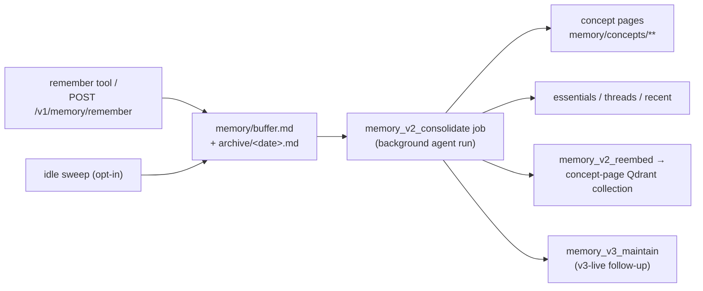

# Memory Architecture

Assistant memory and context-injection architecture.

## Tiers

An assistant runs exactly one memory tier, derived by `memoryTier()` in
`src/config/memory-tier.ts`:

| Tier  | Selected when                                | Injection source                              |
| ----- | -------------------------------------------- | --------------------------------------------- |
| `off` | `memory.enabled === false`                   | none                                          |
| `v3`  | `memory.v3.live === true`                    | v3 lanes + card (`v3/injector.ts`)            |
| `v2`  | `memory.v2.enabled === true` and v3 not live | v2 activation/router engine (`v2/`)           |
| `v1`  | otherwise                                    | PKB `<knowledge_base>` block (`pkb/`, legacy) |

New workspaces are switched to `v3` at creation (workspace migration 105).
`v1` and the `v2` injection engine are in retirement; v3 is the target state.

## The concept-page substrate (`v3/substrate/`)

The durable core shared by v2 and v3 is the **concept-page substrate**:
markdown articles under `memory/concepts/` (plus the aggregate views
`essentials.md`, `threads.md`, `recent.md` and the intake `buffer.md`), their
cached page index, and the concept-page Qdrant collection with dense + BM25
sparse vectors. It lives in
`src/plugins/defaults/memory/v3/substrate/` because it is memory-v3's
foundation — the v2 injection engine is just a second (transitional) consumer.

Substrate activation is a single predicate, `usesConceptPageMemory()` in
`src/config/memory-v3-gate.ts`: memory on AND (`memory.v3.live` OR
`memory.v2.enabled`). Every substrate gate — the write path, consolidation
scheduling, boot-time maintenance, capability seeding, the static `<info>`
memory block, and the v1-machinery suppressions — keys on it. When the v2
engine is removed, the predicate collapses to `memory.enabled`.

### Write path

- `handleRemember` (`graph/tool-handlers.ts`) appends timestamped bullets to
  `memory/buffer.md` + the daily archive whenever memory is enabled. Facts may
  carry `[[slug]]` page hints that consolidation reads first when filing.
- **Consolidation** (`v3/substrate/consolidation-job.ts`) is a background
  agent conversation that files buffer entries into concept pages, rewrites
  the aggregate views, and trims the buffer. Scheduling
  (`maybeEnqueueGraphMaintenanceJobs` in `jobs-worker.ts`):
  - interval-based (`memory.v2.consolidation_interval_hours`, default 8h),
    skipped below `MIN_BUFFER_LINES_FOR_CONSOLIDATION` (10) **unless** the
    non-empty buffer has sat unwritten for a full interval (staleness
    override — a small buffer can never sit unconsolidated forever);
  - size-triggered at `consolidation_max_buffer_lines` (default 100);
  - nudged by the create-memory route after a user-authored save (deduped,
    failure-backoff-respecting);
  - manual "Run now" via `POST /v1/consolidation/run-now`.
    Failed runs enter an exponential backoff (transient vs billing curves).

### Read paths

- **v3 (live)**: per-turn lane selection over concept pages — dense/sparse
  retrieval (`v3/substrate/sim.ts` over the concept-page collection),
  learned edges, entity/hot/fresh/core sets — rendered as the `<memory>`
  card by `v3/injector.ts`. The static `<info>` block
  (`v3/substrate/static-context.ts`: essentials/threads/recent/buffer) also
  injects whenever the substrate is active.
- **v2 (transitional)**: activation/router engine in `v2/`
  (`activation.ts`, `router.ts`, `reranker.ts`, `injection.ts`) selects
  concept pages per turn. Suppressed at assembly when v3 is live. Gated on
  `memory.v2.enabled` and deleted with it.
- **v1 (legacy)**: PKB retrieval over the v1 Qdrant collection. All v1
  machinery (graph extraction, summarization, PKB indexing/filing, PKB
  injection) is suppressed while the substrate is active.

### Boot-time maintenance

`v3/substrate/memory-v2-startup.ts`, invoked from the memory plugin's
startup path: skill + CLI-command capability seeding into the concept-page
collection, BM25 corpus-stats rebuild, and collection schema
reconcile/reembed. All gated on `usesConceptPageMemory()`.

## Memory graph (visualization)

`GET /v1/memory-graph` (`graph-topology/build-memory-graph.ts`) renders the
substrate as a backend-agnostic node/edge graph for the web Memory tab:
concept pages as nodes, authored links + learned co-selection associations as
edges, and `memory/buffer.md` entries as `pending` nodes
(`graph-topology/pending-buffer.ts`) so a just-saved fact appears before
consolidation files it. Gated on the `memory-concept-graph` feature flag +
`memory.v3.live`. `GET /v1/memory-graph-node` serves node detail, including
`buffer:` ids for pending entries.

## Capture beyond `remember`

- **Retrospective** (`memory-retrospective-*.ts`): periodic per-conversation
  review pass that saves what wasn't captured in the moment (and, on v3-live
  assistants, authors procedural skills).
- **Sweep** (`v3/substrate/sweep-job.ts`, `memory.v2.sweep_enabled`, default
  off): idle-debounced extraction of recent messages into the buffer.

## Config namespaces

Substrate tuning still lives under the historical `memory.v2.*` keys
(consolidation intervals/limits, embedding + retrieval weights) and v3 lane
tuning under `memory.v3.*`. The `memory.v2.enabled` flag gates only the v2
injection engine's turn-time selection; the substrate runs whenever
`usesConceptPageMemory()` holds.
