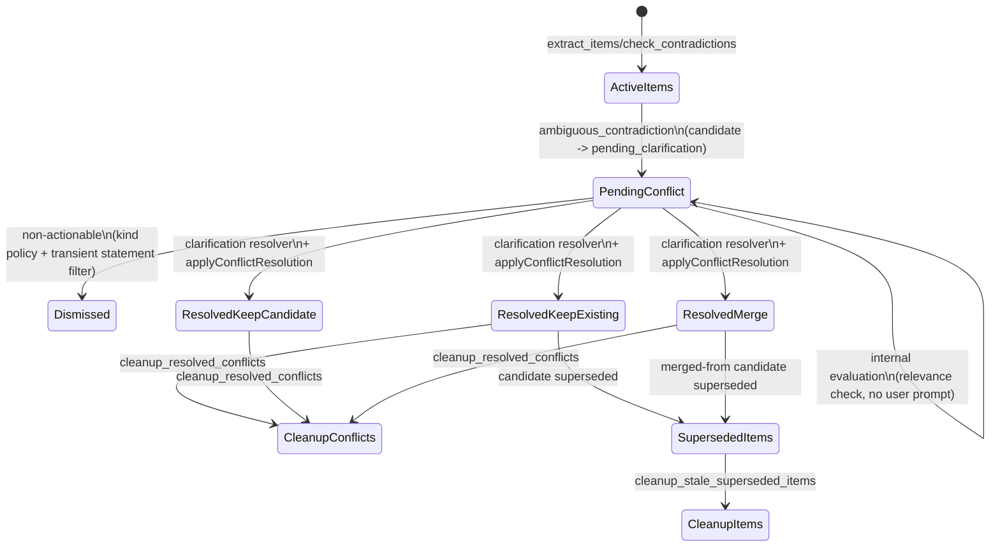
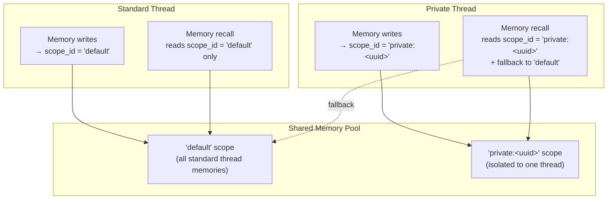
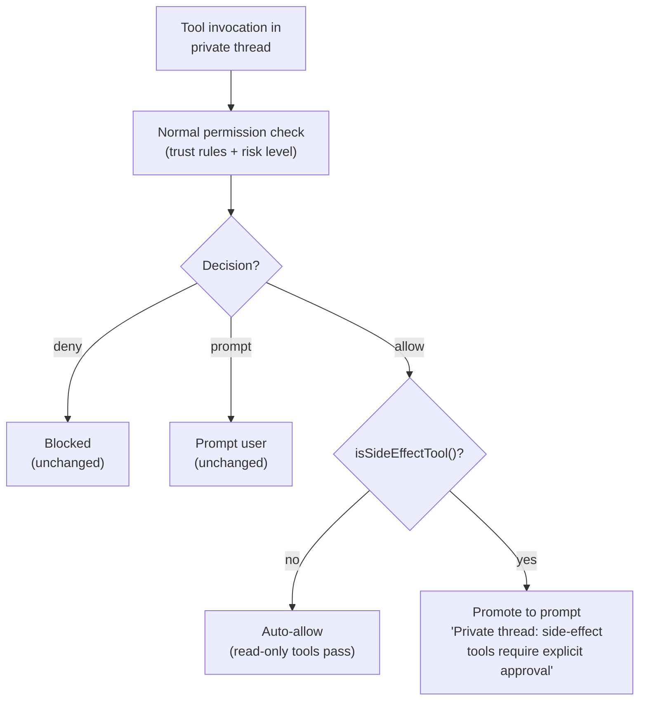
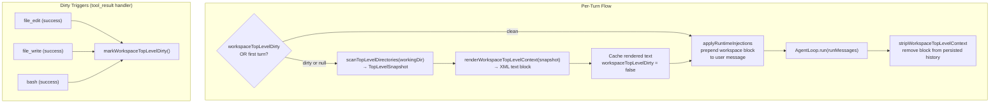
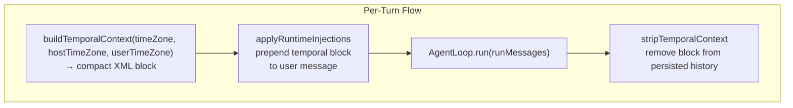
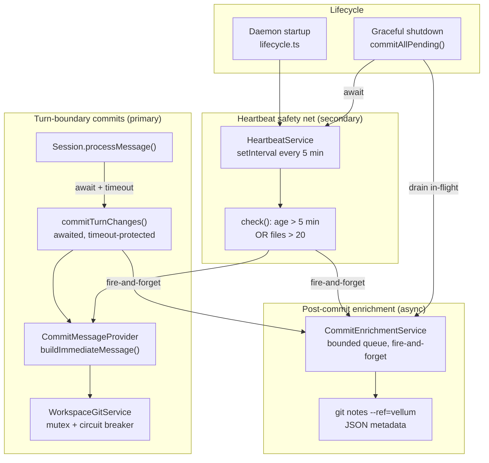

# Memory Architecture

Assistant memory and context-injection architecture details.

## Memory System — Daemon Data Flow

```mermaid
graph TB
    subgraph "Write Path"
        MSG_IN["Incoming Message<br/>(HTTP)"]
        STORE["ConversationStore.addMessage()<br/>Drizzle ORM → SQLite"]
        INDEX["Memory Indexer"]
        SEGMENT["Split into segments<br/>→ memory_segments"]
        EXTRACT_JOB["Enqueue extract_items job<br/>→ memory_jobs"]
        CONFLICT_RESOLVE_JOB["Enqueue resolve_pending_conflicts_for_message<br/>(dedupe by type+message+scope)<br/>→ memory_jobs"]
        SUMMARY_JOB["Enqueue build_conversation_summary<br/>→ memory_jobs"]
    end

    subgraph "Background Worker (polls every 1.5s)"
        WORKER["MemoryJobsWorker"]
        EMBED_SEG["embed_segment<br/>→ memory_embeddings"]
        EMBED_ITEM["embed_item<br/>→ memory_embeddings"]
        EMBED_SUM["embed_summary<br/>→ memory_embeddings"]
        EXTRACT["extract_items<br/>→ memory_items +<br/>memory_item_sources"]
        CHECK_CONTRA["check_contradictions<br/>→ contradiction/update merge OR<br/>pending_clarification + memory_item_conflicts"]
        RESOLVE_PENDING["resolve_pending_conflicts_for_message<br/>message-scoped clarification resolution<br/>→ resolved conflict + item status updates"]
        CLEAN_CONFLICTS["cleanup_resolved_conflicts<br/>delete resolved conflict rows<br/>older than retention window"]
        CLEAN_SUPERSEDED["cleanup_stale_superseded_items<br/>delete stale superseded items<br/>and item embedding rows"]
        EXTRACT_ENTITIES["extract_entities<br/>→ memory_entities +<br/>memory_item_entities +<br/>memory_entity_relations"]
        BACKFILL_REL["backfill_entity_relations<br/>checkpointed message scan<br/>→ enqueue extract_entities"]
        BUILD_SUM["build_conversation_summary<br/>→ memory_summaries"]
        WEEKLY["refresh_weekly_summary<br/>→ memory_summaries"]
    end

    subgraph "Embedding Providers"
        LOCAL_EMB["Local (ONNX)<br/>bge-small-en-v1.5"]
        OAI_EMB["OpenAI<br/>text-embedding-3-small"]
        GEM_EMB["Gemini<br/>gemini-embedding-001"]
        OLL_EMB["Ollama<br/>nomic-embed-text"]
    end

    subgraph "Read Path (Memory Recall)"
        QUERY["Recall Query Builder<br/>User request + compacted context summary"]
        CONFLICT_GATE["Soft Conflict Gate<br/>dismiss non-actionable conflicts (kind + statement + provenance policy)<br/>attempt internal resolution from user turn<br/>relevance-based; never produces user-facing prompts"]
        PROFILE_BUILD["Dynamic Profile Compiler<br/>active trusted profile memories<br/>user_confirmed > user_reported > assistant_inferred"]
        PROFILE_INJECT["Inject profile context block<br/>into runtime user tail<br/>(strict token cap)"]
        BUDGET["Dynamic Recall Budget<br/>computeRecallBudget()<br/>from prompt headroom"]
        LEX["Lexical Search<br/>FTS5 on memory_segment_fts"]
        SEM["Semantic Search<br/>Qdrant cosine similarity"]
        ENTITY_SEARCH["Entity Search<br/>Seed name/alias matching"]
        REL_EXPAND["Relation Expansion<br/>1-hop via memory_entity_relations<br/>→ neighbor item links"]
        DIRECT["Direct Item Search<br/>LIKE on subject/statement"]
        SCOPE["Scope Filter<br/>scope_id filtering<br/>(strict | global_fallback)<br/>Private threads: own scope + 'default'"]
        MERGE["RRF Merge<br/>+ Trust Weighting<br/>+ Freshness Decay"]
        CAPS["Source Caps<br/>bound per-source candidate count"]
        RERANK["LLM Re-ranking<br/>(Haiku, optional)"]
        TRIM["Token Trim<br/>maxInjectTokens override<br/>or static fallback"]
        INJECT["Attention-ordered<br/>Injection into prompt"]
        TELEMETRY["Emit memory_recalled<br/>hits + relation counters +<br/>ranking diagnostics"]
        STRIP_PROFILE["Strip injected dynamic profile block<br/>before persisting conversation history"]
    end

    subgraph "Context Window Management"
        CTX["Session Context"]
        COMPACT["Compaction trigger<br/>(approaching token limit)"]
        GUARDS["Cooldown + early-exit guards<br/>with severe-pressure override"]
        SUMMARIZE["Summarize old messages<br/>→ context_summary on conversation"]
        REPLACE["Replace old messages<br/>with summary in context<br/>(originals stay in DB)"]
    end

    subgraph "Overflow Recovery (context-overflow-reducer.ts)"
        OVF_PRE["Preflight budget check<br/>estimate > maxInputTokens × (1 − safetyMarginRatio)"]
        OVF_T1["Tier 1: Forced compaction<br/>force=true, minKeepRecentUserTurns=0"]
        OVF_T2["Tier 2: Tool-result truncation<br/>4,000 chars per result"]
        OVF_T3["Tier 3: Media/file stubbing"]
        OVF_T4["Tier 4: Injection downgrade<br/>→ minimal mode"]
        OVF_POLICY["Overflow policy resolver<br/>auto_compress / request_approval / fail_gracefully"]
        OVF_APPROVE["Approval gate<br/>PermissionPrompter"]
        OVF_DENY["Graceful deny message<br/>(not session_error)"]
    end

    MSG_IN --> STORE
    STORE --> INDEX
    INDEX --> SEGMENT
    INDEX --> EXTRACT_JOB
    INDEX --> CONFLICT_RESOLVE_JOB
    INDEX --> SUMMARY_JOB

    WORKER --> EMBED_SEG
    WORKER --> EMBED_ITEM
    WORKER --> EMBED_SUM
    WORKER --> EXTRACT
    WORKER --> CHECK_CONTRA
    WORKER --> RESOLVE_PENDING
    WORKER --> CLEAN_CONFLICTS
    WORKER --> CLEAN_SUPERSEDED
    WORKER --> EXTRACT_ENTITIES
    WORKER --> BACKFILL_REL
    WORKER --> BUILD_SUM
    WORKER --> WEEKLY
    EXTRACT --> CHECK_CONTRA
    EXTRACT --> EXTRACT_ENTITIES

    EMBED_SEG --> OAI_EMB
    EMBED_SEG --> GEM_EMB
    EMBED_SEG --> OLL_EMB

    QUERY --> CONFLICT_GATE
    CONFLICT_GATE --> PROFILE_BUILD
    PROFILE_BUILD --> PROFILE_INJECT
    CONFLICT_GATE --> LEX
    CONFLICT_GATE --> SEM
    CONFLICT_GATE --> ENTITY_SEARCH
    CONFLICT_GATE --> DIRECT
    LEX --> SCOPE
    SEM --> SCOPE
    ENTITY_SEARCH --> REL_EXPAND
    REL_EXPAND --> SCOPE
    DIRECT --> SCOPE
    SCOPE --> MERGE
    MERGE --> CAPS
    CAPS --> RERANK
    RERANK --> TRIM
    BUDGET --> TRIM
    TRIM --> INJECT
    PROFILE_INJECT --> INJECT
    INJECT --> TELEMETRY
    INJECT --> STRIP_PROFILE

    CTX --> COMPACT
    COMPACT --> GUARDS
    GUARDS --> SUMMARIZE
    SUMMARIZE --> REPLACE

    %% Overflow recovery flow
    CTX --> OVF_PRE
    OVF_PRE --> OVF_T1
    OVF_T1 --> OVF_T2
    OVF_T2 --> OVF_T3
    OVF_T3 --> OVF_T4
    OVF_T4 --> OVF_POLICY
    OVF_POLICY -->|"interactive"| OVF_APPROVE
    OVF_POLICY -->|"non-interactive"| OVF_T1
    OVF_APPROVE -->|"denied"| OVF_DENY
    OVF_APPROVE -->|"approved"| OVF_T1
    OVF_T1 -.->|"uses"| SUMMARIZE
```



### Context Compaction and Overflow Recovery Interaction

Normal context compaction (the "Context Window Management" subgraph above) runs proactively as the conversation approaches the token limit, using cooldown guards and a severity-pressure override to balance compaction frequency against cost. This is the primary defense against context overflow.

When compaction alone is insufficient — either because the conversation grew too fast between turns or because a single turn contains extremely large payloads — the overflow recovery pipeline takes over. The pipeline's first tier (forced compaction) reuses the same `maybeCompact()` summarization machinery but with emergency parameters: `force: true` bypasses cooldown guards, `minKeepRecentUserTurns: 0` allows summarizing even the most recent history, and `targetInputTokensOverride` sets a tighter budget. Subsequent tiers (tool-result truncation, media stubbing, injection downgrade) apply progressively more aggressive payload reduction without involving the summarizer.

If all four reducer tiers are exhausted, the overflow policy resolver determines whether to compress the latest user turn. In interactive sessions, the user is prompted for approval before this lossy step. If the user declines, the session emits a graceful assistant explanation message rather than a `session_error`, ending the turn cleanly. Non-interactive sessions auto-compress without prompting.

The key distinction: normal compaction is a cost-optimized background process that preserves conversational quality; overflow recovery is a convergence mechanism that prioritizes session survival over context richness. Both share the same summarization infrastructure but operate under different pressure thresholds and constraints.

### Memory Retrieval Config Knobs (Defaults)

| Config key                                                |                                                           Default | Purpose                                                                                                            |
| --------------------------------------------------------- | ----------------------------------------------------------------: | ------------------------------------------------------------------------------------------------------------------ |
| `memory.retrieval.dynamicBudget.enabled`                  |                                                            `true` | Toggle per-turn recall budget calculation from live prompt headroom.                                               |
| `memory.retrieval.dynamicBudget.minInjectTokens`          |                                                            `1200` | Lower clamp for computed recall injection budget.                                                                  |
| `memory.retrieval.dynamicBudget.maxInjectTokens`          |                                                           `10000` | Upper clamp for computed recall injection budget.                                                                  |
| `memory.retrieval.dynamicBudget.targetHeadroomTokens`     |                                                           `10000` | Reserved headroom to keep free for response generation/tool traces.                                                |
| `memory.entity.extractRelations.enabled`                  |                                                            `true` | Enable relation edge extraction and persistence in `memory_entity_relations`.                                      |
| `memory.entity.extractRelations.backfillBatchSize`        |                                                             `200` | Batch size for checkpointed `backfill_entity_relations` jobs.                                                      |
| `memory.entity.relationRetrieval.enabled`                 |                                                            `true` | Enable one-hop relation expansion from matched seed entities at recall time.                                       |
| `memory.entity.relationRetrieval.maxSeedEntities`         |                                                               `8` | Maximum matched seed entities from the query.                                                                      |
| `memory.entity.relationRetrieval.maxNeighborEntities`     |                                                              `20` | Maximum unique neighbor entities expanded from relation edges.                                                     |
| `memory.entity.relationRetrieval.maxEdges`                |                                                              `40` | Maximum relation edges traversed during expansion.                                                                 |
| `memory.entity.relationRetrieval.neighborScoreMultiplier` |                                                             `0.7` | Downweight multiplier for relation-expanded candidates vs direct entity hits.                                      |
| `memory.conflicts.enabled`                                |                                                            `true` | Enable soft conflict gate for unresolved `memory_item_conflicts`.                                                  |
| `memory.conflicts.resolverLlmTimeoutMs`                   |                                                           `12000` | Timeout bound for clarification resolver LLM fallback.                                                             |
| `memory.conflicts.relevanceThreshold`                     |                                                             `0.3` | Similarity threshold for deciding whether a pending conflict is relevant to the current request.                   |
| `memory.conflicts.gateMode`                               |                                                          `'soft'` | Conflict gate strategy. Currently only `'soft'` is supported (resolves conflicts internally without user prompts). |
| `memory.conflicts.conflictableKinds`                      | `['preference', 'profile', 'constraint', 'instruction', 'style']` | Memory item kinds eligible for conflict detection. Items with kinds outside this list are auto-dismissed.          |
| `memory.profile.enabled`                                  |                                                            `true` | Enable dynamic profile compilation from active trusted profile/preference/constraint/instruction memories.         |
| `memory.profile.maxInjectTokens`                          |                                                             `800` | Hard token cap enforced by `ProfileCompiler` when generating the runtime profile block.                            |

### Memory Recall Debugging Playbook

1. Run a recall-heavy turn and inspect `memory_recalled` events in the client trace stream.
2. Validate baseline counters:
   - `lexicalHits`, `semanticHits`, `recencyHits`, `entityHits`
   - `relationSeedEntityCount`, `relationTraversedEdgeCount`, `relationNeighborEntityCount`, `relationExpandedItemCount`
   - `mergedCount`, `selectedCount`, `injectedTokens`, `latencyMs`
3. Cross-check context pressure with `context_compacted` events:
   - `previousEstimatedInputTokens` vs `estimatedInputTokens`
   - `summaryCalls`, `compactedMessages`
4. If dynamic budget is enabled, verify `injectedTokens` stays within the configured min/max clamps for `dynamicBudget`.
5. Run `bun run src/index.ts memory status` and confirm cleanup pressure signals:
   - `Pending conflicts`, `Resolved conflicts`, `Oldest pending conflict age`
   - job queue counts for `cleanup_resolved_conflicts` / `cleanup_stale_superseded_items`
6. Before tuning ranking or relation settings, run:
   - `cd assistant && bun test src/__tests__/context-memory-e2e.test.ts`
   - `cd assistant && bun test src/__tests__/memory-context-benchmark.benchmark.test.ts`
   - `cd assistant && bun test src/__tests__/memory-recall-quality.test.ts`
   - `cd assistant && bun test src/__tests__/memory-regressions.test.ts -t "relation"`
7. After tuning, rerun the same suite and compare:
   - relation counters (coverage)
   - selected count / injected tokens (budget safety)
   - latency and ordering regressions via top candidate snapshots

### Conflict Lifecycle and Profile Hygiene



### Internal-Only Conflict Handling

Memory conflict resolution is entirely internal and non-interruptive. The conflict gate evaluates pending conflicts on each turn, dismisses non-actionable ones (based on kind policy, statement eligibility, coherence, and provenance), and attempts resolution when user input looks like a natural clarification. At no point does the conflict system produce user-facing clarification prompts, inject conflict instructions into the assistant's response, or block the user's request. The user is never aware that a conflict exists; the runtime response path always continues answering the user's actual request. This invariant is enforced across the conflict gate (`session-conflict-gate.ts`), session memory (`session-memory.ts`), session agent loop (`session-agent-loop.ts`), and runtime assembly (`session-runtime-assembly.ts`).

Runtime profile flow (per turn):

1. `ProfileCompiler` builds a trusted profile block from active `profile` / `preference` / `constraint` / `instruction` items under strict token cap.
2. Session injects that block only into runtime prompt state.
3. Session strips the injected profile block before persisting conversation history, so dynamic profile context never pollutes durable message rows.

### Provenance-Aware Memory Pipeline

Every persisted message carries provenance metadata (`provenanceTrustClass`, `provenanceSourceChannel`, etc.) derived from the `TrustContext` resolved by `trust-context-resolver.ts`. This metadata records the trust class of the actor who produced the message and through which channel, enabling downstream trust decisions without re-resolving identity at read time.

Two trust gates enforce trust-class-based access control over the memory pipeline:

- **Write gate** (`indexer.ts`): The `extract_items` and `resolve_conflicts` jobs only run for messages from trusted actors (guardian or undefined provenance). Messages from untrusted actors (`trusted_contact`, `unknown`) are still segmented and embedded — so they appear in conversation context — but no profile extraction or conflict resolution is triggered. This prevents untrusted channels from injecting or mutating long-term memory items.

- **Read gate** (`session-memory.ts`): When the current session's actor is untrusted, the memory recall pipeline returns a no-op context — no recall injection, no dynamic profile, no conflict resolution. This ensures untrusted actors cannot surface or exploit previously extracted memory.

Trust policy is **cross-channel and trust-class-based**: decisions use `trustContext.trustClass`, not the channel string. Desktop sessions default to `trustClass: 'guardian'`. External channels (Telegram, WhatsApp, phone) provide explicit trust context via the resolver. Messages without provenance metadata are treated as trusted (guardian); all new messages carry provenance.

---

## Private Threads — Isolated Memory and Strict Side-Effect Controls

Private threads provide per-conversation memory isolation and stricter tool execution controls. When a conversation is created with `threadType: 'private'`, the daemon assigns it a unique memory scope and enforces additional safeguards to prevent unintended side effects.

### Schema Columns

Two columns on the `conversations` table drive the feature:

| Column            | Type                               | Values                                                                   | Purpose                                                                                                                        |
| ----------------- | ---------------------------------- | ------------------------------------------------------------------------ | ------------------------------------------------------------------------------------------------------------------------------ |
| `thread_type`     | `text NOT NULL DEFAULT 'standard'` | `'standard'` or `'private'`                                              | Determines whether the conversation uses shared or isolated memory and permission policies                                     |
| `memory_scope_id` | `text NOT NULL DEFAULT 'default'`  | `'default'` for standard threads; `'private:<uuid>'` for private threads | Scopes all memory writes (items, segments) to this namespace; embeddings are isolated indirectly via their parent item/segment |

### Memory Isolation



**Write isolation**: All memory items and segments created during a private thread are tagged with its `memory_scope_id` (e.g. `'private:abc123'`). Embeddings are isolated indirectly — they reference scoped items/segments via `target_type`/`target_id`, so scope filtering at the item/segment level cascades to their embeddings. All scoped data is invisible to standard threads and other private threads.

**Read fallback**: When recalling memories for a private thread, the retriever queries both the thread's own scope and the `'default'` scope. This ensures the assistant still has access to general knowledge (user profile, preferences, facts) learned in standard threads, while private-thread-specific memories take precedence in ranking. The fallback is implemented via `ScopePolicyOverride` with `fallbackToDefault: true`, which overrides the global scope policy on a per-call basis.

**Profile compilation**: The `ProfileCompiler` also respects this dual-scope behavior for private threads — it includes profile/preference/constraint items from both the private scope and the default scope when building the runtime profile block.

### SessionMemoryPolicy

The daemon derives a `SessionMemoryPolicy` from the conversation's `thread_type` and `memory_scope_id` when creating or restoring a session:

```typescript
interface SessionMemoryPolicy {
  scopeId: string; // 'default' or 'private:<uuid>'
  includeDefaultFallback: boolean; // true for private threads
  strictSideEffects: boolean; // true for private threads
}
```

Standard threads use `DEFAULT_MEMORY_POLICY` (`{ scopeId: 'default', includeDefaultFallback: false, strictSideEffects: false }`). Private threads set all three fields: the private scope ID, default-fallback enabled, and strict side-effect controls enabled.

### Strict Side-Effect Prompt Gate

When `strictSideEffects` is `true` (all private threads), the `ToolExecutor` promotes any `allow` permission decision to `prompt` for side-effect tools — even when a trust rule would normally auto-allow the invocation. Deny decisions are preserved unchanged; only `allow` -> `prompt` promotion occurs.



This ensures that file writes, bash commands, host operations, and other mutating tools always require explicit user confirmation in private threads, providing an additional safety layer for sensitive conversations.

### Key Source Files

| File                                         | Role                                                                                       |
| -------------------------------------------- | ------------------------------------------------------------------------------------------ |
| `assistant/src/memory/schema.ts`             | `conversations` table: `threadType` and `memoryScopeId` column definitions                 |
| `assistant/src/daemon/session.ts`            | `SessionMemoryPolicy` interface and `DEFAULT_MEMORY_POLICY` constant                       |
| `assistant/src/daemon/server.ts`             | `deriveMemoryPolicy()` — maps thread type to memory policy                                 |
| `assistant/src/daemon/session-tool-setup.ts` | Propagates `memoryPolicy.strictSideEffects` as `forcePromptSideEffects` into `ToolContext` |
| `assistant/src/tools/executor.ts`            | `forcePromptSideEffects` gate — promotes allow to prompt for side-effect tools             |
| `assistant/src/memory/search/types.ts`       | `ScopePolicyOverride` interface for per-call scope control                                 |
| `assistant/src/memory/retriever.ts`          | `buildScopeFilter()` — builds scope ID list from override or global config                 |
| `assistant/src/memory/profile-compiler.ts`   | Dual-scope profile compilation with `includeDefaultFallback`                               |
| `assistant/src/daemon/session-memory.ts`     | Wires `scopeId` and `includeDefaultFallback` into recall and profile compilation           |

---

## Workspace Context Injection — Runtime-Only Directory Awareness

The session injects a workspace top-level directory listing into every user message at runtime, giving the model awareness of the sandbox filesystem structure without persisting it in conversation history.

### Lifecycle



### Key design decisions

- **Scope**: Sandbox workspace only (`~/.vellum/workspace`). Non-recursive — only top-level directories.
- **Bounded**: Maximum 120 directory entries (`MAX_TOP_LEVEL_ENTRIES`). Excess is truncated with a note.
- **Prepend, not append**: The workspace block is prepended to the user message content so that Anthropic cache breakpoints continue to land on the trailing user text block, preserving prompt cache efficiency.
- **Runtime-only**: The injected `<workspace_top_level>` block is stripped from `this.messages` after the agent loop completes. It never persists in conversation history or the database.
- **Dirty-refresh**: The scanner runs once on the first turn, then only re-runs after a successful mutation tool (`file_edit`, `file_write`, `bash`). Failed tool results do not trigger a refresh.
- **Injection ordering**: Workspace context is injected after other runtime injections (active surface, etc.) via `applyRuntimeInjections`, but because it is **prepended** to content blocks, it appears first in the final message.

### Cache compatibility

The Anthropic provider places `cache_control: { type: 'ephemeral' }` on the **last content block** of the last two user turns. Since workspace context is prepended (first block), the cache breakpoint correctly lands on the trailing user text or dynamic profile block. This is validated by dedicated cache-compatibility tests.

### Key files

| File                                                  | Role                                                                                                                                       |
| ----------------------------------------------------- | ------------------------------------------------------------------------------------------------------------------------------------------ |
| `assistant/src/workspace/top-level-scanner.ts`        | Synchronous directory scanner with `MAX_TOP_LEVEL_ENTRIES` cap                                                                             |
| `assistant/src/workspace/top-level-renderer.ts`       | Renders `TopLevelSnapshot` to `<workspace_top_level>` XML block                                                                            |
| `assistant/src/daemon/session-runtime-assembly.ts`    | Runtime injections and strip helpers (`<workspace_top_level>`, `<temporal_context>`, `<channel_onboarding_playbook>`, `<onboarding_mode>`) |
| `assistant/src/onboarding/onboarding-orchestrator.ts` | Builds assistant-owned onboarding runtime guidance from channel playbook + transport metadata                                              |
| `assistant/src/daemon/session-agent-loop.ts`          | Agent loop orchestration, runtime injection wiring, strip chain                                                                            |

---

## Temporal Context Injection — Date Grounding

The session injects a `<temporal_context>` block into every user message at runtime, giving the model awareness of the current date, current local time, current UTC time, timezone source metadata, upcoming weekend/work week windows, and a 14-day horizon of labelled future dates. This enables reliable reasoning about future dates (e.g. "plan a trip for next weekend") without persisting volatile temporal data in conversation history.

### Per-turn flow



### Key design decisions

- **Fresh each turn**: `buildTemporalContext()` is called at the start of every agent loop invocation, ensuring the model always sees the current date even in long-running conversations.
- **Clock source invariant**: Absolute time (`now`) always comes from the assistant host clock (`Date.now()`), never from channel/client clocks.
- **Timezone precedence**: If `ui.userTimezone` is configured, temporal context uses it for local-date interpretation. Otherwise it falls back to dynamic profile memory, then assistant host timezone.
- **Timezone-aware**: Uses `Intl.DateTimeFormat` APIs for DST-safe date arithmetic and timezone validation/canonicalization.
- **Bounded output**: Hard-capped at 1500 characters and 14 horizon entries to prevent prompt bloat.
- **Runtime-only**: The injected `<temporal_context>` block is stripped from `this.messages` after the agent loop completes via `stripTemporalContext`. It never persists in conversation history.
- **Specific strip prefix**: The strip function matches the exact injected prefix (`<temporal_context>\nToday:`) to avoid accidentally removing user-authored text that starts with `<temporal_context>`.
- **Retry paths**: Temporal context is included in all three `applyRuntimeInjections` call sites (main path, compact retry, media-trim retry).

### Key files

| File                                               | Role                                                                                    |
| -------------------------------------------------- | --------------------------------------------------------------------------------------- |
| `assistant/src/daemon/date-context.ts`             | `buildTemporalContext()` — generates the `<temporal_context>` XML block                 |
| `assistant/src/daemon/session-runtime-assembly.ts` | `injectTemporalContext()` / `stripTemporalContext()` helpers                            |
| `assistant/src/daemon/session-agent-loop.ts`       | Wiring: computes temporal context, passes to `applyRuntimeInjections`, strips after run |

---

## Workspace Git Tracking — Change Management

The workspace sandbox (`~/.vellum/workspace`) is automatically tracked by a per-workspace git repository. Every file change made by the assistant is captured in structured commits, providing a full audit trail and natural undo/history exploration via standard git commands.

### Architecture overview



### How it works

1. **Lazy initialization**: The git repository is created on first use, not at workspace creation. When `ensureInitialized()` is called, it checks for a `.git` directory. If absent, it runs `git init`, creates a `.gitignore` (excluding `data/`, `logs/`, `*.log`, `*.sock`, `*.pid`, `session-token`), sets the git identity to "Vellum Assistant", and creates an initial baseline commit capturing any pre-existing files. The baseline commit is intentional — it makes `git log`, `git diff`, and `git revert` work cleanly from the start. Both new and existing workspaces get the same treatment. For existing repos (e.g. created by older versions or external tools), `.gitignore` rules and git identity are set idempotently on each init, ensuring proper configuration regardless of how the repo was originally created.

2. **Turn-boundary commits**: After each conversation turn (user message + assistant response cycle), `session.ts` commits workspace changes via `commitTurnChanges(workspaceDir, sessionId, turnNumber)`. The commit runs in the `finally` block of `runAgentLoop`, guarded by a `turnStarted` flag that is set once the agent loop begins executing. This guarantees a commit attempt even when post-processing (e.g. `resolveAssistantAttachments`) throws, or when the user cancels mid-turn. The commit is raced against a configurable timeout (`workspaceGit.turnCommitMaxWaitMs`, default 4s) via `Promise.race`. If the commit exceeds the timeout, the turn proceeds immediately while the commit continues in the background. Note: the background commit is NOT awaited before the next turn starts, so brief cross-turn file attribution windows are possible but accepted as a tradeoff for responsiveness. Commit outcomes are logged with structured fields (`sessionId`, `turnNumber`, `filesChanged`, `durationMs`) for observability.

3. **Heartbeat safety net**: A `HeartbeatService` runs on a 5-minute interval, checking all tracked workspaces for uncommitted changes. It auto-commits when changes exceed either an age threshold (5 minutes since first detected) or a file count threshold (20+ files). This catches changes from long-running bash scripts, background processes, or crashed sessions that miss turn-boundary commits.

4. **Shutdown safety net**: During graceful daemon shutdown, `commitAllPending()` is called twice: once before `server.stop()` (pre-stop) and once after (post-stop). The pre-stop sweep captures any pending workspace changes. The post-stop sweep catches writes that occurred during server shutdown (e.g. in-flight tool executions completing during drain). Both calls are wrapped in try/catch to prevent commit failures from deadlocking shutdown.

5. **Corrupted repo recovery**: If a `.git` directory exists but is corrupted (e.g. missing HEAD), the service detects this via `git rev-parse --git-dir`, removes the corrupted directory, and reinitializes cleanly.

6. **Commit message provider abstraction**: All commit message construction is handled by a `CommitMessageProvider` interface (`commit-message-provider.ts`). The `DefaultCommitMessageProvider` produces deterministic messages based on trigger type (turn, heartbeat, shutdown). Both `turn-commit.ts` and `heartbeat-service.ts` accept an optional custom provider, creating a seam for future LLM-powered enrichment without changing the synchronous commit path.

7. **Circuit breaker with exponential backoff**: `WorkspaceGitService` tracks consecutive commit failures and backs off exponentially (2s, 4s, 8s... up to 60s configurable max). When the breaker is open, `commitIfDirty()` short-circuits without attempting git operations. On success, the breaker resets. State transitions are logged at info/warn level with structured fields (`consecutiveFailures`, `backoffMs`).

8. **Turn-commit timeout protection**: The turn-boundary commit in `session.ts` uses `Promise.race` with a configurable timeout (`workspaceGit.turnCommitMaxWaitMs`, default 4s). If the commit exceeds the timeout, the turn proceeds immediately (the commit continues in the background). This prevents slow git operations from blocking the conversation loop.

9. **Non-blocking enrichment queue**: After each successful commit, a `CommitEnrichmentService` runs async enrichment fire-and-forget. The queue has configurable max size (default 50), concurrency (default 1), per-job timeout (default 30s), and retry count (default 2 with exponential backoff). On queue overflow, the oldest job is dropped with a warning log. On graceful shutdown, in-flight jobs drain while pending jobs are discarded. Currently writes placeholder JSON metadata to git notes (`refs/notes/vellum`) as a scaffold for future LLM enrichment.

10. **Provider-aware commit message generation (optional)**: When `workspaceGit.commitMessageLLM.enabled` is `true`, turn-boundary commits attempt to generate a descriptive commit message using the configured LLM provider before falling back to deterministic messages. The feature ships disabled by default and is designed to never degrade turn completion guarantees.

    **Commit message LLM fallback chain**: The generator runs a sequence of pre-flight checks before calling the LLM. Each check that fails produces a machine-readable `llmFallbackReason` in the structured log output and immediately returns a deterministic message. The checks, in order:
    1. `disabled` — `commitMessageLLM.enabled` is `false` or `useConfiguredProvider` is `false`
    2. `missing_provider_api_key` — the configured provider's API key is not set in `config.apiKeys` (skipped for keyless providers like Ollama that run without an API key)
    3. `breaker_open` — the generator's internal circuit breaker is open after consecutive LLM failures (exponential backoff)
    4. `insufficient_budget` — the remaining turn budget (`deadlineMs - Date.now()`) is below `minRemainingTurnBudgetMs`
    5. `missing_fast_model` — no fast model could be resolved for the configured provider (see below); the provider is **not** called
    6. `provider_not_initialized` — the configured provider is not registered/bootstrapped (e.g., `getProvider()` throws)
    7. `timeout` — the LLM call exceeded `timeoutMs` (AbortController fires)
    8. `provider_error` — the provider threw an exception during the LLM call
    9. `invalid_output` — the LLM returned empty text, the literal string "FALLBACK", or total output > 500 chars
    - **Subject line capping**: If the LLM subject line exceeds 72 chars it is deterministically truncated to 72 chars. This is NOT treated as a failure (no breaker penalty, no deterministic fallback).

    **Fast model resolution**: The LLM call uses a small/fast model to minimize latency and cost. The model is resolved **before** any provider call as a pre-flight check:
    - If `commitMessageLLM.providerFastModelOverrides[provider]` is set, that model is used.
    - Otherwise, a built-in default is used: `anthropic` -> `claude-haiku-4-5-20251001`, `openai` -> `gpt-4o-mini`, `gemini` -> `gemini-2.0-flash`.
    - If the configured provider has no override and no built-in default (e.g., `ollama`, `fireworks`, `openrouter`), the generator returns a deterministic fallback with reason `missing_fast_model` and the provider is never called. To enable LLM commit messages for such providers, set `providerFastModelOverrides[provider]` to the desired model.

    **Pre-mutex LLM attempt**: The LLM generation runs BEFORE entering `commitIfDirty()` (outside the git mutex). Changed files are captured from a read-only `getStatus()` call (the "pre-status") outside the mutex. This avoids holding the mutex during network calls. The `commitIfDirty` callback uses its own mutex-protected status for the actual commit, so the file list used for commit and for the LLM prompt may differ slightly if files change between the two status calls — this is accepted as a tradeoff for not blocking concurrent git operations on LLM latency.

### Design decisions

- **Commit at turn boundaries, not per-tool-call**: A single commit per turn captures all file mutations from that turn atomically. This avoids noisy per-file commits and keeps the history meaningful.
- **Lazy init with baseline commit**: The repo is created on first use, not at daemon startup. Existing workspaces get their files captured in an "Initial commit: migrated existing workspace" on first use, rather than requiring an explicit migration step. The baseline commit ensures `git log`, `git diff`, and `git revert` work cleanly from the start.
- **Mutex serialization**: All git operations go through a per-workspace `Mutex` to prevent concurrent `git add`/`git commit` from corrupting the index. The mutex uses a FIFO wait queue.
- **Finally-block commit guarantee in session-agent-loop.ts**: Turn commits run in the `finally` block of `runAgentLoop`, ensuring they execute even when post-processing throws or the user cancels. The `turnStarted` flag prevents commits for turns that were blocked before the agent loop started. All errors are caught and logged as warnings. The commit is raced against a timeout (`turnCommitMaxWaitMs`, default 4s); if it exceeds the timeout the turn proceeds and the commit continues in the background without synchronization. Brief cross-turn file attribution is accepted as a tradeoff for keeping the conversation loop responsive.
- **Branch enforcement at init time**: `ensureOnMainLocked()` is called during initialization to ensure the workspace is on the `main` branch. If the workspace is on the wrong branch or in a detached HEAD state, it auto-corrects to `main` with a warning log. Per-commit enforcement is unnecessary since nothing in the codebase switches branches.
- **We intentionally don't provide custom history APIs** -- assistants should use git commands naturally via Bash (e.g. `git log`, `git diff`, `git show`). The workspace git repo is a standard git repository that any tool can interact with.

### Key files

| File                                                           | Role                                                                                                                            |
| -------------------------------------------------------------- | ------------------------------------------------------------------------------------------------------------------------------- |
| `assistant/src/workspace/git-service.ts`                       | `WorkspaceGitService`: lazy init, mutex, circuit breaker, `commitIfDirty()`, `getHeadHash()`, `writeNote()`, singleton registry |
| `assistant/src/workspace/commit-message-provider.ts`           | `CommitMessageProvider` interface, `DefaultCommitMessageProvider`, `CommitContext`/`CommitMessageResult` types                  |
| `assistant/src/workspace/commit-message-enrichment-service.ts` | `CommitEnrichmentService`: bounded async queue, fire-and-forget enrichment, git notes output                                    |
| `assistant/src/workspace/turn-commit.ts`                       | `commitTurnChanges()`: turn-boundary commit with structured metadata + enrichment enqueue                                       |
| `assistant/src/workspace/provider-commit-message-generator.ts` | `ProviderCommitMessageGenerator`: LLM-based commit message generation with circuit breaker and deterministic fallback           |
| `assistant/src/workspace/heartbeat-service.ts`                 | `HeartbeatService`: periodic safety-net auto-commits, shutdown commits, enrichment enqueue                                      |
| `assistant/src/daemon/session-agent-loop.ts`                   | Integration: turn-boundary commit with `raceWithTimeout` protection in `runAgentLoop` finally block                             |
| `assistant/src/daemon/lifecycle.ts`                            | Integration: `HeartbeatService` start/stop and shutdown commit                                                                  |
| `assistant/src/config/schema.ts`                               | `WorkspaceGitConfigSchema`: timeout, backoff, and enrichment queue configuration                                                |

---
