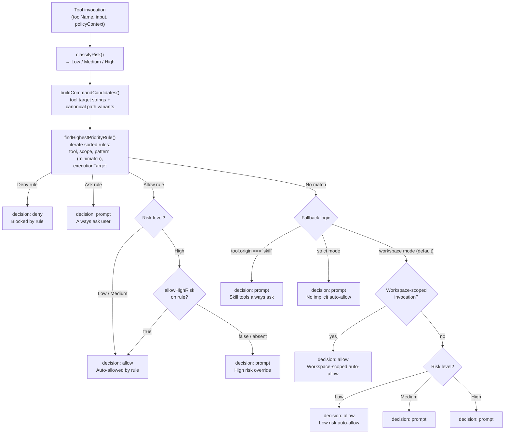
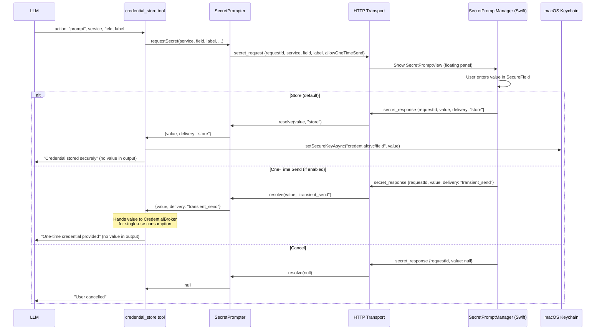
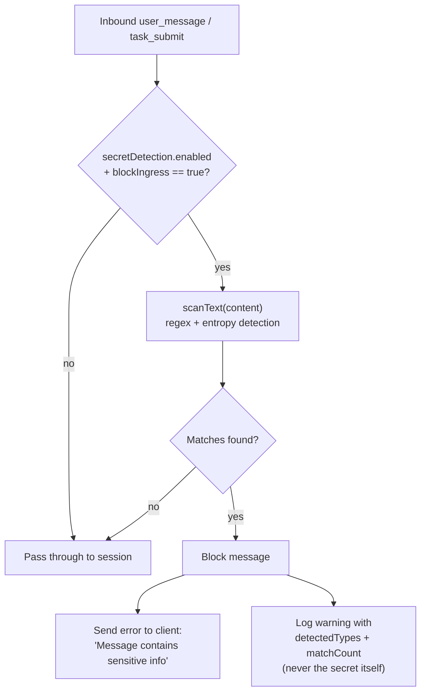
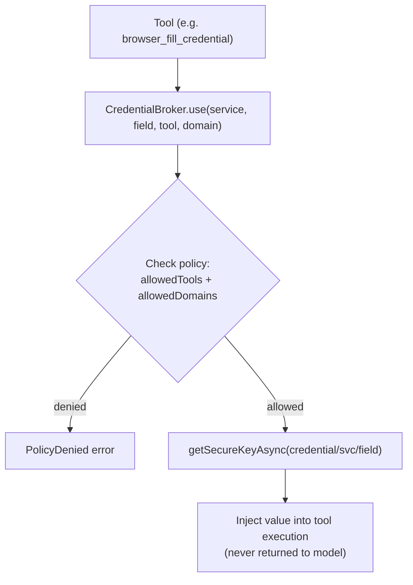
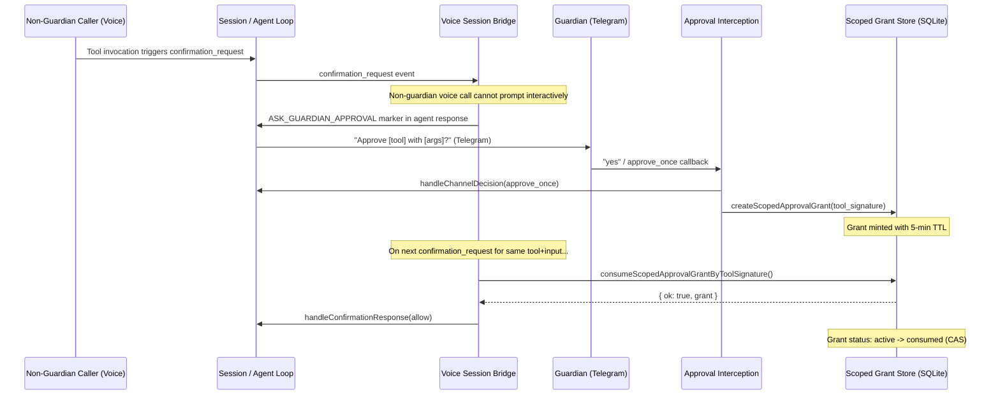

# Security Architecture

Permission, trust, and credential-security architecture details.

## Permission and Trust Security Model

The permission system controls which tool actions the agent can execute without explicit user approval. It supports two operating modes (`workspace` and `strict`), execution-target-scoped trust rules, and risk-based escalation to provide defense-in-depth against unintended or malicious tool execution.

### Permission Evaluation Flow

### Permission Modes: Workspace and Strict

The `permissions.mode` config option (`workspace` or `strict`) controls the default behavior when no trust rule matches a tool invocation. The default is `workspace`.

| Behavior                                           | Workspace mode (default)                      | Strict mode                                   |
| -------------------------------------------------- | --------------------------------------------- | --------------------------------------------- |
| Workspace-scoped ops with no matching rule         | Auto-allowed                                  | Prompted                                      |
| Non-workspace low-risk tools with no matching rule | Auto-allowed                                  | Prompted                                      |
| Medium-risk tools with no matching rule            | Prompted                                      | Prompted                                      |
| High-risk tools with no matching rule              | Prompted                                      | Prompted                                      |
| `skill_load` with no matching rule                 | Prompted                                      | Prompted                                      |
| `skill_load` with system default rule              | Auto-allowed (`skill_load:*` at priority 100) | Auto-allowed (`skill_load:*` at priority 100) |
| `browser_*` skill tools with system default rules  | Auto-allowed (priority 100 allow rules)       | Auto-allowed (priority 100 allow rules)       |
| Skill-origin tools with no matching rule           | Prompted                                      | Prompted                                      |
| Allow rules for non-high-risk tools                | Auto-allowed                                  | Auto-allowed                                  |
| Allow rules with `allowHighRisk: true`             | Auto-allowed (even high risk)                 | Auto-allowed (even high risk)                 |
| Deny rules                                         | Blocked                                       | Blocked                                       |

**Workspace mode** (default) auto-allows operations scoped to the workspace (file reads/writes/edits within the workspace directory, sandboxed bash) without prompting. Host operations, network requests, and operations outside the workspace still follow the normal approval flow. Explicit deny and ask rules override auto-allow.

**Strict mode** is designed for security-conscious deployments where every tool action must have an explicit matching rule in the trust store. It eliminates implicit auto-allow for any risk level, ensuring the user has consciously approved each class of tool usage.

> **Migration note:** Existing config files with `permissions.mode = "legacy"` are automatically migrated to `workspace` during config loading. The `legacy` value is not a supported steady-state mode.

### Trust Rules (v3 Schema)

Rules are stored in `~/.vellum/protected/trust.json` with version `3`. Each rule can include the following fields:

| Field             | Type                   | Purpose                                                                  |
| ----------------- | ---------------------- | ------------------------------------------------------------------------ |
| `id`              | `string`               | Unique identifier (UUID for user rules, `default:*` for system defaults) |
| `tool`            | `string`               | Tool name to match (e.g., `bash`, `file_write`, `skill_load`)            |
| `pattern`         | `string`               | Minimatch glob pattern for the command/target string                     |
| `scope`           | `string`               | Path prefix or `everywhere` — restricts where the rule applies           |
| `decision`        | `allow \| deny \| ask` | What to do when the rule matches                                         |
| `priority`        | `number`               | Higher priority wins; deny wins ties at equal priority                   |
| `executionTarget` | `string?`              | `sandbox` or `host` — restricts by execution context                     |
| `allowHighRisk`   | `boolean?`             | When true, auto-allows even high-risk invocations                        |

Missing optional fields act as wildcards. A rule with no `executionTarget` matches any target.

### Risk Classification and Escalation

The `classifyRisk()` function determines the risk level for each tool invocation:

| Tool                                                             | Risk level                  | Notes                                                                                        |
| ---------------------------------------------------------------- | --------------------------- | -------------------------------------------------------------------------------------------- |
| `file_read`, `web_search`, `skill_load`                          | Low                         | Read-only or informational                                                                   |
| `file_write`, `file_edit`                                        | Medium (default)            | Filesystem mutations                                                                         |
| `file_write`, `file_edit` targeting skill source paths           | **High**                    | `isSkillSourcePath()` detects managed/bundled/workspace/extra skill roots                    |
| `host_file_write`, `host_file_edit` targeting skill source paths | **High**                    | Same path classification, host variant                                                       |
| `bash`, `host_bash`                                              | Varies                      | Parsed via tree-sitter: low-risk programs = Low, high-risk programs = High, unknown = Medium |
| `scaffold_managed_skill`, `delete_managed_skill`                 | High                        | Skill lifecycle mutations always high-risk                                                   |
| `evaluate_typescript_code`                                       | High                        | Arbitrary code execution                                                                     |
| Skill-origin tools with no matching rule                         | Prompted regardless of risk | Even Low-risk skill tools default to `ask`                                                   |

The escalation of skill source file mutations to High risk is a privilege-escalation defense: modifying skill source code could grant the agent new capabilities, so such operations always require explicit approval.

### Skill Load Approval

The `skill_load` tool generates version-aware command candidates for rule matching:

1. `skill_load:<skill-id>@<version-hash>` — matches version-pinned rules
2. `skill_load:<skill-id>` — matches any-version rules
3. `skill_load:<raw-selector>` — matches the raw user-provided selector

In strict mode, `skill_load` without a matching rule is always prompted. The allowlist options presented to the user include both version-specific and any-version patterns. Note: the system default allow rule `skill_load:*` (priority 100) now globally allows all skill loads in both modes (see "System Default Allow Rules" below).

### Starter Approval Bundle

The starter bundle is an opt-in set of low-risk allow rules that reduces prompt noise, particularly in strict mode. It covers read-only tools that never mutate the filesystem or execute arbitrary code:

| Rule             | Tool             | Pattern             |
| ---------------- | ---------------- | ------------------- |
| `file_read`      | `file_read`      | `file_read:**`      |
| `glob`           | `glob`           | `glob:**`           |
| `grep`           | `grep`           | `grep:**`           |
| `list_directory` | `list_directory` | `list_directory:**` |
| `web_search`     | `web_search`     | `web_search:**`     |
| `web_fetch`      | `web_fetch`      | `web_fetch:**`      |

Acceptance is idempotent and persisted as `starterBundleAccepted: true` in `trust.json`. Rules are seeded at priority 90 (below user rules at 100, above system defaults at 50).

### System Default Allow Rules

In addition to the opt-in starter bundle, the permission system seeds unconditional default allow rules at priority 100 for two categories:

| Rule ID                                        | Tool                      | Pattern                     | Rationale                                                                                                |
| ---------------------------------------------- | ------------------------- | --------------------------- | -------------------------------------------------------------------------------------------------------- |
| `default:allow-skill_load-global`              | `skill_load`              | `skill_load:*`              | Loading any skill is globally allowed — no prompt for activating bundled, managed, or workspace skills   |
| `default:allow-browser_navigate-global`        | `browser_navigate`        | `browser_navigate:*`        | Browser tools migrated from core to the bundled `browser` skill; default allow preserves frictionless UX |
| `default:allow-browser_snapshot-global`        | `browser_snapshot`        | `browser_snapshot:*`        | (same)                                                                                                   |
| `default:allow-browser_screenshot-global`      | `browser_screenshot`      | `browser_screenshot:*`      | (same)                                                                                                   |
| `default:allow-browser_close-global`           | `browser_close`           | `browser_close:*`           | (same)                                                                                                   |
| `default:allow-browser_click-global`           | `browser_click`           | `browser_click:*`           | (same)                                                                                                   |
| `default:allow-browser_type-global`            | `browser_type`            | `browser_type:*`            | (same)                                                                                                   |
| `default:allow-browser_press_key-global`       | `browser_press_key`       | `browser_press_key:*`       | (same)                                                                                                   |
| `default:allow-browser_wait_for-global`        | `browser_wait_for`        | `browser_wait_for:*`        | (same)                                                                                                   |
| `default:allow-browser_extract-global`         | `browser_extract`         | `browser_extract:*`         | (same)                                                                                                   |
| `default:allow-browser_fill_credential-global` | `browser_fill_credential` | `browser_fill_credential:*` | (same)                                                                                                   |

These rules are emitted by `getDefaultRuleTemplates()` in `assistant/src/permissions/defaults.ts`. Because they use priority 100 (equal to user rules), they take effect in both workspace and strict modes. The `skill_load` rule means skill activation never prompts; the `browser_*` rules mean the browser skill's tools behave identically to the old core `headless-browser` tool from a permission standpoint.

### Shell Command Identity and Allowlist Options

For `bash` and `host_bash` tool invocations, the permission system uses parser-derived action keys (via `shell-identity.ts`) instead of raw whitespace-split patterns. This produces more meaningful allowlist options that reflect the actual command structure.

**Candidate building** (`buildShellCommandCandidates`): The shell parser (`tools/terminal/parser.ts`) produces segments and operators. `analyzeShellCommand()` extracts segments, operators, opaque-construct flags, and dangerous patterns. `deriveShellActionKeys()` then classifies the command:

- **Simple action** (optional setup-prefix segments like `cd`, `export`, `pushd` + exactly one action segment): Produces hierarchical `action:` keys. For example, `cd /repo && gh pr view 5525 --json title` yields candidates: the full original command text (`cd /repo && gh pr view 5525 --json title`), and action keys `action:gh pr view`, `action:gh pr`, `action:gh` (narrowest to broadest, max depth 3).
- **Complex command** (pipelines with `|`, or multiple non-prefix action segments): Only the full original command text is returned as a candidate — no action keys.

**Allowlist option ranking** (`buildShellAllowlistOptions`): For simple actions, the prompt offers options ordered from most specific to broadest: the full original command text (exact match), then action keys from deepest to shallowest. For complex commands, only the full original command text is offered. This prevents over-generalization of pipelines into permissive rules.

**Trust rule pattern format**: Action keys use the `action:` prefix in trust rules (e.g., `action:gh pr view`). The trust store matches these via `findHighestPriorityRule()` against the candidate list produced by `buildShellCommandCandidates()`.

**Scope ordering**: Scope options for all tools (including shell) are ordered from narrowest to broadest: project > parent directories > everywhere. The macOS chat UI uses a two-step flow for persistent rules: the user first selects the allowlist pattern, then selects the scope. This explicit scope selection replaces any silent auto-selection, ensuring the user always knows where the rule will apply.

### Prompt UX

When a permission prompt is sent to the client (via `confirmation_request` SSE event), it includes:

| Field              | Content                                             |
| ------------------ | --------------------------------------------------- |
| `toolName`         | The tool being invoked                              |
| `input`            | Redacted tool input (sensitive fields removed)      |
| `riskLevel`        | `low`, `medium`, or `high`                          |
| `executionTarget`  | `sandbox` or `host` — where the action will execute |
| `allowlistOptions` | Suggested patterns for "always allow" rules         |
| `scopeOptions`     | Suggested scopes for rule persistence               |

The user can respond with: `allow` (one-time), `always_allow` (create allow rule), `always_allow_high_risk` (create allow rule with `allowHighRisk: true`), `deny` (one-time), or `always_deny` (create deny rule).

### Canonical Paths

File tool candidates include canonical (symlink-resolved) absolute paths via `normalizeFilePath()` to prevent policy bypass through symlinked or relative path variations. The path classifier (`isSkillSourcePath()`) also resolves symlinks before checking against skill root directories.

### Key Source Files

| File                                          | Role                                                                                                                                                                                |
| --------------------------------------------- | ----------------------------------------------------------------------------------------------------------------------------------------------------------------------------------- |
| `assistant/src/permissions/types.ts`          | `TrustRule`, `PolicyContext`, `RiskLevel`, `UserDecision` types                                                                                                                     |
| `assistant/src/permissions/checker.ts`        | `classifyRisk()`, `check()`, `buildCommandCandidates()`, allowlist/scope generation                                                                                                 |
| `assistant/src/permissions/shell-identity.ts` | `analyzeShellCommand()`, `deriveShellActionKeys()`, `buildShellCommandCandidates()`, `buildShellAllowlistOptions()` — parser-based shell command identity and action key derivation |
| `assistant/src/permissions/trust-store.ts`    | Rule persistence, `findHighestPriorityRule()`, execution-target matching, starter bundle                                                                                            |
| `assistant/src/permissions/prompter.ts`       | HTTP prompt flow: `confirmation_request` → `confirmation_response`                                                                                                                  |
| `assistant/src/permissions/defaults.ts`       | Default rule templates (system ask rules for host tools, CU, etc.)                                                                                                                  |
| `assistant/src/skills/version-hash.ts`        | `computeSkillVersionHash()` — deterministic SHA-256 of skill source files                                                                                                           |
| `assistant/src/skills/path-classifier.ts`     | `isSkillSourcePath()`, `normalizeFilePath()`, skill root detection                                                                                                                  |
| `assistant/src/config/schema.ts`              | `PermissionsConfigSchema` — `permissions.mode` (`workspace` / `strict`)                                                                                                             |
| `assistant/src/tools/executor.ts`             | `ToolExecutor` — orchestrates risk classification, permission check, and execution                                                                                                  |
| `assistant/src/daemon/handlers/config.ts`     | `handleToolPermissionSimulate()` — dry-run simulation handler                                                                                                                       |

### Permission Simulation (Tool Permission Tester)

The `tool_permission_simulate` HTTP endpoint lets clients dry-run a tool invocation through the full permission evaluation pipeline without actually executing the tool or mutating daemon state. The macOS Settings panel exposes this as a "Tool Permission Tester" UI.

**Simulation semantics:**

- The request specifies `toolName`, `input`, and optional context overrides (`workingDir`, `isInteractive`, `forcePromptSideEffects`, `executionTarget`).
- The daemon runs `classifyRisk()` and `check()` against the live trust rules, then returns the decision (`allow`, `deny`, or `prompt`), risk level, reason, matched rule ID, and (when decision is `prompt`) the full `promptPayload` with allowlist/scope options.
- **Simulation-only allow/deny**: A simulated `allow` or `deny` decision does not persist any state. No trust rules are created or modified.
- **Always-allow persistence**: When the tester UI's "Always Allow" action is used, the client sends a separate `add_trust_rule` message that persists the rule to `trust.json`, identical to the existing confirmation flow.
- **Private-conversation override**: When `forcePromptSideEffects` is true, side-effect tools that would normally be auto-allowed are promoted to `prompt`.
- **Non-interactive override**: When `isInteractive` is false, `prompt` decisions are converted to `deny` (no client available to approve).

---

---

## Credential Storage and Secret Security

The credential system enforces four security invariants:

1. **Secrets never enter LLM context** — secret values are never included in model messages, tool outputs, or lifecycle events.
2. **No generic plaintext read API** — there is no tool-layer function to read a stored secret as plaintext. Secrets are consumed only by the CredentialBroker for scoped use.
3. **Secrets never logged in plaintext** — all log statements use metadata-only fields (service, field, requestId); recursive redaction strips sensitive keys from lifecycle event payloads.
4. **Credentials only used for allowed purpose** — each credential has tool and domain policy; the broker denies requests outside those bounds.

### Secure Prompt Flow

### Secret Ingress Blocking

The secret scanner includes pattern-based detection for Telegram bot tokens (format: `<8-10 digit bot_id>:<35-char secret>`), API keys from major providers, Slack tokens, and other common secret formats. This prevents users from accidentally pasting a Telegram bot token in chat — the token must be entered through the secure credential prompt flow or the Settings UI instead.

### Brokered Credential Use

### One-Time Send Override

The `allowOneTimeSend` config gate (default: `false`) enables a secondary "Send Once" button in the secret prompt UI. When used:

- The secret value is handed to the `CredentialBroker`, which holds it in memory for the next `consume` or `browserFill` call
- The value is **not** persisted to the keychain
- The broker discards the value after a single use
- The vault tool output confirms delivery without including the secret value — the value is never returned to the model
- The config gate must be explicitly enabled by the operator

### Storage Layout

| Component           | Location                                             | What it stores                                                                                                                                               |
| ------------------- | ---------------------------------------------------- | ------------------------------------------------------------------------------------------------------------------------------------------------------------ |
| Secret values       | macOS Keychain (primary) or encrypted file fallback  | Encrypted credential values keyed as `credential/{service}/{field}`. Falls back to encrypted file backend on Linux/headless or when Keychain is unavailable. |
| Credential metadata | `~/.vellum/workspace/data/credentials/metadata.json` | Service, field, label, policy (allowedTools, allowedDomains), timestamps                                                                                     |
| Config              | `~/.vellum/workspace/config.*`                       | `secretDetection` settings: enabled, action, entropyThreshold, allowOneTimeSend                                                                              |

### Key Files

| File                                                 | Role                                                                  |
| ---------------------------------------------------- | --------------------------------------------------------------------- |
| `assistant/src/tools/credentials/vault.ts`           | `credential_store` tool — store, list, delete, prompt actions         |
| `assistant/src/security/secure-keys.ts`              | Async secure key CRUD via keychain broker and encrypted file store    |
| `assistant/src/tools/credentials/metadata-store.ts`  | JSON file metadata CRUD for credential records                        |
| `assistant/src/tools/credentials/broker.ts`          | Brokered credential access with policy enforcement and transient send |
| `assistant/src/tools/credentials/policy-validate.ts` | Policy input validation (allowedTools, allowedDomains)                |
| `assistant/src/permissions/secret-prompter.ts`       | HTTP secret_request/secret_response flow                              |
| `assistant/src/security/secret-scanner.ts`           | Regex + entropy-based secret detection                                |
| `assistant/src/security/secret-ingress.ts`           | Inbound message secret blocking                                       |
| `clients/macos/.../SecretPromptManager.swift`        | Floating panel UI for secure credential entry                         |

---

## Channel-Agnostic Scoped Approval Grants

Scoped approval grants are a channel-agnostic primitive that allows a guardian's approval decision on one channel (e.g., Telegram) to authorize a tool execution on a different channel (e.g., phone). Each grant authorizes exactly one tool execution and is consumed atomically.

### Scope Modes

Two scope modes exist:

| Mode             | Key fields                 | Use case                                                                                                                                                                              |
| ---------------- | -------------------------- | ------------------------------------------------------------------------------------------------------------------------------------------------------------------------------------- |
| `request_id`     | `requestId`                | Grant is bound to a specific pending confirmation request. Consumed by matching the request ID.                                                                                       |
| `tool_signature` | `toolName` + `inputDigest` | Grant is bound to a specific tool invocation identified by tool name and a canonical SHA-256 digest of the input. Consumed by matching both fields plus optional context constraints. |

### Lifecycle Flow

### Security Invariants

1. **One-time use** -- Each grant can be consumed at most once. The consume operation uses compare-and-swap (CAS) on the `status` column (`active` -> `consumed`) so concurrent consumers race safely. At most one wins.

2. **Exact-match** -- All non-null scope fields on the grant must match the consumption context exactly. The `inputDigest` is a SHA-256 of the canonical JSON serialization of `{ toolName, input }`, ensuring key-order-independent matching.

3. **Fail-closed** -- When no matching active grant exists, consumption returns `{ ok: false }` and the voice bridge auto-denies. There is no fallback to "allow without a grant."

4. **TTL-bound** -- Grants expire after a configurable TTL (default: 5 minutes). An expiry sweep transitions active past-TTL grants to `expired` status. Expired grants cannot be consumed.

5. **Context-constrained** -- Optional scope fields (`executionChannel`, `conversationId`, `callSessionId`, `requesterExternalUserId`) narrow the grant's applicability. When set on the grant, they must match the consumer's context. When null on the grant, they act as wildcards.

6. **Identity-bound** -- The guardian identity is verified at the approval interception level before a grant is minted. A sender whose `externalUserId` does not match the expected guardian cannot mint a grant.

7. **Persistent storage** -- Grants are stored in the SQLite `scoped_approval_grants` table, which survives daemon restarts. This ensures fail-closed behavior across restarts: consumed grants remain consumed, and no implicit "reset to allowed" occurs.

### Key Source Files

| File                                                             | Role                                                                          |
| ---------------------------------------------------------------- | ----------------------------------------------------------------------------- |
| `assistant/src/memory/scoped-approval-grants.ts`                 | CRUD, atomic CAS consume, expiry sweep, context-based revocation              |
| `assistant/src/memory/migrations/033-scoped-approval-grants.ts`  | SQLite schema migration for the `scoped_approval_grants` table                |
| `assistant/src/security/tool-approval-digest.ts`                 | Canonical JSON serialization + SHA-256 digest for tool signatures             |
| `assistant/src/runtime/routes/guardian-approval-interception.ts` | Grant minting on guardian approve_once decisions (`tryMintToolApprovalGrant`) |
| `assistant/src/calls/voice-session-bridge.ts`                    | Voice consumer: checks and consumes grants before auto-denying                |

### Test Coverage

| Test file                                                      | Scenarios covered                                                                                                                     |
| -------------------------------------------------------------- | ------------------------------------------------------------------------------------------------------------------------------------- |
| `assistant/src/__tests__/scoped-approval-grants.test.ts`       | Store CRUD, request_id consume, tool_signature consume, expiry, revocation, digest stability                                          |
| `assistant/src/__tests__/voice-scoped-grant-consumer.test.ts`  | Voice bridge integration: grant-allowed, no-grant-denied, tool-mismatch, guardian-bypass, one-time-use, revocation on call end        |
| `assistant/src/__tests__/guardian-grant-minting.test.ts`       | Grant minting: callback/engine/legacy paths, informational-skip, reject-skip, identity-mismatch, stale-skip, TTL verification         |
| `assistant/src/__tests__/scoped-grant-security-matrix.test.ts` | Security matrix: requester identity mismatch, concurrent CAS, persistence across restart, fail-closed default, cross-scope invariants |

---
