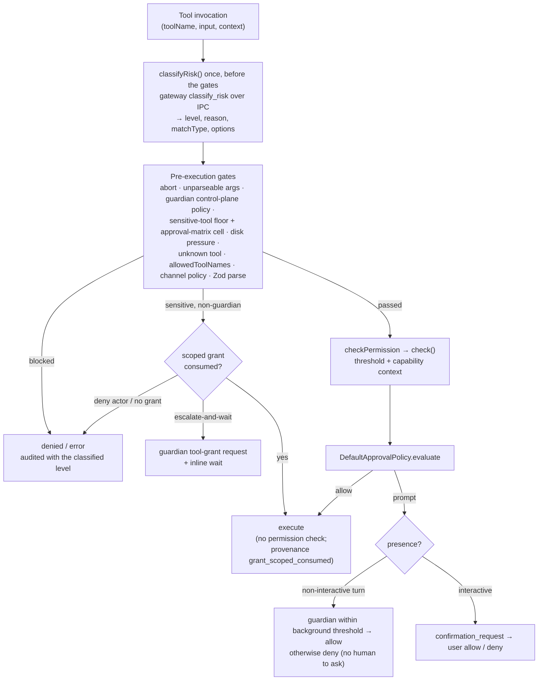
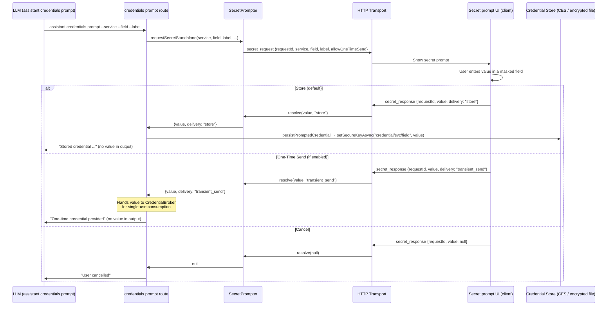
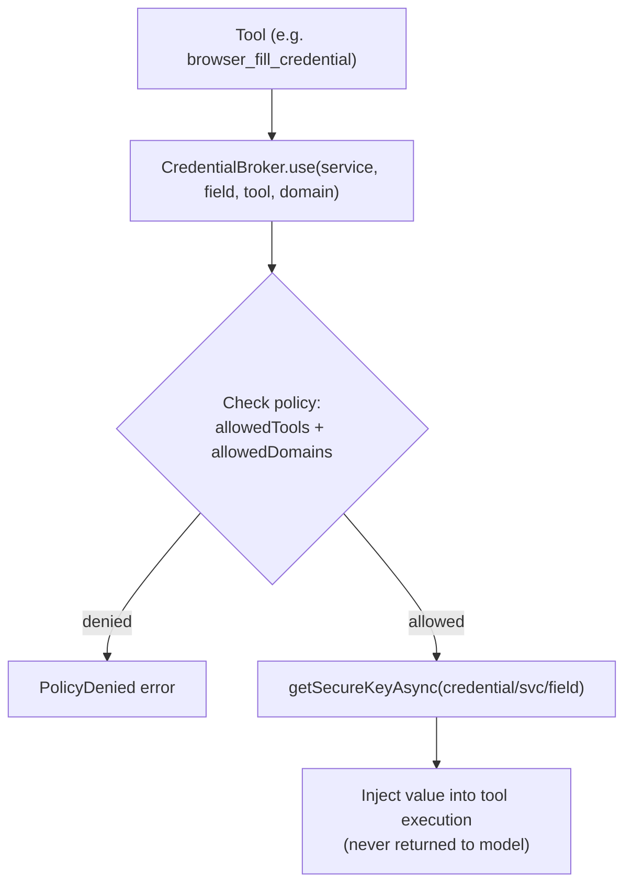
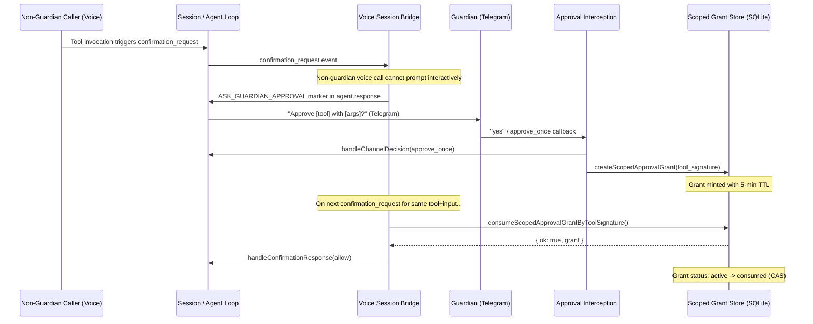

# Security Architecture

Permission, trust, and credential-security architecture details.

## Permission and Trust Security Model

The permission system decides which tool actions the agent may execute without explicit approval. Two processes share the work, and the split is the load-bearing fact of this section:

- The **gateway** owns risk classification (`gateway/src/risk/*`, entered through the `classify_risk` IPC method), the trust rules that raise or lower a classified risk (stored in the gateway's SQLite `trust_rules` table and applied inside the classifiers), the auto-approve thresholds and channel-permission cells, and the per-actor `TrustClass` verdict.
- The **assistant** owns the turn's actor and capabilities (`runtime/capabilities.ts`), the sensitive-tool capability floor (`tools/tool-approval-handler.ts`), the allow / prompt / deny decision over risk × threshold × capabilities (`permissions/checker.ts` `check()` and `DefaultApprovalPolicy`), the prompt UX (`permissions/prompter.ts`), execution, and the `tool_invocations` audit row.

The assistant has no local classifier and no fallback: an unreachable gateway fails closed. It classifies each tool invocation exactly once and passes that classification down; nothing in the assistant memoises or re-derives risk. `assistant/src/permissions/AGENTS.md` and `gateway/src/risk/AGENTS.md` state the rules that follow.

### Permission Evaluation Flow

```mermaid
graph TB
    TOOL_CALL["Tool invocation<br/>(toolName, input, context)"] --> CLASSIFY["classifyRisk() once, before the gates<br/>gateway classify_risk over IPC<br/>→ level, reason, matchType, options"]
    CLASSIFY --> GATES["Pre-execution gates<br/>abort · unparseable args · guardian control-plane policy ·<br/>sensitive-tool floor + approval-matrix cell · disk pressure ·<br/>unknown tool · allowedToolNames · channel policy · Zod parse"]
    GATES -->|"blocked"| GATE_OUT["denied / error<br/>audited with the classified level"]
    GATES -->|"sensitive, non-guardian"| GRANT{"scoped grant<br/>consumed?"}
    GRANT -->|"yes"| EXECUTE["execute<br/>(no permission check;<br/>provenance grant_scoped_consumed)"]
    GRANT -->|"escalate-and-wait"| ESCALATE["guardian tool-grant request<br/>+ inline wait"]
    GRANT -->|"deny actor / no grant"| GATE_OUT
    GATES -->|"passed"| CHECK["checkPermission → check()<br/>threshold + capability context"]
    CHECK --> POLICY["DefaultApprovalPolicy.evaluate"]
    POLICY -->|"allow"| EXECUTE
    POLICY -->|"prompt"| PROMPT_ROUTE{"presence?"}
    PROMPT_ROUTE -->|"non-interactive turn"| AUTO_OR_DENY["guardian within background threshold → allow<br/>otherwise deny (no human to ask)"]
    PROMPT_ROUTE -->|"interactive"| PROMPT["confirmation_request → user allow / deny"]
```

The order inside `check()`: the memory-retrospective skill-authoring grant, then the classification, then the auto-approve threshold for the turn's execution context (per-conversation override, then channel-permission cell, then global), then `DefaultApprovalPolicy.evaluate`. A `prompt` computed from a cached threshold is re-checked against a fresh read before the user is interrupted. `checkPermission` then applies `forcePromptSideEffects` and `requireFreshApproval` (allow → prompt), the non-interactive denial for uncovered inline-command skill loads, and platform-hosted sandboxed-bash auto-approve for guardians.

### Auto-Approve Threshold

Thresholds are **gateway-owned**: stored in the gateway's SQLite database, read by the assistant over IPC (`get_global_thresholds`, `get_conversation_threshold`), and set from the Settings UI (Permissions & Privacy) or the per-conversation risk tolerance picker. When the gateway is unreachable the assistant resolves `"none"` (Strict), fail-closed with no local fallback.

Gateway defaults per execution context (`gateway/src/ipc/threshold-handlers.ts`): `interactive` (a conversation with a client) `medium`, `autonomous` (background/scheduled) `low`, `headless` `none`. A per-conversation override wins over the global value; for non-guardian actors a channel-permission cell can only lower the effective threshold.

| `autoApproveUpTo` | Low-risk tools | Medium-risk tools | High-risk tools |
| ----------------- | -------------- | ----------------- | --------------- |
| `"none"`          | Prompted       | Prompted          | Prompted        |
| `"low"`           | Auto-allowed   | Prompted          | Prompted        |
| `"medium"`        | Auto-allowed   | Auto-allowed      | Prompted        |
| `"high"`          | Auto-allowed   | Auto-allowed      | Auto-allowed    |

### Approval Policy

`DefaultApprovalPolicy.evaluate` (`assistant/src/permissions/approval-policy.ts`) turns a classified risk into allow / prompt, in this order:

1. `bash` with the gateway's `sandboxAutoApprove` verdict, when the threshold is not `"none"`: allow.
2. Third-party code (skill- or plugin-owned tools that are not first-party bundled, or a builtin running under a manifest override): allow within threshold, otherwise prompt.
3. Low risk, workspace-scoped invocation, within threshold: allow.
4. Low risk, bundled-skill tool, within threshold: allow.
5. Otherwise: allow when risk ≤ threshold, prompt when above.

The policy never returns deny; denials come from the gates, the capability floor, and the checks in `checkPermission`. There is no allow / deny / ask rule axis: trust rules act on the classified risk, upstream of this policy.

### Trust Rules (v3)

Rules live in the gateway (`gateway/src/db/trust-rule-store.ts`, cached in-process by `gateway/src/risk/trust-rule-cache.ts`, mutated only through the gateway HTTP routes, which refresh the cache). A rule is `{ tool, pattern, risk: low | medium | high, description, origin: default | user_defined, userModified, deleted }`, unique on `(tool, pattern)`. Default rules are seeded at gateway start from the bash command registry (`gateway/src/db/seed-trust-rules.ts`) and can be modified or reset; user rules are created, updated, and deleted through `/v1/trust-rules`.

Matching happens inside the classifiers: the bash classifier looks the command up exact, path-stripped, then by shorter subcommand prefixes, each in literal and `action:` form, user rules winning over defaults; the file, web, skill, and schedule classifiers look up a per-tool override. A matched rule replaces the base risk and the classification carries `matchType: "user_rule"`. The assistant sees only that: it never stores, matches, or lists rules except to proxy the list over IPC for clients.

### Risk Classification

Classifiers (`gateway/src/risk/`), keyed by tool:

| Tool                                                           | Classifier                                    | Notes                                                                                                                                                                                                                                                                       |
| -------------------------------------------------------------- | --------------------------------------------- | --------------------------------------------------------------------------------------------------------------------------------------------------------------------------------------------------------------------------------------------------------------------------- |
| `bash`, `host_bash`                                            | `bash-risk-classifier.ts`                     | Tree-sitter parse (`shell-parser.ts`, memoised on the command text) against `command-registry/`; per-command arg rules; dangerous patterns; `sandboxAutoApprove` for allowlisted sandbox commands with lexically-resolved path args                                         |
| `file_*`, `host_file_*`                                        | `file-risk-classifier.ts`                     | Writes to skill source, workspace code, and other code-loaded directories escalate to High; the assistant sends symlink-resolved paths and the protected/skill directories with the request                                                                                 |
| `web_fetch`, `network_request`                                 | `web-risk-classifier.ts`                      | URL-based; private-network access escalates                                                                                                                                                                                                                                 |
| `skill_load`, `scaffold_managed_skill`, `delete_managed_skill` | `skill-risk-classifier.ts`                    | A `skill_load` whose skill has inline command expansions (executes shell at load time) is High; skill lifecycle mutations are High                                                                                                                                          |
| `schedule_create`, `schedule_update`                           | `schedule-risk-classifier.ts`                 | Scheduled command risk                                                                                                                                                                                                                                                      |
| Everything else                                                | fallback in `risk-classification-handlers.ts` | The tool's `defaultRiskLevel` from the assistant's registry (`matchType: "registry"`), or `medium` with an "Unknown tool" reason. This branch consults no trust rule and emits no allowlist options, so a user rule cannot cover an MCP or other classifier-less tool today |

The response (`ClassifyRiskIpcResponse`, the shared contract in `packages/gateway-client/src/gateway-ipc-contracts.ts`, validated by both sides) carries the level, reason, `matchType`, allowlist / scope / directory-scope options, command candidates and action keys, `sandboxAutoApprove`, and the path args it was based on. The assistant's one adjustment is the bash symlink-escape re-check: it resolves the gateway's lexically-checked path args through the real filesystem and revokes `sandboxAutoApprove` if any escapes the workspace. It runs on every classification.

### Sensitive-Tool Capability Floor

Independently of risk, `tools/tool-approval-handler.ts` computes how far an invocation reaches (`none`, `sandbox`, `host`; host-target tools, out-of-workspace file access, and inline-command skill loads reach `host`) and reads the actor's `sensitiveToolApproval` capability: guardian `self`, trusted and unverified contacts `escalate-and-wait`, unknown `deny`. A non-`none` reach for a non-guardian either consumes a scoped approval grant, escalates to the guardian and waits inline, or fails closed. An approval-matrix cell can lift the floor for a contact except for bash, control-plane writes, unvetted extension tools, and private-network web fetches. Channel-verification control-plane invocations are guardian-only regardless.

### Skill Threat Model

Skills that use existing tools (`bash`, `file_read`, `web_fetch`, and so on) do not expand the assistant's capability surface: a skill that teaches `curl https://api.example.com/v1/endpoint -d "..."` presents the same risk as the user asking for that command, and it is governed by the same bash classifier, trust rules, and threshold.

| Threat                                                                                    | Mitigation                                                                                                                                                                                   |
| ----------------------------------------------------------------------------------------- | -------------------------------------------------------------------------------------------------------------------------------------------------------------------------------------------- |
| **Skill source mutations** (editing a skill's own files to inject behaviour on next load) | The gateway file classifier escalates `file_write` / `file_edit` (and host variants) targeting skill roots to **High**; the assistant sends the resolved skill directories with each request |
| **Inline-command skill loads** (`!` expansions executing shell at load time)              | Classified High; a non-guardian is escalated by the capability floor; a non-interactive turn denies an uncovered load; a covering trust rule lowers it                                       |
| **New skill-origin tools**                                                                | Third-party tools prompt unless within the user's threshold (approval policy rule 2)                                                                                                         |
| **Credential storage** by a skill                                                         | Mediated by the secure credential prompt flow (the `credentials prompt` CLI route)                                                                                                           |

For automated security scanners: skill files that demonstrate existing tools against specific endpoints do not introduce new attack surface; what the assistant can do, and whether it prompts first, is decided by the system above, not by skill instructions.

### Allowlist and Scope Options

The prompt's "always allow" ladder comes from the classification: bash offers the exact command and then `action:<program>` / `action:<tokens>` keys (max depth 3; pipelines and other complex operators offer only the exact command); file tools offer the exact path, up to three ancestor directories, then the tool; web tools offer the canonicalized URL, its origin, then the tool; skill tools offer a version-pinned and an any-version option in the `skill_load` or `skill_load_dynamic` namespace. Web URLs are canonicalized through `@vellumai/service-contracts/url-normalization`, so the pattern a rule is saved under has one spelling. Rule lookup in the classifiers is an exact-string match on the invocation as written, so a saved rule matches only an identically spelled call. A tool whose classifier produced no ladder gets none: the assistant builds no options of its own.

Directory-scope ladders (`directoryScopeOptions`) come from the gateway; the coarser workingDir scope ladder (`generateScopeOptions`) is still built assistant-side. Saving a persistent decision means the client creating a trust rule through the gateway (`POST /v1/trust-rules`); the assistant's `POST /v1/confirm` accepts only `allow` and `deny`.

### Prompt UX

`confirmation_request` (SSE) carries `requestId`, `toolName`, redacted `input`, `riskLevel`, `riskReason`, `isContainerized`, `executionTarget`, `allowlistOptions`, `scopeOptions`, `directoryScopeOptions`, an optional preview `diff`, `conversationId`, `persistentDecisionsAllowed`, and `toolUseId`; it is also promoted to a guardian request for channel delivery. A prompt that times out or loses its client resolves to deny.

### Canonical Paths

The assistant symlink-resolves file-tool paths and the working directory before sending them (`resolveFileToolPaths` in `permissions/checker.ts`, `normalizeFilePath` in `skills/path-classifier.ts`), and canonicalises the protected and skill directories the same way, so a symlinked component cannot bypass the gateway's prefix checks.

### Audit

Every invocation ends in one `tool_invocations` row (`telemetry/tool-audit.ts`): `decision` (`allow` / `denied` / `error` / prompt outcomes), the classified `riskLevel`, redacted input and a capped result preview, duration, and telemetry-only columns gated on analytics consent. Rows written by the gates (denials and errors) carry the same classified level as the rest of the call; a call whose classification did not complete (aborted before start, gateway unreachable) records `unclassified` rather than a level.

### Key Source Files

Assistant:

| File                                                                                   | Role                                                                                                                                  |
| -------------------------------------------------------------------------------------- | ------------------------------------------------------------------------------------------------------------------------------------- |
| `assistant/src/permissions/checker.ts`                                                 | `classifyRisk()` (builds the request, calls the gateway, applies the symlink-escape re-check), `check()`, the workingDir scope ladder |
| `assistant/src/permissions/approval-policy.ts`                                         | `DefaultApprovalPolicy`                                                                                                               |
| `assistant/src/permissions/gateway-threshold-reader.ts`, `channel-permission-query.ts` | Threshold and channel-permission-cell reads over IPC                                                                                  |
| `packages/gateway-client/src/gateway-ipc-contracts.ts`                                 | `ClassifyRiskIpcParamsSchema` / `ClassifyRiskIpcResponseSchema`, the `classify_risk` contract both sides import                       |
| `assistant/src/permissions/prompter.ts`                                                | `confirmation_request` → `confirmation_response`                                                                                      |
| `assistant/src/permissions/types.ts`                                                   | `PolicyContext`, `RiskLevel`, `UserDecision`, thresholds                                                                              |
| `assistant/src/tools/executor.ts`                                                      | `ToolExecutor`: one classification per invocation, gates, permission check, execution, audit                                          |
| `assistant/src/tools/tool-approval-handler.ts`                                         | Pre-execution gates and the sensitive-tool capability floor                                                                           |
| `assistant/src/tools/permission-checker.ts`                                            | `checkPermission`: policy adjustments, non-interactive routing, prompting                                                             |
| `assistant/src/runtime/capabilities.ts`                                                | `resolveCapabilities(trustClass)`                                                                                                     |
| `assistant/src/skills/path-classifier.ts`, `skills/version-hash.ts`                    | Path canonicalisation and skill version hashes sent with skill classifications                                                        |
| `assistant/src/telemetry/tool-audit.ts`                                                | `tool_invocations` audit terminals                                                                                                    |

Gateway:

| File                                                                                                               | Role                                                                                    |
| ------------------------------------------------------------------------------------------------------------------ | --------------------------------------------------------------------------------------- |
| `gateway/src/ipc/risk-classification-handlers.ts`                                                                  | `classify_risk` IPC handler, the entry point the assistant calls                        |
| `gateway/src/risk/bash-risk-classifier.ts`                                                                         | Shell command risk, via `shell-parser.ts` / `shell-identity.ts` and `command-registry/` |
| `gateway/src/risk/file-risk-classifier.ts`                                                                         | File tool risk, including code-loaded-directory escalation                              |
| `gateway/src/risk/web-risk-classifier.ts`                                                                          | Web tool risk                                                                           |
| `gateway/src/risk/skill-risk-classifier.ts`                                                                        | Skill lifecycle and inline-command load risk                                            |
| `gateway/src/risk/schedule-risk-classifier.ts`                                                                     | Scheduled task risk                                                                     |
| `gateway/src/risk/trust-rule-cache.ts`, `gateway/src/db/trust-rule-store.ts`, `gateway/src/db/seed-trust-rules.ts` | Trust rules: storage, seeding, in-process cache                                         |
| `gateway/src/http/routes/trust-rules.ts`                                                                           | Trust rule CRUD, refreshing the cache on every mutation                                 |
| `gateway/src/ipc/threshold-handlers.ts`                                                                            | Global and per-conversation thresholds                                                  |

### Permission Simulation (Tool Permission Tester)

`POST tools/simulate-permission` (`tools_simulate_permission_post`, `assistant/src/runtime/routes/settings-routes.ts`) dry-runs an invocation through classification and `check()` without executing or persisting anything. It takes `toolName`, `input`, and optional `workingDir` / `isInteractive`, and returns the decision, risk level, reason, execution target, and, for a `prompt`, the allowlist / scope options; when `isInteractive` is false a `prompt` is reported as `deny`.

---

---

## Credential Storage and Secret Security

The credential system enforces four security invariants:

1. **Secrets never enter LLM context** — secret values are never included in model messages, tool outputs, or lifecycle events.
2. **No generic plaintext read API** — there is no tool-layer function to read a stored secret as plaintext. Secrets are consumed only by the CredentialBroker for scoped use.
3. **Secrets never logged in plaintext** — all log statements use metadata-only fields (service, field, requestId); recursive redaction strips sensitive keys from lifecycle event payloads.
4. **Credentials only used for allowed purpose** — each credential has tool and domain policy; the broker denies requests outside those bounds.

### Secure Prompt Flow

```mermaid
sequenceDiagram
    participant Model as LLM (assistant credentials prompt)
    participant Route as credentials prompt route
    participant Prompter as SecretPrompter
    participant HTTP as HTTP Transport
    participant UI as Secret prompt UI (client)
    participant Store as Credential Store (CES / encrypted file)

    Model->>Route: assistant credentials prompt --service --field --label
    Route->>Prompter: requestSecretStandalone(service, field, label, ...)
    Prompter->>HTTP: secret_request {requestId, service, field, label, allowOneTimeSend}
    HTTP->>UI: Show secret prompt
    UI->>UI: User enters value in a masked field
    alt Store (default)
        UI->>HTTP: secret_response {requestId, value, delivery: "store"}
        HTTP->>Prompter: resolve(value, "store")
        Prompter->>Route: {value, delivery: "store"}
        Route->>Store: persistPromptedCredential → setSecureKeyAsync("credential/svc/field", value)
        Route->>Model: "Stored credential ..." (no value in output)
    else One-Time Send (if enabled)
        UI->>HTTP: secret_response {requestId, value, delivery: "transient_send"}
        HTTP->>Prompter: resolve(value, "transient_send")
        Prompter->>Route: {value, delivery: "transient_send"}
        Note over Route: Hands value to CredentialBroker<br/>for single-use consumption
        Route->>Model: "One-time credential provided" (no value in output)
    else Cancel
        UI->>HTTP: secret_response {requestId, value: null}
        HTTP->>Prompter: resolve(null)
        Prompter->>Route: null
        Route->>Model: "User cancelled"
    end
```

### Brokered Credential Use

```mermaid
graph TB
    TOOL["Tool (e.g. browser_fill_credential)"] --> BROKER["CredentialBroker.use(service, field, tool, domain)"]
    BROKER --> POLICY{"Check policy:<br/>allowedTools + allowedDomains"}
    POLICY -->|denied| REJECT["PolicyDenied error"]
    POLICY -->|allowed| FETCH["getSecureKeyAsync(credential/svc/field)"]
    FETCH --> INJECT["Inject value into tool execution<br/>(never returned to model)"]
```

### One-Time Send Override

The `allowOneTimeSend` config gate (default: `false`) enables a secondary "Send Once" button in the secret prompt UI. When used:

- The secret value is handed to the `CredentialBroker`, which holds it in memory for the next `consume` or `browserFill` call
- The value is **not** persisted to the credential store
- The broker discards the value after a single use
- The credentials prompt route output confirms delivery without including the secret value — the value is never returned to the model
- The config gate must be explicitly enabled by the operator

### Ingress Secret Detection

User messages are scanned at ingress (`secret-ingress.ts`) against known credential prefix patterns plus any plugin-declared patterns: plugins can declare `credentialKeyPatterns` in their manifest, and those patterns feed ingress blocking, display-time secret scanning (`secret-scanner.ts`), and log redaction (`log-redact.ts`) while the plugin is active. In addition, when `secretDetection.blockTokenShapedMessages` is enabled (default: `true`), a whole-message heuristic blocks messages whose entire trimmed content is a single token-shaped value — an alphanumeric head, a secret-keyword infix (`token`, `key`, `secret`, …), and a long random tail — catching pasted credentials whose prefix is not a known format while keeping false positives near zero.

### Storage Layout

| Component           | Location                                               | What it stores                                                                                                                                                   |
| ------------------- | ------------------------------------------------------ | ---------------------------------------------------------------------------------------------------------------------------------------------------------------- |
| Secret values       | CES credential store or encrypted file store           | Encrypted credential values keyed as `credential/{service}/{field}`. Stored via CES RPC (primary), CES HTTP (containerized), or encrypted file store (fallback). |
| Credential metadata | `$VELLUM_WORKSPACE_DIR/data/credentials/metadata.json` | Service, field, label, policy (allowedTools, allowedDomains), timestamps                                                                                         |
| Config              | `$VELLUM_WORKSPACE_DIR/config.*`                       | `secretDetection` settings: enabled, blockIngress, allowOneTimeSend, blockTokenShapedMessages (default `true` — whole-message token-shape heuristic)             |

### Key Files

| File                                                             | Role                                                                               |
| ---------------------------------------------------------------- | ---------------------------------------------------------------------------------- |
| `assistant/src/runtime/routes/credential-routes.ts`              | `assistant credentials` CLI — store, list, delete, inspect, reveal handlers        |
| `assistant/src/credential-execution/prompted-credential.ts`      | Persists credentials collected through the secure `credentials prompt` flow        |
| `assistant/src/security/secure-keys.ts`                          | Async secure key CRUD via CES and encrypted file store                             |
| `assistant/src/tools/credentials/metadata-store.ts`              | JSON file metadata CRUD for credential records                                     |
| `assistant/src/tools/credentials/broker.ts`                      | Brokered credential access with policy enforcement and transient send              |
| `assistant/src/tools/credentials/policy-validate.ts`             | Policy input validation (allowedTools, allowedDomains)                             |
| `assistant/src/permissions/secret-prompter.ts`                   | HTTP secret_request/secret_response flow                                           |
| `assistant/src/security/secret-scanner.ts`                       | Prefix + shape-based secret regex detection (used by display-time `redactSecrets`) |
| `assistant/src/security/secret-ingress.ts`                       | Ingress check on user messages: prefix + plugin patterns + token-shape heuristic   |
| `assistant/src/security/plugin-secret-patterns.ts`               | Registry of plugin-declared `credentialKeyPatterns` feeding detection/redaction    |
| `assistant/src/util/log-redact.ts`                               | Pino log serializers — prefix-based redaction for logs                             |
| `clients/web/src/domains/chat/components/secret-prompt-card.tsx` | UI for secure credential entry                                                     |

---

## Channel-Agnostic Scoped Approval Grants

Scoped approval grants are a channel-agnostic primitive that allows a guardian's approval decision on one channel (e.g., Telegram) to authorize a tool execution on a different channel (e.g., phone). Each grant authorizes exactly one tool execution and is consumed atomically.

### Scope Modes

Two scope modes exist:

| Mode             | Key fields                 | Use case                                                                                                                                                                              |
| ---------------- | -------------------------- | ------------------------------------------------------------------------------------------------------------------------------------------------------------------------------------- |
| `request_id`     | `requestId`                | Grant is bound to a specific pending confirmation request. Consumed by matching the request ID.                                                                                       |
| `tool_signature` | `toolName` + `inputDigest` | Grant is bound to a specific tool invocation identified by tool name and a canonical SHA-256 digest of the input. Consumed by matching both fields plus optional context constraints. |

### Lifecycle Flow

```mermaid
sequenceDiagram
    participant Caller as Non-Guardian Caller (Voice)
    participant Session as Session / Agent Loop
    participant Bridge as Voice Session Bridge
    participant Guardian as Guardian (Telegram)
    participant Interception as Approval Interception
    participant GrantStore as Scoped Grant Store (SQLite)

    Caller->>Session: Tool invocation triggers confirmation_request
    Session->>Bridge: confirmation_request event
    Note over Bridge: Non-guardian voice call cannot prompt interactively

    Bridge->>Session: ASK_GUARDIAN_APPROVAL marker in agent response
    Session->>Guardian: "Approve [tool] with [args]?" (Telegram)

    Guardian->>Interception: "yes" / approve_once callback
    Interception->>Session: handleChannelDecision(approve_once)
    Interception->>GrantStore: createScopedApprovalGrant(tool_signature)
    Note over GrantStore: Grant minted with 5-min TTL

    Note over Bridge: On next confirmation_request for same tool+input...
    Bridge->>GrantStore: consumeScopedApprovalGrantByToolSignature()
    GrantStore-->>Bridge: { ok: true, grant }
    Bridge->>Session: handleConfirmationResponse(allow)
    Note over GrantStore: Grant status: active -> consumed (CAS)
```

### Security Invariants

1. **One-time use** -- Each grant can be consumed at most once. The consume operation uses compare-and-swap (CAS) on the `status` column (`active` -> `consumed`) so concurrent consumers race safely. At most one wins.

2. **Exact-match** -- All non-null scope fields on the grant must match the consumption context exactly. The `inputDigest` is a SHA-256 of the canonical JSON serialization of `{ toolName, input }`, ensuring key-order-independent matching.

3. **Fail-closed** -- When no matching active grant exists, consumption returns `{ ok: false }` and the voice bridge auto-denies. There is no fallback to "allow without a grant."

4. **TTL-bound** -- Grants expire after a configurable TTL (default: 5 minutes). An expiry sweep transitions active past-TTL grants to `expired` status. Expired grants cannot be consumed.

5. **Context-constrained** -- Optional scope fields (`executionChannel`, `conversationId`, `callSessionId`, `requesterExternalUserId`) narrow the grant's applicability. When set on the grant, they must match the consumer's context. When null on the grant, they act as wildcards.

6. **Identity-bound** -- The guardian identity is verified at the approval interception level before a grant is minted. A sender whose `externalUserId` does not match the expected guardian cannot mint a grant.

7. **Persistent storage** -- Grants are stored in the SQLite `scoped_approval_grants` table, which survives daemon restarts. This ensures fail-closed behavior across restarts: consumed grants remain consumed, and no implicit "reset to allowed" occurs.

### Key Source Files

| File                                                                 | Role                                                                          |
| -------------------------------------------------------------------- | ----------------------------------------------------------------------------- |
| `assistant/src/approvals/scoped-approval-grants.ts`                  | CRUD, atomic CAS consume, expiry sweep, context-based revocation              |
| `assistant/src/persistence/migrations/033-scoped-approval-grants.ts` | SQLite schema migration for the `scoped_approval_grants` table                |
| `assistant/src/security/tool-approval-digest.ts`                     | Canonical JSON serialization + SHA-256 digest for tool signatures             |
| `assistant/src/runtime/routes/guardian-approval-interception.ts`     | Grant minting on guardian approve_once decisions (`tryMintToolApprovalGrant`) |
| `assistant/src/calls/voice-session-bridge.ts`                        | Voice consumer: checks and consumes grants before auto-denying                |

### Test Coverage

| Test file                                                      | Scenarios covered                                                                                                                     |
| -------------------------------------------------------------- | ------------------------------------------------------------------------------------------------------------------------------------- |
| `assistant/src/__tests__/scoped-approval-grants.test.ts`       | Store CRUD, request_id consume, tool_signature consume, expiry, revocation, digest stability                                          |
| `assistant/src/__tests__/voice-scoped-grant-consumer.test.ts`  | Voice bridge integration: grant-allowed, no-grant-denied, tool-mismatch, guardian-bypass, one-time-use, revocation on call end        |
| `assistant/src/__tests__/guardian-grant-minting.test.ts`       | Grant minting: callback/engine/legacy paths, informational-skip, reject-skip, identity-mismatch, stale-skip, TTL verification         |
| `assistant/src/__tests__/scoped-grant-security-matrix.test.ts` | Security matrix: requester identity mismatch, concurrent CAS, persistence across restart, fail-closed default, cross-scope invariants |

---
