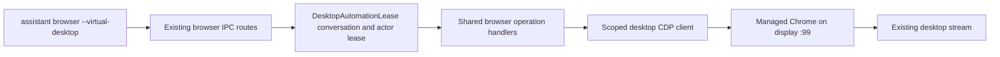

# Virtual desktop browser CLI

`assistant browser --virtual-desktop` uses the browser CLI's shared operation handlers against the Chrome process owned by `DesktopSessionManager`. It requires a platform-hosted container, the `assistant-desktop` flag, image-provided desktop components and an identified guardian conversation. Availability is checked before starting or reusing control and after asynchronous startup; losing readiness or the feature flag cancels active control. The first eligible browser command starts Chrome and executes its action without downloading or installing dependencies. Opening the picture-in-picture panel checks readiness and starts the viewer directly. The persistent profile remains `data/desktop-profile`.

The assistant Dockerfile installs desktop system packages, pinned WezTerm and pinned Google Chrome before Bun and application source. Architecture-specific SHA-256 checksums verify both downloads. Chrome is extracted to `/opt/google/chrome` without running package scripts or registering its repository. Missing components require replacing the assistant image. Runtime code only checks readiness. `POST /v1/desktop/setup` remains a read-only compatibility endpoint for released clients; current clients only use GET.

Automatic browser selection in platform-hosted web conversations uses the streamed Chrome when the desktop flag is enabled and the actor is an identified guardian. The macOS and Windows apps keep their existing browser selection and fallback behavior; they use the streamed desktop only with explicit `--virtual-desktop`. Their shared renderer reports a `web` transport, so selection also reads the active turn's frozen `clientOs`; it does not change transport identity or host capability checks. Explicit `--virtual-desktop`, `--browser-mode`, `--target-client-id` and active-tab requests override the default. Existing personal-browser sessions and tab pins remain on their selected browser. Tab commands use the same streamed-browser default as page commands. `--browser-mode local` selects assistant-side Playwright, not the user's Chrome.

The legacy `--desktop` option remains an alias. The deployment flag key `assistant-desktop`, API paths, sync tags and persistent profile path are unchanged for compatibility. The shared `isVirtualDesktopEnabled` gate rejects self-hosted assistants, including local Docker, for setup, streaming and control.

The Terminal dock launcher opens [WezTerm](https://wezterm.org/), with a plain dark native title bar, minimize/maximize/close controls, a new-tab button and split panes. Use Ctrl+Shift+T for a tab, Ctrl+Shift+D to split side by side, and Ctrl+Shift+E to split top and bottom. The desktop seeds an editable `data/desktop-panel/wezterm/wezterm.lua` configuration with software rendering and a dark theme. The managed launcher keeps its stable `data/desktop-panel/applications/xterm.desktop` path so existing dock pins remain valid. The image includes an exact-version, SHA-256-verified WezTerm package for Linux x64 or ARM64, plus its rendering libraries.

Chrome and WezTerm use explicit desktop window classes shared with their launcher entries. The desktop session bus and Plank share `XDG_DATA_HOME` so the D-Bus-activated window matcher can resolve the generated launchers and group running windows under their pinned icons.

Chrome and its dock launcher share the managed profile and loopback debug port. For Chrome reopened from the dock, the profile singleton lock identifies a candidate PID, validated against the installed executable, profile and loopback debug arguments. Discovery checks `/proc` socket ownership against that browser PID, refuses redirects and validates the returned browser WebSocket endpoint. The connection stays within the container. No CDP endpoint or token is exposed to the renderer.

The desktop client bypasses personal-browser discovery, extension reconnect waits and backend fallback. It reuses the existing AX snapshot, DOM element resolution, mouse, keyboard, extraction and credential-fill implementations. Operation-scoped clients borrow the lease's connection; disposing one does not release the lease. `detach`, `close`, turn completion, cancellation, errors and idle expiry release control. Turn completion clears the activity indicator immediately and queues browser cleanup before the next automation session; it leaves Chrome and the current page open for the user. Only `tabs close` closes a Chrome tab.

`assistant browser --virtual-desktop screenshot --output /tmp/desktop-page.jpg` captures a color page image through CDP `Page.captureScreenshot`. It excludes the browser toolbar and desktop dock. `snapshot` returns semantic page structure. Agents should use these interfaces and let the manager start the desktop, including when older memory notes describe manual Xvnc, `xdotool` or scratch XWD conversion scripts.

Tab IDs are ephemeral numeric aliases for this managed browser's CDP target IDs. They are never personal extension tab IDs. Initial attachment selects an existing HTTP(S) page or opens a blank tab. Use `tabs list` and `tabs select --tab-id <id>` to choose explicitly. Navigation, tab selection, document replacement and release clear the desktop snapshot map. Personal-browser snapshots use a separate namespace.

CDP mouse events use page viewport CSS coordinates. Before dispatching them, the client animates a purple arrow overlay to the same point. The overlay is excluded from accessibility and hit testing. It appears in the existing desktop stream and is removed on release. It does not move the OS pointer, appear in browser toolbar UI or visualize every programmatic DOM operation. Native dialogs and other applications use the computer-use skill or direct interaction in the expanded desktop. The picture-in-picture preview is view-only. Direct user interaction does not pause automation. For logins, the assistant uses saved credentials first and securely collects missing credentials with `assistant credentials prompt`, then fills the login form itself. Every CAPTCHA and bot-detection challenge, including sliders and press-and-hold checks, is handed to the user before the assistant attempts it. When human interaction is needed, the assistant calls `ask_question` with `desktopHelp: { message, doneLabel, skipLabel }` in the user's language. The tool releases held browser input and reserves the desktop before publishing a question with `presentation: "virtual_desktop"`. The live viewer mounts only in the attended Electron window, with browser focus as a fallback on older shells and the web, so conversations release it when focus changes. A busy viewer offers Reconnect if the previous connection has not finished closing. The compact card lives in the scrolling message transcript, with expandable instructions and a preview capped at 384 pixels wide. It hosts the shared live viewer, with Step In opening its full desktop modal and Done or Skip resolving the existing question response. The assistant retains an exclusive human-help reservation while waiting. Done resumes the same conversation's automation lease for its fresh snapshot; Skip, closure, timeout and cancellation release it. The browser idle timer does not expire a pending human-help reservation. The live preview connects after Show live preview or Step In, and reuses an already-open picture-in-picture viewer. Other devices receiving the card do not automatically open a stream. When the request resolves, its interactive viewer closes or returns to the read-only PiP session that was open before the request. Skip does not imply the obstacle was resolved. Older clients show the same request as a normal Done/Skip question, with model-localized labels retained in history. Channels without dynamic UI return guidance to continue in the app rather than waiting on an unusable card.

The client records key and mouse presses before dispatch. On release it opens a fresh bounded cleanup connection, attaches to the same live targets, releases uncertain held input and removes overlays. A failed cleanup preserves state and the automation slot for retry. Turn-triggered cancellation retries cleanup automatically until it succeeds or ownership changes. Dispatched actions are never automatically retried. Closed targets need no input cleanup. Browser-process loss disposes the client, and later requests discover the replacement process.

`--use-active-tab` and personal browser targeting are rejected with `--virtual-desktop`. Download waiting is unsupported. Browser operations are bounded to two minutes and share the desktop lease's action budget and idle expiry.

Validation: focused client tests exercise shared snapshot/click behavior, namespace isolation, stale references, target changes, cancellation and uncertain-input cleanup. Lease tests cover browser ownership, cancellation and cleanup independently of native input. The Linux smoke script exercises real Chrome, the CLI and visible pointer feedback. For image replacement coverage, run `scripts/smoke-desktop-browser-cli.ts` in two disposable containers with the same workspace volume and networking disabled from first use. Both runs require baked components to be ready before navigation and assert that no installation progress is emitted. Each run needs a temporary `ASSISTANT_IPC_SOCKET_DIR`.

The desktop header icon pulses in the assistant's avatar accent color while a browser automation lease is active, including between browser commands. It shares the progress indicator's accent and neutral fallback. Reduced-motion clients show a solid accent. Setup status exposes the optional `automationActive` field; `desktop_activity_changed` events refresh it on acquisition and cancellation or release. The indicator reads status, and reconnects refetch the current lease state.

Desktop streaming checks the current in-memory gateway feature flags during connection startup. Once connected, frame and drain callbacks do not check feature flags or load workspace configuration. Turning the flag off prevents new connections; an existing stream continues until it closes or the desktop stops.

## Computer use on the same desktop

The existing `computer-use` skill defaults to this desktop in platform-hosted
web conversations. Native desktop clients, including the Mac app connected to a
platform-hosted assistant, keep the connected-computer default and require
`target: "assistant-desktop"` to select the virtual desktop explicitly.
Non-platform assistants keep their connected-computer behavior.

Explicit `target: "connected-computer"` or `target_client_id` selects a connected
computer on every client. The selected target never falls back to another
computer when unavailable. The virtual desktop uses a fixed 1440x810 display.
Observations return full-screen screenshots and mouse actions use the same
screen coordinates.
Viewer resizing scales the canvas locally without changing the desktop layout.

Observe first and pass the returned `observation_id` with each native action.
Browser commands, user handoff, errors, and interruption require a fresh
observation before returning to native input. Browser commands and computer use
share session ownership, cancellation, and the user-help reservation. Use
browser commands for page-level operations and computer use for desktop UI.

## File explorer

Open **Files**, between Chrome and Terminal in the virtual desktop dock, to browse the assistant workspace in
Thunar, with a Workspace sidebar shortcut and a dark theme. It supports tabs,
split views, search, hidden files, drag and drop,
copy/paste, bulk renaming, and file properties. GVfs provides Trash support and
Tumbler provides thumbnails. Use Ctrl+L to enter a path, Ctrl+T for a new tab,
Ctrl+H to toggle hidden files, and F3 for split view.

Files manages the assistant's files. Files on your personal computer must first
be uploaded or otherwise copied into the assistant workspace. Existing desktops
receive the Files dock shortcut once during upgrade; removing or rearranging it
is preserved across restarts.
