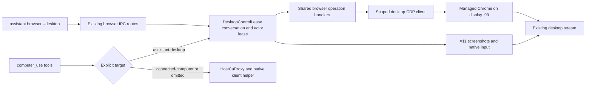

# Streamed desktop browser CLI

`assistant browser --desktop` uses the browser CLI's shared operation handlers against the Chrome process owned by `DesktopSessionManager`. It requires the `assistant-desktop` flag, completed automatic desktop installation and an identified guardian conversation. Availability is checked before starting or reusing control and after asynchronous startup; loss of the flag or installation readiness cancels active control. Browser commands do not trigger installation. The persistent profile remains `data/desktop-profile`; no data migration or extension installation is required.

Chrome and its dock launcher share the managed profile and loopback debug port. Discovery checks `/proc` socket ownership against the managed browser PID, refuses redirects and validates the returned browser WebSocket endpoint. The connection stays within the container. No CDP endpoint or token is exposed to the renderer.

The desktop client bypasses personal-browser discovery, extension reconnect waits and backend fallback. It reuses the existing AX snapshot, DOM element resolution, mouse, keyboard, extraction and credential-fill implementations. Operation-scoped clients borrow the lease's connection; disposing one does not release the lease. `detach`, `close`, takeover, cancellation, errors and idle expiry release control. Only `tabs close` closes a Chrome tab.

`assistant browser --desktop screenshot --output /tmp/desktop-page.jpg` captures a color page image through CDP `Page.captureScreenshot`. It excludes the browser toolbar and desktop dock. `snapshot` returns semantic page structure; `computer_use_observe` with `target: "assistant-desktop"` captures the whole desktop through the supported X11 decoder. Agents should use these interfaces and let the manager start the desktop, including when older memory notes describe manual Xvnc, `xdotool` or scratch XWD conversion scripts.

Tab IDs are ephemeral numeric aliases for this managed browser's CDP target IDs. They are never personal extension tab IDs. Initial attachment selects an existing HTTP(S) page or opens a blank tab. Use `tabs list` and `tabs select --tab-id <id>` to choose explicitly. Navigation, tab selection, document replacement and release clear the desktop snapshot map. Personal-browser snapshots use a separate namespace. Switching between CLI browser actions and native desktop input invalidates the other interface's observations.

CDP mouse events use page viewport CSS coordinates. Before dispatching them, the client animates a purple arrow overlay to the same point. The overlay is excluded from accessibility and hit testing. It appears in the existing desktop stream and is removed on release. It does not move the OS pointer, appear in browser toolbar UI or visualize every programmatic DOM operation. Native dialogs and other applications use X11 input through the `computer-use` skill with `target: "assistant-desktop"`.

The client records key and mouse presses before dispatch. On release it opens a fresh bounded cleanup connection, attaches to the same live targets, releases uncertain held input and removes overlays. A failed cleanup preserves state and the automation slot for retry. Dispatched actions are never automatically retried. Closed targets need no input cleanup. Browser-process loss disposes the client, and later requests discover the replacement process.

`--use-active-tab` and personal browser targeting are rejected with `--desktop`. Download waiting is unsupported. Browser operations are bounded to two minutes and share the desktop lease's action budget and idle expiry.

Validation: focused client tests exercise shared snapshot/click behavior, namespace isolation, stale references, target changes, cancellation and uncertain-input cleanup. Lease tests cover browser ownership and takeover independently of native input. Computer-control tests cover ownership across both interfaces. The Linux smoke script exercises real Chrome, the CLI and visible pointer feedback.

The `computer-use` skill owns both native targets and their shared action names.
The target dispatcher keeps omitted targets on the connected computer; it never
falls back between machines. Only this bundled skill receives per-invocation
host/sandbox policy resolution. Host identity and access checks stay on the host
path; the assistant desktop adapter requires the desktop flag, completed setup,
and the guardian's shared desktop lease. The local adapter normalizes shared
click/key arguments to X11, rejects unsupported accessibility and platform
features, and requires fresh observation IDs for input. Host observations retain
their accessibility tree and screenshot contract; local observations report
pixel-only capabilities and return PNG images through the same tool result type.
