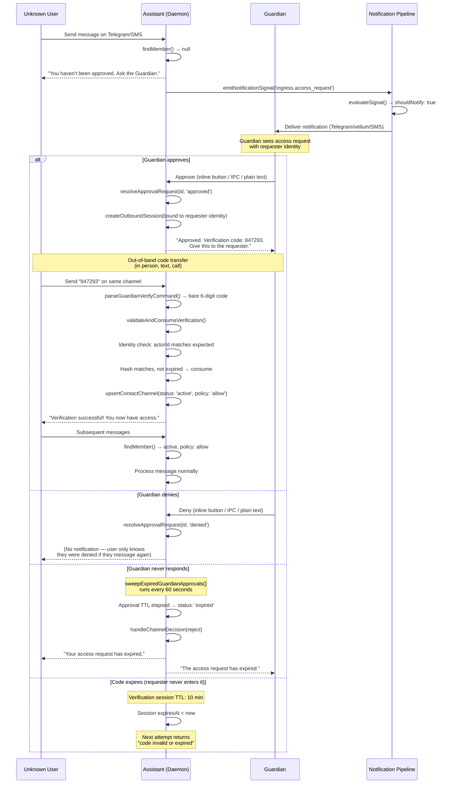

# Trusted Contact Access Flow

Design doc defining how unknown users gain access to a Vellum assistant via channel-mediated trusted contact onboarding.

## Roles

| Role              | Description                                                                                                                                                                                                    |
| ----------------- | -------------------------------------------------------------------------------------------------------------------------------------------------------------------------------------------------------------- |
| `guardian`        | The verified owner/administrator of the assistant on a given channel. Has a record in the `contacts` table with `role: 'guardian'` and an active `contact_channels` entry. Approves or denies access requests. |
| `trusted_contact` | An external user who has completed the verification flow and holds a `contact_channels` record with `status: 'active'` and `policy: 'allow'`.                                                                  |
| `assistant`       | The Vellum assistant daemon. Mediates the flow, enforces ACL, generates verification codes, and activates trusted contacts upon successful verification.                                                       |

## User Journey

1. **Unknown user messages the assistant** on Telegram (or SMS, or any channel).
2. **Assistant rejects the message** via the ingress ACL in `inbound-message-handler.ts`. The user has no matching `contact_channels` record, so the handler replies: _"Hmm looks like you don't have access to talk to me. I'll let them know you tried talking to me and get back to you."_ and returns `{ denied: true, reason: 'not_a_member' }`.
3. **Notification pipeline alerts the guardian.** The rejection triggers `notifyGuardianOfAccessRequest()` which creates a canonical access request and calls `emitNotificationSignal()` with `sourceEventName: 'ingress.access_request'`. The notification routes through the decision engine to all connected channels (vellum macOS app, Telegram, etc.). The guardian sees who is requesting access, including a request code for approve/reject and an `open invite flow` option to start the Trusted Contacts invite flow.

   **Access-request copy contract:** Every guardian-facing access-request notification must contain:
   1. **Requester context** — best-available identity (display name, username, external ID, source channel), sanitized to prevent control-character injection.
   2. **Request-code decision directive** — e.g., `Reply "A1B2C3 approve" to grant access or "A1B2C3 reject" to deny.`
   3. **Invite directive** — the exact phrase `Reply "open invite flow" to start Trusted Contacts invite flow.`
   4. **Revoked-member warning** (when applicable) — `Note: this user was previously revoked.`

   Model-generated phrasing is permitted for the surrounding copy, but a post-generation enforcement step in the decision engine validates that all required directive elements are present. If any are missing, the full deterministic contract text is appended. This ensures the guardian can always parse and act on the notification regardless of LLM output quality.

   **Guardian binding resolution for access requests** uses a fallback strategy:
   1. Source-channel active binding first (e.g., Telegram binding for a Telegram access request).
   2. Any active binding for the assistant on another channel (deterministic: most recently verified first, then alphabetical by channel).
   3. No guardian identity — the notification pipeline delivers via trusted/vellum channels even when no channel binding exists.

   This ensures unknown inbound access attempts always trigger guardian notification, even when the requester's source channel has no guardian binding.

4. **Guardian approves the request.** The guardian responds to the notification (via Telegram inline button, macOS app, or IPC). On approval, the assistant creates a verification session via `createOutboundSession()` and generates a 6-digit verification code.
5. **Guardian receives the verification code.** The assistant delivers the code to the guardian's verified channel (Telegram chat, SMS, etc.).
6. **Guardian gives the code to the requester out-of-band** (in person, text message, phone call, etc.). This out-of-band transfer is the trust anchor: it proves the requester has a real-world relationship with the guardian.
7. **Requester enters the code** back to the assistant on the same channel. The inbound message handler intercepts bare 6-digit codes when a pending verification session exists for that channel.
8. **Assistant verifies the code and activates the user.** `validateAndConsumeVerification()` hashes the code, matches it against the pending session, verifies identity binding (the code must come from the expected channel identity), consumes the session, and calls `upsertContactChannel()` with `status: 'active'` and `policy: 'allow'`.
9. **All subsequent messages are accepted normally.** The ingress ACL finds an active member record and allows the message through.

## Lifecycle States

```
requested -> pending_guardian -> verification_pending -> active | denied | expired
```

| State                  | Description                                                                                                        | Store representation                                                                                                                                                                             |
| ---------------------- | ------------------------------------------------------------------------------------------------------------------ | ------------------------------------------------------------------------------------------------------------------------------------------------------------------------------------------------ |
| `requested`            | Unknown user messaged the assistant and was rejected. The system records the access attempt.                       | No member record exists. The rejection is logged in `channel_inbound_events`. A notification signal is emitted via `emitNotificationSignal()`.                                                   |
| `pending_guardian`     | The guardian has been notified and a decision is pending.                                                          | A `channel_guardian_approval_requests` record exists with `status: 'pending'`, `toolName: 'ingress_access_request'`.                                                                             |
| `verification_pending` | The guardian approved. A verification session is active with a 6-digit code waiting for the requester to enter.    | `channel_verification_sessions` record with `status: 'awaiting_response'`, identity-bound to the requester's expected channel identity. The approval request is updated to `status: 'approved'`. |
| `active`               | The requester entered the correct code. They are now a trusted contact.                                            | `contact_channels` record with `status: 'active'`, `policy: 'allow'`. The verification session is `status: 'consumed'`.                                                                          |
| `denied`               | The guardian explicitly denied the request.                                                                        | The approval request has `status: 'denied'`. No member record is created (or if one existed, it remains unchanged).                                                                              |
| `expired`              | The guardian never responded (approval TTL elapsed) or the requester never entered the code (session TTL elapsed). | Approval request: `status: 'expired'` (set by `sweepExpiredGuardianApprovals()`). Verification session: expires naturally when `expiresAt < Date.now()`.                                         |

## Identity Binding Rules

Identity binding ensures the verification code can only be consumed by the intended recipient on the intended channel. The binding fields are set on the `channel_verification_sessions` record when the session is created.

| Channel  | Identity fields                                                                  | Binding behavior                                                                                                                                                                                                                          |
| -------- | -------------------------------------------------------------------------------- | ----------------------------------------------------------------------------------------------------------------------------------------------------------------------------------------------------------------------------------------- |
| Telegram | `expectedExternalUserId` = Telegram user ID, `expectedChatId` = Telegram chat ID | Both are set when the guardian provides the requester's Telegram identity (from the original rejected message metadata). The `identityBindingStatus` is `'bound'`. Verification requires `actorExternalUserId` or `actorChatId` to match. |
| SMS      | `expectedPhoneE164` = phone number in E.164 format                               | Set from the requester's phone number. Verification requires `actorExternalUserId` to match the expected phone.                                                                                                                           |
| Voice    | `expectedPhoneE164` = phone number in E.164 format                               | Same as SMS: phone-based identity binding.                                                                                                                                                                                                |
| HTTP API | `expectedExternalUserId` = API caller identity                                   | Bound to whatever external user ID the API client provides.                                                                                                                                                                               |

**Anti-oracle invariant:** When identity verification fails, the error message is identical to the "invalid or expired code" message. This prevents attackers from distinguishing between a wrong code and a wrong identity, which would leak information about which identities have pending sessions.

## Mapping to Existing Stores

### Stage: `requested` (unknown user rejected)

- **No new records created.** The rejection is a stateless ACL check in `inbound-message-handler.ts` (line ~260: `findMember()` returns null, handler replies with rejection text).
- The inbound event is recorded in `channel_inbound_events` via `channelDeliveryStore.recordInbound()`.
- A notification signal is emitted via `emitNotificationSignal()`, persisted in `notification_events`.

### Stage: `pending_guardian` (guardian notified, awaiting decision)

| Store                       | Table                                | Record                                                                                                                                                                                                                                                                                   |
| --------------------------- | ------------------------------------ | ---------------------------------------------------------------------------------------------------------------------------------------------------------------------------------------------------------------------------------------------------------------------------------------- |
| `channel-guardian-store.ts` | `channel_guardian_approval_requests` | `status: 'pending'`, `toolName: 'ingress_access_request'`, `requesterExternalUserId`, `requesterChatId`, `guardianExternalUserId`, `guardianChatId` (resolved from the `contacts`/`contact_channels` tables where `role = 'guardian'`), `expiresAt` (GUARDIAN_APPROVAL_TTL_MS from now). |
| `notification_events`       | `notification_events`                | Event with `sourceEventName: 'ingress.access_request'`, links to the conversation.                                                                                                                                                                                                       |
| `notification_decisions`    | `notification_decisions`             | Decision engine output: which channels to notify, confidence, reasoning.                                                                                                                                                                                                                 |
| `notification_deliveries`   | `notification_deliveries`            | Per-channel delivery records (Telegram, vellum, etc.).                                                                                                                                                                                                                                   |

### Stage: `verification_pending` (guardian approved, code issued)

| Store                       | Table                                | Record                                                                                                                                                                                                                                                                              |
| --------------------------- | ------------------------------------ | ----------------------------------------------------------------------------------------------------------------------------------------------------------------------------------------------------------------------------------------------------------------------------------- |
| `channel-guardian-store.ts` | `channel_guardian_approval_requests` | Updated to `status: 'approved'`, `decidedByExternalUserId` set.                                                                                                                                                                                                                     |
| `channel-guardian-store.ts` | `channel_verification_sessions`      | New record: `status: 'awaiting_response'`, `identityBindingStatus: 'bound'`, `expectedExternalUserId`/`expectedChatId`/`expectedPhoneE164` set to the requester's identity, `challengeHash` = SHA-256 of the 6-digit code, `expiresAt` = 10 minutes from creation, `codeDigits: 6`. |

### Stage: `active` (code verified, trusted contact created)

| Store                       | Table                           | Record                                                                                                                                                                                                      |
| --------------------------- | ------------------------------- | ----------------------------------------------------------------------------------------------------------------------------------------------------------------------------------------------------------- |
| `contacts-write.ts`         | `contacts` / `contact_channels` | Upserted via `upsertContactChannel()`: creates a contact record and a `contact_channels` entry with `status: 'active'`, `policy: 'allow'`, channel type, `externalUserId`, `externalChatId`, `displayName`. |
| `channel-guardian-store.ts` | `channel_verification_sessions` | Updated to `status: 'consumed'`, `consumedByExternalUserId`, `consumedByChatId` set.                                                                                                                        |
| `channel-guardian-store.ts` | `channel_guardian_rate_limits`  | Reset via `resetRateLimit()` on successful verification.                                                                                                                                                    |

### Stage: `denied` (guardian rejected)

| Store                       | Table                                | Record                                                        |
| --------------------------- | ------------------------------------ | ------------------------------------------------------------- |
| `channel-guardian-store.ts` | `channel_guardian_approval_requests` | Updated to `status: 'denied'`, `decidedByExternalUserId` set. |

No member record is created. No verification session is created.

### Stage: `expired`

| Store                       | Table                                | Record                                                                                          |
| --------------------------- | ------------------------------------ | ----------------------------------------------------------------------------------------------- |
| `channel-guardian-store.ts` | `channel_guardian_approval_requests` | Updated to `status: 'expired'` by `sweepExpiredGuardianApprovals()` (runs every 60s).           |
| `channel-guardian-store.ts` | `channel_verification_sessions`      | Expires naturally: `expiresAt < Date.now()` makes it invisible to `findPendingSessionByHash()`. |

### Invites (alternative path)

The `assistant_ingress_invites` table supports a parallel invite-based onboarding path. An invite carries a SHA-256 hashed token and can be redeemed via `redeemInvite()`, which atomically creates an active contact channel record. This path is distinct from the trusted contact flow but serves the same end state: an active `contact_channels` entry with `status: 'active'` and `policy: 'allow'`.

| Table                       | Purpose in trusted contact flow                                                                                                                                                      |
| --------------------------- | ------------------------------------------------------------------------------------------------------------------------------------------------------------------------------------ |
| `assistant_ingress_invites` | Not used in the guardian-mediated flow. Available as an alternative for direct invite links (e.g., guardian shares a URL instead of going through the approval + verification flow). |

### Voice In-Call Guardian Approval (friend-initiated)

Voice calls have a dedicated in-call guardian approval flow that differs from the text-channel flow. Since the caller is actively on the line, the voice flow captures the caller's name, creates a canonical access request, and holds the call while awaiting the guardian's decision.

**Flow:**

1. Unknown caller dials in. `relay-server.ts` resolves trust — caller is `unknown`, no pending challenge, no active invite.
2. Relay enters `awaiting_name` state and prompts the caller for their name (with a timeout).
3. On name capture, `notifyGuardianOfAccessRequest` creates a canonical guardian request (`kind: 'access_request'`) and notifies the guardian.
4. Relay transitions to `awaiting_guardian_decision` and polls `canonical_guardian_requests` for status changes.
5. Guardian approves or denies via any channel. All decisions route through `applyCanonicalGuardianDecision`.
6. On approval: the `access_request` resolver directly activates the caller as a trusted contact (`upsertContactChannel` with `status: 'active'`, `policy: 'allow'`) — no verification session needed since the caller is already authenticated by their phone number.
7. On denial or timeout: the caller hears a denial message and the call ends.

**Key difference from text-channel flow:** Voice approvals skip the verification session step because the caller's phone identity is already known from the active call. Text-channel approvals still mint a 6-digit verification code for out-of-band identity confirmation.

| Store                         | Table                           | Record                                                                                        |
| ----------------------------- | ------------------------------- | --------------------------------------------------------------------------------------------- |
| `canonical-guardian-store.ts` | `canonical_guardian_requests`   | `kind: 'access_request'`, `status: 'pending'` -> `'approved'` or `'denied'`                   |
| `contacts-write.ts`           | `contacts` / `contact_channels` | On approval: upserted via `upsertContactChannel()` with `status: 'active'`, `policy: 'allow'` |

## Sequence Diagram



## Failure and Stale Paths

### Guardian never responds

- The `sweepExpiredGuardianApprovals()` timer runs every 60 seconds and finds approval requests where `expiresAt <= Date.now()` and `status === 'pending'`.
- It auto-denies the underlying request via `handleChannelDecision()` and notifies both the requester and guardian.
- The approval request is updated to `status: 'expired'`.

### Verification code expires

- Verification sessions have a 10-minute TTL (`CHALLENGE_TTL_MS`).
- After expiry, `findPendingSessionByHash()` filters by `expiresAt > now`, so the code silently becomes invalid.
- The requester receives the generic "code is invalid or has expired" message.
- The guardian can re-initiate the flow by approving again, which creates a new session (auto-revoking any prior pending sessions).

### Wrong code entered

- `validateAndConsumeVerification()` hashes the input and looks for a matching session. No match returns a generic failure.
- The invalid attempt is recorded via `recordInvalidAttempt()` with a sliding window (`RATE_LIMIT_WINDOW_MS = 15 min`).
- After `RATE_LIMIT_MAX_ATTEMPTS = 5` failures within the window, the actor is locked out for `RATE_LIMIT_LOCKOUT_MS = 30 min`.
- The lockout message is identical to the "invalid code" message (anti-oracle).

### Identity mismatch

- If the code is entered from a different channel identity than expected (e.g., a different Telegram user ID), the identity check in `validateAndConsumeVerification()` fails.
- The error message is identical to "invalid or expired" to prevent identity oracle attacks.
- The attempt counts toward the rate limit.

### Duplicate access requests

- If the unknown user messages the assistant multiple times before the guardian responds, each message hits the ACL rejection path independently.
- The notification pipeline's deduplication (`dedupeKey` on `notification_events`) prevents flooding the guardian with duplicate notifications.
- Only one approval request should be active at a time per (channel, requester) pair.

### Requester already has a member record in non-active state

- `revoked`: The ACL check in `inbound-message-handler.ts` finds the member but `status !== 'active'`, returning `{ denied: true, reason: 'member_revoked' }`. The trusted contact flow can be re-initiated by the guardian.
- `blocked`: Same rejection path, returning `{ denied: true, reason: 'member_blocked' }`. Blocked members cannot re-enter the flow without the guardian explicitly unblocking them first.
- `pending`: Same rejection path. The member exists but has not completed verification.

### Guardian revokes a trusted contact

- `revokeMember()` sets `status: 'revoked'` and optional `revokedReason`.
- Subsequent messages from the revoked user are rejected at the ACL layer.
- The user can be re-onboarded by going through the full flow again.

## Replay Protection

### Code reuse prevention

- Each verification session creates a single `channel_verification_sessions` record.
- `consumeSession()` atomically sets `status: 'consumed'`, making the code permanently unusable.
- `findPendingSessionByHash()` only matches sessions with `status IN ('pending', 'pending_bootstrap', 'awaiting_response')`, so consumed sessions are invisible.

### Session supersession

- `createVerificationSession()` auto-revokes all prior `pending`/`pending_bootstrap`/`awaiting_response` sessions for the same `(assistantId, channel)` before creating a new one.
- This ensures only one session is valid at any time, preventing replay of older codes.

### Rate limiting

- Per-actor, per-channel sliding window rate limiting via `channel_guardian_rate_limits`.
- Individual attempt timestamps are stored (not just a counter) for true sliding window behavior.
- After `maxAttempts` (5) within `windowMs` (15 min), the actor is locked out for `lockoutMs` (30 min).
- Successful verification resets the rate limit counter via `resetRateLimit()`.

### Brute-force resistance

- Identity-bound sessions use 6-digit numeric codes (10^6 = 1M possibilities), which is acceptable because the identity binding provides a second factor: the attacker must also control the correct channel identity.
- Unbound sessions (legacy inbound challenges) use 32-byte hex secrets (~2^128 entropy), making enumeration infeasible.
- The 10-minute TTL limits the attack window.
- Rate limiting (5 attempts / 15 min, 30 min lockout) further constrains brute-force attempts.

### Deduplication of approval requests

- The notification pipeline uses `dedupeKey` to prevent duplicate notification events.
- Approval requests should include a deduplication key derived from `(channel, requesterExternalUserId)` to prevent multiple concurrent approval requests for the same requester.

### Anti-oracle design

- All failure messages (wrong code, expired code, identity mismatch, rate-limited) return the same generic text: _"The verification code is invalid or has expired."_
- This prevents attackers from distinguishing between failure modes, which could leak information about valid codes, valid identities, or rate-limit state.
