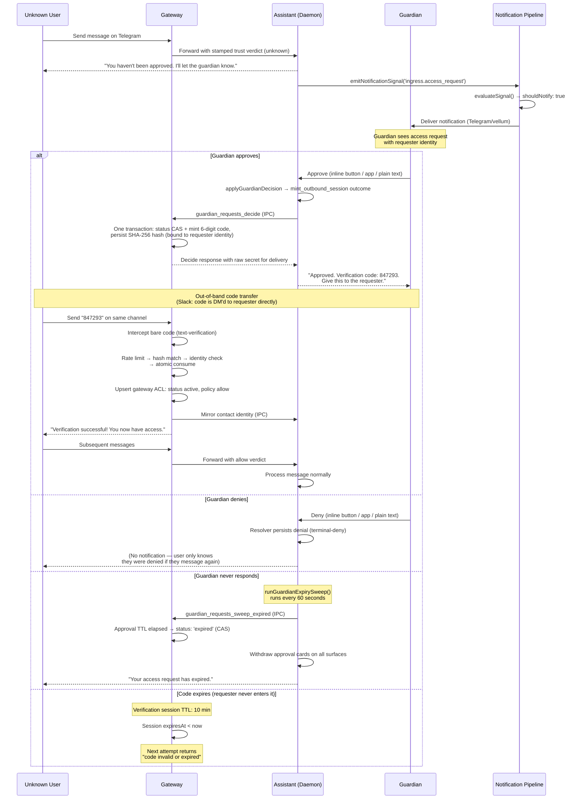

# Trusted Contact Access Flow

Design doc defining how unknown users gain access to a Vellum assistant via channel-mediated trusted contact onboarding.

## Roles

| Role              | Description                                                                                                                                                                                                                                                                                                                                  |
| ----------------- | -------------------------------------------------------------------------------------------------------------------------------------------------------------------------------------------------------------------------------------------------------------------------------------------------------------------------------------------- |
| `guardian`        | The verified owner/administrator of the assistant on a given channel. Has a record in the gateway DB `contacts` table with `role: 'guardian'` and an active `contact_channels` entry. Approves or denies access requests.                                                                                                                    |
| `trusted_contact` | An external user who has completed the verification flow and holds a gateway `contact_channels` record with `status: 'active'` and `policy: 'allow'`.                                                                                                                                                                                        |
| `gateway`         | The ACL and verification engine. Owns the contact ACL, guardian requests + their delivery records, verification sessions, rate limits, secret minting, code interception, and the validate+consume decision. Commits every guardian decision (status CAS + ACL outcome) in one transaction. Stamps a trust verdict on every inbound message. |
| `assistant`       | The Vellum assistant daemon. Orchestrates the approval workflow around the gateway-owned requests: guardian notification, message composition, channel delivery, and post-decision side effects (cards, notices, grant minting). It never mints or validates verification secrets.                                                           |

## Data Ownership

| Store                                                                                                                                                                                                                                        | Database     |
| -------------------------------------------------------------------------------------------------------------------------------------------------------------------------------------------------------------------------------------------- | ------------ |
| `contacts` / `contact_channels` ACL (role, status, policy, verifiedAt/Via, revoked/blocked reasons), `guardian_requests` / `guardian_request_deliveries`, `ingress_invites`, `channel_verification_sessions`, `channel_guardian_rate_limits` | Gateway DB   |
| Notification pipeline tables, `channel_inbound_events`, contact info + identity mirror (notes, contactType, mirror `contacts`/`contact_channels` without ACL columns)                                                                        | Assistant DB |

## User Journey

1. **Unknown user messages the assistant** on Telegram (or any channel).
2. **The message is denied at the ingress ACL.** The gateway resolves the actor against its ACL DB and stamps a trust verdict onto the inbound metadata; the daemon's ACL stage (`runtime/routes/inbound-stages/acl-enforcement.ts`) consumes that verdict, finds no active member, replies _"Hmm looks like you don't have access to talk to me. I'll let &lt;guardian&gt; know you tried talking to me and get back to you."_ and returns `{ denied: true, reason: 'not_a_member' }`.
3. **Notification pipeline alerts the guardian.** The denial triggers `notifyGuardianOfAccessRequest()` (`runtime/access-request-helper.ts`), which creates an access request in the gateway (`guardian_requests`, `kind: 'access_request'`, `toolName: 'ingress_access_request'`, via the `channels/gateway-guardian-requests.ts` client) and calls `emitNotificationSignal()` with `sourceEventName: 'ingress.access_request'`. The notification routes through the decision engine to the guardian's surfaces (vellum app, Telegram, Slack, etc.). The guardian sees who is requesting access, including a request code for approve/reject and an `open invite flow` option to start the Trusted Contacts invite flow.

   **Access-request copy contract:** Every guardian-facing access-request notification must contain:
   1. **Requester context** — best-available identity (display name, username, external ID, source channel), sanitized to prevent control-character injection.
   2. **Request-code decision directive** — e.g., `Reply "A1B2C3 approve" to grant access or "A1B2C3 reject" to deny.`
   3. **Invite directive** — the exact phrase `Reply "open invite flow" to start Trusted Contacts invite flow.`
   4. **Revoked-member warning** (when applicable) — `Note: this user was previously revoked.`

   Model-generated phrasing is permitted for the surrounding copy, but a post-generation enforcement step in the decision engine validates that all required directive elements are present. If any are missing, the full deterministic contract text is appended. This ensures the guardian can always parse and act on the notification regardless of LLM output quality.

   **Guardian identity resolution** is anchored on the assistant's vellum principal (`resolveAnchoredGuardian`), so access requests cannot bind to stale or cross-assistant contacts:
   1. A source-channel guardian binding (from the gateway contact list) that matches the vellum anchor principal.
   2. The vellum anchor itself when no matching source-channel binding exists.
   3. No guardian identity — the notification pipeline still delivers via trusted/vellum channels.

   This ensures unknown inbound access attempts always trigger guardian notification, even when the requester's source channel has no guardian binding.

4. **Guardian decides.** All decisions route through the guardian decision primitive (`applyGuardianDecision`, `approvals/guardian-decision-primitive.ts`) and commit via the gateway's `guardian_requests_decide` IPC op: the status CAS and the decision's ACL outcome execute in ONE gateway transaction, so an `approved` request can never exist without its ACL write. The introduction card supports four outcomes: **approve** (start the verification handshake), **trust** (activate directly, no code — used for workspace-vouched identities), **deny** (persist a terminal denial), and **block**.
5. **On approval the gateway mints a verification session.** The decide op carries a `mint_outbound_session` outcome; inside the decide transaction the gateway (`gateway/src/verification/session-service.ts`) generates a 6-digit code, persists only its SHA-256 hash in `channel_verification_sessions` (identity-bound to the requester, `verificationPurpose: 'trusted_contact'`), and returns the raw secret to the daemon in the decide response for delivery.
6. **The code is delivered.** The daemon delivers the code to the guardian's verified channel (ephemeral + DM on Slack shared channels so other members never see it). On Slack the code is also DM'd straight to the requester; on other channels the guardian relays it out-of-band (in person, text message, phone call). That out-of-band transfer is the trust anchor: it proves the requester has a real-world relationship with the guardian.
7. **Requester enters the code** back to the assistant on the same channel. The **gateway** intercepts bare verification codes at ingress (`gateway/src/verification/text-verification.ts`) whenever an interceptable session exists for that channel — the daemon never sees verification code messages.
8. **Gateway verifies the code and activates the user.** `validateAndConsumeSession()` checks the rate limit, hashes the code, matches it against a live session, verifies identity binding, atomically consumes the session, then applies the trusted-contact side effects: `applyTrustedContactSideEffects()` upserts the verified channel into the gateway ACL with `status: 'active'`, `policy: 'allow'` and mirrors the contact identity to the assistant DB. A blocked/revoked authoritative gateway row rejects the verification even when the code matched. The gateway delivers the deterministic success reply.
9. **All subsequent messages are accepted normally.** The gateway stamps an allow verdict and the daemon processes the message.

## Lifecycle States

```
requested -> pending_guardian -> verification_pending -> active | denied | expired
```

| State                  | Description                                                                                                        | Store representation                                                                                                                                                     |
| ---------------------- | ------------------------------------------------------------------------------------------------------------------ | ------------------------------------------------------------------------------------------------------------------------------------------------------------------------ |
| `requested`            | Unknown user messaged the assistant and was denied. The system records the access attempt.                         | No member record exists. The inbound is logged in `channel_inbound_events` (assistant DB). A notification signal is emitted via `emitNotificationSignal()`.              |
| `pending_guardian`     | The guardian has been notified and a decision is pending.                                                          | A `guardian_requests` record (gateway DB) with `status: 'pending'`, `kind: 'access_request'`.                                                                            |
| `verification_pending` | The guardian approved. A verification session is active with a 6-digit code waiting for the requester to enter.    | Gateway `channel_verification_sessions` record with `status: 'awaiting_response'`, identity-bound to the requester. The guardian request is `status: 'approved'`.        |
| `active`               | The requester entered the correct code (or the guardian chose direct trust). They are now a trusted contact.       | Gateway `contact_channels` record with `status: 'active'`, `policy: 'allow'`; identity mirrored to the assistant DB. The verification session is `status: 'consumed'`.   |
| `denied`               | The guardian explicitly denied the request.                                                                        | The guardian request has `status: 'denied'`. The sender is persisted as an unverified contact and later inbound is suppressed (terminal-deny).                           |
| `expired`              | The guardian never responded (approval TTL elapsed) or the requester never entered the code (session TTL elapsed). | Guardian request: `status: 'expired'` (CAS-expired by the gateway via the daemon's expiry sweep). Verification session: expires naturally when `expiresAt < Date.now()`. |

## Identity Binding Rules

Identity binding ensures the verification code can only be consumed by the intended recipient on the intended channel. The binding fields are set on the gateway `channel_verification_sessions` record when the session is created; the check itself is `checkIdentityMatch` (`gateway/src/verification/identity-match.ts`).

| Channel   | Identity fields                                                                  | Binding behavior                                                                                                                                                                                                           |
| --------- | -------------------------------------------------------------------------------- | -------------------------------------------------------------------------------------------------------------------------------------------------------------------------------------------------------------------------- |
| Telegram  | `expectedExternalUserId` = Telegram user ID, `expectedChatId` = Telegram chat ID | Both are taken from the original denied message's metadata. The `identityBindingStatus` is `'bound'`. Verification requires the actor's user ID or chat ID to match (user ID required when both are set on a shared chat). |
| Voice     | `expectedPhoneE164` = phone number in E.164 format                               | Phone-based identity binding. Verification requires the caller's number to match the expected phone.                                                                                                                       |
| Bootstrap | none yet (`identityBindingStatus: 'pending_bootstrap'`)                          | Unbound deep-link sessions use a 32-byte hex token instead of a numeric code; the identity is bound when the token is redeemed (`verification_sessions_bind_identity`).                                                    |

**Anti-oracle invariant:** When identity verification fails, the error message is identical to the "invalid or expired code" message. This prevents attackers from distinguishing between a wrong code and a wrong identity, which would leak information about which identities have pending sessions.

## Mapping to Existing Stores

### Stage: `requested` (unknown user denied)

- **No new member records created.** The gateway stamps a trust verdict on the inbound; the daemon ACL stage (`acl-enforcement.ts`) consumes it and replies with the denial text.
- The inbound event is recorded in `channel_inbound_events` (assistant DB) via `recordInbound()`.
- A notification signal is emitted via `emitNotificationSignal()`, persisted in `notification_events`.

### Stage: `pending_guardian` (guardian notified, awaiting decision)

| Store                                                                                                 | Table                                      | Record                                                                                                                                                                                                                                                                   |
| ----------------------------------------------------------------------------------------------------- | ------------------------------------------ | ------------------------------------------------------------------------------------------------------------------------------------------------------------------------------------------------------------------------------------------------------------------------ |
| gateway `guardian-request-store.ts` (via the daemon's `channels/gateway-guardian-requests.ts` client) | `guardian_requests` (gateway DB)           | `status: 'pending'`, `kind: 'access_request'`, `toolName: 'ingress_access_request'`, `requesterExternalUserId`, `requesterChatId`, `guardianExternalUserId`/`guardianPrincipalId` (anchored resolution), `requestCode`, `expiresAt` (GUARDIAN_APPROVAL_TTL_MS from now). |
| `guardian-delivery-recorder.ts` (single write sink, relays to the gateway)                            | `guardian_request_deliveries` (gateway DB) | Per-surface approval-card delivery records (vellum, Telegram, Slack).                                                                                                                                                                                                    |
| notification pipeline (assistant DB)                                                                  | `notification_events`                      | Event with `sourceEventName: 'ingress.access_request'`, deduped via `dedupeKey`.                                                                                                                                                                                         |
| notification pipeline (assistant DB)                                                                  | `notification_decisions`                   | Decision engine output: `shouldNotify`, `selectedChannels`, `confidence`, reasoning.                                                                                                                                                                                     |
| notification pipeline (assistant DB)                                                                  | `notification_deliveries`                  | Per-channel delivery records, linked via `notificationDecisionId`.                                                                                                                                                                                                       |

### Stage: `verification_pending` (guardian approved, code issued)

| Store                                                  | Table                           | Record                                                                                                                                                                                                                                                                                                                        |
| ------------------------------------------------------ | ------------------------------- | ----------------------------------------------------------------------------------------------------------------------------------------------------------------------------------------------------------------------------------------------------------------------------------------------------------------------------- |
| gateway `guardian-request-service.ts` (gateway DB)     | `guardian_requests`             | Updated to `status: 'approved'`, `decidedByExternalUserId` set — in the same `guardian_requests_decide` transaction as the session mint below.                                                                                                                                                                                |
| `session-service.ts` / `session-store.ts` (gateway DB) | `channel_verification_sessions` | New record: `status: 'awaiting_response'`, `identityBindingStatus: 'bound'`, `expectedExternalUserId`/`expectedChatId`/`expectedPhoneE164` set to the requester's identity, `challengeHash` = SHA-256 of the 6-digit code, `expiresAt` = 10 minutes from creation, `codeDigits: 6`, `verificationPurpose: 'trusted_contact'`. |

### Stage: `active` (code verified, trusted contact created)

| Store                                | Table                           | Record                                                                                                                                                                                       |
| ------------------------------------ | ------------------------------- | -------------------------------------------------------------------------------------------------------------------------------------------------------------------------------------------- |
| `contact-helpers.ts` (gateway DB)    | `contacts` / `contact_channels` | Upserted via `upsertVerifiedContactChannel()`: `status: 'active'`, `policy: 'allow'`, `verifiedAt`/`verifiedVia` stamped. Identity mirrored to the assistant DB (info-only, no ACL columns). |
| `session-store.ts` (gateway DB)      | `channel_verification_sessions` | Updated to `status: 'consumed'`, `consumedByExternalUserId`, `consumedByChatId` set (status-guarded atomic consume).                                                                         |
| `rate-limit-helpers.ts` (gateway DB) | `channel_guardian_rate_limits`  | Reset via `resetRateLimit()` on successful verification.                                                                                                                                     |

### Stage: `denied` (guardian rejected)

| Store                                              | Table               | Record                                                        |
| -------------------------------------------------- | ------------------- | ------------------------------------------------------------- |
| gateway `guardian-request-service.ts` (gateway DB) | `guardian_requests` | Updated to `status: 'denied'`, `decidedByExternalUserId` set. |

No trusted-contact activation happens. The sender is persisted as an unverified contact, and the terminal-deny check suppresses re-prompting the guardian for the same sender.

### Stage: `expired`

| Store                                            | Table                           | Record                                                                                                    |
| ------------------------------------------------ | ------------------------------- | --------------------------------------------------------------------------------------------------------- |
| gateway `guardian-request-store.ts` (gateway DB) | `guardian_requests`             | Updated to `status: 'expired'` via `guardian_requests_sweep_expired` (the daemon's sweep runs every 60s). |
| `session-store.ts` (gateway DB)                  | `channel_verification_sessions` | Expires naturally: `expiresAt < Date.now()` makes it invisible to `findPendingSessionByHash()`.           |

### Invites (alternative path)

Invites are gateway-native: the gateway's `ingress_invites` table is the sole invite store, and its redemption engine (`gateway/src/verification/invite-redemption.ts`) validates the SHA-256 hashed token, atomically claims the row, and activates the channel in the gateway ACL. The daemon only mirrors the contact/channel identity locally via the `invite_redeemed` event. This path is distinct from the trusted contact flow but serves the same end state: an active member channel.

| Table                          | Purpose in trusted contact flow                                                                                                                                                      |
| ------------------------------ | ------------------------------------------------------------------------------------------------------------------------------------------------------------------------------------ |
| `ingress_invites` (gateway DB) | Not used in the guardian-mediated flow. Available as an alternative for direct invite links (e.g., guardian shares a URL instead of going through the approval + verification flow). |

### Voice In-Call Guardian Approval (friend-initiated)

Voice calls have a dedicated in-call guardian approval flow that differs from the text-channel flow. Since the caller is actively on the line, the voice flow captures the caller's name, creates an access request, and holds the call while awaiting the guardian's decision.

**Flow:**

1. Unknown caller dials in. `routeSetup` (`call-setup-router.ts`) resolves trust — caller is `unknown`, no pending challenge, no active invite.
2. The `CallSetupFlow` enters `capturing_name` state and prompts the caller for their name (with a timeout).
3. On name capture, `notifyGuardianOfAccessRequest` creates a guardian request (`kind: 'access_request'`) in the gateway and notifies the guardian.
4. The flow hands off to a `GuardianWaitController` (`awaiting_guardian_decision`), which speaks hold messaging while polling the request via the gateway client for status changes.
5. Guardian approves or denies via any channel. All decisions route through `applyGuardianDecision`.
6. On approval: the decision carries an `activate_member` ACL outcome, so `guardian_requests_decide` commits the status CAS and the gateway ACL activation in one transaction; the assistant DB info mirror is best-effort post-commit. No verification session is needed since the caller is already authenticated by their phone number.
7. On denial or timeout: the caller hears a denial message and the call ends.

**Key difference from text-channel flow:** Voice approvals skip the verification session step because the caller's phone identity is already known from the active call. Text-channel approvals still mint a 6-digit verification code for out-of-band identity confirmation.

| Store                                              | Table                           | Record                                                                                                                       |
| -------------------------------------------------- | ------------------------------- | ---------------------------------------------------------------------------------------------------------------------------- |
| gateway `guardian-request-service.ts` (gateway DB) | `guardian_requests`             | `kind: 'access_request'`, `status: 'pending'` -> `'approved'` or `'denied'`                                                  |
| decide `activate_member` outcome → gateway ACL     | `contacts` / `contact_channels` | On approval: activation with `status: 'active'`, `policy: 'allow'` in the decide transaction; local info mirror post-commit. |

## Sequence Diagram



## Failure and Stale Paths

### Guardian never responds

- The `runGuardianExpirySweep()` timer (`runtime/routes/guardian-expiry-sweep.ts`) runs every 60 seconds; the gateway CAS-transitions pending requests past their `expiresAt` to `status: 'expired'` (`guardian_requests_sweep_expired`) and returns the expired rows.
- The daemon then withdraws the now-stale approval cards on every surface and notifies the requester that the request expired.

### Verification code expires

- Verification sessions have a 10-minute TTL (`CHALLENGE_TTL_MS`, shared via `@vellumai/gateway-client`).
- After expiry, the gateway's `findPendingSessionByHash()` filters by `expiresAt > now`, so the code silently becomes invalid.
- The requester receives the generic "code is invalid or has expired" message.
- The guardian can re-initiate the flow by approving again, which creates a new session (auto-revoking any prior live sessions on the channel).

### Wrong code entered

- The gateway hashes the input and looks for a matching session. No match returns a generic failure.
- The invalid attempt is recorded via `recordInvalidAttempt()` (gateway `channel_guardian_rate_limits`) with a sliding window (`RATE_LIMIT_WINDOW_MS` = 15 min).
- After `RATE_LIMIT_MAX_ATTEMPTS` = 5 failures within the window, the actor is locked out for `RATE_LIMIT_LOCKOUT_MS` = 30 min.
- The lockout message is identical to the "invalid code" message (anti-oracle).

### Identity mismatch

- If the code is entered from a different channel identity than expected (e.g., a different Telegram user ID), the gateway's `checkIdentityMatch()` fails.
- The error message is identical to "invalid or expired" to prevent identity oracle attacks.
- The attempt counts toward the rate limit.

### Duplicate access requests

- If the unknown user messages the assistant multiple times before the guardian responds, each message hits the ACL denial path independently.
- `notifyGuardianOfAccessRequest()` dedupes on the existing pending guardian request for the same (assistant, channel, requester), and the notification pipeline's `dedupeKey` prevents duplicate notification events.
- A prior terminal deny suppresses re-prompting entirely, and an approval whose verification window is still open suppresses a fresh request (the sender is told to enter their code instead).

### Requester already has a member record in non-active state

- `revoked`: the gateway verdict carries the inactive status; the daemon denies with `reason: 'member_revoked'`. The trusted contact flow can be re-initiated by the guardian.
- `blocked`: same denial path with `reason: 'member_blocked'`. Blocked members cannot re-enter the flow without the guardian explicitly unblocking them first — a correct verification code is also rejected for a blocked gateway row.
- `unverified`/`pending`: same denial path. The member exists but has not completed verification.

### Guardian revokes a trusted contact

- Revocation goes through the gateway (CLI `assistant contacts channels update-status`, the `PATCH /v1/contact-channels/:id` control-plane route, or the daemon relaying `mark_channel_revoked` over IPC) — `ContactStore.updateChannelStatus` sets `status: 'revoked'` and optional `revokedReason` on the gateway ACL row.
- Subsequent messages from the revoked user are denied at the verdict layer.
- The user can be re-onboarded by going through the full flow again.

## Replay Protection

### Code reuse prevention

- Each verification session creates a single gateway `channel_verification_sessions` record.
- The gateway's `consumeSession()` atomically sets `status: 'consumed'` behind a status guard, so exactly one concurrent consumer wins and the code becomes permanently unusable.
- `findPendingSessionByHash()` only matches sessions with `status IN ('pending', 'pending_bootstrap', 'awaiting_response')`, so consumed/revoked sessions are invisible.

### Session supersession

- `createOutboundSession()` auto-revokes all prior live (`pending`/`pending_bootstrap`/`awaiting_response`) sessions for the same channel before creating a new one.
- This ensures only one session is valid at any time, preventing replay of older codes.
- Callers whose check→mint sequence spans IPC round trips use the guarded variant (`createOutboundSessionGuarded`), which evaluates the claim and the mint in one synchronous section so concurrent claimants cannot revoke each other's fresh codes.

### Rate limiting

- Per-actor, per-channel sliding window rate limiting via the gateway `channel_guardian_rate_limits` table.
- Individual attempt timestamps are stored (`attempt_timestamps_json`, pruned and appended in a single atomic upsert) for true sliding window behavior.
- After 5 attempts within 15 min, the actor is locked out for 30 min (`locked_until`).
- Successful verification resets the rate limit via `resetRateLimit()` — except for blocked actors, whose lockout state survives a correct code.

### Brute-force resistance

- Identity-bound sessions use 6-digit numeric codes (10^6 = 1M possibilities), which is acceptable because the identity binding provides a second factor: the attacker must also control the correct channel identity.
- Unbound sessions (inbound guardian challenges and `pending_bootstrap` deep links) use 32-byte hex secrets (~2^128 entropy), making enumeration infeasible.
- The 10-minute TTL limits the attack window.
- Rate limiting (5 attempts / 15 min, 30 min lockout) further constrains brute-force attempts.

### Deduplication of approval requests

- The notification pipeline uses `dedupeKey` to prevent duplicate notification events.
- Canonical access requests are deduped by the assistant-scoped conversation id (`access-req-<assistantId>-<channel>-<requesterId>`), so only one request is pending at a time per (assistant, channel, requester) and a pending request from one assistant can never satisfy another's.

### Anti-oracle design

- Every gateway validate+consume failure — wrong code, expired code, identity mismatch, rate-limited, blocked actor, concurrent consume — returns the single machine-readable reason `invalid_or_expired`; the daemon composes the same generic user-facing text: _"The verification code is invalid or has expired."_
- This prevents attackers from distinguishing between failure modes, which could leak information about valid codes, valid identities, or rate-limit state.
