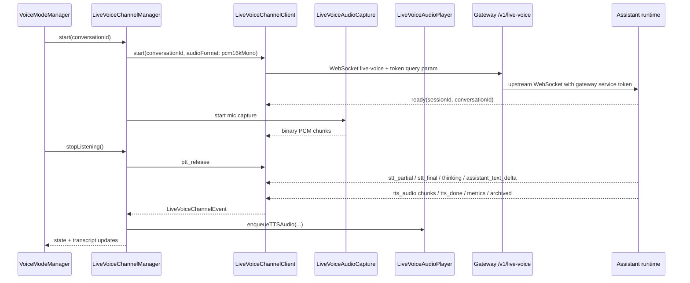
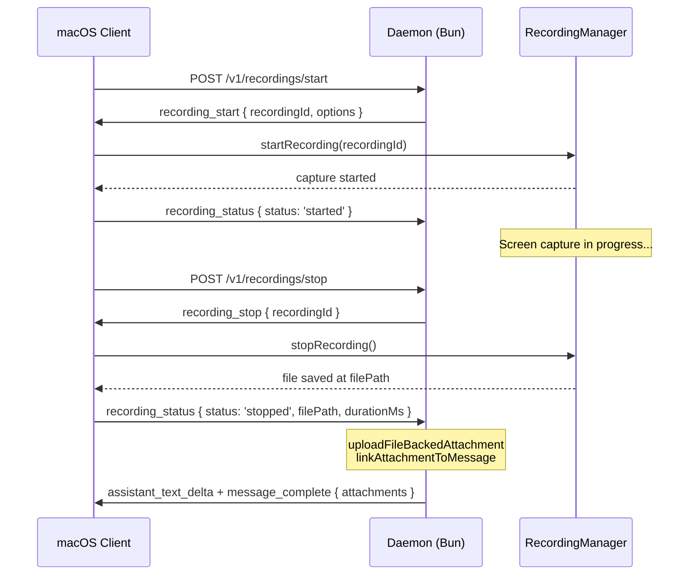
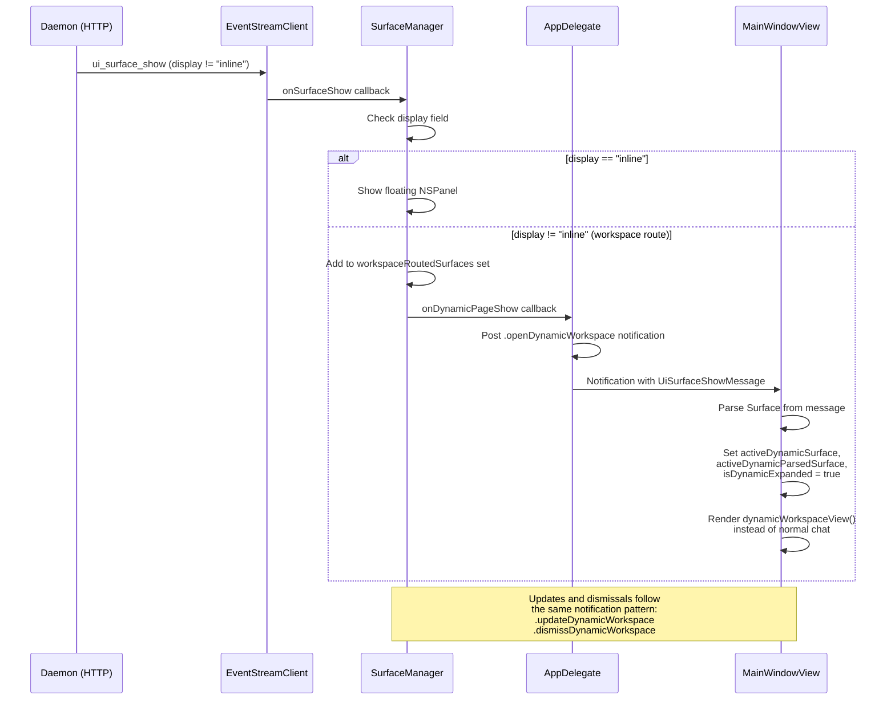
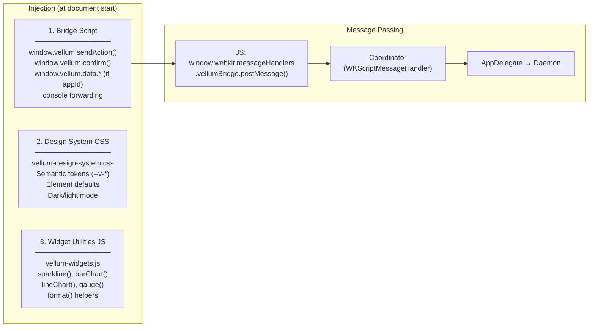
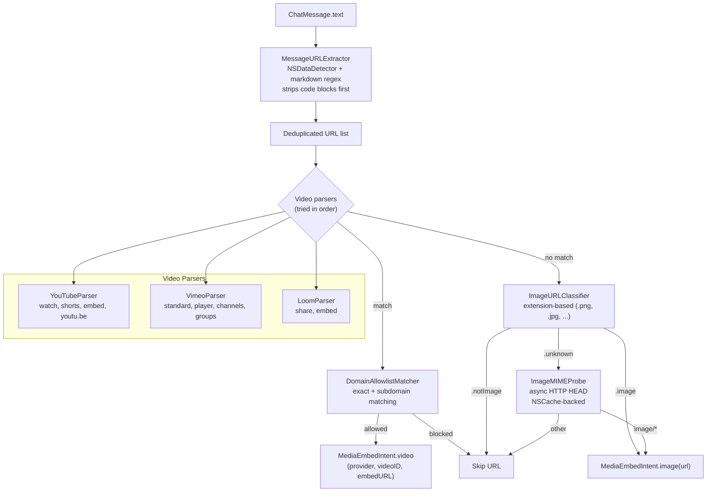

# Clients Architecture

This document owns macOS client architecture details. The repo-level architecture index lives in [`/ARCHITECTURE.md`](../ARCHITECTURE.md).

The iOS client is a Capacitor shell that lives in [`vellum-assistant-platform/web/ios/`](https://github.com/vellum-ai/vellum-assistant-platform); it loads the web app over HTTPS and does not consume any Swift code from this repo.

## macOS App — Service and State Ownership

The macOS app uses a centralized service container (`AppServices`) created once in `AppDelegate` and passed down via dependency injection rather than singletons or ambient state.

### AppServices Container

`AppServices` is the single owner of all long-lived services. `AppDelegate` creates it on launch and passes individual services to windows, views, and managers.

| Service | Type | Purpose |
|---------|------|---------|
| `connectionManager` | `GatewayConnectionManager` | Gateway connection lifecycle, health checks, event stream |
| `surfaceManager` | `SurfaceManager` | Routes `ui_surface_show` messages |
| `toolConfirmationManager` | `ToolConfirmationManager` | Handles tool permission prompts |
| `secretPromptManager` | `SecretPromptManager` | Handles secret input prompts |
| `zoomManager` | `ZoomManager` | Window zoom level (`@Observable`) |
| `settingsStore` | `SettingsStore` | Shared settings state for both SettingsView and SettingsPanel |

### Main Window State

The main window has three dedicated state objects:

| Object | Pattern | Scope |
|--------|---------|-------|
| `MainWindowState` | `ObservableObject` | Cross-view UI state: active panel, dynamic workspace, API key status |
| `ConversationManager` | `ObservableObject` | Conversation CRUD, tab management, conforms to `ConversationRestorerDelegate` |
| `ConversationRestorer` | Plain class with delegate | Daemon conversation restoration (conversation list responses, history hydration) |

`ConversationManager` owns conversation lifecycle. `ConversationRestorer` handles the async daemon communication for restoring conversations on reconnect, delegating state mutations back through the `ConversationRestorerDelegate` protocol for testability.

### Observation Framework Migration

Low-risk types use Swift's `@Observable` macro (Observation framework) instead of `ObservableObject`/`@Published`:

| Type | Consumer pattern |
|------|-----------------|
| `ZoomManager` | Plain `var` (read-only in views) |
| `ConversationInputState` | `@Bindable` (bindings needed for text input) |
| `BundleConfirmationViewModel` | Plain `var` (read-only in view) |

Types that use Combine `$`-prefixed publishers (e.g., `VoiceTranscriptionViewModel`) remain as `ObservableObject`.

### macOS Voice Mode Live Channel

Voice mode can use a local live channel when the current conversation has an ID, the gateway connection is healthy, and no tool permission prompt is pending. `MainWindow` creates one `LiveVoiceChannelManager` and injects it into `VoiceModeManager` with `liveVoiceAvailability: { connectionManager.isConnected }`. `VoiceModeManager.startListening()` then selects the live channel path before the standard turn-based voice path.



**Transport:** `clients/shared/Network/LiveVoiceChannelClient.swift` is the shared WebSocket client. It builds the authenticated request with `GatewayHTTPClient.buildWebSocketRequest(path: "live-voice", params: nil)`, sends the conversation ID in the initial `start` JSON frame, sends mic audio as binary WebSocket frames, sends `ptt_release`, `interrupt`, and `end` control frames, and decodes `ready`, `busy`, `stt_*`, `assistant_text_delta`, `tts_*`, `metrics`, `archived`, and `error` server frames.

**macOS session state:** `clients/macos/vellum-assistant/Features/Voice/LiveVoiceChannelManager.swift` owns the live session state machine (`idle`, `connecting`, `listening`, `transcribing`, `thinking`, `speaking`, `ending`, `failed`). It wires `LiveVoiceAudioCapture` for push-to-talk PCM capture and `LiveVoiceAudioPlayer` for streamed assistant audio. `VoiceModeManager` observes the manager with `withObservationTracking()` and maps live-channel states onto the existing voice-mode UI states (`listening`, `processing`, `speaking`, `idle`).

**Fallback behavior:** When live voice is unavailable at listen start, `VoiceModeManager` uses the standard turn-based voice path. If a live session fails after selection, `VoiceModeManager` attempts one fallback to turn-based voice for that session and then relies on the existing STT/service and Apple Speech permission checks. Pending tool permissions also move voice mode back to the turn-based path so the existing approval prompt behavior stays unchanged.

**Provider requirements:** The assistant side requires a configured streaming STT provider for live partial/final transcripts and a streaming-capable TTS provider for `tts_audio` frames. Missing or non-streaming providers surface as live-channel failures; the macOS fallback path can still use standard voice mode if its own STT or speech-recognition requirements are satisfied.

**V1 scope:** The live channel is local/gateway-scoped. Managed/cloud WebSocket proxy support and latency guarantees are not part of this version. `metrics` events expose timing data for measurement, but the client must not assume a hard p50/p95 latency SLO.

---

## Data Persistence — Where Everything Lives

```mermaid
graph LR
    subgraph "Credential Store"
        K1["API Key<br/>service: vellum-assistant<br/>account: anthropic<br/>stored via secure-keys.ts"]
        K2["Credential Secrets<br/>key: credential/{service}/{field}<br/>stored via secure-keys.ts"]
    end

    subgraph "UserDefaults (plist)"
        UD1["hasCompletedOnboarding"]
        UD2["assistantName"]
        UD3["activationKey (fn/ctrl)"]
        UD4["ambientAgentEnabled"]
        UD5["ambientCaptureInterval"]
        UD6["maxStepsPerSession"]
    end

    subgraph "~/Library/Application Support/vellum-assistant/"
        direction TB
        SL["logs/session-*.json<br/>───────────────<br/>Per-session JSON log<br/>task, start/end times, result<br/>Per-turn: AX tree, screenshot,<br/>action, token usage"]
    end

    subgraph "~/.vellum/workspace/data/db/assistant.db (SQLite + WAL)"
        direction TB
        CONV["conversations<br/>───────────────<br/>id, title, timestamps<br/>token counts, estimated cost<br/>context_summary (compaction)<br/>conversation_type: 'standard' | 'background' | 'scheduled'<br/>memory_scope_id: 'default' | '_pkb_workspace' | 'subagent:&lt;id&gt;'"]
        MSG["messages<br/>───────────────<br/>id, conversation_id (FK)<br/>role: user | assistant<br/>content: JSON array<br/>created_at"]
        TOOL["tool_invocations<br/>───────────────<br/>tool_name, input, result<br/>decision, risk_level<br/>duration_ms"]
        SEG["memory_segments<br/>───────────────<br/>Text chunks for retrieval<br/>Linked to messages<br/>token_estimate per segment"]
        ITEMS["memory_items<br/>───────────────<br/>Extracted facts/entities<br/>kind, subject, statement<br/>confidence, fingerprint (dedup)<br/>verification_state, scope_id<br/>first/last seen timestamps"]
        SUM["memory_summaries<br/>───────────────<br/>scope: conversation | weekly<br/>Compressed history for context<br/>window management"]
        EMB["memory_embeddings<br/>───────────────<br/>target: segment | item | summary<br/>provider + model metadata<br/>vector_json (float array)<br/>Powers semantic search"]
        JOBS["memory_jobs<br/>───────────────<br/>Async task queue<br/>Types: embed, extract,<br/>summarize, backfill, cleanup<br/>Status: pending → running →<br/>completed | failed"]
        ATT["attachments<br/>───────────────<br/>base64-encoded file data<br/>mime_type, size_bytes<br/>Linked to messages via<br/>message_attachments join"]
        REM["reminders<br/>───────────────<br/>One-time scheduled reminders<br/>label, message, fireAt<br/>mode: notify | execute<br/>status: pending → fired | cancelled"]
        SCHED_JOBS["cron_jobs (recurrence schedules)<br/>───────────────<br/>Recurring schedule definitions<br/>cron_expression: cron or RRULE string<br/>schedule_syntax: 'cron' | 'rrule'<br/>timezone, message, next_run_at<br/>enabled, retry_count<br/>Legacy alias: scheduleJobs"]
        SCHED_RUNS["cron_runs (schedule runs)<br/>───────────────<br/>Execution history per schedule<br/>job_id (FK → cron_jobs)<br/>status: ok | error<br/>duration_ms, output, error<br/>Legacy alias: scheduleRuns"]
        TASKS["tasks<br/>───────────────<br/>Reusable prompt templates<br/>title, Handlebars template<br/>inputSchema, contextFlags<br/>requiredTools, status"]
        TASK_RUNS["task_runs<br/>───────────────<br/>Execution history per task<br/>taskId (FK → tasks)<br/>conversationId, status<br/>startedAt, finishedAt, error"]
        WORK_ITEMS["work_items<br/>───────────────<br/>Task Queue entries<br/>taskId (FK → tasks)<br/>title, notes, status<br/>priority_tier (0-3), sort_index<br/>last_run_id, last_run_status<br/>source_type, source_id"]
    end

    subgraph "~/.vellum/ (Root Files)"
        TRUST["protected/trust.json<br/>Tool permission rules"]
    end

    subgraph "~/.vellum/workspace/ (Workspace Files)"
        CONFIG["config files<br/>Hot-reloaded by daemon"]
        ONBOARD_PLAYBOOKS["onboarding/playbooks/<br/>[channel]_onboarding.md<br/>assistant-updatable checklists"]
        ONBOARD_REGISTRY["onboarding/playbooks/registry.json<br/>channel-start index for fast-path + reconciliation"]
        APPS_STORE["data/apps/<br/><app-id>.json + pages/*.html<br/>User-created apps stored here"]
        SKILLS_DIR["skills/<br/>managed skill directories<br/>SKILL.md + TOOLS.json + tools/"]
    end

    subgraph "PostgreSQL (Web Server Only)"
        PG["assistants, users,<br/>channel_accounts,<br/>channel_contacts,<br/>api_tokens, api_keys<br/>───────────────<br/>Multi-tenant management<br/>Billing & provisioning"]
    end
```



---

## Computer Use Session — Detailed Data Flow

Computer use runs through the daemon's main session loop. The daemon decides when to
invoke CU tools, sends `host_cu_request` messages to the client, which executes them
locally via `HostCuExecutor` and posts `host_cu_result` back.

```mermaid
sequenceDiagram
    participant User
    participant Chat as ChatView
    participant AD as AppDelegate
    participant HCE as HostCuExecutor
    participant AX as AccessibilityTree
    participant SC as ScreenCapture
    participant GW as GatewayHTTPClient
    participant ES as EventStreamClient
    participant Daemon as Daemon (Bun)
    participant Claude as Claude API
    participant AV as ActionVerifier
    participant AE as ActionExecutor
    participant macOS as macOS (CGEvents)

    User->>Chat: Type task / Voice / Paste
    Chat->>GW: POST /v1/messages
    GW->>Daemon: HTTP POST
    Note over Daemon: Creates conversation in SQLite<br/>Starts agent loop

    Daemon->>Claude: API call with user message
    Claude-->>Daemon: tool_use (computer use tool)
    Note over Daemon: Model decides CU is needed

    loop host_cu_request / host_cu_result
        Daemon-->>ES: host_cu_request (SSE)
        Note over ES: Contains: tool name, parameters,<br/>step number, reasoning

        ES-->>AD: getOrCreateHostCuOverlay()
        Note over AD: Creates HostCuSessionProxy<br/>Shows SessionOverlayWindow<br/>Pauses ambient agent

        AD->>HCE: execute(request)

        HCE->>AV: verify(action, history)
        Note over AV: Step limit (max 50)<br/>Loop detection (3x same)<br/>Sensitive data check<br/>Destructive key check<br/>System menu bar block<br/>AppleScript sandboxing

        alt allowed
            AV-->>HCE: .allowed
        else needsConfirmation
            AV-->>HCE: .needsConfirmation(reason)
            HCE->>User: confirmation dialog
            User-->>HCE: approve/block
        else blocked
            AV-->>HCE: .blocked(reason)
        end

        HCE->>AE: execute(action)
        Note over AE: click: CGEvent mouse down/up<br/>type: clipboard paste + Cmd+V<br/>key: CGEvent key events<br/>scroll: scroll wheel events<br/>openApp: NSWorkspace launch<br/>appleScript: osascript subprocess

        AE->>macOS: CGEvent injection
        macOS-->>AE: result

        par Parallel Capture
            HCE->>AX: enumerate()
            Note over AX: AXUIElement tree walk<br/>Sets AXEnhancedUserInterface<br/>Filters to interactive elements<br/>Format: [ID] role "title" at (x,y)
            AX-->>HCE: axTree + axDiff
        and
            HCE->>SC: capture()
            Note over SC: ScreenCaptureKit<br/>Exclude own windows<br/>Downscale to 1280x720<br/>JPEG @ 0.6 quality
            SC-->>HCE: base64 screenshot
        end

        HCE->>GW: POST host_cu_result
        Note over GW: Contains: axTree, axDiff,<br/>screenshot, secondaryWindows,<br/>executionResult/error

        GW->>Daemon: HTTP POST
        Daemon->>Claude: API call with observation
        Note over Daemon: Appends tool result<br/>Stores in messages table
        Claude-->>Daemon: next tool_use or end_turn
    end

    Note over Daemon: Agent loop ends (end_turn)
    Daemon-->>ES: message_complete (SSE)
    ES-->>AD: dismissHostCuOverlay()
end
```

---

## Standalone Screen Recording

Standalone screen recording allows users to record their screen without starting a full computer-use session. The daemon manages the recording lifecycle and attaches the resulting video file to the conversation as a file-backed attachment.

### Lifecycle

```
idle → starting → recording → stopping → idle
                                      └→ failed → idle
```

A recording is initiated via dedicated HTTP endpoints (`/v1/recordings/*`). The daemon generates a unique `recordingId`, stores bidirectional mappings (`recordingId ↔ conversationId`), and sends a `recording_start` SSE event to the macOS client. The client manages the actual screen capture via `RecordingManager.swift` and reports status transitions back to the daemon via HTTP.

### Key Files

| File | Role |
|---|---|
| `assistant/src/daemon/handlers/recording.ts` | Daemon handler for start, stop, and status lifecycle events (dedicated HTTP endpoints) |
| `clients/macos/vellum-assistant/ComputerUse/RecordingManager.swift` | macOS-side screen capture using ScreenCaptureKit |

### Messages

| Message | Direction | Transport | Purpose |
|---|---|---|---|
| `recording_start` | Server → Client | SSE | Instructs the client to begin recording with a `recordingId` and optional `RecordingOptions` |
| `recording_stop` | Server → Client | SSE | Instructs the client to stop the active recording |
| `recording_status` | Client → Server | HTTP POST | Reports lifecycle transitions: `started`, `stopped` (with `filePath`), or `failed` (with `error`) |

### Intent Routing

Recording is managed through dedicated HTTP endpoints (`/v1/recordings/*`) rather than intent detection in user messages. Clients call these endpoints directly to start, stop, and query recording status.

### File-Backed Attachments

When a recording stops with a valid `filePath`, the handler:
1. Validates the file exists and reads its size via `statSync`.
2. Creates a file-backed attachment via `uploadFileBackedAttachment()` (avoids reading large video files into memory).
3. Links the attachment to the last assistant message in the conversation (or creates a new one).
4. Sends `assistant_text_delta` + `message_complete` with attachment metadata to the client.

### Recording Flow



---

## Dynamic Workspace — Surface Routing and Layout

The workspace is a full-window mode that replaces the chat UI with an interactive dynamic page (WKWebView) and a pinned composer for follow-up messages. It activates when the daemon sends a `ui_surface_show` message with `display != "inline"`.

### Routing Flow (Chat → Workspace)



**Key types:** `SurfaceManager` routes surfaces by `display` field. `MainWindowView` listens for three notifications (`.openDynamicWorkspace`, `.updateDynamicWorkspace`, `.dismissDynamicWorkspace`) and manages `@State` properties to toggle between chat and workspace views.

### Full-Window Workspace Layout

```
┌────────────────────────────────────────────────┐
│  ← Back    App Title                     ✕     │  ← Toolbar (HStack)
├────────────────────────────────────────────────┤
│                                                │
│                                                │
│           DynamicPageSurfaceView               │  ← WKWebView (fills space)
│              (interactive HTML)                 │
│                                                │
│                                                │
├────────────────────────────────────────────────┤
│  ComposerView (pinned at bottom)               │  ← Follow-up input
└────────────────────────────────────────────────┘
```

The workspace is a `VStack(spacing: 0)` with `VColor.backgroundSubtle` background. The toolbar has back (returns to gallery) and close (exits workspace + panel) buttons. `DynamicPageSurfaceView` grows to fill remaining vertical space. `ComposerView` is pinned at the bottom, bound to the active `ChatViewModel` so users can send follow-up messages while the page is open.

### Widget Injection Pipeline (CSS + JS into WKWebView)

`DynamicPageSurfaceView` is an `NSViewRepresentable` that wraps a `WKWebView`. On creation, three `WKUserScript`s are injected at document start:



**Per-app isolation:** Each app gets its own origin (`https://{appId}.vellum.local/`). The `VellumAppSchemeHandler` handles `vellumapp://` URLs for serving bundled app files from the sandbox directory. Sandbox mode blocks external network requests.

**Data RPC flow:** App JS calls `window.vellum.data.query()` → Coordinator → AppDelegate → Daemon `app_data_request`. Daemon responds with `app_data_response` → `SurfaceManager.resolveDataResponse()` → Coordinator evaluates `window.vellum.data._resolve()` in the WebView.

---


---

## Inline Media Embeds — URL Detection and Rendering Pipeline

Chat messages containing image or video URLs are rendered inline with a click-to-play card (videos) or lazy-loaded preview (images). The pipeline runs entirely on the macOS client with no daemon involvement; settings are persisted to the workspace config file via `WorkspaceConfigIO`.

### Resolution Flow



`MediaEmbedResolver` is the single entry point. It checks whether the feature is enabled, filters out messages that predate the `enabledSince` timestamp, calls `MessageURLExtractor.extractAllURLs`, and runs each URL through the video parsers and image classifier. The result is an array of `MediaEmbedIntent` values consumed by the chat view.

### Rendering Components

| Component | Purpose |
|---|---|
| `InlineImageEmbedView` | `AsyncImage` wrapper; defers loading until `onAppear` to avoid eager fetches in long histories. Tapping opens the URL in the default browser. Silent `EmptyView` on failure. |
| `InlineVideoEmbedCard` | Click-to-play card with state machine (`placeholder` -> `initializing` -> `playing` / `failed`). Tears down webview on `onDisappear` to prevent background audio and memory leaks. |
| `InlineVideoWebView` | `NSViewRepresentable` wrapping `WKWebView`. Uses `VideoEmbedURLBuilder` to add provider-specific autoplay parameters. |
| `InlineVideoEmbedStateManager` | `@MainActor @Observable` class driving the card's lifecycle states. |

### Security Policies

The video webview applies three hardening layers:

1. **Ephemeral storage** -- `WKWebViewConfiguration.websiteDataStore = .nonPersistent()` so no cookies, local storage, or cache survive the session.
2. **Navigation policy** -- The first programmatic load (the embed URL we control) is always allowed. Subsequent `navigationType == .other` loads are checked against a per-provider host allowlist (e.g. `*.googlevideo.com`, `*.ytimg.com` for YouTube; `*.vimeocdn.com` for Vimeo; `*.loomcdn.com` for Loom). Unrecognised hosts and all user-initiated navigations (link clicks, form submissions) are cancelled and opened in the system browser via `NSWorkspace`.
3. **Popup blocking** -- `createWebViewWith` returns `nil`, preventing embedded players from opening new windows.

### Settings Persistence

Appearance-related preferences that must be shared with the daemon live in the workspace config file (`~/.vellum/workspace/config.json`) under `ui`:

```json
{
  "ui": {
    "userTimezone": "America/New_York",
    "mediaEmbeds": {
      "enabled": true,
      "enabledSince": "2026-02-15T12:00:00Z",
      "videoAllowlistDomains": ["youtube.com", "youtu.be", "vimeo.com", "loom.com"]
    }
  }
}
```

`SettingsStore` loads these values on init via `WorkspaceConfigIO.read` and writes them back via `WorkspaceConfigIO.merge`. `ui.userTimezone` provides an explicit user-local timezone hint for daemon-side temporal grounding when profile memory is unavailable. The `enabledSince` timestamp ensures only messages created after the user enabled embeds are eligible, so toggling the feature on doesn't retroactively embed every historical link.

### Key Source Files

| File | Role |
|---|---|
| `clients/macos/.../MediaEmbeds/MessageURLExtractor.swift` | URL extraction (plain text + markdown links, code-block exclusion) |
| `clients/macos/.../MediaEmbeds/ImageURLClassifier.swift` | Extension-based image classification |
| `clients/macos/.../MediaEmbeds/ImageMIMEProbe.swift` | Async HTTP HEAD probe for extensionless URLs |
| `clients/macos/.../MediaEmbeds/DomainAllowlistMatcher.swift` | HTTPS-only domain allowlist with subdomain support |
| `clients/macos/.../MediaEmbeds/MediaEmbedResolver.swift` | Pipeline orchestrator: settings gate, extraction, classification, dedup |
| `clients/macos/.../MediaEmbeds/VideoProviders/YouTubeParser.swift` | YouTube URL parsing (watch, shorts, embed, youtu.be) |
| `clients/macos/.../MediaEmbeds/VideoProviders/VimeoParser.swift` | Vimeo URL parsing (standard, player, channels, groups) |
| `clients/macos/.../MediaEmbeds/VideoProviders/LoomParser.swift` | Loom URL parsing (share, embed) |
| `clients/macos/.../MediaEmbeds/VideoEmbedURLBuilder.swift` | Provider-specific embed URL construction with autoplay params |
| `clients/macos/.../MediaEmbeds/InlineImageEmbedView.swift` | Lazy-loaded inline image rendering |
| `clients/macos/.../MediaEmbeds/InlineVideoEmbedCard.swift` | Click-to-play video card with state machine |
| `clients/macos/.../MediaEmbeds/InlineVideoWebView.swift` | Privacy-hardened WKWebView wrapper |
| `clients/macos/.../MediaEmbeds/InlineVideoEmbedState.swift` | Video embed lifecycle state + manager |
| `clients/macos/.../Features/Settings/MediaEmbedSettings.swift` | Centralized defaults and domain normalization |
| `clients/macos/.../Features/Settings/SettingsStore.swift` | Settings persistence (reads/writes `ui.userTimezone` and `ui.mediaEmbeds` in workspace config) |

---


---

## Avatar System

The avatar uses a simple image-based approach: a custom user-uploaded profile picture, or a colored-circle initial-letter fallback.

**Components:**
- `AvatarAppearanceManager` — Observable singleton that provides `chatAvatarImage` (custom PNG or initial-letter fallback). Watches the custom avatar file for live updates.
- `AvatarCustomizationPanel` — User surface for uploading/clearing a custom profile picture

**Custom avatar storage:** User-uploaded profile pictures are stored at `~/.vellum/workspace/data/avatar/avatar-image.png`. On first launch after upgrade, any legacy avatar from `~/Library/Application Support/vellum-assistant/` is automatically migrated (copied, not moved). The avatar customization panel is accessible from the Identity panel via a "Customize Avatar" CTA button.

**Fallback:** When no custom avatar exists, `buildInitialLetterAvatar(name:)` renders a Forest._600 circle with the assistant's first initial in white.

## Managed Sign-In (macOS)

Managed sign-in allows macOS users to connect to a platform-hosted assistant during first-run onboarding instead of running a local daemon. When a user clicks "Sign in" on the onboarding screen, the app authenticates via WorkOS through the platform, ensures a managed assistant exists (via the idempotent hatch endpoint), and connects to it through platform proxy endpoints.

### Sign-In Flow

```
User clicks "Sign in"
  --> WorkOS authentication (via AuthManager)
  --> ManagedAssistantBootstrapService.ensureManagedAssistant()
      --> If activeAssistant in lockfile: GET /v1/assistants/{id}/  (retrieve by ID)
      --> Otherwise: POST /v1/assistants/hatch/  (idempotent — returns existing or creates new)
  --> Upsert lockfile entry (cloud: "vellum")
  --> Set activeAssistant in lockfile
  --> Configure managed HTTP transport
  --> Proceed to app
```

If managed bootstrap fails, the user stays on the onboarding screen with an error message and a retry option. The app does not proceed until bootstrap succeeds or the user chooses a different path.

### Transport Modes

`GatewayHTTPClient` supports two route modes, selected based on the lockfile entry's `cloud` field:

| Mode | Route Pattern | Auth Header | When Used |
|------|--------------|-------------|-----------|
| `runtimeFlat` | `/health`, `/v1/messages`, `/v1/events` | `Authorization: Bearer {token}` | Local daemon, gateway-proxied remote |
| `platformAssistantProxy` | `/v1/assistants/{id}/health/`, `/v1/assistants/{id}/messages/` | `X-Session-Token: {token}` | Platform-managed assistants (`cloud == "vellum"`) |

The route mode is determined by `GatewayHTTPClient.resolveConnection()` based on the lockfile entry. `AppDelegate` configures the connection via `GatewayConnectionManager`.

### Startup Guardrails

When the current assistant is managed (`isCurrentAssistantManaged == true`), the app skips:
- **Local daemon hatching** -- the platform hosts the daemon, so `vellumCli.hatch()` is not called.
- **Actor credential bootstrap** -- identity is derived from the platform session token, not local actor tokens. The `ensureActorCredentials()` flow is skipped entirely.
- **Server-unavailable re-hatch** -- the reconnection loop does not attempt local re-hatch when the daemon HTTP server is unreachable.

### Credential and State Storage

| Data | Storage | Location |
|------|---------|----------|
| Session token | Credential Store | provider: `session-token` (via `SessionTokenManager`) |
| Platform token file | Filesystem | `~/.vellum/platform-token` (0600 permissions, daemon-readable) |
| Managed lockfile entry | Filesystem | `~/.vellum.lock.json` (entry with `cloud: "vellum"`) |
| Connected assistant ID | Lockfile | `activeAssistant` field in `~/.vellum.lock.json` |

### 401 Handling in Managed Mode

When a managed-mode HTTP request receives a 401, `GatewayHTTPClient` does not attempt the bearer token refresh flow (which is designed for local actor tokens). Instead, it emits a `conversation_error` event so the app can prompt re-authentication through the platform.

### Key Files

| File | Purpose |
|------|---------|
| `clients/shared/App/Auth/ManagedAssistantBootstrapService.swift` | Discover-or-create orchestrator for managed assistants |
| `clients/shared/App/Auth/AuthService.swift` | Platform API methods (`getAssistant`, `hatchAssistant`) |
| `clients/shared/App/Auth/SessionTokenManager.swift` | Session token storage (Credential Store + `~/.vellum/platform-token` file bridge) |
| `clients/shared/Network/GatewayHTTPClient.swift` | Authenticated HTTP client for gateway and platform proxy requests |
| `clients/macos/vellum-assistant/App/AppDelegate.swift` | Transport selection (`configureDaemonTransport`) and startup guardrails |
| `clients/macos/vellum-assistant/Features/Onboarding/OnboardingFlowView.swift` | Onboarding sign-in UI and managed bootstrap invocation |
| `clients/macos/vellum-assistant/Features/MainWindow/Panels/IdentityData.swift` | `LockfileAssistant.isManaged` computed property and managed entry upsert |

---

## GatewayHTTPClient

All HTTP API calls go through `GatewayHTTPClient` — a stateless enum with static async methods that handles gateway and platform proxy requests.

### Pattern

Each API surface gets a focused protocol + struct, instantiated inline on the consuming type:

1. **Define a protocol** describing the operations (e.g. `ConversationClientProtocol`).
2. **Implement a struct** that calls `GatewayHTTPClient.get/post/delete(path:timeout:)`.
3. **Instantiate the struct** inline as a private property on the consuming type (e.g. `private let client: any SurfaceClientProtocol = SurfaceClient()`).
4. Stateless network client structs and protocols (enums with static methods, request builders) are naturally `nonisolated`. Stateful managers that own mutable state should be `@MainActor`. See `clients/AGENTS.md` § "@MainActor Isolation Boundaries".

### Key Files

| File | Purpose |
|------|---------|
| `clients/shared/Network/GatewayHTTPClient.swift` | Authenticated HTTP client for gateway and platform proxy requests |

---

## JWT Credential Refresh

The macOS client uses a single JWT access token for all HTTP authentication, sent as `Authorization: Bearer <jwt>`. The JWT serves as both authentication and identity — there is no separate `X-Actor-Token` header. A credential refresh mechanism maintains valid tokens without re-bootstrapping. Bootstrap is only used for initial credential issuance.

**Credential storage:** The client stores the following in the Credential Store:

| Data | Storage | Purpose |
|------|---------|---------|
| Access token (JWT) | Credential Store | `Authorization: Bearer <jwt>` header for authenticated requests |
| Refresh token | Credential Store | Presented to the refresh endpoint to rotate credentials |
| Access token expiry | Credential Store | Absolute expiry timestamp of the current access token |
| Refresh token expiry | Credential Store | Absolute expiry timestamp of the current refresh token |
| `refreshAfter` | Credential Store | Timestamp at which the client should proactively refresh (80% of access token TTL) |

**Proactive refresh:** A periodic check runs every 5 minutes. If `now >= refreshAfter`, the client calls `POST /v1/guardian/refresh` (through the gateway) with the current refresh token and `Authorization: Bearer <jwt>`. On success, the response provides a new `accessToken`, `refreshToken`, `accessTokenExpiresAt`, `refreshTokenExpiresAt`, and `refreshAfter`. All stored credentials are updated atomically.

**401 recovery:** When an HTTP request receives a 401 response with `{ "code": "refresh_required" }`, `GatewayHTTPClient` attempts a single refresh before surfacing a "Session expired" error. If the refresh succeeds, the original request is retried with the new JWT. If the 401 contains a different code or the refresh fails (e.g., refresh token expired or revoked), the client surfaces the session-expired error and the user must re-bootstrap.

**Shared utility:** `ActorCredentialRefresher` encapsulates the refresh HTTP call, credential update, and error handling. `ActorTokenManager` delegates to this refresher for both proactive and reactive (401-recovery) refresh flows.

**No legacy bootstrap-as-renewal:** macOS no longer re-bootstraps on every launch. Bootstrap runs only when no access token exists at all (first launch or after credential wipe). All subsequent renewal is handled by the refresh flow.

---

## Guardian Approval Card UI

Guardian approval prompts are rendered as structured card UIs in the chat timeline using a "buttons first, text fallback" model. The daemon delivers `GuardianDecisionPrompt` objects via HTTP+SSE, and the client renders them as kind-aware cards with tappable action buttons.

**Kind-aware rendering:** `GuardianDecisionBubble` renders distinct card headers for each canonical request kind:

| Kind | Header | Icon | Accent |
|------|--------|------|--------|
| `tool_approval` | "Tool Approval Required" | `shield.lefthalf.filled` | Warning |
| `pending_question` | "Question Pending" | `questionmark.circle.fill` | Accent |
| `access_request` | "Access Request" | `person.badge.key.fill` | Warning |

**Interaction model:** Each card displays the `questionText` (which includes text fallback directives for `access_request`), action buttons (Approve once / Reject), and secondary metadata (tool name, request code). Buttons submit decisions via `POST /v1/guardian-actions/decision` with the `requestId` and chosen action. The `requestCode` is always visible as a "Ref:" label so guardians can use text-based fallback (`<code> approve` / `<code> reject`) if buttons are not available or not used.

**Shared primitives:** Action buttons use `VButton` (from the design system), and the button row is rendered by `GuardianApprovalActionRow`. Resolved prompts collapse to `ApprovalStatusRow` showing the outcome.

| File | Purpose |
|------|---------|
| `clients/shared/Features/Chat/GuardianDecisionBubble.swift` | Kind-aware guardian approval card with action buttons |
| `clients/shared/Features/Chat/ApprovalActionRow.swift` | `GuardianApprovalActionRow` — renders action buttons using `VButton` |
| `clients/shared/Features/Chat/ApprovalStatusRow.swift` | Collapsed resolved-state display |
| `clients/shared/Features/Chat/ToolConfirmationBubble.swift` | Tool confirmation card with approve/deny actions |

---

## Shared Feature Stores

Cross-platform `ObservableObject` stores in `clients/shared/Features/` encapsulate daemon communication and state management. Platform views delegate data operations to these stores while owning their own UI presentation state.

| Store | Location | Purpose |
|-------|----------|---------|
| `SkillsStore` | `shared/Features/Skills/SkillsStore.swift` | Skills CRUD: list, search, inspect, install, uninstall, enable/disable, configure, draft, and create. Caches inspect results and uses generation counters to handle stale responses. |
| `ContactsStore` | `shared/Features/Contacts/ContactsStore.swift` | Contacts CRUD: list, get, update channel policy, delete. Auto-refreshes on `contactsChanged` daemon broadcasts with 500ms debounce. |
| `DirectoryStore` | `shared/Features/Directory/DirectoryStore.swift` | Directory data: local apps, shared apps, documents. Supports open, delete, share-to-cloud, fork, and bundle operations. Auto-refreshes on `appFilesChanged` broadcasts. |
| `ChannelTrustStore` | `shared/Features/ChannelTrust/ChannelTrustStore.swift` | Guardian state and channel trust management. Composes `ContactsStore` for guardian contact data, manages pending guardian action prompts via daemon HTTP API. |

### Store Patterns

All shared stores follow the same async pattern for daemon communication:

1. Subscribe to the event stream via `EventStreamClient`
2. Send a request message via `GatewayHTTPClient`
3. Iterate the stream with `for await`, matching on the expected response case
4. Update `@Published` state on the main actor
5. Cancel subscription tasks in `deinit` to prevent leaks

Stores use `[weak self]` in all `Task` closures and background subscriptions. Platform views own stores via `@ObservedObject` or `@StateObject` and pass them down to child views.

---

## macOS Deep-Link Send (M11)

The macOS app registers a `vellum://send?message=...` URL scheme handler. When invoked, it creates or reuses a conversation and sends the message through the daemon. This enables external tools, scripts, and Shortcuts to trigger assistant actions on the Mac.

---
