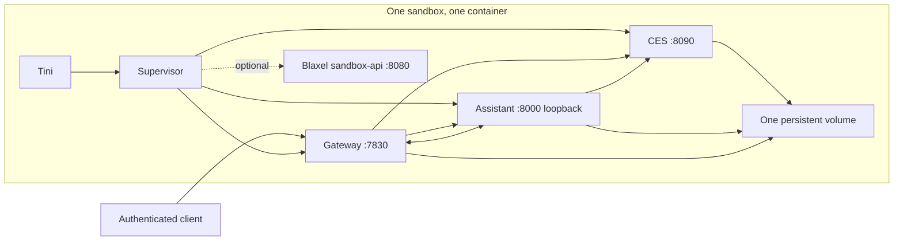

# Combined assistant sandbox image

Experimental packaging for one trusted sandbox: CES, the assistant server, and the gateway run as direct processes under a Python supervisor and Tini. There is no Docker daemon, Docker socket, nested container, or image pull inside the sandbox. BuildKit builds the image on the build host. Existing service Dockerfiles and their default commands are unchanged.

BuildKit's named target contexts reuse `assistant/Dockerfile` for its pinned Bun, Debian, system packages, Chrome, desktop tools, bundled plugins, and runtime assets. The combined layer adds the gateway and CES source and installs their dependencies with the same root frozen lockfile. The core image has no Blaxel dependency. The optional `blaxel` target adds the MIT-licensed sandbox-api v0.2.61 Linux amd64 release binary, verified by its published SHA-256.

## Process and security model



- Startup waits for CES `/readyz` plus its Unix socket, then assistant `/readyz`, then gateway `/readyz`. HTTP 200 with `ready: false` is not ready. Each service has a 300-second startup deadline. The Blaxel adapter starts sandbox-api first and waits for TCP 8080.
- Each child receives a separate environment and working directory. The launcher forwards locale, TLS/proxy settings, `VELLUM_PLATFORM_URL`, and `PLATFORM_ASSISTANT_ID`; it constructs service paths and authentication settings itself. Arbitrary host variables, including `ASSISTANT_API_KEY`, are not passed to the trio. Sandbox-api retains the vendor-injected environment.
- `DISABLE_HTTP_AUTH=false`, `VELLUM_UNSAFE_AUTH_BYPASS=0`, and gateway `RUNTIME_PROXY_REQUIRE_AUTH=true` are enforced. Persistent random CES, actor-signing, and guardian-bootstrap secrets are generated at first launch, never at build time. Changing an environment variable does not rotate these persisted keys.
- `/run/ces-bootstrap`, `/run/assistant-ipc`, and `/run/gateway-ipc` are shared, ephemeral socket directories. CES HTTP credential routes still require its service token and a loopback caller. The assistant binds HTTP to loopback. Only gateway 7830 is intended for application ingress. Do not publish 8000 or 8090. The inherited assistant image also declares 3001, but nothing listens there in this mode.
- Every service has its own process group. An unexpected exit, including exit code zero, or startup timeout stops the whole stack and returns status 1. There is no internal restart loop. An external container/runtime manager may restart the whole image. SIGTERM/SIGINT stop gateway, assistant, CES, then sandbox-api, allowing up to 20 seconds per group before SIGKILL. Use a 90-second outer stop timeout. Tini acts as a subreaper for orphaned descendants. Applications that detach into new sessions are ultimately terminated with the enclosing sandbox.
- Service stdout/stderr is merged with `[service]` prefixes; each forwarded chunk is bounded at 64 KiB. Use the host's bounded log retention. Services also keep their usual on-disk logs. Health checks report later readiness failures but do not kill a live service solely for a failed probe. Docker does not automatically restart an unhealthy container.
- **This is a shared trust boundary.** Processes run as root, matching the assistant image's runtime, with one filesystem and shared network namespace. Separate data directories are organization, not access isolation. A compromised assistant/tool can read gateway/CES files and process environments. This experiment does not preserve the separate-volume visibility guarantees of the production six-volume layout. Do not treat it as a security-equivalent production replacement.

## Persistent data

Mount exactly one volume at `/mnt/assistant`. Startup refuses an ordinary unmounted directory and takes a nonblocking lifetime file lock to prevent two launchers using the same volume.

| Subdirectory | Contents |
| --- | --- |
| `assistant-data/` | Assistant home, `.vellum` state, caches, user package directories; visible as `/data` |
| `workspace/` | Workspace, conversations/data, plugins and user files; visible as `/workspace` |
| `gateway-security/` | Gateway SQLite database, guardian identities, signing/security state |
| `gateway-home/` | Gateway home and fallback local state |
| `ces-data/` | CES metadata, migrations and logs |
| `ces-security/` | CES `keys.enc` and `store.key`; preserve both together |
| `supervisor/` | Service tokens, bootstrap secret, lock, operator guardian session |

Use a new disposable volume for the first test. There is no automatic import of existing six-volume deployments or the earlier Docker-based POC. Copying live SQLite/vault files is not a migration procedure. Keep the deployed POC and its volume untouched.

The current Blaxel test allocation is **4000 MiB**, due to its tier limit; the normal production allocation is **6 GiB**. Volume capacity is not container RAM or image storage. Model assets, caches, browser profiles, packages, logs, and SQLite WAL files compete for these 4000 MiB. Inspect `df -h /mnt/assistant` and `du -xhd1 /mnt/assistant` during testing. The image does not place a Docker layer store on the volume. No quota or automatic log pruning policy is added here.

## Local build and start

Run from the repository root with Docker Buildx/Bake available:

```sh
docker buildx bake -f docker/combined/docker-bake.hcl combined --load
docker volume create vellum-combined-test
docker run -d --name vellum-combined-test \
  --platform linux/amd64 \
  --mount type=volume,src=vellum-combined-test,dst=/mnt/assistant \
  --publish 127.0.0.1:7830:7830 \
  --memory 8192m --cpus 3 --ulimit nofile=35000:35000 \
  --stop-timeout 90 --log-opt max-size=10m --log-opt max-file=2 \
  --env VELLUM_PLATFORM_URL --env PLATFORM_ASSISTANT_ID \
  vellum-combined:local

docker logs -f vellum-combined-test
docker exec vellum-combined-test python3 /app/combined/launcher.py check
```

Export the reachable HTTPS platform URL and the matching assistant ID in your shell before starting. They are not credentials. Do not add the assistant API key to the image or its environment. You can run without platform settings to inspect process readiness, but that does not prove model access.

These Docker flags enforce **aggregate** limits of 8192 MiB and 3 CPU for everything in the container, including tools and child processes. The previous separate-service budgets were assistant 2 CPU/3072 MiB, gateway 0.5 CPU/768 MiB, and CES 0.5 CPU/384 MiB inside an 8192 MiB sandbox. They do **not** become per-process limits in this image. The launcher does not create cgroups or set informational `VELLUM_MEMORY_LIMIT`/`VELLUM_CPU_LIMIT` values that would imply enforcement. Blaxel chooses its CPU allocation from the sandbox tier; confirm it separately. One process can exhaust the shared budget and affect all services.

For logs on Blaxel, use its sandbox logs/console. Directly launched processes are not registered as sandbox-api `/process` jobs. The platform's Docker `HEALTHCHECK` support is not assumed; explicitly run `launcher.py check` through the authenticated sandbox process API.

## Credential provisioning and authenticated no-tool chat

Readiness does not mean the platform credential exists. In particular, CES `ASSISTANT_API_KEY` by itself does not populate the vault. The contract is:

1. Authenticate with gateway guardian bootstrap (or an existing authenticated guardian).
2. `POST /v1/secrets` to gateway with `{"type":"credential","name":"vellum:platform_base_url","value":"<HTTPS URL>"}`.
3. Write `vellum:assistant_api_key` through the same endpoint **after** the URL. The assistant's secret handler refreshes providers.
4. Read both values back through local authenticated CES `GET /v1/credentials/<name>` and compare without printing them.
5. Send an authenticated chat and require a completed reply, not just an accepted POST.

The bundled operator helper implements this sequence. It stores its guardian session under `supervisor/guardian.json`, refreshes it on subsequent calls, and never prints tokens or credential values:

```sh
docker exec -it vellum-combined-test python3 /app/combined/operate.py provision
docker exec vellum-combined-test python3 /app/combined/operate.py smoke
```

`provision` prompts for the key without echo. Supply `--platform-url https://platform.example.com` if the container environment has no URL. For noninteractive input, use `--key-stdin` and pipe a protected local file through `docker exec -i`; do not put the key in command arguments. For Blaxel, upload a mode-0600 temporary key file using its authenticated file API, run the same command with stdin redirected from that file, then remove the temporary file. Do not put it in the image/import directory or print its contents. The persisted vault copy is intentional.

`smoke` checks rejection of missing/invalid gateway tokens, creates a fresh conversation, asks for exactly `COMBINED_OK` without tools, and polls for up to 300 seconds. It fails on provider errors, tool calls, missing completion, or a different reply. A successful no-tool check proves guardian auth, gateway routing, credential-backed provider access, and one completed turn. It does not prove tool capabilities or lifecycle persistence. An HTTP 422 can still mean missing/invalid platform credentials or unavailable model access. The earlier live POC's credential repair has not been confirmed by this change.

The helper bootstraps only its disposable test guardian. If a volume already has another guardian and bootstrap is refused, use the existing authenticated guardian with the endpoint contract above. Do not erase gateway security data to bypass pairing. Serialize helper invocations because refresh tokens rotate.

## Blaxel image import and new sandbox

Official requirements checked on 2026-09-23: custom images need a running sandbox-api on 8080; volumes attach at sandbox creation; one volume attaches to one sandbox at a time. The optional adapter supplies the API as a fourth direct process. It is intentionally Linux amd64 for this test. Sources: [custom images](https://docs.blaxel.ai/Sandboxes/Templates), [volumes](https://docs.blaxel.ai/Sandboxes/Volumes), [creation-time environment](https://docs.blaxel.ai/Sandboxes/Variables-and-secrets), [sandbox-api v0.2.61](https://github.com/blaxel-ai/sandbox/releases/tag/v0.2.61), and [CLI image import](https://github.com/blaxel-ai/toolkit/blob/main/cli/push.go).

All commands below are **operator-run deployment actions**. They create a separate test, not an update to the existing POC. Use a registry/repository you control and authenticate locally first:

```sh
docker buildx bake -f docker/combined/docker-bake.hcl blaxel --load
# Optional local adapter check: run the same volume/start command above with
# vellum-combined-blaxel:local. Do not publish sandbox-api 8080 publicly.

COMBINED_IMAGE=ghcr.io/example/vellum-combined-blaxel:test
docker buildx bake -f docker/combined/docker-bake.hcl blaxel \
  --set "blaxel.tags=$COMBINED_IMAGE" --push
docker buildx imagetools inspect "$COMBINED_IMAGE"
```

Create an import directory outside this checkout with the following `blaxel.toml`. Replace the image with your exact tag **and digest** from the preceding output:

```toml
name = "vellum-combined-test"
type = "sandbox"
image = "ghcr.io/example/vellum-combined-blaxel:test@sha256:REPLACE_WITH_DIGEST"
```

```sh
bl push --directory /path/to/import-directory --type sandbox --yes
# For a private registry, add --docker-config /path/to/private/docker-config.json.
# Use an auth-containing config as required by Blaxel, not a credential-helper-only file.
bl get image sandbox/vellum-combined-test -ojson
```

Record the returned image reference/build identity. Blaxel transforms the registry image into its sandbox format. Image import, image-size limits, startup environment, and volume mount behavior still need a live test on your tier. A local image build cannot establish these properties.

Using the same pinned SDK version as the POC, run this in a separate test directory after installing `@blaxel/core@0.3.21` with `bun add --exact`. Set `BL_API_KEY`, `BL_WORKSPACE`, `VELLUM_PLATFORM_URL`, and `PLATFORM_ASSISTANT_ID` in your local environment. Choose unique new names; creation deliberately fails rather than adopting existing resources:

```ts
import { createVolume, SandboxInstance } from "@blaxel/core";

const volume = await createVolume({ body: {
  metadata: { name: "combined-test-data" },
  spec: { size: 4000, region: "us-pdx-1" },
} });
if (!volume.data) {
  throw new Error("Volume creation failed; inspect the response privately.");
}
const sandbox = await SandboxInstance.create({
  name: "combined-test", image: "sandbox/vellum-combined-test:latest",
  memory: 8192, region: "us-pdx-1",
  ports: [{ target: 7830, protocol: "HTTP" }],
  volumes: [{ name: "combined-test-data", mountPath: "/mnt/assistant", readOnly: false }],
  envs: [
    { name: "VELLUM_PLATFORM_URL", value: process.env.VELLUM_PLATFORM_URL! },
    { name: "PLATFORM_ASSISTANT_ID", value: process.env.PLATFORM_ASSISTANT_ID! },
  ],
});
const result = await sandbox.process.exec({
  command: "python3 /app/combined/launcher.py check", waitForCompletion: true,
});
console.log({ status: result.status, exitCode: result.exitCode });
```

The initial check may precede service readiness. Wait for `all services ready` and retry it; do not interpret sandbox `DEPLOYED` as application readiness. Run credential provisioning and `operate.py smoke` through the authenticated sandbox process API. Keep application access authenticated, and do not create a public preview as a shortcut. Only gateway 7830 belongs in the additional ports list; Blaxel manages its API port separately. Do not forward the local `BL_API_KEY` to the trio.

## Acceptance boundaries and next tests

Local validation on 2026-09-23 built both targets and started the real services in a network-isolated Docker Desktop container (Linux amd64 under emulation). Guardian bootstrap/refresh, missing/invalid token rejection, synthetic credential provisioning/readback, graceful exit 0, forced CES failure exit 1, and missing-mount rejection passed. A second local container reopened the same disposable CES and guardian state. No real platform key or model request was used. These local checks do not establish Blaxel behavior. A deployment is not validated until the user runs the Blaxel steps and authenticated chat against a real platform key. Keep these milestones separate:

1. **Disk across replacement:** after a successful chat, record a workspace marker, completed message IDs/text, a test CES secret (compare without printing), guardian identity, and service signing-key hashes. Stop gracefully, delete only the new test sandbox, wait until the volume attachment clears, and recreate with the same image and volume. Verify without reseeding or rerunning provisioning. Then test an image upgrade separately. This has not been tested on Blaxel.
2. **RAM/process continuity across standby:** start a RAM-only nonce server, record boot ID, service PIDs/start times, and nonce. Close streams/previews, stop polling, and confirm actual standby in vendor activity/billing telemetry. Resume with one authenticated request and compare all evidence. `DEPLOYED` is not standby evidence; fixed sleep, archive/unarchive, snapshots, and delete/recreate are not substitutes. Background service traffic may prevent standby. This has not been tested.
3. **Tools and runtime compatibility:** exercise terminal execution/streaming, a real browser tool action, desktop display, OAuth callbacks, timers, long-lived connections, and resource-pressure behavior independently. Chrome/desktop binaries are retained but kernel privileges, display setup, and tool routing are not proven by their presence. The launcher disables the extra assistant tool sandbox, as in the POC, and relies on the outer sandbox boundary.
4. **Package persistence:** Bun/Python user paths under `/data` and workspace virtual environments have persistent locations. System `/usr`, `/opt`, `/etc`, and rootfs installs do not survive sandbox replacement. The launcher does not advertise a Kata runtime or initialize its persistent apt chroot. Workspace entrypoint hooks still run through the existing assistant entrypoint. Docker-dependent tools and meet-bot containers have no Docker daemon here and remain unsupported. This is not full Kata capability parity.

## Focused checks

```sh
python3 -m unittest discover -s docker/combined -p 'test_*.py'
docker buildx bake -f docker/combined/docker-bake.hcl blaxel --load
```

The tests use actual child processes and local HTTP readiness responses. They cover dependency ordering, startup failure, clean unexpected exits, readiness timeout, termination escalation and descendants, migration readiness, credential provisioning/readback, authenticated refresh rotation, and chat completion/tool rejection. CI runs the focused tests; the full image build is a separate local/operator check.
