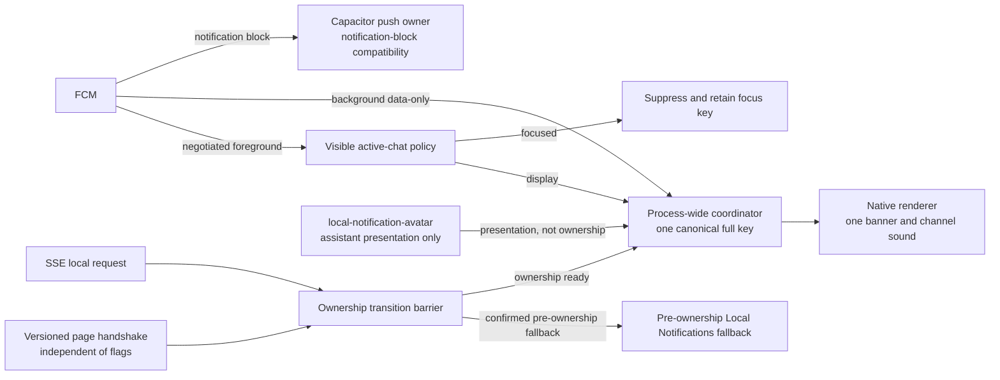

# Notification avatar and local delivery QA ledger

This is the canonical manual QA ledger for notification sender avatars and
local notification ownership. It covers the independent
`push-avatar-sender` and `local-notification-avatar` flags, compatibility
routes, duplicate prevention, sender presentation, and tap behavior. Platform
READMEs describe implementation details and link here for rollout evidence.

The feature PR remains draft and is not rollout-ready until the signed-device
evidence required by the rollout gates is recorded here.

## Status definitions

| Status | Meaning |
| --- | --- |
| `PASS` | The stated check ran on the required target and build and produced the expected result. Evidence can be a retained CI artifact or exact local reproduction data with observed command output recorded here. Automated coverage can be `PASS` without making a manual route `PASS`. |
| `BLOCKED` | The check cannot run because a named prerequisite is unavailable. The blocker and the action needed to clear it must be recorded. |
| `NOT RUN` | The check has not been executed. It is not known to pass or fail, and no rollout claim may rely on it. |

No manual route is currently `PASS`.

## Feature flags

The flags are independent and default off.

| `push-avatar-sender` | `local-notification-avatar` | Expected behavior |
| --- | --- | --- |
| Off | Off | Remote push, Electron, iOS local, Android local, and browser notifications stay plain. Android still negotiates coordinator ownership for local delivery when the shell supports it. |
| On | Off | Platform APNs and FCM payloads may carry sender metadata, and Electron notifications may use the desktop sender treatment. iOS local and browser notifications stay plain. Android local delivery keeps coordinator ownership but uses app or plain presentation. |
| Off | On | App-originated iOS notifications may use their native local owner, Android local requests may use assistant presentation through the already-negotiated coordinator, and supported browser notifications may use the prepared avatar as `icon`. Remote push and Electron sender decoration stay off. |
| On | On | Each supported route may use sender presentation, subject to its own capability, identity, permission, and payload checks. Ownership and deduplication rules remain the same as in the single-flag cases. |

`push-avatar-sender` controls remote push payload decoration and Electron
sender presentation. It does not advertise Android token capability or live
foreground ownership. `local-notification-avatar` selects the iOS app-local
owner, Android app-local assistant presentation, and browser notification
icons. Android ownership negotiation is independent of that presentation flag,
so switching it off does not undo the shared coordinator route. Neither flag
turns a failed or ambiguous native post into permission to schedule a second
notification.

## Ownership routes

Each selected delivery has one owner. A watchdog can bound a bridge wait, but
it cannot create another notification after native ownership may have begun.

| Route | Owner and duplicate boundary |
| --- | --- |
| iOS APNs | APNs delivers the notification. `NotificationService` may rewrite it with an `INSendMessageIntent` before the one-shot content handler returns. It is separate from the app-local owner. |
| iOS app-local | Before ownership, the legacy Capacitor Local Notifications path remains available. After a capable `SenderNotification.post` accepts the full key, the native plugin alone submits rewritten or plain content. A timeout or unknown result stays native-owned. |
| Android notification-block FCM | The existing Capacitor/Firebase route remains the owner for compatibility. |
| Android data-only FCM | `SafeMessagingService` claims the full key in the process-wide `NotificationDeliveryCoordinator`. Background delivery renders there. Negotiated foreground delivery visits the web focus policy, then returns to the same native coordinator for any actual post. JavaScript does not display a second banner. |
| Android app-local | Before negotiated ownership, the existing Capacitor Local Notifications route owns delivery. After the versioned, page-bound handshake begins, local posts are serialized behind that transition and use the same process-wide coordinator as data-only FCM in every flag state. `local-notification-avatar` controls assistant presentation, not ownership. |
| macOS native sender | The renderer supplies only an exact, prepared in-memory sender identity. The native notifier owns a sender-bearing post when it is supported; otherwise delivery is confirmed unavailable before the shared Electron fallback owns the plain post. |
| Windows native helper | The shared Electron request feeds the Windows helper. It owns the toast and retains the existing action and acknowledgment behavior. |
| Linux Electron fallback | The existing Electron notification owns delivery and retains its icon and acknowledgment behavior. Linux has no native helper binary. |
| Browser and PWA | The page's existing Notification constructor owns delivery. Under `local-notification-avatar`, a verified prepared avatar is supplied as `icon`. A synchronous constructor failure permits one immediate plain retry, with no timer-based retry. |

Android FCM and SSE converge before native display:



## Process-RAM boundaries

- Prepared sender identity is exact and scoped. The iOS sender rewrite and
  Android assistant presentation require the same scope id, assistant id, and
  native sender id that was prepared. Missing or stale iOS identity still lets
  the selected native owner submit plain content. Android coordinator ownership
  likewise does not require sender presentation. The macOS renderer exposes
  sender data only for the exact in-memory identity. Assistant names are
  presentation data, not cache identity.
- iOS and Android retain bounded prepared generations and terminal delivery
  results in native process RAM. Android local delivery and data-only FCM share
  one `NotificationDeliveryCoordinator`; the numeric Android notification id
  is separate from its full string key.
- Android live ownership is versioned and page-generation-bound. Page start,
  renderer loss, activity destruction, or bridge destruction clears live
  ownership through the serialized bridge lane. It does not clear coordinator
  results. A WebView reload therefore cannot make an accepted delivery
  eligible for a second banner, while a native process restart clears the
  in-memory coordinator.
- Android foreground focus suppression uses bounded process-RAM tombstones
  keyed by the same canonical full key for FCM and SSE. This preserves a focus
  decision if the user navigates between the two arrivals. It is not a durable
  delivery ledger.
- The canonical Android full key uses the first semantically present candidate
  in correlation id, delivery id, then request key order. Values are trimmed
  with the shared JavaScript-equivalent whitespace rule and capped at 512
  UTF-16 code units. A present overlength candidate fails closed instead of
  falling through. The original SSE delivery id remains the acknowledgment id.
- Avatar files may persist in bounded hash-addressed caches, but those files do
  not confer sender identity, delivery ownership, or a durable deduplication
  claim.

## Required case catalog

Every applicable ownership route must cover the following cases before
rollout. Record target-specific results in the manual execution ledger and
attach logs, screenshots, screen recordings, or CI links that identify the
build.

### Flags and compatibility

- All four flag combinations, including independent changes while the app is
  running.
- New web with old shell, old web with new shell, and capability absent or
  malformed.
- Flag-off behavior identical to the existing plain route.
- Android token capability and coordinator ownership negotiation remain
  independent from both presentation flags.
- Android enable and disable transitions with local and FCM arrivals on both
  sides of the transition.
- Enabled to disabled with warm prepared RAM. Remote enabled with local
  disabled, and local enabled with remote disabled.
- macOS native permission confirmation follows `push-avatar-sender`, including
  when `local-notification-avatar` has the opposite value.
- Main renderer, pop-out, reconnect, and self-hosted scope behavior, including
  preparation that begins before a reconnect changes the resolved scope.
- Logout or scope change while avatar preparation or a permission prompt is in
  flight. Late work for the prior identity must not publish or confirm.

### Delivery ownership

- Exactly one banner and one owned sound for FCM-first, SSE-first,
  simultaneous, slow preparation, and late completion orders.
- First post after in-process preparation, with the prepared sender used on the
  selected presentation route.
- Startup and cold-memory delivery before preparation, page publication, or a
  foreground handler exists. Measure when the early plain route becomes ready
  and record the observation without promising a fixed time.
- Native success, invalid avatar, slow or hung rewrite, late native completion
  after the JavaScript watchdog, OS add failure, denied permission, disabled
  Android channel, and duplicate callback.
- Same-key in-flight sharing, same-key retries, and dismissal before a matching
  second arrival. Dismissal does not erase a retained coordinator result or
  permit a second banner.
- Distinct deliveries with identical title and body text remain distinct when
  their full keys differ.
- No fallback after a native call returns unknown, malformed, blocked, or
  never resolves. Explicit pre-ownership unavailability may use the legacy
  owner.
- Permission denied, channel blocked, constructor failure, native helper
  unavailable, and native post failure.
- Android foreground active-conversation suppression while the chat route is
  visible, including navigation away between matching FCM and SSE arrivals.
- Page or WebView reload, renderer loss, activity destruction, bridge
  destruction, native process restart, and a stale prior-page handshake call.
- Named reply, proactive, credential, Telegram, and failed-activity
  notification pipelines. Each must preserve its existing selection,
  acknowledgment, suppression, and action behavior while using the selected
  owner exactly once.

### Identity, content, and taps

- Multiple assistants and scopes in one process, with no sender leakage across
  identities.
- Rename and avatar update for one identity, including old cached bytes and a
  late generation. The stable sender id must remain constant while fresh
  presentation replaces the old name or picture.
- Assistant A to B switch followed by late A completion. A must not overwrite
  B's prepared identity, title, avatar, permission confirmation, or tap scope.
- Removed assistant and stale pop-out publication, including a pop-out-only B
  publication after the main renderer has selected another identity.
- Missing, blank, padded, malformed, JSON-string, overlength, and Unicode
  whitespace identity and correlation inputs. A malformed present scoped
  identity must fail closed for navigation.
- Missing avatar, stale prepared generation, avatar reset, malformed base64,
  digest mismatch, non-PNG bytes, excessive dimensions, and allocation
  failure. Each case must post plainly or fail closed according to the route,
  without unsafe bitmap allocation.
- Exact naming precedence: event `assistantName`, exact-assistant identity
  store, verified in-memory name, then title fallback. The title appears once,
  with group or subtitle suppression when it supplied the name.
- Every name source missing with a blank title uses app presentation. A valid
  name with a blank title still uses assistant presentation.
- Title fallback never seeds verified name memory. Equal real-name and title
  values are not mistaken for title-fallback provenance.
- Plain fallback preserves the original title and body without duplicating the
  assistant name.
- Stable native sender identity across name changes. No cached title or name
  may become identity.
- Tap routing preserves scope, assistant, conversation, original delivery id,
  correlation id, category, action id, and deep-link metadata. Android
  shortcuts keep their existing identifiers and self-hosted restrictions.
- Android local delivery without a server delivery id uses its synthetic tap
  id while preserving scoped navigation and acknowledgment metadata.

### Privacy and reset

- Account, organization, connection origin, and self-hosted origin changes,
  including identical self assistant ids under different connections.
- Logout, removed assistant, or scope change during avatar preparation or a
  permission prompt. Late preparation and confirmation must not republish the
  prior identity.
- Stale pop-out publication, process-local identity resets, and process restart
  with empty delivery memory.
- Existing byte-cache miss and corruption behavior remains unchanged. No new
  identity files or delivery receipt files appear on disk.

### Platform presentation

- iOS app-local native owner and APNs/NSE remote rewrite are exercised
  separately, including foreground/background transitions, warm-cache,
  cold-cache, and service-extension expiry.
- Apple surfaces cover banner, Notification Center, Lock Screen, app
  attribution and badge, alternate app icon, hidden previews, Focus modes,
  notification summaries, category actions, and cold-launch taps. Record which
  surface the operating system chose for each run rather than inferring parity
  from one presentation. Existing sound behavior must remain unchanged.
- Android app-local and FCM routes exercise permission, channel, icon, sound,
  actions, conversation shortcut, and foreground focus behavior.
- Android covers FCM/SSE both orders and simultaneous arrival in one process,
  bridge reload, old/new shell and web combinations, background and cold
  launch, legacy notification-block FCM, trimmed top-level `delivery_id`, and
  the synthetic local tap id. A new native process starts with empty coordinator
  memory and no cross-restart reconciliation promise.
- macOS exercises native Communication Notification presentation, plain
  Electron fallback, permission confirmation, action callbacks, delegate
  forwarding, and helper identity in a packaged signed build.
- Windows exercises helper toast avatar, title, subtitle, actions, tap, and
  acknowledgment parity. No sender is introduced on a plain fallback.
- Linux receives one regression smoke for the existing Electron icon,
  configured delivery acknowledgment, and action ownership.
- Browser and PWA exercise every supported browser, multi-assistant isolation,
  missing avatar, synchronous constructor fallback, click after an assistant
  switch, supported and ignored icon behavior, and all four flag combinations.
  No badge or service-worker behavior changes.

### Permission confirmation

- A native macOS grant shows the assistant captured before the prompt and the
  natural confirmation copy exactly once.
- Denied or unknown authorization posts no confirmation. Confirmation failure
  cannot reverse the granted permission status.
- Flag off, missing sender, and scope ending during the prompt use the defined
  plain fallback without exposing stale identity.
- Windows and macOS Electron permission probes remain single plain banners and
  preserve their existing shown and failed outcomes.

### Reliability boundaries

- A successful OS scheduling or add call does not prove that the notification
  was visible. Visibility evidence must name the actual banner, center, Lock
  Screen, Focus, summary, or browser surface observed.
- This work adds no APNs exactly-once delivery guarantee. The iOS extension's
  one-shot content handler prevents an app-side double submission, but APNs and
  the operating system retain their existing delivery semantics.
- Process-RAM coordination adds no process-restart duplicate guarantee. A new
  process intentionally begins without retained delivery results.
- A browser or operating system may ignore or restyle
  `NotificationOptions.icon`; setting the field is not display evidence.
- An early plain banner before avatar preparation is an accepted fallback.
  Measure its frequency and readiness timing without promising a fixed one- or
  two-second bound.

## Automated evidence

These checks are automated evidence only. They do not change any manual route
to `PASS`.

Run context:

- Date: 2026-09-11.
- Implementation diff base: `becaddab79e8f724cce19a0fc406872874de9bf6`.
  Implementation head before the documentation-only changes: `92e14958c7`.
  The focused Wave 8 checkpoint is `46764186d7`.
- Host: local macOS host; operating-system version was not recorded. Bun was
  1.3.10. The Xcode and SDK command output reported Xcode 26.2. TypeScript came
  from the pinned workspace dependencies. The Android command found no Java
  runtime.
- Evidence retention: no persistent log URLs or CI artifacts were retained for
  these local runs. The results below are command output observed during this
  implementation run, paired with the reproduction commands or command groups.

Focused Wave 8 web command at `46764186d7`:

```sh
cd clients/web
bun test src/runtime/android-sender-notification.test.ts src/runtime/push-registration.test.ts src/runtime/notifications.test.ts src/runtime/notifications-permission.test.ts src/hooks/use-notification-intent-sync.test.tsx src/hooks/use-push-registration.test.tsx
```

Tap-navigation command at `92e14958c7`:

```sh
cd clients/web
bun test src/hooks/use-notification-tap-navigation.test.tsx
```

The exact reproduction command derives the 28-file changed-test manifest, finds
each file's nearest owning workspace, and runs one Bun process per file:

```bash
set -euo pipefail
implementation_base=becaddab79e8f724cce19a0fc406872874de9bf6
implementation_head=92e14958c7
test_manifest=$(git diff --name-only --diff-filter=ACMRT \
  "$implementation_base" "$implementation_head" | \
  rg '\.(test|spec)\.(ts|tsx)$')
test_count=$(awk 'NF { count++ } END { print count + 0 }' <<< "$test_manifest")
test "$test_count" -eq 28
while IFS= read -r test_file; do
  test_dir=$(dirname "$test_file")
  while [ "$test_dir" != "." ] && [ ! -f "$test_dir/package.json" ]; do
    test_dir=$(dirname "$test_dir")
  done
  if [ "$test_dir" = "." ]; then
    bun test "$test_file"
  else
    relative_test=${test_file#"$test_dir"/}
    (cd "$test_dir" && bun test "$relative_test")
  fi
done <<< "$test_manifest"
```

This exact group was rerun outside the sandbox at `92e14958c7` on the local
macOS host with Bun 1.3.10. It exited 0 with 695 total tests passed. The
native-auth file reported 7/7, including the two OAuth loopback cases that the
earlier sandbox run could not bind. The separate focused native-auth command
was:

```sh
cd packages/electron-desktop
bun test src/native-auth.test.ts
```

The focused command also exited 0 with 7/7 passed.

iOS host-less command at `92e14958c7`:

```sh
cd clients/ios
xcodebuild test -project App/App.xcodeproj -scheme AppTests -destination 'platform=iOS Simulator,name=iPhone 17' CODE_SIGNING_ALLOWED=NO
```

Typecheck command group at `92e14958c7`:

```bash
set -euo pipefail
(cd clients/web && bunx tsc --noEmit)
(cd assistant && bun run typecheck:fast)
(cd packages/ipc-contract && bunx tsc --noEmit)
(cd packages/electron-desktop && bunx tsc --noEmit)
(cd clients/macos && bunx tsc --noEmit)
(cd clients/windows && bunx tsc --noEmit)
(cd clients/linux && bunx tsc --noEmit)
```

The exact scoped web lint rerun used one `bunx eslint` invocation over the 41
changed TypeScript and TSX paths from the same base and head:

```bash
set -euo pipefail
cd clients/web
web_lint_manifest=$(git -C ../.. diff --name-only --diff-filter=ACMRT \
  becaddab79e8f724cce19a0fc406872874de9bf6 92e14958c7 -- clients/web | \
  rg '\.(ts|tsx)$' | sed 's#^clients/web/##')
web_lint_count=$(awk 'NF { count++ } END { print count + 0 }' <<< "$web_lint_manifest")
test "$web_lint_count" -eq 41
web_lint_paths=()
while IFS= read -r source_file; do
  web_lint_paths+=("$source_file")
done <<< "$web_lint_manifest"
bunx eslint "${web_lint_paths[@]}"
```

It exited 0 on the local macOS host with Bun 1.3.10.

Focused Android command attempted at `92e14958c7`:

```sh
cd clients/android
./gradlew :app:testDevDebugUnitTest --tests ai.vellum.assistant.AndroidPushRegistrationPluginTest --tests ai.vellum.assistant.AndroidSenderNotificationPluginTest --tests ai.vellum.assistant.SafeMessagingServiceTest --tests ai.vellum.assistant.push.NotificationDeliveryCoordinatorTest --tests ai.vellum.assistant.push.PushDataMessageTest
```

| Check | Status | Evidence |
| --- | --- | --- |
| Six focused Wave 8 web suites | `PASS` | 155 tests passed: 13 + 50 + 66 + 3 + 19 + 4. |
| Notification tap navigation suite | `PASS` | 15 tests passed. |
| Branch-wide changed TypeScript exact-manifest rerun | `PASS` | The exact 28-file, one-process-per-file command above exited 0 outside the sandbox with 695 total tests passed at `92e14958c7` using Bun 1.3.10. Native-auth passed 7/7. |
| Electron native-auth OAuth loopback suite | `PASS` | The exact unrestricted command above passed 7/7 on the local macOS host with Bun 1.3.10. |
| iOS host-less AppTests | `PASS` | `xcodebuild test` passed on an iPhone 17 simulator with `CODE_SIGNING_ALLOWED=NO`. This is automated simulator evidence, not signed-device evidence. |
| Scoped changed-web ESLint | `PASS` | Completed without findings. |
| Package typechecks | `PASS` | Web, assistant fast typecheck, ipc-contract, electron-desktop, macOS, Windows, and Linux completed without errors. |
| Focused Android Gradle tests | `BLOCKED` | The exact focused Gradle command could not start because no Java runtime is installed in the validation environment. |

## Prerequisites

1. The companion platform PR,
   [vellum-assistant-platform#10502](https://github.com/vellum-ai/vellum-assistant-platform/pull/10502),
   is open and green, but is not merged or applied. Before the app consumer PR
   merges, both flag definitions must exist in the target platform
   configuration, that configuration must be applied, and both flags must be
   verified `OFF`.
2. Record the app commit, platform deployment, environment, account, selected
   assistant scope, and exact flag values for every manual run.
3. Install Java and the Android SDK needed by the focused Gradle command.
4. Provide an Android device with Play services, the matching
   `google-services.json`, Firebase access, and a lower-environment data-only
   push sender.
5. Provide a signed iOS build whose app target carries the App Group and
   Communication Notifications entitlements. The embedded Notification Service
   Extension carries the matching App Group only and must not carry the
   restricted Communication Notifications entitlement. A physical device and
   APNs access are also required.
6. Provide a signed packaged macOS build whose helper and native notifier
   identities match the containing app and whose provisioning profile grants
   Communication Notifications.
7. Provide a packaged Windows target and a Linux target suitable for their
   notification smoke checks.
8. Define the supported browser and PWA set, including versions and operating
   systems, before browser evidence can be collected.

## Manual execution ledger

There are no manual `PASS` entries. Update a row only after its route and all
applicable cases have reproducible target evidence.

| Route | Status | Blocker or next evidence required |
| --- | --- | --- |
| iOS app-local native owner | `BLOCKED` | A signed app build and physical iOS device are required. |
| iOS APNs and Notification Service Extension | `BLOCKED` | A signed app/NSE build, physical iOS device, and APNs delivery are required. |
| Android app-local owner | `BLOCKED` | A physical Android device, matching Firebase configuration, and Java/Gradle validation are required. |
| Android data-only FCM owner | `BLOCKED` | A physical Android device, matching Firebase configuration, and an authorized data-only push sender are required. |
| macOS packaged native sender | `BLOCKED` | A signed packaged build with matching helper identity and Communication Notifications entitlement is required. |
| macOS plain Electron fallback | `NOT RUN` | Run the packaged fallback with sender delivery disabled or native support unavailable. |
| macOS push-flag permission confirmation | `NOT RUN` | Run grant, deny, unknown, stale identity, missing avatar, and confirmation-failure cases in the packaged app. |
| Windows helper parity | `NOT RUN` | Run the packaged helper toast matrix and tap/action acknowledgment checks. |
| Linux Electron smoke | `NOT RUN` | Run one smoke covering the existing icon, configured delivery acknowledgment, and action ownership. |
| Browser and PWA | `BLOCKED` | The supported browser, version, operating-system, and PWA-install set is undefined. |

The single Linux smoke is recorded as regression evidence. It is not a rollout
gate for the two sender flags.

### Per-run manual evidence

Append one row for every manual execution, including failures and partial runs.
Use exact flag values and distinguish warm avatar cache, cold avatar cache,
retained delivery memory, and cold process memory. Do not replace the route
blocker summary with this table.

| Build/revision | OS/device/browser version | Flags | Route | Cache state | Expected | Actual | Evidence | Status |
| --- | --- | --- | --- | --- | --- | --- | --- | --- |
| Not recorded | Not recorded | Not recorded | No manual run | Not recorded | Not recorded | Not observed | No manual evidence retained | `NOT RUN` |

## Support summary

| Surface | Implemented support boundary | Current manual support evidence |
| --- | --- | --- |
| iOS | Separate app-local native owner and APNs/NSE remote rewrite, both capable of Communication Notification sender presentation. | Blocked on signed device evidence. |
| Android | Shared process coordinator for app-local and data-only FCM, with flag-independent page-bound ownership negotiation and foreground focus routing. The local flag controls assistant presentation only, and notification-block FCM remains compatible. | Blocked on device, Firebase, and Java prerequisites. |
| macOS | Exact in-memory renderer sender identity, native notifier when supported, plain Electron fallback, and grant-only push-flag permission confirmation. | Native route blocked on signing/helper identity; fallback and permission routes not run. |
| Windows | Shared sender payload maps to the native helper toast while plain fallback remains sender-free. | Not run. |
| Linux | Existing Electron notification retains icon, delivery acknowledgment, and action ownership. | One smoke not run. |
| Browser and PWA | Prepared local avatar can become `NotificationOptions.icon`, with one synchronous plain constructor fallback and unchanged click routing. | Blocked until the supported browser set is defined. |

## Boundaries

- This ledger covers notification sender presentation, ownership,
  deduplication, sound ownership, and tap metadata. It does not approve a
  production flag rollout or replace platform monitoring.
- Delivery coordinator results and prepared identities are bounded process RAM,
  not durable receipts. Process restart is an intentional boundary.
- Disk avatar caches retain their existing format, validation, download, and
  eviction behavior. They are presentation caches only.
- The browser work does not add badges or service-worker notification changes.
- Registered remote notification suppression, permissions, categories,
  numeric notification ids, tap actions, acknowledgments, Android channels,
  icons, sounds, and shortcuts stay owned by their established routes except
  where the ownership table explicitly assigns the native coordinator.

## Rollout gates

The feature PR stays draft and is not rollout-ready until all of these gates
are satisfied:

1. The companion platform flag definitions are merged, applied, verified to
   exist, and verified `OFF` before the app consumer PR merges.
2. The focused automated suites, scoped lint, full web typecheck, and focused
   Android Gradle tests pass in an environment with their prerequisites.
3. Signed physical-device evidence records `PASS` for both iOS routes, both
   Android routes, and the packaged macOS native route.
4. The macOS fallback and permission rows and Windows parity row record `PASS`
   with evidence.
5. The supported browser set is defined and every browser/PWA case records
   `PASS`.
6. All four flag combinations, compatibility routes, duplicate and sound
   invariants, identity isolation, failure fallbacks, and tap metadata have
   evidence on every applicable surface except Linux. Linux retains exactly one
   recorded regression smoke and is not a rollout gate.
7. Rollout begins with both flags off and uses a separately approved staged
   enablement and rollback plan.
